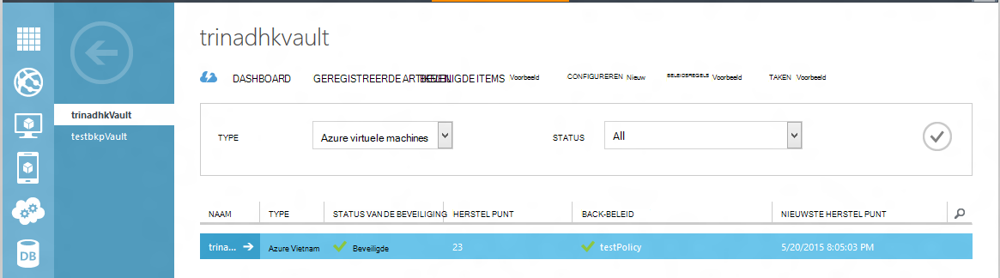
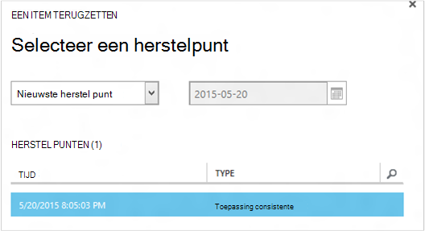
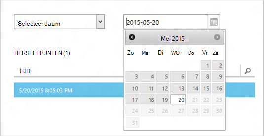
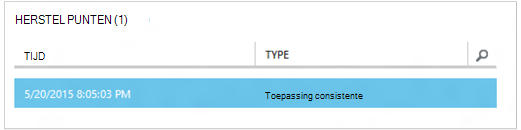
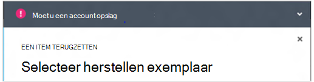
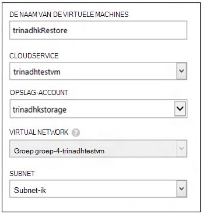
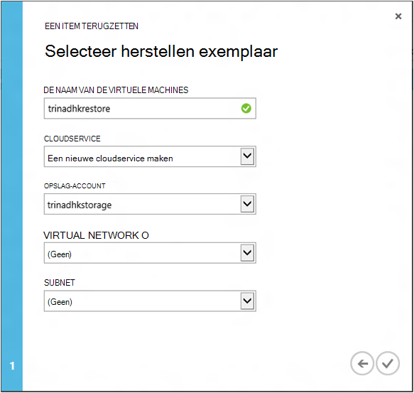
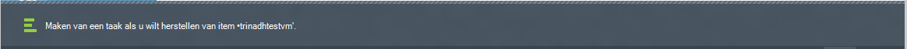
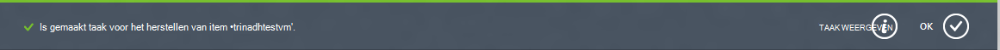
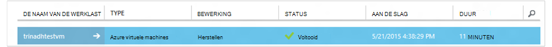

<properties
    pageTitle="Een virtuele machines herstellen uit back-up | Microsoft Azure"
    description="Meer informatie over het herstellen van een Azure virtuele machines van een herstelpunt"
    services="backup"
    documentationCenter=""
    authors="trinadhk"
    manager="shreeshd"
    editor=""
    keywords="back-up van herstellen. hoe u herstelt; herstelpunt;"/>

<tags
    ms.service="backup"
    ms.workload="storage-backup-recovery"
    ms.tgt_pltfrm="na"
    ms.devlang="na"
    ms.topic="article"
    ms.date="08/02/2016"
    ms.author="trinadhk; jimpark;"/>

# Virtuele machines in Azure herstellen

> [AZURE.SELECTOR]
- [VMs herstellen in Azure-portal](backup-azure-arm-restore-vms.md)
- [VMs herstellen in klassieke-portal](backup-azure-restore-vms.md)

Een virtuele machine op een nieuwe VM terugzetten uit de back-ups die zijn opgeslagen in een Azure back-kluis met de volgende stappen uit.

## Werkstroom herstellen

### 1. kiest u een item herstellen

1. Ga naar het tabblad **Beveiligde Items** en selecteer de virtuele machine die u wilt herstellen voor een nieuwe VM.

    

    De kolom **Herstel punt** in de **Beveiligde Items** pagina kunt u het aantal punten herstel voor een virtuele machine nagaan. De kolom **Nieuw herstel punt** ziet u de tijd van de meest recente back-up van waaruit een virtuele machine kan worden hersteld.

2. Klik op **herstellen** om de wizard **een Item terugzetten** te openen.

    

### 2. kiest u een herstelpunt

1. Klik in het scherm **selecteren een herstelpunt** kunt u vanuit de nieuwste herstel komma of een vorige punt in tijd terugzetten. De standaardoptie geselecteerd wanneer de wizard wordt geopend is *Nieuw herstel punt*.

    

2. Als u een eerder punt in tijd, kiest u de optie **Selecteer datum** in de vervolgkeuzelijst en selecteer een datum in het kalenderbesturingselement door te klikken op het **agendapictogram**. In het besturingselement, worden alle datums waarvoor herstel punten worden ingevuld in een lichte, grijze tint en kunnen worden geselecteerd door de gebruiker.

    

    Nadat u op een datum in het kalenderbesturingselement, verwijst het herstelproces is beschikbaar op dat datum in herstel punten onderstaande tabel worden weergegeven. De kolom van de **tijd** wordt aangegeven dat de tijd waarop de momentopname is gemaakt. De kolom **Type** geeft de [consistentie](https://azure.microsoft.com/documentation/articles/backup-azure-vms/#consistency-of-recovery-points) van de komma herstel. De tabelkop toont het aantal herstel punten beschikbaar op die dag haakjes.

    

3. De komma herstel uit de tabel **Herstel punten** en klik op de pijl-rechts om naar het volgende scherm te gaan.

### 3. een doellocatie opgeven

1. Geef in het scherm **selecteren herstellen exemplaar** details van waar u de virtuele machine herstellen.

  - Geef de naam VM: In een bepaald cloudservice, moet de naam van de VM uniek zijn. Wordt niet ondersteund te weinig schrijven bestaande VM. 
  - Selecteer een cloudservice voor VM: dit is verplicht voor het maken van een VM. U kunt een bestaande cloudservice gebruikt of maak een nieuwe cloudservice.

        Whatever cloud service name is picked should be globally unique. Typically, the cloud service name gets associated with a public-facing URL in the form of [cloudservice].cloudapp.net. Azure will not allow you to create a new cloud service if the name has already been used. If you choose to create select create a new cloud service, it will be given the same name as the virtual machine – in which case the VM name picked should be unique enough to be applied to the associated cloud service.

        We only display cloud services and virtual networks that are not associated with any affinity groups in the restore instance details. [Learn More](../virtual-network/virtual-networks-migrate-to-regional-vnet.md).

2. Selecteer een account opslag voor VM: dit is verplicht voor het maken van de VM. U kunt selecteren uit bestaande opslag-accounts in hetzelfde gebied, als de back-up van Azure-kluis. Wordt het opslag-accounts die Zone redundante of van Premium opslagtype zijn niet ondersteund.

    Maak een account opslag van ondersteunde configuratie voordat u begint terugzetten als er geen accounts opslagruimte met ondersteunde configuratie.

    

3. Selecteer een virtueel netwerk: het virtuele netwerk (VNET) voor de virtuele machine moet zijn geselecteerd op het moment van de VM maken. De terugzetten UI ziet u alle VNETs binnen dit abonnement die kunnen worden gebruikt. Het is niet verplicht een VNET selecteren voor de herstelde VM: is mogelijk verbinding maken met de herstelde virtuele machine via internet zelfs als de VNET wordt niet toegepast.

    Als de geselecteerde cloudservice gekoppeld aan een virtueel netwerk is, kunt u het virtuele netwerk niet wijzigen.

    

4. Selecteer een subnet: geval de VNET subnetten heeft, al dan niet standaard het eerste subnet wordt geselecteerd. Kies het subnet van uw keuze in de vervolgkeuzelijst opties. Ga voor meer informatie subnet netwerken extensie in de [portal startpagina](https://manage.windowsazure.com/), gaat u naar **Virtuele netwerken** en selecteert u het virtuele netwerk en inzoomen op configureren subnet details kunnen zien.

    

5. Klik op het pictogram **verzenden** in de wizard om de details verzenden en een terugzettaak te maken.

## De bewerking voor terugzetten bijhouden
Nadat u alle informatie in de wizard terugzetten invoer en deze ingediend probeert Azure back-up te maken van een taak om bij te houden van de bewerking voor terugzetten.

Als het maken van de taak voltooid is, ziet u een mailpop-melding die aangeeft dat de taak is gemaakt. U kunt meer informatie krijgen door te klikken op de knop **Taak weergeven** die u naar het tabblad **taken gaat** .

Zodra de bewerking voor terugzetten is voltooid, wordt deze gemarkeerd als voltooid in het tabblad **taken** .

Na het terugzetten van de virtuele machine moet u mogelijk het selectievakje extensies op de oorspronkelijke VM en [de eindpunten wijzigen](../virtual-machines/virtual-machines-windows-classic-setup-endpoints.md) voor de virtuele machine in de portal van Azure opnieuw te installeren.

## Stappen na herstellen
Als u van een verdeling op basis van cloud initialisatie Linux zoals Ubuntu, veiligheidsredenen gebruikmaakt, wachtwoord geblokkeerd posten herstellen. Gebruik VMAccess extensie op de herstelde VM [het wachtwoord opnieuw](../virtual-machines/virtual-machines-linux-classic-reset-access.md)in te stellen. Het is raadzaam SSH toetsen op deze onderzoeken gebruiken om te voorkomen opnieuw instellen van wachtwoord bericht herstellen. 

## Back-up voor herstelde VMs
Als u VM naar dezelfde cloudservice met dezelfde naam als oorspronkelijk een back-up VM gemaakt teruggezet hebt, blijft back-up op de VM bericht terugzetten. Als u hebt hersteld Vm naar een andere cloudservice of een andere naam voor de herstelde VM opgegeven, wordt deze verwerkt als een nieuwe VM en moet u setup back-up voor herstelde VM.

## Een VM herstellen tijdens Azure DataCenter noodgevallen
Azure back-up kunt herstellen back-up gemaakt VMs Datacenter voor de gepaarde geval de primaire gegevens centreren waar VMs ervaringen noodgevallen worden uitgevoerd en u een back-up kluis geografische-redundante worden geconfigureerd. Tijdens deze scenario's, moet u een opslag-mailaccount dat aanwezig in gepaarde datacenter is selecteren en de rest van het herstelproces hetzelfde blijft. Azure back-up wordt de service berekenen van gepaarde geografische gebruikt de herstelde virtuele machine maken. 

## Domeincontroller VMs herstellen
Back-up van het domein Controller (domeincontroller) virtuele machines is een ondersteunde scenario met Azure back-up. Echter enkele Wees voorzichtig tijdens het terugzetten. De ervaring herstellen verschilt sterk domeincontroller VMs in een enkel-domeincontroller configuratie versus VMs in een multi-domeincontroller-configuratie.

### Bepaalde domeincontroller
De VM kan worden hersteld (zoals elke andere VM) van de Azure portal of via PowerShell.

### Meerdere DCs
Als er een multi-domeincontroller-omgeving, hebben de hun eigen manier om gegevens synchroon houden. Wanneer een oudere back-punt herstelde *zonder de juiste voorzorgsmaatregelen is*, kan het USN herstelprocedure functies in een omgeving met meerdere domeincontroller aanrichten. De juiste manier voor het herstellen van dergelijke een VM is deze in de modus Active Directory terugzetten modus opstarten.

De uitdaging ontstaat omdat modus Active Directory terugzetten-modus in Azure wordt aangegeven ontbreekt. Als u bijvoorbeeld een VM herstellen, niet u dus de Azure-portal gebruiken. De enige ondersteunde herstellen om is op de schijf herstellen via PowerShell.

>[AZURE.WARNING] Voor het domeincontroller VMs in een omgeving met meerdere-domeincontroller, gebruik niet de Azure-portal voor herstellen! Alleen PowerShell gebaseerd herstellen wordt ondersteund

Meer informatie over het [probleem met USN ongedaan maken](https://technet.microsoft.com/library/dd363553) en de strategieën voorgestelde te doen.

## VMs herstellen met speciale netwerkconfiguraties
Azure back-up ondersteunt back-up voor speciale netwerkconfiguraties van virtuele machines te volgen.

- VMs onder taakverdeling (interne en externe)
- VMs met meerdere gereserveerde IP-adressen
- VMs met meerdere NIC 's

Deze configuraties dwingend volgen overwegingen bij het herstellen van deze.

>[AZURE.TIP] Gebruik PowerShell gebaseerd herstellen stroom om de speciale netwerkconfiguratie van VMs bericht herstellen opnieuw te maken.

### Terugzetten vanuit de gebruikersinterface:
Bij het terugzetten vanuit UI, **kiest u altijd een nieuwe cloudservice**. Houd er rekening mee dat aangezien portal duurt niet verplicht parameters tijdens herstellen stroom, VMs teruggezet met behulp van de gebruikersinterface gaan verloren de speciale netwerkconfiguratie die ze hebben. Met andere woorden, worden herstellen VMs normale VMs zonder configuratie van taakverdeling of meerdere NIC of meerdere gereserveerde IP.

### Terugzetten vanuit PowerShell:
PowerShell heeft de mogelijkheid om alleen de schijven VM back-up terugzetten en niet de virtuele machine te maken. Dit is handig wanneer virtuele machines waarvoor speciale netwerk configuraties mentined bovenstaande herstellen.

Als u wilt de VM bericht terugzetten schijven volledig opnieuw moet maken, als volgt te werk:

1. De schijven herstellen uit back-kluis via [Azure back-up PowerShell](../backup-azure-vms-classic-automation.md#restore-an-azure-vm)

2. Maken van de zoekconfiguratie VM is vereist voor taakverdeling / meerdere NIC/veelvoud gereserveerde IP bij gebruik van de PowerShell-cmdlets en gebruiken om te maken van de VM van gewenste configuratie.
    - VM in cloudservice met [interne taakverdeling](https://azure.microsoft.com/documentation/articles/load-balancer-internal-getstarted/) maken
    - VM verbinding maken met [Internet die tegenover elkaar liggen taakverdeling] maken (https://azure.microsoft.com/en-us/documentation/articles/load-balancer-internet-getstarted/)
    - VM met [meerdere NIC's](https://azure.microsoft.com/documentation/articles/virtual-networks-multiple-nics/) maken
    - VM met [meerdere gereserveerde IP-adressen](https://azure.microsoft.com/documentation/articles/virtual-networks-reserved-public-ip/) maken

## Volgende stappen
- [Fouten corrigeren](backup-azure-vms-troubleshoot.md#restore)
- [Virtuele machines beheren](backup-azure-manage-vms.md)
