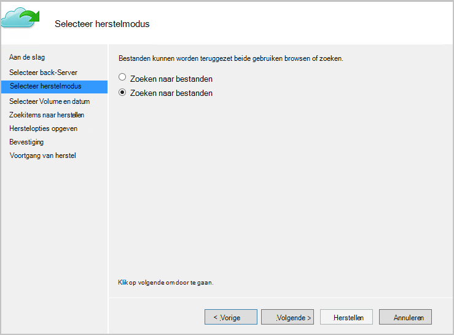

<properties
   pageTitle="Gegevens terugzetten op een Windows-Client of Windows Server uit het implementatiemodel resourcemanager met Azure | Microsoft Azure"
   description="Informatie over het herstellen van een Windows-Server of Windows-Client."
   services="backup"
   documentationCenter=""
   authors="saurabhsensharma"
   manager="shivamg"
   editor=""/>

<tags
   ms.service="backup"
   ms.workload="storage-backup-recovery"
     ms.tgt_pltfrm="na"
     ms.devlang="na"
     ms.topic="article"
     ms.date="08/02/2016"
     ms.author="trinadhk; jimpark; markgal;"/>

# Bestanden terugzetten op een Windows server of Windows-clientcomputer resourcemanager implementatiemodel gebruiken

> [AZURE.SELECTOR]
- [Azure-portal](backup-azure-restore-windows-server.md)
- [Klassieke portal](backup-azure-restore-windows-server-classic.md)

In dit artikel worden de benodigde stappen voor het uitvoeren van twee typen bewerkingen voor het herstellen:

- Gegevens terugzetten op dezelfde computer waaruit de back-ups zijn die u hebt gemaakt.
- Gegevens herstellen naar een andere computer.

In beide gevallen zijn de gegevens worden opgehaald uit de kluis Azure herstel Services.

[AZURE.INCLUDE [learn-about-deployment-models](../../includes/learn-about-deployment-models-rm-include.md)]klassieke implementatiemodel.

## Gegevens op de machine herstellen
Als u per ongeluk een bestand verwijderd en u dezelfde computer wilt (waaruit de back-up wordt opgehaald) te herstellen, kunt de volgende stappen u de gegevens te herstellen.

1. Open de module **Back-up van Microsoft Azure** .
2. Klik op **Gegevens herstellen** om de werkstroom te starten.

    

3. Selecteer de * *deze server (*yourmachinename*) ** optie om te zetten de back-upbestand op dezelfde computer.

    

4. Kiezen om te **Zoeken naar bestanden** of **bestanden zoeken**.

    Laat de standaardoptie als u van plan bent om een of meer bestanden waarvan het pad is bekend te herstellen. Als u over de mapstructuur van de twijfelt, maar u wilt zoeken naar een bestand, kiest u de optie **Zoeken naar bestanden** . Deze sectie wordt gaat we verder met de standaardoptie.

    

5. Selecteer het volume van waaruit u wilt terugzetten van het bestand.

    U kunt terugzetten vanuit een willekeurige plaats in de tijd. Datums die worden weergegeven in **vet** in het kalenderbesturingselement geven de beschikbaarheid van een punt herstellen. Wanneer een datum is geselecteerd, op basis van uw back-planning (en het succes van een back-up), kunt u een punt in tijd in de vervolgkeuzelijst **tijd** ingedrukt.

    

6. Selecteer de items herstellen. U kunt meervoudige selectie mappen/bestanden die u wilt herstellen.

    

7. Geef de parameters herstel.

    

  - Hebt u een optie van terugzetten naar de oorspronkelijke locatie (waarin het bestand/tijdelijke map zou worden overschreven) of naar een andere locatie in dezelfde computer.
  - Als het bestand of de map die u wilt terugzetten in de doellocatie bestaat, kunt u kopieën (twee versies van hetzelfde bestand) maken, de bestanden in de doellocatie overschrijven of het herstellen van de bestanden die aanwezig zijn in de doellijst overslaan.
  - Het wordt ten zeerste aanbevolen dat u de standaardoptie van het herstellen van de ACL's op de bestanden die zijn wordt hersteld verlaten.

8. Zodra deze invoer worden geleverd, klikt u op **volgende**. De werkstroom herstel, waarbij de bestanden in deze computer wordt hersteld, wordt gestart.

## Herstellen naar een andere computer
Als de hele server verbroken wordt, kunt u nog steeds gegevens van Azure back-up terugzetten naar een andere computer. De volgende stappen uit illustreren de werkstroom.  

De onderstaande stappen terminologie bevat:

- *Bron machine* – de oorspronkelijke computer waaruit de back-up is die u hebt gemaakt en welke is momenteel niet beschikbaar.
- *Target machine* – de computer waarop de gegevens worden hersteld.
- *Voorbeeld kluis* – het herstelproces is Services kluis waaraan de *bron machine* en *Target machine* zijn geregistreerd.  

> [AZURE.NOTE] Back-ups die u vanaf een computer hebt gemaakt worden niet hersteld op een computer waarop een eerdere versie van het besturingssysteem wordt uitgevoerd. Bijvoorbeeld als back-ups worden geopend vanaf een computer met Windows 7, kan deze worden teruggezet op een Windows 8 of hoger machine. De omgekeerd worden echter niet houdt waar.

1. Open de **Back-up van Microsoft Azure** uitlijnen in op de *doel-computer*.
2. Controleer of de *doel-computer* en de *bron-computer* om de dezelfde herstel Services zijn geregistreerd.
3. Klik op **Gegevens herstellen** om de werkstroom te starten.

    

4. Selecteer **een andere server**

    

5. Geef het kluis referentie-bestand dat overeenkomt met aan de *steekproef kluis*. Als de kluis referentie-bestand is ongeldig (of verlopen) kunt u een nieuw kluis referentie-bestand downloaden uit de *steekproef kluis* in de portal van Azure. Zodra het kluis referentie-bestand is opgegeven, wordt de kluis herstel Services ten opzichte van het kluis referentie-bestand wordt weergegeven.

6. Selecteer de *bron machine* in de lijst met computers weergegeven.

    

7. Selecteer de optie voor het **Zoeken naar bestanden** of **bestanden zoeken** . In deze sectie gebruiken we de optie **Zoeken naar bestanden** .

    

8. Selecteer de volume en de datum in het volgende scherm. Zoek naar de map/bestandsnaam die u wilt herstellen.

    

9. Selecteer de locatie waar de bestanden moeten worden teruggezet.

    

10. Geef de versleuteling wachtwoordzin dat is opgegeven tijdens de registratie *van de computer van de bron* voor de *steekproef kluis*.

    

11. Zodra de invoer is opgegeven, klikt u op **herstellen**, wat inhoudt dat het herstellen van de back-upbestanden op de opgegeven bestemming geactiveerd.

## Volgende stappen
- Nu dat u uw bestanden en mappen hebt hersteld, kunt u [uw back-ups beheren](backup-azure-manage-windows-server.md).
