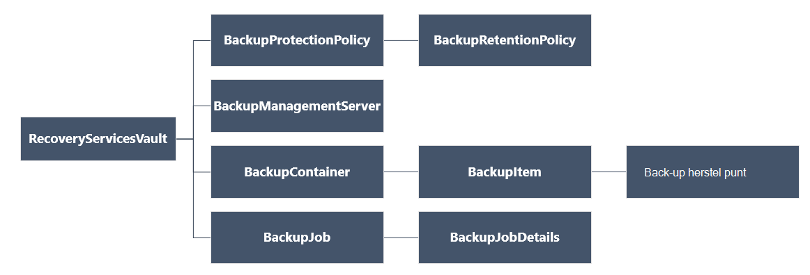

<properties
   pageTitle="Implementeren en beheren van back-ups voor resourcemanager geïmplementeerd VMs via PowerShell | Microsoft Azure"
   description="PowerShell gebruiken om te implementeren en beheren van back-ups in Azure wordt aangegeven voor VMs resourcemanager geïmplementeerd"
   services="backup"
   documentationCenter=""
   authors="markgalioto"
   manager="cfreeman"
   editor=""/>

<tags
   ms.service="backup"
   ms.devlang="na"
   ms.topic="article"
   ms.tgt_pltfrm="na"
   ms.workload="storage-backup-recovery"
   ms.date="08/03/2016"
   ms.author="markgal; trinadhk"/>

# <a name="deploy-and-manage-backups-for-resource-manager-deployed-vms-using-powershell"></a>Implementeren en beheren van back-ups voor resourcemanager geïmplementeerd VMs via PowerShell

> [AZURE.SELECTOR]
- [Resourcemanager](backup-azure-vms-automation.md)
- [Klassieke](backup-azure-vms-classic-automation.md)

In dit artikel leest u hoe u een back-up en herstellen van een Azure virtuele machine (VM) uit een kluis herstel Services met Azure PowerShell-cmdlets. Een kluis herstel Services is een bron Azure resourcemanager en wordt gebruikt om het beveiligen van gegevens en activa in Azure back-up- en Azure sites worden hersteld. U kunt een kluis herstel Services beveiligen VMs Azure servicebeheer geïmplementeerd, evenals VMs Azure resourcemanager geïmplementeerd.

>[AZURE.NOTE] Azure heeft twee implementatiemodellen voor het maken en werken met resources: [resourcemanager en klassiek](../resource-manager-deployment-model.md). In dit artikel is bedoeld voor gebruik met VMs die zijn gemaakt met behulp van het model resourcemanager.

In dit artikel begeleidt u bij het PowerShell gebruiken voor een VM beveiligen en herstellen van gegevens uit een herstelpunt.

## <a name="concepts"></a>Concepten

Als u niet bekend met de back-up van Azure-service, voor een overzicht van de service bent, neemt u [Wat Azure back-up is?](backup-introduction-to-azure-backup.md) Voordat u begint, moet u ervoor zorgen dat u de essentials over de vereisten voor het werken met Azure back-up en de beperkingen van de huidige VM back-oplossing bedekt.

Pas PowerShell effectief gebruiken, is het nodig zijn voor meer informatie over de hiërarchie van objecten en vanaf waar u moet beginnen.



Zie de [Back-up-Azure - herstel Services Cmdlets](https://msdn.microsoft.com/library/mt723320.aspx) in de bibliotheek Azure een verwijzing naar de AzureRmRecoveryServicesBackup PowerShell-cmdlets.
Zie de [Cmdlets voor de Service van de Azure herstel](https://msdn.microsoft.com/library/mt643905.aspx)de AzureRmRecoveryServicesVault PowerShell-cmdlet verwijzing.


## <a name="setup-and-registration"></a>Installatie en registratie

Moet beginnen:

1. [Download de meest recente versie van PowerShell](https://github.com/Azure/azure-powershell/releases) (de minimaal vereiste versie is: 1.4.0)

2. De beschikbare Azure back-up PowerShell-cmdlets vinden door te typen van de volgende opdracht uit:

```
PS C:\> Get-Command *azurermrecoveryservices*

CommandType     Name                                               Version    Source
-----------     ----                                               -------    ------
Cmdlet          Backup-AzureRmRecoveryServicesBackupItem           1.4.0      AzureRM.RecoveryServices.Backup
Cmdlet          Disable-AzureRmRecoveryServicesBackupProtection    1.4.0      AzureRM.RecoveryServices.Backup
Cmdlet          Enable-AzureRmRecoveryServicesBackupProtection     1.4.0      AzureRM.RecoveryServices.Backup
Cmdlet          Get-AzureRmRecoveryServicesBackupContainer         1.4.0      AzureRM.RecoveryServices.Backup
Cmdlet          Get-AzureRmRecoveryServicesBackupItem              1.4.0      AzureRM.RecoveryServices.Backup
Cmdlet          Get-AzureRmRecoveryServicesBackupJob               1.4.0      AzureRM.RecoveryServices.Backup
Cmdlet          Get-AzureRmRecoveryServicesBackupJobDetails        1.4.0      AzureRM.RecoveryServices.Backup
Cmdlet          Get-AzureRmRecoveryServicesBackupManagementServer  1.4.0      AzureRM.RecoveryServices.Backup
Cmdlet          Get-AzureRmRecoveryServicesBackupProperties        1.4.0      AzureRM.RecoveryServices
Cmdlet          Get-AzureRmRecoveryServicesBackupProtectionPolicy  1.4.0      AzureRM.RecoveryServices.Backup
Cmdlet          Get-AzureRMRecoveryServicesBackupRecoveryPoint     1.4.0      AzureRM.RecoveryServices.Backup
Cmdlet          Get-AzureRmRecoveryServicesBackupRetentionPolic... 1.4.0      AzureRM.RecoveryServices.Backup
Cmdlet          Get-AzureRmRecoveryServicesBackupSchedulePolicy... 1.4.0      AzureRM.RecoveryServices.Backup
Cmdlet          Get-AzureRmRecoveryServicesVault                   1.4.0      AzureRM.RecoveryServices
Cmdlet          Get-AzureRmRecoveryServicesVaultSettingsFile       1.4.0      AzureRM.RecoveryServices
Cmdlet          New-AzureRmRecoveryServicesBackupProtectionPolicy  1.4.0      AzureRM.RecoveryServices.Backup
Cmdlet          New-AzureRmRecoveryServicesVault                   1.4.0      AzureRM.RecoveryServices
Cmdlet          Remove-AzureRmRecoveryServicesProtectionPolicy     1.4.0      AzureRM.RecoveryServices.Backup
Cmdlet          Remove-AzureRmRecoveryServicesVault                1.4.0      AzureRM.RecoveryServices
Cmdlet          Restore-AzureRMRecoveryServicesBackupItem          1.4.0      AzureRM.RecoveryServices.Backup
Cmdlet          Set-AzureRmRecoveryServicesBackupProperties        1.4.0      AzureRM.RecoveryServices
Cmdlet          Set-AzureRmRecoveryServicesBackupProtectionPolicy  1.4.0      AzureRM.RecoveryServices.Backup
Cmdlet          Set-AzureRmRecoveryServicesVaultContext            1.4.0      AzureRM.RecoveryServices
Cmdlet          Stop-AzureRmRecoveryServicesBackupJob              1.4.0      AzureRM.RecoveryServices.Backup
Cmdlet          Unregister-AzureRmRecoveryServicesBackupContainer  1.4.0      AzureRM.RecoveryServices.Backup
Cmdlet          Unregister-AzureRmRecoveryServicesBackupManagem... 1.4.0      AzureRM.RecoveryServices.Backup
Cmdlet          Wait-AzureRmRecoveryServicesBackupJob              1.4.0      AzureRM.RecoveryServices.Backup
```


De volgende taken kunnen worden geautomatiseerd met PowerShell:

- Een kluis herstel Services maken
- Back-up maken of Azure VMs beveiligen
- Een back-uptaak activeren
- Een back-uptaak controleren
- Een Azure VM herstellen

## <a name="create-a-recovery-services-vault"></a>Een herstel services kluis maken

De volgende stappen leiden u bij het maken van een kluis herstel Services. Een kluis herstel Services is anders dan een back-up-kluis.

1. Als u Azure back-up maken voor de eerste keer gebruikt, moet u de **[Register-AzureRMResourceProvider](https://msdn.microsoft.com/library/mt679020.aspx)** -cmdlet voor het registreren van de Azure herstel-serviceprovider aan uw abonnement.

    ```
    PS C:\> Register-AzureRmResourceProvider -ProviderNamespace "Microsoft.RecoveryServices"
    ```

2. De kluis herstel Services is een bron resourcemanager, dus u hoeft te plaatsen binnen een resourcegroep. U kunt een bestaande resourcegroep gebruiken of een nieuwe resourcegroep maken met de cmdlet **[New-AzureRmResourceGroup](https://msdn.microsoft.com/library/mt678985.aspx)** . Wanneer u een nieuwe resourcegroep maakt, geef de naam en locatie voor de resourcegroep.  

    ```
    PS C:\> New-AzureRmResourceGroup –Name "test-rg" –Location "West US"
    ```

3. Gebruik de cmdlet **[New-AzureRmRecoveryServicesVault](https://msdn.microsoft.com/library/mt643910.aspx)** om het maken van de nieuwe kluis. Zorg ervoor dat u dezelfde locatie voor de kluis opgeven voor de resourcegroep is gebruikt.

    ```
    PS C:\> New-AzureRmRecoveryServicesVault -Name "testvault" -ResourceGroupName " test-rg" -Location "West US"
    ```

4. Geef het type opslag redundantie worden gebruikt. u kunt [Lokaal overtollige opslag (LRS)](../storage/storage-redundancy.md#locally-redundant-storage) of [Geografische overtollige opslag (GRS)](../storage/storage-redundancy.md#geo-redundant-storage)gebruiken. Het volgende voorbeeld ziet dat de optie - BackupStorageRedundancy voor testVault is ingesteld op GeoRedundant.

    ```
    PS C:\> $vault1 = Get-AzureRmRecoveryServicesVault –Name "testVault"
    PS C:\> Set-AzureRmRecoveryServicesBackupProperties  -Vault $vault1 -BackupStorageRedundancy GeoRedundant
    ```

    > [AZURE.TIP] Veel Azure back-up-cmdlets vereisen het herstelproces is Services kluis object als invoer. Om die reden is het handig zijn voor de opslag van de back-up herstel Services kluis object in een variabele.

## <a name="view-the-vaults-in-a-subscription"></a>De kluizen weergeven in een abonnement
**[Get-AzureRmRecoveryServicesVault](https://msdn.microsoft.com/library/mt643907.aspx)** gebruiken om te bekijken van de lijst met alle kluizen in het huidige abonnement. U kunt deze opdracht om te kijken of er een nieuwe kluis is gemaakt, of om te zien welke kluizen zijn beschikbaar in het abonnement.

De opdracht Get-AzureRmRecoveryServicesVault, uitvoeren en alle kluizen in het abonnement worden vermeld.

```
PS C:\> Get-AzureRmRecoveryServicesVault
Name              : Contoso-vault
ID                : /subscriptions/1234
Type              : Microsoft.RecoveryServices/vaults
Location          : WestUS
ResourceGroupName : Contoso-docs-rg
SubscriptionId    : 1234-567f-8910-abc
Properties        : Microsoft.Azure.Commands.RecoveryServices.ARSVaultProperties
```


## <a name="backup-azure-vms"></a>Back-up Azure VMs
Nu dat u een herstel services kluis hebt gemaakt, kunt u deze beveiligen met een virtuele machine. Echter voordat u de beveiliging toepast, moet u de context kluis en u wilt controleren of het beleid beveiliging. Het type gegevens dat is beveiligd definieert kluis context in de kluis. Het beleid is het schema voor wanneer de back-uptaak wordt uitgevoerd en hoe lang elke back-momentopname blijft behouden.

Voordat u beveiliging op een VM inschakelt, moet u de context kluis instellen. De context wordt toegepast op alle volgende cmdlets.

```
PS C:\> Get-AzureRmRecoveryServicesVault -Name testvault | Set-AzureRmRecoveryServicesVaultContext
```

### <a name="create-a-protection-policy"></a>Beveiliging-beleid maken

Als u een nieuwe kluis hebt gemaakt, beschikt u over een standaard-beleid. Dit beleid gebeurtenis een back-uptaak elke dag op een opgegeven tijd. Per het standaardbeleid blijft de back-momentopname 30 dagen. U kunt het standaardbeleid voor uw VM snel te beveiligen en bewerken van het beleid later met verschillende details.

**[Get-AzureRmRecoveryServicesBackupProtectionPolicy](https://msdn.microsoft.com/library/mt723300.aspx)** gebruiken om te bekijken van de lijst beschikbare van beleid in de kluis:

```
PS C:\> Get-AzureRmRecoveryServicesBackupProtectionPolicy -WorkloadType AzureVM
Name                 WorkloadType       BackupManagementType BackupTime                DaysOfWeek
----                 ------------       -------------------- ----------                ----------
DefaultPolicy        AzureVM            AzureVM              4/14/2016 5:00:00 PM
```

> [AZURE.NOTE] De tijdzone van het veld BackupTime in PowerShell is UTC. Echter wanneer de back-tijd wordt weergegeven in de portal van Azure, wordt de tijd aangepast aan uw lokale tijdzoneverschil.

Een back-beleid is gekoppeld aan ten minste één bewaarbeleid.  Bewaarbeleid wordt gedefinieerd hoe lang een herstelpunt wordt bewaard met Azure back-up. **Get-AzureRmRecoveryServicesBackupRetentionPolicyObject** kunt weergeven van het bewaarbeleid standaard.  U kunt op dezelfde manier **Get-AzureRmRecoveryServicesBackupSchedulePolicyObject** gebruiken voor het standaardbeleid voor de planning. De planning en bewaarbeleid beleidsobjecten worden gebruikt als invoer voor de cmdlet **New-AzureRmRecoveryServicesBackupProtectionPolicy** .

Een back-beveiliging-beleid bepaalt wanneer en hoe vaak de back-up van een item is voltooid. De cmdlet New-AzureRmRecoveryServicesBackupProtectionPolicy maakt een PowerShell-object dat back-beleidsinformatie bevat. Het back-beleid wordt gebruikt als invoer voor de cmdlet Enable-AzureRmRecoveryServicesBackupProtection.

```
PS C:\> $schPol = Get-AzureRmRecoveryServicesBackupSchedulePolicyObject -WorkloadType "AzureVM"
PS C:\>  $retPol = Get-AzureRmRecoveryServicesBackupRetentionPolicyObject -WorkloadType "AzureVM"
PS C:\>  New-AzureRmRecoveryServicesBackupProtectionPolicy -Name "NewPolicy" -WorkloadType AzureVM -RetentionPolicy $retPol -SchedulePolicy $schPol
Name                 WorkloadType       BackupManagementType BackupTime                DaysOfWeek
----                 ------------       -------------------- ----------                ----------
NewPolicy           AzureVM            AzureVM              4/24/2016 1:30:00 AM
```

### <a name="enable-protection"></a>Beveiliging inschakelen

Inschakelen van beveiliging heeft betrekking op twee objecten - het item en het beleid. Beide objecten zijn vereist voor beveiliging op de kluis. Wanneer het beleid gekoppeld aan de kluis is, wordt de back-werkstroom op het moment dat is gedefinieerd in de planning beleid geactiveerd.

De beveiliging op niet-versleutelde ARM VMs inschakelen

```
PS C:\> $pol=Get-AzureRmRecoveryServicesBackupProtectionPolicy -Name "NewPolicy"
PS C:\> Enable-AzureRmRecoveryServicesBackupProtection -Policy $pol -Name "V2VM" -ResourceGroupName "RGName1"
```

Als u wilt de beveiliging op versleutelde VMs [versleuteld met BEK en KEK] inschakelt, moet u machtigingen voor back-up van Azure-service te lezen sleutels en geheimen belangrijke kluis geven. 

```
PS C:\> Set-AzureRmKeyVaultAccessPolicy -VaultName 'KeyVaultName' -ResourceGroupName 'RGNameOfKeyVault' -PermissionsToKeys backup,get,list -PermissionsToSecrets get,list -ServicePrincipalName 262044b1-e2ce-469f-a196-69ab7ada62d3
PS C:\> $pol=Get-AzureRmRecoveryServicesBackupProtectionPolicy -Name "NewPolicy"
PS C:\> Enable-AzureRmRecoveryServicesBackupProtection -Policy $pol -Name "V2VM" -ResourceGroupName "RGName1"
```

VMs als basis voor ASM

```
PS C:\>  $pol=Get-AzureRmRecoveryServicesBackupProtectionPolicy -Name "NewPolicy"
PS C:\>  Enable-AzureRmRecoveryServicesBackupProtection -Policy $pol -Name "V1VM" -ServiceName "ServiceName1"
```

### <a name="modify-a-protection-policy"></a>Een beleid wijzigen

Als u wilt wijzigen van het beleid, het BackupSchedulePolicyObject of BackupRetentionPolicy object wijzigen en wijzig het beleid Set-AzureRmRecoveryServicesBackupProtectionPolicy gebruiken

Het volgende voorbeeld wordt het aantal bewaarschema's naar 365.

```
PS C:\> $retPol = Get-AzureRmRecoveryServicesBackupRetentionPolicyObject -WorkloadType "AzureVM"
PS C:\> $retPol.DailySchedule.DurationCountInDays = 365
PS C:\> $pol= Get-AzureRmRecoveryServicesBackupProtectionPolicy -Name NewPolicy
PS C:\> Set-AzureRmRecoveryServicesBackupProtectionPolicy -Policy $pol  -RetentionPolicy  $RetPol
```

## <a name="run-an-initial-backup"></a>Een eerste back-up uitvoeren

De back-planning gebeurtenis een volledige back-up bij de eerste weer voor het item. Klik op volgende back-ups, de back-up is een incrementele kopiëren. Als u afdwingen van de eerste back-up wilt optreden bij een bepaald tijdstip of zelfs direct daarna de cmdlet **[Back-up-AzureRmRecoveryServicesBackupItem](https://msdn.microsoft.com/library/mt723312.aspx)** te gebruiken:

```
PS C:\> $namedContainer = Get-AzureRmRecoveryServicesBackupContainer -ContainerType "AzureVM" -Status "Registered" -Name "V2VM"
PS C:\> $item = Get-AzureRmRecoveryServicesBackupItem -Container $namedContainer -WorkloadType "AzureVM"
PS C:\> $job = Backup-AzureRmRecoveryServicesBackupItem -Item $item
WorkloadName     Operation            Status               StartTime                 EndTime                   JobID
------------     ---------            ------               ---------                 -------                   ----------
V2VM              Backup               InProgress            4/23/2016 5:00:30 PM                       cf4b3ef5-2fac-4c8e-a215-d2eba4124f27
```

> [AZURE. Opmerking: De tijdzone van de velden Begintijd en eindtijd in PowerShell is UTC. Echter wanneer de tijd wordt weergegeven in de portal van Azure, wordt de tijd aangepast aan uw lokale tijdzone.

## <a name="monitoring-a-backup-job"></a>Een back-uptaak controleren

De meeste langdurige bewerkingen in Azure back-up zijn aan het model als een taak. Hiermee kunt u gemakkelijk bijhouden voortgang zonder dat u moet het behouden van de Azure-portal openen allen tijde.

Als u de meest recente status van een taak in uitvoering, gebruikt u de cmdlet Get-AzureRmRecoveryservicesBackupJob.

```
PS C:\ > $joblist = Get-AzureRmRecoveryservicesBackupJob –Status InProgress
PS C:\ > $joblist[0]
WorkloadName     Operation            Status               StartTime                 EndTime                   JobID
------------     ---------            ------               ---------                 -------                   ----------
V2VM             Backup               InProgress            4/23/2016 5:00:30 PM           cf4b3ef5-2fac-4c8e-a215-d2eba4124f27
```

Gebruik de cmdlet **[Wachten-AzureRmRecoveryServicesBackupJob](https://msdn.microsoft.com/library/mt723321.aspx)** in plaats van deze taken voor afronding - wat onnodige extra code - polling. Deze cmdlet onderbreekt u de uitvoering totdat u de taak is voltooid of de opgegeven time-outwaarde is bereikt.

```
PS C:\> Wait-AzureRmRecoveryServicesBackupJob -Job $joblist[0] -Timeout 43200
```

## <a name="restore-an-azure-vm"></a>Een Azure VM herstellen

Er is een belangrijke verschil tussen het herstellen van een VM met behulp van de Azure portal en herstellen van een VM via PowerShell. Met PowerShell, is de bewerking herstellen is voltooid zodra de schijven en configuratie-informatie uit de komma herstel worden gemaakt. De bewerking voor terugzetten maakt geen een virtuele machine. De instructies voor het maken van de virtuele machine van schijven worden gegeven. Als u volledig herstellen een VM, moet u echter werken via de volgende procedures uit:

- Selecteer de VM
- Kies een herstelpunt
- De schijven herstellen
- De VM maken op basis van opgeslagen schijven

De onderstaande afbeelding ziet u de objecthiërarchie uit de RecoveryServicesVault naar beneden af op het BackupRecoveryPoint.


Identificeer wilt back-upgegevens terugzetten, het back-up-item en het herstelproces is de punt dat de point-in-time-gegevens bevat. Gebruikt u de cmdlet **[Herstellen-AzureRmRecoveryServicesBackupItem](https://msdn.microsoft.com/library/mt723316.aspx)** om gegevens te herstellen uit de kluis aan het account van de klant.

### <a name="select-the-vm"></a>Selecteer de VM

Als u de PowerShell-object waarmee het juiste back-artikel, starten vanuit de container in de kluis en werken van boven naar beneden in de objecthiërarchie. Als u de container met de VM, gebruik de cmdlet **[Get-AzureRmRecoveryServicesBackupContainer](https://msdn.microsoft.com/library/mt723319.aspx)** en pipe die voor de cmdlet **[Get-AzureRmRecoveryServicesBackupItem](https://msdn.microsoft.com/library/mt723305.aspx)** .

```
PS C:\> $namedContainer = Get-AzureRmRecoveryServicesBackupContainer  -ContainerType AzureVM –Status Registered -Name 'V2VM'
PS C:\> $backupitem = Get-AzureRmRecoveryServicesBackupItem –Container $namedContainer  –WorkloadType "AzureVM"
```

### <a name="choose-a-recovery-point"></a>Kies een herstelpunt

Gebruik de cmdlet **[Get-AzureRmRecoveryServicesBackupRecoveryPoint](https://msdn.microsoft.com/library/mt723308.aspx)** voor een overzicht van alle herstel punten voor het back-item. Kies de komma herstel herstellen. Als u niet zeker welke herstelpunt weet gebruiken, is een goede gewoonte om te kiezen de meest recente RecoveryPointType = AppConsistent punt in de lijst.

In het volgende script is de variabele, **$rp**, een matrix van herstel punten voor het geselecteerde item in de back-up. De matrix is in omgekeerde volgorde gesorteerd tijd met de meest recente herstel komma op index 0. Gebruik de standaard PowerShell-matrix indexeren moet de komma herstel kiezen. Bijvoorbeeld: $rp [0] wordt selecteert u de meest recente herstel komma.

```
PS C:\> $startDate = (Get-Date).AddDays(-7)
PS C:\> $endDate = Get-Date
PS C:\> $rp = Get-AzureRmRecoveryServicesBackupRecoveryPoint -Item $backupitem -StartDate $startdate.ToUniversalTime() -EndDate $enddate.ToUniversalTime()
PS C:\> $rp[0]
RecoveryPointAdditionalInfo :
SourceVMStorageType         : NormalStorage
Name                        : 15260861925810
ItemName                    : VM;iaasvmcontainer;RGName1;V2VM
RecoveryPointId             : /subscriptions/XX/resourceGroups/ RGName1/providers/Microsoft.RecoveryServices/vaults/testvault/backupFabrics/Azure/protectionContainers/IaasVMContainer;iaasvmcontainer;RGName1;V2VM/protectedItems/VM;iaasvmcontainer; RGName1;V2VM
                              /recoveryPoints/15260861925810
RecoveryPointType           : AppConsistent
RecoveryPointTime           : 4/23/2016 5:02:04 PM
WorkloadType                : AzureVM
ContainerName               : IaasVMContainer;iaasvmcontainer; RGName1;V2VM
ContainerType               : AzureVM
BackupManagementType        : AzureVM
```


### <a name="restore-the-disks"></a>De schijven herstellen

Gebruik de cmdlet **[Herstellen-AzureRmRecoveryServicesBackupItem](https://msdn.microsoft.com/library/mt723316.aspx)** om te zetten gegevens en configuraties voor een back-up-item, naar een herstelpunt. Nadat u hebt vastgesteld een herstelpunt deze gebruiken als de waarde voor de parameter **- RecoveryPoint** . Klik in het vorige voorbeeldcode, is **$rp [0]** gekozen als de komma herstel. **$Rp [0]** wordt in de steekproef onderstaande code opgegeven als het herstelproces is punt wilt gebruiken voor het herstellen van op schijf.

De schijven en configuratiegegevens terugzetten

```
PS C:\> $restorejob = Restore-AzureRmRecoveryServicesBackupItem -RecoveryPoint $rp[0] -StorageAccountName DestAccount -StorageAccountResourceGroupName DestRG
PS C:\> $restorejob
WorkloadName     Operation          Status               StartTime                 EndTime            JobID
------------     ---------          ------               ---------                 -------          ----------
V2VM              Restore           InProgress           4/23/2016 5:00:30 PM                        cf4b3ef5-2fac-4c8e-a215-d2eba4124f27
```

Wanneer de terugzettaak is voltooid, gebruikt u de cmdlet **[Get-AzureRmRecoveryServicesBackupJobDetails](https://msdn.microsoft.com/library/mt723310.aspx)** om de details van het terugzetten. De eigenschap JobDetails heeft de informatie die nodig is om de VM opnieuw te maken.

```
PS C:\> $restorejob = Get-AzureRmRecoveryServicesBackupJob -Job $restorejob
PS C:\> $details = Get-AzureRmRecoveryServicesBackupJobDetails
```

Wanneer u de schijven terugzet, gaat u naar de volgende sectie voor informatie over het maken van de VM.

### <a name="create-a-vm-from-restored-disks"></a>Een VM maken op basis van herstelde schijven

Nadat u de schijven zijn teruggezet, gebruik u deze stappen om te maken en configureren van de virtuele machine vanaf schijf.

1. De schijfeigenschappen van de herstelde voor de taak-informatie opvragen.

    ```
    PS C:\> $properties = $details.properties
    PS C:\> $storageAccountName = $properties["Target Storage Account Name"]
    PS C:\> $containerName = $properties["Config Blob Container Name"]
    PS C:\> $blobName = $properties["Config Blob Name"]
    ```

2. Stel de context van Azure opslag en het configuratiebestand JSON terugzetten.

    ```
    PS C:\> Set-AzureRmCurrentStorageAccount -Name $storageaccountname -ResourceGroupName testvault
    PS C:\> $destination_path = "C:\vmconfig.json"
    PS C:\> Get-AzureStorageBlobContent -Container $containerName -Blob $blobName -Destination $destination_path
    PS C:\> $obj = ((Get-Content -Path $destination_path -Encoding Unicode)).TrimEnd([char]0x00) | ConvertFrom-Json
    ```

3. De JSON-configuratiebestand gebruiken om de configuratie VM te maken.

    ```
  PS C:\> $vm = New-AzureRmVMConfig -VMSize $obj.HardwareProfile.VirtualMachineSize -VMName "testrestore"
    ```

4. De OS schijf en gegevensschijven koppelen.

      Voor niet-versleutelde VMs,

       ```
       PS C:\> Set-AzureRmVMOSDisk -VM $vm -Name "osdisk" -VhdUri $obj.StorageProfile.OSDisk.VirtualHardDisk.Uri -CreateOption “Attach”
       PS C:\> $vm.StorageProfile.OsDisk.OsType = $obj.StorageProfile.OSDisk.OperatingSystemType foreach($dd in $obj.StorageProfile.DataDisks)
       {
       $vm = Add-AzureRmVMDataDisk -VM $vm -Name "datadisk1" -VhdUri $dd.VirtualHardDisk.Uri -DiskSizeInGB 127 -Lun $dd.Lun -CreateOption Attach
       }
       ```
      Voor versleutelde VMs moet u [toets kluis gegevens](https://msdn.microsoft.com/library/dn868052.aspx) opgeven voordat u schijven kunt koppelen.
      
      ```
      PS C:\> Set-AzureRmVMOSDisk -VM $vm -Name "osdisk" -VhdUri $obj.StorageProfile.OSDisk.VirtualHardDisk.Uri -DiskEncryptionKeyUrl "https://ContosoKeyVault.vault.azure.net:443/secrets/ContosoSecret007" -DiskEncryptionKeyVaultId "/subscriptions/abcdedf007-4xyz-1a2b-0000-12a2b345675c/resourceGroups/ContosoRG108/providers/Microsoft.KeyVault/vaults/ContosoKeyVault" -KeyEncryptionKeyUrl "https://ContosoKeyVault.vault.azure.net:443/keys/ContosoKey007" -KeyEncryptionKeyVaultId "subscriptions/abcdedf007-4xyz-1a2b-0000-12a2b345675c/resourceGroups/ContosoRG108/providers/Microsoft.KeyVault/vaults/ContosoKeyVault" -CreateOption "Attach" -Windows
      PS C:\> $vm.StorageProfile.OsDisk.OsType = $obj.StorageProfile.OSDisk.OperatingSystemType foreach($dd in $obj.StorageProfile.DataDisks)
       {
       $vm = Add-AzureRmVMDataDisk -VM $vm -Name "datadisk1" -VhdUri $dd.VirtualHardDisk.Uri -DiskSizeInGB 127 -Lun $dd.Lun -CreateOption Attach
       }
      ```
      
5. De instellingen van het netwerk instellen.

    ```
    PS C:\> $nicName="p1234"
    PS C:\> $pip = New-AzureRmPublicIpAddress -Name $nicName -ResourceGroupName "test" -Location "WestUS" -AllocationMethod Dynamic
    PS C:\> $vnet = Get-AzureRmVirtualNetwork -Name "testvNET" -ResourceGroupName "test"
    PS C:\> $nic = New-AzureRmNetworkInterface -Name $nicName -ResourceGroupName "test" -Location "WestUS" -SubnetId $vnet.Subnets[$subnetindex].Id -PublicIpAddressId $pip.Id
    PS C:\> $vm=Add-AzureRmVMNetworkInterface -VM $vm -Id $nic.Id
    ```

6. Maak de virtuele machine.

    ```
    PS C:\> $vm.StorageProfile.OsDisk.OsType = $obj.StorageProfile.OSDisk.OperatingSystemType
    PS C:\> New-AzureRmVM -ResourceGroupName "test" -Location "WestUS" -VM $vm
    ```

## <a name="next-steps"></a>Volgende stappen

Als u liever via PowerShell koppelen aan uw Azure resources, raadpleegt u het artikel PowerShell voor het beschermen van Windows Server, [distribueren en back-up beheren voor Windows Server](./backup-client-automation.md). Er is ook een PowerShell-artikel voor het beheren van DPM back-ups, [distribueren en back-up beheren voor DPM](./backup-dpm-automation.md). Beide deze artikelen hebben een versie voor resourcemanager implementaties, evenals klassieke implementaties.  
