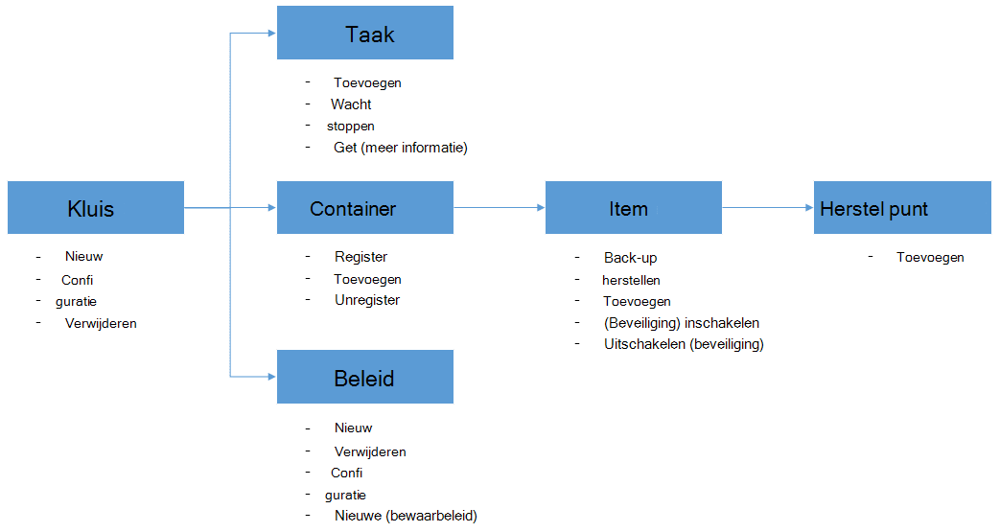

<properties
    pageTitle="Implementeren en beheren van back-up voor Azure VMs via PowerShell | Microsoft Azure"
    description="Meer informatie over het gebruiken en beheren van Azure back-up maken via PowerShell"
    services="backup"
    documentationCenter=""
    authors="markgalioto"
    manager="cfreeman"
    editor=""/>

<tags
    ms.service="backup"
    ms.workload="storage-backup-recovery"
    ms.tgt_pltfrm="na"
    ms.devlang="na"
    ms.topic="article"
    ms.date="08/08/2016"
    ms.author="markgal;trinadhk;jimpark" />


# <a name="deploy-and-manage-backup-for-azure-vms-using-powershell"></a>Implementeren en beheren van back-up voor Azure VMs via PowerShell

> [AZURE.SELECTOR]
- [Resourcemanager](backup-azure-vms-automation.md)
- [Klassieke](backup-azure-vms-classic-automation.md)

Dit artikel leest u hoe u Azure PowerShell gebruiken voor back-up en herstellen van Azure VMs. Azure heeft twee verschillende implementatiemodellen voor het maken en werken met resources: bronnen Manager en klassiek. In dit artikel beschreven hoe u met het model Klassiek implementatie. Microsoft raadt meest nieuwe implementaties het model resourcemanager gebruiken.

## <a name="concepts"></a>Concepten


In dit artikel vindt u informatie die specifiek zijn voor de PowerShell-cmdlets kon u een back-up virtuele machines. Zie [de back-infrastructuur van uw VM in Azure plannen](backup-azure-vms-introduction.md)voor inleidende informatie over het beveiligen van Azure VMs.

> [AZURE.NOTE] Voordat u begint, lees dan de [vereisten](backup-azure-vms-prepare.md) die is vereist voor het werken met Azure back-up en de [beperkingen](backup-azure-vms-prepare.md#limitations) van de huidige VM back-oplossing.

Als u wilt PowerShell effectief gebruiken, neem even de tijd voor meer informatie over de hiërarchie van objecten en vanaf waar u moet beginnen.



De twee belangrijkste loopt zijn beveiliging voor een VM inschakelen en terugzetten van gegevens uit een herstelpunt. De focus verplaatsen van dit artikel is u helpen worden bijzonder geschikt voor het werken met de PowerShell-cmdlets om deze twee scenario's inschakelen.


## <a name="setup-and-registration"></a>Installatie en registratie
Moet beginnen:

1. [Download de meest recente PowerShell](https://github.com/Azure/azure-powershell/releases) (minimaal vereiste versie is: 1.0.0)

2. De beschikbare Azure back-up PowerShell-cmdlets vinden door te typen van de volgende opdracht uit:

```
PS C:\> Get-Command *azurermbackup*

CommandType     Name                                               Version    Source
-----------     ----                                               -------    ------
Cmdlet          Backup-AzureRmBackupItem                           1.0.1      AzureRM.Backup
Cmdlet          Disable-AzureRmBackupProtection                    1.0.1      AzureRM.Backup
Cmdlet          Enable-AzureRmBackupContainerReregistration        1.0.1      AzureRM.Backup
Cmdlet          Enable-AzureRmBackupProtection                     1.0.1      AzureRM.Backup
Cmdlet          Get-AzureRmBackupContainer                         1.0.1      AzureRM.Backup
Cmdlet          Get-AzureRmBackupItem                              1.0.1      AzureRM.Backup
Cmdlet          Get-AzureRmBackupJob                               1.0.1      AzureRM.Backup
Cmdlet          Get-AzureRmBackupJobDetails                        1.0.1      AzureRM.Backup
Cmdlet          Get-AzureRmBackupProtectionPolicy                  1.0.1      AzureRM.Backup
Cmdlet          Get-AzureRmBackupRecoveryPoint                     1.0.1      AzureRM.Backup
Cmdlet          Get-AzureRmBackupVault                             1.0.1      AzureRM.Backup
Cmdlet          Get-AzureRmBackupVaultCredentials                  1.0.1      AzureRM.Backup
Cmdlet          New-AzureRmBackupProtectionPolicy                  1.0.1      AzureRM.Backup
Cmdlet          New-AzureRmBackupRetentionPolicyObject             1.0.1      AzureRM.Backup
Cmdlet          New-AzureRmBackupVault                             1.0.1      AzureRM.Backup
Cmdlet          Register-AzureRmBackupContainer                    1.0.1      AzureRM.Backup
Cmdlet          Remove-AzureRmBackupProtectionPolicy               1.0.1      AzureRM.Backup
Cmdlet          Remove-AzureRmBackupVault                          1.0.1      AzureRM.Backup
Cmdlet          Restore-AzureRmBackupItem                          1.0.1      AzureRM.Backup
Cmdlet          Set-AzureRmBackupProtectionPolicy                  1.0.1      AzureRM.Backup
Cmdlet          Set-AzureRmBackupVault                             1.0.1      AzureRM.Backup
Cmdlet          Stop-AzureRmBackupJob                              1.0.1      AzureRM.Backup
Cmdlet          Unregister-AzureRmBackupContainer                  1.0.1      AzureRM.Backup
Cmdlet          Wait-AzureRmBackupJob                              1.0.1      AzureRM.Backup
```

De volgende taken voor de installatie en registratie kunnen worden geautomatiseerd met PowerShell:

- Een back-kluis maken
- De VMs registreren met de back-up van Azure-service

### <a name="create-a-backup-vault"></a>Een back-kluis maken

> [AZURE.WARNING] Voor klanten met behulp van back-up van Azure voor de eerste keer, moet u de back-up van Azure-provider voor gebruik met uw abonnement hebt geregistreerd. Dit kan worden uitgevoerd door de volgende opdracht uit te voeren: Register-AzureRmResourceProvider - ProviderNamespace "Microsoft.Backup"

U kunt een nieuwe back-kluis met de cmdlet **New-AzureRmBackupVault** maken. De back-kluis is een bron ARM, dus u hoeft te plaatsen binnen een resourcegroep. Voer de volgende opdrachten in een verhoogde Azure PowerShell-console:

```
PS C:\> New-AzureRmResourceGroup –Name “test-rg” –Location “West US”
PS C:\> $backupvault = New-AzureRmBackupVault –ResourceGroupName “test-rg” –Name “test-vault” –Region “West US” –Storage GeoRedundant
```

U kunt een lijst met alle back-up kluizen openen in een bepaald abonnement met de cmdlet **Get-AzureRmBackupVault** .

> [AZURE.NOTE] Is het handig om op te slaan van het object back-kluis in een variabele. Het object kluis is als invoer voor veel Azure back-up-cmdlets nodig.


### <a name="registering-the-vms"></a>De VMs registreren
De eerste stap richting van back-up configureren met Azure back-up is voor het registreren van uw computer of VM met een back-Azure kluis. De **Register-AzureRmBackupContainer** -cmdlet wordt op de invoergegevens van een IaaS Azure virtuele machine en geregistreerd met de opgegeven kluis. De register-bewerking de Azure virtuele machine worden gekoppeld aan de back-kluis en wordt de VM gedurende de levenscyclus van de back-up bijgehouden.

Uw VM met de back-up van Azure-service registreren, maakt een containerobject op het hoogste niveau. Een container bevat meestal meerdere items die kunnen worden back-up gemaakt, maar in het geval van VMs zal er slechts één back-item voor de container.

```
PS C:\> $registerjob = Register-AzureRmBackupContainer -Vault $backupvault -Name "testvm" -ServiceName "testvm"
```

## <a name="backup-azure-vms"></a>Back-up Azure VMs

### <a name="create-a-protection-policy"></a>Beveiliging-beleid maken
Het is niet verplicht te maken van nieuw beleid beveiliging back-up van uw VMs starten. De kluis wordt geleverd met een 'standaardbeleid' die kunnen worden gebruikt om te snel schakelen beveiliging en bewerkt later met de juiste details. U kunt een lijst met het beleid dat beschikbaar is in de kluis openen door met de cmdlet **Get-AzureRmBackupProtectionPolicy** :

```
PS C:\> Get-AzureRmBackupProtectionPolicy -Vault $backupvault

Name                      Type               ScheduleType       BackupTime
----                      ----               ------------       ----------
DefaultPolicy             AzureVM            Daily              26-Aug-15 12:30:00 AM
```

> [AZURE.NOTE] De tijdzone van het veld BackupTime in PowerShell is UTC. Echter wanneer de back-tijd wordt weergegeven in de portal van Azure, wordt de tijdzone uitgelijnd met uw lokale systeem samen met de UTC-tijd.

Een back-beleid is gekoppeld aan ten minste één bewaarbeleid. Het bewaarbeleid wordt gedefinieerd hoe lang een herstelpunt wordt bewaard met Azure back-up. De cmdlet **New-AzureRmBackupRetentionPolicy** Hiermee maakt u PowerShell-objecten waarin informatie over bewaarbeleid. Deze bewaarbeleid beleidsobjecten worden gebruikt als invoer voor de cmdlet *New-AzureRmBackupProtectionPolicy* , of rechtstreeks bij de cmdlet *Enable-AzureRmBackupProtection* .

Een back-beleid bepaalt wanneer en hoe vaak de back-up van een item is voltooid. De cmdlet **New-AzureRmBackupProtectionPolicy** maakt een PowerShell-object dat back-beleidsinformatie bevat. Het back-beleid wordt gebruikt als invoer voor de cmdlet *Enable-AzureRmBackupProtection* .

```
PS C:\> $Daily = New-AzureRmBackupRetentionPolicyObject -DailyRetention -Retention 30
PS C:\> $newpolicy = New-AzureRmBackupProtectionPolicy -Name DailyBackup01 -Type AzureVM -Daily -BackupTime ([datetime]"3:30 PM") -RetentionPolicy $Daily -Vault $backupvault

Name                      Type               ScheduleType       BackupTime
----                      ----               ------------       ----------
DailyBackup01             AzureVM            Daily              01-Sep-15 3:30:00 PM
```

### <a name="enable-protection"></a>Beveiliging inschakelen
Inschakelen van beveiliging draait om twee objecten - het Item en het beleid, en beide moeten behoren tot de dezelfde kluis. Wanneer het beleid gekoppeld aan het item is, wordt de back-werkstroom aan de gedefinieerde planning verwijderen.

```
PS C:\> Get-AzureRmBackupContainer -Type AzureVM -Status Registered -Vault $backupvault | Get-AzureRmBackupItem | Enable-AzureRmBackupProtection -Policy $newpolicy
```

### <a name="initial-backup"></a>Eerste back-up
De back-planning worden gedaan om de volledige kopie van het item en de incrementele kopie voor de volgende back-ups. Gebruik echter de cmdlet **Back-up-AzureRmBackupItem** op als u afdwingen van de eerste back-up wilt optreden bij een bepaald tijdstip of zelfs direct vervolgens:

```
PS C:\> $container = Get-AzureRmBackupContainer -Vault $backupvault -Type AzureVM -Name "testvm"
PS C:\> $backupjob = Get-AzureRmBackupItem -Container $container | Backup-AzureRmBackupItem
PS C:\> $backupjob

WorkloadName    Operation       Status          StartTime              EndTime
------------    ---------       ------          ---------              -------
testvm          Backup          InProgress      01-Sep-15 12:24:01 PM  01-Jan-01 12:00:00 AM
```

> [AZURE.NOTE] De tijdzone van de begintijd en eindtijd velden weergegeven in PowerShell is UTC. Wanneer de vergelijkbare informatie wordt weergegeven in de portal van Azure, wordt het tijdzoneverschil echter uitgelijnd met de lokale systeemklok.

### <a name="monitoring-a-backup-job"></a>Een back-uptaak controleren
De meeste langdurige bewerkingen in Azure back-up zijn aan het model als een taak. Hiermee kunt u gemakkelijk bijhouden voortgang zonder dat u moet het behouden van de Azure-portal openen allen tijde.

Als u de meest recente status van een taak in uitvoering, gebruikt u de cmdlet **Get-AzureRmBackupJob** .

```
PS C:\> $joblist = Get-AzureRmBackupJob -Vault $backupvault -Status InProgress
PS C:\> $joblist[0]

WorkloadName    Operation       Status          StartTime              EndTime
------------    ---------       ------          ---------              -------
testvm          Backup          InProgress      01-Sep-15 12:24:01 PM  01-Jan-01 12:00:00 AM
```

In plaats van deze taken voor afronding - wat onnodige, extra code - polling is het eenvoudiger gebruik de cmdlet **Wachten-AzureRmBackupJob** . Als in een script gebruikt, wordt de cmdlet de uitvoering onderbreken totdat de taak is voltooid of de opgegeven time-outwaarde is bereikt.

```
PS C:\> Wait-AzureRmBackupJob -Job $joblist[0] -Timeout 43200
```


## <a name="restore-an-azure-vm"></a>Een Azure VM herstellen

Om te kunnen back-upgegevens terugzetten, moet u identificeren het back-up-Item en het herstelproces is de punt dat de point-in-time-gegevens bevat. Deze informatie wordt geleverd voor de cmdlet herstellen-AzureRmBackupItem om te starten een herstellen van gegevens uit de kluis in van de klant-account.

### <a name="select-the-vm"></a>Selecteer de VM

Als u de PowerShell-object waarmee het juiste back-artikel, moet u starten vanuit de Container in de kluis en gebruiken van boven naar beneden objecthiërarchie. Als u de container met de VM, gebruik de cmdlet **Get-AzureRmBackupContainer** en pipe die voor de cmdlet **Get-AzureRmBackupItem** .

```
PS C:\> $backupitem = Get-AzureRmBackupContainer -Vault $backupvault -Type AzureVM -name "testvm" | Get-AzureRmBackupItem
```

### <a name="choose-a-recovery-point"></a>Kies een herstelpunt

U kunt nu een lijst met alle herstel punten voor het back-item met de cmdlet **Get-AzureRmBackupRecoveryPoint** en kies de komma herstel herstellen. Gebruikers uitkiezen meestal de meest recente *AppConsistent* punt in de lijst.

```
PS C:\> $rp =  Get-AzureRmBackupRecoveryPoint -Item $backupitem
PS C:\> $rp

RecoveryPointId    RecoveryPointType  RecoveryPointTime      ContainerName
---------------    -----------------  -----------------      -------------
15273496567119     AppConsistent      01-Sep-15 12:27:38 PM  iaasvmcontainer;testvm;testv...
```

De variabele ```$rp``` is van een matrix van herstel punten voor de geselecteerde back-up item, gesorteerd in omgekeerde volgorde van tijd - de meest recente herstel komma index 0 is. Gebruik de standaard PowerShell-matrix indexeren moet de komma herstel kiezen. Bijvoorbeeld: ```$rp[0]``` wordt selecteert u de meest recente herstel komma.

### <a name="restoring-disks"></a>Schijven herstellen

Er is een belangrijke verschil tussen de herstellen bewerkingen uitgevoerd via de portal van Azure en via PowerShell Azure. Met PowerShell, wordt de bewerking voor terugzetten stopt bij de schijven en configuratiegegevens terugzetten vanuit de komma herstel. Er wordt geen een virtuele machine gemaakt.

> [AZURE.WARNING] De herstellen-AzureRmBackupItem maakt geen een VM. Alleen herstelt u de schijven met het opgegeven opslag-account. Dit is niet hetzelfde gedrag gezien u in de portal van Azure ervaart.

```
PS C:\> $restorejob = Restore-AzureRmBackupItem -StorageAccountName "DestAccount" -RecoveryPoint $rp[0]
PS C:\> $restorejob

WorkloadName    Operation       Status          StartTime              EndTime
------------    ---------       ------          ---------              -------
testvm          Restore         InProgress      01-Sep-15 1:14:01 PM   01-Jan-01 12:00:00 AM
```

U kunt de details van het terugzetten met de cmdlet **Get-AzureRmBackupJobDetails** wanneer de terugzettaak is voltooid. De eigenschap *ErrorDetails* heeft de informatie die nodig is om de VM opnieuw te maken.

```
PS C:\> $restorejob = Get-AzureRmBackupJob -Job $restorejob
PS C:\> $details = Get-AzureRmBackupJobDetails -Job $restorejob
```

### <a name="build-the-vm"></a>De VM maken

Samenstellen van de VM afmelden bij de herstelde schijven kan worden uitgevoerd met de oudere Azure-Service Management PowerShell-cmdlets, de nieuwe resourcemanager Azure-sjablonen, of zelfs met behulp van de Azure portal. In een snel voorbeeld wordt wordt uitgelegd hoe er toegang toe krijgen de servicebeheer Azure-cmdlets gebruiken.

```
 $properties  = $details.Properties

 $storageAccountName = $properties["Target Storage Account Name"]
 $containerName = $properties["Config Blob Container Name"]
 $blobName = $properties["Config Blob Name"]

 $keys = Get-AzureStorageKey -StorageAccountName $storageAccountName
 $storageAccountKey = $keys.Primary
 $storageContext = New-AzureStorageContext -StorageAccountName $storageAccountName -StorageAccountKey $storageAccountKey


 $destination_path = "C:\Users\admin\Desktop\vmconfig.xml"
 Get-AzureStorageBlobContent -Container $containerName -Blob $blobName -Destination $destination_path -Context $storageContext


$obj = [xml](((Get-Content -Path $destination_path -Encoding UniCode)).TrimEnd([char]0x00))
 $pvr = $obj.PersistentVMRole
 $os = $pvr.OSVirtualHardDisk
 $dds = $pvr.DataVirtualHardDisks
 $osDisk = Add-AzureDisk -MediaLocation $os.MediaLink -OS $os.OS -DiskName "panbhaosdisk"
 $vm = New-AzureVMConfig -Name $pvr.RoleName -InstanceSize $pvr.RoleSize -DiskName $osDisk.DiskName

 if (!($dds -eq $null))
 {
     foreach($d in $dds.DataVirtualHardDisk)
     {
         $lun = 0
         if(!($d.Lun -eq $null))
         {
             $lun = $d.Lun
         }
         $name = "panbhadataDisk" + $lun
     Add-AzureDisk -DiskName $name -MediaLocation $d.MediaLink
     $vm | Add-AzureDataDisk -Import -DiskName $name -LUN $lun
    }
}

New-AzureVM -ServiceName "panbhasample" -Location "SouthEast Asia" -VM $vm
```

Lees voor meer informatie over het maken van een VM van de herstelde schijven, de volgende cmdlets uit:

- [Toevoegen AzureDisk](https://msdn.microsoft.com/library/azure/dn495252.aspx)
- [Nieuwe AzureVMConfig](https://msdn.microsoft.com/library/azure/dn495159.aspx)
- [Nieuwe AzureVM](https://msdn.microsoft.com/library/azure/dn495254.aspx)

## <a name="code-samples"></a>Voorbeelden van programmacode

### <a name="1-get-the-completion-status-of-job-sub-tasks"></a>1. de voltooiingsstatus van submappen projecttaken ophalen

Als u wilt bijhouden de voltooiingsstatus van afzonderlijke subtaken, kunt u de cmdlet **Get-AzureRmBackupJobDetails** :

```
PS C:\> $details = Get-AzureRmBackupJobDetails -JobId $backupjob.InstanceId -Vault $backupvault
PS C:\> $details.SubTasks

Name                                                        Status
----                                                        ------
Take Snapshot                                               Completed
Transfer data to Backup vault                               InProgress
```

### <a name="2-create-a-dailyweekly-report-of-backup-jobs"></a>2. een dagelijks/wekelijks rapport maken van back-taken

Beheerders wordt meestal wilt u weten wat back-taken in de afgelopen 24 uur, de status van back-taken hebt uitgevoerd. Daarnaast kunnen kunt de hoeveelheid gegevens die worden overgebracht beheerders voor het schatten van hun maandelijkse gegevensgebruik. Het script hieronder de onbewerkte gegevens ophaalt uit de back-up van Azure-service en de gegevens weergegeven in de PowerShell-console.

```
param(  [Parameter(Mandatory=$True,Position=1)]
        [string]$backupvaultname,

        [Parameter(Mandatory=$False,Position=2)]
        [int]$numberofdays = 7)


#Initialize variables
$DAILYBACKUPSTATS = @()
$backupvault = Get-AzureRmBackupVault -Name $backupvaultname
$enddate = ([datetime]::Today).AddDays(1)
$startdate = ([datetime]::Today)

for( $i = 1; $i -le $numberofdays; $i++ )
{
    # We query one day at a time because pulling 7 days of data might be too much
    $dailyjoblist = Get-AzureRmBackupJob -Vault $backupvault -From $startdate -To $enddate -Type AzureVM -Operation Backup
    Write-Progress -Activity "Getting job information for the last $numberofdays days" -Status "Day -$i" -PercentComplete ([int]([decimal]$i*100/$numberofdays))

    foreach( $job in $dailyjoblist )
    {
        #Extract the information for the reports
        $newstatsobj = New-Object System.Object
        $newstatsobj | Add-Member -Type NoteProperty -Name Date -Value $startdate
        $newstatsobj | Add-Member -Type NoteProperty -Name VMName -Value $job.WorkloadName
        $newstatsobj | Add-Member -Type NoteProperty -Name Duration -Value $job.Duration
        $newstatsobj | Add-Member -Type NoteProperty -Name Status -Value $job.Status

        $details = Get-AzureRmBackupJobDetails -Job $job
        $newstatsobj | Add-Member -Type NoteProperty -Name BackupSize -Value $details.Properties["Backup Size"]
        $DAILYBACKUPSTATS += $newstatsobj
    }

    $enddate = $enddate.AddDays(-1)
    $startdate = $startdate.AddDays(-1)
}

$DAILYBACKUPSTATS | Out-GridView
```

Als u grafiekmogelijkheden toevoegen aan dit rapportuitvoer wilt, leer van het blogbericht TechNet [Charting met PowerShell](http://blogs.technet.com/b/richard_macdonald/archive/2009/04/28/3231887.aspx)

## <a name="next-steps"></a>Volgende stappen

Als u liever via PowerShell koppelen aan uw Azure resources, raadpleegt u het artikel PowerShell voor het beschermen van Windows Server, [distribueren en back-up beheren voor Windows Server](./backup-client-automation-classic.md). Er is ook een PowerShell-artikel voor het beheren van DPM back-ups, [distribueren en back-up beheren voor DPM](./backup-dpm-automation-classic.md). Beide deze artikelen hebben een versie voor resourcemanager implementaties, evenals klassieke implementaties.
