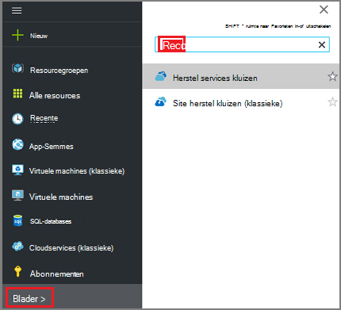
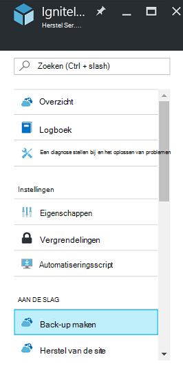
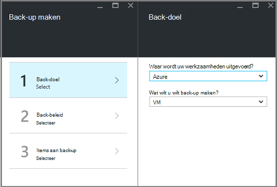
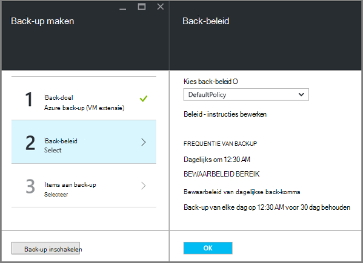
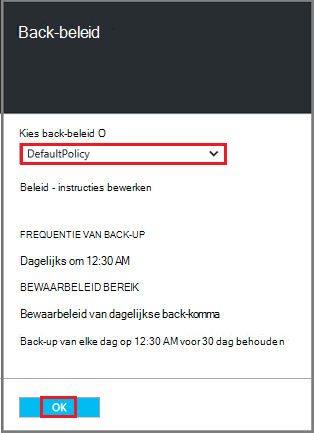
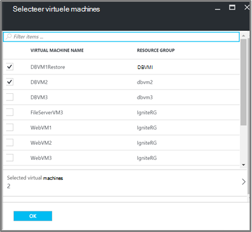
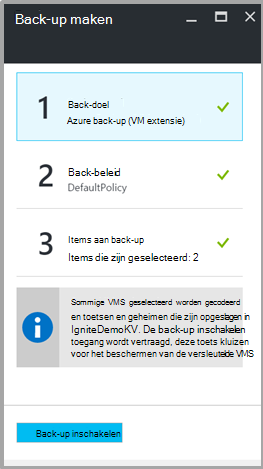

<properties
   pageTitle="Back-up en herstellen gecodeerd VMs met back-up van Azure"
   description="In dit artikel moment spreekt over de back-up en herstellen ervaring voor VMs versleuteld Azure schijf-versleuteling gebruikt."
   services="backup"
   documentationCenter=""
   authors="JPallavi"
   manager="vijayts"
   editor=""/>
<tags
   ms.service="backup"
   ms.devlang="na"
   ms.topic="article"
   ms.tgt_pltfrm="na"
   ms.workload="storage-backup-recovery"
   ms.date="10/25/2016"
   ms.author="markgal; jimpark; trinadhk"/>

# Back-up en herstellen gecodeerd VMs met back-up van Azure

In dit artikel moment spreekt over stappen voor het back-up maken en terugzetten van virtuele machines met Azure back-up. Ook vindt u meer informatie over ondersteunde scenario's, minimumvereisten en stappen voor probleemoplossing voor foutgevallen.

## Ondersteunde scenario 's

> [AZURE.NOTE]
1.  Back-up en herstellen van versleutelde VMs wordt alleen ondersteund voor resourcemanager die zijn geïmplementeerd virtuele machines. Deze wordt niet ondersteund voor klassieke virtuele machines.  
2.  Dit wordt alleen ondersteund voor virtuele machines versleuteld met BitLocker versleuteling-sleutel en sleutel versleutelingssleutel. Deze wordt niet ondersteund voor virtuele machines versleuteld met BitLocker versleutelingssleutel alleen.  

## Minimumvereisten

1.  VM is versleuteld [Azure schijf](../security/azure-security-disk-encryption.md)-versleuteling gebruikt. Deze moet worden versleuteld met BitLocker versleuteling-sleutel en sleutel versleutelingssleutel.
2.  Herstel services kluis is gemaakt en opslag herhaling instellen stappen uit te voeren die worden genoemd in het artikel [voorbereiden uw omgeving voor back-up](backup-azure-arm-vms-prepare.md).

## Back-up versleuteld VM
Gebruik de volgende stappen voor het doel van de back-ups instellen, beleid definiëren, items en trigger back-up configureren.

### Back-ups configureren

1. Als u al een herstel Services kluis openen, gaat u verder met de volgende stap. Als u een herstel Services kluis openen niet heb, maar in de portal Azure worden in het menu Hub klikt u op **Bladeren**.

  - Typ in de lijst met resources, **Herstel Services**.
  - Als u te typen begint, de lijstfilters op basis van uw invoer. Wanneer u **herstel Services kluizen**ziet, klikt u erop.
  
        

    De lijst met Services herstel kluizen wordt weergegeven. Selecteer in de lijst met Services herstel kluizen, een kluis.

    Het geselecteerde kluis dashboard wordt geopend.

2. Klik op **back-up maken** als u wilt openen, het back-up-blad in de lijst met items die wordt weergegeven onder kluis.

       
    
3. Klik op het blad back-up op **back-up doel** als u wilt openen van het doel van de back-up-blad.

       
    
4.   Stel op het blad back-doel **waar uw werkzaamheden actief is** op Azure en **Wat wilt u wilt back-up** met virtuele machine, klik vervolgens op **OK**.

    Het doel van de back-up-blad wordt gesloten en het back-up beleid blad wordt geopend.

       

5. Selecteer op het blad back-up-beleid, de back-beleid dat u wilt toepassen op de kluis en klik op **OK**.

       

    De details van het standaardbeleid worden weergegeven in de details. Als u wilt-beleid maken, selecteert u **Nieuw** uit de vervolgkeuzelijst. Nadat u op **OK**hebt geklikt, is het back-beleid gekoppeld aan de kluis.

    Kies naast de VMs koppelen aan de kluis.
    
6. Kies de versleutelde virtuele machines om te koppelen aan het opgegeven beleid en klik op **OK**.

      
   
7. Deze pagina ziet u een bericht over belangrijke kluis die is gekoppeld aan de versleutelde VMs geselecteerd. Back-service is alleen-lezen toegang tot de toetsen en geheimen in de belangrijkste kluis vereist. Deze machtigingen voor back-toets en geheim, samen met de bijbehorende VMs wordt gebruikt. 

      

      Nu dat u hebt gedefinieerd op alle instellingen voor de kluis, in het blad back-up back-up inschakelen onder aan de pagina. Back-up implementeert het beleid naar de kluis en de VMs.

8. De volgende fase in voorbereiding van de VM-Agent is installeren of ervoor te zorgen dat de VM-Agent is geïnstalleerd. Gebruik de stappen die worden genoemd in het artikel [voorbereiden uw omgeving voor back-up](backup-azure-arm-vms-prepare.md)hetzelfde doet. 

### Back-uptaak activeert
Voer de stappen die worden genoemd in het artikel [Back-up Azure VMs naar herstel services kluis](backup-azure-arm-vms.md) naar de back-uptaak trigger.

## Versleutelde VM herstellen
Herstel ervaring voor versleuteld en niet-versleutelde virtuele machines is dezelfde. Gebruik de stappen die worden genoemd in de [virtuele machines in Azure portal herstellen](backup-azure-arm-restore-vms.md) de versleutelde VM herstellen. Als u opnieuw herstellen toetsen en geheimen wilt, moet u ervoor zorgen dat belangrijke kluis u ze herstelt, moet al bestaan.

## Fouten corrigeren

| Bewerking | Meer informatie over fout | Resolutie |
| -------- | -------- | -------|
| Back-up maken | Validatie is mislukt tijdens VM is versleuteld met BEK alleen. Back-ups kunnen alleen worden ingeschakeld voor virtuele machines versleuteld met zowel BEK als KEK. | VM moeten worden versleuteld met BEK en KEK. Daarna de back-up moet zijn ingeschakeld. |
| Herstellen | U kunt deze versleutelde VM niet herstellen, aangezien belangrijke kluis die is gekoppeld aan dit VM niet bestaat. | Maak belangrijke kluis met [Aan de slag met Azure toets kluis](../key-vault/key-vault-get-started.md). Raadpleeg het artikel [herstellen belangrijke kluis sleutel en geheim met Azure back-up](backup-azure-restore-key-secret.md) -toets en geheim herstellen als deze niet aanwezig zijn. |
| Herstellen | U kunt deze versleutelde VM niet herstellen, aangezien sleutel en dat is gekoppeld aan dit VM geheim niet bestaan. | Raadpleeg het artikel [herstellen belangrijke kluis sleutel en geheim met Azure back-up](backup-azure-restore-key-secret.md) -toets en geheim herstellen als deze niet aanwezig zijn. |
