<properties
    pageTitle="Eerst wordt gezocht naar: Azure VMs beveiligen met een herstel services kluis | Microsoft Azure"
    description="Azure VMs beveiligen met een herstel services kluis. Back-ups van VMs resourcemanager geïmplementeerd, VMs klassieke geïmplementeerd en Premium opslag VMs gebruiken om uw gegevens te beveiligen. Maken en een herstel services kluis registreren. VMs registreren, -beleid maken en beveiligen van VMs in Azure wordt aangegeven."
    services="backup"
    documentationCenter=""
    authors="markgalioto"
    manager="cfreeman"
    editor=""
    keyword="backups; vm backup"/>

<tags
    ms.service="backup"
    ms.workload="storage-backup-recovery"
    ms.tgt_pltfrm="na"
    ms.devlang="na"
    ms.topic="hero-article"
    ms.date="10/13/2016"
    ms.author="markgal; jimpark"/>

# Eerst wordt gezocht naar: Azure VMs beveiligen met een herstel services kluis

> [AZURE.SELECTOR]
- [VMs beveiligen met een herstel services kluis](backup-azure-vms-first-look-arm.md)
- [VMs beveiligen met een back-kluis](backup-azure-vms-first-look.md)

Deze zelfstudie gaat u door de stappen voor het maken van een herstel services kluis en back-ups van een Azure virtuele machine (VM). Herstel services kluizen beveiligen:

- Azure resourcemanager geïmplementeerd VMs
- Klassieke VMs
- Standaard opslag VMs
- Premium opslag VMs
- VMs versleuteld met Azure schijfversleuteling met BEK en KEK

Zie voor meer informatie over het beveiligen van Premium opslag VMs, [Back-up en herstellen van Premium opslag VMs](backup-introduction-to-azure-backup.md#back-up-and-restore-premium-storage-vms)

>[AZURE.NOTE] Deze zelfstudie wordt ervan uitgegaan dat u al een VM in uw Azure-abonnement en dat u maatregelen toe te staan dat de back-service voor toegang tot de VM hebt genomen.

[AZURE.INCLUDE [learn-about-Azure-Backup-deployment-models](../../includes/backup-deployment-models.md)]

Dit zijn de stappen die u moet uitvoeren op hoog niveau.  

1. Maak een herstel services kluis voor een VM.
2. Gebruik de Azure-portal selecteert u een Scenario, beleid instellen en uw items te beveiligen.
3. De eerste back-up uitvoeren.

## Een herstel services kluis maken voor een VM

Een herstel services kluis is een entiteit waarmee de back-ups en herstel punten die zijn gemaakt na verloop van tijd opgeslagen. De herstel services kluis bevat ook het back-beleid toegepast op de beveiligde VMs.

>[AZURE.NOTE] Een back-up VMs is een lokaal proces. U kunt geen back-up VMs van de ene locatie naar een kluis herstel services op een andere locatie. Voor elke Azure-locatie die VMs worden back-up moet heeft, moet ten minste één herstel services kluis zo is, bestaan op die locatie.

Een herstel services kluis maken:

1. Meld u aan bij de [portal van Azure](https://portal.azure.com/).

2. Klik in het menu Hub klikt u op **Bladeren** en typ in de lijst met resources, **Herstel Services**. Als u te typen begint, de lijstfilters op basis van uw invoer. Klik op **Services herstel kluis**.

    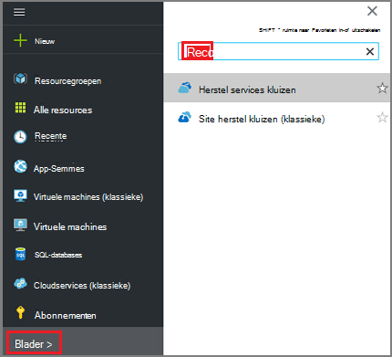  

    De lijst met herstel services kluizen worden weergegeven.

3. Klik in het menu **kluizen herstel Services** op **toevoegen**.

    

    Het herstelproces is Services kluis blad wordt geopend, waarin u een **naam**, het **abonnement**, de **resourcegroep**en de **locatie**op te geven.

    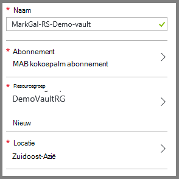

4. Voer een beschrijvende naam voor de kluis voor de **naam**. De naam moet uniek zijn voor het Azure abonnement. Typ een naam die tussen 2 en 50 tekens bevat. Er moet beginnen met een letter en mogen alleen letters, cijfers en afbreekstreepjes.

5. Klik op **abonnement** als u wilt zien van de lijst beschikbare van abonnementen. Als u niet zeker weet welk abonnement te gebruiken, gebruik de standaardwaarde (of voorgesteld) abonnement. Er zijn meerdere keuzemogelijkheden alleen als uw organisatie-account gekoppeld aan meerdere Azure abonnementen is.

6. Klik op **resourcegroep** om de lijst beschikbare van resourcegroepen weer te of klik op **Nieuw** om te maken van een resourcegroep. Zie [overzicht van de Azure resourcemanager](../azure-resource-manager/resource-group-overview.md) voor volledige informatie over Resource-groepen

7. Klik op **locatie** als het geografische gebied voor de kluis wilt selecteren. De kluis **moet** worden in hetzelfde gebied, als de virtuele machines die u wilt beveiligen.

    >[AZURE.IMPORTANT] Als u van de locatie waarin uw VM bestaat weet, sluit afmelden bij het dialoogvenster voor het maken van kluis en Ga naar de lijst van virtuele Machines in de portal. Als u virtuele machines in meerdere regio's hebt, maakt u een herstel services kluis in elke regio. Maak de kluis in de eerste locatie voordat u overschakelt naar de volgende locatie. Er is niet nodig om op te geven opslag accounts om op te slaan van de back-upgegevens--de herstel services kluis en de back-Azure-service automatisch dit afhandelen.

8. Klik op **maken**. Het kan even duren voordat de herstel services kluis moet worden gemaakt. Controleer de statusmeldingen in het bovenste rechter gebied in de portal. Nadat uw kluis is gemaakt, wordt deze weergegeven in de lijst met herstel services kluizen.

    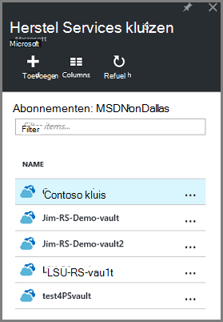

U kunt uw kluis hebt gemaakt, lees nu het instellen van de replicatie opslag.

### Instellen opslag replicatie

De opslagruimte replicatie-optie kunt u kiezen tussen geografische-redundante opslag en lokaal redundante opslag. Standaard is uw kluis geografische-redundante opslag. Laat de optie die is ingesteld op geografische-redundante opslag als dit de primaire back-up is. Kies lokaal redundante opslag als u wilt een goedkoper optie dat niet wordt vermeld als duurzame. Meer informatie over [geografische-redundante](../storage/storage-redundancy.md#geo-redundant-storage) en [lokaal overtollige](../storage/storage-redundancy.md#locally-redundant-storage) opslagopties voor in de [opslag van Azure replicatie-overzicht](../storage/storage-redundancy.md).

De instelling van de herhaling opslag bewerken:

1. Selecteer uw kluis om het dashboard kluis en het blad instellingen te openen. Als het blad **Instellingen** niet wordt geopend, klikt u op **alle instellingen** in het dashboard kluis.

2. Klik op het blad **Instellingen** op **Back-up-infrastructuur** > **Configuratie van de back-up** openen van het blad **Back-up-configuratie** . Klik op het blad **Back-up-configuratie** , kies de optie voor het herhaling van opslagruimte voor uw kluis.

    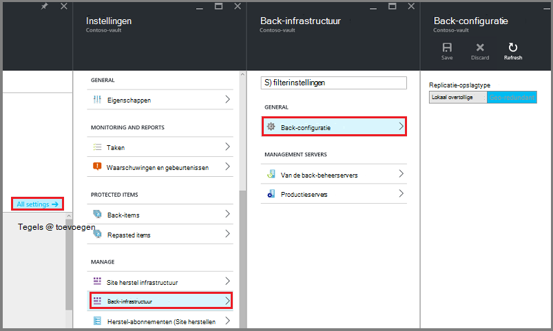

    Kies de optie opslagruimte voor uw kluis en bent u klaar voor de VM koppelen aan de kluis. U moet eerst de koppeling, ontdekken en registreren van de Azure virtuele machines.

## Selecteer een back-doel, beleid instellen en items te beveiligen definiëren

Voordat u een VM registreert met een kluis, moet u het discovery-proces om ervoor te zorgen dat elke nieuwe virtuele machines die zijn toegevoegd aan het abonnement zijn aangewezen uitvoeren. De query's proces Azure voor de lijst met virtuele machines in het abonnement, samen met aanvullende informatie, zoals de naam van de cloud-service en de regio. Klik in de portal Azure wordt scenario verwijst naar wat u wilt de herstel services kluis besteedt. Beleid is het schema voor hoe vaak en wanneer herstel punten zijn die u hebt gemaakt. Beleid bevat ook het bewaarbeleid bereik voor de herstel wordt verwezen.

1. Als u al een herstel services kluis openen, gaat u verder met stap 2. Als u nog geen een herstel services kluis geopend, maar zijn in de portal Azure in het menu Hub klikt u op **Bladeren**.

  - Typ in de lijst met resources, **Herstel Services**.
  - Als u te typen begint, de lijstfilters op basis van uw invoer. Wanneer u **herstel Services kluizen**ziet, klikt u erop.

      

    De lijst met herstel services kluizen wordt weergegeven.
  - Selecteer in de lijst met herstel services kluizen, een kluis.

    Het geselecteerde kluis dashboard wordt geopend.

    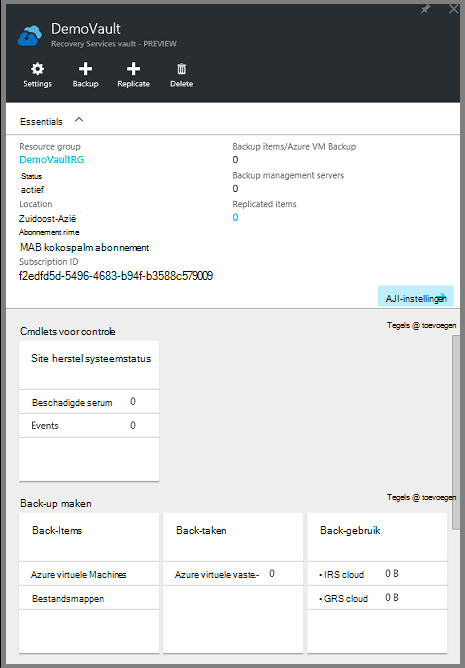

2. Klik op **back-up maken** als u wilt openen van het blad back-up in het menu van de dashboard kluis.

    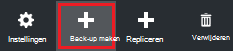

    Wanneer het blad wordt geopend, zoekt u de back-up-service naar een nieuwe VMs in het abonnement.

    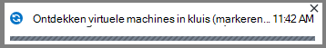

3. Klik op het blad back-up op **back-up doel** als u wilt openen van het doel van de back-up-blad.

    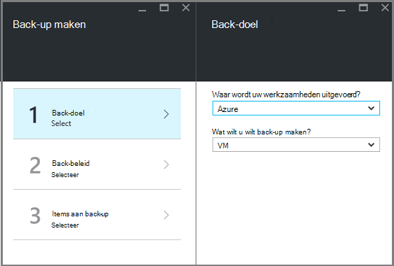

4. Stel op het blad back-doel **waar uw werkzaamheden actief is** op Azure en **Wat wilt u wilt back-up** met virtuele machine, klik vervolgens op **OK**.

    Het doel van de back-up-blad wordt gesloten en het back-up beleid blad wordt geopend.

    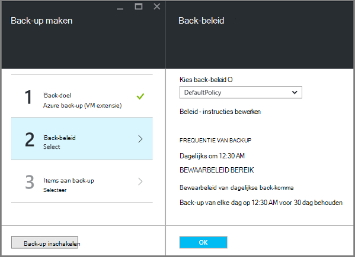

5. Selecteer op het blad back-up-beleid, de back-beleid dat u wilt toepassen op de kluis en klik op **OK**.

    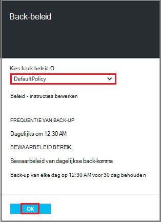

    De details van het standaardbeleid worden weergegeven in de details. Als u wilt-beleid maken, selecteert u **Nieuw** uit de vervolgkeuzelijst. Het vervolgkeuzemenu bevat ook een optie waarmee u de tijd waarop de momentopname is, 7 PM. Zie [een back-beleid definieert](backup-azure-vms-first-look-arm.md#defining-a-backup-policy)voor instructies over het definiëren van een back-beleid. Nadat u op **OK**hebt geklikt, is het back-beleid gekoppeld aan de kluis.

    Kies naast de VMs koppelen aan de kluis.

6. Kies de virtuele machines om te koppelen aan het opgegeven beleid en klik op **selecteren**.

    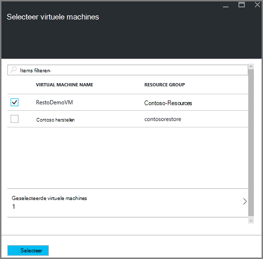

    Als u de gewenste VM niet ziet, Controleer of het bestaat in dezelfde Azure locatie als het herstelproces is Services kluis.

7. Nu u hebt gedefinieerd alle instellingen voor de kluis, in het blad back-up klikt u op **Back-up inschakelen** onder aan de pagina. Dit implementeert het beleid naar de kluis en de VMs.

    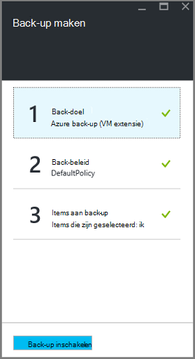

## Eerste back-up

Nadat u een back-beleid is geïmplementeerd op de virtuele machine, betekent niet heeft de gegevens zijn back-up. Standaard is de eerste geplande back-up (zoals gedefinieerd in het back-beleid) de eerste back-up. Totdat de eerste back-up plaatsvindt, geeft de laatste back-Status op het blad **Back-taken** als een **waarschuwing (eerste back-up in behandeling)**.

Tenzij uw eerste back-up verschuldigd is aan Snel starten, wordt het wordt aanbevolen dat u **nu een Back-up**uitvoeren.

Hiermee voert u **nu een back-up maken**:

1. Klik op het dashboard kluis, klikt u op de tegel **back-up** op **Azure virtuele Machines**  
    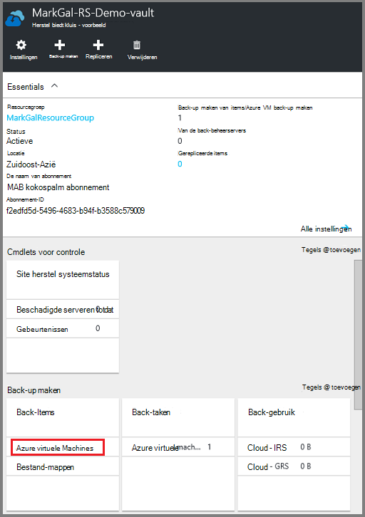

    Hiermee opent u het blad **Back-up-Items** .

2. Klik op het blad **Back-up Items** met de rechtermuisknop op de kluis die u een back wilt-up en **back-up-nu**op.

    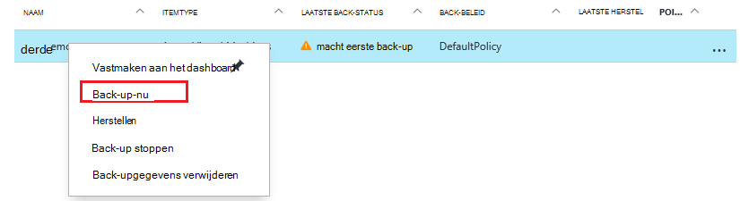

    De back-uptaak wordt geactiveerd.  

    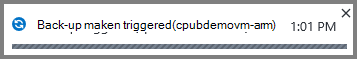

3. Klik op **Azure virtuele machines**om weer te geven dat uw eerste back-up is voltooid, klikt u op het dashboard kluis, klikt u op de tegel **Back-taken** .

    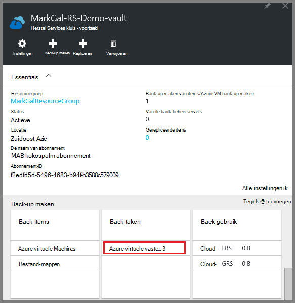

    Hiermee opent u het blad back-up-taken.

4. In het blad back-up-taken, kunt u de status van alle taken bekijken.

    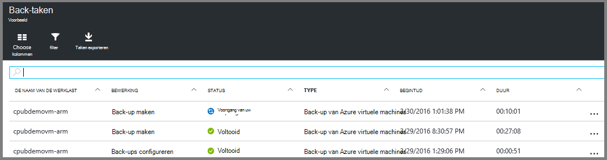

    >[AZURE.NOTE] Als onderdeel van de back-up serviceproblemen de back-Azure een opdracht naar de back-extensie in elke VM leegmaken van alle schrijft en een consistente momentopname.

    Wanneer de back-uptaak is voltooid, is de status ervan is *voltooid*.

[AZURE.INCLUDE [backup-create-backup-policy-for-vm](../../includes/backup-create-backup-policy-for-vm.md)]

## De VM-Agent installeren op de virtuele machine

Deze informatie wordt weergegeven in het geval dat nodig is. De Azure VM-Agent moet zijn geïnstalleerd op de Azure virtuele machine voor de back-up-extensie om te werken. Als uw VM vanuit de galerie met Azure is gemaakt, klikt u vervolgens is de VM-Agent echter al aanwezig op de virtuele machine. VMs die worden gemigreerd van on-premises implementatie datacenters zou niet de VM-Agent zijn geïnstalleerd. In dat geval moet de VM-Agent zijn geïnstalleerd. Als u een back-up van de Azure VM problemen ondervindt, controleert u dat de Azure VM-Agent juist is geïnstalleerd op de virtuele machine (Zie de onderstaande tabel). Als u een aangepaste VM maakt, is [Controleer of dat het selectievakje voor het **installeren van de VM-Agent** is ingeschakeld](../virtual-machines/virtual-machines-windows-classic-agents-and-extensions.md) voordat de virtuele machine ingericht.

Meer informatie over de [VM-Agent](https://go.microsoft.com/fwLink/?LinkID=390493&clcid=0x409) en [hoe u het kunt installeren](../virtual-machines/virtual-machines-windows-classic-manage-extensions.md).

De volgende tabel vindt meer informatie over de VM Agent voor Windows en Linux VMs.

| **Bewerking** | **Windows** | **Linux** |
| --- | --- | --- |
| Installatie van de VM-Agent | <li>Download en installeer de [agent MSI](http://go.microsoft.com/fwlink/?LinkID=394789&clcid=0x409). Moet u beheerdersrechten om de installatie te voltooien. <li>[De eigenschap VM bijwerken](http://blogs.msdn.com/b/mast/archive/2014/04/08/install-the-vm-agent-on-an-existing-azure-vm.aspx) om aan te geven dat de-agent is geïnstalleerd. | <li> Installeer de meest recente [Linux-agent](https://github.com/Azure/WALinuxAgent) vanaf GitHub. Moet u beheerdersrechten om de installatie te voltooien. <li> [De eigenschap VM bijwerken](http://blogs.msdn.com/b/mast/archive/2014/04/08/install-the-vm-agent-on-an-existing-azure-vm.aspx) om aan te geven dat de-agent is geïnstalleerd. |
| De VM-Agent bijwerken | Bijwerken van de VM-Agent is net zo eenvoudig als het [VM Agent binaire bestanden](http://go.microsoft.com/fwlink/?LinkID=394789&clcid=0x409)opnieuw te installeren.  Zorg ervoor dat er geen back-up wordt uitgevoerd, terwijl de VM-agent wordt bijgewerkt. | Volg de instructies over het [bijwerken van de Linux VM-Agent ](../virtual-machines-linux-update-agent.md).  Zorg ervoor dat er geen back-up wordt uitgevoerd, terwijl de VM-Agent wordt bijgewerkt. |
| De installatie VM Agent valideren | <li>Navigeer naar de map *C:\WindowsAzure\Packages* in de VM Azure. <li>U moet de huidige WaAppAgent.exe-bestand hebt gevonden.<li> Met de rechtermuisknop op het bestand, gaat u naar **Eigenschappen**en selecteer vervolgens het tabblad **Details** . Het veld productversie moet 2.6.1198.718 of hoger. | N/B |

### Back-extensie

Wanneer de VM-Agent is geïnstalleerd op de virtuele machine, installeert u de back-extensie met de back-Azure-service in de VM-Agent. De back-Azure-service naadloos upgrades en patches van de back-extensie zonder tussenkomst van andere gebruikers.

De back-extensie is geïnstalleerd door de back-up-service of de VM wordt uitgevoerd. Een actieve VM biedt de grootste kans een toepassing consistente herstelpunt. De back-up van Azure-service blijft echter back-up van de VM zelfs als dit is uitgeschakeld en de extensie kan niet worden geïnstalleerd. Dit is Offline VM genoemd. In dit geval worden de komma herstel *vastlopen consistente*.

## Informatie over probleemoplossing
Als u uitvoeren van enkele van de taken in dit artikel problemen ondervindt, raadpleegt u de [richtlijnen voor probleemoplossing](backup-azure-vms-troubleshoot.md).

## Prijzen
Azure VM back-up worden berekend op basis van de beveiligde exemplaren model. Klik hier als u meer wilt weten op [Back-up prijzen](https://azure.microsoft.com/pricing/details/backup/)

## Vragen?
Als u vragen hebt of als er is een functie die u wilt zien opgenomen, [Stuur ons feedback](http://aka.ms/azurebackup_feedback).
