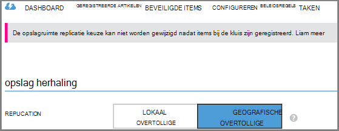

<properties
    pageTitle="Eerste kennismaking: Azure VMs beveiligen met een back-kluis | Microsoft Azure"
    description="Azure VMs beschermen met back-up kluis. Zelfstudie wordt uitgelegd kluis maken, VMs registreren, -beleid maken en beveiligen van VMs in Azure wordt aangegeven."
    services="backup"
    documentationCenter=""
    authors="markgalioto"
    manager="cfreeman"
    editor=""/>

<tags
    ms.service="backup"
    ms.workload="storage-backup-recovery"
    ms.tgt_pltfrm="na"
    ms.devlang="na"
    ms.topic="hero-article"
    ms.date="09/15/2016"
    ms.author="markgal; jimpark"/>

# Eerst wordt gezocht naar: een back-up Azure virtuele machines

> [AZURE.SELECTOR]
- [VMs beveiligen met een herstel services kluis](backup-azure-vms-first-look-arm.md)
- [Azure VMs beveiligen met een back-kluis](backup-azure-vms-first-look.md)

Deze zelfstudie gaat u naar een back-kluis in Azure wordt aangegeven door de stappen voor het back-ups van een Azure virtuele machine (VM). In dit artikel worden de klassieke model of servicebeheer implementatie, voor een back-up VMs. Als u geïnteresseerd back-ups van een VM naar een herstel Services kluis die bij een resourcegroep bent hoort, raadpleegt u [eerst zoeken: VMs beveiligen met een herstel services kluis](backup-azure-vms-first-look-arm.md). Deze vereisten om te kunnen deze zelfstudie voltooien, moeten worden voldaan:

- U kunt een VM hebt gemaakt in uw Azure-abonnement.
- De VM is connectiviteit met Azure openbare IP-adressen. Zie voor meer informatie, [netwerkconnectiviteit](./backup-azure-vms-prepare.md#network-connectivity).

Als u wilt een back-up een VM, zijn er vijf hoofdstappen:  

 maken van een back-kluis of een bestaande back-kluis identificeren.  
 de klassieke Azure-portal gebruiken om te detecteren en de virtuele machines registreren.  
 de VM-Agent installeren.  
 het beleid voor het beschermen van de virtuele machines maken.  
 de back-up uitvoeren.

>[AZURE.NOTE] Azure heeft twee implementatiemodellen voor het maken en werken met resources: [resourcemanager en klassiek](../resource-manager-deployment-model.md). Deze zelfstudie is voor gebruik met de VMs die kan worden gemaakt in de klassieke Azure-portal. De back-up van Azure-service ondersteunt resourcemanager gebaseerde VMs. Zie voor meer informatie over back-ups van VMs naar een herstel services kluis, [eerste zoeken: VMs beveiligen met een herstel services kluis](backup-azure-vms-first-look-arm.md).

## Stap 1: een back-kluis maken voor een VM

Een back-kluis is een entiteit waarmee de back-ups en herstel punten die zijn gemaakt na verloop van tijd opgeslagen. De back-kluis bevat ook de back-beleid die zijn toegepast op de virtuele machines back-up wordt gemaakt.

1. Meld u aan bij de [portal van Azure klassieke](http://manage.windowsazure.com/).

2. Klik in de linkerbenedenhoek van de Azure-portal op **Nieuw**

    

3. Klik in de wizard Snelle maken op **Gegevensservices** > **Herstel Services** > **Back-up kluis** > **Snelle maken**.

    

    De wizard vraagt u om de **naam** en **regio**. Als u meer dan één abonnement beheert, wordt een dialoogvenster voor het kiezen van het abonnement dat wordt weergegeven.

4. Voer een beschrijvende naam voor de kluis voor de **naam**. De naam moet uniek zijn voor het Azure abonnement.

5. Selecteer in de **regio**, de geografische regio voor de kluis. De kluis **moet** worden in hetzelfde gebied, als de virtuele machines die deze beschermen.

    Als u niet weet wie de regio waarin uw VM bestaat, sluit u deze wizard en klikt u **virtuele Machines** in de lijst met Azure services. De kolom locatie bevat de naam van het gebied. Als u virtuele machines in meerdere regio's hebt, maakt u een back-kluis in elke regio.

6. Als er geen dialoogvenster **abonnement** in de wizard, gaat u verder met de volgende stap. Als u met meerdere abonnementen werkt, selecteert u een abonnement op koppelen aan de nieuwe back-kluis.

    

7. Klik op **maken kluis**. Het kan even duren voordat de back-kluis moet worden gemaakt. Controleer de statusmeldingen onderaan in de portal.

    

    Een bericht bevestigt dat de kluis is gemaakt. Deze wordt weergegeven op de pagina **herstel services** als **actief**.

    

8. Selecteer in de lijst met kluizen op pagina **Herstel Services** , de kluis die u hebt gemaakt voor het starten van de pagina **Snel starten** .

    

9. Klik op **configureren** om te openen van de opslagruimte replicatie-optie op de pagina **Snel starten** .
    

10. Kies op de optie **opslag herhaling** , de optie herhaling voor uw kluis.

    

    Standaard is uw kluis geografische-redundante opslag. Kies geografische-redundante opslag als dit de primaire back-up is. Kies lokaal redundante opslag als u wilt een goedkoper optie die niet helemaal als duurzame. Lees meer over geografische-redundante en lokaal overtollige opslagopties voor in de [opslag van Azure replicatie-overzicht](../storage/storage-redundancy.md).

Kies de optie opslagruimte voor uw kluis en bent u klaar voor de VM koppelen aan de kluis. De koppeling begint, ontdekken en registreren van de Azure virtuele machines.

## Stap 2: ontdekken en registreren Azure virtuele machines
Voordat u de VM registreert met een kluis, moet u het discovery-proces voor een nieuwe VMs uitvoeren. Hiermee wordt een lijst van virtuele machines in het abonnement, samen met aanvullende informatie, zoals de naam van de cloud-service en de regio.

1. Meld u aan bij de [portal van Azure-klassiek](http://manage.windowsazure.com/)

2. Klik in de Azure klassieke-portal op **Herstel Services** om de lijst van herstel Services kluizen te openen.
    

3. Selecteer in de lijst met kluizen, de kluis back-up een VM.

    Wanneer u uw kluis selecteert, wordt geopend in de pagina **Snel aan de slag**

4. Klik op **Items geregistreerd**in het menu kluis.

    

5. Selecteer in het menu **Type** **Azure virtuele machines**.

    

6. Klik op **ontdekken** onder aan de pagina.
    

    Het detectieproces kan een paar minuten duren terwijl tabelindeling van de virtuele machines. Er is een melding onderaan in het scherm waarmee u weet dat het proces wordt uitgevoerd.

    

    De wijzigingen van de melding wanneer het proces is voltooid.

    

7. Klik op **REGISTREREN** onder aan de pagina.
    

8. Selecteer in het snelmenu **Items hebt geregistreerd** de virtuele machines die u wilt registreren.

    >[AZURE.TIP] Meerdere virtuele machines kunnen in één keer worden geregistreerd.

    Een taak is gemaakt voor elke virtuele machine die u hebt geselecteerd.

9. Klik op **Taak weergeven** in de melding om naar de pagina **taken** te gaan.

    

    De virtuele machine wordt ook weergegeven in de lijst met geregistreerde artikelen, samen met de status van de registratie-bewerking.

    

    Wanneer de bewerking is voltooid, de statuswijzigingen aan de staat *geregistreerd* .

    

## Stap 3: de VM-Agent installeren op de virtuele machine

De Azure VM-Agent moet zijn geïnstalleerd op de Azure virtuele machine voor de back-up-extensie om te werken. Als uw VM vanuit de galerie met Azure is gemaakt, is de VM-Agent al aanwezig op de VM. U kunt doorgaan met het [beveiligen van uw VMs](backup-azure-vms-first-look.md#step-4-protect-azure-virtual-machines).

Als uw VM gemigreerd van een datacenter van de on-premises implementatie, de VM waarschijnlijk beschikt niet over de VM-Agent is geïnstalleerd. Op de virtuele machine voordat u verder gaat met de VM beveiligen, moet u de VM-Agent installeren. Zie de [sectie VM Agent van de back-up VMs-artikel](backup-azure-vms-prepare.md#vm-agent)voor meer informatie over het installeren van de VM-Agent.

## Stap 4: het back-beleid maken
Voordat u de eerste back-uptaak activeren, stel de planning wanneer back-momentopnamen worden gemaakt. De planning wanneer back-momentopnamen en hoe lang deze momentopnamen blijven behouden, is het back-beleid. De gegevens van het bewaarbeleid is gebaseerd op opa-vader-zoon back-draaiing kleurenschema.

1. Navigeer naar de back-kluis onder **Herstel Services** in de klassieke Azure-portal en klikt u op **Items geregistreerd**.
2. Selecteer **Azure virtuele machines** in de vervolgkeuzelijst.

    

3. Klik op **beveiligen** onder aan de pagina.
    

    De **wizard beveiligen Items** wordt weergegeven en bevat *alleen* virtuele machines die worden geregistreerd en niet is beveiligd.

    

4. Selecteer de virtuele machines die u wilt beveiligen.

    Als er twee of meer virtuele machines met dezelfde naam zijn, gebruikt u de Cloudservice onderscheid maken tussen de virtuele machines.

5. In het menu **configureren beveiliging** selecteert u een bestaand beleid of maak een nieuw beleid ter bescherming van de virtuele machines die u hebt opgegeven.

    Nieuwe back-up kluizen hebben een standaardbeleid die is gekoppeld aan de kluis. Dit beleid gaat een momentopname van elke buiten kantooruren dagelijks en de dagelijkse momentopname blijft behouden voor 30 dagen. Elk back-beleid kan meerdere virtuele machines gekoppeld hebben. Echter kan de virtuele machine alleen worden gekoppeld aan één beleid tegelijk.

    

    >[AZURE.NOTE] Een back-beleid bevat een kleurenschema bewaarbeleid voor de geplande back-ups. Als u een bestaand back-beleid selecteert, kunt u zich niet wijzigen van de opties voor Gegevensretentie in de volgende stap.

6. Definieer het dagelijks, wekelijks, maandelijks en jaarkalender bereik voor de specifieke back-up wordt verwezen op **Bewaarbeleid bereik** .

    

    Bewaarbeleid Hiermee geeft u de tijdsduur voor het opslaan van een back-up. Verschillende bewaarbeleid op basis van wanneer de back-up wordt gemaakt, kunt u opgeven.

7. Klik op **taken** om weer te geven van de lijst met taken **Beveiliging configureren** .

    

    Nu u het beleid hebt ingesteld, gaat u naar de volgende stap en de eerste back-up uitvoeren.

## Stap 5: eerste back-up maken

Nadat een virtuele machine is beveiligd met een beleid, kunt u die relatie kunt weergeven op het tabblad **Items is beveiligd** . Totdat de eerste back-up plaatsvindt, ziet u de **Status van de beveiliging** als **beveiligde - (in behandeling eerste back-up)**. Standaard is de eerste geplande back-up de *eerste back-up*.

De eerste back-up nu starten:

1. Klik op **Back-up nu** onder aan de pagina op de pagina **Beveiligde Items** .
    

    De back-Azure-service Hiermee maakt u een back-uptaak voor de back-up ingebruikname.

2. Klik op het tabblad **taken** om de lijst met taken weer te geven.

    

    Als eerste back-up voltooid is, is de status van de virtuele machine op het tabblad **Items beveiligde** *beveiligde*.

    

    >[AZURE.NOTE] Een back-up virtuele machines is een lokaal proces. U kunt geen back-up virtuele machines uit één regio naar een back-kluis in een andere regio. Voor elke Azure regio waarop VMs die worden back moeten-up is gemaakt, moet ten minste één back-kluis zo is, worden gemaakt in die regio.

## Volgende stappen
Nu dat u hebt een VM reservekopie, zijn er verschillende Vervolgstappen die mogelijk interessant. De meeste logische stap is vertrouwd raken met de gegevens op een VM terugzet. Er zijn echter beheertaken waarmee u kunt meer informatie over hoe u uw gegevens veilig te houden en kosten minimaliseren.

- [Beheren en controleren van uw virtuele machines](backup-azure-manage-vms.md)
- [Virtuele machines herstellen](backup-azure-restore-vms.md)
- [Richtlijnen voor probleemoplossing](backup-azure-vms-troubleshoot.md)

## Vragen?
Als u vragen hebt of als er is een functie die u wilt zien opgenomen, [Stuur ons feedback](http://aka.ms/azurebackup_feedback).
