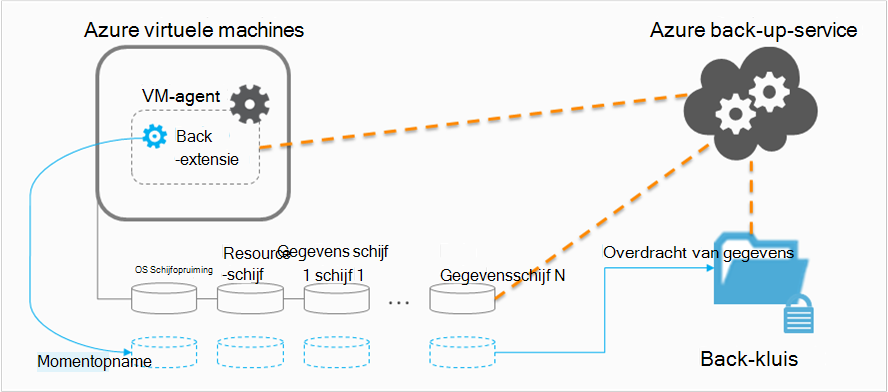

<properties
    pageTitle="Planning van de back-infrastructuur van uw VM in Azure | Microsoft Azure"
    description="Belangrijke overwegingen bij het plannen van back-up virtuele machines in Azure wordt aangegeven"
    services="backup"
    documentationCenter=""
    authors="markgalioto"
    manager="cfreeman"
    editor=""
    keywords="back-up vms, maakt u een back-up van virtuele machines"/>

<tags
    ms.service="backup"
    ms.workload="storage-backup-recovery"
    ms.tgt_pltfrm="na"
    ms.devlang="na"
    ms.topic="article"
    ms.date="10/19/2016"
    ms.author="trinadhk; jimpark; markgal;"/>

# <a name="plan-your-vm-backup-infrastructure-in-azure"></a>De back-infrastructuur van uw VM in Azure plannen
In dit artikel vindt u prestaties en suggesties van de resource zodat u kunt de back-infrastructuur van uw VM plannen. Definieert ook belangrijke aspecten van de back-up-service; deze aspecten kunnen zijn bij het bepalen van de architectuur, kritieke capaciteit en planningen. Als u [uw omgeving voorbereid hebt](backup-azure-vms-prepare.md), is dit de volgende stap, voordat u [met het back-up VMs begint](backup-azure-vms.md). Als u meer informatie over Azure virtuele machines nodig hebt, raadpleegt u de [documentatie van virtuele Machines](https://azure.microsoft.com/documentation/services/virtual-machines/).

## <a name="how-does-azure-back-up-virtual-machines"></a>Hoe werkt Azure virtuele machines back-up?
Wanneer de back-Azure-service tot stand een back-uptaak op het geplande tijdstip brengt, wordt de back-extensie een punt-in-time momentopname maken. Deze momentopname is, wordt in combinatie met de Volume schaduw Copy Service (VSS) om een consistente momentopname van de schijven in de virtuele machine zonder af te sluiten.

Nadat de momentopname is gemaakt, wordt de gegevens door de Azure back-service overgebracht naar de back-kluis. Als u de back-proces efficiënter, de service identificeert en brengt alleen de blokken met gegevens die zijn gewijzigd sinds de laatste back-up.



Wanneer de gegevensoverdracht voltooid is, wordt de momentopname wordt verwijderd en wordt een herstelpunt wordt gemaakt.

### <a name="data-consistency"></a>Consistentie van de gegevens
Een back-up en herstellen van bedrijven belangrijke gegevens is dit ingewikkeld door het feit dat kritieke bedrijfsgegevens moet worden back-up gemaakt tijdens de toepassingen die leiden de gegevens tot worden uitgevoerd. Om dit op te lossen, biedt Azure back-up-toepassing consistente back-ups voor Microsoft werkbelasting met behulp van VSS om ervoor te zorgen dat de gegevens correct is geschreven naar opslag.

>[AZURE.NOTE] Voor Linux virtuele machines zijn alleen bestand consistente back-ups mogelijk, aangezien Linux geen een equivalente platform VSS. heeft

Azure back-up krijgt volledige back-ups van VSS Windows VMs (Lees meer over [de volledige back-up VSS](http://blogs.technet.com/b/filecab/archive/2008/05/21/what-is-the-difference-between-vss-full-backup-and-vss-copy-backup-in-windows-server-2008.aspx)). Back-ups VSS kopiëren, de onder register sleutels moet worden ingesteld op de VM.

```
[HKEY_LOCAL_MACHINE\SOFTWARE\MICROSOFT\BCDRAGENT]
"USEVSSCOPYBACKUP"="TRUE"
```


De volgende tabel beschrijft de soorten consistentie en de voorwaarden die ze onder tijdens Azure VM optreden back-up maken en terugzetten procedures.

| Consistentie | VSS gebaseerde | Uitleg en details |
|-------------|-----------|---------|
| Consistentie van toepassing | Ja | Dit is het type ideaal consistentie voor Microsoft-werkbelastingen als deze zorgt ervoor dat:<ol><li> De VM *wordt gestart*. <li>Er is *geen beschadigde bestanden*. <li>Er is *geen gegevens verloren gaan*.<li> De gegevens is consistent zijn om de toepassing die met de gegevens, door de toepassing op het moment van back-up--met VSS.</ol> De meeste Microsoft werkbelasting hebben VSS-schrijvers die werkbelasting / regiospecifieke acties die betrekking op consistentie van de gegevens hebben uitvoeren. Microsoft SQL Server bevat bijvoorbeeld een VSS-schrijver die ervoor zorgt dat het schrijven naar het transactielogboekbestand en de database correct zijn voltooid.<br><br> Voor Azure VM betekent back-ups, aan een toepassing consistente herstelpunt dat de back-extensie kon aanroepen van de werkstroom VSS en *correct* voltooid voordat de momentopname VM is gemaakt. Natuurlijk betekent dit dat de VSS-schrijvers van alle toepassingen in de VM Azure ook aangeroepen.<br><br>(Informatie over de [Basisbeginselen van VSS](http://blogs.technet.com/b/josebda/archive/2007/10/10/the-basics-of-the-volume-shadow-copy-service-vss.aspx) en zoomen diepblauwe in de details van [hoe dit werkt](https://technet.microsoft.com/library/cc785914%28v=ws.10%29.aspx)). |
| Consistentie van de-bestandssysteem | Ja, voor Windows-computers | Er zijn twee scenario's, waarbij de komma herstel *bestandssysteem consistente*kan zijn:<ul><li>Back-ups van Linux VMs in Azure wordt aangegeven, aangezien Linux geen een equivalente platform VSS. heeft<li>VSS is mislukt tijdens back-up voor Windows VMs in Azure wordt aangegeven.</li></ul> In beide gevallen is de beste die kan worden uitgevoerd om ervoor te zorgen dat: <ol><li> De VM *wordt gestart*. <li>Er is *geen beschadigde bestanden*.<li>Er is *geen gegevens verloren gaan*.</ol> Toepassingen moeten hun eigen 'herstel van' om op de herstelde gegevens implementeren.|
| Consistentie vastlopen | Nee | Deze situatie is gelijk aan een virtuele machine met 'vastlopen"(via een van beide een zacht of hard terugzetten) te maken. Dit gebeurt meestal wanneer de Azure virtuele machine op het moment van back-up is afgesloten. Back-ups van Azure virtuele machines krijgt geen garanties rond de consistentie van de gegevens aan een vastlopen consistente herstel punt betekent dat Azure back-up op het opslagmedium--vanuit het perspectief van het besturingssysteem of vanuit het perspectief van de toepassing. Alleen gegevens die al op de schijf op het moment van back-up is wat wordt vastgelegd en back-up gemaakt. <br/> <br/> Er zijn geen garanties, in de meeste gevallen wordt het besturingssysteem wordt opgestart. Dit is meestal gevolgd door een procedure controleren van de schijf, zoals chkdsk, om eventuele fouten beschadigde bestanden te herstellen. Alle gegevens in het geheugen of schrijft die niet volledig naar de schijf leeggemaakt niet verloren. De toepassing volgt meestal met een eigen om verificatie geval gegevens terugdraaien eenmaal te worden uitgevoerd. <br><br>Als voorbeeld, als het transactielogboek bevat gegevens die niet aanwezig in de database zijn, biedt klikt u vervolgens de databasesoftware een terugdraaien totdat de gegevens consistent is. Wanneer u gegevens is verspreid over meerdere virtuele schijven (zoals spanned volumes), biedt een herstelpunt vastlopen consistente geen garanties voor de gegevens.|


## <a name="performance-and-resource-utilization"></a>Gebruik van prestaties en resource
Net als de back-software die wordt geïmplementeerd on-premises, moet u plannen voor capaciteit en Resourcegebruik behoeften back-ups van VMs in Azure wordt aangegeven. De [Azure opslaglimieten](azure-subscription-service-limits.md#storage-limits) definiëren structuur VM implementaties optimale prestaties met minimale impact werkbelasting uitgevoerd.

Let op de volgende Azure opslaglimieten bij het plannen van back-prestaties:

- Max egress per opslag-account
- Totale verzoek tarieven per opslag-account

### <a name="storage-account-limits"></a>Opslaglimieten voor account
Wanneer u gegevens back-up van een opslag-account wordt gekopieerd, telt deze richting van de invoer/uitvoer-bewerkingen per seconde (IO's / s) en egress (of doorvoer) aan de doelstellingen van de opslag-account. Tegelijkertijd, zijn de virtuele machines uitgevoerd en verbruikt IO's / s en doorvoer. Het doel is om ervoor te zorgen dat het totale verkeer - back-up en virtuele machine - niet groter is dan de account opslaglimieten.

### <a name="number-of-disks"></a>Aantal schijven
Het back-proces wordt geprobeerd om te voltooien van een back-uptaak zo snel mogelijk. Zo gebruikt deze net zo veel resources geplaatst. Alle i/o-bewerkingen zijn echter beperkt door de *Doel-doorvoer voor één Blob*, die een limiet van 60 MB per seconde bevat. Een poging om u te maximaliseren de snelheid, probeert het back-proces om het back-up van elk van de de VM schijven *parallel*. Ja, als een VM vier schijven heeft, klikt u vervolgens Azure back-up probeert te back-up van alle vier schijven parallel. Reden de belangrijkste factor vaststellen back-verkeer afsluiten van een klant opslag-account is het **aantal schijven** wordt back-up van het account opslag.

### <a name="backup-schedule"></a>Back-ups plannen
Een extra factor die van invloed op prestaties is de **back-ups plannen**. Als u het beleid configureren zodat alle VMs back-up op hetzelfde moment gemaakt zijn, kunt u een vastgelopen verkeer hebt gepland. Het back-proces probeert te back-up van alle schijven parallel. Kunt u de back-verkeer van een account opslag verlagen: zorgen dat andere VMs zijn back-up gemaakt op verschillende momenten van de dag, met geen overlap.

## <a name="capacity-planning"></a>Capaciteit plannen
Het samenstellen van al deze factoren betekent dat er gebruik van opslag-account moet worden correct gepland. Download het [VM back-up capaciteit planning Excel-werkblad](https://gallery.technet.microsoft.com/Azure-Backup-Storage-a46d7e33) om te zien wat de invloed van de schijf en opties voor back-ups plannen.

### <a name="backup-throughput"></a>Back-doorvoer
Voor elke schijf back-up wordt gemaakt, Azure back-up leest de blokken op de schijf en slaat alleen de gewijzigde gegevens (incrementele back-up). Deze tabel worden de waarden gemiddelde doorvoer dat u van Azure back-up verwachten kunt. U kunt de hoeveelheid tijd die het duurt back-up een schijf van een bepaalde grootte met deze schatten.

| Back-up | Beste doorvoer |
| ---------------- | ---------- |
| Eerste back-up | 160 Mbps |
| Incrementele back-up (DR) | 640 Mbps <br><br> Deze doorvoer kunt aanzienlijk afnemen als er een groot aantal verspreid lospeuteren op de schijf dat worden back moet-up is gemaakt. |

## <a name="total-vm-backup-time"></a>Totale tijd voor VM-back-up
De grootste van een gedeelte van de back-tijd is besteed aan lezen en gegevens kopiëren, maar er zijn andere bewerkingen die aan de totale tijd die nodig zijn bijdragen voor het back-up van een VM:

- De tijd die nodig is kunt [installeren of bijwerken van de back-extensie](backup-azure-vms.md#offline-vms).
- Momentopname tijd, dat wil zeggen de tijd een momentopname activeren. Momentopnamen worden dicht bij de geplande back-tijd geactiveerd.
- Wachttijd in. Aangezien de back-up-service back-ups van meerdere klanten verwerkt, kopiëren van back-upgegevens van momentopname naar de back-up of herstel Services kluis niet onmiddellijk wordt gestart. In tijden van piek laden, de actiewachten kunt uitrekken maximaal acht uur vanwege het aantal back-ups wordt verwerkt. De totale tijd van de VM-back-up is echter minder dan 24 uur voor dagelijkse back-beleid.

## <a name="best-practices"></a>Aanbevolen procedures
Wordt u aangeraden na deze procedures tijdens het configureren van back-ups voor virtuele machines:

- Niet meer dan vier klassieke VMs van de dezelfde cloudservice back-up op hetzelfde moment plannen. Het is raadzaam om back-up begintijden spreiding een uur als u wilt een back-up meerdere VMs van dezelfde cloudservice.
- Niet meer dan 40 resourcemanager geïmplementeerd VMs back-up op hetzelfde moment plant.
- VM back-ups plannen niet-piek tijden, zodat de back-service IO's / s gebruikt voor de overdracht van gegevens van het klantaccount opslag naar de back-up of herstel Services kluis.
- Zorg ervoor dat een beleid VMs verdeeld over verschillende opslag accounts adressen. Wordt u aangeraden niet meer dan 20 totale schijven van een account één opslag zijn beveiligd met één beleid. Als u groter is dan 20 schijven in een opslag-account hebt, verdeeld over deze VMs meerdere beleidsregels om de vereiste IO's / s tijdens de fase doorverbinden van de back-up.
- Niet lukt om een VM uitgevoerd op de Premium-opslag hetzelfde opslag account herstellen. Als het herstelproces bewerking valt met de back-up samen, worden deze de beschikbare IO's / s voor back-up.
- Het is raadzaam om elke VM Premium uitgevoerd op een account van de opslagruimte distinct premium optimale back-prestaties te garanderen.

## <a name="data-encryption"></a>Gegevensversleuteling

Azure back-up wordt niet gegevens als onderdeel van de back-up gecodeerd. U kunt echter gegevens binnen de VM versleutelen en back-up van de beveiligde gegevens naadloos (Lees meer over [back-up van de versleutelde gegevens](backup-azure-vms-encryption.md)).


## <a name="how-are-protected-instances-calculated"></a>Hoe worden beveiligde exemplaren berekend?
Azure virtuele machines die back-up via Azure back-up gemaakt zijn zijn onderhevig aan [Azure back-up prijzen](https://azure.microsoft.com/pricing/details/backup/). De berekening van de beveiligde exemplaren is gebaseerd op de *werkelijke* grootte van de virtuele machine, dat wil de som van alle gegevens in de virtuele machine zeggen--met uitzondering van de 'resource-schijf'.

U bent *niet* gefactureerd gebaseerd op de maximale grootte die voor elke gegevensschijf is gekoppeld aan de virtuele machine wordt ondersteund, maar op de werkelijke gegevens die zijn opgeslagen in de gegevensschijf. Op dezelfde manier is de factuur back-up opslaan gebaseerd op de hoeveelheid gegevens die zijn opgeslagen met Azure back-ups, die is de som van de werkelijke gegevens in elk opsommingsteken herstel.

Duurt bijvoorbeeld een VM A2 standaard grootte die twee aanvullende gegevensschijven met een maximale grootte van 1 TB heeft. De onderstaande tabel bevat de werkelijke gegevens die zijn opgeslagen op elk van deze schijven:

|Schijftype|Maximumgrootte|Werkelijke gegevens presenteren|
|---------|--------|------|
| Besturingssysteem Schijfopruiming | 1023 GB | 17 GB |
| Lokale schijf / Resource-schijf | 135 GB | 5 GB (niet inbegrepen voor back-up) |
| Gegevensschijf 1 | 1023 GB | 30 GB |
| Gegevensschijf 2 | 1023 GB | 0 GB |

De *werkelijke* grootte van de virtuele machine is in dit geval 17 GB + 30 GB + 0 GB = 47 GB. Dit wordt de beveiligde exemplaar grootte die de maandelijkse factuur is gebaseerd op. Als de hoeveelheid gegevens in de virtuele machine omvang groeit, kan dit tot gevolg hebben dat de grootte van de beveiligde exemplaar gebruikt voor de facturering ook wordt gewijzigd.

Facturering begint niet totdat de eerste geslaagde back-up is voltooid. Nu wordt de facturering voor zowel opslag als beveiligde exemplaren gestart. Facturering blijft zo lang maken als er *een back-gegevens die zijn opgeslagen met Azure back-ups* voor de virtuele machine is. De bewerking beveiliging stoppen stopt niet de facturering als de back-gegevens blijven behouden.

De facturering voor een opgegeven virtuele machine wordt stopgezet alleen als de beveiliging gestopt *en is* een back-upgegevens wordt verwijderd. Als er geen actieve back-taken (wanneer de beveiliging is gestopt), wordt de grootte van de virtuele machine op het moment van de laatste geslaagde back-up de beveiligde exemplaar grootte die de maandelijkse factuur is gebaseerd op.

## <a name="questions"></a>Vragen?
Als u vragen hebt of als er is een functie die u wilt zien opgenomen, [Stuur ons feedback](http://aka.ms/azurebackup_feedback).

## <a name="next-steps"></a>Volgende stappen

- [Een back-up virtuele machines](backup-azure-vms.md)
- [VM back-up beheren](backup-azure-manage-vms.md)
- [Virtuele machines herstellen](backup-azure-restore-vms.md)
- [VM back-problemen oplossen](backup-azure-vms-troubleshoot.md)
