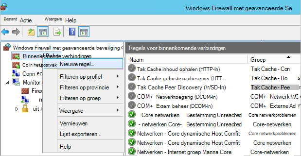

<properties
    pageTitle="Voorbereiden van uw omgeving back-up Azure virtuele machines | Microsoft Azure"
    description="Controleer of dat uw omgeving is voorbereid voor een back-up virtuele machines in Azure wordt aangegeven"
    services="backup"
    documentationCenter=""
    authors="markgalioto"
    manager="cfreeman"
    editor=""
    keywords="back-ups; een back-up;"/>

<tags
    ms.service="backup"
    ms.workload="storage-backup-recovery"
    ms.tgt_pltfrm="na"
    ms.devlang="na"
    ms.topic="article"
    ms.date="08/26/2016"
    ms.author="trinadhk; jimpark; markgal;"/>


# <a name="prepare-your-environment-to-back-up-azure-virtual-machines"></a>Voorbereiden van uw omgeving back-up Azure virtuele machines

> [AZURE.SELECTOR]
- [Resource manager model](backup-azure-arm-vms-prepare.md)
- [Klassieke model](backup-azure-vms-prepare.md)

Voordat u kunt een back-up een Azure virtuele machine (VM), zijn er drie voorwaarden moeten bestaan.

- U moet een back-kluis maken of een bestaande back-kluis *in hetzelfde gebied, als uw VM*identificeren.
- Geen netwerkverbinding tussen de Azure openbare Internet-adressen en de eindpunten Azure opslag.
- Installeer de VM-agent op de VM.

Als u weet dat deze voorwaarden wordt voldaan al in uw omgeving gaat u verder met de [Back-up van uw artikel VMs](backup-azure-vms.md). Anders leidt lezen op, in dit artikel u via de stappen voor het voorbereiden van uw omgeving back-up een VM Azure.


## <a name="limitations-when-backing-up-and-restoring-a-vm"></a>Beperkingen als een back-up en herstellen van een VM

>[AZURE.NOTE] Azure heeft twee implementatiemodellen voor het maken en werken met resources: [resourcemanager en klassiek](../resource-manager-deployment-model.md). De volgende lijst bevat de beperkingen bij de implementatie in het klassieke model.

- Een back-up virtuele machines met meer dan 16 gegevensschijven wordt niet ondersteund.
- Een back-up virtuele machines met een gereserveerde IP-adres en geen gedefinieerde eindpunt wordt niet ondersteund.
- Back-upgegevens niet zijn opgenomen in gekoppeld netwerkstations die zijn bijgevoegd bij VM. 
- Een bestaande VM vervangen tijdens herstellen wordt niet ondersteund. Verwijder eerst de bestaande virtuele machine en alle bijbehorende schijven en zet u de gegevens uit back-up.
- Cross-regio back-up en herstellen wordt niet ondersteund.
- Een back-up virtuele machines met behulp van de back-up van Azure-service wordt ondersteund in alle openbare regio's van Azure (Zie de [Controlelijst](https://azure.microsoft.com/regions/#services) met ondersteunde regio's). Als het gebied dat u zoekt niet-ondersteunde vandaag, wordt deze niet weergegeven in de vervolgkeuzelijst tijdens het maken van kluis.
- Een back-up virtuele machines met behulp van de back-up van Azure-service wordt alleen ondersteund voor select besturingssystemen:
  - **Linux**: Azure back-up-ondersteuning biedt voor [een lijst met onderzoeken die worden goedgekeurd door Azure](../virtual-machines/virtual-machines-linux-endorsed-distros.md) behalve Core OS Linux. Andere voren-uw-eigenaar bent van-Linux onderzoeken kunnen ook werken, zolang de VM-agent beschikbaar op de virtuele machine is en ondersteuning voor Python bestaat.
  - **Windows Server**: versies die ouder zijn dan Windows Server 2008 R2 worden niet ondersteund.
- Een domeincontroller herstellen wordt (domeincontroller) VM die deel uitmaakt van een configuratie multi-domeincontroller alleen via PowerShell ondersteund. Meer informatie over het [herstellen van een domeincontroller multi-domeincontroller](backup-azure-restore-vms.md#restoring-domain-controller-vms).
- Virtuele machines die u de volgende speciale netwerkconfiguraties hebt herstellen wordt alleen via PowerShell ondersteund. VMs die u maakt met behulp van de werkstroom terugzetten in de gebruikersinterface, hebben geen van deze netwerkconfiguraties nadat de bewerking herstellen voltooid is. Meer informatie raadpleegt u [VMs met speciale netwerkconfiguraties herstellen](backup-azure-restore-vms.md#restoring-vms-with-special-netwrok-configurations).
    - Virtuele machines onder configuratie van de verdeling voor laden (interne en externe)
    - Virtuele machines met meerdere gereserveerde IP-adressen
    - Virtuele machines met meerdere netwerkadapters

## <a name="create-a-backup-vault-for-a-vm"></a>Een back-kluis maken voor een VM

Een back-kluis is een entiteit waarmee de back-ups en herstel punten die zijn gemaakt na verloop van tijd opgeslagen. De back-kluis bevat ook de back-beleid dat wordt toegepast op de virtuele machines back-up wordt gemaakt.

Deze afbeelding ziet u de relaties tussen de verschillende Azure back-up-entiteiten:     

Een back-kluis maken:

1. Meld u aan bij de [portal van Azure](http://manage.windowsazure.com/).

2. Klik in de portal van Azure op **Nieuw** > **Hybride integratie** > **back-up**. Als u een **back-up**klikt, wordt u automatisch overschakelen naar de klassieke-portal (weergegeven na de notitie).

    

    >[AZURE.NOTE] Als uw abonnement het laatst is gebruikt in de klassieke-portal, kan vervolgens uw abonnement openen in de klassieke portal. In dit geval u een back-kluis door op **Nieuw** > **Gegevensservices** > **Herstel Services** > **Back-kluis** > **Snelle maken** (Zie de onderstaande afbeelding).

    

3. Voer een beschrijvende naam voor de kluis voor de **naam**. De naam moet uniek zijn voor het Azure abonnement. Typ een naam die tussen 2 en 50 tekens bevat. Er moet beginnen met een letter en mogen alleen letters, cijfers en afbreekstreepjes.

4. Selecteer in de **regio**, de geografische regio voor de kluis. De kluis moet zich in hetzelfde gebied, als de virtuele machines die u wilt beveiligen. Als u virtuele machines in meerdere regio's hebt, moet u een back-kluis in elke regio. Er is niet nodig kunt u opslagruimte accounts voor de opslag van de back-upgegevens--de back-kluis en de back-Azure-service greep opgeven dit automatisch.

5. Selecteer het abonnement dat u wilt koppelen aan de back-kluis in **abonnement** . Er zijn meerdere keuzemogelijkheden alleen als uw organisatie-account gekoppeld aan meerdere Azure abonnementen is.

6. Klik op **maken kluis**. Het kan even duren voordat de back-kluis moet worden gemaakt. Controleer de statusmeldingen onderaan in de portal.

    

7. Een bericht wordt vastgesteld dat de kluis is gemaakt. Deze wordt weergegeven op de pagina **herstel services** als **actief**. Controleer of de juiste opslag redundantie optie rechts kiezen nadat de kluis is gemaakt. Meer informatie over het [instellen van de optie opslag redundantie in de back-kluis](backup-configure-vault.md#azure-backup---storage-redundancy-options).

    

8. Klik op de back-kluis om te gaan naar de pagina **Snel starten** , waar u de instructies voor het back-ups van Azure virtuele machines worden weergegeven.

    


## <a name="network-connectivity"></a>Netwerkconnectiviteit

Om te kunnen beheren de momentopnamen VM, moet de back-extensie connectiviteit met de Azure openbare IP-adressen. Time-out van de VM HTTP-aanvragen en het back-up mislukt zonder de juiste Internet connectivity. Als uw implementatie heeft toegangsbeperkingen op hun plaats staan (via een netwerk beveiligingsgroep (NSG), bijvoorbeeld), kies een van de volgende opties voor het leveren van een wissen pad voor back-verkeer:

- ["Witte" lijst de Azure datacenter IP-bereiken](http://www.microsoft.com/en-us/download/details.aspx?id=41653) - Zie het artikel voor instructies over hoe naar "witte" lijst de IP-adressen.
- Een HTTP-proxy-server voor het routeren van verkeer implementeren.

Bij het kiezen welke optie u moet gebruiken, zijn de voor-en nadelen tussen beheerbaarheid, detail te beheren en kosten.

|Optie|Voordelen|Nadelen|
|------|----------|-------------|
|Whitelist IP-adresbereiken| Geen extra kosten.<br><br>Voor het openen van access in een NSG, gebruikt u de cmdlet <i>Set-AzureNetworkSecurityRule</i> . | Complexe beheren als het risico IP-bereiken stadium worden gewijzigd.<br><br>Biedt toegang tot het geheel van Azure en niet alleen opslag.|
|HTTP-proxy| Gedetailleerde controle in de proxy over de opslag toegestaan voor URL's.<br>Één punt van om toegang tot Internet VMs.<br>Niet onderworpen aan Azure IP-adres wijzigingen.| Extra kosten voor het uitvoeren van een VM met de proxysoftware.|

### <a name="whitelist-the-azure-datacenter-ip-ranges"></a>IP-bereiken gebruikt "witte" lijst het Azure datacenter

Naar "witte" lijst Lees de Azure datacenter IP-bereiken, de [Azure website](http://www.microsoft.com/en-us/download/details.aspx?id=41653) voor meer informatie over de IP-bereiken, en instructies.

### <a name="using-an-http-proxy-for-vm-backups"></a>Met behulp van een HTTP-proxy voor VM back-ups
Wanneer u een back-up een VM, verzendt de back-extensie op de VM de opdrachten voor het beheer van momentopname met Azure Storage een HTTPS-API gebruiken. De back-extensie het verkeer via het HTTP-proxy routeert gezien het feit het enige onderdeel dat is geconfigureerd voor toegang tot openbare Internet is.

>[AZURE.NOTE] Er is geen aanbeveling voor de proxysoftware die moet worden gebruikt. Zorg ervoor dat u een proxy die compatibel is met de volgende configuratiestappen uit onderstaande kiezen.

Het onderstaande voorbeeldafbeelding ziet u de drie configuratiestappen nodig een HTTP-proxy gebruikt:

- App VM routeert alle HTTP-verkeer afhankelijke waarden voor de openbare Internet via Proxy VM.
- Proxy VM kunt binnenkomende verkeer bij VMs in het virtuele netwerk.
- Het netwerk beveiliging groep (NSG) met de naam Geweigerde-vergrendelde vereisten voor een waardepapier regel toestaan uitgaande internetverkeer naar Proxy VM.


Als u wilt gebruiken een HTTP-proxy om te communiceren met de openbare Internet, als volgt te werk:

#### <a name="step-1-configure-outgoing-network-connections"></a>Stap 1. Uitgaande netwerkverbindingen configureren
###### <a name="for-windows-machines"></a>Voor Windows-computers
Hiermee wordt setup-configuratie voor lokale systeemaccount proxyserver.

1. [Gg.bat](https://technet.microsoft.com/sysinternals/bb897553) downloaden
2. Voer de volgende opdracht uit met verhoogde bevoegdheid om

     ```
     psexec -i -s "c:\Program Files\Internet Explorer\iexplore.exe"
     ```
     Internet explorer-venster wordt geopend.
3. Ga naar Extra -> Internet-opties -> verbindingen -> LAN-instellingen.
4. Controleer of proxy-instellingen voor systeemaccount. IP-Proxy en poort instellen.
5. Sluit Internet Explorer.

Dit wordt ook wel een alle computers proxyconfiguratie instellen en worden gebruikt voor alle uitgaande HTTP-/ HTTPS-verkeer is toegestaan.

Als u hebt een proxyserver ingesteld voor een huidige gebruikersaccount (niet een lokale systeemaccount), gebruikt u het volgende script SYSTEMACCOUNT toepassen:

```
   $obj = Get-ItemProperty -Path Registry::”HKEY_CURRENT_USER\Software\Microsoft\Windows\CurrentVersion\Internet Settings\Connections"
   Set-ItemProperty -Path Registry::”HKEY_USERS\S-1-5-18\Software\Microsoft\Windows\CurrentVersion\Internet Settings\Connections" -Name DefaultConnectionSettings -Value $obj.DefaultConnectionSettings
   Set-ItemProperty -Path Registry::”HKEY_USERS\S-1-5-18\Software\Microsoft\Windows\CurrentVersion\Internet Settings\Connections" -Name SavedLegacySettings -Value $obj.SavedLegacySettings
   $obj = Get-ItemProperty -Path Registry::”HKEY_CURRENT_USER\Software\Microsoft\Windows\CurrentVersion\Internet Settings"
   Set-ItemProperty -Path Registry::”HKEY_USERS\S-1-5-18\Software\Microsoft\Windows\CurrentVersion\Internet Settings" -Name ProxyEnable -Value $obj.ProxyEnable
   Set-ItemProperty -Path Registry::”HKEY_USERS\S-1-5-18\Software\Microsoft\Windows\CurrentVersion\Internet Settings" -Name Proxyserver -Value $obj.Proxyserver
```

>[AZURE.NOTE] Als u '(407) proxyverificatie vereist' in het logboek proxy-server constateert, controleert u dat uw authrntication juist is geconfigureerd.

######<a name="for-linux-machines"></a>Voor Linux machines

Voeg de volgende regel aan de ```/etc/environment``` bestand:

```
http_proxy=http://<proxy IP>:<proxy port>
```

Voeg de volgende regels aan de ```/etc/waagent.conf``` bestand:

```
HttpProxy.Host=<proxy IP>
HttpProxy.Port=<proxy port>
```

#### <a name="step-2-allow-incoming-connections-on-the-proxy-server"></a>Stap 2. Binnenkomende verbindingen toestaan op de proxyserver:

1. Open Windows Firewall op de proxyserver. De eenvoudigste manier om toegang tot de firewall is om te zoeken naar Windows Firewall met geavanceerde beveiliging.

    

2. Klik in het dialoogvenster Windows Firewall met de rechtermuisknop op **Regels voor binnenkomende verbindingen** en klik op **Nieuwe regel...**.

    

3. In de **Inkomende Wizard nieuwe regel**, kiest u de optie **aangepast** voor het **Type regel** en klik op **volgende**.

4. Klik op de pagina om het **programma**te selecteren, kiest u **Alle programma's** en klik op **volgende**.

5. Voer de volgende gegevens op de pagina **protocollen en poorten** en klik op **volgende**:

    

    - Kies bij *protocoltype* *TCP*
    - voor *lokale poort* kiest u *Specifieke poorten*, Geef in het onderstaande veld de ```<Proxy Port>``` die is geconfigureerd.
    - Selecteer *Alle poorten* voor *externe poort*

    Voor de rest van de wizard, klikt u op helemaal naar het einde en geef een naam op voor deze regel.

#### <a name="step-3-add-an-exception-rule-to-the-nsg"></a>Stap 3. Een uitzonderingsregel voor het toevoegen aan de NSG:

Voer de volgende opdracht in een opdrachtprompt Azure PowerShell:

De volgende opdracht wordt een uitzondering aan de NSG. Deze uitzondering staat TCP-verkeer van elke poort op 10.0.0.5 naar een internetadres op poort 80 (HTTP) of 443 (HTTPS). Als u een specifieke poort in het openbare Internet vereist, zorg ervoor dat u om toe te voegen die poort naar de ```-DestinationPortRange``` ook.

```
Get-AzureNetworkSecurityGroup -Name "NSG-lockdown" |
Set-AzureNetworkSecurityRule -Name "allow-proxy " -Action Allow -Protocol TCP -Type Outbound -Priority 200 -SourceAddressPrefix "10.0.0.5/32" -SourcePortRange "*" -DestinationAddressPrefix Internet -DestinationPortRange "80-443"
```

*Zorg ervoor dat u de namen in het voorbeeld door de details die geschikt zijn voor uw implementatie vervangen.*


## <a name="vm-agent"></a>VM-agent

Voordat u kunt een back-up van de Azure virtuele machine, moet u ervoor zorgen dat de agent Azure VM juist is geïnstalleerd op de virtuele machine. Aangezien de VM-agent een optioneel onderdeel op het moment dat de virtuele machine wordt gemaakt is, moet u ervoor zorgen dat het selectievakje in voor de VM-agent is ingeschakeld voordat de virtuele machine is ingericht.

### <a name="manual-installation-and-update"></a>Handmatige installatie en bijwerken

De VM-agent is al aanwezig in VMs die zijn gemaakt vanuit de galerie met Azure. Virtuele machines die worden gemigreerd van on-premises implementatie datacenters moet echter niet de VM-agent is geïnstalleerd. Voor deze VMs moet de VM-agent expliciet zijn geïnstalleerd. Meer informatie over het [installeren van de VM-agent op een bestaande VM](http://blogs.msdn.com/b/mast/archive/2014/04/08/install-the-vm-agent-on-an-existing-azure-vm.aspx).

| **Bewerking** | **Windows** | **Linux** |
| --- | --- | --- |
| Installatie van de VM-agent | <li>Download en installeer de [agent MSI](http://go.microsoft.com/fwlink/?LinkID=394789&clcid=0x409). Moet u beheerdersrechten om de installatie te voltooien. <li>[De eigenschap VM bijwerken](http://blogs.msdn.com/b/mast/archive/2014/04/08/install-the-vm-agent-on-an-existing-azure-vm.aspx) om aan te geven dat de-agent is geïnstalleerd. | <li> Installeer de meest recente [Linux-agent](https://github.com/Azure/WALinuxAgent) vanaf GitHub. Moet u beheerdersrechten om de installatie te voltooien. <li> [De eigenschap VM bijwerken](http://blogs.msdn.com/b/mast/archive/2014/04/08/install-the-vm-agent-on-an-existing-azure-vm.aspx) om aan te geven dat de-agent is geïnstalleerd. |
| De VM-agent bijwerken | Bijwerken van de VM-agent is net zo eenvoudig als het [VM agent binaire bestanden](http://go.microsoft.com/fwlink/?LinkID=394789&clcid=0x409)opnieuw te installeren. <br><br>Zorg ervoor dat er geen back-up wordt uitgevoerd, terwijl de VM-agent wordt bijgewerkt. | Volg de instructies over het [bijwerken van de Linux VM-agent ](../virtual-machines-linux-update-agent.md). <br><br>Zorg ervoor dat er geen back-up wordt uitgevoerd, terwijl de VM-agent wordt bijgewerkt. |
| De installatie van de agent VM valideren | <li>Navigeer naar de map *C:\WindowsAzure\Packages* in de VM Azure. <li>U moet de huidige WaAppAgent.exe-bestand hebt gevonden.<li> Met de rechtermuisknop op het bestand, gaat u naar **Eigenschappen**en selecteer vervolgens het tabblad **Details** . Het veld productversie moet 2.6.1198.718 of hoger. | N/B |


Meer informatie over de [VM-agent](https://go.microsoft.com/fwLink/?LinkID=390493&clcid=0x409) en [hoe u het kunt installeren](https://azure.microsoft.com/blog/2014/04/15/vm-agent-and-extensions-part-2/).

### <a name="backup-extension"></a>Back-extensie

Als u wilt back-up van de virtuele machine, installeert u de back-up van Azure-service extensie in de VM-agent. De back-Azure-service naadloos upgrades en patches van de back-extensie zonder tussenkomst van andere gebruikers.

De back-extensie is geïnstalleerd als de VM wordt uitgevoerd. Een actieve VM bevat ook de grootste kans een toepassing consistente herstelpunt. Echter de Azure back-up service back-up van de VM blijft--zelfs als dit is uitgeschakeld en de extensie kan niet worden geïnstalleerd (ook bekend Offline VM). In dit geval is de komma herstel *vastlopen consistent* zoals hierboven wordt beschreven.


## <a name="questions"></a>Vragen?
Als u vragen hebt of als er is een functie die u wilt zien opgenomen, [Stuur ons feedback](http://aka.ms/azurebackup_feedback).

## <a name="next-steps"></a>Volgende stappen
Nu dat u hebt uw omgeving voor een back-up uw VM voorbereid, is uw volgende logische stap een back-up maken. De planning artikel vindt meer gedetailleerde informatie over een back-up VMs.

- [Een back-up virtuele machines](backup-azure-vms.md)
- [De infrastructuur van uw VM back-ups plannen](backup-azure-vms-introduction.md)
- [VM back-ups beheren](backup-azure-manage-vms.md)
