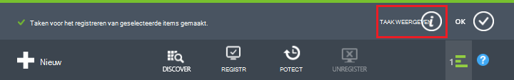
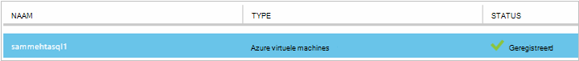
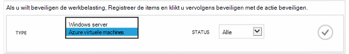
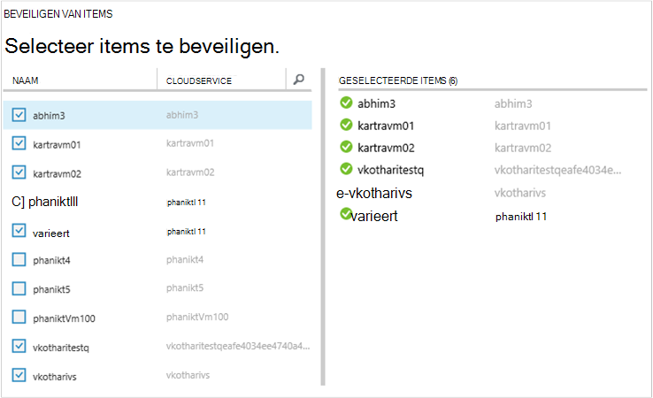
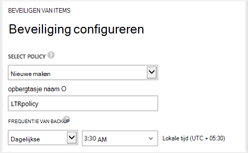
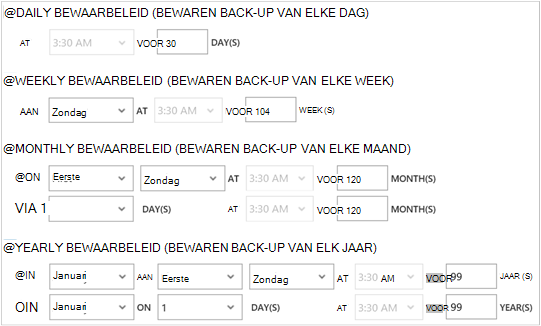

<properties
    pageTitle="Maak een back-up van Azure virtuele machines | Microsoft Azure"
    description="Ontdekken, registreren en back-up van uw virtuele machines met deze procedures voor back-up van Azure virtuele machines."
    services="backup"
    documentationCenter=""
    authors="markgalioto"
    manager="jwhit"
    editor=""
    keywords="VM back-up. een back-up VM; back-up en noodgevallen herstel; VM back-up maken"/>

<tags
    ms.service="backup"
    ms.workload="storage-backup-recovery"
    ms.tgt_pltfrm="na"
    ms.devlang="na"
    ms.topic="article"
    ms.date="09/28/2016"
    ms.author="trinadhk; jimpark; markgal;"/>

# Back-up van Azure virtuele machines

> [AZURE.SELECTOR]
- [Een back-up VMs naar herstel Services kluis](backup-azure-arm-vms.md)
- [Back-up VMs op back-up kluis](backup-azure-vms.md)

In dit artikel vindt de procedures voor het back-ups van een klassieke geïmplementeerd Azure virtuele machine (VM) naar een back-up-kluis. Er zijn een paar taken die u verrichten moet voordat u een back-up van een Azure virtuele machines kunt maken. Als u dit nog niet hebt gedaan, voert u de [vereisten](backup-azure-vms-prepare.md) om het voorbereiden van uw omgeving voor een back-up uw VMs.

Zie de artikelen over het [plannen van de back-infrastructuur van uw VM in Azure wordt aangegeven](backup-azure-vms-introduction.md) en [Azure virtuele machines](https://azure.microsoft.com/documentation/services/virtual-machines/)voor aanvullende informatie.

>[AZURE.NOTE] Azure heeft twee implementatiemodellen voor het maken en werken met resources: [resourcemanager en klassiek](../resource-manager-deployment-model.md). Een back-up-kluis kunt klassieke geïmplementeerd VMs alleen beveiligen. U kunt VMs resourcemanager geïmplementeerd met een back-up-kluis niet beveiligen. Zie [een Back-up VMs naar herstel Services kluis](backup-azure-arm-vms.md) voor meer informatie over het werken met Services herstel kluizen.

Een back-up Azure virtuele machines omvat drie belangrijke stappen:

>[AZURE.NOTE] Een back-up virtuele machines is een lokaal proces. U kunt geen back-up virtuele machines in één regio maken naar een back-kluis in een andere regio. Zodat, moet u een back-kluis maken in de Azure regio's weergegeven wanneer er VMs die zijn up wordt gemaakt.

## Stap 1: kennismaken met Azure virtuele machines
Een nieuwe virtuele machines (VMs) toegevoegd aan het abonnement zijn aangewezen voordat u zich registreert, zodat het detectieproces worden uitgevoerd. De query's proces Azure voor de lijst met virtuele machines in het abonnement, samen met aanvullende informatie, zoals de naam van de cloud-service en de regio.

1. Meld u aan bij de [portal klassieke](http://manage.windowsazure.com/)

2. In de lijst met Azure services, klikt u op **Herstel Services** om de lijst van back-up en herstellen van de Site kluizen te openen.
    

3. Selecteer in de lijst met back-up kluizen, de kluis back-up een VM.

    Als dit een nieuwe kluis die de portal wordt geopend op de pagina **Snel starten is** .

    

    Als de kluis eerder is geconfigureerd, wordt de portal aan het meest recent gebruikte menu geopend.

4. Klik op **Items geregistreerd**in het menu kluis (boven aan de pagina).

    

5. Selecteer in het menu **Type** **Azure virtuele machines**.

    

6. Klik op **ontdekken** onder aan de pagina.
    

    Het detectieproces kan een paar minuten duren terwijl tabelindeling van de virtuele machines. Er is een melding onderaan in het scherm waarmee u weet dat het proces wordt uitgevoerd.

    

    De wijzigingen van de melding wanneer het proces is voltooid. Als het detectieproces de virtuele machines niet kunt vinden heeft, moet u eerst controleren dat het VMs bestaat. Als de VMs bestaat, ervoor zorgen dat de VMs in hetzelfde gebied, als de back-kluis. Als de VMs bestaan en op dezelfde regio, controleert u dat de VMs zijn niet op een back-kluis is geregistreerd. Als een VM is toegewezen aan een back-kluis is deze niet beschikbaar moet worden toegewezen aan andere back-up kluizen.

    

    Nadat u de nieuwe items hebt gevonden, gaat u naar stap 2 en uw VMs registreren.

##  Stap 2: Register Azure virtuele machines
U registreren een Azure virtuele machines als u wilt koppelen aan de back-up van Azure-service. Dit is meestal de activiteit in een eenmalige.

1. Navigeer naar de back-kluis onder **Herstel Services** in de portal van Azure en klik vervolgens op **Items geregistreerd**.

2. Selecteer **Azure virtuele machines** in de vervolgkeuzelijst.

    

3. Klik op **REGISTREREN** onder aan de pagina.
    

4. Selecteer in het snelmenu **Items hebt geregistreerd** de virtuele machines die u wilt registreren. Als er twee of meer virtuele machines met dezelfde naam zijn, gebruikt u de cloudservice onderscheid maken tussen deze.

    >[AZURE.TIP] Meerdere virtuele machines kunnen in één keer worden geregistreerd.

    Een taak is gemaakt voor elke virtuele machine die u hebt geselecteerd.

5. Klik op **Taak weergeven** in de melding om naar de pagina **taken** te gaan.

    

    De virtuele machine wordt ook weergegeven in de lijst met geregistreerde artikelen, samen met de status van de registratie-bewerking.

    

    Wanneer de bewerking is voltooid, de statuswijzigingen aan de staat *geregistreerd* .

    

## Stap 3: het beveiligen van Azure virtuele machines
U kunt nu een back-up en het bewaarbeleid beleid voor de virtuele machine instellen. Meerdere virtuele machines kunnen worden beveiligd met behulp van één beveiligen met een actie.

Azure back-up kluizen gemaakt nadat mei 2015 worden geleverd met een standaardbeleid ingebouwd in de kluis. Dit standaardbeleid wordt geleverd met een standaard-behoud van 30 dagen en een back-planning eenmaal dagelijks.

1. Navigeer naar de back-kluis onder **Herstel Services** in de portal van Azure en klik vervolgens op **Items geregistreerd**.
2. Selecteer **Azure virtuele machines** in de vervolgkeuzelijst.

    

3. Klik op **beveiligen** onder aan de pagina.

    De **wizard beveiligen Items** wordt weergegeven. De wizard bevat alleen virtuele machines die zijn geregistreerd en niet is beveiligd. Selecteer de virtuele machines die u wilt beveiligen.

    Als er twee of meer virtuele machines met dezelfde naam zijn, gebruikt u de cloudservice onderscheid maken tussen de virtuele machines.

    >[AZURE.TIP] U kunt meerdere virtuele machines in één keer beveiligen.

    

4. Kies een **back-ups plannen** om het back-up van de virtuele machines die u hebt geselecteerd. U kunt kiezen uit een bestaande set beleidsregels of definiëren van een nieuwe record.

    Elk back-beleid kan meerdere virtuele machines gekoppeld hebben. Echter kan de virtuele machine alleen worden gekoppeld aan één beleid op elk gewenst moment in tijd.

    

    >[AZURE.NOTE] Een back-beleid bevat een kleurenschema bewaarbeleid voor de geplande back-ups. Als u een bestaand back-beleid selecteert, kunt u de opties voor Gegevensretentie in de volgende stap niet wijzigen.

5. Kies een **bewaarbeleid bereik** aan de back-ups wilt koppelen.

    

    Bewaarbeleid Hiermee geeft u de tijdsduur voor het opslaan van een back-up. Verschillende bewaarbeleid op basis van wanneer de back-up wordt gemaakt, kunt u opgeven. Een back-punt die u hebt gemaakt dagelijks (die fungeert als een herstelpunt operationele) mogelijk bijvoorbeeld 90 dagen worden bewaard. In de vergelijking, een back-punt die u hebt gemaakt aan het einde van elk kwartaal (ter controle) moet mogelijk veel maanden of jaren worden bewaard.

    

    In dit voorbeeldafbeelding:

    - **Dagelijkse bewaarbeleid**: back-ups die u hebt gemaakt dagelijks voor 30 dagen worden opgeslagen.
    - **Wekelijkse bewaarbeleid**: back-ups die u elke week op zondag hebt gemaakt voor 104 weken blijven behouden.
    - **Maandelijkse bewaarbeleid**: back-ups die u hebt gemaakt op de laatste zondag van elke maand voor 120 maanden blijven behouden.
    - **Jaarkalender bewaarbeleid**: back-ups die u hebt gemaakt op de eerste zondag van elke januari 99 jaar worden bewaard.

    Een taak is gemaakt om het beleid beveiliging configureren en te koppelen van de virtuele machines tot dat beleid voor elke virtuele machine die u hebt geselecteerd.

6. Als u wilt bekijken van de lijst met taken van de **Beveiliging configureren** , klik in het menu kluizen klikt u op **taken** en selecteer **Beveiliging configureren** in het filter voor **bewerking** .

    

## Eerste back-up
Zodra de virtuele machine is beveiligd met een beleid, wordt deze weergegeven onder het tabblad **Items beveiligd** met de status van de *beveiligde - (in behandeling eerste back-up)*. Standaard is de eerste geplande back-up de *eerste back-up*.

Voor het starten van de eerste back-up direct na de beveiliging tegen configureren:

1. Onderaan op de pagina **Items is beveiligd** , klikt u op **Nu back-up**.

    De back-Azure-service Hiermee maakt u een back-uptaak voor de back-up ingebruikname.

2. Klik op het tabblad **taken** om de lijst met taken weer te geven.

    

>[AZURE.NOTE] Tijdens het back-up serviceproblemen de Azure back-up een opdracht naar de back-extensie in elke virtuele machine leegmaken van alle schrijven taken en een consistente momentopname.

Wanneer de eerste back-up is voltooid, is de status van de virtuele machine op het tabblad **Items beveiligde** *beveiligde*.

## Back-status en details bekijken
Zodra beveiligd, wordt ook het aantal VM verhoogd in **de dashboardpagina samenvatting** . **De dashboardpagina** ziet u ook het aantal taken van de afgelopen 24 uur die zijn *aangebracht*, *is mislukt*, en worden *uitgevoerd*. Gebruik de **Status**, **bewerking**of **van** en **tot** menu's om de taken te filteren op de pagina **taken** .

Waarden in het dashboard worden vernieuwd elke 24 uur.

## Fouten corrigeren
Als u problemen tijdens back-ups van uw VM, kijkt u naar het [artikel VM](backup-azure-vms-troubleshoot.md) voor hulp.

## Volgende stappen

- [Beheren en controleren van uw virtuele machines](backup-azure-manage-vms.md)
- [Virtuele machines herstellen](backup-azure-restore-vms.md)
