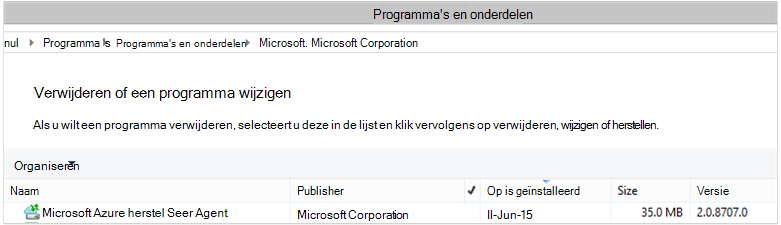

<properties
    pageTitle="Implementeren en beheren van back-up voor Windows Server/Client via PowerShell | Microsoft Azure"
    description="Meer informatie over het gebruiken en beheren van Azure back-up maken via PowerShell"
    services="backup"
    documentationCenter=""
    authors="saurabhsensharma"
    manager="shivamg"
    editor=""/>

<tags
    ms.service="backup"
    ms.workload="storage-backup-recovery"
    ms.tgt_pltfrm="na"
    ms.devlang="na"
    ms.topic="article"
    ms.date="09/01/2016"
    ms.author="saurabhsensharma;markgal;jimpark;nkolli;trinadhk"/>


# <a name="deploy-and-manage-backup-to-azure-for-windows-serverwindows-client-using-powershell"></a>Implementeren en beheren van back-up naar Azure voor Windows Server/Windows Client via PowerShell

> [AZURE.SELECTOR]
- [OP ARM](backup-client-automation.md)
- [Klassieke](backup-client-automation-classic.md)

Dit artikel leest u hoe u PowerShell gebruiken voor het instellen van Azure back-up op Windows Server of een Windows-client en beheren van back-up en herstellen.

## <a name="install-azure-powershell"></a>Azure PowerShell installeren

[AZURE.INCLUDE [learn-about-deployment-models](../../includes/learn-about-deployment-models-include.md)]

In oktober 2015 verlengt, is Azure PowerShell 1.0 uitgebracht. Deze versie is geslaagd het 0.9.8 los en overgebracht over enkele ingrijpend wijzigt, met name in de naming patroon van de cmdlets. 1,0 cmdlets volgen de naming patroon {werkwoord}-{zelfstandig naamwoord}; AzureRm dat de 0.9.8 namen bevatten geen **Rm** (bijvoorbeeld nieuw-AzureRmResourceGroup in plaats van nieuw-AzureResourceGroup). Wanneer u met Azure PowerShell 0.9.8, moet u eerst de resourcemanager-modus inschakelen door de **Schakeloptie-AzureMode AzureResourceManager** -opdracht uit te voeren. Deze opdracht is niet nodig in 1.0 of hoger.

Als u wilt gebruiken voor de 0.9.8 geschreven scripts omgeving, in de omgeving 1.0 of hoger, moet u zorgvuldig testen de scripts in een oude productieomgeving voordat u ze in productie gebruikt om te voorkomen onverwachte gevolgen.

[Download de nieuwste versie van de PowerShell](https://github.com/Azure/azure-powershell/releases) (minimaal vereiste versie is: 1.0.0)


[AZURE.INCLUDE [arm-getting-setup-powershell](../../includes/arm-getting-setup-powershell.md)]


## <a name="create-a-backup-vault"></a>Een back-kluis maken

> [AZURE.WARNING] Voor klanten met behulp van back-up van Azure voor de eerste keer, moet u de back-up van Azure-provider voor gebruik met uw abonnement hebt geregistreerd. Dit kan worden uitgevoerd door de volgende opdracht uit te voeren: Register-AzureProvider - ProviderNamespace "Microsoft.Backup"

U kunt een nieuwe back-kluis met de cmdlet **New-AzureRMBackupVault** maken. De back-kluis is een bron ARM, dus u hoeft te plaatsen binnen een resourcegroep. Voer de volgende opdrachten in een verhoogde Azure PowerShell-console:

```
PS C:\> New-AzureResourceGroup –Name “test-rg” -Region “West US”
PS C:\> $backupvault = New-AzureRMBackupVault –ResourceGroupName “test-rg” –Name “test-vault” –Region “West US” –Storage GeoRedundant
```

Gebruik de cmdlet **Get-AzureRMBackupVault** voor een overzicht van de back-up kluizen in een abonnement.


## <a name="installing-the-azure-backup-agent"></a>Installatie van de back-up van Azure-agent
Voordat u de back-up van Azure-agent hebt geïnstalleerd, moet u beschikken over het installatieprogramma van gedownloade en presenteren op de Windows-Server. U gaat de nieuwste versie van het installatieprogramma van het [Microsoft Downloadcentrum](http://aka.ms/azurebackup_agent) of van de back-kluis Dashboard-pagina. Het installatieprogramma van opslaan op een toegankelijke locatie zoals * C:\Downloads\*.

Als u wilt de agent hebt geïnstalleerd, voert u de volgende opdracht in een verhoogde PowerShell-console:

```
PS C:\> MARSAgentInstaller.exe /q
```

Hiermee installeert u de agent met de standaardopties. De installatie duurt een paar minuten in de achtergrond. Als u niet de optie */nu* opgeeft wordt vervolgens de **Windows Update** -venster geopend aan het einde van de installatie wilt controleren op updates. Zodra geïnstalleerd, wordt de agent worden weergegeven in de lijst met geïnstalleerde programma's.

De lijst met geïnstalleerde programma's wilt bekijken, gaat u naar **Het Configuratiescherm** > **programma's** > **programma's en onderdelen**.



### <a name="installation-options"></a>Opties voor installatie

Overzicht van alle opties beschikbaar via de opdrachtregel door de volgende opdracht te gebruiken:

```
PS C:\> MARSAgentInstaller.exe /?
```

De beschikbare opties omvatten:

| Optie | Meer informatie | Standaard |
| ---- | ----- | ----- |
| / q | Stille installatie | - |
| / p: "locatie" | Pad naar de installatiemap voor de back-up van Azure-agent. | C:\Program Files\Microsoft Azure herstel Services Agent |
| / s: "locatie" | Pad naar de cachemap voor de back-up van Azure-agent. | C:\Program Files\Microsoft Azure herstel Services Agent\Scratch |
| /m | Opt-in voor de Microsoft Update | - |
| /nu | Niet controleren op updates nadat de installatie is voltooid | - |
| /d | Hiermee verwijdert u Microsoft Azure herstel Services Agent | - |
| /pH | Host proxyadres | - |
| /PO | Proxy-Host poortnummer | - |
| /Pu | Proxy Host gebruikersnaam | - |
| /PW | Proxywachtwoord | - |


## <a name="registering-with-the-azure-backup-service"></a>Met de back-up van Azure-service registreren
Voordat u met de back-up van Azure-service registreren kunt, moet u ervoor zorgen dat de [vereisten](backup-configure-vault.md) wordt voldaan. U moet:

- Hebt u een geldig abonnement op Azure
- Hebt u een back-kluis

Als u wilt downloaden van de referenties kluis, voert u de cmdlet **Get-AzureRMBackupVaultCredentials** in een Azure PowerShell-console en sla deze op een handige locatie zoals * C:\Downloads\*.

```
PS C:\> $credspath = "C:\"
PS C:\> $credsfilename = Get-AzureRMBackupVaultCredentials -Vault $backupvault -TargetLocation $credspath
PS C:\> $credsfilename
f5303a0b-fae4-4cdb-b44d-0e4c032dde26_backuprg_backuprn_2015-08-11--06-22-35.VaultCredentials
```

Registreren van de computer met de kluis klaar is met de cmdlet [Start-OBRegistration](https://technet.microsoft.com/library/hh770398%28v=wps.630%29.aspx) :

```
PS C:\> $cred = $credspath + $credsfilename
PS C:\> Start-OBRegistration -VaultCredentials $cred -Confirm:$false

CertThumbprint      : 7a2ef2caa2e74b6ed1222a5e89288ddad438df2
SubscriptionID      : ef4ab577-c2c0-43e4-af80-af49f485f3d1
ServiceResourceName : test-vault
Region              : West US

Machine registration succeeded.
```

> [AZURE.IMPORTANT] Gebruik geen relatieve paden het bestand kluis-referenties opgeven. U moet een absoluut pad opgeven als invoer voor de cmdlet.

## <a name="networking-settings"></a>Netwerkinstellingen
Wanneer de verbinding van de Windows-computer met internet via een proxyserver is, kunnen ook de proxy-instellingen naar de agent worden geleverd. In dit voorbeeld is het geen proxyserver, zodat we expliciet proxy-gerelateerde gegevens wordt gewist.

Bandbreedtegebruik kan ook worden beheerd met de opties van ```work hour bandwidth``` en ```non-work hour bandwidth``` om een bepaald aantal dagen van de week.

Instellen van de details proxy en bandbreedte klaar is met de cmdlet [Set-OBMachineSetting](https://technet.microsoft.com/library/hh770409%28v=wps.630%29.aspx) :

```
PS C:\> Set-OBMachineSetting -NoProxy
Server properties updated successfully.

PS C:\> Set-OBMachineSetting -NoThrottle
Server properties updated successfully.
```

## <a name="encryption-settings"></a>Versleutelingsinstellingen
De back-upgegevens verzonden naar Azure back-up is versleuteld als u wilt beveiligen van de vertrouwelijkheid van de gegevens. De wachtwoordzin versleuteling is het "wachtwoord" tot de versleutelde gegevens op het moment van herstellen.

```
PS C:\> ConvertTo-SecureString -String "Complex!123_STRING" -AsPlainText -Force | Set-OBMachineSetting
Server properties updated successfully
```

> [AZURE.IMPORTANT] Houd de wachtwoordzin gegevens veilig wanneer deze is ingesteld. Niet is mogelijk om gegevens te herstellen van Azure zonder deze wachtwoordzin.

## <a name="back-up-files-and-folders"></a>Back-up van bestanden en mappen
Alle uw back-ups van Windows-Servers en clients aan Azure back-up vallen een beleid. Het beleid bestaat uit drie delen:

1. Een **back-ups plannen** waarmee wordt bepaald wanneer back-ups moeten worden genomen en gesynchroniseerd met de service.
2. Een **bewaarschema** waarmee wordt opgegeven hoe lang moeten worden bewaard de herstel wordt verwezen in Azure wordt aangegeven.
3. Een **specificatie opnemen of uitsluiten** die wat moet worden back bepaalt-up gemaakt.

In dit document, want we back-up bent automatiseren we gaan ervan uit dat er niets is geconfigureerd. We beginnen door te maken van een nieuwe back-beleid de cmdlet [New-OBPolicy](https://technet.microsoft.com/library/hh770416.aspx) gebruiken en.

```
PS C:\> $newpolicy = New-OBPolicy
```

Op dit moment het beleid is leeg en andere cmdlets zijn nodig om te bepalen welke items worden opgenomen of uitgesloten, wanneer back-ups wordt uitgevoerd en waarbij de back-ups wordt opgeslagen.

### <a name="configuring-the-backup-schedule"></a>Configuratie van de back-planning
De eerste van de 3 onderdelen van een beleid is de back-planning, die wordt gemaakt met de cmdlet [New-OBSchedule](https://technet.microsoft.com/library/hh770401) . De back-planning wordt gedefinieerd als back-ups moeten worden genomen. Bij het maken van een planning die u wilt opgeven 2 invoerparameters weergegeven:

- **Dagen van de week** die moet worden uitgevoerd door de back-up. U kunt de back-uptaak op slechts één dag of elke dag van de week of een combinatie in tussen uitvoeren.
- **Tijdstippen van de dag** bij de back-up moet worden uitgevoerd. U kunt maximaal 3 verschillende tijden van de dag waarop de back-up wordt geactiveerd definiëren.

U kunt bijvoorbeeld een back-beleid die wordt uitgevoerd om 16: 00 elke zaterdag en zondag configureren.

```
PS C:\> $sched = New-OBSchedule -DaysofWeek Saturday, Sunday -TimesofDay 16:00
```

De back-planning moet zijn gekoppeld aan een beleid, waarna u kunt dit doen met behulp van de cmdlet [Set-OBSchedule](https://technet.microsoft.com/library/hh770407) .

```
PS C:> Set-OBSchedule -Policy $newpolicy -Schedule $sched
BackupSchedule : 4:00 PM Saturday, Sunday, Every 1 week(s) DsList : PolicyName : RetentionPolicy : State : New PolicyState : Valid
```
### <a name="configuring-a-retention-policy"></a>Een bewaarbeleid configureren
Het bewaarbeleid wordt gedefinieerd hoe lang herstel punten gemaakt op basis van back-taken worden bewaard. Wanneer u een nieuwe bewaarbeleid met de cmdlet [New-OBRetentionPolicy](https://technet.microsoft.com/library/hh770425) maakt, kunt u het aantal dagen dat de back-up herstellen wordt verwezen moeten worden bewaard met Azure back-up. Het onderstaande voorbeeld wordt een bewaarbeleid van 7 dagen.

```
PS C:\> $retentionpolicy = New-OBRetentionPolicy -RetentionDays 7
```

Het bewaarbeleid moet worden gekoppeld aan het belangrijkste beleid met de cmdlet [Set-OBRetentionPolicy](https://technet.microsoft.com/library/hh770405):

```
PS C:\> Set-OBRetentionPolicy -Policy $newpolicy -RetentionPolicy $retentionpolicy

BackupSchedule  : 4:00 PM
                  Saturday, Sunday,
                  Every 1 week(s)
DsList          :
PolicyName      :
RetentionPolicy : Retention Days : 7

                  WeeklyLTRSchedule :
                  Weekly schedule is not set

                  MonthlyLTRSchedule :
                  Monthly schedule is not set

                  YearlyLTRSchedule :
                  Yearly schedule is not set

State           : New
PolicyState     : Valid
```
### <a name="including-and-excluding-files-to-be-backed-up"></a>Opnemen en uitsluiten van bestanden naar de back-up worden gemaakt
Een ```OBFileSpec``` object definieert de bestanden als u wilt opnemen en niet opgenomen in een back-up. Dit is een set regels die u het bereik van de beveiligde bestanden en mappen op een computer. U kunt zoals veel deze op te nemen of uitsluiting regels zoals vereist bestand en deze aan een beleid koppelen hebben. Wanneer u een nieuwe OBFileSpec-object maakt, kunt u het volgende doen:

- Geef de bestanden en mappen op te nemen
- De bestanden en mappen moet worden uitgesloten opgeven
- Geef recursieve back-up van gegevens in een map (of) of alleen het hoogste niveau bestanden in de opgegeven map moeten een reservekopie omhoog.

De laatste wordt met behulp van de vlag - recursieve in de opdracht Nieuw OBFileSpec bereikt.

Klik in het onderstaande voorbeeld we een back-up volume C: en D: en de OS binaire bestanden in de Windows-map en eventuele tijdelijke mappen uitsluiten. Om dit te doen maken we twee specificaties met de cmdlet [New-OBFileSpec](https://technet.microsoft.com/library/hh770408) - een voor opname archiveren en één voor uitsluiting. Nadat het bestandsspecificaties zijn gemaakt, zijn gekoppeld aan het beleid met de cmdlet [Toevoegen-OBFileSpec](https://technet.microsoft.com/library/hh770424) .

```
PS C:\> $inclusions = New-OBFileSpec -FileSpec @("C:\", "D:\")

PS C:\> $exclusions = New-OBFileSpec -FileSpec @("C:\windows", "C:\temp") -Exclude

PS C:\> Add-OBFileSpec -Policy $newpolicy -FileSpec $inclusions

BackupSchedule  : 4:00 PM
                  Saturday, Sunday,
                  Every 1 week(s)
DsList          : {DataSource
                  DatasourceId:0
                  Name:C:\
                  FileSpec:FileSpec
                  FileSpec:C:\
                  IsExclude:False
                  IsRecursive:True

                  , DataSource
                  DatasourceId:0
                  Name:D:\
                  FileSpec:FileSpec
                  FileSpec:D:\
                  IsExclude:False
                  IsRecursive:True

                  }
PolicyName      :
RetentionPolicy : Retention Days : 7

                  WeeklyLTRSchedule :
                  Weekly schedule is not set

                  MonthlyLTRSchedule :
                  Monthly schedule is not set

                  YearlyLTRSchedule :
                  Yearly schedule is not set

State           : New
PolicyState     : Valid


PS C:\> Add-OBFileSpec -Policy $newpolicy -FileSpec $exclusions

BackupSchedule  : 4:00 PM
                  Saturday, Sunday,
                  Every 1 week(s)
DsList          : {DataSource
                  DatasourceId:0
                  Name:C:\
                  FileSpec:FileSpec
                  FileSpec:C:\
                  IsExclude:False
                  IsRecursive:True
                  ,FileSpec
                  FileSpec:C:\windows
                  IsExclude:True
                  IsRecursive:True
                  ,FileSpec
                  FileSpec:C:\temp
                  IsExclude:True
                  IsRecursive:True

                  , DataSource
                  DatasourceId:0
                  Name:D:\
                  FileSpec:FileSpec
                  FileSpec:D:\
                  IsExclude:False
                  IsRecursive:True

                  }
PolicyName      :
RetentionPolicy : Retention Days : 7

                  WeeklyLTRSchedule :
                  Weekly schedule is not set

                  MonthlyLTRSchedule :
                  Monthly schedule is not set

                  YearlyLTRSchedule :
                  Yearly schedule is not set

State           : New
PolicyState     : Valid
```

### <a name="applying-the-policy"></a>Het beleid toepassen
Nu het beleidsobject is voltooid en heeft een gekoppeld back-ups plannen, bewaarbeleid verplicht te maken en een lijst opnemen of uitsluiten van bestanden. Dit beleid kan nu worden vastgelegd voor back-up van Azure gebruiken. Voordat u de zojuist gemaakte beleid Zorg ervoor dat er geen bestaande back-beleidsregels die is gekoppeld aan de server met behulp van de cmdlet [Verwijderen-OBPolicy](https://technet.microsoft.com/library/hh770415) . Verwijderen van het beleid wordt gevraagd om bevestiging. Het gebruik van de bevestiging overgeslagen de ```-Confirm:$false``` markering met de cmdlet.

```
PS C:> Get-OBPolicy | Remove-OBPolicy
Microsoft Azure Backup Are you sure you want to remove this backup policy? This will delete all the backed up data. [Y] Yes [A] Yes to All [N] No [L] No to All [S] Suspend [?] Help (default is "Y"):
```

U het beleidsobject vastlegt klaar is met de cmdlet [Set-OBPolicy](https://technet.microsoft.com/library/hh770421) . Dit wordt ook gevraagd om bevestiging. Het gebruik van de bevestiging overgeslagen de ```-Confirm:$false``` markering met de cmdlet.

```
PS C:> Set-OBPolicy -Policy $newpolicy
Microsoft Azure Backup Do you want to save this backup policy ? [Y] Yes [A] Yes to All [N] No [L] No to All [S] Suspend [?] Help (default is "Y"):
BackupSchedule : 4:00 PM Saturday, Sunday, Every 1 week(s)
DsList : {DataSource
         DatasourceId:4508156004108672185
         Name:C:\
         FileSpec:FileSpec
         FileSpec:C:\
         IsExclude:False
         IsRecursive:True,

         FileSpec
         FileSpec:C:\windows
         IsExclude:True
         IsRecursive:True,

         FileSpec
         FileSpec:C:\temp
         IsExclude:True
         IsRecursive:True,

         DataSource
         DatasourceId:4508156005178868542
         Name:D:\
         FileSpec:FileSpec
         FileSpec:D:\
         IsExclude:False
         IsRecursive:True
    }
PolicyName : c2eb6568-8a06-49f4-a20e-3019ae411bac
RetentionPolicy : Retention Days : 7
              WeeklyLTRSchedule :
              Weekly schedule is not set

              MonthlyLTRSchedule :
              Monthly schedule is not set

              YearlyLTRSchedule :
              Yearly schedule is not set
State : Existing PolicyState : Valid
```

U kunt de details van de bestaande back-beleid met de cmdlet [Get-OBPolicy](https://technet.microsoft.com/library/hh770406) weergeven. U kunt inzoomen op verder met de cmdlet [Get-OBSchedule](https://technet.microsoft.com/library/hh770423) voor de back-ups plannen en de cmdlet [Get-OBRetentionPolicy](https://technet.microsoft.com/library/hh770427) voor het bewaarbeleid

```
PS C:> Get-OBPolicy | Get-OBSchedule
SchedulePolicyName : 71944081-9950-4f7e-841d-32f0a0a1359a
ScheduleRunDays : {Saturday, Sunday}
ScheduleRunTimes : {16:00:00}
State : Existing

PS C:> Get-OBPolicy | Get-OBRetentionPolicy
RetentionDays : 7
RetentionPolicyName : ca3574ec-8331-46fd-a605-c01743a5265e
State : Existing

PS C:> Get-OBPolicy | Get-OBFileSpec
FileName : *
FilePath : \?\Volume{b835d359-a1dd-11e2-be72-2016d8d89f0f}\
FileSpec : D:\
IsExclude : False
IsRecursive : True

FileName : *
FilePath : \?\Volume{cdd41007-a22f-11e2-be6c-806e6f6e6963}\
FileSpec : C:\
IsExclude : False
IsRecursive : True

FileName : *
FilePath : \?\Volume{cdd41007-a22f-11e2-be6c-806e6f6e6963}\windows
FileSpec : C:\windows
IsExclude : True
IsRecursive : True

FileName : *
FilePath : \?\Volume{cdd41007-a22f-11e2-be6c-806e6f6e6963}\temp
FileSpec : C:\temp
IsExclude : True
IsRecursive : True
```

### <a name="performing-an-ad-hoc-backup"></a>Een ad-hoc back-up maken
Nadat u een back-beleid is ingesteld wordt de back-ups gebeurt per de planning. Een ad-hoc back-up activeert is ook mogelijk met de cmdlet [Start-OBBackup](https://technet.microsoft.com/library/hh770426) :

```
PS C:> Get-OBPolicy | Start-OBBackup
Taking snapshot of volumes...
Preparing storage...
Estimating size of backup items...
Estimating size of backup items...
Transferring data...
Verifying backup...
Job completed.
The backup operation completed successfully.
```

## <a name="restore-data-from-azure-backup"></a>Gegevens herstellen uit back-up van Azure
In dit gedeelte begeleidt u bij de stappen voor het automatiseren van herstel van gegevens uit Azure back-up. Dit omvat de volgende stappen:

1. Kies het bronvolume
2. Kies een back-punt herstellen
3. Kiest u een item herstellen
4. Het herstelproces activeren

### <a name="picking-the-source-volume"></a>Het bronvolume te kiezen
Wilt u een item terugzetten vanaf de back-up van Azure, moet u eerst naar de bron van het item identificeren. Aangezien we bent de opdrachten in de context van een Windows-Server of een Windows-client uitgevoerd, is de computer al worden geïdentificeerd. De volgende stap in de bron is voor het volume die deze bevat. Een lijst met volumes of bronnen wordt back-up van deze computer kan worden opgehaald door de cmdlet [Get-OBRecoverableSource](https://technet.microsoft.com/library/hh770410) uit te voeren. Deze opdracht geeft als resultaat een matrix met alle bronnen back-up van deze server/client.

```
PS C:> $source = Get-OBRecoverableSource
PS C:> $source
FriendlyName : C:\
RecoverySourceName : C:\
ServerName : myserver.microsoft.com

FriendlyName : D:\
RecoverySourceName : D:\
ServerName : myserver.microsoft.com
```

### <a name="choosing-a-backup-point-to-restore"></a>Een back-punt herstellen kiezen
De lijst met back-punten kan worden opgehaald door de cmdlet [Get-OBRecoverableItem](https://technet.microsoft.com/library/hh770399.aspx) met juiste parameters uit te voeren. In ons voorbeeld we kiest u de meest recente back-komma voor het bronvolume *D:* en deze gebruiken om een specifieke bestand te herstellen.

```
PS C:> $rps = Get-OBRecoverableItem -Source $source[1]
IsDir : False
ItemNameFriendly : D:\
ItemNameGuid : \?\Volume{b835d359-a1dd-11e2-be72-2016d8d89f0f}\
LocalMountPoint : D:\
MountPointName : D:\
Name : D:\
PointInTime : 18-Jun-15 6:41:52 AM
ServerName : myserver.microsoft.com
ItemSize :
ItemLastModifiedTime :

IsDir : False
ItemNameFriendly : D:\
ItemNameGuid : \?\Volume{b835d359-a1dd-11e2-be72-2016d8d89f0f}\
LocalMountPoint : D:\
MountPointName : D:\
Name : D:\
PointInTime : 17-Jun-15 6:31:31 AM
ServerName : myserver.microsoft.com
ItemSize :
ItemLastModifiedTime :
```
Het object ```$rps``` is van een matrix van back-up wordt verwezen. Het eerste element is het meest recente punt en de nde element is het oudste punt. Als u de meest recente komma, gebruiken we ```$rps[0]```.

### <a name="choosing-an-item-to-restore"></a>Een item herstellen kiezen
Als u wilt identificeren de exacte bestand of de map wilt herstellen, gebruik recursief de cmdlet [Get-OBRecoverableItem](https://technet.microsoft.com/library/hh770399.aspx) . Op deze manier de maphiërarchie kan worden bekeken met uitsluitend de ```Get-OBRecoverableItem```.

In dit voorbeeld als u wilt herstellen van het bestand *finances.xls* we kan verwijzen naar die met behulp van het object ```$filesFolders[1]```.

```
PS C:> $filesFolders = Get-OBRecoverableItem $rps[0]
PS C:> $filesFolders
IsDir : True
ItemNameFriendly : D:\MyData\
ItemNameGuid : \?\Volume{b835d359-a1dd-11e2-be72-2016d8d89f0f}\MyData\
LocalMountPoint : D:\
MountPointName : D:\
Name : MyData
PointInTime : 18-Jun-15 6:41:52 AM
ServerName : myserver.microsoft.com
ItemSize :
ItemLastModifiedTime : 15-Jun-15 8:49:29 AM

PS C:> $filesFolders = Get-OBRecoverableItem $filesFolders[0]
PS C:> $filesFolders
IsDir : False
ItemNameFriendly : D:\MyData\screenshot.oxps
ItemNameGuid : \?\Volume{b835d359-a1dd-11e2-be72-2016d8d89f0f}\MyData\screenshot.oxps
LocalMountPoint : D:\
MountPointName : D:\
Name : screenshot.oxps
PointInTime : 18-Jun-15 6:41:52 AM
ServerName : myserver.microsoft.com
ItemSize : 228313
ItemLastModifiedTime : 21-Jun-14 6:45:09 AM

IsDir : False
ItemNameFriendly : D:\MyData\finances.xls
ItemNameGuid : \?\Volume{b835d359-a1dd-11e2-be72-2016d8d89f0f}\MyData\finances.xls
LocalMountPoint : D:\
MountPointName : D:\
Name : finances.xls
PointInTime : 18-Jun-15 6:41:52 AM
ServerName : myserver.microsoft.com
ItemSize : 96256
ItemLastModifiedTime : 21-Jun-14 6:43:02 AM
```

U kunt ook zoeken naar items om te herstellen met de ```Get-OBRecoverableItem``` cmdlet. In ons voorbeeld om te zoeken naar *finances.xls* kan we grip krijgt op het bestand door deze opdracht uit te voeren:

```
PS C:\> $item = Get-OBRecoverableItem -RecoveryPoint $rps[0] -Location "D:\MyData" -SearchString "finance*"
```

### <a name="triggering-the-restore-process"></a>Het herstelproces activeert
Als u wilt activeren het herstelproces, eerst moeten we de herstelopties opgeven. Dit kunt doen met behulp van de cmdlet [New-OBRecoveryOption](https://technet.microsoft.com/library/hh770417.aspx) . In dit voorbeeld gaan we ervan uit dat we wilt herstellen van de bestanden naar *C:\temp*. Stel ook dat dat we wilt bestanden die al aanwezig op de doelmap *C:\temp*overgeslagen. Als u wilt een hersteloptie maken, gebruikt u de volgende opdracht uit:

```
PS C:\> $recovery_option = New-OBRecoveryOption -DestinationPath "C:\temp" -OverwriteType Skip
```

Nu herstellen activeren met behulp van de [Begin-OBRecovery](https://technet.microsoft.com/library/hh770402.aspx) -opdracht op de geselecteerde ```$item``` uit de resultaten van de ```Get-OBRecoverableItem``` cmdlet:

```
PS C:\> Start-OBRecovery -RecoverableItem $item -RecoveryOption $recover_option
Estimating size of backup items...
Estimating size of backup items...
Estimating size of backup items...
Estimating size of backup items...
Job completed.
The recovery operation completed successfully.
```


## <a name="uninstalling-the-azure-backup-agent"></a>Verwijderen van de back-up van Azure-agent
Verwijderen van de back-up van Azure-agent kan worden uitgevoerd met behulp van de volgende opdracht uit:

```
PS C:\> .\MARSAgentInstaller.exe /d /q
```

Verwijderen van de agent binaire bestanden van de computer heeft enkele gevolgen u rekening moet houden:

- Het bestand-filter wordt verwijderd van de computer en bijhouden van wijzigingen is gestopt.
- Alle beleidsgegevens is verwijderd uit de computer, maar de beleidsgegevens blijft moeten worden opgeslagen in de service.
- Alle back-planningen worden verwijderd en geen verdere back-ups zijn die u hebt gemaakt.

Maar de gegevens die zijn opgeslagen in Azure blijft en door u aan de hand van de configuratie van de beleid bewaarbeleid blijft behouden. Oudere punten worden automatisch verouderde.

## <a name="remote-management"></a>Extern beheer
Het beheer rond de back-up van Azure-agent, beleid en gegevensbronnen kan extern plaatsvinden via PowerShell. De computer die u op afstand beheren wilt moet worden goed voorbereid.

Standaard is de WinRM-service geconfigureerd voor handmatig starten. Opstarttype moet zijn ingesteld op *Automatische* en de service moet worden gestart. Om te bevestigen dat de WinRM-service wordt uitgevoerd, moet de waarde van de eigenschap Status *actief*zijn.

```
PS C:\> Get-Service WinRM

Status   Name               DisplayName
------   ----               -----------
Running  winrm              Windows Remote Management (WS-Manag...
```

PowerShell moet worden geconfigureerd voor externe communicatie.

```
PS C:\> Enable-PSRemoting -force
WinRM is already set up to receive requests on this computer.
WinRM has been updated for remote management.
WinRM firewall exception enabled.

PS C:\> Set-ExecutionPolicy unrestricted -force
```

De computer kan nu worden beheerd op afstand - beginnend bij de installatie van de agent. Bijvoorbeeld het volgende script wordt de agent naar de externe computer wordt gekopieerd en geïnstalleerd.

```
PS C:\> $dloc = "\\REMOTESERVER01\c$\Windows\Temp"
PS C:\> $agent = "\\REMOTESERVER01\c$\Windows\Temp\MARSAgentInstaller.exe"
PS C:\> $args = "/q"
PS C:\> Copy-Item "C:\Downloads\MARSAgentInstaller.exe" -Destination $dloc - force

PS C:\> $s = New-PSSession -ComputerName REMOTESERVER01
PS C:\> Invoke-Command -Session $s -Script { param($d, $a) Start-Process -FilePath $d $a -Wait } -ArgumentList $agent $args
```

## <a name="next-steps"></a>Volgende stappen
Voor meer informatie over Zie Azure back-up voor Windows Server-Client

- [Inleiding tot Azure back-up maken](backup-introduction-to-azure-backup.md)
- [Back-up van Windows-Servers](backup-configure-vault.md)
