<properties
    pageTitle="Maak een back-up van een client naar Azure met het implementatiemodel klassieke of Windows server | Microsoft Azure"
    description="Back-Windows-servers of clients Azure door maken van een back-kluis, referenties downloaden, installeren van de back-agent en voltooien van een eerste back-up van uw bestanden en mappen."
    services="backup"
    documentationCenter=""
    authors="markgalioto"
    manager="cfreeman"
    editor=""
    keywords="back-kluis; back-up van een Windows-server. back-ups;"/>

<tags
    ms.service="backup"
    ms.workload="storage-backup-recovery"
    ms.tgt_pltfrm="na"
    ms.devlang="na"
    ms.topic="article"
    ms.date="08/08/2016"
    ms.author="jimpark; trinadhk; markgal"/>

# Back-up van een client of Windows server naar Azure met het implementatiemodel klassieke

> [AZURE.SELECTOR]
- [Klassieke portal](backup-configure-vault-classic.md)
- [Azure-portal](backup-configure-vault.md)

In dit artikel worden de procedures die u moet volgen om te voorbereiden van uw omgeving en back-up van een Windows server (of client) naar Azure. Deze ook overwegingen voor uw back-oplossing implementeert, bedekt. Als u geïnteresseerd Azure back-up maken voor de eerste keer probeert bent, begeleidt in dit artikel snel u bij het proces.

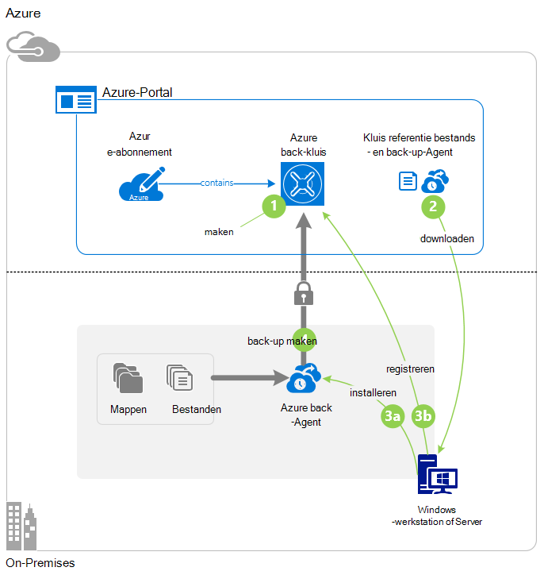

>[AZURE.IMPORTANT] Azure heeft twee verschillende implementatiemodellen voor het maken en werken met resources: resourcemanager en klassiek. In dit artikel beschreven hoe u met het implementatiemodel klassieke. Microsoft raadt meest nieuwe implementaties het model resourcemanager gebruiken.

## Voordat u begint
Als u wilt back-up van een server of client naar Azure, moet u een Azure-account. Als u deze niet hebt, kunt u een [gratis account](https://azure.microsoft.com/free/) maken in een paar minuten.

## Stap 1: Maak een back-kluis
Als u wilt back-up van bestanden en mappen van een server of -client, moet u een back-kluis maken in de geografische regio waar u de gegevens op te slaan.

### Een back-kluis maken

1. Meld u aan bij [de klassieke portal](https://manage.windowsazure.com/).

2. Klik op **Nieuw** > **Gegevensservices** > **Herstel Services** > **Back-up kluis**, en kies vervolgens **Snelle maken**.

3. Typ een beschrijvende naam voor de back-kluis voor de parameter **naam** . Typ een naam die tussen 2 en 50 tekens bevat. Er moet beginnen met een letter en mogen alleen letters, cijfers en afbreekstreepjes. Deze naam moet uniek zijn voor elk abonnement.

4. Selecteer het geografische gebied voor de back-kluis voor de parameter **regio** . Uw keuze bepaalt de geografische regio waar uw back-upgegevens wordt verzonden. Als u een geografische regio die lijkt op uw locatie kiest, kunt u netwerklatentie verkleinen wanneer een back-up naar Azure.

5. Klik op **maken kluis**.

    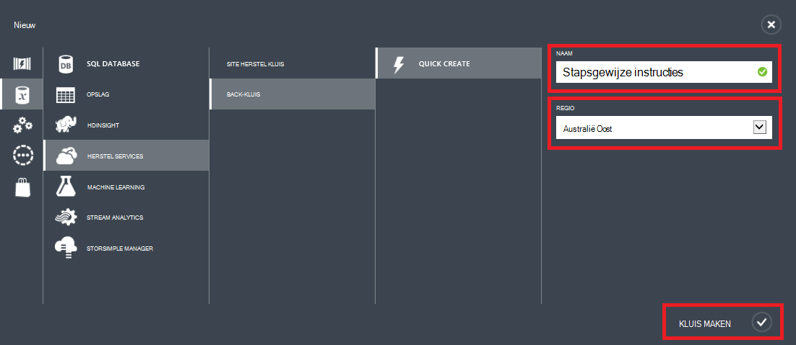

    Het kan even duren voordat de back-kluis moet worden gemaakt. Als u wilt controleren van de status, bewaken de meldingen onderaan in de klassieke portal.

    Nadat u de back-kluis hebt gemaakt, ziet u een bericht dat de kluis is gemaakt. Dit wordt ook weergegeven als **actief** in de lijst van de resource **Herstel Services** .

    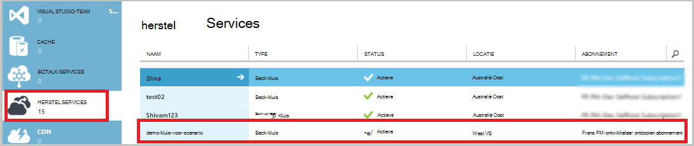

4. De optie opslag redundantie volgens de stappen die hier worden beschreven.

    >[AZURE.IMPORTANT] De beste tijd om uw opslagruimte redundantie optie identificeren is direct na kluis maken en voordat computers om de zijn geregistreerd. Nadat een item naar de kluis is geregistreerd, wordt de optie van opslag redundantie is vergrendeld en kan niet worden gewijzigd.

    Als u Azure als een eindpunt primaire back-up opslaan gebruikt (bijvoorbeeld u een back-up naar Azure vanaf een Windows server), houd rekening met [geografische-redundante opslag](../storage/storage-redundancy.md#geo-redundant-storage) -optie kiezen (de standaardinstelling).

    Als u Azure als een eindpunt tertiaire back-up opslaan gebruikt (bijvoorbeeld u gebruikt System Center Data Protection Manager voor store een lokale back-up on-premises implementatie en het gebruik van Azure voor lange bewaarbeleid), kunt u bijvoorbeeld [lokaal redundante opslag](../storage/storage-redundancy.md#locally-redundant-storage). Hierdoor wordt de kosten voor het opslaan van gegevens in Azure wordt aangegeven, terwijl een lager niveau van de levensduur voor uw gegevens die geschikt voor tertiaire exemplaren zijn mogelijk.

    **De optie opslag redundantie:**

    een. Klik op de kluis die u zojuist hebt gemaakt.

    b. Selecteer op de pagina snel starten **configureren**.

    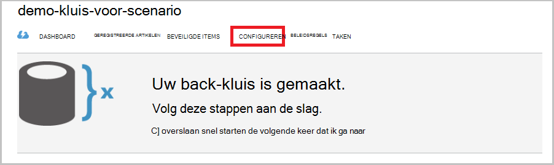

    c. Kies de juiste opslag redundantie optie.

    Als u **Lokaal overtollige**selecteert, moet u klikken op **Opslaan** (omdat **Geografische redundante** de standaardoptie is).

    d. Klik in het linkernavigatiedeelvenster op **Herstel Services** om terug te keren naar de lijst met bronnen voor herstel Services.

## Stap 2: Het kluis referentie-bestand downloaden
De lokale computer moet worden geverifieerd met een back-kluis voordat deze kan back-up van gegevens naar Azure. De verificatie wordt via *kluis referenties*bereikt. Het kluis referentie-bestand is gedownload via een beveiligd kanaal in de klassieke portal. De persoonlijke sleutel van het certificaat is niet persistent in de portal of de service.

Meer informatie over het [gebruik van kluis referenties om te verifiëren met de back-up-service](backup-introduction-to-azure-backup.md#what-is-the-vault-credential-file).

### De kluis referentie-bestand te downloaden naar een lokale computer

1. In het linkernavigatiedeelvenster op **Herstel Services**en selecteer vervolgens de back-kluis die u hebt gemaakt.

    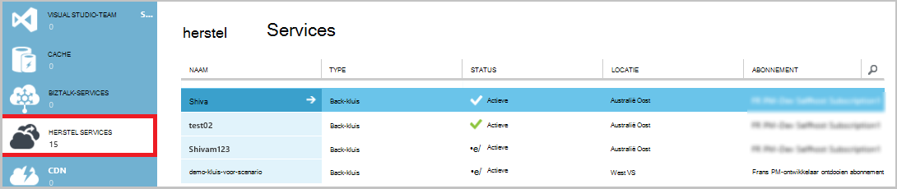

2.  Klik op **downloaden kluis referenties**op de pagina snel starten.

    De klassieke portal genereert een referentie kluis met behulp van een combinatie van de naam van de kluis en de huidige datum. Het bestand van de referenties kluis wordt alleen gebruikt tijdens de registratie-werkstroom en verloopt na 48 uur.

    Het kluis referentie-bestand kan worden gedownload van de portal.

3. Klik op **Opslaan** om te downloaden van het kluis referentie-bestand naar de map Downloads van de lokale account. U kunt ook in het menu **Opslaan** om op te geven van een locatie voor de kluis referentie-bestand **OpslaanAls** selecteren.

    >[AZURE.NOTE] Zorg ervoor dat het kluis referentie-bestand is opgeslagen op een locatie die zijn toegankelijk vanaf uw computer. Als dit is opgeslagen in een bestand delen of server bericht blok, Controleer of u de machtigingen toegang toe.

## Stap 3: Downloaden, installeren en registreren van de back-up-agent
Nadat u de back-kluis maken en het kluis referentie-bestand downloaden, moet een agent op elk van uw Windows-computers zijn geïnstalleerd.

### Als u wilt downloaden, installeren en registreren van de agent

1. Klik op **Herstel Services**en selecteer vervolgens de back-kluis die u wilt registreren bij een server.

2. Klik op de pagina snel starten op de agent **Agent voor Windows Server of System Center Data Protection Manager of Windows-client**. Klik vervolgens op **Opslaan**.

    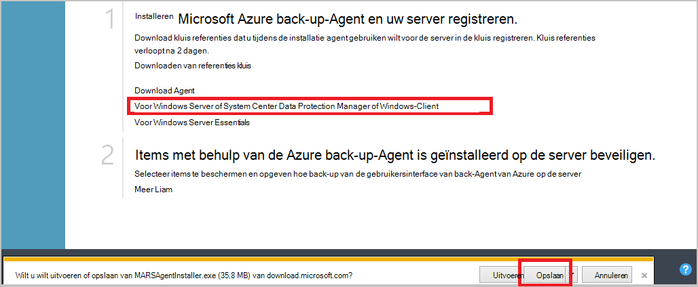

3. Nadat het bestand MARSagentinstaller.exe is gedownload, klikt u op **uitvoeren** (of dubbelklik op **MARSAgentInstaller.exe** van de locatie is opgeslagen).

4. Kies de installatiemap en de cachemap die zijn vereist voor de agent en klik vervolgens op **volgende**. De locatie van de cache die u opgeeft moet beschikbare ruimte gelijk is aan ten minste 5 procent van de back-upgegevens hebben.

5. U kunt doorgaan met de verbinding hebt met Internet via de standaard-proxy-instellingen.          Schakel het selectievakje **aangepaste proxy-instellingen gebruiken** als u een proxyserver gebruikt om verbinding met Internet, klik op de pagina configuratie van Proxy te en voer vervolgens de details van de server proxy. Als u een geverifieerde proxy bevindt, voert u de gegevens van de gebruiker gebruikersnaam en wachtwoord en klik vervolgens op **volgende**.

7. Klik op **installeren** om de agent-installatie te starten. De back-up-agent is geïnstalleerd .NET Framework 4.5 en Windows PowerShell (als dit nog niet is gebeurd) om de installatie te voltooien.

8. Nadat de-agent is geïnstalleerd, klikt u op **Doorgaan naar de registratie** om door te gaan met de werkstroom.

9. Klik op de pagina kluis identificatie Blader naar en selecteer het kluis referentie-bestand dat u eerder hebt gedownload.

    Het kluis referentie-bestand is ongeldig voor alleen 48 uur na het downloaden van de portal. Als u een foutbericht krijgt op deze pagina (zoals "kluis referenties bestand is verlopen"), meld u aan bij de portal opnieuw te downloaden het kluis referentie-bestand.

    Zorg ervoor dat het kluis referentie-bestand beschikbaar is op een locatie die toegankelijk is voor het installatieprogramma. Als u access-gerelateerde fouten optreden, de kluis referentie-bestand kopiëren naar een tijdelijke locatie op dezelfde computer en probeer het opnieuw.

    Als u een fout kluis referentie zoals "Ongeldige kluis referenties opgegeven", wordt het bestand is beschadigd of bevat niet hebt de meest recente referenties die is gekoppeld aan de herstel-service. Probeer opnieuw na een nieuw kluis referentie-bestand downloaden uit de portal. Deze fout kan ook optreden wanneer een gebruiker de optie **downloaden kluis referentie** enkele malen in snel achter elkaar. In dit geval alleen het laatste kluis referentie bestand is geldig.

9. Klik op de pagina versleuteling instelling kunt u een wachtwoordzin genereren of voorzien van een wachtwoordzin (minimaal 16 tekens). Moet de wachtwoordzin opslaan op een veilige locatie.

10. Klik op **Voltooien**. De Wizard van de Server registreren registreert de server met back-up.

    >[AZURE.WARNING] Als u kwijtraakt of de wachtwoordzin vergeet, kan niet Microsoft kunt u de back-upgegevens terugzetten. U eigenaar bent van de wachtwoordzin versleuteling en Microsoft geen inzicht in de wachtwoordzin die u gebruikt. Sla het bestand op een veilige locatie omdat deze uitgevoerd tijdens een herstelbewerking moeten worden.

11. Nadat de sleutel is ingesteld, laat het selectievakje **Starten Microsoft Azure herstel Services Agent** is geselecteerd en klik vervolgens op **sluiten**.

## Stap 4: De eerste back-up voltooien

De eerste back-up bevat twee belangrijke taken:

- Maken van de back-planning
- Een back-up bestanden en mappen voor de eerste keer

Nadat het back-beleid is het eerste back-up voltooid, maakt het back-punten die u gebruiken kunt als u nodig hebt om de gegevens te herstellen. Het back-beleid doet dit op basis van de planning die u definieert.

### De back-up plannen

1. Open de back-up van Microsoft Azure-agent. (Deze wordt automatisch geopend als u het selectievakje **Starten Microsoft Azure herstel Services Agent** is ingeschakeld wanneer u de Wizard van de Server registreren gesloten.) U vindt deze door te zoeken van uw computer naar **Microsoft Azure back-up**.

    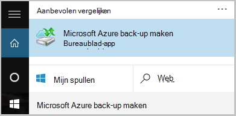

2. Klik in de back-up-agent op **Planning back-up**.

    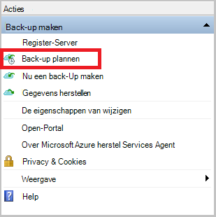

3. Klik op **volgende**op de pagina aan de slag van de Wizard van de back-up planning.

4. Klik op de Items selecteren naar de pagina back-up op **Items toevoegen**.

5. Selecteer de bestanden en mappen die u een back wilt-up en klik vervolgens op **OK**.

6. Klik op **volgende**.

7. Klik op de pagina **Back-planning opgeven** opgeven van de **back-ups plannen** en klik op **volgende**.

    U kunt dagelijks (met een maximum snelheid drie keer per dag) of wekelijkse back-ups plannen.

    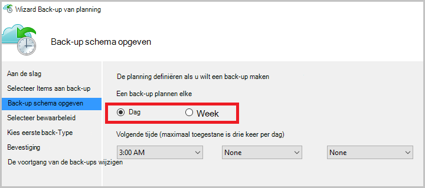

    >[AZURE.NOTE] Zie het artikel [Gebruik Azure back-up voor het vervangen van de infrastructuur van uw tape](backup-azure-backup-cloud-as-tape.md)voor meer informatie over het opgeven van de back-planning.

8. Selecteer op de pagina **Selecteer bewaarbeleid voor** het **Bewaarbeleid** voor de back-up.

    Het bewaarbeleid Hiermee geeft u de duur waarvoor de back-up wordt opgeslagen. In plaats van alleen een 'platte beleid' voor alle back-punten op te geven, kunt u verschillende bewaarbeleid op basis van wanneer de back-up. De dagelijks, wekelijks, maandelijks en jaarkalender bewaarbeleid aan uw wensen, kunt u wijzigen.

9. Kies het eerste back-type op de pagina aanvankelijke back-Type kiezen. Laat de optie **automatisch via het netwerk** geselecteerd en klik vervolgens op **volgende**.

    U kunt een back-up automatisch via het netwerk of u kunt een back-up offline. De rest van dit artikel wordt beschreven van het proces voor een automatisch back-up. Als u liever een offline back-up doen, raadpleegt u het artikel [Offline back-werkstroom in Azure back-up](backup-azure-backup-import-export.md) voor meer informatie.

10. Controleer de gegevens op de pagina bevestigen en klik vervolgens op **Voltooien**.

11. Nadat de wizard is voltooid de back-planning maken, klikt u op **sluiten**.

### Inschakelen netwerk beperken (optioneel)

De back-up-agent biedt netwerk beperken. Besturingselementen hoe netwerkbandbreedte wordt gebruikt tijdens overdracht van gegevens beperken. Dit besturingselement is handig als u een back moet-up gegevens tijdens de werkuren, maar niet wilt dat de back-proces voor het andere internetverkeer storen zijn. Beperking is van toepassing als u een back-up en herstellen van activiteiten.

**Om in te schakelen netwerk beperken**

1. In de back-up-agent, klikt u op **Eigenschappen wijzigen**.

    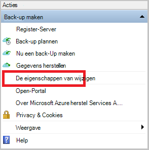

2. Klik op het tabblad **Throttling** selecteert u het selectievakje **internetbandbreedte beperken voor back-bewerkingen inschakelen** in.

    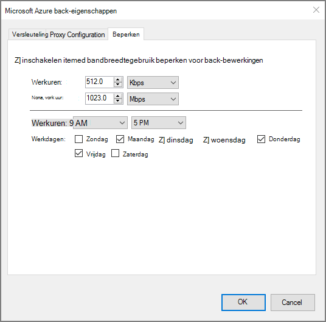

3. Nadat u hebt ingeschakeld beperken, geeft u de toegestane bandbreedte voor back-ups van gegevens tijdens de **werkuren** en **niet - werkuren**.

    De waarden bandbreedte begint in 512 kilobits per seconde (k) en maximaal 1023 MB per (seconde) kunnen gaan. U kunt ook aanwijzen van de begindatum en einddatum voor **kantooruren**en welke dagen van de week worden beschouwd als werkdagen. Uren buiten aangewezen werk uur worden beschouwd als niet-werk uren.

4. Klik op **OK**.

### Nu een back-up

1. In de back-up-agent, klikt u op **Nu een Back-Up maken** om te voltooien de eerste seeding via het netwerk.

    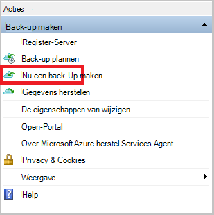

2. Op de pagina Confirmation de instellingen dat de Wizard Back-Up nu gebruiken wilt voor het back-up van de computer te bekijken. Klik vervolgens op **Back-Up**.

3. Klik op **sluiten** om de wizard te sluiten. Als u dit doen voordat u de back-up is voltooid, blijft de wizard op de achtergrond uitvoeren.

Nadat de eerste back-up is voltooid, is de status **taak voltooid** wordt weergegeven in de back-up-console.

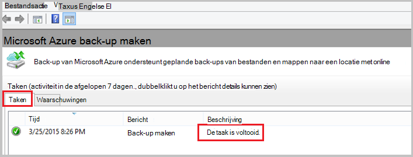

## Volgende stappen
- Registreer u voor een [gratis Azure-account](https://azure.microsoft.com/free/).

Zie voor meer informatie over back-ups van VMs of andere werkbelasting:

- [Een back-up IaaS VMs](backup-azure-vms-prepare.md)
- [Een back-up werkbelasting naar Azure met Microsoft Azure back-up-Server](backup-azure-microsoft-azure-backup.md)
- [Een back-up werkbelasting naar Azure met DPM](backup-azure-dpm-introduction.md)
