<properties
    pageTitle="Maak een back-up van een client naar Azure met Azure back-up maken met het implementatiemodel resourcemanager of Windows Server | Microsoft Azure"
    description="Back-Windows-servers of clients Azure door maken van een back-kluis, referenties downloaden, installeren van de back-agent en voltooien van een eerste back-up van uw bestanden en mappen."
    services="backup"
    documentationCenter=""
    authors="markgalioto"
    manager="cfreeman"
    editor=""
    keywords="back-kluis; back-up van een Windows-server. back-ups;"/>

<tags
    ms.service="backup"
    ms.workload="storage-backup-recovery"
    ms.tgt_pltfrm="na"
    ms.devlang="na"
    ms.topic="article"
    ms.date="08/10/2016"
    ms.author="jimpark; trinadhk; markgal"/>

# Back-up van een client of Windows Server naar Azure met het implementatiemodel resourcemanager

> [AZURE.SELECTOR]
- [Azure-portal](backup-configure-vault.md)
- [Klassieke portal](backup-configure-vault-classic.md)

In dit artikel wordt uitgelegd hoe u de back-up van uw Windows-Server (of Windows-client) bestanden en mappen Azure met Azure back-up maken met het implementatiemodel resourcemanager-.

[AZURE.INCLUDE [learn-about-deployment-models](../../includes/backup-deployment-models.md)]

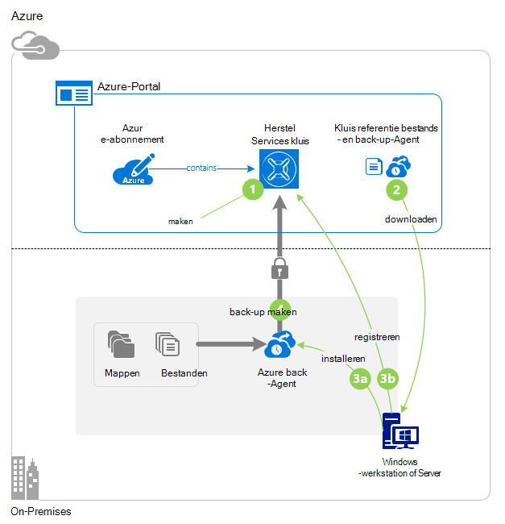

## Voordat u begint
Als u wilt back-up van een server of client naar Azure, moet u een Azure-account. Als u deze niet hebt, kunt u een [gratis account](https://azure.microsoft.com/free/) maken in een paar minuten.

## Stap 1: Maak een kluis herstel Services

Een kluis herstel Services is een entiteit waarmee de back-ups en herstel punten die u na verloop van tijd maakt opgeslagen. De kluis herstel Services bevat ook het back-beleid toegepast op de beveiligde bestanden en mappen. Wanneer u een kluis herstel Services maakt, moet u ook de juiste opslag redundantie-optie selecteren.

### Een kluis herstel Services maken

1. Als u dit nog niet hebt gedaan, meld u aan bij de [Portal van Azure](https://portal.azure.com/) met uw Azure-abonnement.

2. Klik in het menu Hub klikt u op **Bladeren** en typ in de lijst met resources, **Herstel Services**. Als u te typen begint, de lijst worden gefilterd op basis van uw invoer. Klik op **Services herstel kluizen**.

    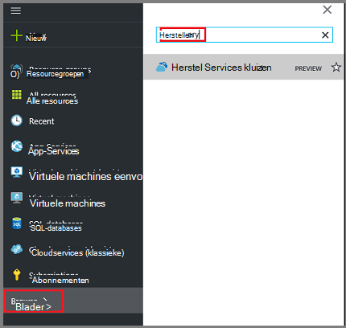  

    De lijst met Services herstel kluizen wordt weergegeven.

3. Klik in het menu **kluizen herstel Services** op **toevoegen**.

    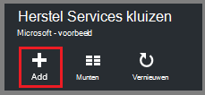

    Het herstelproces is Services kluis blad wordt geopend, waarin u een **naam**, het **abonnement**, de **resourcegroep**en de **locatie**op te geven.

    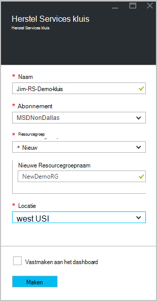

4. Voer een beschrijvende naam voor de kluis voor de **naam**. De naam moet uniek zijn voor het Azure abonnement. Typ een naam die tussen 2 en 50 tekens bevat. Er moet beginnen met een letter en mogen alleen letters, cijfers en afbreekstreepjes.

5. Klik op **abonnement** als u wilt zien van de lijst beschikbare van abonnementen. Als u niet zeker weet welk abonnement te gebruiken, gebruik de standaardwaarde (of voorgesteld) abonnement. Er zijn meerdere keuzemogelijkheden alleen als uw organisatie-account gekoppeld aan meerdere Azure abonnementen is.

6. **Resourcegroep** als u wilt zien van de lijst beschikbare van resourcegroepen op of klik op **Nieuw** om een nieuwe resourcegroep te maken. Zie [overzicht van de Azure resourcemanager](../azure-resource-manager/resource-group-overview.md) voor volledige informatie over Resource-groepen

7. Klik op **locatie** als het geografische gebied voor de kluis wilt selecteren. Uw keuze bepaalt de geografische regio waar uw back-upgegevens wordt verzonden. Als u een geografische regio die lijkt op uw locatie kiest, kunt u netwerklatentie verkleinen wanneer een back-up naar Azure.

8. Klik op **maken**. Het kan even duren voordat de kluis herstel Services moet worden gemaakt. Controleer de statusmeldingen in het bovenste rechter gebied in de portal. Nadat uw kluis is gemaakt, moet deze worden geopend in de portal. Als u uw kluis weergegeven nadat deze is voltooid niet ziet, klikt u op **vernieuwen**. Wanneer de lijst wordt vernieuwd, klikt u op de naam van de kluis.

### Om te bepalen opslag redundantie
Wanneer u eerst een kluis herstel Services maakt kunt u bepalen hoe opslag worden gerepliceerd.

1. Klik in het blad **Instellingen** , die automatisch wordt gestart met uw dashboard kluis, op **Back-up-infrastructuur**.

2. Klik in het blad back-up-infrastructuur op **Back-up-configuratie** als u wilt weergeven van het **type van opslag herhaling**.

    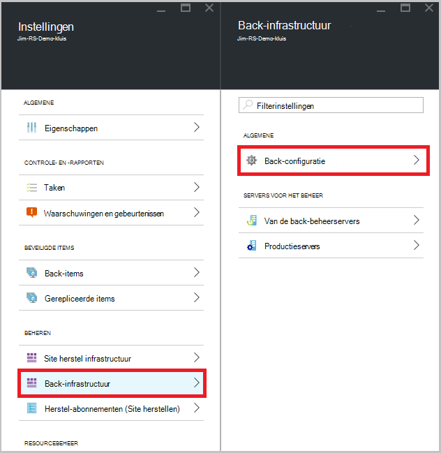

3. Kies de optie voor het herhaling van opslagruimte voor uw kluis.

    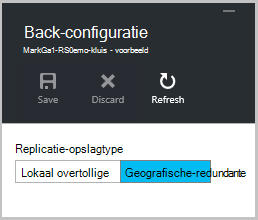

    Standaard is uw kluis geografische-redundante opslag. Als u Azure als een eindpunt primaire back-up opslaan gebruikt, gaat u verder met geografische-redundante opslag. Als u Azure als een back-up opslaan van niet-primaire-eindpunt gebruikt, kiest u lokaal overtollige opslag, waarmee de kosten van het opslaan van gegevens in Azure wordt aangegeven wordt beperkt. Meer informatie over [geografische-redundante](../storage/storage-redundancy.md#geo-redundant-storage) en [lokaal overtollige](../storage/storage-redundancy.md#locally-redundant-storage) opslagopties voor in dit [Overzicht](../storage/storage-redundancy.md).

    Kies de optie opslagruimte voor uw kluis en bent u klaar voor uw bestanden en mappen koppelen aan de kluis.

Nu dat u een kluis hebt gemaakt, kunt u de infrastructuur van uw back-up bestanden en mappen door te downloaden en installeren van de Microsoft Azure herstel Services-agent, kluis referenties downloaden, en vervolgens de referenties voor het registreren van de agent met de kluis voorbereiden.

## Stap 2 - bestanden die worden gedownload

>[AZURE.NOTE] Inschakelen back-ups via de portal van Azure is binnenkort beschikbaar. Op dit moment kunt u de Microsoft Azure herstel Services Agent lokale back-up van uw bestanden en mappen.

1. Klik op **Instellingen** op het dashboard van de kluis herstel Services.

    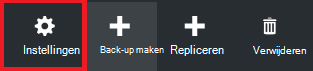

2. Klik op **aan de slag > back-up** op het blad instellingen.

    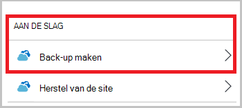

3. **Doel van de back-up-** Klik op het blad back-up.

    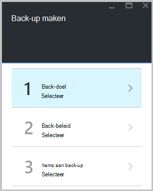

4. Selecteer **On-premises** waaruit het is uw werkzaamheden uitgevoerd? menu.

5. Selecteer van **bestanden en mappen** in de wat u wilt wilt back-up maken? menu en klik op **OK**.

#### Download de herstel Services-agent

1. Klik in het blad **voorbereiden infrastructuur** op **Agent downloaden voor Windows Server of Windows-Client** .

    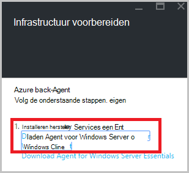

2. Klik op **Opslaan** in de pop-up downloaden. Het bestand **MARSagentinstaller.exe** wordt standaard opgeslagen naar de map Downloads.

#### Downloaden van referenties kluis

1. Klik op **downloaden > opslaan** op het blad van de infrastructuur voorbereiden.

    

## Stap 3 - installeren en registreren van de agent

1. Zoek en dubbelklik op de **MARSagentinstaller.exe** uit de map Downloads (of een andere locatie is opgeslagen).

2. Hiermee voert u de Wizard Setup van Microsoft Azure herstel Services Agent. Als u wilt de wizard hebt voltooid, moet u:

    - Kies een locatie voor de installatie en de cachemap.
    - Geef uw proxy Info over server als u een proxyserver gebruikt om te verbinding hebt met internet.
    - Geef uw gebruikers-gebruikersnaam en wachtwoord details als u een geverifieerde proxy bevindt.
    - De referenties van de gedownloade kluis
    - Sla de wachtwoordzin versleuteling op een veilige locatie.

    >[AZURE.NOTE] Als u kwijtraakt of de wachtwoordzin vergeet, kan Microsoft niet helpen de back-upgegevens terugzetten. Sla het bestand op een veilige locatie. Dit is vereist voor het herstellen van een back-up.

De-agent is nu geïnstalleerd en uw computer is geregistreerd om de. U bent klaar om te configureren en plannen van de back-up.

### Bevestig de installatie

Om te bevestigen dat de agent is geïnstalleerd en correct geregistreerd, kunt u de items die u back-up in de sectie **Productieomgeving** van de beheerportal gemaakt controleren. Dit wilt doen:

1. Meld u aan bij de [Portal van Azure](https://portal.azure.com/) met uw Azure-abonnement.

2. Klik in het menu Hub klikt u op **Bladeren** en typ in de lijst met resources, **Herstel Services**. Als u te typen begint, de lijst worden gefilterd op basis van uw invoer. Klik op **Services herstel kluizen**.

      

    De lijst met Services herstel kluizen wordt weergegeven.

2. Selecteer de naam van de kluis die u hebt gemaakt.

    Hiermee opent u het blad herstel Services kluis dashboard.

    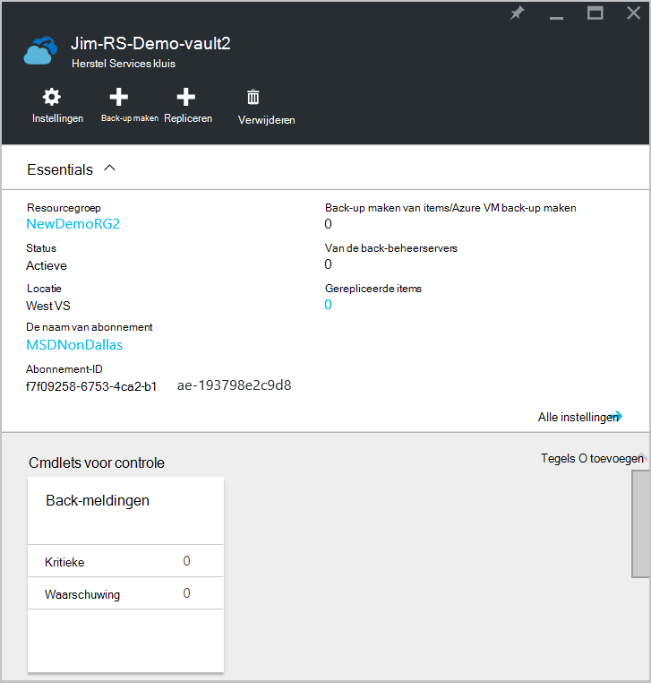  

3. Klik op de knop **Instellingen** boven aan de pagina.

4. Klik op **back-up maken infrastructuur > productieservers**.

    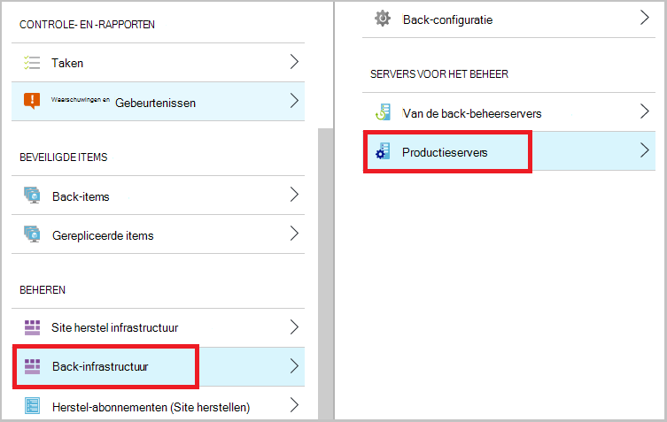

Als u uw servers in de lijst ziet, hebt u ter bevestiging dat de-agent is geïnstalleerd en correct geregistreerd.

## Stap 4: De eerste back-up voltooien

De eerste back-up bevat twee belangrijke taken:

- De back-up plannen
- Back-up van bestanden en mappen voor de eerste keer

Als u wilt de eerste back-up hebt voltooid, moet u de back-up Microsoft Azure-agent gebruiken.

### De back-up plannen

1. Open de back-up van Microsoft Azure-agent. U vindt deze door te zoeken van uw computer naar **Microsoft Azure back-up**.

    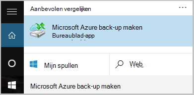

2. Klik in de back-up-agent op **Planning back-up**.

    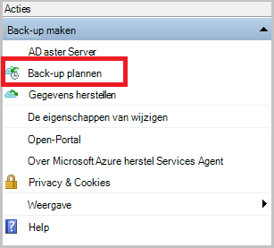

3. Klik op **volgende**op de pagina aan de slag van de Wizard van de back-up planning.

4. Klik op de Items selecteren naar de pagina back-up op **Items toevoegen**.

5. Selecteer de bestanden en mappen die u een back wilt-up en klik vervolgens op **OK**.

6. Klik op **volgende**.

7. Klik op de pagina **Back-planning opgeven** opgeven van de **back-ups plannen** en klik op **volgende**.

    U kunt dagelijks (met een maximum snelheid drie keer per dag) of wekelijkse back-ups plannen.

    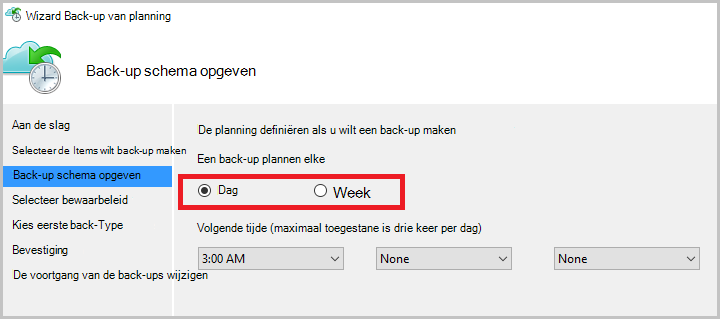

    >[AZURE.NOTE] Zie het artikel [Gebruik Azure back-up voor het vervangen van de infrastructuur van uw tape](backup-azure-backup-cloud-as-tape.md)voor meer informatie over het opgeven van de back-planning.

8. Selecteer op de pagina **Selecteer bewaarbeleid voor** het **Bewaarbeleid** voor de back-up.

    Het bewaarbeleid Hiermee geeft u de duur waarvoor de back-up wordt opgeslagen. In plaats van alleen een 'platte beleid' voor alle back-punten op te geven, kunt u verschillende bewaarbeleid op basis van wanneer de back-up. De dagelijks, wekelijks, maandelijks en jaarkalender bewaarbeleid aan uw wensen, kunt u wijzigen.

9. Kies op de pagina Type van back-up voor eerste kiest u het eerste back-type. Laat de optie **automatisch via het netwerk** geselecteerd en klik vervolgens op **volgende**.

    U kunt een back-up automatisch via het netwerk of u kunt een back-up offline. De rest van dit artikel wordt beschreven van het proces voor een automatisch back-up. Als u liever een offline back-up doen, raadpleegt u het artikel [Offline back-werkstroom in Azure back-up](backup-azure-backup-import-export.md) voor meer informatie.

10. Controleer de gegevens op de pagina bevestigen en klik vervolgens op **Voltooien**.

11. Nadat de wizard is voltooid de back-planning maken, klikt u op **sluiten**.

### Inschakelen netwerk beperken (optioneel)

De back-agent biedt netwerk beperken. Besturingselementen hoe netwerkbandbreedte wordt gebruikt tijdens overdracht van gegevens beperken. Dit besturingselement is handig als u een back moet-up gegevens tijdens de werkuren, maar niet wilt dat de back-proces voor het andere internetverkeer storen zijn. Beperking is van toepassing als u een back-up en herstellen van activiteiten.

>[AZURE.NOTE] Netwerk beperken is niet beschikbaar op Windows Server 2008 R2 SP1, Windows Server 2008 SP2 of Windows 7 (met servicepacks). Het beperken van de functie Azure back-up-netwerk voert de kwaliteit van Service (QoS) op het lokale besturingssysteem. Hoewel deze besturingssystemen met een back-up van Azure beveiligen kunt, werkt niet met het beperken van Azure back-up-netwerk de versie van QoS die beschikbaar zijn op deze platforms. Netwerk beperken kan worden gebruikt op alle andere [ondersteunde besturingssystemen](backup-azure-backup-faq.md#installation-amp-configuration).

**Om in te schakelen netwerk beperken**

1. In de back-agent, klikt u op **Eigenschappen wijzigen**.

    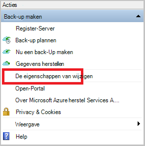

2. Klik op het tabblad **Throttling** selecteert u het selectievakje **internetbandbreedte beperken voor back-bewerkingen inschakelen** in.

    

3. Nadat u hebt ingeschakeld beperken, geeft u de toegestane bandbreedte voor back-ups van gegevens tijdens de **werkuren** en **niet - werkuren**.

    De waarden bandbreedte begint in 512 kilobits per seconde (k) en maximaal 1023 MB per (seconde) kunnen gaan. U kunt ook aanwijzen van de begindatum en einddatum voor **kantooruren**en welke dagen van de week worden beschouwd als werkdagen. Uren buiten aangewezen werk uur worden beschouwd als niet-werk uren.

4. Klik op **OK**.

### Back-up bestanden en mappen voor de eerste keer

1. In de back-agent, klikt u op **Nu een Back-Up maken** om te voltooien de eerste seeding via het netwerk.

    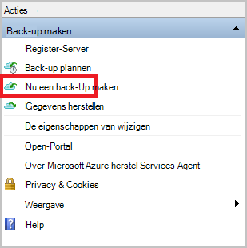

2. Op de pagina Confirmation de instellingen dat de Wizard Back-Up nu gebruiken wilt voor het back-up van de computer te bekijken. Klik vervolgens op **Back-Up**.

3. Klik op **sluiten** om de wizard te sluiten. Als u dit doen voordat u de back-up is voltooid, blijft de wizard op de achtergrond uitvoeren.

Nadat de eerste back-up is voltooid, is de status **taak voltooid** wordt weergegeven in de back-up-console.

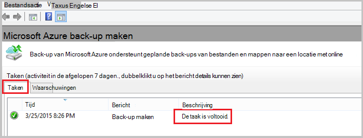

## Vragen?
Als u vragen hebt of als er is een functie die u wilt zien opgenomen, [Stuur ons feedback](http://aka.ms/azurebackup_feedback).

## Volgende stappen
Zie voor meer informatie over back-ups van VMs of andere werkbelasting:

- Nu dat u back-up uw bestanden en mappen gemaakt hebt, kunt u [uw kluizen en servers beheren](backup-azure-manage-windows-server.md).
- Als u herstellen van een back-up wilt, gebruikt u dit artikel voor [bestanden terugzetten naar een Windows-computer](backup-azure-restore-windows-server.md).
