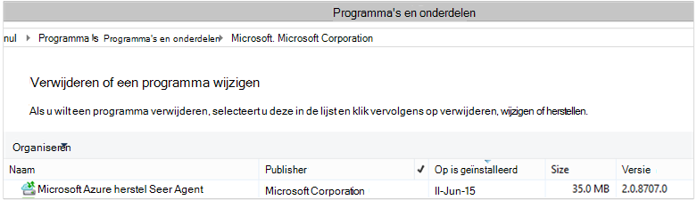

<properties
    pageTitle="Azure back-up maken - te implementeren en te beheren terug voor DPM via PowerShell | Microsoft Azure"
    description="Meer informatie over het gebruiken en beheren van Azure back-up voor Data Protection Manager (DPM) via PowerShell"
    services="backup"
    documentationCenter=""
    authors="Nkolli1"
    manager="shreeshd"
    editor=""/>

<tags
    ms.service="backup"
    ms.workload="storage-backup-recovery"
    ms.tgt_pltfrm="na"
    ms.devlang="na"
    ms.topic="article"
    ms.date="09/27/2016"
    ms.author="jimpark; trinadhk; anuragm; markgal"/>


# <a name="deploy-and-manage-backup-to-azure-for-data-protection-manager-dpm-servers-using-powershell"></a>Implementeren en beheren van back-up Azure voor Data Protection Manager (DPM)-servers via PowerShell

> [AZURE.SELECTOR]
- [OP ARM](backup-dpm-automation.md)
- [Klassieke](backup-dpm-automation-classic.md)

In dit artikel leest u hoe u PowerShell gebruiken om het Azure back-ups instellen op een server DPM te en voor het beheren van back-up en herstellen.

## <a name="setting-up-the-powershell-environment"></a>Bij het instellen van de PowerShell-omgeving

[AZURE.INCLUDE [learn-about-deployment-models](../../includes/learn-about-deployment-models-include.md)]

Voordat u PowerShell gebruiken kunt voor het beheren van back-ups van gegevens Protection Manager naar Azure, moet u de juiste omgeving in PowerShell hebt. Zorg ervoor dat u de volgende opdracht uit te importeren van de juiste modules en kunt u correct verwijzen naar de cmdlets DPM aan het begin van de PowerShell-sessie:

```
PS C:> & "C:\Program Files\Microsoft System Center 2012 R2\DPM\DPM\bin\DpmCliInitScript.ps1"

Welcome to the DPM Management Shell!

Full list of cmdlets: Get-Command
Only DPM cmdlets: Get-DPMCommand
Get general help: help
Get help for a cmdlet: help <cmdlet-name> or <cmdlet-name> -?
Get definition of a cmdlet: Get-Command <cmdlet-name> -Syntax
Sample DPM scripts: Get-DPMSampleScript
```

## <a name="setup-and-registration"></a>Installatie en registratie
Moet beginnen:

1. [Download de meest recente PowerShell](https://github.com/Azure/azure-powershell/releases) (minimaal vereiste versie is: 1.0.0)
2. De back-up van Azure-commandlets door over te schakelen naar *AzureResourceManager* -modus met behulp van de **Schakeloptie-AzureMode** commandlet inschakelen:

```
PS C:\> Switch-AzureMode AzureResourceManager
```

De volgende taken voor de installatie en registratie kunnen worden geautomatiseerd met PowerShell:

- Een back-kluis maken
- Installatie van de back-up van Azure-agent
- Met de back-up van Azure-service registreren
- Netwerkinstellingen
- Versleutelingsinstellingen

### <a name="create-a-backup-vault"></a>Een back-kluis maken

> [AZURE.WARNING] Voor klanten met behulp van back-up van Azure voor de eerste keer, moet u de back-up van Azure-provider voor gebruik met uw abonnement hebt geregistreerd. Dit kan worden uitgevoerd door de volgende opdracht uit te voeren: Register-AzureProvider - ProviderNamespace "Microsoft.Backup"

U kunt een nieuwe back-kluis met de commandlet **New-AzureRMBackupVault** maken. De back-kluis is een bron ARM, dus u hoeft te plaatsen binnen een resourcegroep. Voer de volgende opdrachten in een verhoogde Azure PowerShell-console:

```
PS C:\> New-AzureResourceGroup –Name “test-rg” -Region “West US”
PS C:\> $backupvault = New-AzureRMBackupVault –ResourceGroupName “test-rg” –Name “test-vault” –Region “West US” –Storage GRS
```

U kunt een lijst met alle back-up kluizen openen in een bepaald abonnement met de commandlet **Get-AzureRMBackupVault** .


### <a name="installing-the-azure-backup-agent-on-a-dpm-server"></a>De back-up van Azure-agent installeren op een Server DPM
Voordat u de back-up van Azure-agent hebt geïnstalleerd, moet u beschikken over het installatieprogramma van gedownloade en presenteren op de Windows-Server. U gaat de nieuwste versie van het installatieprogramma van het [Microsoft Downloadcentrum](http://aka.ms/azurebackup_agent) of van de back-kluis Dashboard-pagina. Het installatieprogramma van opslaan op een toegankelijke locatie zoals * C:\Downloads\*.

Als u wilt de agent hebt geïnstalleerd, voert u de volgende opdracht in een verhoogde PowerShell-console **op de server DPM**:

```
PS C:\> MARSAgentInstaller.exe /q
```

Hiermee installeert u de agent met de standaardopties. De installatie duurt een paar minuten in de achtergrond. Als u niet de optie */nu* opgeeft moet de **Windows Update** -venster wordt geopend aan het einde van de installatie wilt controleren op updates.

De agent worden weergegeven in de lijst met geïnstalleerde programma's. De lijst met geïnstalleerde programma's wilt bekijken, gaat u naar **Het Configuratiescherm** > **programma's** > **programma's en onderdelen**.



#### <a name="installation-options"></a>Opties voor installatie
Overzicht van alle opties beschikbaar via de opdrachtregel door de volgende opdracht te gebruiken:

```
PS C:\> MARSAgentInstaller.exe /?
```

De beschikbare opties omvatten:

| Optie | Meer informatie | Standaard |
| ---- | ----- | ----- |
| / q | Stille installatie | - |
| / p: "locatie" | Pad naar de installatiemap voor de back-up van Azure-agent. | C:\Program Files\Microsoft Azure herstel Services Agent |
| / s: "locatie" | Pad naar de cachemap voor de back-up van Azure-agent. | C:\Program Files\Microsoft Azure herstel Services Agent\Scratch |
| /m | Opt-in voor de Microsoft Update | - |
| /nu | Niet controleren op updates nadat de installatie is voltooid | - |
| /d | Hiermee verwijdert u Microsoft Azure herstel Services Agent | - |
| /pH | Host proxyadres | - |
| /PO | Proxy-Host poortnummer | - |
| /Pu | Proxy Host gebruikersnaam | - |
| /PW | Proxywachtwoord | - |

### <a name="registering-with-the-azure-backup-service"></a>Met de back-up van Azure-service registreren
Voordat u met de back-up van Azure-service registreren kunt, moet u ervoor zorgen dat de [vereisten](backup-azure-dpm-introduction.md) wordt voldaan. U moet:

- Hebt u een geldig abonnement op Azure
- Hebt u een back-kluis

Als u wilt downloaden van de referenties kluis, de commandlet **Get-AzureBackupVaultCredentials** worden uitgevoerd in een Azure PowerShell-console en sla deze op een handige locatie zoals * C:\Downloads\*.

```
PS C:\> $credspath = "C:\"
PS C:\> $credsfilename = Get-AzureRMBackupVaultCredentials -Vault $backupvault -TargetLocation $credspath
PS C:\> $credsfilename
f5303a0b-fae4-4cdb-b44d-0e4c032dde26_backuprg_backuprn_2015-08-11--06-22-35.VaultCredentials
```

Registreren van de computer met de kluis klaar is met de cmdlet [Start-DPMCloudRegistration](https://technet.microsoft.com/library/jj612787) :

```
PS C:\> $cred = $credspath + $credsfilename
PS C:\> Start-DPMCloudRegistration -DPMServerName "TestingServer" -VaultCredentialsFilePath $cred
```

Hiermee wordt de DPM Server met de naam "TestingServer" met Microsoft Azure kluis met de referenties van de opgegeven kluis registreren.

> [AZURE.IMPORTANT] Gebruik geen relatieve paden het bestand kluis-referenties opgeven. U moet een absoluut pad opgeven als invoer voor de cmdlet.

### <a name="initial-configuration-settings"></a>Configuratie-instellingen
Wanneer de Server DPM is geregistreerd bij de back-up van Azure-kluis, wordt gestart met standaardinstellingen van het abonnement. Deze abonnementsinstellingen zijn netwerken, versleuteling en het opslaggebied. U moet eerst grip krijgt op de bestaande (standaard)-instellingen met de cmdlet [Get-DPMCloudSubscriptionSetting](https://technet.microsoft.com/library/jj612793) om te beginnen met het wijzigen van abonnement:

```
$setting = Get-DPMCloudSubscriptionSetting -DPMServerName "TestingServer"
```

Alle wijzigingen zijn aangebracht in deze lokaal PowerShell-object ```$setting``` en klikt u vervolgens het volledige object vastgelegde aan DPM en Azure back-up wilt opslaan met de cmdlet [Set-DPMCloudSubscriptionSetting](https://technet.microsoft.com/library/jj612791) is. U moet gebruiken de ```–Commit``` vlag om ervoor te zorgen dat de wijzigingen worden doorgevoerd. De instellingen kan worden niet toegepast en die wordt gebruikt door back-up van Azure tenzij vastgelegde.

```
PS C:\> Set-DPMCloudSubscriptionSetting -DPMServerName "TestingServer" -SubscriptionSetting $setting -Commit
```

### <a name="networking"></a>Netwerken
Als de verbinding van de computer DPM naar de back-up van Azure-service op internet via een proxyserver is, moeten de proxy-instellingen worden verstrekt back-ups te kunnen uitvoeren. Dit gebeurt met behulp van de ```-ProxyServer```, ```-ProxyPort```, ```-ProxyUsername``` en de ```ProxyPassword``` parameters met de cmdlet [Set-DPMCloudSubscriptionSetting](https://technet.microsoft.com/library/jj612791) . In dit voorbeeld is het geen proxyserver zodat we expliciet proxy-gerelateerde gegevens wordt gewist.

```
PS C:\> Set-DPMCloudSubscriptionSetting -DPMServerName "TestingServer" -SubscriptionSetting $setting -NoProxy
```

Bandbreedtegebruik kan ook worden beheerd met de opties van ```-WorkHourBandwidth``` en ```-NonWorkHourBandwidth``` om een bepaald aantal dagen van de week. In dit voorbeeld zijn we niet instelling eventuele beperken.

```
PS C:\> Set-DPMCloudSubscriptionSetting -DPMServerName "TestingServer" -SubscriptionSetting $setting -NoThrottle
```

### <a name="configuring-the-staging-area"></a>Het opslaggebied configureren
De back-up van Azure-agent uitgevoerd op de server DPM moet tijdelijke opslag voor gegevens hersteld vanuit de cloud (lokale tijdelijke gebied). Het opslaggebied met de cmdlet [Set-DPMCloudSubscriptionSetting](https://technet.microsoft.com/library/jj612791) configureren en de ```-StagingAreaPath``` parameter.

```
PS C:\> Set-DPMCloudSubscriptionSetting -DPMServerName "TestingServer" -SubscriptionSetting $setting -StagingAreaPath "C:\StagingArea"
```

In het bovenstaande voorbeeld wordt het opslaggebied worden ingesteld op *C:\StagingArea* in de PowerShell-object ```$setting```. Zorg ervoor dat de opgegeven map al bestaat, anders de uiteindelijke doorvoeren van de instellingen van het abonnement, mislukt.


### <a name="encryption-settings"></a>Versleutelingsinstellingen
De back-upgegevens verzonden naar Azure back-up is versleuteld als u wilt beveiligen van de vertrouwelijkheid van de gegevens. De wachtwoordzin versleuteling is het "wachtwoord" tot de versleutelde gegevens op het moment van herstellen. Het is belangrijk vindt deze informatie veilig wanneer deze is ingesteld.

In het onderstaande voorbeeld wordt de tekenreeks de eerste opdracht converteren naar ```passphrase123456789``` naar een beveiligde tekenreeks en de secure tekenreeks naar de variabele met de naam kent ```$Passphrase```. de tweede opdracht stelt u de beveiligde tekenreeks in ```$Passphrase``` als het wachtwoord voor het coderen van back-ups.

```
PS C:\> $Passphrase = ConvertTo-SecureString -string "passphrase123456789" -AsPlainText -Force

PS C:\> Set-DPMCloudSubscriptionSetting -DPMServerName "TestingServer" -SubscriptionSetting $setting -EncryptionPassphrase $Passphrase
```

> [AZURE.IMPORTANT] Houd de wachtwoordzin gegevens veilig wanneer deze is ingesteld. Niet is mogelijk om gegevens te herstellen van Azure zonder deze wachtwoordzin.

Nu u moet alle wijzigingen hebt aangebracht de vereiste naar de ```$setting``` object. Onthoud dat de wijzigingen doorvoeren.

```
PS C:\> Set-DPMCloudSubscriptionSetting -DPMServerName "TestingServer" -SubscriptionSetting $setting -Commit
```

## <a name="protect-data-to-azure-backup"></a>Gegevens aan Azure back-up beschermen
In dit gedeelte u een productieserver toevoegen aan DPM en klikt u vervolgens de gegevens naar de lokale DPM opslag en vervolgens naar de back-up van Azure te beschermen. In de voorbeelden wordt gedemonstreerd hoe u de back-up van bestanden en mappen. De logica kan eenvoudig worden uitgebreid om het back-up maken van elke DPM ondersteunde gegevensbron. Alle uw DPM back-ups zijn moet voldoen aan door een beveiliging groep (Page) met vier onderdelen:

1. **Leden van** is een lijst met alle voor objecten (ook wel bekend als *gegevensbronnen* in DPM) die u wilt beveiligen in de groep met dezelfde beveiliging. U wilt bijvoorbeeld productie VMs in één groep van beveiliging en SQL Server-databases in een andere groep van beveiliging beveiligen terwijl ze kunnen verschillende back-vereisten hebben. Voordat u kunt een back-up elke gegevensbron op een productieserver die u nodig hebt om ervoor te zorgen wordt de DPM-Agent is geïnstalleerd op de server en wordt beheerd door DPM. Volg de stappen voor het [installeren van de DPM-Agent](https://technet.microsoft.com/library/bb870935.aspx) en deze naar de juiste DPM-Server te koppelen.
2. **Gegevens beveiligingsmethode** Hiermee geeft u de back-doellocatie - tape, schijf en cloud. In ons voorbeeld beveiligen we gegevens van de lokale schijf en in de cloud.
3. Een **back-ups plannen** waarmee wordt bepaald wanneer back-ups moeten nemen en hoe vaak de gegevens moeten worden gesynchroniseerd tussen de DPM-Server en de productieserver.
4. Een **bewaarschema** waarmee wordt opgegeven hoe lang moeten worden bewaard de herstel wordt verwezen in Azure wordt aangegeven.

### <a name="creating-a-protection-group"></a>Maken van een groep beveiliging
Beginnen met het maken van een nieuwe groep voor beveiliging met de cmdlet [New-DPMProtectionGroup](https://technet.microsoft.com/library/hh881722) .

```
PS C:\> $PG = New-DPMProtectionGroup -DPMServerName " TestingServer " -Name "ProtectGroup01"
```

De bovenstaande cmdlet maakt beveiliging groep *ProtectGroup01*. Een bestaande groep voor de beveiliging kan ook later om toe te voegen back-up maken in de cloud Azure worden gewijzigd. Echter om wijzigingen aanbrengt in de groep beveiliging - nieuw of bestaand - moeten we grip krijgt op een *kan worden gewijzigd* object met de cmdlet [Get-DPMModifiableProtectionGroup](https://technet.microsoft.com/library/hh881713) .

```
PS C:\> $MPG = Get-ModifiableProtectionGroup $PG
```

### <a name="adding-group-members-to-the-protection-group"></a>Leden toevoegen aan de groep beveiliging
Elke Agent DPM weet de lijst met gegevensbronnen op de server waarop het product is geïnstalleerd. Als u wilt een gegevensbron toevoegen aan de groep beveiliging, moet de DPM-Agent eerst een lijst van de gegevensbronnen terug naar de server DPM verzenden. Een of meer gegevensbronnen zijn vervolgens geselecteerd en toegevoegd aan de groep beveiliging. De PowerShell-stappen die u nodig hebt voor bereiken dit wilt:

1. Een lijst met alle servers beheerd door DPM tot en met de DPM-Agent ophalen.
2. Kies een specifieke server.
3. Een lijst met alle gegevensbronnen ophalen op de server.
4. Kies een of meer gegevensbronnen en deze toevoegen aan de groep beveiliging

De lijst met servers waarop de DPM-Agent is geïnstalleerd en wordt beheerd door de Server DPM wordt opgehaald met de cmdlet [Get-DPMProductionServer](https://technet.microsoft.com/library/hh881600) . In dit voorbeeld we filteren en alleen PS configureren met naam, *productionserver01* voor back-up.

```
PS C:\> $server = Get-ProductionServer -DPMServerName "TestingServer" | where {($_.servername) –contains “productionserver01”
```

Nu ophalen van de lijst met gegevensbronnen op ```$server``` met de cmdlet [Get-DPMDatasource](https://technet.microsoft.com/library/hh881605) . In dit voorbeeld filtert we voor het volume *D:\* die we wilt configureren voor back-up. Deze gegevensbron wordt vervolgens toegevoegd aan de groep beveiliging met de cmdlet [Toevoegen-DPMChildDatasource](https://technet.microsoft.com/library/hh881732) . Gebruik de *modifable * beveiliging groepsobject ```$MPG``` zodat de toevoegingen.

```
PS C:\> $DS = Get-Datasource -ProductionServer $server -Inquire | where { $_.Name -contains “D:\” }

PS C:\> Add-DPMChildDatasource -ProtectionGroup $MPG -ChildDatasource $DS
```

Herhaal deze stap zo vaak zoals vereist, totdat u alle gegevensbronnen in de door u gekozen hebt toegevoegd aan de groep beveiliging. U kunt ook beginnen met slechts één gegevensbron, voert u de werkstroom voor het maken van de groep beveiliging en op een later moment door meer gegevensbronnen in te voegen aan de groep beveiliging.

### <a name="selecting-the-data-protection-method"></a>De methode voor beveiliging selecteren
Als de gegevensbronnen zijn toegevoegd aan de groep beveiliging, is de volgende stap kunt u de beveiligingsmethode met de cmdlet [Set-DPMProtectionType](https://technet.microsoft.com/library/hh881725) opgeven. In dit voorbeeld wordt de groep beveiliging worden ingesteld voor lokale schijf en cloud back-up. U moet ook opgeven van de gegevensbron die u wilt beveiligen in cloud met de cmdlet [Toevoegen-DPMChildDatasource](https://technet.microsoft.com/library/hh881732.aspx) - Online vlag.

```
PS C:\> Set-DPMProtectionType -ProtectionGroup $MPG -ShortTerm Disk –LongTerm Online
PS C:\> Add-DPMChildDatasource -ProtectionGroup $MPG -ChildDatasource $DS –Online
```

### <a name="setting-the-retention-range"></a>Het bereik bewaarbeleid instellen
Stel het bewaarbeleid voor de back-up wordt verwezen met de cmdlet [Set-DPMPolicyObjective](https://technet.microsoft.com/library/hh881762) . Hoewel deze oneven lijken mogelijk voor het instellen van het bewaarbeleid voordat het schema zijn gedefinieerd, met de ```Set-DPMPolicyObjective``` cmdlet wordt automatisch ingesteld voor een standaard back-ups plannen die vervolgens kan worden gewijzigd. Het is altijd mogelijk is om te instellen dat de back-up eerst plannen en het bewaarbeleid na.

In het onderstaande voorbeeld wordt de cmdlet het bewaarbeleid parameters instellen voor back-ups Schijfopruiming Dit behoudt back-ups voor 10 dagen en gegevens van de synchronisatie van elke 6 uur tussen de productieserver en de DPM-server. De ```SynchronizationFrequencyMinutes``` niet definiëren hoe vaak een back-punt is gemaakt, maar hoe vaak gegevens wordt gekopieerd naar de server DPM. Hiermee voorkomt u dat back-ups te groot.

```
PS C:\> Set-DPMPolicyObjective –ProtectionGroup $MPG -RetentionRangeInDays 10 -SynchronizationFrequencyMinutes 360
```

Back-ups gaat u naar Azure (DPM verwijst naar deze als back-ups van Online) de bereiken bewaarbeleid kunnen worden geconfigureerd voor [langdurig bewaarbeleid volgens een schema opa-vader-zoon (algemene)](backup-azure-backup-cloud-as-tape.md). U kunt dat wil zeggen een gecombineerde bewaarbeleid die betrekking hebben op personen dagelijks, wekelijks, maandelijks en jaarlijks bewaarbeleid definiëren. In dit voorbeeld wordt een matrix dat staat voor het complexe bewaarbeleid kleurenschema dat we wilt maken en configureert u het bewaarbeleid bereik met de cmdlet [Set-DPMPolicyObjective](https://technet.microsoft.com/library/hh881762) .

```
PS C:\> $RRlist = @()
PS C:\> $RRList += (New-Object -TypeName Microsoft.Internal.EnterpriseStorage.Dls.UI.ObjectModel.OMCommon.RetentionRange -ArgumentList 180, Days)
PS C:\> $RRList += (New-Object -TypeName Microsoft.Internal.EnterpriseStorage.Dls.UI.ObjectModel.OMCommon.RetentionRange -ArgumentList 104, Weeks)
PS C:\> $RRList += (New-Object -TypeName Microsoft.Internal.EnterpriseStorage.Dls.UI.ObjectModel.OMCommon.RetentionRange -ArgumentList 60, Month)
PS C:\> $RRList += (New-Object -TypeName Microsoft.Internal.EnterpriseStorage.Dls.UI.ObjectModel.OMCommon.RetentionRange -ArgumentList 10, Years)
PS C:\> Set-DPMPolicyObjective –ProtectionGroup $MPG -OnlineRetentionRangeList $RRlist
```

### <a name="set-the-backup-schedule"></a>De back-planning instellen
DPM een back-standaardplanning worden automatisch ingesteld als u de beveiliging doelstelling via de ```Set-DPMPolicyObjective``` cmdlet. Als u wilt wijzigen van de standaard-planningen, gebruikt u de cmdlet [Get-DPMPolicySchedule](https://technet.microsoft.com/library/hh881749) is gevolgd door de cmdlet [Set-DPMPolicySchedule](https://technet.microsoft.com/library/hh881723) .

```
PS C:\> $onlineSch = Get-DPMPolicySchedule -ProtectionGroup $mpg -LongTerm Online
PS C:\> Set-DPMPolicySchedule -ProtectionGroup $MPG -Schedule $onlineSch[0] -TimesOfDay 02:00
PS C:\> Set-DPMPolicySchedule -ProtectionGroup $MPG -Schedule $onlineSch[1] -TimesOfDay 02:00 -DaysOfWeek Sa,Su –Interval 1
PS C:\> Set-DPMPolicySchedule -ProtectionGroup $MPG -Schedule $onlineSch[2] -TimesOfDay 02:00 -RelativeIntervals First,Third –DaysOfWeek Sa
PS C:\> Set-DPMPolicySchedule -ProtectionGroup $MPG -Schedule $onlineSch[3] -TimesOfDay 02:00 -DaysOfMonth 2,5,8,9 -Months Jan,Jul
PS C:\> Set-DPMProtectionGroup -ProtectionGroup $MPG
```

In het bovenstaande voorbeeld ```$onlineSch``` is een matrix met vier elementen die de bestaande online protection planning voor de groep beveiliging in het schema algemene bevat:

1. ```$onlineSch[0]```bevat de dagelijkse planning
2. ```$onlineSch[1]```bevat de wekelijkse planning
3. ```$onlineSch[2]```bevat de maandelijkse planning
4. ```$onlineSch[3]```bevat de jaarlijkse planning

Dus als u nodig hebt voor het wijzigen van de wekelijkse planning, u verwijzen moet naar de ```$onlineSch[1]```.

### <a name="initial-backup"></a>Eerste back-up
Back-ups van een gegevensbron voor de eerste keer, moet de DPM maken een eerste die een kopie van de gegevensbron te beschermen op DPM replica volume maakt. Deze activiteit ofwel kan worden gepland voor een bepaald tijdstip of kan worden geactiveerd handmatig, gebruikt de cmdlet [Set-DPMReplicaCreationMethod](https://technet.microsoft.com/library/hh881715) met de parameter ```-NOW```.

```
PS C:\> Set-DPMReplicaCreationMethod -ProtectionGroup $MPG -NOW
```
### <a name="changing-the-size-of-dpm-replica--recovery-point-volume"></a>De grootte van DPM Replica & herstel punt volume wijzigen
U kunt ook wijzigen met de grootte van DPM Replica volume, evenals een kopie van de schaduw volume met de cmdlet [Set-DPMDatasourceDiskAllocation](https://technet.microsoft.com/library/hh881618.aspx) als in het onderstaande voorbeeld: Get-DatasourceDiskAllocation - gegevensbron $DS Set-DatasourceDiskAllocation - gegevensbron $DS - ProtectionGroup $MPG-handmatige - ReplicaArea (2 gb) - ShadowCopyArea (2 gb)

### <a name="committing-the-changes-to-the-protection-group"></a>U de wijzigingen in de groep beveiliging vastlegt
Tot slot moeten de wijzigingen worden doorgevoerd DPM worden pas van de back-up per de nieuwe groep beveiliging-configuratie. Dit gebeurt met de cmdlet [Set-DPMProtectionGroup](https://technet.microsoft.com/library/hh881758) .

```
PS C:\> Set-DPMProtectionGroup -ProtectionGroup $MPG
```
## <a name="view-the-backup-points"></a>Weergeven van de back-up wordt verwezen
U kunt de cmdlet [Get-DPMRecoveryPoint](https://technet.microsoft.com/library/hh881746) gebruiken om een lijst met alle herstel punten voor een gegevensbron. In dit voorbeeld wordt het volgende doen:
- alle PGs ophalen op de server DPM die worden opgeslagen in een matrix```$PG```
- ophalen van de gegevensbronnen die overeenkomt met de```$PG[0]```
- voor een gegevensbron, zodat u alle herstel punten.

```
PS C:\> $PG = Get-DPMProtectionGroup –DPMServerName "TestingServer"
PS C:\> $DS = Get-DPMDatasource -ProtectionGroup $PG[0]
PS C:\> $RecoveryPoints = Get-DPMRecoverypoint -Datasource $DS[0] -Online
```

## <a name="restore-data-protected-on-azure"></a>Gegevens die zijn beveiligd op Azure terugzetten
Upgegevens terugzetten is een combinatie van een ```RecoverableItem``` object en een ```RecoveryOption``` object. In de vorige sectie wij een lijst van de back-punten voor een gegevensbron.

In het onderstaande voorbeeld wordt gedemonstreerd hoe u een Hyper-V virtuele machine van Azure back-door back-up wordt verwezen in combinatie met het doel voor herstel herstelt. Deze groep omvat:

- Een hersteloptie met de cmdlet [New-DPMRecoveryOption](https://technet.microsoft.com/library/hh881592) maken.
- Ophalen van de matrix van back-punten met de ```Get-DPMRecoveryPoint``` cmdlet.
- Een back-punt terugzet uit te kiezen.

```
PS C:\> $RecoveryOption = New-DPMRecoveryOption -HyperVDatasource -TargetServer "HVDCenter02" -RecoveryLocation AlternateHyperVServer -RecoveryType Recover -TargetLocation “C:\VMRecovery”

PS C:\> $PG = Get-DPMProtectionGroup –DPMServerName "TestingServer"
PS C:\> $DS = Get-DPMDatasource -ProtectionGroup $PG[0]
PS C:\> $RecoveryPoints = Get-DPMRecoverypoint -Datasource $DS[0] -Online

PS C:\> Restore-DPMRecoverableItem -RecoverableItem $RecoveryPoints[0] -RecoveryOption $RecoveryOption
```

De opdrachten kunnen eenvoudig worden uitgebreid voor elk gewenst gegevensbrontype.

## <a name="next-steps"></a>Volgende stappen

- Zie [Inleiding tot DPM back-up maken](backup-azure-dpm-introduction.md) voor meer informatie over Azure back-up voor DPM
