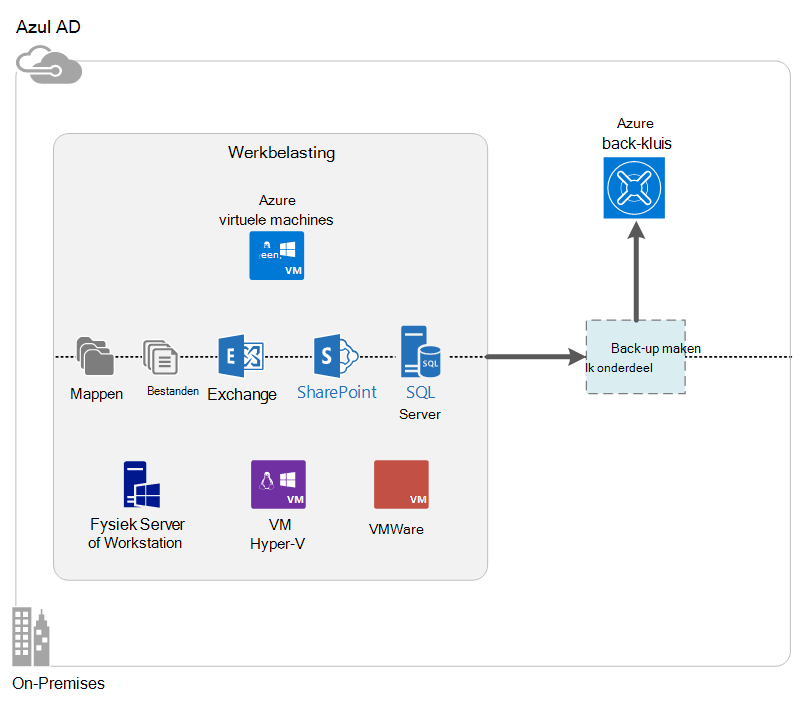

<properties
    pageTitle="Wat Azure back-up is? | Microsoft Azure"
    description="Met Azure back-up en herstel Services, kunt u een back-up en herstellen van gegevens en toepassingen uit de Windows-Servers Windows-clientcomputers, System Center DPM servers en Azure virtuele machines."
    services="backup"
    documentationCenter=""
    authors="markgalioto"
    manager="cfreeman"
    editor="tysonn"
    keywords="back-up en herstellen; herstel services; back-oplossingen"/>

<tags
    ms.service="backup"
    ms.workload="storage-backup-recovery"
    ms.tgt_pltfrm="na"
    ms.devlang="na"
    ms.topic="get-started-article"
    ms.date="10/19/2016"
    ms.author="jimpark; trinadhk"/>

# Wat Azure back-up is?
Azure back-up is de service die u kunt een back-up en herstellen van uw gegevens in de Microsoft-cloud. Uw bestaande lokale of externe back-oplossing wordt vervangen door een cloudgebaseerde oplossing die betrouwbare, veilige en kosten-Concurrentieanalyse. Is het ook handig beveiligen activa die worden uitgevoerd in de cloud. Azure back-up biedt herstel-services die zijn gebaseerd op een hoogwaardige infrastructuur die scalable, duurzame en ten zeerste beschikbaar is.

[Bekijk een video-overzicht van back-up van Azure](https://azure.microsoft.com/documentation/videos/what-is-azure-backup/)

## Het nut van Azure back-up maken?
Traditionele back-oplossingen hebt die is voortgekomen de cloud worden behandeld als een vergelijkbaar met schijven of tape eindpunt. Deze methode is eenvoudige, is het ook beperkt. Er wordt niet volledig profiteren van een onderliggende cloud-platform en een oplossing niet efficiënt, dure equivalent.
Azure back-ups biedt daarentegen alle voordelen van een back-oplossing krachtig en betaalbaar cloud. Hier zijn enkele van de belangrijkste voordelen van Azure back-up biedt.

| Functie | Voordeel |
| ------- | ------- |
| Automatische opslagbeheer | Geen uitgaven kapitaal nodig is voor lokale opslagapparaten. Azure back-up automatisch en beheert back-up opslaan en wordt een model betaald-als-u-klare verbruik gebruikt. |
| Onbeperkte schaalbaarheid | Maak gebruik van hoge beschikbaarheid garanties zonder de voorzieningen van onderhoud en controle. Azure back-up maakt gebruik van de onderliggende power en schaal van de Azure cloud, met de mogelijkheden van ervan nonintrusive autoscaling. |
| Meerdere opslagopties | Kies uw back-up opslaan op basis van nodig:<li>Een lokaal redundante opslag blok blob is ideaal voor prijs bewust klanten en deze nog steeds gegevens beter beschermen tegen lokale hardwarefouten. <li>Een geografische herhaling opslag blok blob biedt drie meer kopieën in een gepaarde datacenter. Deze extra exemplaren ervoor te zorgen dat uw back-upgegevens ten zeerste beschikbaar is, zelfs als er een Azure siteniveau noodgevallen optreedt. |
| Onbeperkt gegevens doorverbinden | Er zijn geen kosten voor de overdracht van alle egress (uitgaand) gegevens tijdens een bewerking herstellen uit de back-up-kluis. Gegevens inkomende naar Azure is ook gratis. Werkt met de importservice waar deze beschikbaar is. |
| Gegevensversleuteling | Gegevensversleuteling kan beveiligde overdracht en opslag van gegevens van de klant in de openbare cloud. De wachtwoordzin versleuteling is opgeslagen op de bron en wordt nooit verzonden of die zijn opgeslagen in Azure wordt aangegeven. De sleutel is vereist voor het herstellen van een van de gegevens en alleen de klant heeft volledige toegang tot de gegevens in de service. |  
| Toepassing consistente back-up maken | Windows-toepassing consistente back-ups ervoor te zorgen dat reparaties niet op het moment van herstellen, waardoor het doel van de tijd herstel nodig zijn. Hiermee kan klanten om terug te keren naar actief sneller. |
| Op lange termijn | In plaats van betaald wordt voor externe tape back-oplossingen, klanten kunnen back-up Azure, waarmee een aantrekkelijke tape-achtige oplossing tegen een lage prijs. |

## Azure back-up-onderdelen
Omdat back-up een oplossing voor het back-up van een hybride is, wordt deze bestaat uit meerdere onderdelen die samenwerken om te schakelen end-to-end back-up en herstellen van werkstromen.

### Scenario's voor implementatie

| Onderdeel | Kan worden geïmplementeerd in Azure? | Kan zijn geïmplementeerd on-premises implementatie? | Doel-opslag ondersteund|
| --- | --- | --- | --- |
| Azure back-up-agent | 
**Ja**
 
De back-up van Azure-agent kan worden geïmplementeerd op een Windows Server VM die wordt uitgevoerd in Azure wordt aangegeven.
 | 
**Ja**
 
De back-up-agent kan worden geïmplementeerd op een Windows Server VM of fysieke machine.
 | 
Azure back-up kluis
 |
| System Center Data Protection Manager (DPM) | 
**Ja**

Meer informatie over [het beveiligen van werkbelasting in Azure wordt aangegeven met behulp van System Center DPM](http://blogs.technet.com/b/dpm/archive/2014/09/02/azure-iaas-workload-protection-using-data-protection-manager.aspx).
 | 
**Ja**
 
Meer informatie over [het beveiligen van de werkbelasting en VMs in uw datacenter](https://technet.microsoft.com/library/hh758173.aspx).
 | 
Lokaal gekoppelde schijf
 
Azure back-up kluis,
 
tape (on-premises implementatie alleen)
 |
| Azure back-Server | 
**Ja**

Meer informatie over [het beveiligen van werkbelasting in Azure wordt aangegeven via Azure back-up-Server](backup-azure-microsoft-azure-backup.md).
 | 
**Ja**
 
Meer informatie over [het beveiligen van werkbelasting in Azure wordt aangegeven via Azure back-up-Server](backup-azure-microsoft-azure-backup.md).
 | 
Lokaal gekoppelde schijf
 
Azure back-up kluis
 |
| Azure back-up (VM extensie) | 
**Ja**

Onderdeel van Azure stof

Gespecialiseerde voor [back-up van Azure-infrastructuur als een service (IaaS) virtuele machines](backup-azure-vms-introduction.md).
 | 
**Nee**
 
Gebruik System Center DPM back-up virtuele machines in uw datacenter.
 | 
Azure back-up kluis
 |

### Onderdeel niveau voordelen en beperkingen

| Onderdeel | Voordelen | Beperkingen | Herstel granulatie |
| --- | --- | --- | --- |
| Azure back-up (MARS)-agent | <li>Kan back-up maken bestanden en mappen op een computer met Windows-besturingssysteem, worden deze fysieke of virtuele (VMs kunnen worden overal on-premises implementatie of Azure)<li>Geen afzonderlijke back-server vereist<li>Azure back-kluis gebruikt | <li>Drie keer een dag back-up/bestand niveau herstellen<li>Volume/map/File niveau herstellen alleen, niet van toepassing op de hoogte<li>Biedt geen ondersteuning voor Linux | bestanden/mappen/volumes |
| System Center Data Protection Manager | <li>App op de hoogte momentopnamen (VSS)<li>Volledige flexibiliteit bij het maken van back-ups<li>Herstel granulatie (alle)<li>Back-up van Azure kluis kunt gebruiken<li>Linux ondersteuning (als die worden gehost op Hyper-V) | <li>Het gebrek heterogene ondersteuning (VMware VM back-up moet Oracle werkbelasting back-up).  | bestanden/mappen/volumes / VMs/toepassingen |
| Microsoft Azure back-Server | <li>App op de hoogte momentopnamen (VSS)<li>Volledige flexibiliteit bij het maken van back-ups<li>Herstel granulatie (alle)<li>Back-up van Azure kluis kunt gebruiken<li>Linux ondersteuning (als die worden gehost op Hyper-V)<li>Niet vereist is voor een licentie System Center | <li>Het gebrek heterogene ondersteuning (VMware VM back-up moet Oracle werkbelasting back-up).<li>Live Azure abonnement nodig altijd<li>Biedt geen ondersteuning voor band | bestanden/mappen/volumes / VMs/toepassingen |
| Azure IaaS VM back-up maken | <li>Systeemeigen back-ups voor Windows/Linux<li>Geen specifieke agent installatie vereist<li>Stof niveau back-up met geen back-infrastructuur nodig | <li>Één keer per dag back-up/schijf niveau herstellen<li>Kan geen back-up van on-premises implementatie | VMs Alle schijven (via PowerShell) |

## Welke toepassingen en de werkbelasting kunnen worden back-up gemaakt?

| Werkbelasting | Broncomputer | Azure back-up-oplossing |
| --- | --- |---|
| Bestanden en mappen | Windows Server | 
[Back-up van azure-agent](backup-configure-vault.md),
 
[System Center DPM](backup-azure-dpm-introduction.md) (+ de back-up van Azure-agent),
 
[Azure back-Server](backup-azure-microsoft-azure-backup.md) (inclusief de back-up van Azure-agent)
  |
| Bestanden en mappen | Windows-client | 
[Back-up van azure-agent](backup-configure-vault.md),
 
[System Center DPM](backup-azure-dpm-introduction.md) (+ de back-up van Azure-agent),
 
[Azure back-Server](backup-azure-microsoft-azure-backup.md) (inclusief de back-up van Azure-agent)
  |
| VM Hyper-V (Windows) | Windows Server | 
[System Center DPM](backup-azure-backup-sql.md) (+ de back-up van Azure-agent),
 
[Azure back-Server](backup-azure-microsoft-azure-backup.md) (inclusief de back-up van Azure-agent)
 |
| VM Hyper-V (Linux) | Windows Server | 
[System Center DPM](backup-azure-backup-sql.md) (+ de back-up van Azure-agent),
 
[Azure back-Server](backup-azure-microsoft-azure-backup.md) (inclusief de back-up van Azure-agent)
  |
| Microsoft SQL Server | Windows Server | 
[System Center DPM](backup-azure-backup-sql.md) (+ de back-up van Azure-agent),
 
[Azure back-Server](backup-azure-microsoft-azure-backup.md) (inclusief de back-up van Azure-agent)
  |
| Microsoft SharePoint | Windows Server | 
[System Center DPM](backup-azure-backup-sql.md) (+ de back-up van Azure-agent),
 
[Azure back-Server](backup-azure-microsoft-azure-backup.md) (inclusief de back-up van Azure-agent)
   |
| Microsoft Exchange |  Windows Server | 
[System Center DPM](backup-azure-backup-sql.md) (+ de back-up van Azure-agent),
 
[Azure back-Server](backup-azure-microsoft-azure-backup.md) (inclusief de back-up van Azure-agent)
   |
| Azure IaaS VMs (Windows) | - | [Azure back-up (VM extensie)](backup-azure-vms-introduction.md) |
| Azure IaaS VMs (Linux) | - | [Azure back-up (VM extensie)](backup-azure-vms-introduction.md) |

## Op ARM en Linux-ondersteuning

| Onderdeel | Op ARM ondersteuning | Linux (Azure goedgekeurd) ondersteuning |
| --- | --- | --- |
| Azure back-up (MARS)-agent | Ja | Geen (alleen Windows op basis-agent) |
| System Center Data Protection Manager | Ja (Agent in Gast) | Alleen Hyper-V (niet Azure VM) alleen bestand consistente back-up is mogelijk |
| Azure back-Server (MAB) | Ja (Agent in Gast) | Alleen Hyper-V (niet Azure VM) alleen bestand consistente back-up mogelijk is (gelijk aan DPM) |
| Azure IaaS VM back-up maken | Ja | Ja |

[AZURE.INCLUDE [learn-about-deployment-models](../../includes/learn-about-deployment-models-include.md)]

## Een back-up en herstellen van Premium opslag VMs

De back-up van Azure-service wordt nu Premium opslag VMs beschermen.

### Een back-up Premium opslag VMs

Terwijl een back-up Premium opslag VMs, maakt de back-up-service een tijdelijke locatie voor het tijdelijk opslaan in de opslag van de Premium-account. Het tijdelijk opslaan locatie, met de naam "AzureBackup-", is gelijk aan de totale grootte van de premium-schijven die zijn bijgevoegd bij de VM.

>[AZURE.NOTE] Wijzigen of het tijdelijk opslaan locatie bewerken.

Nadat de back-uptaak is voltooid, wordt het tijdelijk opslaan locatie worden verwijderd. De prijs van opslagruimte die wordt gebruikt voor het tijdelijk opslaan locatie komt overeen met alle [Premium opslag prijzen](../storage/storage-premium-storage.md#pricing-and-billing).

### Premium opslag VMs herstellen

Premium opslag VM kan worden hersteld op een van beide Premium-opslag of op normale opslag. Een Premium opslag VM herstelpunt terug naar de Premium-opslag herstellen, is het normale proces herstel. Het echter, kan zijn kosten effectieve een Premium opslag VM herstelpunt herstellen naar de standaard opslag. Dit soort herstel kan worden gebruikt als u een subset van bestanden uit de VM nodig hebt.

## Functionaliteit
Deze vier tabellen samenvatten hoe back-functionaliteit is verwerkt in elk onderdeel.

### Opslag

| Functie | Azure back-up-agent | System Center DPM | Azure back-Server | Azure back-up (VM extensie) |
| ------- | --- | --- | --- | ---- |
| Azure back-up kluis | ![Ja][green] | ![Ja][green] | ![Ja][green] | ![Ja][green] |
| Schijfruimte | | ![Ja][green] | ![Ja][green] |  |
| Tapeopslag | | ![Ja][green] |  | |
| Compressie (in de back-kluis) | ![Ja][green] | ![Ja][green]| ![Ja][green] | |
| Incrementele back-up | ![Ja][green] | ![Ja][green] | ![Ja][green] | ![Ja][green] |
| Schijf deduplication | | ![Gedeeltelijk][yellow] | ![Gedeeltelijk][yellow]| | |

De kluis back-up is het doel van de voorkeur opslag door alle onderdelen. System Center DPM en back-up Server bieden ook de optie voor het kopiëren van een lokale schijf hebt. Alleen System Center DPM biedt echter de optie bij het wegschrijven van gegevens naar een apparaat met tape opslag.

#### Incrementele back-up
Elk onderdeel ondersteunt incrementele back-up ongeacht de doel-opslag (schijf, tape, back-kluis). Incrementele back-up zorgt ervoor dat back-ups opslag- en tijdfunctie efficiënte, door over te brengen alleen deze wijzigingen hebt aangebracht sinds de laatste back-up.

#### Compressie
Back-ups worden gecomprimeerd om te verkleinen van de vereiste opslagruimte. De enige onderdeel die geen van compressie gebruikmaakt is de uitbreiding VM. Met de extensie VM, alle back-upgegevens wordt gekopieerd van het klantaccount opslag naar de back-kluis in hetzelfde gebied zonder deze te comprimeren. Terwijl gaan zonder compressie enigszins inflates de opslag gebruikt, kan de gegevens zonder compressie opslaat voor herstellen's te versnellen.

#### Deduplication
Deduplication wordt ondersteund voor System Center DPM en back-up-Server wanneer deze [geïmplementeerd in een Hyper-V virtuele machine is](http://blogs.technet.com/b/dpm/archive/2015/01/06/deduplication-of-dpm-storage-reduce-dpm-storage-consumption.aspx). Deduplication wordt uitgevoerd op het hostniveau van de met behulp van Windows Server deduplication op virtuele vaste schijven die zijn gekoppeld aan de virtuele machine als back-up opslaan.

>[AZURE.WARNING] Deduplication is niet beschikbaar in Azure naar een of meer van de back-up-onderdelen. Wanneer System Center DPM en back-up-Server zijn geïmplementeerd in Azure wordt aangegeven, kan de schijven die zijn bijgevoegd bij de VM kunnen niet worden deduplicated.

### Beveiliging

| Functie | Azure back-up-agent | System Center DPM | Azure back-Server | Azure back-up (VM extensie) |
| ------- | --- | --- | --- | ---- |
| Netwerkbeveiliging (naar Azure) | ![Ja][green] |![Ja][green] | ![Ja][green] | ![Gedeeltelijk][yellow]|
| Beveiliging van gegevens (in Azure wordt aangegeven) | ![Ja][green] |![Ja][green] | ![Ja][green] | ![Gedeeltelijk][yellow]|

Alle back-verkeer van uw servers om de back-up is versleuteld met behulp van geavanceerde versleuteling standaard 256. De gegevens worden verzonden via een beveiligde HTTPS-koppeling. De back-upgegevens wordt ook opgeslagen in de back-up-kluis in gecodeerde vorm. Alleen de klant bevat de wachtwoordzin te ontgrendelen van deze gegevens. Microsoft ontsleutelen niet de back-upgegevens op elk gewenst moment.

>[AZURE.WARNING] De toets gebruikt voor het coderen van de back-upgegevens zich alleen voor gebruik met de klant. Microsoft niet meer in een kopie in Azure wordt aangegeven en heeft geen geen toegang hebben tot de sleutel. Als de sleutel is kwijtgeraakt, herstellen niet Microsoft de back-upgegevens.

Een back-up Azure VMs vereist instellen van versleuteling *binnen* de virtuele machine. Gebruik BitLocker op Windows virtuele machines en **dm-crypt** op Linux virtuele machines. Azure back-up wordt niet automatisch back-gegevens die afkomstig zijn via dit pad gecodeerd.

### Ondersteunde werkbelasting

| Functie | Azure back-up-agent | System Center DPM | Azure back-Server | Azure back-up (VM extensie) |
| ------- | --- | --- | --- | ---- |
| Windows Server machine--bestanden en mappen | ![Ja][green] | ![Ja][green] | ![Ja][green] | |
| Windows-clientcomputer--bestanden en mappen | ![Ja][green] | ![Ja][green] | ![Ja][green] | |
| VM Hyper-V (Windows) | | ![Ja][green] | ![Ja][green] | |
| VM Hyper-V (Linux) | | ![Ja][green] | ![Ja][green] | |
| Microsoft SQL Server | | ![Ja][green] | ![Ja][green] | |
| Microsoft SharePoint | | ![Ja][green] | ![Ja][green] | |
| Microsoft Exchange  | | ![Ja][green] | ![Ja][green] | |
| Azure virtuele machines (Windows) | | | | ![Ja][green] |
| Azure virtuele machines (Linux) | | | | ![Ja][green] |

### Netwerk

| Functie | Azure back-up-agent | System Center DPM | Azure back-Server | Azure back-up (VM extensie) |
| ------- | --- | --- | --- | ---- |
| Netwerkcompressie (naar de back-server) | | ![Ja][green] | ![Ja][green] | |
| Netwerkcompressie (om de back-ups) | ![Ja][green] | ![Ja][green] | ![Ja][green] | |
| Netwerkprotocol (naar de back-server) | | TCP | TCP | |
| Netwerkprotocol (om de back-ups) | HTTPS | HTTPS | HTTPS | HTTPS |

Aangezien de extensie VM leest de gegevens rechtstreeks vanuit de opslag van Azure-account via het opslagnetwerk, is het niet nodig dit verkeer optimaliseren. Het verkeer is via het netwerk lokale opslag in het Azure datacenter, dus er weinig nodig voor compressie vanwege aandachtspunten voor de bandbreedte is.

Als u een back-up uw gegevens met een back-server (DPM of back-Server), kan verkeer van de primaire server naar de back-server om op te slaan op bandbreedte worden gecomprimeerd.

#### Netwerk beperken
De back-up van Azure-agent biedt bandbreedteregeling mogelijkheid, zodat u kunt bepalen hoe netwerkbandbreedte wordt gebruikt tijdens overdracht van gegevens. Beperken is handig als u een back moet-up gegevens tijdens de werkuren, maar niet wilt dat de back-proces voor het andere internetverkeer storen. Beperken voor gegevens doorverbinden is van toepassing als u een back-up en herstellen van activiteiten.

### Back-up en bewaarbeleid

|  | Azure back-up-agent | System Center DPM | Azure back-Server | Azure back-up (VM extensie) |
| --- | --- | --- | --- | --- |
| Back-up van de frequentie (om de back-ups) | Drie back-ups per dag | Twee back-ups per dag |Twee back-ups per dag | Een back-up per dag |
| Back-up van de frequentie (op schijf) | Niet van toepassing | 
Elke 15 minuten voor SQL Server
 
Per uur voor andere werkbelasting
 | 
Elke 15 minuten voor SQL Server
 
Per uur voor andere werkbelasting
 |Niet van toepassing |
| Opties voor Gegevensretentie | Dagelijks, wekelijks, maandelijks, jaarlijks | Dagelijks, wekelijks, maandelijks, jaarlijks | Dagelijks, wekelijks, maandelijks, jaarlijks |Dagelijks, wekelijks, maandelijks, jaarlijks |
| Bewaarperiode | Maximaal 99 jaar | Maximaal 99 jaar | Maximaal 99 jaar | Maximaal 99 jaar |
| Herstel punten in de back-up kluis | Onbeperkt | Onbeperkt | Onbeperkt | Onbeperkt |
| Herstel punten op de lokale schijf | Niet van toepassing | 64 voor bestandsservers  448 voor toepassingsservers | 64 voor bestandsservers  448 voor toepassingsservers |Niet van toepassing |
| Herstel punten op tape | Niet van toepassing | Onbeperkt | Niet van toepassing | Niet van toepassing |

## Wat is het kluis referentie-bestand?

Het bestand van de referenties kluis is een certificaat dat is gegenereerd door de portal voor elke back-kluis. De portal uploadt u de openbare sleutel vervolgens naar de Access Control Service (ACS). De persoonlijke sleutel is opgegeven voor de gebruiker bij het downloaden van de referenties en vervolgens tijdens de registratie van de computer zijn ingevoerd. De persoonlijke sleutel wordt geverifieerd door de machine voor het back-upgegevens verzenden naar een geïdentificeerd kluis in de back-Azure-service.

De referentie kluis wordt alleen gebruikt tijdens de registratie-werkstroom. Het is uw verantwoordelijkheid om ervoor te zorgen dat het bestand dat kluis referenties niet wordt belemmerd. Als deze in de handen van elke rogue-gebruiker valt, kan het bestand van de referenties kluis worden gebruikt voor het registreren van andere computers ten opzichte van de dezelfde kluis. Aangezien de back-gegevens worden versleuteld met een wachtwoordzin die deel uitmaken van alleen naar de klant, kunnen bestaande back-ups echter kan niet worden geknoeid. Als u wilt beperken dit te voorkomen, worden kluis referenties ingesteld verloopt in 48 uur. Hoewel u kunt downloaden de kluis referenties van een back-up vault een willekeurig aantal malen, alleen de meest recente bestand is van toepassing tijdens de registratie-werkstroom.

## Hoe verschilt Azure back-up van Azure Site herstel?
Veel klanten Verwar back-up herstellen en herstel. Beide worden gegevens vastgelegd en herstellen semantiek, maar hun core toegevoegde waarden zijn verschillende.

Azure back-waarin omhoog lokale gegevens en in de cloud. Azure Site herstel coördinaten virtuele machine en fysieke-server herhaling, failover en failback. Beide services zijn belangrijk omdat uw noodgevallen hersteloplossing moet uw gegevens veilig te houden en herstelbare (back-up) *en* uw werkbelasting beschikbaar (Site herstellen) behouden wanneer bijvoorbeeld plaatsvinden.

De volgende begrippen kunnen u belangrijke beslissingen nemen rond back-up en noodherstel.

| Concept | Meer informatie | Back-up maken | Herstel (DR) |
| ------- | ------- | ------ | ----------------- |
| Herstel punt doelstelling (vrijgegeven Productieorder) | De hoeveelheid aanvaardbaar gegevensverlies als een herstel eenmaal te worden uitgevoerd. | Back-oplossingen hebben een grote verscheidenheid in hun aanvaardbaar vrijgegeven Productieorder. VM back-ups hebben meestal een vrijgegeven Productieorder van één dag, terwijl de back-ups van database hebt productoutput zo laag 15 minuten. | Noodgevallen hersteloplossingen hebt lage productoutput. De kopie DR kan worden achter een paar seconden of een paar minuten. |
| Herstel tijd doelstelling (RTO) | De hoeveelheid tijd die nodig is om te voltooien van een herstel of herstellen. | Vanwege de grotere vrijgegeven Productieorder is de hoeveelheid gegevens die een back-oplossing moet worden verwerkt meestal veel hoger, die leidt naar langer RTOs. Het duurt bijvoorbeeld dagen gegevens van banden, afhankelijk van de tijd in beslag transport van de band vanuit een locatie wilt terugzetten. | Noodgevallen hersteloplossingen er kleinere RTOs omdat ze meer gesynchroniseerd met de bron zijn. Minder wijzigingen moeten worden verwerkt. |
| Bewaarbeleid | Hoe lang gegevens moeten worden opgeslagen | Back-upgegevens blijft voor scenario's waarvoor operationele herstel (beschadiging, per ongeluk worden bestandsverwijdering, OS mislukt), meestal behouden voor 30 dagen of minder. Naleving aspecten, van gegevens mogelijk moet worden opgeslagen voor maanden of zelfs jaren. Back-upgegevens is ideaal voor het archiveren in dat geval. | Herstel alleen operationele zijn herstelgegevens nodig, waarin meestal een paar uur of naar een dag duurt. Vanwege de fijnmazige gegevens vastleggen in DR-oplossingen die zijn gebruikt, wordt gebruik DR-gegevens op lange termijn niet aanbevolen. |

## Volgende stappen

Een eenvoudige Azure back-up uitproberen. Zie een van deze zelfstudies voor instructies:

- [Probeer Azure back-up maken](backup-try-azure-backup-in-10-mins.md)
- [Probeer Azure VM back-up maken](backup-azure-vms-first-look.md)

Omdat deze zelfstudies u een back-up snel helpen, worden ze weergegeven u alleen de meest directe pad voor het back-ups van uw gegevens. Voor meer informatie over het type back-up u wilt uitvoeren, zien:

- [Back-up van Windows-computer](backup-configure-vault.md)
- [Een back-up werkbelasting van toepassingen](backup-azure-microsoft-azure-backup.md)
- [Back-up Azure IaaS VMs](backup-azure-vms-prepare.md)

[green]: ./media/backup-introduction-to-azure-backup/green.png
[yellow]: ./media/backup-introduction-to-azure-backup/yellow.png
[red]: ./media/backup-introduction-to-azure-backup/red.png
