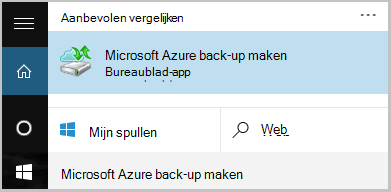

<properties
   pageTitle="Leer hoe u back-up maken bestanden en mappen uit Windows Azure met Azure back-up maken met het implementatiemodel resourcemanager | Microsoft Azure"
   description="Leer hoe u de back-up van Windows Server-gegevens door een kluis maken, installatie van de herstel Services-agent en back-ups van uw bestanden en mappen naar Azure."
   services="backup"
   documentationCenter=""
   authors="markgalioto"
   manager="cfreeman"
   editor=""
   keywords="hoe u de back-up. hoe u een back-up"/>

<tags
   ms.service="backup"
   ms.workload="storage-backup-recovery"
   ms.tgt_pltfrm="na"
   ms.devlang="na"
   ms.topic="hero-article"
   ms.date="09/27/2016"
   ms.author="markgal;"/>

# Eerst wordt gezocht naar: Maak een back-up van bestanden en mappen met Azure back-up maken met het implementatiemodel resourcemanager-

In dit artikel wordt uitgelegd hoe u de back-up van uw Windows-Server (of Windows-client) bestanden en mappen Azure met Azure back-up met Resource Manager. Het is een zelfstudie bedoeld u stapsgewijs door de basisbeginselen. Als u aan de slag met Azure back-up wilt, bent u in de juiste plaats verzonden.

Als u meer weten over Azure back-up wilt, leest u dit [Overzicht](backup-introduction-to-azure-backup.md).

Een back-up bestanden en mappen naar Azure, hebt u deze activiteiten nodig:

 krijgen een Azure-abonnement (als u nog geen hebt). 
 maken van een kluis herstel Services. 
 de benodigde bestanden downloaden. 
 installeren en register de agent herstel Services. 
 Maak een Back-up van uw bestanden en mappen.

## Stap 1: Een Azure-abonnement downloaden

Als u geen een Azure-abonnement hebt, maakt u een [gratis account](https://azure.microsoft.com/free/) waarmee u toegang tot een Azure-service.

## Stap 2: Maak een kluis herstel Services

Als u wilt back-up van uw bestanden en mappen, moet u een kluis herstel Services maken in de regio waar u de gegevens op te slaan. Ook moet u bepalen hoe u wilt dat uw opslag gerepliceerd.

### Een kluis herstel Services maken

1. Als u dit nog niet hebt gedaan, meld u aan bij de [Portal van Azure](https://portal.azure.com/) met uw Azure-abonnement.

2. Klik in het menu Hub klikt u op **Bladeren** en typ in de lijst met resources, **Herstel Services** en op **herstel Services kluizen**.

      

3. Klik in het menu **kluizen herstel Services** op **toevoegen**.

    

    Het herstelproces is Services kluis blad wordt geopend, waarin u een **naam**, het **abonnement**, de **resourcegroep**en de **locatie**op te geven.

    

4. Voer een beschrijvende naam voor de kluis voor de **naam**.

5. Klik op **abonnement** als u wilt zien van de lijst beschikbare van abonnementen.

6. **Resourcegroep** als u wilt zien van de lijst beschikbare van resourcegroepen op of klik op **Nieuw** om een nieuwe resourcegroep te maken.

7. Klik op **locatie** als het geografische gebied voor de kluis wilt selecteren. Uw keuze bepaalt de geografische regio waar uw back-upgegevens wordt verzonden.

8. Klik op **maken**.

    Als u uw kluis weergegeven nadat deze is voltooid niet ziet, klikt u op **vernieuwen**. Wanneer de lijst wordt vernieuwd, klikt u op de naam van de kluis.

### Om te bepalen opslag redundantie
Wanneer u eerst een kluis herstel Services maakt kunt u bepalen hoe opslag worden gerepliceerd.

1. Klik op de nieuwe kluis openen van het dashboard.

2. Klik in het blad **Instellingen** , die automatisch wordt gestart met uw dashboard kluis, op **Back-up-infrastructuur**.

3. Klik in het blad back-up-infrastructuur op **Back-up-configuratie** als u wilt weergeven van het **type van opslag herhaling**.

    

4. Kies de juiste opslag replicatie-optie voor uw kluis.

    

    Standaard is uw kluis geografische-redundante opslag. Als u Azure als een eindpunt primaire back-up opslaan gebruikt, gaat u verder met geografische-redundante opslag. Als u Azure als een back-up opslaan van niet-primaire-eindpunt gebruikt, kiest u lokaal overtollige opslag, waarmee de kosten van het opslaan van gegevens in Azure wordt aangegeven wordt beperkt. Meer informatie over [geografische-redundante](../storage/storage-redundancy.md#geo-redundant-storage) en [lokaal overtollige](../storage/storage-redundancy.md#locally-redundant-storage) opslagopties voor in dit [Overzicht](../storage/storage-redundancy.md).

Nu dat u een kluis hebt gemaakt, kunt u de infrastructuur van uw back-up bestanden en mappen door te downloaden van de Services van Microsoft Azure herstel agent en kluis referenties voorbereiden.

## Stap 3 - bestanden die worden gedownload

1. Klik op **Instellingen** op het dashboard van de kluis herstel Services.

    

2. Klik op **aan de slag > back-up** op het blad instellingen.

    

3. **Doel van de back-up-** Klik op het blad back-up.

    

4. Selecteer **On-premises** waaruit het is uw werkzaamheden uitgevoerd? menu.

5. Selecteer van **bestanden en mappen** in de wat u wilt wilt back-up maken? menu en klik op **OK**.

### Download de herstel Services-agent

1. Klik in het blad **voorbereiden infrastructuur** op **Agent downloaden voor Windows Server of Windows-Client** .

    

2. Klik op **Opslaan** in de pop-up downloaden. Het bestand **MARSagentinstaller.exe** wordt standaard opgeslagen naar de map Downloads.

### Downloaden van referenties kluis

1. Klik op **downloaden > opslaan** op het blad van de infrastructuur voorbereiden.

    

## Stap 4 - installeren en registreren van de agent

>[AZURE.NOTE] Inschakelen back-ups via de portal van Azure is binnenkort beschikbaar. Op dit moment kunt u de Microsoft Azure herstel Services Agent lokale back-up van uw bestanden en mappen.

1. Zoek en dubbelklik op de **MARSagentinstaller.exe** uit de map Downloads (of een andere locatie is opgeslagen).

2. Hiermee voert u de Wizard Setup van Microsoft Azure herstel Services Agent. Als u wilt de wizard hebt voltooid, moet u:

    - Kies een locatie voor de installatie en de cachemap.
    - Geef uw proxy Info over server als u een proxyserver gebruikt om te verbinding hebt met internet.
    - Geef uw gebruikers-gebruikersnaam en wachtwoord details als u een geverifieerde proxy bevindt.
    - De referenties van de gedownloade kluis
    - Sla de wachtwoordzin versleuteling op een veilige locatie.

    >[AZURE.NOTE] Als u kwijtraakt of de wachtwoordzin vergeet, kan Microsoft niet helpen de back-upgegevens terugzetten. Sla het bestand op een veilige locatie. Dit is vereist voor het herstellen van een back-up.

De-agent is nu geïnstalleerd en uw computer is geregistreerd om de. U bent klaar om te configureren en plannen van de back-up.

## Stap 5: Back-up van uw bestanden en mappen

De eerste back-up bevat twee belangrijke taken:

- De back-up plannen
- Back-up van bestanden en mappen voor de eerste keer

Als u wilt de eerste back-up hebt voltooid, moet u de Microsoft Azure herstel Services-agent gebruiken.

### De back-up plannen

1. Open de Microsoft Azure herstel Services-agent. U vindt deze door te zoeken van uw computer naar **Microsoft Azure back-up**.

    

2. Klik in de herstel Services-agent op **Planning back-up**.

    

3. Klik op **volgende**op de pagina aan de slag van de Wizard van de back-up planning.

4. Klik op de Items selecteren naar de pagina back-up op **Items toevoegen**.

5. Selecteer de bestanden en mappen die u een back wilt-up en klik vervolgens op **OK**.

6. Klik op **volgende**.

7. Klik op de pagina **Back-planning opgeven** opgeven van de **back-ups plannen** en klik op **volgende**.

    U kunt dagelijks (met een maximum snelheid drie keer per dag) of wekelijkse back-ups plannen.

    

    >[AZURE.NOTE] Zie het artikel [Gebruik Azure back-up voor het vervangen van de infrastructuur van uw tape](backup-azure-backup-cloud-as-tape.md)voor meer informatie over het opgeven van de back-planning.

8. Selecteer op de pagina **Selecteer bewaarbeleid voor** het **Bewaarbeleid** voor de back-up.

    Het bewaarbeleid Hiermee geeft u de duur waarvoor de back-up wordt opgeslagen. In plaats van alleen een 'platte beleid' voor alle back-punten op te geven, kunt u verschillende bewaarbeleid op basis van wanneer de back-up. De dagelijks, wekelijks, maandelijks en jaarkalender bewaarbeleid aan uw wensen, kunt u wijzigen.

9. Kies het eerste back-type op de pagina aanvankelijke back-Type kiezen. Laat de optie **automatisch via het netwerk** geselecteerd en klik vervolgens op **volgende**.

    U kunt een back-up automatisch via het netwerk of u kunt een back-up offline. De rest van dit artikel wordt beschreven van het proces voor een automatisch back-up. Als u liever een offline back-up doen, raadpleegt u het artikel [Offline back-werkstroom in Azure back-up](backup-azure-backup-import-export.md) voor meer informatie.

10. Controleer de gegevens op de pagina bevestigen en klik vervolgens op **Voltooien**.

11. Nadat de wizard is voltooid de back-planning maken, klikt u op **sluiten**.

### Back-up bestanden en mappen voor de eerste keer

1. In de herstel Services-agent, klikt u op **Nu een Back-Up maken** om te voltooien de eerste seeding via het netwerk.

    

2. Op de pagina Confirmation de instellingen dat de Wizard Back-Up nu gebruiken wilt voor het back-up van de computer te bekijken. Klik vervolgens op **Back-Up**.

3. Klik op **sluiten** om de wizard te sluiten. Als u dit doen voordat u de back-up is voltooid, blijft de wizard op de achtergrond uitvoeren.

Nadat de eerste back-up is voltooid, is de status **taak voltooid** wordt weergegeven in de back-up-console.

## Vragen?
Als u vragen hebt of als er is een functie die u wilt zien opgenomen, [Stuur ons feedback](http://aka.ms/azurebackup_feedback).

## Volgende stappen
- Meer informatie over [een back-up Windows machines](backup-configure-vault.md)krijgen.
- Nu dat u back-up uw bestanden en mappen gemaakt hebt, kunt u [uw kluizen en servers beheren](backup-azure-manage-windows-server.md).
- Als u herstellen van een back-up wilt, gebruikt u dit artikel voor [bestanden terugzetten naar een Windows-computer](backup-azure-restore-windows-server.md).
