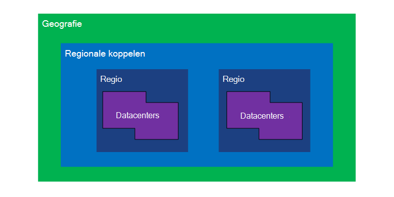
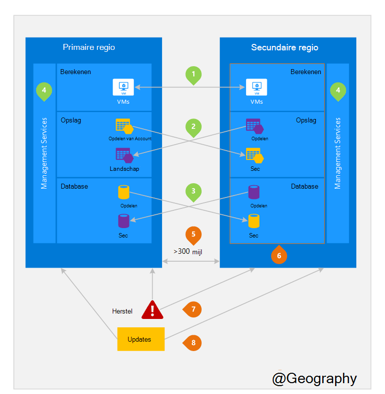

<properties
    pageTitle="Zakelijke bedrijfscontinuïteit en noodgevallen herstel (BCDR): Azure gepaarde t-toets regio's | Microsoft Azure"
    description="Azure regionale paren zorgen ervoor dat toepassingen robuuste tijdens data center fouten."
    services="site-recovery"
    documentationCenter=""
    authors="rayne-wiselman"
    manager="jwhit"
    editor=""/>

<tags
    ms.service="site-recovery"
    ms.workload="storage-backup-recovery"
    ms.tgt_pltfrm="na"
    ms.devlang="na"
    ms.topic="article"
    ms.date="08/23/2016"
    ms.author="raynew"/>

# Zakelijke bedrijfscontinuïteit en noodgevallen herstel (BCDR): Azure gepaarde t-toets regio's

## Wat zijn gepaarde t-toets regio's?

Azure werkt in verschillende gebieden overal ter wereld. Een Azure geography is een gedefinieerd gebied van de wereld met ten minste één Azure gebied. Een Azure gebied is een gebied binnen een Geografie met een of meer datacenters.

Elke Azure regio is gekoppeld aan een ander gebied in de dezelfde Geografie, waardoor samen regionale twee. De uitzondering is Brazilië Zuid die is gekoppeld aan een gebied buiten de Geografie.

Afbeelding 1 – Azure regionale paar-diagram

| Geografie     |  Gepaarde regio 's  |                     |
| :-------------| :-------------   | :-------------      |
| Noord-Amerika | Centraal Noord-Amerikaanse | Zuid-Central US    |
| Noord-Amerika | Oost-VS          | West VS             |
| Noord-Amerika | Amerikaans Oost 2        | Amerikaans centraal          |
| Noord-Amerika | West Amerikaans 2        | West Centraal VS     |
| Europa        | Noord-Europa     | West Europa         |
| Azië          | Zuid-Oost-Azië  | Oost-Azië           |
| China         | Oost-China       | Noord China         |
| Japan         | Japan Oost       | Japan West          |
| Brazilië        | Brazilië Zuid (1) | Zuid-Central US    |
| Australië     | Australië Oost   | Australië Zuidoost |
| Amerikaanse overheid | Amerikaans beurs Iowa      | Amerikaans beurs Virginia     |
| India         | Centraal India    | Zuid-India         |
| Canada        | Canada centraal   | Canada-Oost         |
| VERENIGD KONINKRIJK            | Verenigd Koninkrijk West          | Verenigd Koninkrijk Zuid            |

Tabel 1 - toewijzing van azure regionale paren

> (1) Zuid Brazilië is uniek omdat deze is gekoppeld aan een gebied buiten een eigen Geografie. Brazilië Zuid van secundaire regio Zuid centraal ons is maar Zuid centraal ons van secundaire regio is niet Brazilië Zuid.

Het is raadzaam dat u werkbelasting repliceren in regionale vastleggen om te profiteren van de beleidsregels moeten worden geïsoleerd en beschikbaarheid van Azure. Bijvoorbeeld geplande Azure systeemupdates opeenvolging zijn geïmplementeerd (niet op hetzelfde moment) tussen de gepaarde regio's. Dit betekent dat zelfs in de zelden van een defect update, beide regio's geen voor tegelijk gevolgen heeft. Bovendien in zelden een brede storing, krijgt herstel van ten minste één regio afmelden bij elk paar voorrang.

## Een voorbeeld van gepaarde regio 's
Afbeelding 2 hieronder ziet u een hypothetische toepassing waarin het regionale paar voor herstel wordt gebruikt. De groene getallen Markeer de cross-regio-activiteiten van drie Azure services (Azure berekenen, opslag- en -Database) en hoe deze zijn geconfigureerd als u wilt repliceren in regio's. De unieke voordelen van het implementeren van via gepaarde regio's zijn gemarkeerd door de oranje getallen.

Afbeelding 2 – hypothetische Azure regionale koppelen

## Cross-regio activiteiten
Als bedoeld in figuur 2.

 **Azure berekenen (PaaS)** – u moet extra berekeningscluster resources tevoren om ervoor te zorgen bronnen zijn beschikbaar in een andere regio tijdens een noodgevallen inrichten. Zie [Azure tolerantie technische richtlijnen](./resiliency/resiliency-technical-guidance.md)voor meer informatie.

 **Azure Storage** - geografische-redundante opslag (GRS) al dan niet standaard is geconfigureerd als een Azure Storage-account wordt gemaakt. Met GRS, uw gegevens worden automatisch gerepliceerd drie keer binnen de primaire regio en drie keer in de gepaarde regio. Zie [Azure opslag redundantieopties](storage/storage-redundancy.md)voor meer informatie.

 **Azure SQL-Databases** – met Azure SQL standaard geografische-replicatie, kunt u asynchroon replicatie van transacties naar een gepaarde gebied configureren. Met Premium geografische-herhaling, kunt u replicatie naar een gebied in de wereld; we raden echter aan dat u deze resources in een gepaarde regio federatieve voor noodgevallen herstel implementeren. Zie [Geografische-herhaling in Azure SQL-Database](./sql-database/sql-database-geo-replication-overview.md)voor meer informatie.

 logische moeten worden geïsoleerd van service beheeronderdelen **Azure Resource Manager (ARM)** - ARM inherent biedt tussen regio's. Dit betekent logische fouten in één regio minder mogelijke invloed op andere zijn.

## Voordelen van gepaarde regio 's
Als bedoeld in figuur 2.  

**fysiek moeten worden geïsoleerd** – indien mogelijk, Azure voorkeur ten minste 300 mijl van scheiding tussen datacenters in de combinatie van een regionale, hoewel dit praktische of mogelijk niet in alle regio's. Fysiek datacenter scheiding Hiermee reduceert u de kans op natuurrampen, wettelijke unrest, stroomonderbrekingen of fysiek netwerkstoringen beide regio's in één keer te beïnvloeden. Moeten worden geïsoleerd is onderhevig aan de beperkingen binnen de Geografie (Geografie grootte, power/netwerk infrastructuur beschikbaarheid, regelgeving, enzovoort).  

**geleverde Platform replicatie** - bepaalde services zoals geografische-redundante opslag bieden automatische replicatie de gepaarde regio.

**regio herstel volgorde** – in het geval van een brede storing, herstel van één regio is prioriteit afmelden bij elk paar gegevenspunten. Toepassingen die zijn geïmplementeerd tussen gepaarde regio's zijn gegarandeerd beschikken over een van de regio's met de prioriteit hersteld. Als een toepassing wordt geïmplementeerd tussen regio's die niet zijn gekoppeld, mag herstel worden uitgesteld – in het ongunstigste geval dat de door u gekozen regio's mogelijk de laatste twee worden hersteld.

**sequentieel bijgewerkt** – geplande Azure-systeem updates worden geïmplementeerd op gepaarde regio's opeenvolging (niet op hetzelfde moment) om te minimaliseren downtime, het effect van bugs bij te werken en logische fouten in de zelden van een ongeldige update.

**gegevens hand vestigingsplaats** – een gebied zich bevinden binnen de dezelfde Geografie als de paar gegevenspunten (met uitzondering van Brazilië Zuid) om te voldoen aan gegevens hand vestigingsplaats vereisten voor belasting en recht afdwingen bevoegdheid doeleinden.

