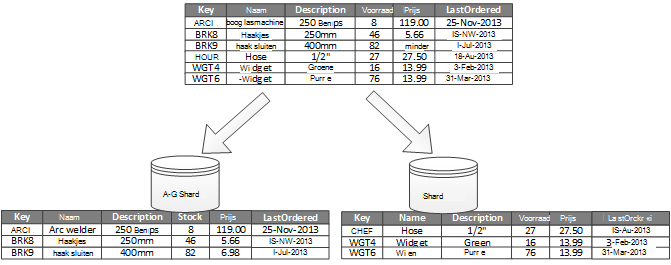
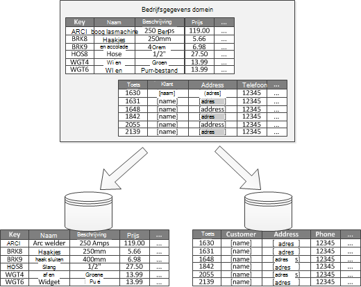

<properties
   pageTitle="Gegevens partitioneren richtlijnen | Microsoft Azure"
   description="Richtlijnen voor het scheiden van de partities worden beheerd en afzonderlijk geopend."
   services=""
   documentationCenter="na"
   authors="dragon119"
   manager="christb"
   editor=""
   tags=""/>

<tags
   ms.service="best-practice"
   ms.devlang="na"
   ms.topic="article"
   ms.tgt_pltfrm="na"
   ms.workload="na"
   ms.date="07/14/2016"
   ms.author="masashin"/>

# Gegevens partities richtlijnen

[AZURE.INCLUDE [pnp-header](../includes/guidance-pnp-header-include.md)]

## Overzicht

In veel grootschalige oplossingen, gegevens in afzonderlijke partities die kunnen worden beheerd en afzonderlijk toegankelijk gedeeld. De partities strategie moet zorgvuldig worden gekozen om de voordelen tegelijkertijd nadelige gevolgen. Partitioneren kan helpen verbeteren schaalbaarheid, conflict verkleinen en prestaties optimaliseren. Een ander voordeel van partitioneren is dat deze een methode voor het delen van gegevens door het patroon van gebruiken. U kunt bijvoorbeeld oudere, minder actieve (koudwatersystemen) gegevens in goedkoper gegevensopslag archiveren.

## Waarom partitioneren gegevens?

De meeste cloud-toepassingen en services opslaan en gegevens ophalen als onderdeel van hun activiteiten. Het ontwerp van de gegevens winkels die gebruikmaakt van een toepassing kan een grote invloed op de prestaties, doorvoer en schaalbaarheid van een systeem hebben. Een techniek die meestal wordt toegepast in grootschalige systemen is te verdelen van de gegevens in afzonderlijke partities.

> De term _partitioneren_ die wordt gebruikt in deze instructies verwijst naar het proces van het fysiek in afzonderlijke dat gegevens worden gedeeld. Dit is niet hetzelfde als de SQL Server-tabel partitioneren, namelijk een ander concept.

Gegevens partitioneren, kan een aantal voordelen bieden. Dit kan bijvoorbeeld worden toegepast om:

- **Schaalbaarheid verbeteren**. Wanneer u schaal van een database voor eenmalige-systeem, wordt dit uiteindelijk een fysieke hardware limiet hebt bereikt. Als u gegevens op verschillende partities delen, elk van die wordt gehost op een afzonderlijke server, kunt u vrijwel voor onbepaalde tijd het systeem schalen.
- **Prestaties verbeteren**. Access gegevensbewerkingen op elke partition vindt plaats via een kleinere hoeveelheid gegevens. Voorwaarde dat de gegevens in een geschikte manier is partitioneren, kan partitioneren efficiënter uw systeem. Bewerkingen die betrekking hebben op meer dan één partition kunnen parallel uitvoeren. Elke partition kan zich bevinden in de buurt van de toepassing die u gebruikt voor het netwerklatentie minimaliseren.
- **Beschikbaarheid van de verbeteren**. Gegevens over meerdere servers scheiden vermijdt een potentieel risico. Als een server mislukt, of is gepland onderhoud, alleen de gegevens die in dat partition niet beschikbaar is. Bewerkingen op andere partities kunnen blijven. Het aantal partities met groter wordende Hiermee reduceert u de relatieve invloed van een storing één server door te verminderen van het percentage van de gegevens die niet beschikbaar. Elke partition repliceren, kunt u de kans op een enkele partition defect bewerkingen verder verkleinen. Het ook mogelijk te scheiden van belangrijke gegevens die continu worden moeten en ten zeerste verkrijgbaar via lage waarden gegevens die heeft onderste vereisten voor beschikbaarheid (logboekbestanden, bijvoorbeeld).
- **Verbeterde beveiliging**. Afhankelijk van de aard van de gegevens en hoe deze wordt partitioneren, het is mogelijk kunt u vertrouwelijke en niet-vertrouwelijke gegevens scheiden in verschillende partities en kunnen daarom in verschillende servers of gegevens worden opgeslagen. Beveiliging kan vervolgens specifiek worden geoptimaliseerd voor de vertrouwelijke gegevens.
- **Operationele flexibiliteit opgeven**. Partitioneren biedt vele mogelijkheden voor fijn optimaliseren bewerkingen, administratieve doeltreffendheid maximaliseren en kosten minimaliseren. U kunt bijvoorbeeld verschillende strategieën voor het beheer, controle, back-up en herstellen en andere beheertaken op basis van het belang van de gegevens in elke partition definiëren.
- **De gegevens die zijn opgeslagen met het patroon van het gebruik van de zoekwaarde**. Partitioneren, kunt elke partition worden geïmplementeerd op een ander soort gegevensopslag, op basis van kosten en de ingebouwde functies dat gegevens aanbiedingen opslaat. Bijvoorbeeld kunnen grote binaire gegevens worden opgeslagen in een gegevensopslag blob, terwijl meer gestructureerde gegevens deel van een document-database uitmaken kunnen. Zie voor meer informatie [het bouwen van een polyglot oplossing] in de handleiding patronen en procedures en [Data access-voor ten zeerste scalable oplossingen: SQL gebruiken, NoSQL en polyglot permanente] op de website van Microsoft.

Sommige systemen Implementeer partitioneren omdat deze wordt beschouwd als een kosten in plaats van een voordeel. Enkele veelvoorkomende redenen om deze waarom opnemen:

- Veel systemen voor de opslag van gegevens ondersteunen geen joins meerdere partities en het kan moeilijk zijn om te referentiële integriteit in een gepartitioneerde systeem bijhouden. Vaak hoeft willen implementeren joins en integriteit is ingecheckt van toepassingscode (in de partities layer), wat leiden extra i/o- en complexiteit van toepassing tot kan.
- Partities onderhouden is niet altijd een eenvoudige zaak. In een systeem waar de gegevens vluchtige is, moet u mogelijk opnieuw partities regelmatig om te verkleinen conflict en warm nét.
- Enkele veelvoorkomende hulpmiddelen werken niet natuurlijk met gepartitioneerde gegevens.

## Partities ontwerpen

Gegevens op verschillende manieren kunt partitioneren: horizontaal, verticaal of functioneel. De strategie die u kiest, is afhankelijk van de reden voor het partitioneren van de gegevens en de vereisten van de toepassingen en services die de gegevens wilt gebruiken.

> [AZURE.NOTE] De partities's die worden beschreven in deze handleiding worden beschreven in een manier die onafhankelijk is van de onderliggende technologie voor gegevensopslag. Ze kunnen worden toegepast op veel soorten gegevens winkels, inclusief relationele en NoSQL databases.

### Strategieën partitioneren

De drie typische strategieën voor het partitioneren gegevens zijn:

- **Horizontaal partitioneren** (ook wel _sharding_genoemd). In deze strategie elke partition is een gegevensopslag in een eigen rechts, maar alle partities hebben hetzelfde schema. Elke partition is bekend als een _shard_ en bevat een specifiek deel van de gegevens, zoals alle orders voor een specifieke reeks klanten in een e-commerce-toepassing.
- **Verticale partities**. In deze strategie bevat elke partition een subset van de velden voor items in de gegevensopslag. De velden zijn verdeeld volgens hun patroon van gebruiken. Veelgebruikte velden mogelijk bijvoorbeeld in een verticale partition en minder veelgebruikte velden in een andere worden geplaatst.
- **Functionele partitioneren**. Gegevens wordt in deze strategie samengevoegd op basis van hoe deze worden gebruikt door elke gebonden context in het systeem. Bijvoorbeeld een e-commerce-systeem dat wordt geïmplementeerd zakelijke functies voor facturering scheiden en beheren van productinventaris mogelijk factuurgegevens opslaan in één partition en product voorraadgegevens in een andere.

Het is belangrijk te weten dat de drie strategieën die hier worden beschreven, kunnen worden gecombineerd. Ze zijn niet elkaar wederzijds uitsluiten en we raden ze allemaal bij het ontwerpen van een partities kleurenschema. U mogelijk bijvoorbeeld gegevens verdeeld over shards en gebruik vervolgens verticale partities verder onderverdelen de gegevens in elke shard. De gegevens in een functionele partition kan op dezelfde manier worden gesplitst in shards (dat kunnen ook verticaal partitioneren).

De verschillende vereisten van elke strategie kunnen echter een aantal conflicterende problemen te verhogen. U moet evalueren en saldo al deze bij het ontwerpen van een partities kleurenschema die voldoet aan de doelstellingen algehele gegevensverwerking die voor uw systeem. De volgende secties verkennen elk van de strategieën uitgebreider.

### Horizontale partitioneren (sharding)

Afbeelding 1, geeft een overzicht van horizontaal partitioneren of sharding. In dit voorbeeld is in shards op basis van de productcode voorraadgegevens product verdeeld. Elke shard bevat de gegevens voor een aaneengesloten bereik van shard sleutels (A-G en H + Z), alfabetisch.

_Afbeelding 1. Horizontaal partitioneren (sharding) gegevens op basis van een partitiesleutel_

Sharding kunt u het selectievakje laden verdeeld over meer computers, waardoor minder wordt conflict en verbeterde prestaties. U kunt de system schalen door toe te voegen verder shards die op extra servers worden uitgevoerd.

De belangrijkste factor bij de uitvoering van deze partities strategie is de keuze van sharding sleutel. Het kan lastig zijn om te wijzigen van de toets als het systeem uitgevoerd wordt. De sleutel moet ervoor zorgen dat de gegevens is partities zodat de werklast over de shards als even mogelijk is.

Houd er rekening mee dat andere shards geen vergelijkbare hoeveelheden gegevens bevatten. In plaats daarvan is de meer belang saldo vanaf het aantal aanvragen. Het is mogelijk dat sommige shards zeer grote, maar elk item is het onderwerp van een laag aantal bewerkingen van access. Andere shards mogelijk niet groter zijn, maar elk item vaker wordt geopend. Het is ook belangrijk om ervoor te zorgen dat een enkel shard niet meer dan de schaal-beperkingen (in capaciteit en verwerking resources) van de gegevensopslag die wordt gebruikt voor het hosten van die shard.

Als u een kleurenschema sharding gebruikt, maak hotspots (of warm partities) die invloed kunnen zijn op prestaties en beschikbaarheid. Bijvoorbeeld als u een hash van een klant-id in plaats van de eerste letter van de naam van een klant gebruikt, u voorkomen dat de ongebalanceerde verdeling die uit het algemene en minder gebruikelijk BEGINLETTERS resulteert. Dit is een typisch techniek waarmee gegevens gelijkmatiger verdelen meerdere partities.

Kies een sharding-toets die minimaliseert eventuele toekomstige vereisten grote shards splitsen in kleinere onderdelen, kleine shards query in grotere partities of wijzigen van het schema waarmee de gegevens die zijn opgeslagen in een verzameling partities beschreven. Deze bewerkingen kunnen veel tijd in beslag en kunnen het nodig zijn een of meer shards offline nemen terwijl ze worden uitgevoerd.

Als shards worden gerepliceerd, is het mogelijk dat deze mogelijk te houden enkele van de replica's online terwijl anderen zijn splitsen, samengevoegd of opnieuw geconfigureerd. Het systeem moet echter beperkingen instellen voor de bewerkingen die kunnen worden uitgevoerd op de gegevens in deze shards terwijl het opnieuw configureren plaatsvindt. De gegevens in de replica's kan bijvoorbeeld worden gemarkeerd als alleen-lezen zodat de inconsistences die optreden kunnen terwijl shards zijn te herstructureren beperken.

> Zie voor meer gedetailleerde informatie en instructies over veel van deze overwegingen, en een goede gewoonte technieken voor het ontwerpen van gegevensopslag die implementeren horizontaal partitioneren, [Sharding patroon].

### Verticale partities

Wordt het meest gebruikt voor verticale partities verkleinen van de I/O en prestaties kosten die is gekoppeld aan het ophalen van de items die vaak worden geraadpleegd. Afbeelding 2 toont een voorbeeld van de verticale partities. In dit voorbeeld worden verschillende eigenschappen voor elk gegevensitem in andere partities gehouden. Eén partition bevat gegevens die toegankelijk is vaker, inclusief de naam, beschrijving en prijsgegevens voor producten. Een ander bevat het volume in voorraad en de laatste geordende datum.

_Afbeelding 2. Verticaal partitioneren gegevens door het patroon van gebruiken_

In dit voorbeeld de toepassing regelmatig query's de productnaam, beschrijving en prijs details van het product naar klanten moeten worden weergegeven. De voorraad niveau en de datum waarop het product het laatst is besteld van de fabrikant worden gehouden in een afzonderlijk partition, omdat deze twee items vaak samen worden gebruikt.

Is het voordeel toegevoegde dit partities schema dat de gegevens relatief vertraagd-verplaatsen (productnaam, beschrijving en prijs) worden gescheiden van de dynamische gegevens (voorraad niveau en geordende einddatum). Een toepassing mogelijk zinvol zijn om de gegevens vertraagd verplaatsen in het geheugen in cache als deze vaak wordt geopend.

Een andere veelvoorkomend scenario voor deze partities strategie is de beveiliging van gevoelige gegevens maximaliseren. Bijvoorbeeld, kunt u dit doen door op te slaan creditcardnummers en de bijbehorende kaart-verificatie-nummers in afzonderlijke partities.

Verticale partities, kunt u de hoeveelheid gelijktijdige toegang die nodig is om de gegevens ook verkleinen.

> Verticale partities werkt op het entiteitsniveau van de binnen een gegevensopslag, gedeeltelijk normaliseren een entiteit Splits op basis van een _breed_ item naar een reeks items _beperken_ . Ideaal voor gegevensopslag zoals HBase en Cassandra kolomgeoriënteerd is. Als de gegevens in een verzameling kolommen waarschijnlijk niet wijzigen is, kunt u ook overwegen kolom winkels in SQL Server.

### Functionele partitioneren

Voor de systemen waar is het mogelijk om aan te geven van een gebonden context voor elke afzonderlijke bedrijfsonderdeel of service in de toepassing, biedt functionele partitioneren een techniek voor moeten worden geïsoleerd en gegevens access verbeteren. Er wordt een andere vaak gebruikt van functionele partitioneren om te lezen en schrijven gegevens scheiden van alleen-lezen-gegevens die worden gebruikt voor rapportage. Afbeelding 3 ziet een overzicht van het functionele partitioneren waar voorraadgegevens worden gescheiden van de gegevens van de klant.

_Afbeelding 3. Gegevens door gebonden context of subdomein functioneel partitioneren_

Deze partities strategie verkleint gegevens access conflicten in verschillende delen van een systeem.

## Ontwerpen van de partities voor schaalbaarheid

Let op grootte en de werklast voor elke partition en stemmen deze zodanig dat gegevens worden gedistribueerd als u wilt bereiken maximale schaalbaarheid noodzakelijk is. U moet de gegevens echter ook partitioneren zodat de schaal limieten van een enkel partition-archief niet wordt overschreden.

Volg deze stappen bij het ontwerpen van de partities voor schaalbaarheid:

1. De toepassing voor meer informatie over de data access-patronen, zoals de grootte van de resultatenset van beide query's analyseren, de frequentie van access, de inherent latentie en de serverzijde verwerkingsvereisten berekenen. In veel gevallen zal een paar hoofdonderdelen bijna alle verwerkingsbronnen eisen.
2. Gebruik deze analyse om te bepalen de huidige en toekomstige schaalbaarheid doelen, zoals de gegevensgrootte en werkbelasting. Verdelen vervolgens de gegevens over de partities om te voldoen aan het doel van de schaalbaarheid. In de horizontale partities strategie is het belangrijk om ervoor te zorgen dat verdeling even is de juiste shard-toets te kiezen. Zie het [patroon Sharding]voor meer informatie.
3. Zorg ervoor dat de bronnen die beschikbaar zijn voor elke partition voldoende u omgaat met de benodigde schaalbaarheid gegevensgrootte en doorvoer. Het knooppunt waarop een partition mogelijk bijvoorbeeld hebben dat een harde limiet van de hoeveelheid opslagruimte, processing power of netwerkbandbreedte die deze bevat. Als de vereiste gegevens opslag en verwerking zal deze limieten overschrijden, is het mogelijk dat deze moet Verfijn uw partities strategie of cellen splitsen verder af. Eén schaalbaarheid manier mogelijk bijvoorbeeld logboekgegevens scheiden van de functies van de toepassing core. U doen dit met behulp van afzonderlijke om te voorkomen dat de totale gegevensopslag uit meer dan de limiet van de schaal van het knooppunt. Als het totale aantal gegevens winkels het knooppunt overschrijdt, kan het gebruik van in afzonderlijke opslagknooppunten nodig zijn.
4. Het systeem onder gebruiken om te bevestigen dat de gegevens worden verdeeld, zoals verwacht en dat het selectievakje laden die is ingesteld op deze kunnen worden verwerkt door de partities bewaken. Het is mogelijk dat de gebruik niet overeenkomen met de gebruik die door de analyse wordt verwacht. In dat geval is het mogelijk de partities opnieuw uit te. Bij ontbreken die, kan het nodig zijn sommige onderdelen van het systeem te krijgen van de vereiste saldo ontwerpen.

Houd er rekening mee dat sommige cloud-omgevingen bronnen tussen infrastructuur grenzen toewijzen. Zorg ervoor dat de grenzen van uw geselecteerde grens onvoldoende ruimte biedt voor alle verwachte groei in het volume van gegevens, wat betreft gegevensopslag, verwerkingssnelheid en de bandbreedte.

Bijvoorbeeld als u Azure-tabelopslag gebruikt, nodig een bezet shard meer informatiebronnen dan beschikbaar zijn voor een enkele partition om aanvragen te verwerken. (Er is een beperking voor het volume van aanvragen die kan worden verwerkt door één in een bepaalde periode. De pagina [Azure opslag schaalbaarheid en prestaties doelen] weergegeven op de Microsoft-website voor meer informatie.)

 Als dit het geval is, moet de shard mogelijk opnieuw worden gepartitioneerd spreiding van het selectievakje laden. Als de totale grootte of de doorvoer van deze tabellen groter is dan de capaciteit van een opslag-account, kan het nodig is om te maken van extra opslagruimte accounts en de tabellen verdeeld over deze accounts zijn. Als het aantal opslag accounts groter is dan het aantal accounts die beschikbaar voor een abonnement zijn, klikt u vervolgens kan het nodig zijn voor het gebruik van meerdere abonnementen.

## Partities voor queryprestaties ontwerpen

Prestaties van query's kunt vaak worden verhoogd met behulp van kleinere gegevenssets en door parallelle query's uit te voeren. Elke partition moet een klein deel van de hele gegevensset bevatten. Deze verminderde volume kunt verbeteren de prestaties van query's. Partitioneren is echter niet een alternatief voor het ontwerpen en configureren van een database correct. Bijvoorbeeld: Zorg ervoor dat u de benodigde indexen op hun plaats staan, hebben als u een relationele database gebruikt.

Volg deze stappen bij het ontwerpen van de partities voor queryprestaties:

1. Bekijk de toepassingsvereisten en de prestaties:
    - Gebruik de vereisten voor bedrijven om te bepalen de kritieke query's die u moeten altijd snel uitvoeren.
    - Het systeem voor query's die traag bewaken.
    - Vaststellen welke query's op de meest gebruikte worden uitgevoerd. Een enkel exemplaar van beide query's mogelijk minimale kosten, maar het cumulatieve verbruik van resources aanzienlijk kan zijn. Het is mogelijk nuttig om scheidt u de gegevens die zijn opgehaald door deze query's in een afzonderlijke partition of zelfs een cache.
2. De gegevens die vertragingen veroorzaakt partitioneren:
    - Beperk de grootte van elke partition zodat de query antwoord keer binnen doel.
    - De toets shard ontwerpen zodat de toepassing de partition gemakkelijk vinden kan als u horizontaal partitioneren implementeert. Hiermee voorkomt u dat de query te scannen elke partition.
    - Houd rekening met de locatie van een partition. Indien mogelijk proberen om de gegevens in partities die zijn geografisch dicht bij de toepassingen en gebruikers die toegang toe.
3. Als een entiteit doorvoer en query prestaties vereisten heeft, gebruikt u functionele partitioneren op basis van die entiteit. Als dit nog niet voldoet aan de vereisten, toepassen als u ook horizontaal partitioneren. In de meeste gevallen een enkel partities strategie voldoende, maar in sommige gevallen het is efficiënter beide strategieën combineren.
4. Overweeg het gebruik van asynchrone query's die worden uitgevoerd in parallel meerdere partities prestaties te verbeteren.

## Ontwerpen van de partities voor beschikbaarheid

Gegevens partitioneren, kan de beschikbaarheid van toepassingen verbeteren door ervoor te zorgen dat de hele gegevensset geen een potentieel risico vormt en dat de afzonderlijke subsets van de gegevensset onafhankelijk kunnen worden beheerd. Repliceren partities die kritieke gegevens bevatten, kunt u beschikbaarheid ook verbeteren.

Bij het ontwerpen en implementeren van partities, houd rekening met de volgende factoren die van invloed zijn op beschikbaarheid:

- **Hoe belangrijk de gegevens zijn bedrijfsactiviteiten**. Sommige gegevens bevatten mogelijk belangrijke gegevens zoals Factuurdetails of banktransacties. Andere gegevens bevatten mogelijk minder kritieke operationele gegevens, zoals logboekbestanden, prestaties sporen, enzovoort. Nadat u elk type gegevens, kunt u in het volgende overwegen:
    - Kritieke gegevens opslaat in grote beschikbaarheid partities met een juiste back-abonnement.
    - Afzonderlijke management tot stand te brengen en het monitoren regelingen of procedures voor de verschillende criticalities van elke gegevensset. Plaats de gegevens die bestaan uit hetzelfde niveau ernst in de dezelfde partition van zodat deze worden back-up samen bij een geschikte frequentie gemaakt kan. Bijvoorbeeld partities waarin gegevens voor banktransacties moet mogelijk worden back-up gemaakt vaker dan partities die logboekregistratie of doelcellen informatie bevatten.
- **Hoe kunnen afzonderlijke partities worden beheerd**. Ontwerpen van de partities ter ondersteuning van onafhankelijke beheer en onderhoud biedt diverse voordelen. Bijvoorbeeld:
    - Als een partition mislukt, kan deze afzonderlijk worden hersteld handhaven exemplaren van toepassingen die toegang gegevens in andere partities tot.
    - Partitioneren van gegevens op geografische regio, kunt de taken gepland onderhoud op rustige uren voor elke locatie. Zorg ervoor dat partities niet te groot is om te voorkomen dat een gepland onderhoud niet kan worden voltooid tijdens deze periode.
- **Of moet worden gerepliceerd van belangrijke gegevens meerdere partities**. Deze strategie kunt verbeteren beschikbaarheid en prestaties, hoewel dit ook consistentie problemen kan introduceren. Het duurt om de wijzigingen aan gegevens in een partition worden gesynchroniseerd met elke replica. Tijdens deze periode bevat verschillende partities verschillende gegevenswaarden.

## Informatie over hoe partitioneren van invloed is op ontwerp en ontwikkeling

Gebruik partitioneren worden complexiteit toegevoegd aan het ontwerp en de ontwikkeling van uw systeem. U kunt alleen een enkele partition partitioneren als een fundamentele onderdeel van een systeem ontwerpen zelfs als het systeem in eerste instantie bevat. Als u adres partitioneren als nabeschouwing, wanneer het systeem wordt gestart afnemen prestaties en schaalbaarheidsproblemen, wordt de complexiteit vergroot omdat u al een live systeem te bewaren.

Als u het systeem om op te nemen in deze omgeving partitioneren bijwerkt, vereist het wijzigen van de logica van de toegang tot gegevens. Het kan ook om het migreren van grote hoeveelheden van bestaande gegevens om het te distribueren meerdere partities, vaak terwijl gebruikers verwachten kunnen om door te gaan met het systeem.

In sommige gevallen partitioneren wordt niet beschouwd als belangrijk omdat de eerste gegevensset klein is en eenvoudig kan worden verwerkt door één server. Dit is mogelijk waar in een systeem dat wordt niet naar verwachting aan de nieuwe schaal voorbij de oorspronkelijke grootte, maar veel commerciële systemen nodig hebt om uit te vouwen als het aantal gebruikers toeneemt. Deze uitbreiding is meestal vergezeld van een groei in het volume van gegevens.

Het is ook belangrijk om te begrijpen dat partitioneren niet altijd een functie van grote gegevensopslag is. Bijvoorbeeld een kleine gegevensopslag mogelijk intensief toegankelijk honderden gelijktijdige-clients. De gegevens in dat geval partitioneren kunt verminderen conflict en doorvoer te verbeteren.

Houd rekening met de volgende punten wanneer u een partities kleurenschema van gegevens ontwerpt:

- **Indien mogelijk, bijeenhouden gegevens voor de meest gebruikte databasebewerkingen in elke partition te minimaliseren ten cross-partition access gegevensbewerkingen**. Query's uitvoeren op partities soms meer tijd in beslag dan query's uitvoeren alleen binnen een enkel partition, maar andere sets van query's mogelijk nadelig beïnvloeden optimaliseren van de partities voor één set van query's. Wanneer u niet kunt voorkomen de query's uitvoeren op partities dat, moet u Querytijd minimaliseren door te voeren parallelle query's en de resultaten in de toepassing aggregeren. Deze methode is niet mogelijk zijn in sommige gevallen, zoals als dat nodig is om te een resultaat verkrijgen door een query en in de volgende query is.
- **Als query's maken gebruik van relatief statische referentiegegevens, zoals postcode tabellen of productlijsten, kunt u deze gegevens in alle van de partities verkleinen van de vereiste voor afzonderlijke opzoeken bewerkingen in verschillende partities repliceren**. Deze methode kunt ook de kans van de verwijzingsgegevens dat u een "warm" gegevensset die is onderhevig aan veel verkeer uit in het hele systeem. Er is echter aanvullende kosten die is gekoppeld aan het synchroniseren van de wijzigingen aan die deze verwijzen naar gegevens optreden kunnen.
- **Indien mogelijk, vereisten voor referentiële integriteit meerdere verticale en functionele partities minimaliseren**. In deze schema's is de toepassing zelf verantwoordelijk voor het onderhouden van referentiële integriteit meerdere partities wanneer gegevens wordt bijgewerkt en verbruikte. Query's die u lid van gegevens op verschillende partities worden moeten langzamer dan query's die deelnemen aan de gegevens alleen binnen de dezelfde partition omdat de toepassing meestal nodig om uit te voeren opeenvolgende query's die zijn gebaseerd op een toets en vervolgens op een refererende sleutel. In plaats daarvan kunt repliceren of maak de relevante gegevens normaliseren. Parallelle query's via de partities worden uitgevoerd als u wilt minimaliseren de Querytijd waar cross-partition joins nodig zijn, en deelnemen aan de gegevens in de toepassing.
- **Houd rekening met het effect dat de partities kleurenschema mogelijk meerdere partities op de consistentie van de gegevens.** Evalueren of sterke consistentie daadwerkelijk vereist is. In plaats daarvan is een aanpak in de cloud eventuele consistentie implementeren. De gegevens in elke partition afzonderlijk wordt bijgewerkt en de toepassingslogica zorgt ervoor dat de updates zijn al voltooid. Het verwerkt ook de inconsistenties die zich voordoen kunnen bij gegevens opvragen terwijl een uiteindelijk consistente bewerking wordt uitgevoerd. Zie voor meer informatie over het implementeren van eventuele consistentie, de [gegevens consistentie handleiding].
- **Houd rekening met hoe query's zoeken in de juiste partition**. Als een query alle partities om de vereiste gegevens te zoeken scant moet, is er een belangrijke invloed op de prestaties, zelfs wanneer er meerdere parallelle query's worden uitgevoerd. Query's die worden gebruikt met verticale en functionele partities strategieën kunnen natuurlijk de partities opgeven. Horizontaal partitioneren (sharding) kan nog wel een moeilijk item zoeken omdat elke shard hetzelfde schema heeft. Een typische oplossing voor sharding is voor het behoud van een map die kan worden gebruikt om de locatie shard voor specifieke items met gegevens opzoeken. Deze map kan worden geïmplementeerd in de logica sharding van de toepassing of beheerd door de gegevensopslag als transparante sharding wordt ondersteund.
- **Bij gebruik van een horizontale partities strategie, houd rekening met de shards regelmatig opnieuw**. Hiermee kunt de gegevens gelijkmatig verdelen door de grootte en werkbelasting hotspots minimaliseren, maximaliseren queryprestaties en fysieke opslag beperkingen te omzeilen. Dit is echter een complexe taak die vaak het gebruik van een aangepast hulpmiddel of proces vereist.
- **Als u elke partition, repliceren dit zorgt voor extra beveiliging tegen fouten**. Als een eenmalige replica mislukt, kunnen u query's gericht op een werkkopie.
- **Als u de fysieke limieten van een partities strategie, worden bereikt moet u mogelijk de schaalbaarheid naar een ander niveau uitbreiden**. Bijvoorbeeld als partitioneren ingesteld op het databaseniveau van de is, mogelijk moet u zoeken of repliceren partities in meerdere databases. Als al partitioneren op het databaseniveau van de wordt en fysieke beperkingen een probleem zijn, kan dit betekenen dat u wilt zoeken of repliceren partities in meerdere hostingprovider accounts.
- **Transacties die toegang gegevens in meerdere partities tot voorkomen**. Bepaalde gegevens winkels implementeren transacties consistentie en integriteit voor bewerkingen die gegevens, maar alleen als de gegevens in een enkel partition bevindt zich wijzigen. Als u de ondersteuning van transacties nodig op verschillende partities, moet u waarschijnlijk willen implementeren als onderdeel van uw toepassingslogica omdat meest partities systemen geen ondersteuning bieden.

Alle gegevens winkels zijn sommige operationele beheer en controleren van de activiteit vereist. De taken kunnen variëren van gegevens worden geladen, een back-up en herstellen van gegevens ordenen van gegevens en ervoor te zorgen dat het systeem wordt uitgevoerd correct en efficiënt.

Houd rekening met de volgende factoren die van invloed zijn op operationele beheer:

- **Hoe u het juiste management en operationele taken wanneer de gegevens is partitioneren implementeren**. Deze taken, bevatten mogelijk back-up en herstellen, archiveren van gegevens, het systeem en andere beheertaken voor controle. Bijvoorbeeld kan onderhouden van logische consistentie tijdens back-up en herstellen bewerkingen een uitdaging zijn.
- **Hoe u de gegevens in meerdere partities laden en nieuwe gegevens die wordt binnengekomen uit andere bronnen toevoegen**. Sommige hulpprogramma's en hulpprogramma's mogelijk geen ondersteuning voor een laptopgeheugen gegevensbewerkingen zoals het laden van gegevens in de juiste partition. Dit betekent dat u moet mogelijk tot maken of informatie over de nieuwe hulpmiddelen en hulpprogramma's.
- **Hoe u archiveren en de gegevens regelmatig te verwijderen**. Als u wilt voorkomen dat de overtollige groei van partities, moet u archiveren en gegevens regelmatig (misschien maandelijks) te verwijderen. Kan het nodig zijn om de gegevens zodat deze overeenkomen met een ander archief schema te transformeren.
- **Hoe u kunt gegevens integriteit problemen zoeken**. Houd rekening met een periodiek proces om te zoeken van problemen met de integriteit gegevens zoals gegevens in één partition dat verwijst naar ontbrekende gegevens in een andere. Het proces kan een poging om te automatisch deze problemen oplossen of verhogen van een melding naar een operator handmatig de problemen worden gecorrigeerd. Bijvoorbeeld ordergegevens mogelijk deel uitmaken van één partition in een e-commerce-toepassing, maar de lijnartikelen die elke order vormen kunnen worden gehouden in een andere. Het proces voor het plaatsen van een order moet gegevens toevoegen aan andere partities. Als dit proces mislukt, er mogelijk zijn lijnartikelen opgeslagen voor die er geen corresponderende volgorde is.

Verschillende gegevens opslagtechnologieën meestal gebruikt voor hun eigen functies om te ondersteunen partitioneren. De volgende secties samenvatting maken van de opties die worden geïmplementeerd door gegevensopslag doorgaans gebruikt door Azure toepassingen. Ze beschrijven ook overwegingen voor het ontwerpen van toepassingen die best van deze functies profiteren kunnen.

## Strategieën voor Azure SQL-Database partitioneren

Azure SQL-Database is een relationele database-als-een-service die wordt uitgevoerd in de cloud. Dit is gebaseerd op Microsoft SQL Server. Een relationele database deelt gegevens in tabellen en elke tabel bevat informatie over entiteiten als een reeks rijen. Elke rij bevat kolommen waarin de gegevens voor de afzonderlijke velden van een entiteit. De pagina [Wat Azure SQL-Database is?] op de Microsoft website vindt u gedetailleerde informatie over het maken en gebruiken van de SQL-databases.

## Horizontaal partitioneren met elastische Database

Een enkel SQL-database heeft een beperking voor de hoeveelheid gegevens die dit kan bevatten. Doorvoer wordt beperkt door architectuur factoren en het aantal verbindingen die wordt ondersteund. De functie elastische Database van SQL-Database ondersteunt horizontaal schalen voor een SQL-database. Elastische Database gebruikt, kunt u uw gegevens partitioneren in shards die zijn verdeeld over meerdere SQL-databases. U kunt ook toevoegen of verwijderen van shards, zoals de hoeveelheid gegevens die u nodig hebt om te verwerken in omvang groeit weergegeven en beperkt. Elastische Database gebruikt ook verkleint conflict door het selectievakje laden distribueren over databases.

> [AZURE.NOTE] Elastische Database is een vervanging van de functie overkoepelende organisaties van Azure SQL-Database. Bestaande SQL Database-Federatie installaties kunnen worden gemigreerd naar elastische Database met behulp van het migratiehulpprogramma overkoepelende organisaties. Als uw scenario wordt zelf niet natuurlijk uitlenen tot de functies die worden verstrekt door elastische Database, kunt u ook uw eigen om sharding implementeren.

Elke shard wordt geïmplementeerd als een SQL-database. Een shard kan meer dan één gegevensset (genoemd een _shardlet_) bevatten. Elke database onderhoudt metagegevens die goed beschrijft de shardlets die deze bevat. Een shardlet een enkel item kan zijn kan, of dit een groep van items die dezelfde shardlet sleutel deelt. Bijvoorbeeld, bent u sharding gegevens in een multitenant toepassing, de sleutel shardlet moet voldoen aan de tenant-ID en alle gegevens voor een bepaald tenant als onderdeel van de dezelfde shardlet kan plaatsvinden. Gegevens voor andere tenants zou in verschillende shardlets worden gehouden.

Het is van het programma verantwoordelijkheid een gegevensset koppelen aan een sleutel shardlet. Een afzonderlijk SQL-database fungeert als een globale shard kaart manager. Deze database bevat een lijst met alle shards en shardlets in het systeem. Een clienttoepassing die toegang heeft tot gegevens maakt eerst verbinding met de globale shard kaart manager-database voor een kopie van de shard-kaart (vermelding shards en shardlets), waarin deze vervolgens in de cache lokaal opgeslagen.

Klik in de toepassing gebruikt deze gegevens op route gegevensaanvragen naar de juiste shard. Deze functionaliteit is verborgen achter een reeks API's die zijn opgenomen in de Azure SQL Database elastische Database clientbibliotheek, die beschikbaar zijn als een pakket NuGet is. De pagina [overzicht van de functies elastische Database] op de website van Microsoft biedt een uitgebreidere Inleiding tot elastische Database.

> [AZURE.NOTE] U kunt de globale shard kaart manager-database te verkleinen latentie beschikbaarheid verbeteren repliceren. Als u de database met behulp van een van de prijzen lagen Premium implementeert, kunt u actieve geografische-replicatie continu om gegevens te kopiëren op databases in verschillende regio's configureren. Maak een kopie van de database in elke regio waarin gebruikers zijn gebaseerd. Vervolgens uw toepassing configureren om te verbinden met dit exemplaar voor de toewijzing shard.

> Een alternatief benadering is op het gebruik van Azure SQL-gegevens synchroniseren of een Azure gegevens Factory-verkooppijplijn repliceren de shard kaart manager-database op regio's. Dit formulier van replicatie wordt uitgevoerd regelmatig en meer geschikt voor de toewijzing shard niet vaak veranderen. Bovendien bevat de shard kaart manager-database geen moet worden gemaakt met behulp van een Premium prijzen van laag.

Elastische Database biedt twee's voor gegevens wilt toewijzen aan shardlets en ze op te slaan in shards:

- Een **lijst shard kaart** wordt een koppeling tussen een enkele sleutel en een shardlet beschreven. Bijvoorbeeld in een multitenant systeem, kan de gegevens voor elke tenant worden dat is gekoppeld aan een unieke sleutel en die zijn opgeslagen in een eigen shardlet. Om te garanderen privacy en moeten worden geïsoleerd (dat wil zeggen, om te voorkomen dat een tenant eerst de opslagruimte gegevensbronnen beschikbaar maakt voor anderen), kan elke shardlet plaats binnen een eigen shard.

_Afbeelding 4. Een lijst shard kaart gebruiken voor de opslag van gegevens van de tenant in afzonderlijke shards_

- Een **bereik shard kaart** wordt een koppeling tussen een verzameling aaneengesloten belangrijke waarden en een shardlet beschreven. In het multitenant voorbeeld hierboven beschreven, als alternatief voor het implementeren van speciale shardlets, kunt u de gegevens voor een reeks tenants (elk met hun eigen toets) binnen de dezelfde shardlet groeperen. Dit schema is goedkoper is dan de eerste (omdat tenants gegevens opslagbronnen delen), maar dat ook een kans op pesterijen verminderde privacy en gegevens moeten worden geïsoleerd wordt gemaakt.

_Afbeelding 5. Gebruik van een bereik shard kaart voor de opslag van gegevens voor een bereik van tenants in een shard_

Houd er rekening mee dat een enkel shard de gegevens voor verschillende shardlets kan bevatten. U kunt bijvoorbeeld lijst shardlets gebruiken voor de opslag van gegevens voor andere niet-aaneengesloten tenants in de dezelfde shard. U kunt ook bereik shardlets en lijst shardlets in de dezelfde shard combineren, hoewel tot en met verschillende kaarten in de globale shard kaart manager-database pakken te. (De globale shard kaart manager-database kan meerdere shard kaarten bevatten.) Afbeelding 6 ziet u deze methode.

_Afbeelding 6. Meerdere shard implementeren kaarten_

De partities kleurenschema dat u implementeren kan een grote invloed hebben op de prestaties van uw systeem. Dit kan ook invloed op het tarief weer dat waarop shards moet worden toegevoegd of verwijderd of het tarief weer dat gegevens waarop opnieuw moet worden gepartitioneerd over shards. Houd rekening met de volgende punten wanneer u met elastische Database partitiegegevens:

- Gegevens die samen wordt gebruikt in de dezelfde shard groeperen en voorkomen bewerkingen die moeten toegang hebben tot gegevens in meerdere shards wordt bewaard. Houd er rekening mee dat met elastische Database, een shard een SQL-database in een eigen rechts is en Azure SQL-Database biedt geen ondersteuning voor meerdere databases joins (dat moeten worden uitgevoerd op de client). Vergeet niet ook dat in Azure SQL-Database, referentiële integriteitsbeperkingen, triggers en opgeslagen procedures in één database kunnen niet verwijzen naar objecten in een andere. Daarom niet een systeem met afhankelijkheden tussen shards ontwerpen. Een SQL-database kunt echter tabellen die kopieën van referentiegegevens vaak gebruikt door de query's en andere bewerkingen bevatten bevatten. Deze tabellen hebben geen wilt toevoegen aan een specifieke shardlet. Deze gegevens over shards repliceren, kunt u helpen de nodig join-gegevens die betrekking hebben op databases verwijderen. In het ideale geval moeten dergelijke gegevens statische of vertraagd-verplaatsen naar de hoeveelheid herhaling minimaliseren en deze verouderd de kans te verkleinen.

    > [AZURE.NOTE] Hoewel SQL-Database meerdere databases joins niet ondersteunt, kunt u meerdere shard query's met de elastische Database-API kunt uitvoeren. Deze query's kunnen transparant doorlopen van de gegevens in de shardlets waarnaar wordt verwezen door een kaart shard gehouden. De elastische Database API-einden cross-shard query's naar beneden in een reeks afzonderlijke query's (één voor elke database) en klik vervolgens samengevoegd de resultaten. Zie de pagina [met meerdere shard query's uitvoeren] op de Microsoft-website voor meer informatie.

- De gegevens die zijn opgeslagen in shardlets die deel uitmaakt van dezelfde shard map moet hetzelfde schema hebben. Geen maakt bijvoorbeeld een lijst shard kaart die verwijst naar bepaalde shardlets met de gegevens van de tenant en andere shardlets met productinformatie. Deze regel wordt niet afgedwongen door elastische Database, maar gegevensbeheer en query's uitvoeren wordt zeer complexe als elke shardlet een ander schema heeft. In het voorbeeld is een goed oplossing is het opzetten van twee lijst shard kaarten: een dat verwijst naar tenant gegevens en een andere die naar productinformatie verwijst. Vergeet niet dat de gegevens die deel uitmaken van verschillende shardlets in de dezelfde shard kan worden opgeslagen.

    > [AZURE.NOTE] De cross-shard queryfunctionaliteit van de elastische Database-API, is afhankelijk van elke shardlet in de shard-toewijzing die hetzelfde schema bevat.

- Transacties bewerkingen worden alleen ondersteund voor gegevens die binnen de dezelfde shard en niet over de breedte van shards wordt gehouden. Transacties kunnen shardlets beslaan zo lang maken als ze deel van de dezelfde shard uitmaken. Daarom als uw bedrijfslogica moet transacties uitvoeren, opslag van de desbetreffende gegevens in de dezelfde shard of eventuele consistentie implementeren. Zie de [gegevens consistentie handleiding]voor meer informatie.
- Shards dicht bij de gebruikers die toegang de gegevens in deze shards tot plaatsen (dat wil zeggen geografische-Zoek de shards). Deze strategie vermindert latentie.
- Voorkomen dat een combinatie van zeer actief (hotspots) en relatief inactief shards. Wilt u het selectievakje laden gelijkmatig over shards. Dit kan het nodig zijn de toetsen shardlet hashing.
- Als u geografische zoeken shards, zorg dat de opgedeelde toetsen toewijzen aan shardlets gehouden in shards dicht bij de gebruikers die toegang deze gegevens tot worden opgeslagen.
- Op dit moment slechts een beperkt aantal van SQL-gegevens typen worden ondersteund als shardlet sleutels; _int, bigint, varbinary,_ en _unieke id_. De SQL-gegevenstypen van _relaties int_ en _bigint_ komen overeen met de gegevenstypen _int_ en _lange_ in C# en de dezelfde bereiken hebt. Het type SQL- _varbinary_ kan worden verwerkt met behulp van een matrix van _bytes_ in C# en de SQL- _uniqueidentier_ -type komt overeen met de klas _Guid_ in .NET Framework.

Als de naam aangeeft, maakt elastische Database het mogelijk om het systeem toevoegen en verwijderen van shards, zoals de hoeveelheid gegevens verkleind, en in omvang groeit. De API's in de bibliotheek van de client Azure SQL Database elastische Database inschakelen voor een toepassing maken en shards dynamisch verwijderen (en de manager van de map shard transparant bijwerken). Verwijderen van een shard is echter een schadelijke bewerking die moeten worden ook alle gegevens in die shard verwijderen.

Als een toepassing moet een shard splitsen in twee afzonderlijke shards of combineren van shards, biedt elastische Database afzonderlijk gesplitste samenvoegen. Deze service wordt uitgevoerd in de cloud gehoste-service (die moet worden gemaakt door de ontwikkelaar) en gegevens veilig tussen shards migreert. Zie het onderwerp [schaal werken met het databasehulpmiddel voor elastische gesplitste samenvoegen] op de Microsoft-website voor meer informatie.

## Strategieën voor Azure opslag partitioneren

Azure opslagruimte biedt drie abstracties voor het beheren van gegevens:

- Tabelopslag, waarmee wordt geïmplementeerd scalable structuur opslag kan worden gebruikt. Een tabel bevat een verzameling entiteiten, die elk een set met eigenschappen en waarden kunt opnemen.
- Blobopslag, die opslag voor grote objecten en bestanden levert.
- Opslag wachtrijen, die ondersteuning bieden voor betrouwbare asynchrone messaging tussen toepassingen.

Tabelopslag en blobopslag zijn in principe sleutelwaarde winkels die zijn geoptimaliseerd respectievelijk gestructureerde en ongestructureerde gegevens bevatten. Opslag wachtrijen bieden een methode voor het maken van losse, scalable toepassingen. Tabelopslag, blobopslag en opslag wachtrijen worden gemaakt in het kader van een Azure opslag-account. Opslag accounts ondersteund drie soorten redundantie:

- **Lokaal redundante opslag**, waarmee drie kopieën van gegevens binnen een één datacenter onderhoudt. Dit formulier redundantie beschermen tegen hardware, maar niet tegen een noodgevallen die het hele datacenter omvat.
- **Zone-redundante opslag**, waarin onderhoudt drie kopieën van gegevens die zijn verdeeld over de verschillende datacenters binnen dezelfde regio (of tussen de twee geografisch sluiten regio's). Dit formulier redundantie kunt beschermen tegen systeemfouten die optreden binnen een één datacenter, maar kunnen geen bescherming tegen grootschalige netwerk verbinding wordt verbroken die betrekking hebben op een volledige regio. Houd er rekening mee dat zone-redundante opslag is momenteel alleen momenteel beschikbaar voor blok BLOB's.
- **Geografische-redundante opslag**zes kopieën van gegevens onderhoudt: drie kopieën in één regio (uw lokale regio) en een ander drie kopieën in een externe regio. Dit formulier redundantie biedt het hoogste niveau van bescherming voor noodgevallen.

Microsoft heeft schaalbaarheid doelen gepubliceerd voor Azure-opslag. Zie de pagina [Azure Storage schaalbaarheid en prestaties doelen] op de website van Microsoft voor meer informatie. De totale opslagcapaciteit voor de account niet op dit moment langer zijn dan 500 TB. (Inclusief de grootte van de gegevens die opgeslagen in tabelopslag en blobopslag, evenals uitstaande berichten die worden gehouden in wachtrij opslag).

Het maximum aantal verzoek tarief (ervan uitgaande dat er een 1-KB entiteit, blob of berichtgrootte) is 20 k. Als uw systeem waarschijnlijk deze limieten overschrijdt is, kunt u het selectievakje laden partitioneren meerdere opslag-accounts. Een enkel Azure abonnement kan maximaal 100 opslag-accounts maken. Bedenk wel dat deze limieten na verloop van tijd kunnen worden gewijzigd.

## Azure-tabelopslag partitioneren

Azure-tabelopslag is een sleutelwaarden winkel die ontworpen rond partitioneren. Alle entiteiten zijn opgeslagen in een partition, en partities intern worden beheerd door Azure-tabelopslag. Elke entiteit die opgeslagen in een tabel moet een sleutel uit twee delen met opgeven:

- **De toets partition**. Dit is de tekenreekswaarde van een die bepaalt welke partition Azure-tabelopslag wordt plaats in de entiteit. Alle entiteiten met dezelfde partitiesleutel worden opgeslagen in de dezelfde partition.
- **De rij-toets**. Dit is een andere tekenreekswaarde die de entiteit binnen de partition aangeeft. Alle entiteiten in een partition worden lexically, in oplopende volgorde, gesorteerd op deze toets. De toetscombinatie voor partition-toets/rij moet uniek zijn voor elke entiteit en niet langer zijn dan 1 KB lengte.

De rest van de gegevens voor een entiteit bestaat uit de toepassing gedefinieerde velden. Geen bepaald schema's worden afgedwongen en elke rij met een andere set velden toepassingsspecifieke kan bevatten. De enige beperking is de maximale grootte van een entiteit (inclusief de toetsen partition en rij) is momenteel 1 MB. De maximale grootte van een tabel is 200 TB, maar deze cijfers in de toekomst kunnen worden gewijzigd. (Selecteer de pagina [Azure Storage schaalbaarheid en prestaties doelen] op de website van Microsoft voor de meest recente informatie over deze limieten.)

Als u probeert om op te slaan entiteiten die groter is dan deze capaciteit, klik u kunt ze splitsen in meerdere tabellen. Gebruik de verticale partities moet worden de velden verdeeld over de groepen die meestal zijn aan elkaar worden geopend.

Afbeelding 7 ziet u de logische structuur van een voorbeeld opslag-account (gegevens Contoso) voor een factitief e-commerce-toepassingen. Het account opslag bevat drie tabellen: klantgegevens, productinformatie en volgorde Info. Elke tabel heeft meerdere partities.

De gegevens is in de tabel klantgegevens partities op basis van de plaats waar de klant bevindt en de rijsleutel bevat de klant-ID. In de tabel productinformatie over de producten zijn partities op productcategorie en de rijsleutel bevat het productnummer. De orders zijn in de tabel volgorde Info partitioneren door de datum waarop ze zijn geplaatst, en de rij-toets Hiermee geeft u de tijd waarop die de volgorde is ontvangen. Houd er rekening mee dat alle gegevens zijn gerangschikt door de rijsleutel in elke partition.

_Afbeelding 7. De tabellen en partities in een voorbeeld opslag-account_

> [AZURE.NOTE] Een tijdstempelveld Azure-tabelopslag ook toegevoegd aan elke entiteit. Het tijdstempelveld wordt beheerd door tabelopslag en wordt bijgewerkt wanneer de entiteit is gewijzigd en terug naar een partition geschreven. De tabel storage-service wordt dit veld willen implementeren optimistische gelijktijdigheid gebruikt. (Telkens wanneer een toepassing een entiteit gegevens terug worden geschreven naar tabelopslag in de, de tabel storage-service verschilt van de waarde van de tijdstempel in de entiteit die worden geschreven met de waarde die in de tabelopslag wordt bewaard. Als de waarden verschillen, betekent dit dat een andere toepassing moet hebt aangepast de entity aangezien het laatst is opgehaald en de bewerking is mislukt. Dit veld in uw eigen code niet wijzigen en een waarde voor dit veld niet opgeeft wanneer u een nieuwe entiteit maakt.

Azure-tabelopslag gebruikt de partitiesleutel om te bepalen hoe de gegevens op te slaan. Als een entiteit wordt toegevoegd aan een tabel met een partitiesleutel eerder ongebruikte, Azure-tabelopslag Hiermee maakt u een nieuwe partition voor deze entiteit. Andere entiteiten met dezelfde partitiesleutel worden opgeslagen in de dezelfde partition.

Deze methode implementeert effectief een automatische schalen strategie. Elke partition is opgeslagen op een enkele server in een Azure datacenter om ervoor te zorgen dat query's die gegevens uit een enkel partition ophalen snel worden uitgevoerd. Verschillende partities echter u kunt over meerdere servers verdelen. Bovendien kunt één server meerdere partities hosten, als deze partities worden beperkt grootte.

Houd rekening met de volgende punten wanneer u uw entiteiten voor Azure-tabelopslag ontwerpt:

- De selectie van partition sleutel en rij belangrijke waarden moet worden basis van hoeveelheid werk door de manier in de gegevens wordt geopend. Kies een partition sleutel/rij toetsencombinatie die ondersteuning biedt voor de meeste van uw query's. De efficiëntste query's ophalen gegevens door het opgeven van de partition en de rijsleutel. Query's die een partitiesleutel en een bereik van rij toetsen opgeeft kunnen worden uitgevoerd door een enkel partition scannen. Dit is relatief snel omdat de gegevens in de rij belangrijke volgorde wordt bewaard. Als u query's niet opgeven welke partition te scannen, nodig de toets partition Azure-tabelopslag aan het scannen van elke partition voor uw gegevens.

    > [AZURE.TIP] Als een entiteit één natuurlijke sleutel heeft, zijn deze gebruiken als de partitiesleutel en geef een lege tekenreeks als de rij-toets. Als een entiteit een samengestelde sleutel die bestaat uit twee eigenschappen heeft, selecteert u de eigenschap langzaamst wijzigen als de partitiesleutel en de andere als de rij-toets. Als een entiteit meer dan twee belangrijke eigenschappen heeft, gebruikt u een samenvoeging van eigenschappen op te geven van de toetsen partition en rij.

- Als u query's die gegevens opzoeken met behulp van velden dan de toetsen partition en rij regelmatig uitvoert, kunt u de [index tabel patroon]implementeren.
- Als u de toetsen partition genereren via een monotone vergroten of verkleinen van de reeks (zoals "0001", "0002", '0003', enzovoort) en elke partition slechts een beperkt aantal gegevens bevat, kunt klikt u vervolgens Azure-tabelopslag fysiek groeperen deze partities samen op dezelfde server. Deze methode wordt ervan uitgegaan dat de toepassing hoogstwaarschijnlijk uitvoeren van query's in een aaneengesloten bereik van de partities (bereik van query's) en is geoptimaliseerd voor deze zaak. Deze methode kan echter leiden tot hotspots die zijn gericht op één server omdat alle invoegingen van nieuwe entiteiten waarschijnlijk wordt gericht aan één einde of de andere aaneengesloten bereiken. Dit kunt ook schaalbaarheid verkleinen. Als u wilt het selectievakje laden gelijkmatiger verspreid over servers, kunt u de toets partition zodat de reeks meer willekeurig hashing.
- Azure-tabelopslag ondersteunt transacties bewerkingen voor entiteiten die deel uitmaakt van de dezelfde partition. Dit betekent dat een toepassing uitvoeren kunt meerdere invoegen, bijwerken, verwijderen, vervangen of samenvoegbewerkingen als een kerneenheid (zo lang maken als de transactie niet zijn opgenomen in meer dan 100 entiteiten en de nettolading van de aanvraag niet groter is dan 4 MB). Bewerkingen die meerdere partities's beslaan zijn niet transacties en mogelijk moet u eventuele consistentie implementeren, zoals beschreven door de [gegevens consistentie handleiding]. Voor meer informatie over de tabelopslag en transacties, gaat u naar de pagina [back entiteit groepstransacties] op de website van Microsoft.
- Letten pas op dat u de granulatie van de partitiesleutel vanwege de volgende oorzaken hebben:
    - Met behulp van dezelfde partitiesleutel voor elke entiteit zorgt ervoor dat de tabel storage-service te maken van een één grote partition die op een server wordt gehouden. Hiermee voorkomt schalen en het selectievakje laden in plaats daarvan ligt de nadruk op één server. Deze methode is daardoor alleen geschikt voor systemen die een klein aantal entiteiten beheren. Deze methode echter zorgen dat alle entiteiten aan entiteit groepstransacties deelnemen kunnen.
    - Met behulp van een unieke partitiesleutel voor elke entiteit zorgt ervoor dat de tabel storage-service te maken van een afzonderlijke partition voor elke entiteit, waardoor mogelijk een groot aantal kleine partities (afhankelijk van de grootte van de entiteiten). Deze methode werkt het meer scalable dan met behulp van een partitiesleutel één, maar entiteit groepstransacties zijn niet mogelijk. Query's die meer dan één entiteit ophalen mogelijk ook gebruikmaakt van het lezen van meer dan één server. Als de toepassing wordt uitgevoerd bereik query's, klikt u vervolgens een monotone reeks gebruiken om de partitiesleutels te genereren echter mogelijk handiger om te optimaliseren van deze query's.
    - De toets partition delen met een subset van entiteiten maakt het mogelijk dat u wilt groeperen entiteiten in de dezelfde partition gerelateerd. Bewerkingen waarbij u gebruikmaakt van gerelateerde entiteiten kunnen worden uitgevoerd met behulp van entiteit groepstransacties en query's die een reeks gerelateerde entiteiten ophalen via één server kunnen worden voldaan.

Zie het artikel [gids voor de tabel Azure opslagruimte] op de Microsoft-website voor meer informatie over het maken van partities gegevens in Azure-tabelopslag.

## Azure-blobopslag partitioneren

Azure-blobopslag kan grote binaire objecten--momenteel maximaal 200 GB groot voor blokkeren BLOB's of 1 TB voor BLOB van pagina's bevatten. (Voor de meest recente informatie, Ga naar de pagina [Azure Storage schaalbaarheid en prestaties doelen] op de website van Microsoft.) Gebruik blokkeren BLOB's in scenario's zoals streaming waar u moet uploaden of downloaden van grote hoeveelheden gegevens snel. Pagina BLOB's voor toepassingen die opgevolgd willekeurig in plaats van seriële toegang tot het delen van de gegevens moeten gebruiken.

Elke blob (blokkeren of pagina) is in een container op een Azure opslag rekening gehouden. U kunt containers gebruiken om te groeperen gerelateerde BLOB's met dezelfde beveiligingsvereisten, hoewel deze groepering logische in plaats van fysieke is. In een container heeft elke blob een unieke naam.

Blobopslag is automatisch partitioneren op basis van de naam van de blob. Elke blob wordt in een eigen partition bewaard. BLOB's in dezelfde container delen een partition niet. Deze architectuur helpt Azure-blobopslag taakverdeling voor servers transparant omdat verschillende BLOB's in dezelfde container kunnen worden verdeeld over de verschillende servers.

De acties voor het schrijven van een pagina (pagina blob) of één blok (blok blob) atomaire zijn, maar bewerkingen die blokken, pagina's of BLOB's beslaan zijn niet. Als u nodig hebt bij het schrijven bewerkingen uitvoeren verkoopeenheden blokken, pagina's en BLOB's een consistente, moet u uit een slot schrijven met behulp van een lease blob.

Azure-blobopslag ondersteunt doorverbinden tarieven van maximaal 60 MB per tweede of 500 aanvragen per seconde voor elke blob. Als u verwacht dat u deze limieten surpassing, en de blobgegevens relatief statische is, kunt repliceren BLOB's met behulp van het netwerk van Azure inhoud bezorging. Zie de pagina [Gebruik bezorging inhoud netwerk voor Azure] op de Microsoft-website voor meer informatie. Zie voor aanvullende richtlijnen en overwegingen [gebruik inhoud bezorging netwerk voor Azure].

## Azure opslag wachtrijen partitioneren

Azure opslag wachtrijen kunnen u implementeren asynchrone messaging tussen processen. Een account Azure opslag kan een willekeurig aantal wachtrijen bevatten en elke wachtrij een willekeurig aantal berichten kan bevatten. De enige beperking is de ruimte die beschikbaar is in de opslagruimte-account. De maximale grootte van een afzonderlijk bericht is 64 KB. Als u berichten die groter is dan deze vereist, klikt u vervolgens kunt u overwegen Azure Service Bus wachtrijen in plaats daarvan.

Elke wachtrij opslag heeft een unieke naam binnen de opslagruimte rekening met het. Azure partities wachtrijen gebaseerd op de naam. Alle berichten voor dezelfde wachtrij worden opgeslagen in de dezelfde partition, dat wordt beheerd door één server. Verschillende wachtrijen kunnen worden beheerd door verschillende servers om te helpen saldo vanaf het selectievakje laden. De toewijzing van wachtrijen met servers is transparant voor toepassingen en gebruikers.

 In een grootschalige-toepassing, gebruikt u dezelfde opslag wachtrij niet naar alle exemplaren van de toepassing omdat deze methode kan ertoe leiden dat de server waarop de wachtrij als u wilt worden van een hotspot. Gebruik in plaats daarvan verschillende wachtrijen voor verschillende functionele gebieden van de toepassing. Azure opslag wachtrijen ondersteunen geen transacties, zodat weinig invloed op de consistentie messaging waarmee berichten naar andere wachtrijen nodig hebt.

Een wachtrij Azure opslag kunt pagina's uitgevouwen maximaal 2000 berichten per seconde  Als u nodig hebt om berichten met een groter snelheid dan deze te verwerken, kunt u meerdere wachtrijen maken. Bijvoorbeeld in een globale-toepassing, wachtrijen gescheiden op te slaan in afzonderlijke opslag accounts worden afgehandeld toepassing processen die worden uitgevoerd in elke regio maken.

## Strategieën voor Azure Service Bus partitioneren

Azure-Service Bus gebruikt de makelaar van een bericht voor de verwerking van berichten die zijn verzonden naar een Service Bus wachtrij of onderwerp. Standaard worden alle berichten die zijn verzonden naar een wachtrij of onderwerp verwerkt door hetzelfde bericht makelaar proces. Deze architectuur kunt een beperking op de totale doorvoersnelheid van de berichtenwachtrij plaatsen. Maar kunt u ook partitioneren een wachtrij of onderwerp wanneer deze is gemaakt. U doen dit door in te stellen van de eigenschap _EnablePartitioning_ van de beschrijving van de wachtrij of onderwerp in _waar_.

Een gepartitioneerde wachtrij of onderwerp is in meerdere fragmenten, elk van die wordt ondersteund door een afzonderlijk bericht store en bericht makelaar verdeeld. Service Bus gaat verantwoordelijk voor het maken en beheren van deze fragmenten. Wanneer een toepassing in een bericht naar een gepartitioneerde wachtrij of onderwerp berichten, Service Bus wordt toegewezen van het bericht naar een fragment voor die wachtrij of onderwerp. Wanneer een toepassing kunt u een bericht van een abonnement of wachtrij ontvangt, wordt Service Bus Hiermee wordt gecontroleerd elke fragment voor het volgende bericht beschikbaar en vervolgens wordt doorgegeven aan de toepassing voor de verwerking.

Deze structuur kunt het selectievakje laden verdelen over bericht makelaars en bericht winkels, schaalbaarheid met groter wordende en beschikbaarheid verbeteren. Als het bericht makelaar of bericht archief voor één fragment tijdelijk niet beschikbaar is is, kunt Service Bus berichten ophalen uit een van de resterende beschikbare fragmenten.

Service Bus toewijst aan een bericht naar een fragment als volgt:

- Als het bericht bij een sessie hoort, worden alle berichten met dezelfde waarde voor de _sessie-id_ -eigenschap worden verzonden naar het dezelfde fragment.
- Als het bericht geen deel van een sessie uitmaakt, maar de afzender een waarde voor de eigenschap _PartitionKey_ is opgegeven, worden klikt u vervolgens alle berichten met dezelfde waarde _PartitionKey_ verzonden naar het dezelfde fragment.

    > [AZURE.NOTE] Als de eigenschappen _sessie-id_ en _PartitionKey_ zijn zowel opgeeft, en vervolgens deze zijn ingesteld op dezelfde waarde of het bericht gaan verloren.
- Als de _sessie-id_ en _PartitionKey_ eigenschappen voor een bericht niet zijn opgegeven, maar dubbele detectie is ingeschakeld, wordt de eigenschap _MessageId_ worden gebruikt. Alle berichten met de dezelfde _MessageId_ doorgestuurd naar de dezelfde fragment.
- Als berichten niet de eigenschap van een _sessie-id, PartitionKey,_ of _MessageId_ opneemt, klikt u vervolgens Service Bus e-mail toegewezen aan fragmenten opeenvolging. Als een fragment niet beschikbaar is, wordt Service Bus gaat u naar de volgende. Dit betekent dat een tijdelijke fout in de SMS-infrastructuur niet leiden de bewerking bericht verzenden tot mislukt.

Houd rekening met de volgende punten wanneer u bepaalt als of een Service Bus berichtenwachtrij of onderwerp partitioneren:

- Service Bus wachtrijen en onderwerpen worden in het bereik van de naamruimte van een Service Bus gemaakt. Service Bus kunnen momenteel maximaal 100 gepartitioneerde wachtrijen of onderwerpen per naamruimte.
- De naamruimte van elke Service Bus legt quota voor de beschikbare resources, zoals het aantal abonnementen per onderwerp, het aantal gelijktijdige verzenden en ontvangen van aanvragen per seconde en het maximum aantal verbindingen dat kan worden ingesteld. Deze quota worden op de Microsoft-website op de pagina [Service Bus quota]beschreven. Als u verwacht dat deze waarden overschrijden, klikt u vervolgens extra naamruimten maken met hun eigen wachtrijen en onderwerpen, en het werk verdeeld over deze naamruimten. Bijvoorbeeld in een globale-toepassing, afzonderlijke naamruimten in elke regio maken en configureren van toepassingsexemplaren als u wilt de wachtrijen en onderwerpen gebruiken in de dichtstbijzijnde naamruimte.
- Berichten die worden verzonden als onderdeel van een transactie moeten een partitiesleutel opgeven. Dit is een eigenschap _sessie-id_, _PartitionKey_of _MessageId_ . Alle berichten die worden verzonden als onderdeel van dezelfde transactie moeten dezelfde partitiesleutel opgeven, omdat ze moeten worden verwerkt door het proces voor makelaar van hetzelfde bericht. U kunt geen berichten verzenden naar verschillende wachtrijen of onderwerpen binnen dezelfde transactie.
- Gepartitioneerde wachtrijen en onderwerpen kunnen niet worden geconfigureerd om te worden automatisch verwijderd wanneer ze inactief.
- Gepartitioneerde wachtrijen en onderwerpen worden niet momenteel gebruikt met de geavanceerde bericht Queuing-Protocol (AMQP) als u meerdere platforms of hybride oplossingen.

## Strategieën voor het DocumentDB Azure-databases partitioneren

Azure DocumentDB is een NoSQL-database die u kunt documenten opslaan. Een document in een database DocumentDB is een serieel JSON weergave van een object of andere gegevens. Geen vaste schema's worden afgedwongen, behalve dat elk document bevatten een unieke ID moet.

Documenten worden ingedeeld in siteverzamelingen. U kunt gerelateerde documenten samen in een verzameling groeperen. In een systeem dat blogberichten onderhoudt, kunt u bijvoorbeeld de inhoud van elk blogbericht opslaan als een document in een verzameling. U kunt ook-verzamelingen voor elk type onderwerp maken. U kunt ook in een multitenant-toepassing, zoals een systeem waar andere auteurs bepalen en beheren van hun eigen blogberichten, kunt u partitioneren blogs van auteur en afzonderlijke siteverzamelingen voor elke auteur maken. De opslagruimte die toegewezen aan verzamelingen is elastische en kleiner of groter kan zo nodig.

Document verzamelingen bieden een natuurlijke methode voor het partitioneren van gegevens binnen één database. Intern, een DocumentDB-database kan meerdere servers omvatten en mogelijk proberen om het selectievakje laden te distribueren verzamelingen voor servers verspreiden. De eenvoudigste manier om te implementeren sharding is het opzetten van een siteverzameling voor elke shard.

> [AZURE.NOTE] Elke database DocumentDB heeft een _prestatieniveau_ die bepaalt het aantal bronnen die wordt opgehaald. Een prestatieniveau is gekoppeld aan een limiet van _verzoek eenheid_ (RU). De limiet RU Hiermee geeft u het volume van de resources die gereserveerde en beschikbaar voor exclusieve gebruiken door deze siteverzameling. De kosten van een siteverzameling, is afhankelijk van het prestatieniveau die geselecteerd voor deze siteverzameling. Hoe hoger de prestaties niveau (en de limiet van RU) hoe hoger de kosten. U kunt het prestatieniveau van een siteverzameling aanpassen met behulp van de Azure-portal. Zie de pagina [prestatieniveaus in DocumentDB] op de Microsoft-website voor meer informatie.

Alle databases zijn gemaakt in de context van een DocumentDB-account. Een enkele DocumentDB-account kan verschillende databases bevatten en deze Hiermee geeft u in welke regio de databases worden gemaakt. Elk DocumentDB-account ook een eigen toegangsbeheer afgedwongen. U kunt DocumentDB accounts naar geografische-shards (verzamelingen binnen databases) dicht bij de gebruikers die u nodig hebt voor toegang tot deze zoek en beperkingen afdwingen, zodat alleen de gebruikers verbinding kunnen maken.

Elke DocumentDB-account heeft een quota die het aantal databases en siteverzamelingen dat deze kan bevatten en de hoeveelheid opslagruimte van document die beschikbaar is beperkt. Deze limieten kunnen worden gewijzigd, maar op de pagina op de website van Microsoft [DocumentDB limieten en quota] worden beschreven. Het is theoretisch mogelijk als u een systeem waar alle shards dezelfde database behoort implementeert, kunt u de opslaglimiet van de capaciteit van het account kan bereiken.

In dit geval moet u mogelijk extra DocumentDB accounts en databases maken en de shards verdelen over deze databases. Zelfs als u waarschijnlijk de opslagcapaciteit van een database hebt bereikt bent, is dit echter een goede gewoonte om meerdere databases gebruiken. Dat komt doordat elke database heeft een eigen set gebruikers en machtigingen en kunt u deze methode te isoleren toegang tot siteverzamelingen op basis van de per database.

Figuur 8 ziet u de structuur van de op hoog niveau van de architectuur DocumentDB.

_Figuur 8.  De structuur van de architectuur DocumentDB_

Dit is de taak van de clienttoepassing om verzenden naar de juiste shard, meestal door het implementeren van een eigen toewijzing om op basis van bepaalde kenmerken van de gegevens die de sleutel shard definiëren. Afbeelding 9 ziet twee DocumentDB-databases, elk met twee verzamelingen die als shards fungeren. De gegevens is een laptopgeheugen door een tenant-ID en de gegevens voor een specifieke tenant bevat. De databases zijn gemaakt in afzonderlijke DocumentDB-accounts. Dit account bevinden zich in hetzelfde gebied, als de tenants waarvoor ze gegevens bevatten. De routering logica in de clienttoepassing gebruikt de tenant-ID als de sleutel shard.

_Afbeelding 9. Een database Azure DocumentDB sharding implementeren_

Houd rekening met de volgende punten bij het kiezen van gegevens met een database DocumentDB partitioneren:

- **De bronnen die beschikbaar zijn voor een database DocumentDB zijn onderhevig aan de quotabeperkingen bij het van het account DocumentDB**. Elke database kan een aantal verzamelingen bevatten (opnieuw, er wordt een limiet), en elke verzameling is gekoppeld aan een prestatieniveau waarmee de limiet van RU (gereserveerde doorvoer) voor deze siteverzameling. Ga naar de pagina [DocumentDB maximale en quota's] op de Microsoft-website voor meer informatie.
- **Elk document moet een kenmerk die kan worden gebruikt om unieke aanduiding dat document binnen de verzameling waarin het gehouden**. Dit kenmerk verschilt van de sleutel shard wordt gedefinieerd welke collectie het document bevat. Een siteverzameling kan bevatten een groot aantal documenten. In theorie wordt deze alleen beperkt door de maximale lengte van de document-ID. De document-ID mag maximaal 255 tekens lang zijn.
- **Alle bewerkingen ten opzichte van een document worden uitgevoerd binnen de context van een transactie. Transacties in DocumentDB databases zijn beperkt tot de verzameling waarin het document is opgenomen.** Als een bewerking mislukt, het werk dat is uitgevoerd hersteld. Wanneer een document onderhevig aan een bewerking is, worden alle wijzigingen die zijn aangebracht zijn onderhevig aan momentopname niveau moeten worden geïsoleerd. Deze methode garandeert dat als u bijvoorbeeld een verzoek om een nieuw document maken mislukt, een andere gebruiker die wordt bij het controleren van de database tegelijk ziet een gedeeltelijke document niet die vervolgens wordt verwijderd.
- **DocumentDB databasequery's ook zijn beperkt tot het niveau van de siteverzameling**. Één query kunt u gegevens ophalen uit slechts één verzameling. Als u ophalen van gegevens uit meerdere siteverzamelingen wilt, moet u elke verzameling afzonderlijk query en de resultaten in uw toepassingscode samenvoegen.
- **DocumentDB databases ondersteunt programmeerbaar items die kunnen alle worden opgeslagen in een verzameling samen met documenten**. Het gaat hierbij om opgeslagen procedures, gebruiker gedefinieerde functies en triggers (geschreven in JavaScript). Deze items hebben toegang tot alle documenten binnen de verzameling dezelfde. Bovendien deze items uitvoert in het bereik van de omgeving transactie (in geval van een trigger die wordt uitgevoerd als het resultaat van een maken, verwijderen of vervangen bewerking uitgevoerd op een document), of door te starten van een nieuwe transactie (in geval van een opgeslagen procedure die het resultaat van de aanvraag voor een expliciete client wordt uitgevoerd). Als de code in een programmeerbaar item een uitzondering genereert, de transactie hersteld. U kunt opgeslagen procedures en triggers voor het behoud van integriteit en consistentie van documenten, maar deze documenten moeten al deel uitmaken van dezelfde collectie.
- **De siteverzamelingen die u wilt behouden in de databases in een DocumentDB-account moet waarschijnlijk maximaal de doorvoer limieten gedefinieerd door de prestaties van de collecties**. Deze limieten worden beschreven op de pagina [beheren DocumentDB capaciteit moet] op de website van Microsoft. Als u kunnen bereiken deze limieten verwacht, kunt u het splitsen van verzamelingen op databases in verschillende DocumentDB accounts verkleinen van het selectievakje laden per siteverzameling.

## Strategieën voor zoekprogramma's Azure partitioneren

De mogelijkheid om te zoeken naar gegevens is vaak de primaire methode voor navigatie en te verkennen die verstrekt door veel webtoepassingen. Is het handig voor het zoeken van resources snel (bijvoorbeeld producten in een e-commerce-toepassing) op basis van de combinaties van zoekcriteria. De zoekservice van Azure volledige tekst zoekmogelijkheden biedt via webinhoud en bevat functies zoals aanvullen, voorgestelde query's op basis van bijna overeenkomsten en beperkte navigatie. Een volledige beschrijving van deze mogelijkheden is beschikbaar op de pagina [Wat Azure zoeken is?] op de website van Microsoft.

Azure zoeken doorzoekbare inhoud als JSON-documenten in een database is opgeslagen. U definiëren indexen die de doorzoekbare velden in deze documenten en deze definities geven Azure zoeken. Wanneer een gebruiker een zoekopdracht indient, wordt de juiste indexen in Azure zoeken gebruikt om overeenkomende items te zoeken.

Als u wilt verkleinen conflict, de opslag die wordt gebruikt door Azure zoeken kan worden onderverdeeld in 1, 2, 3, 4, 6 of 12 partities en elke partition maximaal 6 keer kan worden gerepliceerd. Het product van het aantal partities vermenigvuldigd met het aantal replica's is de _eenheid voor zoeken_ (SO) genoemd. Een enkel exemplaar van Azure zoekopdracht kan maximaal 36 SUs (een database maken met 12 partities ondersteunt alleen een maximum van 3 replica's) bevatten.

U worden voor elke SU die is toegewezen aan uw service gefactureerd. Als het volume van doorzoekbare inhoud toeneemt of de frequentie van zoeken aanvragen omvang groeit, kunt u SUs toevoegen aan een bestaand exemplaar van de zoekopdracht Azure u omgaat met de extra laden. Azure zoeken zelf Hiermee stelt de documenten gelijkmatig over de partities. Geen handmatige partities strategieën worden momenteel ondersteund.

Elke partition kan maximaal 15 miljoen documenten bevatten of 300 GB (afhankelijk is kleiner) opslagruimte in beslag nemen. U kunt maximaal 50 indexen maken. De prestaties van de service varieert en is afhankelijk van de complexiteit van de documenten, de beschikbare indexen en de effecten van netwerklatentie. Gemiddeld moet een één replica (1 SO) mogelijk worden afgehandeld 15 query's per seconde (QPS), hoewel het is raadzaam uitvoering benchmarks met uw eigen gegevens voor een nauwkeuriger maateenheid voor doorvoer. Zie de pagina [Service limieten in Azure zoeken] op de Microsoft-website voor meer informatie.

> [AZURE.NOTE] U kunt een beperkt aantal gegevenstypen opslaan in doorzoekbare documenten, zoals tekenreeksen, Booleaanse waarden, numerieke gegevens, datetime-gegevens en bepaalde geografische gegevens. Zie de pagina [ondersteunde gegevenstypen (Azure zoeken)] op de Microsoft-website voor meer informatie.

U hebt beperkt controle over hoe de gegevens voor elk exemplaar van de service voor het partities van Azure zoeken. Echter in een omgeving met globale u mogelijk de prestaties verbeteren en latentie en conflicten verder verkleinen door de service partitioneren zelf een van de volgende strategieën:

- Maken van een exemplaar van Azure zoeken in alle geografische gebieden, en zorg ervoor dat clienttoepassingen zijn gericht op het dichtstbijzijnde beschikbare instantie. Deze strategie is vereist dat updates van doorzoekbare inhoud tijdig worden gerepliceerd naar alle exemplaren van de service.

- Maak twee lagen van Azure zoeken:
    - Een lokale service elke regio waarin de gegevens bevat die vaak wordt geopend door gebruikers in die regio. Gebruikers kunnen hier verzoeken om snel, maar beperkte resultaten verwijzen.
    - Een globale service die alle gegevens omvat. Gebruikers kunnen hier verzoeken om langzamer afspelen maar gedetailleerde resultaten verwijzen.

Deze methode werkt het meest geschikt wanneer er sprake is van een aanzienlijk regionale variatie in de gegevens die moet worden doorzocht.

## Strategieën voor Azure bestand Vgx. Cache partitioneren

Azure bestand Vgx. Cache biedt gedeelde in de cache in de cloud die gebaseerd op het bestand Vgx. sleutelwaarden gegevensopslag. Als de naam aangeeft, worden Azure bestand Vgx. Cache is bedoeld als een cache-oplossing. Gebruik deze optie alleen voor het vasthouden van tijdelijke gegevens en niet als een permanente gegevensopslag. Toepassingen die gebruikmaken van Azure bestand Vgx. Cache moet kunnen blijven functioneren als de cache niet beschikbaar is. Azure bestand Vgx. Cache primaire/secundaire herhaling voor maximale beschikbaarheid ondersteunt, maar momenteel beperkt de maximale cachegrootte 53 GB. Als u meer ruimte beschikbaar dan deze nodig hebt, moet u aanvullende cache maken. Ga naar de pagina [Azure bestand Vgx. Cache] op de Microsoft-website voor meer informatie.

Een bestand Vgx. gegevensopslag partitioneren heeft betrekking op het splitsen van de gegevens over exemplaren van de service bestand Vgx.. Elk exemplaar vormt een enkel partition. Azure bestand Vgx. Cache abstracts van de services bestand Vgx. achter een gevel en wordt niet weergegeven door ze rechtstreeks. De eenvoudigste manier om te implementeren partitioneren is meerdere exemplaren van Azure bestand Vgx. Cache maken en de gegevens over deze verspreid.

U kunt elk gegevensitem koppelen aan een id (een partitiesleutel) waarmee wordt bepaald welke cache slaat het gegevensitem. De logica van de toepassing client kunt deze id aanvragen doorsturen naar de juiste partition. Dit schema is heel eenvoudig, maar als de partities kleurenschema verandert (bijvoorbeeld als extra exemplaren van Azure bestand Vgx. Cache zijn gemaakt), clienttoepassingen moet mogelijk opnieuw worden geconfigureerd.

Systeemeigen bestand Vgx. (niet Azure bestand Vgx. Cache) ondersteunt servers partitioneren op basis van het bestand Vgx. cluster. In deze benadering kunt verdeelt u de gegevens gelijkmatig voor servers met behulp van een hashing om. Elke server bestand Vgx. slaat metagegevens waarmee het bereik van hash sleutels die de partition bevat, wordt beschreven en bevat ook informatie over welke hash toetsen in de partities op andere servers bevinden.

Aanvragen verstuurd clienttoepassingen naar een van de deelnemende bestand Vgx.-servers (waarschijnlijk het eerstvolgende account). De server bestand Vgx. worden onderzocht, aanvraag van de client. Als deze kan lokaal worden omgezet, worden deze bewerking uitgevoerd. Anders wordt de aanvraag kunnen de juiste server doorgestuurd.

Dit model wordt geïmplementeerd via bestand Vgx. cluster en klik op de pagina [bestand Vgx. cluster zelfstudie] op de website van bestand Vgx. uitgebreider is beschreven. Bestand Vgx. cluster is transparant voor clienttoepassingen. Extra bestand Vgx. servers kunnen worden toegevoegd aan het cluster (en de gegevens kunt opnieuw partitioneren) zonder dat u opnieuw de clients configureren.

> [AZURE.IMPORTANT] Azure bestand Vgx. Cache ondersteunt geen momenteel bestand Vgx. cluster. Als u deze methode met Azure implementeren wilt, moet u uw eigen servers bestand Vgx. implementeren door bestand Vgx. de installatie op een reeks Azure virtuele machines en ze handmatig te configureren. De pagina [Waarop het bestand Vgx. Klik op een CentOS Linux VM in Azure wordt aangegeven] op de website van Microsoft begeleidt bij een voorbeeld u hoe ziet u maken en configureren van een bestand Vgx. knooppunt wordt uitgevoerd met een VM Azure.

De pagina [partitionering: het splitsen van gegevens tussen meerdere exemplaren bestand Vgx.] op het bestand Vgx. website vindt u meer informatie over het implementeren van partitioneren met het bestand Vgx.. De rest van deze sectie wordt ervan uitgegaan dat u aan de clientzijde of proxy ondersteunde partitioneren implementeert.

Houd rekening met de volgende punten bij het kiezen van gegevens met Azure bestand Vgx. Cache partitioneren:

- Azure bestand Vgx. Cache is niet bedoeld voor fungeren als een permanente gegevensopslag, zodat andere partities kleurenschema dat u implementeert, uw toepassingscode moet kunnen gegevens ophalen uit een locatie die is de cache.
- Gegevens die toegankelijk is vaak samen moeten worden bewaard in de dezelfde partition. Bestand Vgx. is een krachtige sleutelwaarden store die diverse ten zeerste geoptimaliseerde methoden biedt voor het structureren van gegevens. Deze regelingen zijn van de volgende opties:
    - Eenvoudige tekenreeksen (binaire gegevens in de lengte van maximaal 512 MB)
    - Statistische typen, zoals lijsten (die fungeren als wachtrijen en stapels)
    - Hiermee stelt u (geordende en ongeordende)
    - Hashes (dat kunnen groeperen gerelateerde velden, zoals de items met daarin de velden in een object)

- De statistische typen kunnen u veel gerelateerde waarden koppelen met dezelfde sleutel. Een bestand Vgx. sleutel geeft een lijst, instellen, of hash in plaats van de gegevensitems die deze bevat. Dit soort zijn alle beschikbare met Azure bestand Vgx. Cache en op de website van bestand Vgx. door de pagina [gegevenstypen] worden beschreven. Bijvoorbeeld kunnen in een gedeelte van een e-commerce-systeem waarin de bestellingen die door klanten zijn geplaatst, de details van elke klant worden opgeslagen in een bestand Vgx. hash die is gekoppeld met behulp van de klant-ID. Elke hash kunt houdt u een verzameling order-id's voor de klant. Een afzonderlijk bestand Vgx. set kunt houdt u de orders, opnieuw gestructureerd als hashes en sleutelvelden met behulp van de order-ID. Afbeelding 10 ziet deze structuur. Houd er rekening mee dat bestand Vgx. niet elke vorm van referentiële integriteit, implementeert zodat u de developer's verantwoordelijkheid te onderhouden van de relaties tussen klanten en orders.

_Afbeelding 10. Voorgestelde structuur in opslag voor het vastleggen van klanten en orders en de bijbehorende gegevens bestand Vgx._

> [AZURE.NOTE] In het bestand Vgx., worden alle sleutels zijn binaire gegevenswaarden (zoals bestand Vgx. tekenreeksen) en kunnen maximaal 512 MB aan gegevens bevatten. Een sleutel kan vrijwel alle informatie bevatten in theorie. Echter, is het raadzaam gesteld door een consistente naamgevingsconventie op voor de toetsen die beschrijvende van het type gegevens is en dat de entiteit identificeert, maar niet te lang is. Er is een aanpak u met pijltoetsen van het formulier "entity_type:ID". U kunt bijvoorbeeld 'klant: 99' om aan te geven van de sleutel voor een klant met de ID-99.

- U kunt implementeren verticale partities door op te slaan gerelateerde gegevens in andere aggregaties uit dezelfde database. U kunt bijvoorbeeld in een e-commerce-toepassing, vaak worden geraadpleegd informatie over producten in één bestand Vgx. hash en minder veelgebruikte gedetailleerde informatie in een andere opslaan.
Beide hashes kunnen dezelfde product-ID gebruiken als onderdeel van de sleutel. U kunt bijvoorbeeld "product: _nn_" ( _nn_ is waar de product-ID) voor de productinformatie en "product_details: _nn_' voor gedetailleerde gegevens. Deze strategie verkleint de hoeveelheid gegevens die de meeste query's waarschijnlijk om op te halen.
- U kunt opnieuw partitioneren een bestand Vgx. gegevens worden opgeslagen, maar houd er rekening mee dat dit een complexe en tijdrovende taak is. Bestand Vgx. cluster kan opnieuw partitioneren gegevens automatisch, maar deze functie is niet beschikbaar voor communicatie met Azure bestand Vgx. Cache. Daarom wanneer u uw partities kleurenschema ontwerpt, probeert te verlaten voldoende ruimte vrijmaken in elke partition toe te staan dat voor de groei verwachte gegevens na verloop van tijd. Vergeet niet dat Azure bestand Vgx. Cache is bedoeld om te cachegegevens tijdelijk en dat gegevens in de cache bewaard, kan een beperkte levensduur opgegeven als een waarde time to live (TTL) hebben. Voor relatief vluchtige gegevens, kan de TTL korte, maar voor statische gegevens de TTL kunt nog veel meer. Bewaar geen grote hoeveelheden lange levensduur gegevens in de cache als het volume van deze gegevens is waarschijnlijk het vullen van de cache. Een beleid voor een verwijdering Azure bestand Vgx. de Cache verwijderen van gegevens wordt als ruimte ingesteld op een premium is, kunt u opgeven.

    > [AZURE.NOTE] Wanneer u Azure bestand Vgx. cache gebruikt, kunt u de maximale grootte van de cache (van 250 MB tot 53 GB) opgeven door te selecteren van de juiste prijzen laag. Echter nadat een Azure bestand Vgx. Cache is gemaakt, kunt geen u vergroot (of verkleint) de grootte.

- Bestand Vgx. batches en transacties kunnen niet meerdere verbindingen omvatten zodat alle gegevens die wordt beïnvloed door een batch of transactie uit dezelfde database (shard) moeten worden bewaard.

    > [AZURE.NOTE] Een reeks bewerkingen in een bestand Vgx. transactie is niet per se atomaire. De opdrachten waaruit een transactie worden gecontroleerd en in de wachtrij voordat ze worden uitgevoerd. Als er een fout optreedt in deze fase, wordt de hele wachtrij wordt genegeerd. Nadat de transactie is verzonden, moet de opdrachten in de wachtrij uitgevoerd echter in volgorde. Als een opdracht mislukt, alleen die opdracht gestopt. Alle vorige en volgende opdrachten in de wachtrij worden uitgevoerd. Ga naar de pagina [transacties] op de website van bestand Vgx. voor meer informatie.

- Bestand Vgx. ondersteunt een beperkt aantal atomaire bewerkingen. De alleen bewerkingen van dit type die ondersteuning bieden voor meerdere sleutels en waarden zijn MGET en MSET bewerkingen. MGET bewerkingen retourneren een verzameling waarden voor een opgegeven aantal toetsen en MSET bewerkingen opslaan een verzameling waarden voor een opgegeven lijst van toetsen. Als u deze bewerkingen gebruiken moet, moeten de sleutel-waardeparen waarnaar wordt verwezen door de opdrachten MSET en MGET binnen dezelfde database worden opgeslagen.

## Partities opnieuw

Terwijl een systeem ouder en u meer informatie over het van betere gebruikspatronen, moet u mogelijk aanpassen van de partities kleurenschema. Afzonderlijke partities mogelijk bijvoorbeeld starten een buiten verhouding volume verkeer langetermijnmiddelen en worden warm, waardoor overtollige conflict. Daarnaast kunnen u mogelijk hebt onderschat het volume van de gegevens in sommige partities, waardoor u de grenzen van de opslagcapaciteit in deze partities benaderen. Wat de oorzaak, is het soms nodig partities het selectievakje laden meer gelijkmatig opnieuw uit te hebben.

In sommige gevallen kunnen gegevens opslagsystemen die niet openbaar laten zien hoe gegevens worden toegewezen aan de servers partities binnen de grenzen van de beschikbare resources automatisch opnieuw. In andere situaties is opnieuw een administratieve taak die uit twee fasen bestaat:

1. Bepalen van de nieuwe partities strategie vast te stellen:
    - Welke partities moet mogelijk worden gesplitst (of mogelijk gecombineerd).
    - Hoe u gegevens naar deze nieuwe partities met het ontwerpen van nieuwe partitiesleutels worden toegewezen.
2. De desbetreffende gegevens migreren uit het oude partities schema naar de nieuwe set met partities.

> [AZURE.NOTE] De toewijzing van DocumentDB database collecties met servers doorzichtig is, maar u kunt nog steeds de opslagcapaciteit en de doorvoer limieten van een account DocumentDB bereiken. Als dit gebeurt, moet u mogelijk het ontwerp van uw partities kleurenschema en de gegevens te migreren.

Afhankelijk van de technologie voor gegevensopslag en het ontwerp van uw systeem voor gegevensopslag, is het mogelijk om gegevens tussen partities terwijl deze gebruikt (online migratie worden) te migreren. Als dit is niet mogelijk, moet u mogelijk aanbrengt in de desbetreffende partities tijdelijk niet beschikbaar is terwijl de gegevens hebt verplaatst (offline migratie).

## Offline migratie

Offline migratie is Hoewel de eenvoudigste benadering omdat dit de kans op kleiner conflict optreedt is. Geen wijzigingen aanbrengen met de gegevens terwijl deze wordt verplaatst en geherstructureerd.

Dit proces bevat in dat geval de volgende stappen uit:

1. Markeer de shard offline.
2. Gesplitste samenvoegen en beweegt u de gegevens naar de nieuwe shards.
3. Controleer of de gegevens.
4. Geef de nieuwe shards online.
5. Verwijder de oude shard.

Als u wilt behouden sommige beschikbaarheid, kunt u de oorspronkelijke shard als alleen-lezen in stap 1 in plaats van het niet beschikbaar gemaakt markeren. Hiermee kunt toepassingen de gegevens lezen terwijl deze wordt verplaatst, maar niet te wijzigen.

## Online migratie

Online migratie is complexer om uit te voeren maar minder storend voor gebruikers, omdat de gegevens blijven beschikbaar tijdens de hele procedure. Het proces is vergelijkbaar met dat wordt gebruikt door offline migratie, behalve dat de oorspronkelijke shard wordt niet gemarkeerd offline (stap 1). Afhankelijk van de granulatie van het migratieproces (bijvoorbeeld of deze klaar per item of shard door shard), mogelijk de toegangscode gegevens in de clienttoepassingen worden afgehandeld lezen en schrijven van gegevens die op twee locaties (de oorspronkelijke shard en de nieuwe shard) wordt gehouden.

Zie het artikel [schaal het elastische databasehulpmiddel gesplitste samenvoegen] op de website van Microsoft voor een voorbeeld van een oplossing die ondersteuning biedt voor online migratie.

## Gerelateerde patronen en richtlijnen

Wanneer u nadenkt strategieën voor de uitvoering van de consistentie van de gegevens, de volgende patronen ook mogelijk relevant zijn voor uw scenario:

- De pagina [gegevens consistentie handleiding] op de website van Microsoft beschrijft strategieën voor het onderhouden van consistentie in een gedistribueerde omgeving zoals de cloud.
- De pagina [gegevens partities richtlijnen] op de website van Microsoft biedt een algemeen overzicht van hoe u bij het ontwerpen van de partities om te voldoen aan verschillende criteria in een gedistribueerde oplossing.
- Het [patroon sharding] zoals beschreven op de website van Microsoft bevat een overzicht van enkele veelvoorkomende strategieën voor het sharding gegevens.
- De [index tabel patroon] volgens de beschrijving van de Microsoft-website wordt geïllustreerd hoe secundaire indexen op basis van gegevens maken. Een toepassing kunt u snel gegevens met deze benadering ophalen met behulp van query's die niet verwijzen naar de primaire sleutel van een siteverzameling.
- De [weergave patroon gerealiseerd] zoals beschreven op de website van Microsoft beschreven hoe u het genereren van de vooraf gevulde weergaven die gegevens om snel querybewerkingen samenvatten. Deze methode is handig in een gepartitioneerde gegevensopslag als de partities met de gegevens wordt samengevat zijn verdeeld over meerdere sites.
- Het [Gebruik van Azure inhoud bezorging netwerk] artikel op de website van Microsoft biedt aanvullende richtlijnen over configureren en gebruiken van inhoud bezorging netwerk met Azure.

## Meer informatie

- De pagina [Wat Azure SQL-Database is?] op de Microsoft website vindt u gedetailleerde documentatie wordt beschreven hoe u maken en gebruiken van de SQL-databases.
- De pagina [overzicht van de functies elastische Database] op de website van Microsoft biedt een uitgebreide inleiding tot elastische Database.
- De pagina [schaling met het databasehulpmiddel voor elastische gesplitste samenvoegen] op de website van Microsoft bevat informatie over het gebruik van de gesplitste samenvoegen-service voor het beheren van elastische Database shards.
- De pagina [Azure opslag schaalbaarheid en prestaties doelen](https://msdn.microsoft.com/library/azure/dn249410.aspx) op de website van Microsoft documenten de huidige limieten voor de formaatgrepen en doorvoer Azure opslag.
- De pagina [back entiteit groepstransacties] op de Microsoft-website vindt u gedetailleerde informatie over de implementatie van transacties bewerkingen via entiteiten die zijn opgeslagen in Azure-tabelopslag.
- Het artikel [Azure Storage gids voor de tabel] op de website van Microsoft bevat gedetailleerde informatie over het maken van partities gegevens in Azure-tabelopslag.
- De pagina [Gebruik van Azure inhoud bezorging netwerk] op de website van Microsoft beschreven hoe u de gegevens die in Azure-blobopslag wordt gehouden met behulp van het netwerk van Azure inhoud bezorging repliceren.
- De pagina [beheren DocumentDB capaciteit moet] op de website van Microsoft bevat informatie over hoe DocumentDB Azure-databases resources toewijzen.
- De pagina [Wat Azure zoeken is?] op de Microsoft-website biedt een volledige beschrijving van de mogelijkheden die beschikbaar in Azure zoeken zijn.
- De pagina [Service limieten in Azure zoeken] op de website van Microsoft bevat informatie over de capaciteit van elk exemplaar van Azure zoeken.
- De pagina [ondersteunde gegevenstypen (Azure zoeken)] op de website van Microsoft bevat een overzicht van de gegevenstypen die u in doorzoekbare documenten en indexen gebruiken kunt.
- De pagina [Azure bestand Vgx. Cache] op de website van Microsoft biedt een inleiding tot Azure bestand Vgx. Cache.
- De [partitionering: het splitsen van gegevens tussen meerdere exemplaren bestand Vgx.] pagina op de website bestand Vgx. vindt u informatie over hoe u met het bestand Vgx. partitioneren implementeert.
- De pagina [Waarop het bestand Vgx. Klik op een CentOS Linux VM in Azure wordt aangegeven] op de website van Microsoft begeleidt bij een voorbeeld u hoe ziet u maken en configureren van een bestand Vgx. knooppunt wordt uitgevoerd met een VM Azure.
- De gegevenstypen die beschikbaar in het bestand Vgx. en Azure bestand Vgx. Cache zijn voor de [gegevenstypen] -pagina op de website van bestand Vgx. wordt beschreven.

[Cache Azure bestand Vgx.]: http://azure.microsoft.com/services/cache/
[Azure opslag schaalbaarheid en prestaties doelen]: storage/storage-scalability-targets.md
[Gids voor de tabel Azure opslag]: storage/storage-table-design-guide.md
[Een Polyglot oplossing bouwen]: https://msdn.microsoft.com/library/dn313279.aspx
[Toegang tot de gegevens voor ten zeerste Scalable oplossingen: SQL, NoSQL en Polyglot permanente gebruiken]: https://msdn.microsoft.com/library/dn271399.aspx
[Gegevens consistentie handleiding]: http://aka.ms/Data-Consistency-Primer
[Gegevens partities richtlijnen]: https://msdn.microsoft.com/library/dn589795.aspx
[Gegevenstypen]: http://redis.io/topics/data-types
[Limieten voor DocumentDB en quota]: documentdb/documentdb-limits.md
[Overzicht van de functies elastische Database]: sql-database/sql-database-elastic-scale-introduction.md
[Federations Migration Utility]: https://code.msdn.microsoft.com/vstudio/Federations-Migration-ce61e9c1
[Index tabel patroon]: http://aka.ms/Index-Table-Pattern
[DocumentDB capaciteitsbehoeften beheren]: documentdb/documentdb-manage.md
[Gerealiseerde weergave patroon]: http://aka.ms/Materialized-View-Pattern
[Meerdere shard query's uitvoeren]: sql-database/sql-database-elastic-scale-multishard-querying.md
[Partitioneren: het splitsen van gegevens tussen meerdere exemplaren bestand Vgx.]: http://redis.io/topics/partitioning
[Prestatieniveaus in DocumentDB]: documentdb/documentdb-performance-levels.md
[Entiteit groep transacties uitvoeren]: https://msdn.microsoft.com/library/azure/dd894038.aspx
[Bestand Vgx cluster zelfstudie.]: http://redis.io/topics/cluster-tutorial
[Een CentOS Linux VM in Azure wordt aangegeven waarop bestand Vgx.]: http://blogs.msdn.com/b/tconte/archive/2012/06/08/running-redis-on-a-centos-linux-vm-in-windows-azure.aspx
[Schaling met het databasehulpmiddel voor elastische gesplitste samenvoegen]: sql-database/sql-database-elastic-scale-overview-split-and-merge.md
[Netwerk voor Contentlevering Azure gebruiken]: cdn/cdn-create-new-endpoint.md
[Quota voor Service Bus]: service-bus/service-bus-quotas.md
[Beperkingen voor de service in Azure zoeken]:  search/search-limits-quotas-capacity.md
[Sharding patroon]: http://aka.ms/Sharding-Pattern
[Ondersteunde gegevenstypen (Azure zoeken)]:  https://msdn.microsoft.com/library/azure/dn798938.aspx
[Transacties]: http://redis.io/topics/transactions
[Wat is Azure zoeken?]: search/search-what-is-azure-search.md
[Wat is Azure SQL-Database?]: sql-database/sql-database-technical-overview.md
