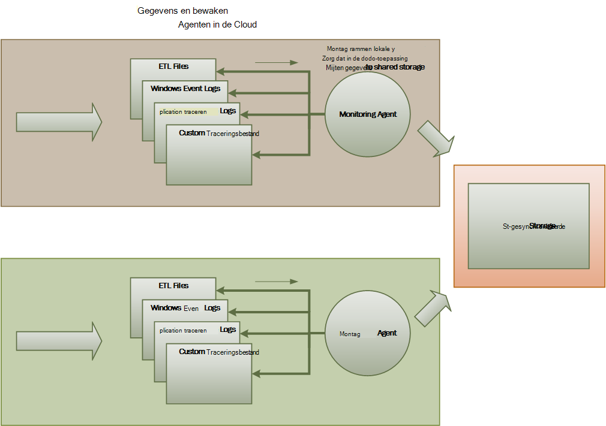
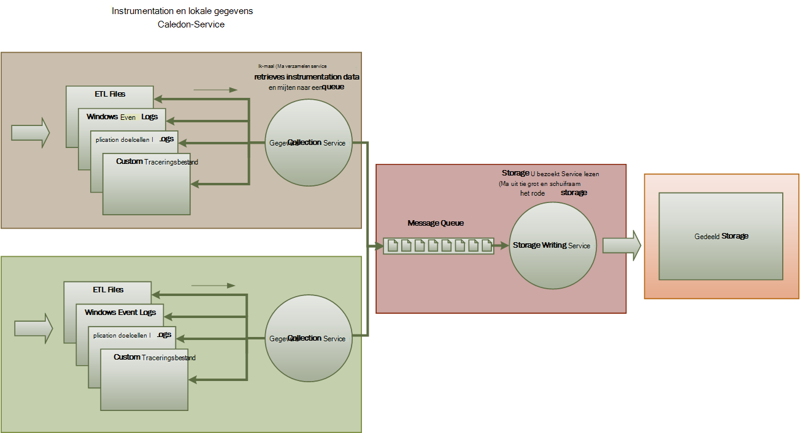
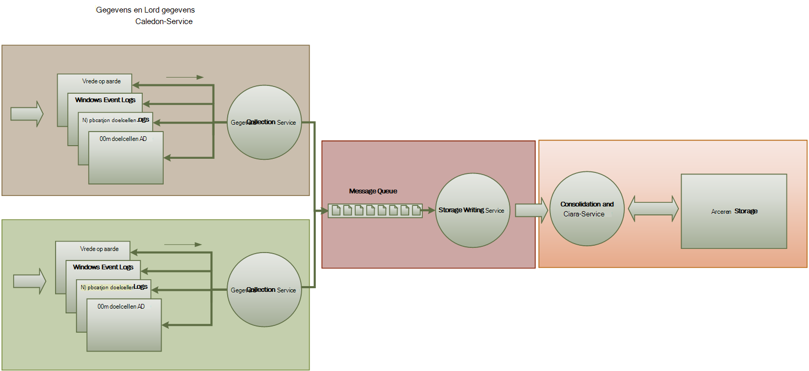

<properties
   pageTitle="Controle- en hulpprogramma's voor diagnose richtlijnen | Microsoft Azure"
   description="Aanbevolen procedures voor het controleren van gedistribueerde toepassingen in de cloud."
   services=""
   documentationCenter="na"
   authors="dragon119"
   manager="christb"
   editor=""
   tags=""/>

<tags
   ms.service="best-practice"
   ms.devlang="na"
   ms.topic="article"
   ms.tgt_pltfrm="na"
   ms.workload="na"
   ms.date="07/13/2016"
   ms.author="masashin"/>

# <a name="monitoring-and-diagnostics-guidance"></a>Controle- en hulpprogramma's voor diagnose richtlijnen

[AZURE.INCLUDE [pnp-header](../includes/guidance-pnp-header-include.md)]

## <a name="overview"></a>Overzicht
Gedistribueerde toepassingen en services worden uitgevoerd in de cloud zijn, naar hun aard, complexe onderdelen van de software waaruit veel bewegende onderdelen. In een productieomgeving is het belangrijk om te kunnen bijhouden van de manier waarop gebruikers gebruikmaken van uw systeem, doelcellen Resourcegebruik, en de servicestatus en de prestaties van uw systeem in het algemeen controleren. U kunt deze informatie gebruiken als diagnostische hulpmiddel opsporen en corrigeren van problemen, en ook plek potentiële problemen helpen en wilt voorkomen dat ze zich voordoet.

## <a name="monitoring-and-diagnostics-scenarios"></a>Controle- en hulpprogramma's voor diagnose scenario 's
U kunt monitoring een inzicht in de hoe goed een systeem functioneert. Cmdlets voor controle is een essentieel onderdeel van kwaliteit-van-service doelen onderhouden. Gebruikelijke scenario's voor het verzamelen van controlegegevens opnemen:

- Ervoor zorgen dat het systeem blijft staan in orde.
- Het bijhouden van de beschikbaarheid van het systeem en de elementen van ervan onderdeel.
- Goede prestaties om ervoor te zorgen dat de doorvoer van het systeem niet onverwacht als het volume van werk toeneemt afnemen wordt.
- Garanderen dat het systeem voldoet aan alle serviceovereenkomsten (Sla's) tot stand gebracht met klanten.
- De privacy en beveiliging van het systeem, gebruikers en hun gegevens beveiligen.
- Het bijhouden van de bewerkingen die zijn uitgevoerd ter controle- of regelgeving.
- De dagelijks gebruik van het systeem en ontdekken van trends die als zij niet bent bestemd voor problemen kunnen leiden cmdlets voor controle.
- Het bijhouden van problemen die, uit de eerste rapport via met analyse van de mogelijke oorzaken, rectificatie na een software-updates en implementatie optreden.
- Bewerkingen tracering en foutopsporing van softwareversies.

> [AZURE.NOTE] Deze lijst is niet bedoeld om te worden volledig. In dit document bevat informatie over deze scenario's als de meest voorkomende situaties voor de uitvoering van de cmdlets voor controle. Er kunnen zich anderen die minder gebruikelijk zijn of die specifiek zijn voor uw omgeving.

De volgende secties worden deze scenario's uitgebreider beschreven. De gegevens voor elk scenario wordt beschreven in de volgende indeling:

1. Een beknopt overzicht van het scenario
2. De normale vereisten van dit scenario
3. De onbewerkte gegevens die nodig is voor de ondersteuning van de scenario en mogelijke bronnen van deze gegevens
4. Hoe deze onbewerkte gegevens kan worden geanalyseerd en gecombineerd om te genereren zinvolle diagnostische gegevens

## <a name="health-monitoring"></a>Statuscontrole
Een systeem is correct als deze wordt uitgevoerd en kunnen verwerken van aanvragen. Het doel van de statuscontrole is een momentopname van de huidige status van het systeem genereren, zodat u controleren kunt of alle onderdelen van het systeem zijn werkt zoals verwacht.

### <a name="requirements-for-health-monitoring"></a>Vereisten voor statuscontrole
Een operator moet snel (binnen een paar seconden) worden gewaarschuwd als een willekeurig deel van het systeem wordt geacht beschadigd. De operator moet kunnen nagaan welke delen van het systeem zijn normaal werkt en welke onderdelen problemen ondervindt. Systeemstatus kan worden gemarkeerd via een systeem verkeer licht:

- Rode voor beschadigd (het systeem is gestopt)
- Geel voor gedeeltelijk orde (het systeem wordt uitgevoerd met verminderde functionaliteit)
- Groen voor volledig orde

Een volledig statuscontrole systeem kan een operator detailanalyse uitvoeren via het systeem om weer te geven van de status van subsystemen en onderdelen. Bijvoorbeeld als de algehele systeemprestaties wordt weergegeven als gedeeltelijk orde, moet de operator kunnen inzoomen en bepalen welke functionaliteit is momenteel niet beschikbaar.

### <a name="data-sources-instrumentation-and-data-collection-requirements"></a>Gegevensbronnen en instrumentation gegevensverzameling vereisten
De onbewerkte gegevens die nodig is voor de ondersteuning van statuscontrole kunnen worden gegenereerd als gevolg van:

- Tracering uitvoeren van gebruikersaanvragen. Deze informatie kan worden gebruikt om te bepalen welke aanvragen hebt voltooid, die is mislukt en hoe lang duurt van elk verzoek om een.
- Synthetische gebruiker bewaken. Dit proces simuleert de stappen die worden uitgevoerd door een gebruiker en een vooraf gedefinieerde reeks stappen volgt. De resultaten van elke stap moeten worden vastgelegd.
- Logboekregistratie uitzonderingen, fouten en waarschuwingen. Deze informatie kan worden vastgelegd grond instructies trace ingesloten in de toepassingscode, evenals de gebeurtenislogboeken van de services die het systeem verwijzingen op te halen.
- De status van een derde partij-services die wordt gebruikt voor controle. Deze controle kan het nodig zijn ophalen en parseren van systeemstatus-gegevens die deze services leveren. Deze informatie kan duren tal van indelingen.
- Eindpunt bewaken. Deze methode wordt beschreven in de sectie "Beschikbaarheid monitoring" uitgebreider.
- Het verzamelen van informatie over de prestaties, zoals achtergrond CPU-gebruik of o (inclusief netwerk)-activiteit.

### <a name="analyzing-health-data"></a>Servicestatus gegevens analyseren
De primaire focus van statuscontrole is snel wilt aangeven of het systeem wordt uitgevoerd. Warm analyse van de direct gegevens kunt geeft een waarschuwing als een kritiek onderdeel wordt aangetroffen als beschadigd. (Deze niet meer reageert een opeenvolgende reeks ping-opdrachten, bijvoorbeeld.) De operator kunt vervolgens de juiste corrigerende actie ondernemen.

Een geavanceerdere systeem, bevatten mogelijk een blog-element dat een koudwatersystemen analyse uit via de werkbelasting met recente en huidige. Een koudwatersystemen analyse kunt trends ontdekken en bepalen of het systeem kunnen niet beschadigd is of of het systeem moeten aanvullende informatie. In dit blog element moet worden op basis van kritieke prestatiegegevens, zoals:

- De frequentie van aanvragen die zijn gericht op elke service of subsysteem.
- De tijden antwoord van de volgende aanvragen.
- Het volume van de gegevens die doorloopt in- en afmelden bij elke service.

Als de waarde van een meting een gedefinieerde drempel overschrijdt, kan het systeem een melding in om in te schakelen van een operator of autoscaling (indien beschikbaar) naar de preventieve acties uitvoeren die moet worden gehandhaafd systeemstatus verhogen. Deze acties mogelijk gebruikmaakt van resources, opnieuw starten van een of meer services die zijn verbroken of lage prioriteit aanvragen toepast beperken toe te voegen.

## <a name="availability-monitoring"></a>Beschikbaarheid controleren
Een behoorlijk orde systeem is vereist dat de onderdelen, subsystemen waaruit het systeem en beschikbaar zijn. Beschikbaarheid controleren is verwant aan statuscontrole. Maar dat statuscontrole, vindt u onmiddellijk een overzicht van de huidige status van het systeem, beschikbaarheid controleren heeft betrekking op het bijhouden van de beschikbaarheid van het systeem en de bijbehorende onderdelen te genereren van statistieken over de beschikbaarheid van het systeem.

In veel systemen, zijn bepaalde onderdelen (zoals een database) geconfigureerd met ingebouwde redundantie toe te staan snelle failover in het geval van een ernstige fout of verbroken. In het ideale geval mag gebruikers geen Houd er rekening mee dat deze een fout is opgetreden. Maar uit een beschikbaarheid perspectief monitoring, dat nodig is voor het verzamelen van zoveel mogelijk informatie over dergelijke fouten de oorzaak en corrigerende maatregelen om te voorkomen dat ze terugkerend is.

De gegevens die nodig is voor het bijhouden van beschikbaarheid mogelijk hangt af van een aantal factoren lagere niveaus. Het is mogelijk dat veel van deze factoren specifiek zijn voor de toepassing, systeem en -omgeving. Een effectieve controle systeem wordt vastgelegd de van de beschikbaarheidsgegevens die overeenkomt met deze laag niveau factoren en aggregeert vervolgens deze zodat een algemene beschrijving van het systeem. Bijvoorbeeld in een e-commerce-systeem, de functionaliteit voor bedrijven waarmee een klant om opdrachten te plaatsen mogelijk hangt af van de bibliotheek waar Orderdetails worden opgeslagen en betaling dat de omgaat met de monetaire transacties voor betaalt voor deze orders. De beschikbaarheid van het gedeelte volgorde plaatsing van het systeem is dus een functie van de beschikbaarheid van de bibliotheek en het subsysteem betaling.

### <a name="requirements-for-availability-monitoring"></a>Vereisten voor beschikbaarheid controleren
Een operator moet ook kunnen bekijken van de historische beschikbaarheid van elke systeem en subsysteem en deze gegevens gebruiken om eventuele trends ontdekken die kan ertoe leiden dat een of meer subsystemen regelmatig mislukt. (Services start mislukt op een bepaald tijdstip die met piek verwerking uren overeenkomt?)

Een oplossing van een controle moet geven een onmiddellijke en historische weergave van de beschikbaarheid of elk subsysteem niet beschikbaar. Dit moet ook staat snel een operator waarschuwen wanneer een of meer services fail of wanneer gebruikers kunnen geen verbinding met services zijn. Dit is een kwestie van niet alleen elke service controleren, maar ook de acties die elke gebruiker wordt uitgevoerd als deze acties mislukt als zij proberen te communiceren met een service onderzoeken. Tot op zekere hoogte een mate van connectivity mislukt is normaal en mogelijk veroorzaakt door tijdelijk fouten. Maar het toe te staan dat het systeem die een waarschuwing voor het aantal ongunstige uitkomsten connectivity naar een opgegeven subsysteem die tijdens een bepaalde termijn optreden handig kan zijn.

### <a name="data-sources-instrumentation-and-data-collection-requirements"></a>Gegevensbronnen en instrumentation gegevensverzameling vereisten
Net als met statuscontrole, kunnen de onbewerkte gegevens die nodig is voor de ondersteuning van de beschikbaarheid van de cmdlets voor controle worden gegenereerd grond synthetische gebruiker controle en registratie van eventuele uitzonderingen, fouten en waarschuwingen die zich kunnen voordoen. Bovendien kunnen gegevens over de beschikbaarheid kan worden verkregen eindpunt cmdlets voor controle uitvoeren. De toepassing kan worden blootgesteld een of meer systeemstatus eindpunten, elke testen toegang tot een functionele gebied in het systeem. Het systeem van toezicht kan elk eindpunt ping volgens een gedefinieerde planning en de resultaten (slagen of mislukken) verzamelen.

Alle-outs, connectivity netwerkstoringen en verbinding nieuwe pogingen moeten worden opgenomen. Alle gegevens moeten worden tijdstempel.

<a name="analyzing-availability-data"></a>
### <a name="analyzing-availability-data"></a>Analyseren van gegevens over de beschikbaarheid
De gegevens moeten worden samengevoegd en verband ter ondersteuning van de volgende soorten analyse:

- De onmiddellijke beschikbaarheid van het systeem en subsystemen.
- De beschikbaarheid van tarieven van het systeem en subsystemen die is mislukt. In het ideale geval een operator moet kunnen fouten correlatie met specifieke activiteiten: Wat is er gebeurt wanneer het systeem is mislukt?
- Een historische weergave van fout bij tarieven van het systeem of een subsystemen over een opgegeven termijn, en de belasting op het systeem (aantal gebruikersaanvragen, bijvoorbeeld) wanneer er is een fout opgetreden.
- De redenen om het systeem of een subsystemen niet beschikbaar. Bijvoorbeeld de volgende redenen mogelijk zijn service niet wordt uitgevoerd, connectivity verloren, maar time-out en verbonden maar terugkerende fouten verbonden.

U kunt de beschikbaarheid van het percentage van een service berekenen gedurende een bepaalde periode met behulp van de volgende formule:

```
%Availability =  ((Total Time – Total Downtime) / Total Time ) * 100
```

Dit is handig voor SLA. ([SLA monitoring](#SLA-monitoring) is uitvoeriger verderop in deze richtlijnen.) De definitie van _downtime_ , is afhankelijk van de service. Visual Studio Team Services bouwen Service wordt bijvoorbeeld downtime gedefinieerd als de periode (totale samengevoegde minuten), waarin Service maken niet beschikbaar is. Minuten wordt beschouwd als niet beschikbaar als alle continue HTTP aanvragen voor Service maken door de klant geactiveerde bewerkingen overal in de minuut uit te voeren op in een foutcode resulteren of een antwoord geen retourneren.

## <a name="performance-monitoring"></a>Prestaties controleren
Als het systeem wordt geplaatst onder meer belasting (doordat de hoeveelheid gebruikers), wordt de grootte van de gegevenssets die deze gebruikerstoegang in omvang groeit en de mogelijkheid van mislukken van een of meer onderdelen waarschijnlijk meer geneigd. Vaak onderdeel mislukt voorafgegaan door de prestaties nadelig beïnvloeden. Als u zich kunt detecteren zoals verkleinen, kunt u ingrijpen proactief corrigerende.

Systeemprestaties wilt verbeteren, is afhankelijk van een aantal factoren. Elke factor wordt meestal gemeten in key performance indicators (KPI's), zoals het aantal databasetransacties per seconde of het volume van netwerkaanvragen die goed worden onderhouden in een opgegeven periode. Sommige van deze KPI's mogelijk beschikbaar zijn als specifieke performance-eenheden, dat anderen kunnen worden afgeleid van een combinatie van de doelstellingen.

> [AZURE.NOTE] Vaststellen slechte of goede prestaties is vereist dat u het niveau van prestaties waarop het systeem kunnen te weinig moet kennen. Hiervoor is vereist voor naleving van het systeem terwijl deze onder een typisch laden werkt en vastleggen van de gegevens voor elke KPI gedurende een periode. Dit mogelijk gebruikmaakt van het systeem onder een gesimuleerd laden in een testomgeving gebruikt en de juiste gegevens verzamelen voordat het systeem naar een productieomgeving wordt geïmplementeerd.

> U moet er ook voor zorgen dat prestaties ter controle niet weergegeven een last op het systeem wordt. U kunt mogelijk dynamisch aanpassen het detailniveau voor de gegevens die de prestaties bewaken proces worden verzameld.

### <a name="requirements-for-performance-monitoring"></a>Vereisten voor het controleren van de prestaties
Als u wilt onderzoeken systeemprestaties wilt verbeteren, moet een operator meestal voor informatie waarin bevat:

- Het antwoord eenheidstarieven voor aanvragen van gebruikers.
- Het aantal gelijktijdige aanvragen.
- Het volume van netwerkverkeer.
- De tarieven die aan welke business transacties zijn uitgevoerd.
- De gemiddelde verwerkingstijd voor aanvragen.

Het kan ook zijn handig om aan te bieden hulpmiddelen waarmee een operator om u te helpen plek correlatie, zoals:

- Het aantal gelijktijdige gebruikers versus verzoek latentie tijden (hoe lang het duurt om te beginnen met het verwerken van een aanvraag nadat de gebruiker heeft verzonden).
- Het aantal gelijktijdige gebruikers functie van de gemiddelde antwoord tijd (hoe lang het duurt om een verzoek om te voltooien nadat deze is gestart processing).
- Het volume van aanvragen versus het aantal verwerkingsfouten.

Samen met deze functionele informatie op hoog niveau moet een operator kunnen te verkrijgen van een gedetailleerd overzicht van de prestaties voor elk onderdeel in het systeem. Deze gegevens worden meestal geleverd door de van laag niveau prestatiemeteritems die, zoals het bijhouden van informatie:

- Geheugengebruik.
- Aantal threads.
- CPU-verwerkingstijd.
- Lengte van wachtrij aanvragen.
- Schijf of in een netwerk i/o-tarieven en fouten.
- Het aantal bytes dat geschreven of lezen.
- Indicatoren voor middleware, zoals wachtrijlengte.

Alle visualisaties moeten een operator om op te geven van een periode toestaan. De weergegeven gegevens mogelijk een momentopname van de huidige situatie en/of een historische weergave van de prestaties.

Een operator moet u mogelijk een melding op basis van een maateenheid voor de prestaties voor een opgegeven waarde gedurende een bepaald tijdsinterval verhogen.

### <a name="data-sources-instrumentation-and-data-collection-requirements"></a>Gegevensbronnen en instrumentation gegevensverzameling vereisten
U kunt op hoog niveau prestatiegegevens (doorvoer, aantal gelijktijdige gebruikers, het aantal zakelijke transacties, fout tarieven, enzovoort) door het controleren van de voortgang van gebruikers aanvragen terwijl ze binnenkomen en via het systeem verzamelen. Dit heeft betrekking op tracering instructies uit op de belangrijkste punten uit de toepassingscode, samen met informatie over tijdsinstellingen opnemen. Alle fouten, uitzonderingen en waarschuwingen moeten worden vastgelegd met voldoende gegevens voor het correleren ze met de aanvragen die ze hebben veroorzaakt. Het logboek Internet Information Services (IIS) is een andere handige bron.

Indien mogelijk moet u ook prestatiegegevens voor externe systemen die gebruikmaakt van de toepassing vastleggen. Deze externe systemen mogelijk hun eigen prestatie-items of andere functies bieden voor het aanvragen van prestatiegegevens. Als dit is niet mogelijk, record toegangsgegevens voor de begintijd en eindtijd van elk verzoek aan een extern systeem, samen met de status van de bewerking (success, mislukt of waarschuwing). Bijvoorbeeld, kunt u een aanpak stopwatch op tijd aanvragen: een timer starten wanneer het verzoek wordt gestart en stop daarna de timer wanneer de aanvraag is voltooid.

Het is mogelijk dat laag niveau prestatiegegevens voor afzonderlijke onderdelen in een systeem beschikbaar via de functies en services zoals Windows prestatie-items en Azure diagnostische gegevens.

### <a name="analyzing-performance-data"></a>Prestatiegegevens analyseren
Veel van de analyse-werk bestaat uit het aggregeren prestatiegegevens door gebruiker aanvraag met het type en/of het subsysteem of de service waarnaar u elk verzoek om een wordt gestuurd. Een voorbeeld van een gebruikersaanvraag is een item toevoegen aan een winkelwagen of afrekenen uitvoeren in een e-commerce-systeem.

Een andere algemene vereiste is prestatiegegevens in geselecteerde percentielen samenvatten. Een operator bepaalt bijvoorbeeld de tijden antwoord voor 99% van aanvragen, 95 procent van aanvragen en 70 procent van aanvragen. Er zijn mogelijk SLA doelen of andere doelstellingen voor elke percentiel ingesteld. De lopende resultaten moeten worden gerapporteerd nabije realtime om te helpen onmiddellijke problemen opsporen. De resultaten moeten ook de langere periode voor statistische doeleinden worden samengevoegd.

In het geval van latentieproblemen prestaties, moet een operator kunnen snel identificeren van de oorzaak van het knelpunt aan de hand van de latentie van elke stap die elk verzoek om een uitvoert. De prestatiegegevens moet daarom voorzien in een middelen moeten prestatiemetingen voor elke stap ze te moeten koppelen aan een specifiek verzoek.

Afhankelijk van de visualisatie vereisten, kan het handig zijn voor het genereren en bewaren van een gegevenskubus die weergaven van de onbewerkte gegevens bevat. Deze gegevenskubus kan toestaan complexe ad hoc-query's uitvoeren en analyse van de informatie over de prestaties.

## <a name="security-monitoring"></a>Beveiliging bewaken
Alle commerciële systemen die vertrouwelijke gegevens bevatten, moeten de structuur van een waardepapier implementeren. De complexiteit van de inrichting van de beveiliging is meestal een functie van de gevoeligheid van de gegevens. In een systeem dat, moeten gebruikers worden geverifieerd, moet u het volgende opneemt:

- Alle aanmeldingsproblemen pogingen, of ze mislukt of mislukt.
- Alle bewerkingen uitgevoerd door-- en de details van alle resources die zijn geopend door--een geverifieerde gebruiker.
- Wanneer een gebruiker een sessie beëindigen en meldt zich af.

Cmdlets voor controle mogelijk nagaan welke aanvallen op het systeem. Een groot aantal mislukte pogingen aanmeldingsproblemen kan bijvoorbeeld een aanval gewelddadige aangeven. Een onverwachte toename aanvragen mogelijk het resultaat van een gedistribueerde weigering-van-service (DDoS) aanval. U moet voorbereiden om te controleren van alle aanvragen voor alle resources ongeacht de bron van deze aanvragen. Een systeem waarop een beveiligingsprobleem aanmeldingsproblemen kan resources voor het externe netwerk per ongeluk blootgesteld zonder dat een gebruiker daadwerkelijk aanmelden.

### <a name="requirements-for-security-monitoring"></a>Vereisten voor het controleren van de beveiliging
De belangrijkste aspecten van beveiliging monitoring moeten snel een operator om te schakelen:

- Detecteren poging tot indringers met een niet-geverifieerde entiteit.
- Identificeer pogingen door entiteiten naar bewerkingen uitvoeren op gegevens waarvoor ze geen toegang is verleend.
- Bepalen of het systeem of een deel van het systeem, onder aanval van binnen of buiten. (Bijvoorbeeld een kwaadwillende geverifieerde gebruiker mogelijk aan het proberen om het systeem naar beneden weer te geven.)

Ter ondersteuning van deze vereisten is voldaan, moet een operator worden gewaarschuwd:

- Als één account herhaalde maakt kan niet aanmelden pogingen binnen een bepaalde termijn.
- Als een geverifieerde account herhaaldelijk probeert voor toegang tot een verboden resource gedurende een bepaalde periode.
- Als er een groot aantal niet-geverifieerde of onbevoegde aanvragen optreden gedurende een bepaalde periode.

De gegevens die afkomstig zijn van een operator moet het adres van de host van de bron voor elk verzoek om een opnemen. Als u problemen met de beveiliging zich regelmatig voordoen uit een bepaalde reeks adressen, kunt u deze hosts mogelijk geblokkeerd.

Een belangrijke rol bij het beheren van de beveiliging van een systeem wordt herkend snel acties die van het gebruikelijke patroon afwijken. Gegevens, zoals het aantal mislukte en/of succesvolle aanmeldingsaanvragen kan visueel worden weergegeven om te bepalen of er een Prikker in activiteit op een ongebruikelijke moment is. (Een voorbeeld van deze activiteit is gebruikers bij 3:00 AM aanmelden en een groot aantal bewerkingen uitvoeren wanneer hun werkdag op 9:00 AM begint). Deze informatie kan ook worden gebruikt om te configureren op tijd gebaseerde autoscaling. Als een operator neemt acht dat een groot aantal gebruikers regelmatig Meld u aan bij een bepaald tijdstip van de dag, de operator kan schikken starten extra verificatieservices om te verwerken van de hoeveelheid werk, en vervolgens deze aanvullende services afsluiten wanneer de piek is verstreken.

### <a name="data-sources-instrumentation-and-data-collection-requirements"></a>Gegevensbronnen en instrumentation gegevensverzameling vereisten
Beveiliging is een die omvat van alle aspecten van meest gedistribueerde systemen. De relevante gegevens is waarschijnlijk op meerdere punten in een systeem worden gegenereerd. U rekening moet houden gesteld door een aanpak beveiligingsinformatie en gebeurtenis Management (SIEM) als u wilt verzamelen die de beveiligingsinformatie die uit het gebeurtenissen die door de toepassing, netwerkapparatuur servers, firewalls, antivirussoftware en andere elementen preventie van onrechtmatige toegang resulteert.

Beveiliging voor controle kunt gegevens van de hulpmiddelen die geen deel uitmaken van uw toepassing opnemen. Deze hulpmiddelen kunnen hulpprogramma's waarmee scannen van poorten activiteiten op externe overheidsinstanties helpt of Netwerkfilters die detecteren pogingen naar niet-geverifieerde toegang krijgen tot uw toepassing en gegevens bevatten.

De verzamelde gegevens moet een beheerder die de aard van een aanval bepalen en de juiste tegenmaatregelen neemt inschakelen in alle gevallen.

### <a name="analyzing-security-data"></a>Beveiligingsgegevens analyseren
Een functie van beveiliging cmdlets voor controle is de verscheidenheid aan bronnen waaruit de gegevens zich voordoet. De verschillende indelingen en detailniveau vaak complexe analyse van de vastgelegde gegevens deze samen koppelen in een stroken thread van gegevens te vereisen. Naast de eenvoudigste dozen (zoals een groot aantal mislukte aanmeldingen of meerdere pogingen onbevoegde toegang tot kritieke bronnen krijgen detecteren), is het niet mogelijk om uit te voeren van een complexe geautomatiseerde gegevensverwerking beveiliging. In plaats daarvan het mogelijk beter te schrijven van deze gegevens, tijdstempel maar anders in de oorspronkelijke vorm, naar een veilige opslaglocatie toe te staan dat voor een expert handmatige analyse.

<a name="SLA-monitoring"></a>

## <a name="sla-monitoring"></a>SLA bewaken
Veel commerciële systemen die ondersteuning bieden voor vaste klanten maken garanties over de prestaties van het systeem in de vorm van serviceovereenkomsten. Sla's beschrijft komt erop neer dat een gedefinieerde hoeveelheid werk binnen een overeengekomen tijdsbestek en zonder te verliezen cruciale informatie kan worden verwerkt door het systeem. SLA monitoring heeft betrekking op ervoor te zorgen dat gemeten serviceovereenkomsten kunt voldoet aan het systeem.

> [AZURE.NOTE] SLA monitoring is verwant aan prestatiecontroles uit. Maar dat prestatiecontroles met ervoor te zorgen dat de systeem-functies _optimaal_betreft, SLA monitoring valt onder een contractuele geheimhoudingsplicht waarmee wordt gedefinieerd welke _optimaal_ daadwerkelijk betekent.

Sla's zijn vaak gedefinieerd met betrekking tot:

- Algemene beschikbaarheid van het systeem. Bijvoorbeeld: een organisatie mogelijk zeker dat het systeem wordt beschikbaar voor 99,9 procent van de tijd. Dit is gelijk aan niet meer dan 9 uur downtime per jaar of ongeveer 10 minuten per week.
- Operationele doorvoer. Dit aspect wordt vaak uitgedrukt als een of meer hoog – water markeringen, zoals garanderen dat het systeem kan maximaal 100.000 gelijktijdige aanvragen ondersteuning of 10.000 gelijktijdige business-transacties verwerken.
- Operationele antwoord tijd. Het systeem mogelijk ook zorg voor garanties met betrekking tot het tarief weer dat die worden verwerkt. Een voorbeeld is dat 99% van alle zakelijke transacties binnen 2 seconden ingedrukt eindigt en geen enkele transactie langer dan 10 seconden duurt.

> [AZURE.NOTE] Sommige opdrachten voor commerciële systems mogelijk ook serviceovereenkomsten voor klantondersteuning. Een voorbeeld is alle helpdesk-aanvragen wordt roepen een antwoord binnen 5 minuten en dat 99% van alle problemen volledig moet worden verzonden binnen 1 werkdag. Effectieve [aanpak](#issue-tracking) (verderop in deze sectie), is de sleutel aan de vergadering Sla's zoals de volgende.

### <a name="requirements-for-sla-monitoring"></a>Vereisten voor SLA bewaken
Op het hoogste niveau moet een operator kunnen om te bepalen in één oogopslag of het systeem aan de overeengekomen serviceovereenkomsten of niet voldoet. En als u niet de operator kan om minder pijl omlaag en de onderliggende factoren om te bepalen de redenen om schepen prestaties onderzoeken.

Normale belangrijke indicatoren die kunnen die visueel opnemen:

- Het percentage van de actieve tijdsduur van service.
- De toepassing doorvoer (gemeten geslaagde transacties en/of bewerkingen per seconde).
- Het aantal geslaagde/mislukte aanvragen.
- Het aantal toepassings- en fouten, uitzonderingen en waarschuwingen.

Alle deze indicatoren moet kunnen worden gefilterd op een opgegeven periode.

Een toepassing voor de cloud waarschijnlijk bestaat uit een aantal subsystemen en onderdelen. Een operator moet kunnen een hoog niveau indicator selecteren en ziet u hoe deze bestaat uit de status van de onderliggende elementen. Bijvoorbeeld als de beschikbaarheid van de algehele systeemprestaties onder een waarde niet is toegestaan valt, moet een operator kunnen inzoomen en bepalen welke elementen zijn die bijdragen aan deze fout.

> [AZURE.NOTE] Systeembeschikbaarheid moet zorgvuldig worden gedefinieerd. In een systeem met redundantie om ervoor te zorgen maximale beschikbaarheid afzonderlijke instanties van elementen mislukt mogelijk, maar het systeem functionele kunt blijven. Systeembeschikbaarheid zoals gepresenteerd door statuscontrole aangeven de statistische beschikbaarheid van elk element, en niet per se of het systeem dat is wel is gestopt. Bovendien kunnen fouten worden geïsoleerd. Dus zelfs als een specifieke systeem niet beschikbaar is, de rest van het systeem mogelijk blijven beschikbaar, hoewel u met de beperktere functionaliteit. (In een e-commerce-systeem, een fout in het systeem mogelijk voorkomen dat een klant orders, maar de klant mogelijk nog steeds bladeren in de productcatalogus.)

Voor melding doeleinden, moet het systeem kunnen verhogen van een gebeurtenis als een van de belangrijke indicatoren een bepaalde drempel overschrijdt. De details lagere niveaus van de verschillende factoren waaruit de hoog niveau indicator is beschikbaar als contextuele gegevens aan het waarschuwingsmethoden systeem.

### <a name="data-sources-instrumentation-and-data-collection-requirements"></a>Gegevensbronnen en instrumentation gegevensverzameling vereisten
De onbewerkte gegevens die nodig is voor de ondersteuning van SLA monitoring is vergelijkbaar met de onbewerkte gegevens die nodig is voor prestatiecontroles, samen met bepaalde aspecten van gezondheid en beschikbaarheid controleren. (Zie deze secties voor meer informatie.) U kunt deze gegevens door vastleggen:

- Uitvoering van eindpunt bewaken.
- Logboekregistratie uitzonderingen, fouten en waarschuwingen.
- De verwerking van gebruikersaanvragen aanwijzen.
- De beschikbaarheid van een derde partij-services die wordt gebruikt voor controle.
- Gebruik prestatiegegevens en items.

Alle gegevens moeten worden timed en tijdstempel.

### <a name="analyzing-sla-data"></a>SLA gegevens analyseren
De gegevens moeten worden samengevoegd om te genereren van een afbeelding van de algehele prestaties van het systeem. Geaggregeerde gegevens moet ook inzoomen om in te schakelen onderzoek van de prestaties van de onderliggende subsystemen ondersteunen. Bijvoorbeeld: u moet kunnen:

- Het totale aantal aanvragen van gebruikers berekenen gedurende een bepaalde periode en bepaal de geslaagde en mislukte frequentie van deze aanvragen.
- Combineert u de tijden antwoord van de gebruikersaanvragen voor het genereren van een algemeen overzicht van systeem antwoord tijden.
- De voortgang van aanvragen van gebruikers voor Splits op het moment algehele antwoord van een nieuw vergaderverzoek in de tijden antwoord van de afzonderlijke werkitems in die aanvraag analyseren.  
- Bepaal de algehele beschikbaarheid van het systeem als een percentage van de beschikbaarheid voor een bepaalde periode.
- De beschikbaarheid van de tijd percentage van de afzonderlijke onderdelen en -services analyseren in het systeem. Dit mogelijk gebruikmaakt van parseren van logboeken die externe services gegenereerd.

Veel commerciële systemen moeten zijn reële prestaties cijfers tegen overeengekomen serviceovereenkomsten rapporteren voor een bepaalde periode, meestal een maand. Deze informatie kan worden gebruikt voor het berekenen van tegoeden of andere vormen van aflossingen voor klanten als de serviceovereenkomsten tijdens deze periode is voldaan. U kunt de beschikbaarheid van een service berekenen met behulp van de methode beschreven in de sectie [gegevens over de beschikbaarheid analyseren](#analyzing-availability-data).

Interne doeleinden, een organisatie mogelijk ook bijhouden voor het aantal en het soort incidenten waardoor services mislukt. Leren hoe u snel deze problemen oplossen of verwijder deze volledig, helpen aan om de uitvaltijd en serviceovereenkomsten vergaderen.

## <a name="auditing"></a>Controle
Afhankelijk van de aard van de toepassing, is het mogelijk dat er een wettelijke of andere regelgeving die vereisten voor het controleren van gebruikers bewerkingen en opnemen van de toegang tot alle gegevens opgeven. Controle kan bewijzen dat klanten koppelingen voor specifieke aanvragen. Gewone gebruikers is een belangrijke factor in veel e-business-systemen bij het beheren van vertrouwensrelatie tussen een klant en de organisatie die verantwoordelijk is voor de toepassing of service.

### <a name="requirements-for-auditing"></a>Vereisten voor controle
Een analisten moet kunnen aanwijzen de volgorde van bewerkingen voor bedrijven waarmee gebruikers worden uitgevoerd, zodat u acties van gebruikers opnieuw kunt maken. Dit mogelijk nodig als een kwestie van de record, of als onderdeel van een forensisch onderzoek.

Controlegegevens is zeer gevoelige. Deze bevat gegevens waarmee de gebruikers van het systeem, samen met de taken die ze uitvoert waarschijnlijk. Daarom controlegegevens duurt waarschijnlijk de vorm van rapporten die alleen beschikbaar voor vertrouwde analisten zijn in plaats van een interactieve systeem die ondersteuning biedt voor inzoomen van grafische bewerkingen. Een analisten moet u mogelijk een bereik van rapporten genereren. Rapporten mogelijk bijvoorbeeld lijst van alle gebruikers activiteiten tijdens een opgegeven periode, Detailstijlen het overzicht van de activiteit voor één gebruiker of een lijst met de volgorde van bewerkingen uitgevoerd op een of meer resources.

### <a name="data-sources-instrumentation-and-data-collection-requirements"></a>Gegevensbronnen en instrumentation gegevensverzameling vereisten
De primaire informatiebronnen voor controle kunnen opnemen:

- De beveiligingssysteem dat gebruikersverificatie beheert.
- Logboeken voor het traceren die gebruikers actief opnemen.
- Beveiligingslogboeken die de voortgang alle herkenbare en identiteit netwerkaanvragen bijhouden.

De opmaak van de controlegegevens en de manier waarop deze zijn opgeslagen kan worden veroorzaakt door wettelijke vereisten. Bijvoorbeeld het niet mogelijk op te schonen van de gegevens op geen enkele manier. (Deze moet worden opgenomen in de oorspronkelijke indeling.) Toegang tot de bibliotheek waarin het gehouden moet worden beveiligd als u wilt voorkomen dat wordt geknoeid.

### <a name="analyzing-audit-data"></a>Audit gegevens analyseren
Een analisten moet steeds toegang tot de onbewerkte gegevens in zijn geheel, in de oorspronkelijke vorm. Naast de vereiste algemene controlerapporten genereren, worden de hulpmiddelen voor het analyseren van deze gegevens zullen naar verwachting worden gespecialiseerde extern gehouden van het systeem.

## <a name="usage-monitoring"></a>Gebruik bewaken
Gebruik voor controle wordt bijgehouden hoe de functies en de onderdelen van een toepassing worden gebruikt. Een operator kunt de verzamelde gegevens wilt gebruiken:

- Bepalen welke functies zijn intensief wordt gebruikt en alle mogelijke hotspots in het systeem. Intensief verkeer elementen nuttig functionele partitioneren of zelfs replicatie naar meer gelijkmatig bij het selectievakje laden. Een operator kunt ook deze informatie gebruiken om na te gaan welke functies worden zelden gebruikt en zijn mogelijk kandidaten voor buitengebruikstelling of vervangende tekst in toekomstige versies van het systeem.
- Informatie over de operationele gebeurtenissen van het systeem bij normaal gebruik aanvragen. U kunt bijvoorbeeld de statistische gegevens over het aantal transacties en het volume van klanten die verantwoordelijk voor deze zijn opnemen in een e-commerce-site. Deze informatie kan worden gebruikt voor het plannen van capaciteit als het aantal klanten in omvang groeit.
- Detecteren (mogelijk indirect) de tevredenheid van de gebruiker met de prestaties of de functionaliteit van het systeem. Bijvoorbeeld als een groot aantal klanten in een e-commerce-systeem regelmatig hun winkelwagentjes gewoon laten, dit mogelijk vanwege een probleem met de functionaliteit voor uitchecken.
- Genereer factureringsgegevens. Een commerciële toepassing of multitenant service mogelijke kosten klanten voor de resources die ze gebruiken.
- Quota afdwingen. Als een gebruiker in een multitenant systeem groter is dan hun betaalde quotum van het verwerken van tijd of resource gebruik gedurende een bepaalde periode, hun toegang kan worden beperkt of verwerking kan worden vertraagd.

### <a name="requirements-for-usage-monitoring"></a>Vereisten voor het gebruik controleren
Als u wilt onderzoeken systeemgebruik, moet een operator meestal voor informatie waarin bevat:

- Het aantal aanvragen die worden verwerkt door elke subsysteem en doorgestuurd naar elke resource.
- Het werk dat elke gebruiker wordt uitgevoerd.
- Het volume van gegevensopslag die elke gebruiker in beslag neemt.
- De resources die elke gebruiker toegang heeft tot.

Een operator moet ook kunnen grafieken genereren. Bijvoorbeeld: een grafiek de meest resource grote-gebruikers kan worden weergegeven of het meest toegankelijk systeemfuncties of resources.

### <a name="data-sources-instrumentation-and-data-collection-requirements"></a>Gegevensbronnen en instrumentation gegevensverzameling vereisten
Gebruik bijhouden kan worden uitgevoerd op een relatief hoog niveau. Dit kan Opmerking de begin- en eindtijden van elke aanvraag kunt invullen en de aard van de aanvraag (lezen, schrijven, enzovoort, afhankelijk van de desbetreffende resource). U vindt deze informatie door:

- Tracering gebruikersactiviteit.
- Prestatiemeteritems die het gebruik voor elke resource meten vastleggen.
- Cmdlets voor controle het verbruik van middelen door elke gebruiker.

Voor meting doeleinden, moet u ook mogelijk om aan te geven welke gebruikers zijn die verantwoordelijk is voor de uitvoering van welke bewerkingen en de resources die gebruikmaken van deze bewerkingen. De verzamelde gegevens moet worden gedetailleerde genoeg om in te schakelen nauwkeurige facturering.

<a name="issue-tracking"></a>
## <a name="issue-tracking"></a>Actie-items bijhouden
Klanten en andere gebruikers mogelijk problemen rapporteren als onverwachte gebeurtenissen of gedrag wordt weergegeven in het systeem. Bijhouden heeft betrekking op deze problemen beheren en klanten van mogelijke oplossingen als zodanig koppelt inspanningen voor het oplossen van problemen met onderliggende in het systeem.

### <a name="requirements-for-issue-tracking"></a>Vereisten voor het bijhouden van kwesties
Operatoren uitvoeren vaak bijhouden met behulp van een afzonderlijk systeem waarmee ze de details van problemen wilt opnemen en rapport die gebruikers melden. Deze gegevens kunnen opnemen van de taken die de gebruiker heeft geprobeerd om uit te voeren, symptomen van het probleem, de volgorde van gebeurtenissen, en fout of waarschuwingsberichten die zijn verleend.

### <a name="data-sources-instrumentation-and-data-collection-requirements"></a>Gegevensbronnen en instrumentation gegevensverzameling vereisten
De eerste gegevensbron voor actie-items gegevens is de gebruiker die het probleem in eerste instantie gerapporteerd. De gebruiker mogelijk extra om gegevens te leveren, zoals:

- Een crashdump (als de toepassing een onderdeel dat wordt uitgevoerd op het bureaublad van de gebruiker bevat).
- Een momentopname scherm.
- De datum en tijd waarop de fout is opgetreden, samen met andere milieu gegevens zoals de locatie van de gebruiker.

Deze informatie kan worden gebruikt voor de foutopsporing inspanning en samen te stellen van een achterstallig werk voor toekomstige versies van de software.

### <a name="analyzing-issue-tracking-data"></a>Actie-items gegevens analyseren
Verschillende gebruikers mogelijk hetzelfde probleem rapporteren. Het systeem actie-items moet algemene rapporten koppelen.

De voortgang van de foutopsporing inspanning moet worden geregistreerd ten opzichte van elk probleemrapport. Als het probleem is opgelost, kan de klant worden geïnformeerd over de oplossing.

Als een gebruiker een probleem met een bekende oplossing in het systeem actie-items rapporten, kunnen de operator op de hoogte brengt van de gebruiker van de oplossing direct moet mogelijk.

## <a name="tracing-operations-and-debugging-software-releases"></a>Bewerkingen tracering en foutopsporing van softwareversies
Wanneer een gebruiker een probleem meldt, is de gebruiker vaak alleen op de hoogte van de directe gevolgen die er hun activiteiten. De gebruiker kan alleen rapporteren de resultaten van hun eigen ervaring terug naar een operator die verantwoordelijk is voor het onderhoud aan het systeem. Deze ervaringen zijn meestal net een zichtbare symptoom van een of meer van de fundamentele problemen. In veel gevallen moet een analisten graven tot en met het overzicht van de onderliggende bewerkingen tot stand brengen van de oorzaak van het probleem. Dit proces wordt genoemd _hoofdsite ertoe leiden dat analyse_.

> [AZURE.NOTE] Hoofdmap oorzaak analyse mogelijk efficiëntie in het ontwerp van een toepassing schuiven. In deze situaties, is het mogelijk zijn voor de desbetreffende elementen Herschrijf en implementeren als onderdeel van een latere versie. Dit proces is vereist dat u daarbij besturingselement, en de bijgewerkte onderdelen nauw moeten worden gecontroleerd.

### <a name="requirements-for-tracing-and-debugging"></a>Vereisten voor tracering en foutopsporing
Voor het traceren onverwachte gebeurtenissen en andere problemen voordoen tijdens, is dit essentieel dat de controlegegevens bevat voldoende informatie een analisten traceren terug naar de oorsprong van deze problemen inschakelen en maakt u de volgorde van gebeurtenissen die zijn aangebracht. Deze informatie moet voldoende zijn voor een analisten naar een diagnose stellen bij de oorzaak van sprake is van problemen. Een ontwikkelaar kunt Breng de gewenste wijzigingen aan te voorkomen dat ze terugkeren.

### <a name="data-sources-instrumentation-and-data-collection-requirements"></a>Gegevensbronnen en instrumentation gegevensverzameling vereisten
Problemen oplossen, kan de tracering alle methoden (en hun parameters) als onderdeel van een bewerking aangeroepen voor het maken van een structuur dat de logische stroom via het systeem afbeeldt wanneer een klant een specifieke aanvraag indient betrekking hebben. Uitzonderingen en waarschuwingen die het systeem wordt gegenereerd als gevolg van deze overdracht moeten worden vastgelegd en worden vastgelegd.

Om te ondersteunen voor foutopsporing in, kan worden gegeven haken waarmee een operator om vast te leggen statusinformatie op belangrijke punten in het systeem. Of het systeem bieden gedetailleerde stapsgewijze informatie als de voortgang van geselecteerde bewerkingen. Vastgelegde gegevens op dit niveau een extra belasting op het systeem kunnen opleggen en moet een tijdelijke proces. Een operator gebruikt dit proces, vooral als een hoogst ongebruikelijk reeks gebeurtenissen plaatsvindt en is moeilijk te repliceren, of wanneer u een nieuwe versie van een of meer elementen in een systeem vereist een zorgvuldige controle om ervoor te zorgen dat de functie elementen zoals verwacht.

## <a name="the-monitoring-and-diagnostics-pipeline"></a>De pijplijn voor controle en diagnostische gegevens
Een grootschalige gedistribueerd systeem Monitoring vormt een belangrijke uitdaging. De scenario's beschreven in de vorige sectie niet per se beschouwd in moeten worden geïsoleerd. Er is waarschijnlijk een aanzienlijk overlapping in de controle en diagnostische gegevens die nodig is voor elke situatie, hoewel deze gegevens eerst mogelijk worden verwerkt en gepresenteerd op verschillende manieren. Daarom moet u een overzichtsweergave van de cmdlets voor controle en diagnostische gegevens uitvoeren.

U kunt de volledige controle en hulpprogramma's voor diagnose proces voorzien als een pijplijn die bestaat uit de fasen weergegeven in de afbeelding 1.


_Afbeelding 1. De fasen in de pijplijn voor controle en diagnostische gegevens_

Afbeelding 1 wordt gemarkeerd hoe de gegevens voor controle en diagnostische gegevens kunnen afkomstig zijn uit allerlei gegevensbronnen. De fasen instrumentation en siteverzameling betrekking hebben op de bronnen van waar de gegevens worden opgenomen moeten, identificeren bepalen welke gegevens om vast te leggen, hoe u deze vastleggen en hoe u deze gegevens zo opmaken dat deze eenvoudig kan worden onderzocht. De analyse/diagnose fase duurt de onbewerkte gegevens en wordt deze gebruikt om te genereren nuttige informatie die een operator gebruiken kunt om te bepalen de status van het systeem. De operator kunt deze gegevens gebruiken om beslissingen nemen over mogelijke acties uitvoeren en vervolgens de resultaten weer in de fasen instrumentation en siteverzameling-feed. De fase visualisatie/waarschuwingen fase geeft verbruikbare overzicht van de systeemstatus. Het kan weergegeven in de nabije realtime met behulp van een reeks van dashboards. En deze kunt genereren, rapporten, grafieken en diagrammen op te geven van een historische weergave van de gegevens die u kunnen helpen langdurige trends identificeren. Als informatie geeft aan dat een KPI is waarschijnlijk aanvaardbaar grenzen overschrijdt, kan deze fase een melding naar een operator ook activeren. In sommige gevallen kan een waarschuwing ook worden gebruikt voor het starten van een geautomatiseerde proces dat probeert corrigerende acties, zoals autoscaling te voeren.

Houd er rekening mee dat deze stappen een doorlopend proces waar de fasen zijn er voor parallel vormen. Alle fasen moet in het ideale geval dynamisch configureerbare. Bij sommige punten, met name wanneer een nieuw is geïmplementeerd of er zijn problemen, kan het nodig zijn voor het verzamelen van uitgebreide gegevens regelmatig meer. Op andere momenten, moet het mogelijk zijn om te keren naar het vastleggen van aan alle noodzakelijke informatie om te bevestigen dat het systeem goed werkt.

Daarnaast kunnen het hele controle proces overwegen een live, continue oplossing die is onderhevig aan instellen en verbeteringen op grond van feedback. U kunt bijvoorbeeld met veel factoren om te bepalen de systeemstatus meten beginnen. Analyse na verloop van tijd kan leiden tot een verfijning terwijl u maatregelen die niet relevant zijn negeren, zodat u nog nauwkeuriger concentreren op de gegevens die u nodig hebt tijdens het achtergrondgeluid te minimaliseren.

## <a name="sources-of-monitoring-and-diagnostic-data"></a>Bronnen van controleren en diagnostische gegevens
De informatie die de controle proces gebruikt kan afkomstig zijn uit verschillende bronnen, zoals in de afbeelding 1. Op het toepassingsniveau van de, wordt informatie opgehaald uit de logboeken voor het traceren opgenomen in de code van het systeem. Ontwikkelaars moeten een standaard methode voor het bijhouden van de stroom van besturingselement via hun code, volgen. Een vermelding met een methode kunt bijvoorbeeld een bericht traceren waarmee de naam van de methode, de huidige tijd, de waarde van elke parameter en andere belangrijke informatie te verzenden. Opname van de tijden begin en einde kan ook nuttig.

U moet Meld u aan alle uitzonderingen en waarschuwingen en zorg ervoor dat u een volledige trace van een geneste uitzonderingen en waarschuwingen voor bewaren. In het ideale geval moet u ook informatie die aangeeft van de gebruiker van wie de code, samen met de correlatie-informatie activiteit (voor het bijhouden van aanvragen terwijl ze via het systeem doorgeven) wordt uitgevoerd vastleggen. En u zich moet aanmelden met pogingen voor toegang tot alle resources zoals berichtenwachtrijen, databases, bestanden en andere afhankelijke services. Deze informatie kan worden gebruikt voor meting en controle van toepassing.

Veel toepassingen maken gebruik van bibliotheken en kaders om uit te voeren algemene taken zoals toegang zoekt tot een gegevensopslag of communiceren via een netwerk. Het is mogelijk dat deze kaders configureerbare hun eigen doelcellen berichten en onbewerkte diagnostische informatie, zoals transactie tarieven en gegevens overdracht geslaagde en mislukte op te geven.

> [AZURE.NOTE] Veel moderne kaders publiceren automatisch prestaties en doelcellen gebeurtenissen. Deze gegevens vastleggen is gewoon een kwestie van de mogelijkheid om te halen en opslaan waar deze kan worden verwerkt en geanalyseerd.

Het besturingssysteem waarop de toepassing wordt uitgevoerd, kan een bron van laag niveau algemene informatie, zoals prestatiemeteritems die i/o-tarieven, geheugengebruik en CPU-gebruik aangeven zijn. Besturingssysteemfouten (zoals de kan niet correct geopend van een bestand) kunnen ook worden vermeld.

U moet ook rekening houden met de onderliggende infrastructuur en onderdelen waarop uw systeem wordt uitgevoerd. Virtuele machines, virtuele netwerken en opslagservices kunnen worden bronnen van belangrijke infrastructuur niveau prestatie-items en andere diagnostische gegevens.

Als uw toepassing gebruikmaakt van andere externe services, zoals een webserver of database management system, kunnen deze services hun eigen doelcellen informatie, logboeken en prestatiemeteritems publiceren. Voorbeelden hiervan zijn SQL Server dynamische Management weergaven voor het bijhouden van bewerkingen uitgevoerd op een SQL Server-database en IIS doelcellen logboeken voor het opnemen van aanvragen voor een webserver.

Terwijl de onderdelen van een systeem zijn gewijzigd en nieuwe versies zijn geïmplementeerd, is het is belangrijk moeten kunnen problemen met het kenmerk, gebeurtenissen en maatstelsel met elke versie. Deze gegevens moet worden gekoppeld terug naar de pijplijn release zodat problemen met een specifieke versie van een onderdeel kunnen worden bijgehouden snel en verholpen.

Beveiligingskwesties kunnen optreden op een willekeurige plaats in het systeem. Bijvoorbeeld: een gebruiker probeert aan te melden met een ongeldige gebruikersnaam of wachtwoord. Een geverifieerde gebruiker willen onbevoegde toegang tot een bron aanvragen. Of een gebruiker kan opgeven een ongeldige of verouderde sleutel om versleutelde gegevens weer te geven. Beveiligingsinformatie voor geslaagde en beschadigde aanvragen, moet altijd worden vastgelegd.

De sectie [voor het opzetten van een toepassing](#instrumenting-an-application) bevat meer informatie vinden van de informatie die u moet vastleggen. Maar u kunt verschillende strategieën gebruiken om deze informatie te verzamelen:

- **Toepassing/systeem bewaken**. Deze strategie maakt gebruik van interne bronnen binnen de toepassing, toepassingskaders, besturingssysteem en infrastructuur. De toepassingscode kunt genereren een eigen gegevens op aantal aanzienlijke punten tijdens de levenscyclus van een clientaanvraag bewaken. De toepassing kunt tracering-instructies die selectief mogelijk worden ingeschakeld of uitgeschakeld omstandigheden dicteren opnemen. Het is ook mogelijk naar diagnostische gegevens dynamisch invoeren met behulp van een kader diagnostische gegevens. Deze kaders bevatten meestal invoegtoepassingen die u kunt toevoegen aan verschillende instrumentation punten in uw code en doelcellen gegevens vastleggen op deze punten.

    Bovendien kan uw code en/of de onderliggende infrastructuur gebeurtenissen op kritieke punten verhogen. Cmdlets voor controle agenten die zijn geconfigureerd voor het afluisteren voor deze gebeurtenissen kunt de gebeurtenisgegevens vastleggen.

- **Werkelijke gebruiker bewaken**. Deze methode de interactie tussen een gebruiker en de toepassing records en neemt acht de stroom van elke vergaderverzoeken en antwoorden. Deze informatie kan een twee in drieën gevouwen doel hebben: dit kan worden gebruikt voor het gebruik meting door elke gebruiker en deze kan worden gebruikt om te bepalen of gebruikers een geschikte kwaliteit van service (bijvoorbeeld snel antwoord tijden, lage latentie en minimale fouten) zijn ontvangen. U kunt de opgenomen gegevens gebieden problematisch waar er meestal optreden vast te stellen. U kunt de gegevens ook gebruiken om elementen te identificeren waar het systeem wordt vertraagd, mogelijk vanwege hotspots in de toepassing of een andere vorm van knelpunt. Als u deze methode zorgvuldig implementeert, kunt deze mogelijk opnieuw maken gebruikers loopt via de toepassing voor foutopsporing en testdoeleinden.

    > [AZURE.IMPORTANT] U kunt de gegevens die wordt vastgelegd door echte gebruikers om te worden zeer gevoelige omdat deze, vertrouwelijke gegevens bevatten mogelijk controleren. Als u opgenomen gegevens opslaat, moet u deze veilig opslaan. Als u gebruiken voor het voor de prestaties bewaken of foutopsporing wilt, het verwijderen van alle persoonlijke gegevens eerst.

- **Synthetische gebruiker bewaken**. In deze benadering schrijft u uw eigen testclient die een gebruiker simuleert en kunt u een configureerbare maar typische reeks bewerkingen uitvoeren. U kunt de prestaties van de testclient om te bepalen de status van het systeem. U kunt ook meerdere exemplaren van de testclient gebruiken als onderdeel van een bewerking laden testen tot stand brengen van hoe het systeem onder belasting moet reageren en wat voor uitvoer cmdlets voor controle wordt gegenereerd deze voorwaarden wordt voldaan.

    > [AZURE.NOTE] U kunt implementeren reële en synthetische gebruiker bewaken met behulp van de code die wordt getraceerd en tijden de uitvoering van de methode oproepen en andere belangrijke onderdelen van een toepassing.

- **Profiel**. Deze methode is hoofdzakelijk gericht op controleren en prestaties verbeteren. In plaats van op het functionele niveau van de reële en synthetische gebruiker monitoring besturingsomgeving, deze gegevens worden vastgelegd lager niveau als de toepassing wordt uitgevoerd. U kunt implementeren profielen met behulp van periodieke steekproeven van de status van een toepassing (bepalen welk deel van een code die de toepassing wordt uitgevoerd op een bepaald moment in tijd). U kunt ook instrumentatie die wordt sondes ingevoegd in de code aan belangrijke junctures (zoals het begin en einde van een methode-oproep) en welke methoden zijn gestart, klikt u op welk tijdstip, en hoe lang duurde van elk gesprek records gebruiken. Vervolgens kunt u deze gegevens om te bepalen welke delen van de toepassing kunnen ertoe leiden dat prestatieproblemen analyseren.

- **Eindpunt bewaken**. Deze methode gebruikt een of meer diagnostische eindpunten die de toepassing beschikbaar worden gesteld specifiek om in te schakelen voor controle. Een eindpunt verschaft toegang tot de toepassingscode en informatie over de status van het systeem kan retourneren. Verschillende eindpunten kunnen richten op verschillende aspecten van de functionaliteit. U kunt uw eigen hulpprogramma's voor diagnose-client die periodieke aanvragen naar deze eindpunten schrijven en opnemen van de antwoorden. Deze methode is meer beschreven in de [Systeemstatus eindpunt Monitoring patroon](https://msdn.microsoft.com/library/dn589789.aspx) op de website van Microsoft.

Voor maximale, moet u een combinatie van de volgende manieren gebruiken.

<a name="instrumenting-an-application"></a>
## <a name="instrumenting-an-application"></a>Een toepassing implementeren
Instrumentation is een belangrijk onderdeel van het proces controleren. U kunt zinvolle beslissingen nemen over de prestaties en de status van een systeem alleen als u de gegevens waarmee u kunt deze beslissingen nemen voor het eerst opnemen. De informatie die u verzamelen met behulp van instrumentation moet voldoende zodat u kunt de prestaties te beoordelen, diagnosticeren en beslissingen nemen zonder dat u aan te melden naar een externe productieomgeving om uit te voeren tracering (en foutopsporing) handmatig. Gegevens omvat meestal aan de doelstellingen en informatie die geschreven naar Logboeken voor het traceren.

De inhoud van een logboek doelcellen is het resultaat van tekstgegevens die geschreven door de toepassing of binaire gegevens die zijn gemaakt als het resultaat van een traceergebeurtenis (als de toepassing via Event Tracing voor Windows--ETW). Ze kunnen ook worden gegenereerd uit systeemlogboeken die gebeurtenissen die voortvloeien uit onderdelen van de infrastructuur, zoals een webserver opnemen. Tekstuele logboekberichten vaak zijn ontworpen om u te worden leesbare, maar ze ook moeten worden geschreven in een indeling waarmee een geautomatiseerd systeem ze gemakkelijk parseren.

U moet ook Logboeken categoriseren. Niet alle traceergegevens schrijven voor een eenmalige aanmelding, maar afzonderlijke Logboeken gebruiken om het opnemen van de trace-uitvoer van verschillende operationele aspecten van het systeem. U kunt berichten in het logboek snel filteren door te lezen van de juiste log in plaats van dat u moet het verwerken van één lange bestand. Nooit schrijven gegevens verschillende beveiligingsvereisten die zijn (zoals controlegegevens en gegevens foutopsporing) moeten hetzelfde logboek.

> [AZURE.NOTE] Een logboek kan worden uitgevoerd als een bestand in het bestandssysteem of deze in een andere indeling, zoals een blob in blobopslag kan worden gehouden. Logboekgegevens kan ook worden gehouden in meer gestructureerde opslag, zoals rijen in een tabel.

Aan de doelstellingen in het algemeen is een maateenheid of de telling van bepaalde aspecten of de resource in het systeem op een bepaald tijdstip, met een of meer bijbehorende labels of afmetingen (ook wel een _steekproef_genoemd). Een enkel exemplaar van een meting is meestal niet handig in moeten worden geïsoleerd. Aan de doelstellingen moet in plaats daarvan na verloop van tijd worden vastgelegd. Het probleem met de belangrijkste overwegingen welke aan de doelstellingen u moet opnemen is en hoe vaak. Gegevens aan de doelstellingen te vaak genereren kan een aanzienlijke extra belasting op het systeem, opleggen, terwijl het vastleggen van de doelstellingen zelden kan ertoe leiden dat u kunt de omstandigheden mist die tot gevolg heeft een belangrijke gebeurtenis. De overwegingen varieert metrisch metrisch. Bijvoorbeeld CPU-gebruik op een server aanzienlijk uit de tweede kan variëren naar tweede, maar intensief gebruik een probleem wordt alleen als het lange levensduur over een aantal minuten.

<a name="information-for-correlating-data"></a>
### <a name="information-for-correlating-data"></a>Informatie voor het correleren van gegevens
U kunt eenvoudig individuele systeem niveau prestatiemeteritems controleren, aan de doelstellingen voor resources vastleggen en toepassing doelcellen gegevens ophalen uit verschillende logboekbestanden. Maar sommige soorten monitoring vereisen het podium analyse en diagnostische gegevens in de pijplijn controleren om te relateren van de gegevens die zijn opgehaald uit verschillende bronnen. Deze gegevens kan meerdere formulieren duren in de onbewerkte gegevens en de analysebewerking moet beschikken over voldoende gegevens kunnen deze verschillende vormen toewijzen. Bijvoorbeeld, op het niveau van framework, kan een taak worden geïdentificeerd door een thread-ID. Binnen een toepassing, het werk dat dezelfde mogelijk is gekoppeld aan de gebruikers-ID voor de gebruiker die deze taak uitvoert.

Er is ook waarschijnlijk niet toewijzing van een 1:1 tussen threads en aanvragen van gebruikers, omdat asynchrone bewerkingen mogelijk opnieuw gebruiken de dezelfde threads om te worden bewerkingen uitgevoerd namens meer dan één gebruiker. Als u wilt bemoeilijken zaken verder, één aanvraag mogelijk worden verwerkt door meer dan één thread als execution loopt via het systeem. Koppel indien mogelijk elk verzoek om met een unieke activiteit-ID die via het systeem wordt doorgegeven als onderdeel van de context van de aanvraag. (De methode voor het genereren en activiteit ID's op te nemen in de trace-informatie is afhankelijk van de technologie die wordt gebruikt voor het vastleggen van de gegevens doelcellen.)

Alle controlegegevens moet tijdstempel op dezelfde manier. Record voor de consistentie alle datums en tijden met behulp van de Coordinated Universal Time. Hierdoor kunt u eenvoudiger doelcellen reeksen van gebeurtenissen.

> [AZURE.NOTE] Computers in de verschillende tijdzones en netwerken kunnen niet worden gesynchroniseerd. Niet, hangt af van de tijdstempels alleen gebruikt voor het correleren van gegevens die zich uitstrekt over meerdere computers.

### <a name="information-to-include-in-the-instrumentation-data"></a>Informatie in de gegevens wilt opnemen
Houd rekening met de volgende punten wanneer u bij het bepalen van welke u nodig hebt voor het verzamelen van gegevens:

- Zorg ervoor dat informatie over vastgelegd door doelcellen gebeurtenissen machine en leesbaar is. Duidelijk omschreven schema's maken voor deze informatie te vergemakkelijken geautomatiseerde gegevensverwerking log in systemen en een projectduur naar bewerkingen en personeel lezen van de logboeken engineering vast. Milieu-informatie, zoals de implementatieomgeving, de computer waarop het proces wordt uitgevoerd, de details van het proces en de call-stack opnemen.  
- Inschakelen profielen alleen indien nodig, omdat dit een belangrijke realiseren op het systeem kunt leggen. Profielen met behulp van instrumentation records een gebeurtenis (zoals een oproep methode) telkens bij die het zich daadwerkelijk voordoet, dat alleen geselecteerde records meting voor gebeurtenissen. De selectie kan zijn op basis van tijd (één keer elke *n* seconden), of frequentie gebaseerde (zodra elke *n* -verzoeken). Als zeer vaak gebeurtenissen profiel door instrumentation mogelijk leiden tot te veel van een last en zelf algehele prestaties beïnvloeden. In dit geval de methode steekproeven mogelijk beter. Echter als de frequentie van gebeurtenissen laag is, steekproeven mogelijk mist ze. In dit geval mogelijk instrumentation de betere benadering.
- Bieden voldoende context om een ontwikkelaars of beheerder om te bepalen de bron van elk verzoek om te schakelen. Hiermee kan sommige soort activiteit-ID waarmee een specifiek exemplaar van een nieuw vergaderverzoek bevatten. Deze bevatten mogelijk ook informatie die kan worden gebruikt om te relateren van deze activiteit met de rekenkundige werkzaamheden en de resources die worden gebruikt. Houd er rekening mee dat dit te verwerken en machine grenzen mogelijk cross. Voor meting, moet de context ook opnemen (direct of indirect via andere verband gegevens) een verwijzing naar de klant die het verzoek om te worden aangebracht veroorzaakt. Deze context bevat nuttige informatie over de status van de toepassing op het moment waarop de controlegegevens is opgenomen.
- Alle aanvragen en de locaties of de regio's waarvan deze aanvragen worden gedaan opnemen. Deze informatie kunt helpen bij het bepalen of er een locatie / regiospecifieke hotspots zijn. Deze informatie soms ook is handig bij het bepalen of u opnieuw partitioneren van een toepassing of de gegevens die worden gebruikt.
- Opnemen en de details van uitzonderingen zorgvuldig vastleggen. Kritieke foutopsporingsgegevens zijn vaak verloren gaat als de afhandeling van slechte uitzonderingen. De volledige details van uitzonderingen die de toepassing, zoals binnenste uitzonderingen de eventuele uitzonderingen en andere contextinformatie vastleggen. De call-stack indien mogelijk opnemen.
- Eenduidig in de gegevens die de verschillende elementen van uw toepassing vastlegging, omdat dit helpen kan bij het analyseren van gebeurtenissen en ze correleren met aanvragen van gebruikers. Houd rekening met het pakket van een volledig en configureerbare logboekregistratie gebruiken om informatie te verzamelen, in plaats van de afhankelijk van ontwikkelaars weergavekolommen gelden dezelfde aanpak als ze verschillende delen van het systeem implementeert. Verzamel gegevens van prestatie-items, zoals het volume van I/O wordt uitgevoerd, netwerkgebruik, het aantal aanvragen, geheugen en CPU-gebruik. Sommige infrastructuurservices mogelijk hun eigen specifieke items, zoals het aantal verbindingen met een database, het tarief weer dat waarop transacties worden uitgevoerd en het aantal transacties die slagen of mislukken bieden. Toepassingen kunnen ook hun eigen specifieke items definiëren.
- Meld u aan alle aanroepen van externe services, zoals databases, webservices of andere services systeem niveau die deel van de infrastructuur uitmaken. Informatie over de tijd die u hebt gemaakt om uit te voeren van elk gesprek, het opnemen en het slagen of mislukken van het gesprek. Informatie over alle herhalingspogingen en fouten voor tijdelijke fouten die optreden indien mogelijk vastleggen.

### <a name="ensuring-compatibility-with-telemetry-systems"></a>Ervoor zorgen dat de compatibiliteit met telemetrielogboek-systemen
In veel gevallen wordt de informatie die instrumentation oplevert gegenereerd als een reeks gebeurtenissen en doorgegeven aan een aparte telemetrielogboek systeem voor de verwerking en analyse. Een telemetrielogboek-systeem is meestal onafhankelijk van alle specifieke toepassing en -technologieën, maar deze informatie aan het volgen van een specifieke notatie die wordt gewoonlijk gedefinieerd door een schema verwacht. Het schema geeft effectief een nieuw contract die bepaalt welke gegevensvelden en de typen die het systeem telemetrielogboek kunt nemen. Het schema moet worden algemene om toe te staan voor gegevens binnengekomen uit een reeks platforms en verschillende apparaten.

Een gemeenschappelijk schema moet zijn velden die gelden voor alle instrumentation gebeurtenissen, zoals de naam van de gebeurtenis, de tijd van de gebeurtenis, het IP-adres van de afzender, en de details die zijn vereist voor het correleren met andere gebeurtenissen (zoals een gebruikers-ID, een apparaat-ID en een toepassings-ID). Houd er rekening mee dat een willekeurig aantal apparaten met gebeurtenissen, verhogen mogelijk zodat het schema, u niet afhankelijk van het apparaattype zijn moet. Daarnaast kunnen verschillende apparaten gebeurtenissen voor dezelfde toepassing; mogelijk verhogen de toepassing misschien roaming of een andere vorm van een verdeling van meerdere apparaten ondersteunen.

Het schema bevatten mogelijk ook domein velden die relevant zijn voor een bepaald scenario die wordt gedeeld door alle toepassingen. Informatie over uitzonderingen, toepassing begin en einde gebeurtenissen, en succes en/of mislukken van web service API oproepen mogelijk. Alle toepassingen die gebruikmaken van dezelfde reeks domein velden moeten dezelfde reeks gebeurtenissen, zodat een reeks algemene rapporten en analyses worden opgebouwd verzenden.

Ten slotte, kan een schema aangepaste velden voor het vastleggen van de details van toepassingsspecifieke gebeurtenissen bevatten.

### <a name="best-practices-for-instrumenting-applications"></a>Aanbevolen procedures voor het opzetten van toepassingen
De volgende lijst bevat een overzicht van de aanbevolen procedures voor het opzetten van een gedistribueerde toepassing uitgevoerd in de cloud.

- Logboeken makkelijker maken om te lezen en eenvoudig kan worden geparseerd. Gebruik gestructureerd logboekregistratie indien mogelijk. Beknopte en beschrijvende in berichten in het logboek worden.
- De bron te identificeren en beschrijf context en tijdsinstellingen gegevens elke logboekrecord is geschreven in alle logboeken.
- Gebruik dezelfde tijdzone en opmaak voor alle tijdstempels. Hierdoor om te relateren van gebeurtenissen voor bewerkingen die hardware en services worden uitgevoerd in verschillende geografische regio's beslaan.
- Logboeken categoriseren en berichten naar het juiste logboekbestand geschreven.
- Niet bekend gevoelige informatie over het systeem of persoonlijke gegevens van gebruikers. Sleept u deze informatie voordat deze wordt aangemeld, maar zorg ervoor dat de relevante gegevens blijven behouden. Bijvoorbeeld, de ID en wachtwoord verwijderen uit de database-verbindingstekenreeksen, maar de overige gegevens naar het logboek schrijven, zodat een analisten bepalen kunt dat het systeem toegang heeft tot de juiste database. Meld u aan alle kritieke uitzonderingen, maar de beheerder om te schakelen logboekregistratie in- of uitschakelen voor lagere niveaus van de beperkingen en waarschuwingen inschakelen. Daarnaast vastleggen en meld u aan alle gegevens voor de logica opnieuw proberen. Deze gegevens is handig in het controleren van de tijdelijke status van het systeem.
- Afmelden bij proces bellen, zoals aanvragen voor externe webservices of databases aanwijzen.
- Combineer geen berichten in het logboek met verschillende beveiligingsvereisten die zijn in hetzelfde logboekbestand. Bijvoorbeeld niet foutopsporing schrijven en informatie naar hetzelfde logboek controleren.
- Zorg ervoor dat alle logboekregistratie oproepen fire en vergeet bewerkingen die de voortgang van zakelijke activiteiten niet geblokkeerd met uitzondering van controleren van gebeurtenissen. Controle van gebeurtenissen zijn uitzonderlijke omdat ze essentieel voor het bedrijf zijn en kunnen worden geclassificeerd als een fundamentele deel van de bedrijfsvoering.
- Zorg ervoor dat logboekregistratie extensible is en geen directe afhankelijkheden op een Betonnen doel. Bijvoorbeeld, in plaats van het schrijven van gegevens met behulp van _System.Diagnostics.Trace_, definiëren een abstracte interface (zoals _ILogger_) die logboekregistratie methoden en die wordt geïmplementeerd tot en met elk passend middel.
- Zorg ervoor dat alle logboekregistratie foutveilige is en nooit trapsgewijze fouten activeert. Logboekregistratie moet uitzonderingen de eventuele uitzonderingen niet genereren.
- Instrumentation behandeld als een lopend iteratieve proces en houd Logboeken regelmatig bij, niet alleen wanneer er een probleem is.

## <a name="collecting-and-storing-data"></a>Verzamelen en opslaan van gegevens
Het werkgebied siteverzameling van de controle proces heeft betrekking op het ophalen van de informatie die instrumentation wordt gegenereerd, opmaak van deze gegevens om eenvoudiger voor de fase analyse/diagnose in beslag neemt en de getransformeerd gegevens op te slaan in een betrouwbare opslag. De gegevens die afkomstig zijn uit verschillende onderdelen van een gedistribueerd systeem kan plaatsvinden op verschillende locaties en met verschillende bestandsindelingen. Bijvoorbeeld mogelijk uw toepassingscode genereren doelcellen logboekbestanden en genereren van toepassing gebeurtenislogboekgegevens, terwijl de van prestatiemeteritems die controleren van belangrijke aspecten van de infrastructuur die gebruikmaakt van uw toepassing kunnen worden vastgelegd tot en met andere technologieën. Een derde partij onderdelen en -services blob dat uw toepassing gebruikt mogelijk instrumentation informatie in verschillende notaties, geven met behulp van afzonderlijke doelcellen bestanden, opslag, of zelfs een aangepaste gegevensopslag.

Gegevens verzamelen wordt vaak uitgevoerd via een service van de siteverzameling die autonoom kunt uitvoeren vanuit de toepassing waarmee de gegevens worden gegenereerd. Afbeelding 2 ziet u een voorbeeld van deze architectuur, de instrumentation gegevensverzameling subsysteem markeren.


_Afbeelding 2. Gegevens verzamelen_

Houd er rekening mee dat dit een vereenvoudigde weergave is. De siteverzameling-service is niet per se één proces en mogelijk omvatten veel onderdeel onderdelen uitgevoerd op verschillende computers, zoals in de volgende secties wordt beschreven. Ook als het selectievakje analyse van enkele telemetriegegevens snel moet worden uitgevoerd (direct analyse, zoals beschreven in de sectie [ondersteunende heet warme,- en koudwatersystemen analyse](#supporting-hot-warm-and-cold-analysis) verderop in dit document), lokale onderdelen die buiten de service collectie werken mogelijk onmiddellijk de analyse-taken uitvoeren. Afbeelding 2 ziet u deze situatie voor geselecteerde gebeurtenissen. Na analytical verwerking, kunnen de resultaten rechtstreeks naar de visualisatie en waarschuwingsmethoden subsysteem worden verzonden. Gegevens die wordt onderworpen aan warme of koudwatersystemen analyse wordt gehouden in opslag terwijl deze wacht op verwerking.

Voor Azure toepassingen en services biedt diagnostisch hulpprogramma Azure een mogelijke oplossing voor het vastleggen van gegevens. Azure diagnostische gegevens worden gegevens verzameld uit de volgende bronnen voor elk knooppunt berekeningscluster, deze is samengevoegd en vervolgens geüpload naar Azure Storage:

- IIS-logboeken
- Logboeken IIS is mislukt aanvragen
- Gebeurtenislogboeken van Windows
- Prestatie-items
- Crashdumps
- Azure diagnostisch hulpprogramma infrastructuur Logboeken  
- Aangepaste foutenlogboeken
- .NET EventSource
- Op basis van een manifest ETW

Zie voor meer informatie het artikel [Azure: basisbeginselen van Telemetrielogboek en probleemoplossing](http://social.technet.microsoft.com/wiki/contents/articles/18146.windows-azure-telemetry-basics-and-troubleshooting.aspx).

### <a name="strategies-for-collecting-instrumentation-data"></a>Strategieën voor het verzamelen van gegevens
Gezien de elastische aard van de cloud, en om te voorkomen dat hoeft handmatig ophalen van telemetriegegevens van elk knooppunt in het systeem, u moet rangschikken voor de gegevens worden doorgeschakeld naar een centrale locatie en samengevoegd. In een systeem die zich uitstrekt over meerdere datacenters kan het handig zijn voor het eerst verzamelen, samenvoegt, en opslag van gegevens op basis van de regio-op-regio, en klikt u vervolgens de regionale gegevens samenvoegen in één centrale systeem.

Als u wilt het gebruik van de bandbreedte optimaliseren, kunt u ervoor kiest om minder urgente gegevens in stukken, als batches te brengen. Echter de gegevens niet te laat moet zijn voor onbepaalde tijd, vooral als het tijdgebonden gegevens bevat.

#### <a name="pulling-and-pushing-instrumentation-data"></a>_Ophalen en opslaan van gegevens_
Het verzamelen van gegevens-subsysteem instrumentation kunt actief gegevens ophalen uit de verschillende logboeken en andere bronnen voor elk exemplaar van de toepassing (het _halen model_). Of dit kan fungeren als passieve ontvanger dat de gegevens die moeten worden verzonden vanuit de onderdelen die elk exemplaar van de toepassing (de _push-model_) vormen wacht.

Een methode voor de implementatie van het model halen is via controleren agenten die lokaal aan elk exemplaar van de toepassing wordt uitgevoerd. Een controle-agent is een ander proces die regelmatig telemetriegegevens opgehaald (worden) op het lokale knooppunt verzameld en schrijft deze informatie rechtstreeks naar gecentraliseerde opslag die alle exemplaren van de toepassing delen. Dit is de methode die diagnostisch hulpprogramma Azure implementeert. Elk exemplaar van een Azure web of werknemer rol kan worden geconfigureerd in diagnostische gegevens vastleggen en andere doelcellen-informatie die lokaal zijn opgeslagen. De controle-agent die wordt uitgevoerd samen met elk exemplaar kopieert de opgegeven gegevens met Azure Storage. Het artikel [Diagnostische hulpprogramma's inschakelen in Azure Cloud Services en virtuele Machines](./cloud-services/cloud-services-dotnet-diagnostics.md) vindt u meer informatie over dit proces. Bepaalde elementen, zoals IIS logboeken, crashdumps en aangepaste foutenlogboeken, worden naar blob storage geschreven. Gegevens uit het gebeurtenissenlogboek van Windows, ETW gebeurtenissen en prestatiemeteritems is vastgelegd in tabelopslag. Afbeelding 3 wordt deze methode.



_Afbeelding 3. Gebruik van de agent van een controle voor gegevens en schrijven naar gedeelde opslag_

> [AZURE.NOTE] Gebruik een controle-agent is ideaal voor het vastleggen van gegevens die natuurlijk wordt opgehaald uit een gegevensbron. Een voorbeeld is gegevens uit SQL Server dynamische Management weergaven of de lengte van een wachtrij Azure Service Bus.


Het is mogelijk gecombineerd gebruik van de methode die hierboven wordt beschreven om op te slaan telemetriegegevens voor een kleine toepassing uitvoeren op een beperkt aantal knooppunten op één locatie. Een complexe ten zeerste scalable, globale cloud-toepassing kan echter een grote hoeveelheden gegevens uit honderden web en werknemer rollen, database shards en andere services genereren. De o bandbreedte beschikbaar voor communicatie met een centrale locatie kan eenvoudig overspoeld door deze stroom van gegevens. Uw oplossing telemetrielogboek moet dus scalable om te voorkomen dat deze fungeert als een vertraging veroorzaken, zoals het systeem wordt uitgebreid. Uw oplossing moet in het ideale geval een mate van redundantie verkleinen van de risico's van belangrijke controlegegevens (zoals controle of factureringsbeheerder gegevens) kwijt als onderdeel van het systeem mislukt opnemen.

Om deze problemen op te lossen, kunt u implementeren queuing, zoals wordt weergegeven in de afbeelding 4. In deze architectuur, de lokale monitoring agent (als dit kan op de juiste manier worden geconfigureerd) of aangepaste gegevensverzameling service (als dit niet) berichten gegevens naar een wachtrij. Een afzonderlijk proces asynchroon uitgevoerd (de opslag service schrijven in afbeelding 4) worden de gegevens in deze wachtrij en naar gedeelde opslag geschreven. Een berichtenwachtrij is geschikt voor dit scenario omdat hiermee "ten minste eenmaal" semantiek ervoor te zorgen dat in de wachtrij gegevens niet verloren worden nadat deze geplaatst. U kunt de opslag service schrijven met behulp van een rol afzonderlijke werknemer implementeren.



_Afbeelding 4. Een wachtrij buffer gegevens gebruiken_

De lokale gegevensverzameling-service kan gegevens toevoegen aan een wachtrij onmiddellijk nadat het ontvangen. De wachtrij fungeert als buffer en de opslag schrijven service kunt ophalen en de gegevens in een eigen tempo schrijven. Standaard wordt een wachtrij werkt op basis formule eerst hebt aangemeld. Maar u kunt bepalen berichten om te versnellen door de wachtrij als ze gegevens bevatten die sneller moeten worden verwerkt. Zie voor meer informatie het patroon dat in [Wachtrij prioriteit](https://msdn.microsoft.com/library/dn589794.aspx) . U kunt ook verschillende kanalen (zoals Service Bus onderwerpen) gebruiken om te sturen van gegevens naar verschillende bestemmingen afhankelijk van de vorm van analytical verwerking die nodig is.

Voor schaalbaarheid, kunt u meerdere exemplaren van de service schrijven opslag uitvoeren. Als er een groot aantal gebeurtenissen, kunt u een hub gebeurtenis verzending van de gegevens naar verschillende berekeningscluster bronnen voor verwerking en opslag.

<a name="consolidating-instrumentation-data"></a>
#### <a name="consolidating-instrumentation-data"></a>_Gegevens samenvoegen_
De gegevens die de service voor het verzamelen van gegevens opgehaald uit een enkel exemplaar van een toepassing biedt een gelokaliseerde weergave van de status en prestaties van dat exemplaar. Om te beoordelen de algemene status van het systeem, is het nodig zijn om samen te voegen van bepaalde aspecten van de gegevens in de lokale weergaven. Nadat de gegevens is opgeslagen, maar in sommige gevallen, u ook deze bereiken kunt als de gegevens worden verzameld, kunt u dit uitvoeren. In plaats van rechtstreeks naar gedeelde opslag worden geschreven, worden de gegevens kunt doorgeven via een gegevens apart samenvoeging dat gegevens worden gecombineerd en fungeert als een filter en opruimen proces. Gegevens die dezelfde correlatie gegevens zoals een activiteit-ID worden kan bijvoorbeeld worden Verenigd. (Het is mogelijk dat een gebruiker wordt gestart uitvoering van een zakelijke bewerking op één knooppunt en vervolgens wordt doorgeschakeld naar een ander knooppunt knooppunt defect of afhankelijk van hoe taakverdeling is geconfigureerd). Dit proces kan ook detecteren en verwijderen van dubbele gegevens (altijd een mogelijkheid als de service telemetrielogboek berichtwachtrijen push gegevens af met storage gebruikt). Figuur 5 ziet u een voorbeeld van deze structuur.



_Afbeelding 5. Gebruik van een afzonderlijke service voor het samenvoegen en opschonen van gegevens_

### <a name="storing-instrumentation-data"></a>Het opslaan van gegevens
De vorige discussies hebt afgebeeld een liever eenvoudig weergave van de manier waarop gegevens zijn opgeslagen. In feite kan het zinvol zijn voor de opslag van de verschillende soorten informatie met behulp van technologieën die zijn meest geschikt zijn voor de manier waarop elk type is waarschijnlijk worden gebruikt.

Azure blob en tabel opslagruimte hebben bijvoorbeeld sommige overeenkomsten in de manier waarop waarin ze bent gebruikt. Maar de bewerkingen die u uitvoeren kunt met behulp van deze beperkingen hebben en de granulatie van de gegevens die ze houdt heel anders is. Als u wilt meer analytical bewerkingen uitvoeren of vereisen zoekmogelijkheden volledige tekst van de gegevens, is het mogelijk dat deze meer geschikt zijn voor gegevensopslag die voorziet in functies die zijn geoptimaliseerd voor specifieke soorten query's en toegang tot gegevens gebruiken. Bijvoorbeeld:

- Prestatiemeteritemgegevens kunnen worden opgeslagen in een SQL-database om in te schakelen van ad hoc analyse.
- Logboeken voor het traceren mogelijk beter worden opgeslagen in Azure DocumentDB.
- Informatie over de beveiliging kan worden geschreven naar HDFS.
- Gegevens die moeten worden zoeken in volledige tekst kunnen worden opgeslagen tot en met Elasticsearch (zodat het zoekopdrachten kan ook worden sneller met behulp van de uitgebreide indexeren).

U kunt extra service die de gegevens regelmatig worden opgehaald uit gedeelde opslag, partities en de gegevens op basis van het doel filters en klikt u vervolgens naar de gewenste set met gegevens winkels zoals wordt weergegeven in de afbeelding 6 geschreven implementeren. Een alternatief benadering is deze functionaliteit is opgenomen in het proces consolidatie en opruimen en wegschrijven van de gegevens rechtstreeks naar deze winkels, zoals deze is opgehaald in plaats van op te slaan in een intermediate gedeeld opslaggebied. Elke methode heeft de voor- en nadelen. De belasting van de samenvoeging en opruimen service implementatie van een afzonderlijke partities service verlaagt en ten minste kan worden enkele van de gepartitioneerde gegevens die moeten opnieuw worden gegenereerd eventueel (afhankelijk van hoeveel gegevens in gedeelde opslag behouden blijven). Echter gebruikt deze aanvullende resources. Bovendien kunnen er een vertraging op tussen de ontvangst van gegevens uit elk toepassingsexemplaar en de conversie van deze gegevens in alle vereiste gegevens.


_Afbeelding 6. Gegevens op basis van de analytische en opslagvereisten partitioneren_

De dezelfde gegevens mogelijk zijn vereist voor meer dan één doel. Prestatiemeteritems kunnen bijvoorbeeld worden gebruikt om te leveren een historische weergave van de systeemprestaties wilt verbeteren na verloop van tijd. Deze informatie kan worden gecombineerd met andere gegevens over zoekgebruik te genereren van de factuurinformatie voor klant. In deze situaties mogelijk dezelfde gegevens worden verzonden naar meer dan één bestemming, zoals een document-database die als een lange store voor het vasthouden van factureringsgegevens en een multidimensionale store voor het afhandelen van complexe prestaties analytics kan fungeren.

U moet ook rekening houden dringend hoe de gegevens is vereist. Gegevens die vindt u informatie voor waarschuwingen moet snel toegankelijk zodat deze moet worden bewaard in snel gegevensopslag en geïndexeerde of gestructureerd om te optimaliseren van de query's die het waarschuwingsmethoden systeem uitvoert. In sommige gevallen kan het nodig zijn voor de service telemetrielogboek die de gegevens worden verzameld op elk knooppunt wilt opmaken en gegevens lokaal opslaan zodat een lokaal exemplaar van het waarschuwingsmethoden systeem kunt snel een melding van eventuele problemen. Dezelfde gegevens kunnen worden verzonden naar de opslag service weergegeven in de vorige diagrammen en centraal worden opgeslagen als nodig is ook voor andere doeleinden te schrijven.

Informatie die wordt gebruikt voor meer informatie als beschouwd analyse, voor rapportage en voor historische trends ontdekken minder urgent is en kan worden opgeslagen op een wijze die ondersteuning biedt voor datamining en ad hoc-query's. Zie het gedeelte [ondersteunende warm, warme,- en koudwatersystemen analyse](#supporting-hot-warm-and-cold-analysis) verderop in dit document voor meer informatie.

#### <a name="log-rotation-and-data-retention"></a>_Log draaiing en Gegevensretentie_
Instrumentation kunt grote hoeveelheden gegevens genereren. Deze gegevens kan plaatsvinden op verschillende plaatsen, beginnend met de onbewerkte logboekbestanden, doelcellen-bestanden en andere gegevens die zijn geregistreerd bij elk knooppunt naar de geconsolideerde, opgeschoond en partitioneren weergave van deze gegevens gedeelde opgeslagen. In sommige gevallen, nadat de gegevens is verwerkt en overgebracht, kan de oorspronkelijke onbewerkte brongegevens worden verwijderd uit elk knooppunt. In andere gevallen kan het zijn nodig of gewoon bruikbaar de onbewerkte gegevens op te slaan. Gegevens die worden gegenereerd voor foutopsporing, bijvoorbeeld mogelijk mag best blijven beschikbaar in de onbewerkte vorm maar kunt snel wordt verwijderd nadat er fouten zijn verholpen.

Prestatiegegevens heeft vaak een langere leven zodat deze kan worden gebruikt voor de prestatietrends ontdekken en voor het plannen van capaciteit. De samengevoegde weergave van deze gegevens wordt meestal bewaard online voor een beperkte periode snelle toegang in te schakelen. Daarna kan worden gearchiveerd of verwijderd. Gegevens verzameld voor meting en facturering klanten mogelijk moeten altijd worden opgeslagen. Daarnaast kunnen mogelijk wettelijke vereisten dicteren dat gegevens die worden verzameld voor controle en beveiliging doeleinden ook moet worden gearchiveerd en opgeslagen. Deze gegevens is ook gevoelige en moeten mogelijk worden gecodeerd of anderszins beveiligd om te voorkomen dat wordt geknoeid. U moet nooit de wachtwoorden van gebruikers of andere gegevens die mogelijk gewend bent identiteit frauduleuze opnemen. Details moeten worden wassen om achtergrondkoolwaterstoffen van de gegevens voordat deze wordt opgeslagen.

#### <a name="down-sampling"></a>_Omlaag steekproeven_
Het is handig voor de opslag van historische gegevens, zodat u kunt trends ontdekken lange termijn. In plaats van oude gegevens op te slaan in zijn geheel, is het mogelijk zijn aan de gegevens die zijn resolutie reduceren en sla opslagkosten omlaag gepaarde steekproeven. Als u bijvoorbeeld kunt plaats opslaan indicatoren minuut tot minuut prestaties, u gegevens samenvoegen die meer dan een maand oude om een weergave per uur.

### <a name="best-practices-for-collecting-and-storing-logging-information"></a>Aanbevolen procedures voor het verzamelen en opslaan van logboekinformatie
De volgende lijst bevat een overzicht van de aanbevolen procedures voor het vastleggen en logboekregistratie informatie op te slaan:

- De controle agent of service van de gegevensverzameling moet uitvoeren als een out-van-process-service en moet eenvoudig implementeren.
- Alle uitvoer van de controle-agent of gegevensverzameling service moet een agnostische indeling die onafhankelijk is van de computer, besturingssysteem of netwerkprotocol. Bijvoorbeeld: informatie in een XML gebruikgemaakt van codes opmaken zoals JSON, MessagePack, of Protobuf plaats ETL/ETW verzenden. Het systeem verwerking pijpleidingen; maken kunt met een standaardindeling onderdelen die lezen, transformeren en verzenden van gegevens in de overeengekomen-indeling, kunnen gemakkelijk worden geïntegreerd.
- Het proces voor controle en verzamelen van gegevens moet fail-safe en moet trapsgewijze fouten niet activeren.
- In het geval van een tijdelijke storing bij het verzenden van gegevens naar een datasink, moet de controle agent of service van de gegevensverzameling worden bereid te telemetriegegevens opnieuw ordenen, zodat de nieuwste gegevens eerst worden verzonden. (De monitoring agent/gegevensverzameling-service mogelijk kiezen om oudere gegevens neerzetten of lokaal opslaan en deze later beluisteren, een eigen naar keuze van zenden.)

## <a name="analyzing-data-and-diagnosing-issues"></a>Problemen te analyseren van gegevens
Een belangrijk onderdeel van het proces voor controle en diagnostische gegevens analyseert de verzamelde gegevens voor een afbeelding van de algehele goed wordt van het systeem. U moet hebt gedefinieerd uw eigen KPI's en prestatiemetingen en het is belangrijk om te begrijpen hoe kunt u de gegevens die heeft zijn verzameld om te voldoen aan uw vereisten voor gegevensanalyse structureren. Het is ook belangrijk om te begrijpen hoe de gegevens die wordt vastgelegd in de verschillende maatstaven en log bestanden gerelateerd is, omdat deze informatie kunt sleutel een reeks gebeurtenissen bijhouden en helpen bij het vaststellen van problemen die zich voordoen.

Zoals is beschreven in de sectie [consolidatie gegevens](#consolidating-instrumentation-data), de gegevens voor elk onderdeel van het systeem meestal lokaal is opgenomen, maar deze doorgaans moeten worden gecombineerd met gegevens die zijn gegenereerd op andere sites die deel uitmaken van het systeem. Deze informatie is vereist dat u daarbij correlatie om ervoor te zorgen dat de gegevens nauwkeurig worden gecombineerd. De gegevens over zoekgebruik voor een bewerking kan bijvoorbeeld een knooppunt waarop een website waarop een gebruiker is verbonden, een knooppunt die wordt uitgevoerd als een afzonderlijke service toegankelijk als onderdeel van deze bewerking en opslag van gegevens op een ander knooppunt gehouden omvatten. Deze informatie moet worden gekoppeld samen tot een algemeen overzicht van de resource en verwerking gebruik voor de bewerking. Sommige oude verwerken en filteren van gegevens mogelijk optreden op het knooppunt waarop de gegevens wordt vastgelegd, terwijl de aggregatie en opmaak vaker worden voor op een centrale knooppunt.

<a name="supporting-hot-warm-and-cold-analysis"></a>
### <a name="supporting-hot-warm-and-cold-analysis"></a>Ondersteunende warm-, warm- en koudwatersystemen analyse
Analyseren en gegevens voor visualisatie geformatteerd, rapportage en waarschuwen doeleinden mag zijn een complex proces dat door een eigen set resources gebruikt. Sommige soorten monitoring zijn tijd-kritieke en direct analyse van gegevens die moeten worden effectieve vereist. Dit wordt _warm analyse_genoemd. Voorbeelden hiervan zijn de analyses die vereist voor waarschuwingen en bepaalde aspecten zijn van beveiliging monitoring (zoals een aanval op het systeem detecteren). Gegevens die nodig is voor deze doeleinden moeten snel beschikbaar en gestructureerde voor efficiënte verwerking. In sommige gevallen kan het nodig zijn om de analyse verwerking aan de afzonderlijke knooppunten waar de gegevens worden bewaard.

Andere vormen van analyse zijn minder tijd kritieke en kunnen het nodig zijn sommige berekeningen en aggregatie nadat de onbewerkte gegevens zijn ontvangen. Dit wordt _warme analyse_genoemd. Prestatieanalyse wordt vaak in deze categorie valt. In dit geval is een prestatiegebeurtenis geïsoleerd, één waarschijnlijk niet significantie. (Dit kan worden veroorzaakt door een plotselinge Prikker of storing.) De gegevens uit een reeks gebeurtenissen dient een beter beeld van de systeemprestaties wilt verbeteren.

Warme analyse kan ook worden gebruikt om op te sporen servicestatusproblemen zijn. Een gebeurtenis systeemstatus meestal wordt verwerkt via warm analyse en een melding direct kunt verhogen. Een operator moet kunnen inzoomen op de redenen om de servicestatus gebeurtenis aan de hand van de gegevens uit het warme pad. Deze gegevens bevat informatie over de gebeurtenissen die leiden omhoog voor het probleem dat de servicestatus gebeurtenis heeft veroorzaakt.

Sommige soorten monitoring meer langdurige gegevens genereren. Deze analyse kan worden uitgevoerd op een later tijdstip mogelijk op basis van een vooraf gedefinieerde planning. In sommige gevallen, de analyse mogelijk moet uitvoeren complexe filteren van grote hoeveelheden gegevens vastgelegd over een tijdsperiode. Dit wordt _koudwatersystemen analyse_genoemd. De belangrijkste vereiste is dat de gegevens veilig worden opgeslagen nadat deze is vastgelegd. Bijvoorbeeld gebruik cmdlets voor controle en controle vereisen een nauwkeurig overzicht van de status van het systeem regelmatig in tijd, maar deze informatie over de status heeft geen beschikbaar is voor het verwerken van direct nadat deze heeft zijn verzameld.

Een operator kunt ook koudwatersystemen analyse gebruiken voor de brongegevens voor een blog systeemstatus analyse. De operator kunt historische informatie over een opgegeven periode verzamelen en gebruiken in combinatie met de huidige status-gegevens (opgehaald uit het warm pad) trends analyseren die mogelijk spoedig servicestatusproblemen zijn. In deze gevallen kan het nodig zijn die een waarschuwing zodat corrigerende actie kan worden ondernomen.

### <a name="correlating-data"></a>Correleren van gegevens
De gegevens die instrumentation wordt vastgelegd kan een momentopname van de systeemstatus bieden, maar het doel van analyse is om deze gegevens sneller te voeren. Bijvoorbeeld:

- Wat is de oorzaak van een intensief I/O laden op het systeemniveau van de op een bepaalde tijd?
- Is dit het resultaat van een groot aantal databasebewerkingen?
- Is dit doorgevoerd in het antwoord database tijden, het aantal transacties per seconde en toepassing antwoord op de hetzelfde punt tijden?

Zo ja, één corrigerende actie die mogelijk reduceren mogelijk shard de gegevens over meer servers. Bovendien kunnen uitzonderingen ontstaan die het resultaat is een fout in elk niveau van het systeem. Nog een fout in het niveau boven de gebeurtenis wordt vaak een uitzondering in één niveau.

Daarom moet u mogelijk om te relateren van de verschillende soorten gegevens voor elk niveau tot een algemeen overzicht van de status van het systeem en de toepassingen die worden uitgevoerd op is geïnstalleerd bewaken. Vervolgens kunt u deze gegevens beslissen of het systeem presteren al dan niet functioneert gebruiken en bepalen wat kunt u doen om de kwaliteit van het systeem te verbeteren.

Zoals is beschreven in de sectie [informatie voor correlerende gegevens](#information-for-correlating-data), moet u ervoor zorgen dat de onbewerkte gegevens voldoende context en activiteit-ID informatie ter ondersteuning van de vereiste aggregaties voor het correleren gebeurtenissen bevat. Daarnaast kunnen deze gegevens kan worden gehouden in verschillende notaties en kan het nodig parseren van deze informatie als u wilt omzetten in een gestandaardiseerde indeling voor analyse zijn.

### <a name="troubleshooting-and-diagnosing-issues"></a>Problemen oplossen en diagnose van problemen
Diagnose is de mogelijkheid om te bepalen de oorzaak van fouten of onverwachte, waaronder het uitvoeren van hoofdmap oorzaak analyses vereist. De informatie die nodig is meestal bevat:

- Meer informatie van gebeurtenislogboeken en sporen, voor het hele systeem of voor een opgegeven subsysteem tijdens een opgegeven tijdvenster valt.
- Voltooi de stapel sporen die voortvloeien uit uitzonderingen en problemen van elk opgegeven niveau die in het systeem of een opgegeven subsysteem gedurende een bepaalde periode plaatsvinden.
- Vastlopen wordt voor alle mislukte processen op een willekeurige plek in het systeem of voor een opgegeven subsysteem tijdens een opgegeven tijdvenster valt.
- Activiteit logboeken opnemen van de bewerkingen die worden uitgevoerd door alle gebruikers of voor de geselecteerde gebruikers gedurende een bepaalde periode.

Analyseren van gegevens voor het oplossen van problemen vaak vereist een diepblauwe technische begrip van de systeemarchitectuur en de verschillende onderdelen waaruit de oplossing. Een grote mate van tussenkomst is daardoor vaak vereist voor het interpreteren van de gegevens, de oorzaak van problemen definiëren en aangeraden een geschikte strategie voor het corrigeren. Het misschien overzichtelijk wilt kopie van deze informatie wordt opgeslagen in de oorspronkelijke indeling en deze voorbereiden voor koudwatersystemen analyse door een expert.

## <a name="visualizing-data-and-raising-alerts"></a>Gegevens visualiseren en waarschuwingen verhogen
Een belangrijk aspect van een systeem van toezicht is de mogelijkheid om de gegevens zodanig dat een operator snel, eventuele trends of problemen vinden kunt. Belangrijk is ook de mogelijkheid om te snel een operator informeren als een belangrijke gebeurtenis heeft plaatsgevonden die mogelijk aandacht vereist.

Gegevenspresentatie kunt uitvoeren verschillende vormen, inclusief visualisatie met behulp van dashboards, kennisgevingen en rapportage.

### <a name="visualization-by-using-dashboards"></a>Visualisatie met behulp van dashboards
De eenvoudigste manier gegevens kunt visualiseren is het gebruik van dashboards die informatie als een reeks grafieken, diagrammen of enkele andere afbeelding weergeven kunnen. Deze items kunnen zijn ingesteld, en een analisten moet kunnen de belangrijke parameters (zoals de periode) voor een specifieke situatie selecteren.

Dashboards kunnen hiërarchisch worden ingedeeld. Op het hoogste niveau dashboards kunnen geven een algemeen overzicht van elke aspecten van het systeem maar inschakelen van een operator naar Inzoomen op de details. Bijvoorbeeld een dashboard dat de algehele schijf I/O voor het systeem afbeeldt mag een analisten om weer te geven van de i/o-tarieven die voor elke afzonderlijke schijf om na te gaan of één of meer informatie over apparaten account voor een buiten verhouding volume verkeer. In het ideale geval moet in het dashboard gerelateerde gegevens, zoals de bron van elke aanvraag (de gebruiker of activiteit) die deze I/O genereert in ook worden weergegeven. Deze informatie kan vervolgens worden gebruikt om te bepalen of (en hoe) naar het selectievakje laden gelijkmatiger verspreid over apparaten, en of het systeem zou sneller weergegeven als meerdere apparaten zijn toegevoegd.

Een dashboard kan ook worden gebruikt kleurcodering of enkele andere visuele aanwijzingen om aan te geven waarden die verschijnen afwijkende of buiten een verwachte bereik. Volgens het vorige voorbeeld:

- Een schijf met een i/o-tarief dat de maximale capaciteit gedurende een langere periode nadert (een warm schijf) kan worden gemarkeerd in het rood.
- Een schijf met een i/o-tarief die regelmatig wordt uitgevoerd op de maximale limiet in korte (een warme schijf) kan worden gemarkeerd in geel.
- Een schijf die normaal gebruik vertoont kan worden weergegeven in het groen.

Houd er rekening mee dat de gegevens die werken met voor een dashboardsysteem efficiënt werken, moet hebben. Als u uw eigen dashboardsysteem samenstelt of met een dashboard ontwikkeld door een andere organisatie, moet u begrijpen welke gegevens u verzamelen moet, op welke niveaus van granulatie en hoe deze moet worden weergegeven voor het dashboard in beslag neemt.

Een goede dashboard informatie niet alleen weergeven, kunt u eveneens een analisten ad-hoc vragen over deze informatie vormen. Sommige systemen bieden hulpmiddelen voor projectbeheer waarmee een operator kan deze taken uitvoeren en de onderliggende gegevens verkennen. U kunt ook afhankelijk van de bibliotheek die wordt gebruikt om deze gegevens, is het mogelijk deze gegevens rechtstreeks query of importeren in het hulpprogramma's zoals Microsoft Excel voor verdere analyse en rapportage.

> [AZURE.NOTE] U moet toegang beperken tot dashboards geautoriseerde personeel, omdat deze informatie is mogelijk commercieel gevoelige. U moet ook de onderliggende gegevens voor dashboards te voorkomen dat gebruikers dit wijzigen beveiligen.

### <a name="raising-alerts"></a>Waarschuwingen verhogen
Waarschuwingen, is het proces van de cmdlets voor controle en instrumentation gegevens analyseren en u een melding genereert als een belangrijke gebeurtenis wordt aangetroffen.

Waarschuwingen, zorgt ervoor dat het systeem goed werken, heeft gereageerd en veilig blijft. Dit is een belangrijk onderdeel van een systeem waardoor prestaties, beschikbaarheid en privacy garanties aan de gebruikers waar de gegevens mogelijk moet te toegepast op onmiddellijk. Een operator moet mogelijk geïnformeerd over de gebeurtenis die de waarschuwing geactiveerd. Waarschuwingen kan ook worden gebruikt om aan te roepen systeemfuncties zoals autoscaling.

Meestal waarschuwingen, is afhankelijk van de volgende gegevens:

- Beveiligingsgebeurtenissen. Als de gebeurtenislogboeken aangeven dat verificatie herhaald en/of autorisatie fouten optreden, het systeem mogelijk onder aanval en een operator moet worden geïnformeerd.
- Prestatiegegevens. Als een bepaalde prestaties meting een bepaalde drempel overschrijdt moet snel reageren in het systeem.
- Informatie over de beschikbaarheid. Als er een fout wordt gevonden, is het mogelijk dat deze moet snel opnieuw starten van een of meer subsystemen of naar een back-resource mislukken. Herhaalde fouten in een subsysteem kunnen meer ernstige bezwaren aangeven.

Operatoren mogelijk informatie over waarschuwingen met behulp van veel bezorging kanalen zoals e-mail, een apparaat pager hebben of een SMS-bericht ontvangt. Een waarschuwing bevatten mogelijk ook een geeft aan hoe kritieke een situatie is. Veel waarschuwingsmethoden systemen abonnee groepen ondersteund, en alle operatoren die deel uitmaken van dezelfde groep kunnen dezelfde soorten waarschuwingen ontvangen.

Een waarschuwingsmethoden systeem moet worden aangepast, en de juiste waarden uit de onderliggende gegevens kunnen worden geleverd als parameters. Deze methode kunt een operator filtergegevens en de focus van die drempelwaarden of combinaties van waarden die van belang zijn. Houd er rekening mee dat in sommige gevallen, de onbewerkte gegevens kan worden verstrekt aan het waarschuwingsmethoden systeem. In andere situaties, is het mogelijk meer geschikt zijn voor het leveren van geaggregeerde gegevens. (Bijvoorbeeld een melding kan worden gestart als het CPU-gebruik voor een knooppunt 90 procent heeft overschreden via de laatste 10 minuten). De details die aan het systeem waarschuwingsmethoden aangeboden moeten ook alle benodigde informatie voor samenvattings- en context. Deze gegevens kunt de kans dat fout-positieve gebeurtenissen een melding wordt krachtvoertuigen te verkleinen.

### <a name="reporting"></a>Rapportage
Rapportage wordt gebruikt om een algemeen overzicht van het systeem. Deze mogelijk historische gegevens naast actuele gegevens op te nemen. Rapportage vereisten zelf in globaal in twee categorieën vallen: operationele rapporten en beveiliging rapporteren.

Operationele rapporten meestal bevat de volgende aspecten:

- Verzamelen van statistische gegevens die u gebruiken kunt voor meer informatie over het gebruik van bronnen van de algehele systeemprestaties of de opgegeven subsystemen tijdens een opgegeven tijdvenster valt
- Trends in de weergave Resourcegebruik voor de algehele systeemprestaties of de opgegeven subsystemen identificeren gedurende een bepaalde periode
- Controle van de uitzonderingen zijn opgetreden in het hele systeem of opgegeven in subsystemen gedurende een bepaalde periode
- De efficiëntie van de toepassing in de uitgevouwen bronnen vaststellen en wat betekent of het volume van resources (en hun bijbehorende kosten) kunnen worden verminderd onnodig handhaven prestaties

Rapportage-beveiliging heeft betrekking op het gebruik van de klanten van het systeem bijhouden. Dit kunt opnemen:

- Controle-gebruiker bewerkingen. Hiervoor is vereist voor het opnemen van de afzonderlijke aanvragen die elke gebruiker, samen met datums en tijden uitvoert. De gegevens moeten worden gestructureerd zodat een beheerder die de volgorde van bewerkingen die een gebruiker in een opgegeven periode uitvoert snel opnieuw te maken.
- Door gebruiker bijhouden resource wordt gebruikt. U moet hiervoor opname hoe elk aanvragen voor een gebruiker toegang tot de diverse bronnen waaruit het systeem en hoe lang. Een beheerder moet kunnen deze gegevens gebruiken om een rapport gebruik door gebruiker over een opgegeven periode, mogelijk voor billing doeleinden genereren.

In veel gevallen kunnen batchprocessen rapporten op basis van een gedefinieerde planning genereren. (Latentie is niet normaal een probleem.) Maar ze ook beschikbaar moeten zijn voor het genereren van op een ad-hoc basis indien nodig. Als u bijvoorbeeld als u gegevens in een relationele database zoals Azure SQL-Database opslaat, kunt u een hulpmiddel zoals SQL Server Reporting Services om te extraheren en gegevens opmaken en deze als een set rapporten presenteren.

## <a name="related-patterns-and-guidance"></a>Gerelateerde patronen en richtlijnen
- [AutoScaling richtlijnen](best-practices-auto-scaling.md) wordt beschreven hoe management belasting verkleinen door te verminderen dat u een operator continu de prestaties van een systeem bewaken en beslissingen nemen over toevoegen of verwijderen van resources.
- [Servicestatus eindpunt Monitoring patroon](https://msdn.microsoft.com/library/dn589789.aspx) wordt beschreven hoe functionele controles binnen een toepassing die externe hulpprogramma's via weergegeven eindpunten met regelmatige tussenpozen openen kunnen implementeren.
- [Prioriteit wachtrij patroon](https://msdn.microsoft.com/library/dn589794.aspx) ziet hoe u berichten in de wachtrij prioriteit voorzien, zodat dringende aanvragen worden ontvangen en voordat minder urgente berichten kunnen worden verwerkt.

## <a name="more-information"></a>Meer informatie
- [Bewaken, diagnosticeren en problemen met Microsoft Azure Storage](./storage/storage-monitoring-diagnosing-troubleshooting.md)
- [Azure: Basisbeginselen van Telemetrielogboek en probleemoplossing](http://social.technet.microsoft.com/wiki/contents/articles/18146.windows-azure-telemetry-basics-and-troubleshooting.aspx)
- [Diagnostische hulpprogramma's in Azure Cloudservices en virtuele Machines inschakelen](./cloud-services/cloud-services-dotnet-diagnostics.md)
- [Azure bestand Vgx. Cache](https://azure.microsoft.com/services/cache/), [Azure DocumentDB](https://azure.microsoft.com/services/documentdb/)en [HDInsight](https://azure.microsoft.com/services/hdinsight/)
- [Het gebruik van de Service Bus wachtrijen](./service-bus-messaging/service-bus-dotnet-get-started-with-queues.md)
- [SQL Server-bedrijfsinformatie in Azure virtuele Machines](./virtual-machines/virtual-machines-windows-classic-ps-sql-bi.md)
- [Meldingen ontvangen](./monitoring-and-diagnostics/insights-receive-alert-notifications.md) en [Servicestatus bijhouden](./monitoring-and-diagnostics/insights-service-health.md)
- [Toepassing inzichten](./application-insights/app-insights-overview.md)
