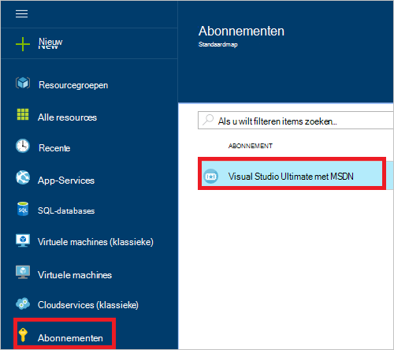
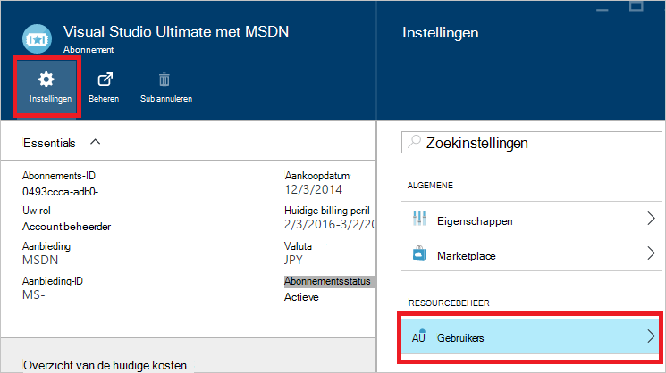
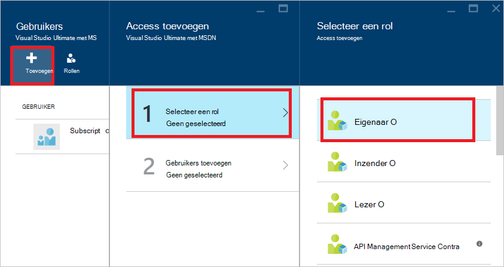
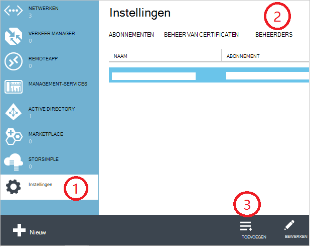
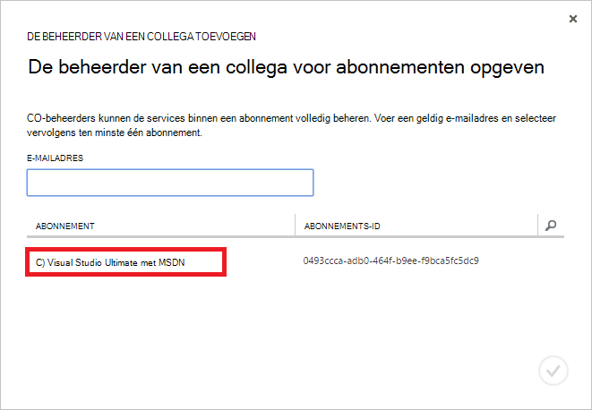
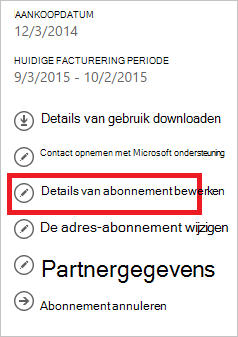
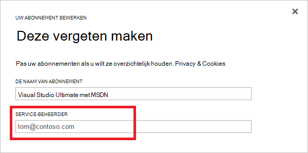

<properties
    pageTitle="Het toevoegen of wijzigen van Azure-beheerdersrollen | Microsoft Azure"
    description="Wordt beschreven hoe u collega Azure-beheerder, Service-beheerder en accountbeheerder toevoegen of wijzigen"
    services=""
    documentationCenter=""
    authors="genlin"
    manager="mbaldwin"
    editor=""
    tags="billing"/>

<tags
    ms.service="billing"
    ms.workload="na"
    ms.tgt_pltfrm="na"
    ms.devlang="na"
    ms.topic="article"
    ms.date="08/17/2016"
    ms.author="genli"/>

# Het toevoegen of wijzigen van Azure-beheerdersrollen

Er zijn drie soorten beheerdersrollen in Microsoft Azure:

| Beheerdersrol   | Limiet  | Beschrijving
| ------------- | ------------- |---------------|
|Accountbeheerder (AA)  | 1 per Azure-account  |Dit is de persoon die zich hebt geregistreerd of Azure abonnementen hebt gekocht en medewerker is gemachtigd voor toegang tot het [Midden van de Account](https://account.windowsazure.com/Home/Index) en verschillende beheertaken. Dit zijn kunnen maken van abonnementen, abonnementen annuleren, de facturering voor een abonnement wijzigen en wijzigen van de Service-beheerder.
| Service-beheerder (SA) | 1 per Azure abonnement  |Deze rol is gemachtigd voor het beheren van services in de [portal van Azure](https://portal.azure.com). De beheerder van het Account is standaard voor een nieuw abonnement, ook de Service-beheerder.|
|CO beheerder (CA) in de [klassieke Azure-portal](https://manage.windowsazure.com)|200 per abonnement| Deze rol heeft dezelfde access bevoegdheden als de Service-beheerder, maar de koppeling van abonnementen Azure mappen niet meer wijzigen. |

> [AZURE.NOTE] Azure Active Directory-rollen gebaseerde Access besturingselement RBAC () kunnen gebruikers worden toegevoegd aan meerdere rollen. Zie [Toegangsbeheer op basis van Azure Active Directory-rol](./active-directory/role-based-access-control-configure.md)voor meer informatie.

> [AZURE.NOTE] Als u meer hulp op een willekeurige plaats in dit artikel nodig hebt, neemt [contact opnemen met ondersteuning](https://portal.azure.com/?#blade/Microsoft_Azure_Support/HelpAndSupportBlade) om uw probleem snel opgelost.

## Het toevoegen van een beheerder voor een abonnement

**Azure-portal**

1. Meld u aan bij de [portal van Azure](https://portal.azure.com).

2. Selecteer op het menu Hub **abonnement** > *het abonnement waaraan u wilt dat de beheerder voor toegang tot*.

    

3. Selecteer **Instellingen**in het blad abonnement> **gebruikers**.

    
4. Selecteer in het blad gebruikers **toevoegen**>**selecteert u een rol** > **eigenaar**.

    

    **Opmerking**
    - De eigenaar rol heeft dezelfde toegangsrechten als beheerder van collega. Deze rol heeft geen toegangsrechten tot het [Beheercentrum van Azure-Account](https://account.windowsazure.com/subscriptions).
    - De eigenaren die u hebt toegevoegd via de [portal van Azure](https://portal.azure.com) kunnen geen services in de [klassieke Azure-portal](https://manage.windowsazure.com)beheren.  

5. Typ het e-mailadres van de gebruiker die u wilt toevoegen als de eigenaar van de gebruiker op en klik vervolgens op **selecteren**.

    

**Azure klassieke portal**

1. Meld u aan bij de [portal van Azure klassieke](https://manage.windowsazure.com/).

2. Selecteer **Instellingen**in het navigatiedeelvenster> **beheerders**> **toevoegen**.  

    

3. Typ het e-mailadres van de persoon die u wilt toevoegen als collega beheerder en selecteer vervolgens het abonnement waaraan u wilt dat de collega beheerder voor toegang tot. 

     

De volgende e-mailadres kan worden toegevoegd als de beheerder van een collega:

* **Microsoft-Account** (voorheen Windows Live ID)  
 U kunt een Microsoft-Account aanmelden bij alle consumenten-georiënteerd Microsoft-producten en services, zoals Outlook (Hotmail), Skype (MSN), OneDrive, Windows Phone en Xbox LIVE cloud.
* **Organisatieaccount** 
 Een organisatieaccount is een account die u onder Azure Active Directory maakt. Het adres organisatieaccount lijkt op de volgende handelingen uit: user@ &lt;uw domein&gt;. onmicrosoft.com

### Beperkingen

 * Elk abonnement is gekoppeld aan een Azure AD-directory (ook wel bekend als de map standaard). Als u de map standaard het abonnement dat is gekoppeld aan zoekt, gaat u naar de [klassieke Azure-portal](https://manage.windowsazure.com/), selecteert u **Instellingen** > **abonnementen**. Controleer de abonnements-ID als u wilt zoeken naar de map standaard.

 * Als u bent aangemeld met een Microsoft-Account, kunt u alleen andere Microsoft-Accounts of gebruikers binnen de standaard-adreslijst toevoegen als collega beheerder.

 * Als u bent aangemeld met een organisatieaccount, kunt u andere organisatie-accounts toevoegen in uw organisatie als beheerder van collega. Bijvoorbeeld abby@contoso.com kunt toevoegen bob@contoso.com als Service-beheerder of beheerder van collega, maar niet toevoegen john@notcontoso.com tenzij john@noncontoso.com is van de gebruiker in Default Directory. Gebruikers zijn aangemeld met organisatie-account kunnen doorgaan met het toevoegen van gebruikers van Microsoft-Account als Service-beheerder of beheerder van collega.

 * Hier volgen de wijzigingen in de Service-beheerder en collega beheerder account vereisten die mogelijk aan te melden bij Azure met een organisatieaccount:

    Login methode| Microsoft-Account of gebruikers binnen Default Directory als CA of SA toevoegen?  |Organisatie-account toevoegen in dezelfde organisatie als CA of SA? |Organisatie-account toevoegen in andere organisatie als CA of SA?
    ------------- | ------------- |---------------|---------------
    Microsoft-Account |Ja|Nee|Nee
    Organisatieaccount|Ja|Ja|Nee

## Service-beheerder voor een abonnement wijzigen

Alleen de beheerder van het Account kan de Service-beheerder voor een abonnement wijzigen.

1. Meld u aan bij het [Beheercentrum van Azure-Account](https://account.windowsazure.com/subscriptions) met behulp van de beheerder van het Account.

2. Selecteer het abonnement dat u wilt wijzigen.

3. Aan de rechterkant, klikt u op details **bewerken van abonnement** .  

    

4. Voer het e-mailadres van de nieuwe Service-beheerder in het vak **SERVICE-beheerder** .  

    

## Het wijzigen van de accountbeheerder

Eigendom van de Azure-account overbrengen naar een ander account, raadpleegt u [Overbrengen eigendom van een Azure-abonnement](billing-subscription-transfer.md).

## Volgende stappen

* Zie [toegang tot bronnen in Azure wordt aangegeven wat](./active-directory/active-directory-understanding-resource-access.md) meer informatie over hoe resource access wordt beheerd met Microsoft Azure,

* Zie voor meer informatie over hoe Azure Active Directory zich tot uw Azure-abonnement verhoudt, [hoe Azure-abonnementen zijn gekoppeld aan Azure Active Directory](./active-directory/active-directory-how-subscriptions-associated-directory.md)

* Zie voor meer informatie over hoe Azure Active Directory zich tot uw Azure-abonnement verhoudt, [beheerdersrollen toewijzen in Azure Active Directory](./active-directory/active-directory-assign-admin-roles.md)

> [AZURE.NOTE] Als u nog verdere vragen hebben, neemt [contact opnemen met ondersteuning](https://portal.azure.com/?#blade/Microsoft_Azure_Support/HelpAndSupportBlade) om het probleem opgelost snel.
