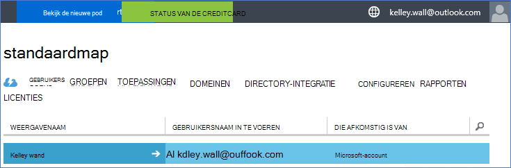
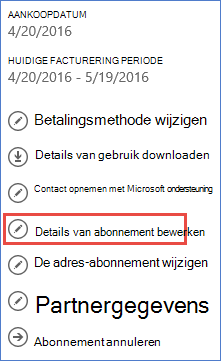
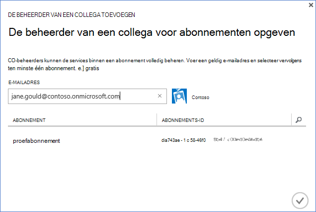

<properties
    pageTitle="Een Office 365-tenant gebruiken met een Azure abonnement | Microsoft Azure"
    description="Informatie over het toevoegen van een Office 365 directory (tenant) bij een Azure-abonnement om te maken van de koppeling."
    services=""
    documentationCenter=""
    authors="JiangChen79"
    manager="mbaldwin"
    editor=""
    tags="billing,top-support-issue"/>

<tags
    ms.service="billing"
    ms.workload="na"
    ms.tgt_pltfrm="ibiza"
    ms.devlang="na"
    ms.topic="article"
    ms.date="09/16/2016"
    ms.author="cjiang"/>

# Een Office 365-tenant koppelen aan een Azure-abonnement
Als u zowel Azure en Office 365-abonnementen apart hebt aangeschaft in het verleden en nu wilt u steeds toegang tot de Office 365-tenant van de Azure-abonnement, is het gemakkelijk kunt doen. In dit artikel leest u hoe.

> [AZURE.NOTE] In dit artikel niet van toepassing op klanten Enterprise Agreement (EA).

## Snelle hulp
U uw Office 365-tenant koppelen aan uw Azure-abonnement door uw Azure-account gebruiken om toe te voegen van uw Office 365-tenant en vervolgens uw Azure abonnement koppelen aan de Office 365-tenant.

## Gedetailleerde stappen
In dit scenario Kelley Wall een gebruiker met een Azure-abonnement onder het account is kelley.wall@outlook.com. Kelley, heeft ook een Office 365-abonnement onder de account kelley.wall@contoso.onmicrosoft.com. Kelley wil nu toegang tot de Office 365-tenant met het abonnement dat Azure.

### Vereisten voor
Voor de koppeling werkt alleen naar behoren, zijn de volgende vereisten nodig:

- Moet u eerst de referenties van de service-beheerder van de Azure-abonnement. CO-beheerders kunnen een subset van de stappen niet uitvoeren.
- Moet u eerst de referenties van een globale beheerder van de Office 365-tenant.
- Het e-mailadres van de service-beheerder moet niet zijn opgenomen in de Office 365-tenant.
- Het e-mailadres van de service-beheerder moet niet overeenkomen met die van een globale beheerder van de Office 365-tenant.
- Als u momenteel een e-mailadres dat is een Microsoft-account en een organisatie-account gebruikt, is tijdelijk wijzigen van de service-beheerder van uw Azure-abonnement als u wilt gebruiken, een andere Microsoft-account. U kunt een nieuwe Microsoft-account op de [aanmeldingspagina voor Microsoft-account](https://signup.live.com/)maken.

Als u wilt wijzigen van uw service-beheerder, als volgt te werk:

1. Meld u aan bij de [portal accountbeheer](https://account.windowsazure.com/subscriptions).
2. Selecteer het abonnement dat u wilt wijzigen.
3. Selecteer **details van abonnement bewerken**.

    

4. Voer het e-mailadres van de nieuwe service-beheerder in het vak **SERVICE-beheerder** .

    

### De Office 365-tenant koppelen aan het abonnement dat Azure
Ga als volgt u de Office 365-tenant koppelen aan het abonnement dat Azure door:

1.  Meld u aan bij de [portal accountbeheer](https://account.windowsazure.com/subscriptions) met de referenties van service-beheerder.
2.  Selecteer in het linkerdeelvenster **ACTIVE DIRECTORY**.

    

    > [AZURE.NOTE] Niet ziet u de Office 365-tenant. Als u dit ziet, moet u de volgende stap overslaan.

    

3. De Office 365-tenant toevoegen aan uw Azure-abonnement.

    een. Selecteer **Nieuw** > **DIRECTORY** > **aangepaste maken**.

    

    b. Selecteer op de pagina **directory toevoegen** , klikt u onder **DIRECTORY**, **de bestaande map gebruiken**. Selecteer **ik ben klaar om te worden nu afgemeld**en selecteer **volledige** .

    

    c. Nadat u bent afgemeld, meld u aan met referenties van de globale beheerder van uw Office 365-tenant.

    

    d. Selecteer **Doorgaan**.

    

    e. Selecteer **nu afmelden**.

    

    f. Meld u aan bij de [portal accountbeheer](https://account.windowsazure.com/subscriptions) met de referenties van service-beheerder.

    

    g. Hier ziet u uw Office 365-tenant in het dashboard.

    

4. De map die is gekoppeld aan het abonnement dat Azure wijzigen.

    een. Selecteer **Instellingen**.

    

    b. Selecteer uw Azure-abonnement en selecteer **ADRESLIJST bewerken**.
    

    c. Selecteer **volgende** .

    

    > [AZURE.WARNING] U ontvangt een waarschuwing dat alle CO-beheerders worden verwijderd.

    

    >[AZURE.WARNING] Alle [Rolgebaseerd toegangsbeheer (RBAC)](./active-directory/role-based-access-control-configure.md) gebruikers met toegang tot de toegewezen in de bestaande resourcegroepen Daarnaast kunnen worden ook verwijderd. De waarschuwing die u ontvangt vermeldingen echter alleen de verwijdering van CO-beheerders.

    

    d. Selecteer **volledige** .

5. Nu kunt u uw Office 365-organisatieaccount als co-beheerders toevoegen aan de tenant Azure Active Directory.

    een. Selecteer het tabblad **beheerders** en selecteer vervolgens **toevoegen**.

    

    b. Voer een organisatieaccount van uw Office 365-tenant, selecteer het abonnement dat Azure en selecteer vervolgens **voltooid** .

    

    c. Ga terug naar het tabblad **beheerders** . Hier ziet u de weergegeven als de beheerder van de collega organisatieaccount.

    

6. U kunt vervolgens toegang testen met de beheerder van collega.

    een. Afmelden bij de portal accountbeheer.

    b. Open de [Account-beheerportal](https://account.windowsazure.com/subscriptions) of de [Azure-portal](https://portal.azure.com/).

    c. Als de Azure aanmeldingspagina een koppeling naar **aanmelden met uw organisatieaccount bevat**, schakelt u de koppeling. Anders deze stap overslaan.

    

    d. Voer de referenties van de beheerder van het samenwerken en selecteer **aanmelden**.

    

## Volgende stappen
Verwante scenario's zijn:

- U al een Office 365-abonnement hebt en gereed zijn voor een Azure-abonnement, maar u wilt de bestaande Office 365-gebruikersaccounts gebruiken voor uw Azure-abonnement.
- U Azure abonnee bent en u wilt ontvangen van een Office 365-abonnement voor de gebruikers in uw bestaande exemplaar van de Azure Active Directory.

Zie meer informatie over het uitvoeren van deze taken, [Gebruik uw bestaande Office 365-account met uw Azure-abonnement of omgekeerd](billing-use-existing-office-365-account-azure-subscription.md).
