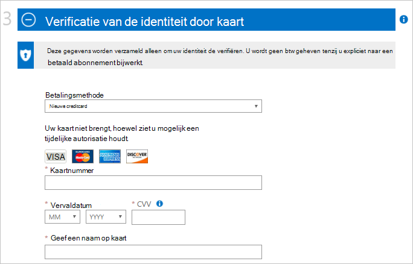
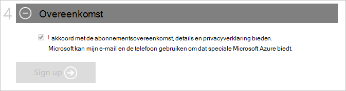

<properties
    pageTitle="Hoe u zich aanmeldt voor, kopen, upgraden of een Azure-abonnement activeren | Microsoft Azure"
    description="Wordt uitgelegd hoe u over het aanschaffen of zich registreren voor een Azure-abonnement"
    services=""
    documentationCenter=""
    authors="genlin"
    manager="mbaldwin"
    editor=""
    tags="billing,top-support-issue"
    />

<tags
    ms.service="billing"
    ms.workload="na"
    ms.tgt_pltfrm="na"
    ms.devlang="na"
    ms.topic="article"
    ms.date="09/23/2016"
    ms.author="genli"/>

# Hoe u zich aanmeldt, kopen, upgraden of activeren van Azure

> [AZURE.NOTE] Als u meer hulp op een willekeurige plaats in dit artikel nodig hebt, neemt [contact opnemen met ondersteuning](https://portal.azure.com/?#blade/Microsoft_Azure_Support/HelpAndSupportBlade) om uw probleem snel opgelost.

Azure bevat verschillende aanbiedingen naar uw zakelijke behoeften en aan de slag met Azure. Ga naar [Azure biedt](https://azure.microsoft.com/support/legal/offer-details/) voor een volledige lijst met alle actieve voorstellen met details over elke aanbieding over wat ze begeleidende, voordelen en beschikbaarheid per landen/regio.

## Azure biedt - voordelen en -limieten

De volgende tabel vindt u details op algemene aanbiedingen:

| Aanbieding                                                                              | Details |
|--------------------------------------------------------------------------------------|---------|
| Gratis proefversie                                                                           |• [Aanmelding en stapsgewijze handleiding](billing-buy-sign-up-azure-subscription.md#SignupFreeTrial) • [Voordelen](https://azure.microsoft.com/pricing/free-trial/) • [Veelgestelde vragen](https://azure.microsoft.com/pricing/free-trial-faq/) • [Gratis proefversie naar Pay-As-You-Go upgraden](billing-buy-sign-up-azure-subscription.md#UpgradeFreeToPYG)     |
| Pay-As-You-Go                                                                        | • [Aanmelding](https://azure.microsoft.com/pricing/purchase-options/) • [Prijzen](https://azure.microsoft.com/pricing/)   |
| MPN (Microsoft Partner Network) - leden ontvangen maandelijkse Azure tegoeden gratis | • [Azure voordelen voor partners](https://azure.microsoft.com/offers/ms-azr-0025p/) • [Inschrijven als een partner](http://go.microsoft.com/fwlink/?linkid=309258&clcid=0x409) of [abonneren op Microsoft actie pack](http://go.microsoft.com/fwlink/?linkid=525768&clcid=0x409) • Azure tegoeden gebruiken: toegang tot de [portal MPN](https://partner.microsoft.com) en controleer of uw status geschiktheid en volg de stappen onder Software toetsen en voordelen. Als u niet kunt controleren of uw geschiktheid, neemt u contact [MPN ondersteunen](https://partner.microsoft.com/Support/).   |
| MSDN & Visual Studio abonnee                                                      |• [MSDN ontwikkelaar/testen voordelen](https://azure.microsoft.com/offers/ms-azr-0023p/) • [Visual Studio abonnee voordelen](https://azure.microsoft.com/pricing/member-offers/msdn-benefits-details/) • [Visual Studio activeren abonnee Azure creditcard](https://azure.microsoft.com/pricing/member-offers/msdn-benefits-details/) • [Activeren MSDN Azure voordelen in drie eenvoudige stappen](https://www.youtube.com/watch?v=SN2CA71uOEI&feature=youtu.be):  Aanmelden bij [de accountpagina MSDN](https://msdn.microsoft.com/subscriptions/manage/default.aspx) en geschiktheid verifiëren, klikt u op 'Voordeel Azure activeren'. Als u niet kunt controleren of uw geschiktheid, neemt u contact op met de [Klantenservice is MSDN abonnementen](https://msdn.microsoft.com/subscriptions/contactus.aspx).|
| BizSpark                                                                             | • [Voordelen BizSpark](https://www.microsoft.com/bizspark/default.aspx#start-two). Zie voor meer informatie, [Azure maandelijkse creditnota voor Visual Studio Enterprise](https://azure.microsoft.com/offers/ms-azr-0064p/) • [BizSpark deelnemen](https://www.microsoft.com/bizspark/signup/default.aspx). Als u problemen ondervindt, neem contact op met het [BizSpark Team](mailto:bizspark@microsoft.com?subject=BizSpark%20Support&body=Thank%20you%20for%20contacting%20BizSpark.%20Please%20provide%20as%20much%20of%20the%20following%20information%20as%20possible,%20as%20it%20will%20help%20expedite%20our%20response%20to%20you.%0aContact%20name:%0aStartup%20name:%0aMicrosoft%20Account/Live%20ID:%0aSpecific%20description%20of%20issue%20experienced%20or%20question:%0a%0aThank%20you,%0a%0aThe%20BizSpark%20Team).      |
| BizSpark Plus                                                                        |• [Meer informatie over BizSpark Plus](https://www.microsoft.com/bizspark/plus/default.aspx). Zie voor meer informatie, [BizSpark Plus voordelen](https://azure.microsoft.com/offers/ms-azr-0149p/) • [BizSpark deelnemen aan](https://www.microsoft.com/bizspark/signup/default.aspx) en klik vervolgens werken met uw partner contact op met upgrade uitvoeren naar BizSpark Plus. Als u problemen ondervindt, neem contact op met het [BizSpark Team](mailto:bizspark@microsoft.com?subject=BizSpark%20Support&body=Thank%20you%20for%20contacting%20BizSpark.%20Please%20provide%20as%20much%20of%20the%20following%20information%20as%20possible,%20as%20it%20will%20help%20expedite%20our%20response%20to%20you.%0aContact%20name:%0aStartup%20name:%0aMicrosoft%20Account/Live%20ID:%0aSpecific%20description%20of%20issue%20experienced%20or%20question:%0a%0aThank%20you,%0a%0aThe%20BizSpark%20Team).     |
| Wederverkopers (Open Volume License-programma's)                                             |• [Activeren onlineservice toets - handleiding](billing-buy-sign-up-azure-subscription.md#activateKey) • [Aanschaffen, voordelen, activeren](https://azure.microsoft.com/offers/ms-azr-0111p/)        |
| EA (Enterprise Agreement)                                                            |• [Licensing Azure voor de onderneming](https://azure.microsoft.com/pricing/enterprise-agreement/) • Te activeren, neem contact op met uw Microsoft-accountmanager of wederverkoper aan de slag vandaag     |

## Registreren voor een gratis proefversie van Azure-abonnement

Om u te registreren voor een gratis proefversie van Azure-abonnement, moet u een telefoonnummer, een creditcard en een Microsoft-Account opgeven. Uw Microsoft-account is het e-mailadres dat u, samen met uw wachtwoord gebruikt kunt aanmelden bij Windows Live-programma's of service, zoals Outlook, Hotmail of OneDrive. U mogelijk een Microsoft-account met een e-mailadres voor u, met inbegrip van uw bedrijf-e-mail instellen. Zie [Microsoft-account Veelgestelde vragen](https://www.microsoft.com/account/faq.aspx) voor meer informatie.

Zie [Problemen met Azure aanmelden bij problemen](billing-troubleshoot-azure-sign-up-issues.md) als u problemen ondervindt.

>[AZURE.NOTE] De details van uw telefoon getal en creditcard worden alleen gebruikt voor uw identiteit verifiëren. Hoewel uw creditcard geen afgeschreven, plaatst Microsoft een wachtruimte autorisatie erop om te bevestigen dat de creditcard geldig is gedurende een minimale. De blokkering worden uitgebracht binnen 3 tot en met 5 dagen, afhankelijk van uw financiële instelling het beleid.

1. Open de [Azure gratis proefabonnement pagina](https://azure.microsoft.com/pricing/free-trial/)en selecteer vervolgens **nu starten**.

2. Meld u aan met uw Microsoft-account of organisatieaccount.

3. Voer uw persoonlijke gegevens in de sectie **over u** . [Meer informatie](billing-troubleshoot-azure-sign-up-issues.md#i-am-getting-an-error-when-entering-my-information-to-sign-up) over uw persoonlijke gegevens nauwkeurig invoeren.

    

    >[AZURE.NOTE] Het e-mailadres en land informatie die u opgeeft wanneer u zich aanmeldt voor een Azure-abonnement is gekoppeld aan het abonnement en later kan niet worden gewijzigd.

4. In de sectie **verificatie via de telefoon** , moet u een telefoonnummer klikken om een verificatiecode die u opgeven kunt om de verificatie voltooien ontvangen opgeven.

    U kunt kiezen voor het ontvangen van de verificatiecode in die als een tekstbericht of via een telefoongesprek. Maak uw keuze door op **tekstbericht versturen** of **Bel me**te selecteren. Selecteer de internationale na het bellen code voor uw land in het eerste vak en voer uw telefoonnummer in het tweede vak. Nadat u de verificatiecode ontvangt, voert u het in het derde vak en selecteer vervolgens de knop **verifiëren code** . [Zie dit artikel voor meer informatie](billing-troubleshoot-azure-sign-up-issues.md#i-am-not-getting-text-messages-or-calls-during-account-verification-when-i-try-to-sign-up).

    >[AZURE.NOTE] U kunt een telefoonnummer VOIP niet gebruiken voor het telefoon-verificatieproces.

    

    Als u geen SMS-bericht of een oproep ontvangt, probeer dan een ander telefoonnummer of contact opnemen met [Azure-ondersteuning](https://portal.azure.com/#blade/Microsoft_Azure_Support/HelpAndSupportBlade) voor hulp.

5. Voer de details van een geldige creditcard in de sectie **verificatie door kaart** . Deze gegevens worden verzameld alleen om uw identiteit de verifiëren.

    Als er een foutbericht wanneer u uw creditcardgegevens hebt verzonden, raadpleegt u het artikel [Mijn creditcard niet verwerkt als ik me probeer te registreren voor Azure](billing-credit-card-fails-during-azure-sign-up.md).

    

6. Klik in de sectie **overeenkomst** door het selectievakje uit te voeren als u akkoord met de abonnementsovereenkomst, aanbieding details en privacyverklaring gaat. Selecteer **aanmelden**. Het overeenkomstformulier kan verschillen per land.

    

    Het kan enkele minuten duren voor het instellen van uw abonnement. Als de instelling van het abonnement niet wordt voltooid in 15 minuten, neemt u contact [Azure-ondersteuning](https://portal.azure.com/#blade/Microsoft_Azure_Support/HelpAndSupportBlade) voor hulp.

    > [AZURE.NOTE] Als er een foutbericht wordt weergegeven, volgt u de stappen in het bericht om dit probleem. Een veelvoorkomend foutbericht luidt als volgt:

    > **Helaas, dat kunnen we de bewerking niet voltooien. Probeer het later opnieuw of laden van de pagina met webonderdelen**

    > In dit geval kunt u het aanmeldingsproces voltooien met een andere browser. Als het probleem blijft optreden, neemt u contact [Azure-ondersteuning](https://portal.azure.com/#blade/Microsoft_Azure_Support/HelpAndSupportBlade) voor hulp.

7. Wanneer het abonnement klaar is, selecteert u **beginnen met het beheren van mijn service** moet beginnen.

    

### Aanvullende informatie

- [Ik kan een gratis proefversie van Azure niet activeren](billing-troubleshoot-azure-sign-up-issues.md#i-cant-activate-an-azure-free-trial)
- [Azure gratis proefversie Veelgestelde vragen](https://azure.microsoft.com/pricing/free-trial-faq/).

## Azure gratis proefversie upgraden naar Pay-As-You-Go

1. Meld u aan bij de [Portal van Azure-Account](https://account.windowsazure.com/subscriptions) met behulp van het Microsoft-account of organisatieaccount die u gebruikt om u te registreren voor de gratis proefversie.

2. Selecteer het abonnement en selecteer vervolgens **upgraden**

    

3. Selecteer **Ja**en selecteer vervolgens **Nu bijwerken**.

    

Wanneer u een upgrade vanuit een gratis proefabonnement op een abonnement Pay-As-You-Go uitvoert, een voordelen links via uit uw gratis proefversie zoals de limiet van 30 dagen of de lof $200 gebruik op Azure services blijft totdat een van deze is leeg. De upgrade abonnement gebeurt achteraf.

## Activeren met een Online Service activering-toets

Als u **Azure in die is geopend** tegoeden hebt gekocht bij een wederverkoper en hebt u een activering toets (5 x 5), volgt u deze stappen om uw abonnement te activeren:

1. Ga naar de [pagina summary van abonnement](https://account.windowsazure.com/subscriptions).

2. Selecteer **Azure in die is geopend**. Selecteer in de pagina [Azure in Open licentie sleutel](https://azure.microsoft.com/offers/ms-azr-0111p/) **activeren een nieuw abonnement of een bestaand abonnement**.

3. Voer de productcode en schakel vervolgens de optie overeenkomst.

> [AZURE.NOTE] Als u nog verdere vragen hebben, neemt [contact opnemen met ondersteuning](https://portal.azure.com/?#blade/Microsoft_Azure_Support/HelpAndSupportBlade) om het probleem opgelost snel.
