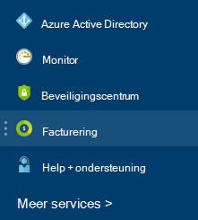

<properties
    pageTitle="Het downloaden van uw factuur en dagelijks gebruiksgegevens facturering Azure | Microsoft Azure"
    description="Wordt beschreven hoe u uw Azure factuur en het dagelijkse gebruiksgegevens downloaden"
    services=""
    documentationCenter=""
    authors="genlin"
    manager="mbaldwin"
    editor=""
    tags="billing"
    />

<tags
    ms.service="billing"
    ms.workload="na"
    ms.tgt_pltfrm="na"
    ms.devlang="na"
    ms.topic="article"
    ms.date="10/10/2016"
    ms.author="genli"/>

# Het downloaden van uw factuur en dagelijks gebruiksgegevens facturering Azure

> [AZURE.NOTE] Als u meer hulp op een willekeurige plaats in dit artikel nodig hebt, neemt [contact opnemen met ondersteuning](https://portal.azure.com/?#blade/Microsoft_Azure_Support/HelpAndSupportBlade) om uw probleem snel opgelost.

Als de beheerder van de Azure-account, kunt u de factuur en het dagelijkse gegevens over het gebruik van de [Azure-portal](https://portal.azure.com) of het [Beheercentrum van Azure-Account](https://account.windowsazure.com/subscriptions)weergeven. Hier ziet u hoe:

## Azure-portal

1. Meld u aan bij de [portal van Azure](https://portal.azure.com) als de accountbeheerder van het.

    >[AZURE.NOTE] Alleen de accountbeheerder daartoe is gemachtigd voor toegang tot de facturering gegevens. Zie de [Veelgestelde vragen](billing-subscription-transfer.md#faq)voor meer informatie over hoe u erachter wie de accountbeheerder van het van het abonnement dat is.

2. Selecteer in het menu Hub **Facturering**. Klik op het blad **Facturering** vindt u enkele nuttige informatie zoals volgende factuurdatum.

    
3. Selecteer het abonnement dat u wilt weergeven in de sectie **abonnement kosten** .

    
4. Klik op **Facturering en gebruik**.

    

5. Klik op het blad **Factureringsgeschiedenis** op **Factuur downloaden** om een kopie van uw factuur weer te geven. Klik op een factureringsperiode als u wilt de dagelijkse gebruiksgegevens weergeven.

    

## Beheercentrum van Azure-Account

1. Meld u aan bij het [Beheercentrum van Azure-Account](https://account.windowsazure.com/subscriptions) als de accountbeheerder van het.
2. Selecteer het abonnement waarvoor u de factuur en het gebruik informatie wilt.
3. Selecteer **FACTURERINGSGESCHIEDENIS**.  
4. Ziet u de instructies voor de laatste zes billing perioden en de huidige gefactureerd periode.   
5. Selecteer de **Huidige weergave-instructie** om te zien van een schatting van de kosten op het moment dat de schatting is gegenereerd. Deze informatie wordt alleen dagelijks bijgewerkt en mogelijk niet inbegrepen bij alle uw gebruik. Uw maandelijkse factuur kan afwijken van deze schatting.   
6. Selecteer **Factuur downloaden** om een kopie van uw laatste factuur weer te geven.  
7. Selecteer **Gebruik downloaden** om te downloaden van de dagelijkse gebruiksgegevens als een CSV-bestand. 

> [AZURE.NOTE] Als u nog verdere vragen hebben, neemt [contact opnemen met ondersteuning](https://portal.azure.com/?#blade/Microsoft_Azure_Support/HelpAndSupportBlade) om het probleem opgelost snel.
