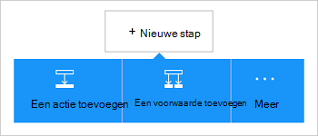

<properties
    pageTitle="De connector voor Dynamics CRM Online toevoegen aan uw Apps logica | Microsoft Azure"
    description="Logica apps maken met de App Azure-service. De Dynamics CRM Online verbindingsprovider biedt een API voor gebruik met entiteiten op Dynamics CRM Online."
    services="logic-apps"    
    documentationCenter=""     
    authors="MandiOhlinger"    
    manager="erikre"    
    editor="" 
    tags="connectors" />

<tags
ms.service="logic-apps"
ms.devlang="na"
ms.topic="article"
ms.tgt_pltfrm="na"
ms.workload="integration"
ms.date="08/15/2016"
ms.author="mandia"/>

# Aan de slag met de connector voor Dynamics CRM Online
Verbinding maken met Dynamics CRM Online naar een nieuwe record maken, bijwerken van een item en meer. Met CRM Online, kunt u het volgende doen:

- De bedrijfswerkstroom van uw op basis van de gegevens die u van CRM Online ontvangt maken. 
- Gebruik acties die een record verwijdert, krijgen entiteiten en meer. Deze acties bent u een reactie en klikt u vervolgens de uitvoer beschikbaar maken voor andere acties. Als u een item in CRM wordt bijgewerkt, kunt u bijvoorbeeld een e-mailbericht met behulp van Office 365 verzenden.

In dit onderwerp ziet u hoe u de connector voor Dynamics CRM Online gebruiken in een app logica en ook bevat de triggers en acties.

>[AZURE.NOTE] Deze versie van het artikel is van toepassing op logica Apps algemene beschikbaarheid (GA).

Meer informatie over de logica Apps, raadpleegt u [Wat zijn de logica apps](../app-service-logic/app-service-logic-what-are-logic-apps.md) en [een logica-app maakt](../app-service-logic/app-service-logic-create-a-logic-app.md).

## Verbinding maken met Dynamics CRM Online

Voordat uw app logica toegang elke service tot, maakt u eerst een *verbinding* met de service. Een verbinding biedt connectiviteit tussen een logica-app en een andere service. Bijvoorbeeld als u wilt verbinding maken met Dynamics, moet u eerst een Dynamics CRM Online *verbinding*. Een verbinding wilt maken, voert u de referenties die u normaal gesproken gebruiken voor toegang tot de service die u verbinding wilt maken. Met Dynamics, voert u de referenties op bij uw account Dynamics CRM Online om de verbinding te maken.

### De verbinding maken

>[AZURE.INCLUDE [Steps to create a connection to Dynamics CRM Online Connection Provider](../../includes/connectors-create-api-crmonline.md)]

## Gebruik een trigger

Een trigger is een gebeurtenis die kan worden gebruikt om de werkstroom die is gedefinieerd in een app logica te starten. Triggers "poll uitvoeren onder' de service aan een interval en de frequentie die u wilt. [Meer informatie over activering](../app-service-logic/app-service-logic-what-are-logic-apps.md#logic-app-concepts).

1. Typ in de app logica 'dynamics' om te zien van de triggers:  

    

2. Selecteer **Dynamics CRM Online - als een record wordt gemaakt**. Als er al een verbinding bestaat, selecteert u een organisatie en entiteit uit de vervolgkeuzelijst.

    

    Als u wordt gevraagd aan te melden, voert u het teken in de details van de verbinding maken. [De verbinding maken](connectors-create-api-crmonline.md#create-the-connection) in dit onderwerp vindt u de stappen. 

    > [AZURE.NOTE] In dit voorbeeld wordt de app logica uitgevoerd wanneer een record wordt gemaakt. Toevoegen om de resultaten van deze trigger, een andere actie die u een e-mail stuurt. Voeg bijvoorbeeld de actie voor Office 365 *Stuur een e-mail* die u e-mailberichten als de nieuwe record wordt toegevoegd. 

3. Selecteer de knop **bewerken** en de waarden **frequentie** en **Interval** instellen. Bijvoorbeeld als u wilt dat de trigger poll uitvoeren onder elke 15 minuten, klikt u vervolgens de **frequentie** instelt op **minuut**en het **Interval** ingesteld op **15**. 

    

4. **Sla** uw wijzigingen (linkerbovenhoek van de werkbalk). Uw app logica is opgeslagen en mogelijk automatisch ingeschakeld.

## Gebruik een actie

Een actie is een bewerking uitgevoerd door de werkstroom die is gedefinieerd in een app logica. [Meer informatie over acties](../app-service-logic/app-service-logic-what-are-logic-apps.md#logic-app-concepts).

1. Selecteer het plusteken (+). Ziet u diverse opties selecteren: **een actie toevoegen**, **een voorwaarde toevoegen**of een van de **meer** opties.

    

2. Kies **een actie toevoegen**.

3. Typ in het tekstvak 'dynamics' om te zien van alle beschikbare acties.

    

4. In ons voorbeeld Kies **Dynamics CRM Online - een record wordt bijgewerkt**. Als er al een verbinding bestaat, kiest u de **Naam van organisatie**, **Entiteitsnaam**en andere eigenschappen:  

    

    Als u wordt gevraagd om de verbindingsgegevens, voert u de details om de verbinding te maken. [De verbinding maken](connectors-create-api-crmonline.md#create-the-connection) in dit onderwerp worden deze eigenschappen. 

    > [AZURE.NOTE] In dit voorbeeld bijwerken we een bestaande record in CRM Online. Uitvoer van een andere trigger kunt u de record wordt bijgewerkt. Voeg bijvoorbeeld de trigger SharePoint *wanneer een bestaand item is gewijzigd* . Voeg vervolgens de actie CRM Online *een record wordt bijgewerkt* , waarin de SharePoint-velden voor het bijwerken van de bestaande record in CRM Online wordt gebruikt. 

5. **Sla** uw wijzigingen (linkerbovenhoek van de werkbalk). Uw app logica is opgeslagen en mogelijk automatisch ingeschakeld.

## Technische Details

## Triggers

|Trigger | Beschrijving|
|--- | ---|
|[Wanneer een record wordt gemaakt](connectors-create-api-crmonline.md#when-a-record-is-created)|De gebeurtenis een stroom wanneer een object is gemaakt in CRM.|
|[Wanneer een record wordt bijgewerkt](connectors-create-api-crmonline.md#when-a-record-is-updated)|De gebeurtenis een stroom wanneer een object is gewijzigd in CRM.|
|[Wanneer een record is verwijderd](connectors-create-api-crmonline.md#when-a-record-is-deleted)|De gebeurtenis een stroom wanneer een object in CRM wordt verwijderd.|

## Acties

|Actie|Beschrijving|
|--- | ---|
|[Lijst met records](connectors-create-api-crmonline.md#list-records)|Deze bewerking krijgt de records voor een entiteit.|
|[Maak een nieuwe record](connectors-create-api-crmonline.md#create-a-new-record)|Deze bewerking Hiermee maakt u een nieuwe record van een entiteit.|
|[Record ophalen](connectors-create-api-crmonline.md#get-record)|Deze bewerking wordt de opgegeven record voor een entiteit.|
|[Een record verwijderen](connectors-create-api-crmonline.md#delete-a-record)|Deze bewerking verwijdert een record uit een entity-verzameling.|
|[Een record wordt bijgewerkt](connectors-create-api-crmonline.md#update-a-record)|Deze bewerking bijgewerkt via een bestaande record voor een entiteit.|

### Details van inwerkingtreding en een actie

In deze sectie, de specifieke informatie over elke trigger en een actie, inclusief eventuele verplicht of optioneel eigenschappen voor de invoer en alle bijbehorende uitvoer die is gekoppeld aan de verbindingslijn te bekijken.

#### Wanneer een record wordt gemaakt
De gebeurtenis een stroom wanneer een object is gemaakt in CRM. 

|Naam van eigenschap| Weergavenaam|Beschrijving|
| ---|---|---|
|gegevensset *|De organisatienaam van de|Naam van de organisatie CRM zoals Contoso|
|tabel *|De entiteitsnaam van de|Naam van de entiteit|
|$skip|Overslaan tellen|Aantal vermeldingen om over te slaan (standaard = 0)|
|$top|Maximale Get tellen|Maximum aantal vermeldingen om (standaard = 256)|
|$filter|Query filteren|Een query ODATA filter de vermeldingen geretourneerd beperken|
|$orderby|Sorteren op|Een query ODATA orderBy om aan te geven van de volgorde van items|

Een sterretje (*) betekent dat de eigenschap is vereist.

##### Gegevens voor uitvoer
ItemsList

| Naam van eigenschap | Gegevenstype |
|---|---|
|waarde|matrix|

#### Wanneer een record wordt bijgewerkt
De gebeurtenis een stroom wanneer een object is gewijzigd in CRM. 

|Naam van eigenschap| Weergavenaam|Beschrijving|
| ---|---|---|
|gegevensset *|De organisatienaam van de|Naam van de organisatie CRM zoals Contoso|
|tabel *|De entiteitsnaam van de|Naam van de entiteit|
|$skip|Overslaan tellen|Aantal vermeldingen om over te slaan (standaard = 0)|
|$top|Maximale Get tellen|Maximum aantal vermeldingen om (standaard = 256)|
|$filter|Query filteren|Een query ODATA filter de vermeldingen geretourneerd beperken|
|$orderby|Sorteren op|Een query ODATA orderBy om aan te geven van de volgorde van items|

Een sterretje (*) betekent dat de eigenschap is vereist.

##### Gegevens voor uitvoer
ItemsList

| Naam van eigenschap | Gegevenstype |
|---|---|
|waarde|matrix|

#### Wanneer een record is verwijderd
De gebeurtenis een stroom wanneer een object in CRM wordt verwijderd. 

|Naam van eigenschap| Weergavenaam|Beschrijving|
| ---|---|---|
|gegevensset *|De organisatienaam van de|Naam van de organisatie CRM zoals Contoso|
|tabel *|De entiteitsnaam van de|Naam van de entiteit|
|$skip|Overslaan tellen|Aantal vermeldingen om over te slaan (standaard = 0)|
|$top|Maximale Get tellen|Maximum aantal vermeldingen om (standaard = 256)|
|$filter|Query filteren|Een query ODATA filter de vermeldingen geretourneerd beperken|
|$orderby|Sorteren op|Een query ODATA orderBy om aan te geven van de volgorde van items|

Een sterretje (*) betekent dat de eigenschap is vereist.

##### Gegevens voor uitvoer
ItemsList

| Naam van eigenschap | Gegevenstype |
|---|---|
|waarde|matrix|

#### Lijst met records
Deze bewerking krijgt de records voor een entiteit. 

|Naam van eigenschap| Weergavenaam|Beschrijving|
| ---|---|---|
|gegevensset *|De organisatienaam van de|Naam van de organisatie CRM zoals Contoso|
|tabel *|De entiteitsnaam van de|Naam van de entiteit|
|$skip|Overslaan tellen|Aantal vermeldingen om over te slaan (standaard = 0)|
|$top|Maximale Get tellen|Maximum aantal vermeldingen om (standaard = 256)|
|$filter|Query filteren|Een query ODATA filter de vermeldingen geretourneerd beperken|
|$orderby|Sorteren op|Een query ODATA orderBy om aan te geven van de volgorde van items|

Een sterretje (*) betekent dat de eigenschap is vereist.

##### Gegevens voor uitvoer
ItemsList

| Naam van eigenschap | Gegevenstype |
|---|---|
|waarde|matrix|

#### Maak een nieuwe record
Deze bewerking Hiermee maakt u een nieuwe record van een entiteit. 

|Naam van eigenschap| Weergavenaam|Beschrijving|
| ---|---|---|
|gegevensset *|De organisatienaam van de|Naam van de organisatie CRM zoals Contoso|
|tabel *|De entiteitsnaam van de|Naam van de entiteit|

Een sterretje (*) betekent dat de eigenschap is vereist.

##### Gegevens voor uitvoer
Geen.

#### Record ophalen
Deze bewerking wordt de opgegeven record voor een entiteit. 

|Naam van eigenschap| Weergavenaam|Beschrijving|
| ---|---|---|
|gegevensset *|De organisatienaam van de|Naam van de organisatie CRM zoals Contoso|
|tabel *|De entiteitsnaam van de|Naam van de entiteit|
|ID *|Item-id|Geef de id voor de record|

Een sterretje (*) betekent dat de eigenschap is vereist.

##### Gegevens voor uitvoer
Geen.

#### Een record verwijderen
Deze bewerking verwijdert een record uit een entity-verzameling. 

|Naam van eigenschap| Weergavenaam|Beschrijving|
| ---|---|---|
|gegevensset *|De organisatienaam van de|Naam van de organisatie CRM zoals Contoso|
|tabel *|De entiteitsnaam van de|Naam van de entiteit|
|ID *|Item-id|Geef de id voor de record|

Een sterretje (*) betekent dat de eigenschap is vereist.

#### Een record wordt bijgewerkt
Deze bewerking bijgewerkt via een bestaande record voor een entiteit. 

|Naam van eigenschap| Weergavenaam|Beschrijving|
| ---|---|---|
|gegevensset *|De organisatienaam van de|Naam van de organisatie CRM zoals Contoso|
|tabel *|De entiteitsnaam van de|Naam van de entiteit|
|ID *|Record-id|Geef de id voor de record|

Een sterretje (*) betekent dat de eigenschap is vereist.

##### Gegevens voor uitvoer
Geen.

## HTTP-antwoorden

De acties en triggers kunnen retourneren een of meer van de volgende codes van de HTTP-status: 

|Naam|Beschrijving|
|---|---|
|200|OK|
|202|Geaccepteerd|
|400|Ongeldige aanvraag|
|401|Onbevoegde|
|403|Verboden|
|404|Niet gevonden|
|500|Interne serverfout. Onbekende fout opgetreden.|
|Standaard|Bewerking is mislukt.|

## Volgende stappen

[Een app logica maken](../app-service-logic/app-service-logic-create-a-logic-app.md). Verken de andere beschikbare connectors in logica-Apps op onze [lijst API's](apis-list.md).

