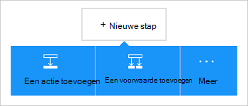

<properties
    pageTitle="De Office 365 Outlook connector in uw Apps logica toevoegen | Microsoft Azure"
    description="Maak logica apps met Office 365-connector aan het inschakelen van interactie met Office 365. Bijvoorbeeld: maken, bewerken en bijwerken van contactpersonen en agenda-items."
    services=""    
    documentationCenter=""     
    authors="MandiOhlinger"    
    manager="anneta"    
    editor="" 
    tags="connectors" />

<tags
ms.service="logic-apps"
ms.devlang="na"
ms.topic="article"
ms.tgt_pltfrm="na"
ms.workload="integration"
ms.date="10/18/2016"
ms.author="mandia"/>

# Aan de slag met Office 365 Outlook connector 

De Office 365 Outlook-connector zorgt voor interactie met Outlook in Office 365. Gebruik deze connector om te maken, bewerken, en bijwerken van contactpersonen en agenda-items, en ook toegevoegd aan andere verzenden en op e-mail reageren.

Met Office 365 Outlook u:

- Bouw uw werkstroom voor het gebruik van de functies voor e-mail en agenda in Office 365. 
- Met triggers kunt u uw werkstroom starten wanneer er sprake is van een nieuwe e-mail, wanneer een agenda-item wordt bijgewerkt en meer.
- Acties gebruiken voor het verzenden van een e-mailbericht, maakt u een nieuwe agendagebeurtenis en meer. Bijvoorbeeld, als er een nieuw object in Salesforce (een trigger), een e-mail verzenden aan uw Office 365 Outlook (een actie). 

In dit onderwerp ziet u hoe u Office 365 Outlook connector gebruiken in een app logica en ook bevat de triggers en acties.

>[AZURE.NOTE] Deze versie van het artikel is van toepassing op logica Apps algemene beschikbaarheid (GA).

Meer informatie over de logica Apps, raadpleegt u [Wat zijn de logica apps](../app-service-logic/app-service-logic-what-are-logic-apps.md) en [een logica-app maakt](../app-service-logic/app-service-logic-create-a-logic-app.md).

## Verbinding maken met Office 365

Voordat uw app logica toegang elke service tot, maakt u eerst een *verbinding* met de service. Een verbinding biedt connectiviteit tussen een logica-app en een andere service. Bijvoorbeeld als u wilt verbinden met Office 365 Outlook, moet u eerst een Office 365- *verbinding*. Een verbinding wilt maken, voert u de referenties die u normaal gesproken gebruiken voor toegang tot de service die u verbinding wilt maken. Met Office 365 Outlook, voert u de referenties op bij uw Office 365-account om de verbinding te maken.

## De verbinding maken

>[AZURE.INCLUDE [Steps to create a connection to Office 365](../../includes/connectors-create-api-office365-outlook.md)]

## Gebruik een trigger

Een trigger is een gebeurtenis die kan worden gebruikt om de werkstroom die is gedefinieerd in een app logica te starten. Triggers "poll uitvoeren onder' de service aan een interval en de frequentie die u wilt. [Meer informatie over activering](../app-service-logic/app-service-logic-what-are-logic-apps.md#logic-app-concepts).

1. Typ in de app logica 'office 365' voor een overzicht van de triggers:  

    

2. Selecteer **Office 365 Outlook - wanneer een evenement binnenkort wordt gestart**. Als er al een verbinding bestaat, selecteert u een agenda uit de vervolgkeuzelijst.

    

    Als u wordt gevraagd aan te melden, voert u het teken in de details van de verbinding maken. [De verbinding maken](connectors-create-api-office365-outlook.md#create-the-connection) in dit onderwerp vindt u de stappen. 

    > [AZURE.NOTE] In dit voorbeeld wordt de app logica uitgevoerd wanneer een agendagebeurtenis wordt bijgewerkt. Om de resultaten van deze trigger, moet u een andere actie die u SMS-bericht stuurt toevoegen. Bijvoorbeeld die teksten toevoegen de actie Twilio *stuurt* u wanneer het agenda-item is gestart in 15 minuten. 

3. Selecteer de knop **bewerken** en de waarden **frequentie** en **Interval** instellen. Bijvoorbeeld als u wilt dat de trigger poll uitvoeren onder elke 15 minuten, klikt u vervolgens de **frequentie** instelt op **minuut**en het **Interval** ingesteld op **15**. 

    

4. **Sla** uw wijzigingen (linkerbovenhoek van de werkbalk). Uw app logica is opgeslagen en mogelijk automatisch ingeschakeld.

## Gebruik een actie

Een actie is een bewerking uitgevoerd door de werkstroom die is gedefinieerd in een app logica. [Meer informatie over acties](../app-service-logic/app-service-logic-what-are-logic-apps.md#logic-app-concepts).

1. Selecteer het plusteken (+). Ziet u diverse opties selecteren: **een actie toevoegen**, **een voorwaarde toevoegen**of een van de **meer** opties.

    

2. Kies **een actie toevoegen**.

3. Typ in het tekstvak 'office 365' voor een overzicht van alle beschikbare acties.

     

4. Kies **Office 365 Outlook - contactpersoon maken**in ons voorbeeld. Als er al een verbinding bestaat, kiest u de **Map-ID**, **Voornaam**en andere eigenschappen:  

    

    Als u wordt gevraagd om de verbindingsgegevens, voert u de details om de verbinding te maken. [De verbinding maken](connectors-create-api-office365-outlook.md#create-the-connection) in dit onderwerp worden deze eigenschappen. 

    > [AZURE.NOTE] In dit voorbeeld maken wordt een nieuwe contactpersoon in Office 365 Outlook. Uitvoer van een andere trigger kunt u de nieuwe contactpersoon wilt maken. Bijvoorbeeld: toevoegen de trigger SalesForce *wanneer een object wordt gemaakt* . Voeg vervolgens de actie voor Office 365 Outlook- *contactpersoon maken* waarin de SalesForce-velden voor de nieuwe nieuwe contactpersoon maken in Office 365 wordt gebruikt. 

5. **Sla** uw wijzigingen (linkerbovenhoek van de werkbalk). Uw app logica is opgeslagen en mogelijk automatisch ingeschakeld.

## Technische Details

Hier volgen de details van de triggers, acties en -antwoorden die ondersteuning biedt voor deze verbinding:

## Office 365-triggers

|Trigger | Beschrijving|
|--- | ---|
|[Wanneer een evenement binnenkort wordt gestart](connectors-create-api-office365-outlook.md#when-an-upcoming-event-is-starting-soon)|Deze bewerking gebeurtenis een stroom wanneer een komende agenda-item wordt gestart.|
|[Wanneer een nieuwe e-mail binnenkomt](connectors-create-api-office365-outlook.md#when-a-new-email-arrives)|Deze bewerking activeert een stroom wanneer er een nieuwe e-mail binnenkomt|
|[Wanneer een nieuwe gebeurtenis is gemaakt](connectors-create-api-office365-outlook.md#when-a-new-event-is-created)|Deze bewerking gebeurtenis een stroom wanneer een nieuwe gebeurtenis wordt gemaakt in een agenda.|
|[Wanneer een gebeurtenis wordt gewijzigd](connectors-create-api-office365-outlook.md#when-an-event-is-modified)|Deze bewerking gebeurtenis een stroom wanneer een gebeurtenis is gewijzigd in een agenda.|

## Office 365-acties

|Actie|Beschrijving|
|--- | ---|
|[E-mailberichten ophalen](connectors-create-api-office365-outlook.md#get-emails)|Deze bewerking krijgt e-mailberichten van een map.|
|[Een e-mailbericht verzenden](connectors-create-api-office365-outlook.md#send-an-email)|Deze bewerking wordt een e-mailbericht verzonden.|
|[E-mail verwijderen](connectors-create-api-office365-outlook.md#delete-email)|Deze bewerking Hiermee verwijdert u een e-mailbericht door-id.|
|[Markeren als gelezen](connectors-create-api-office365-outlook.md#mark-as-read)|Deze bewerking wordt een e-mailbericht als gelezen gemarkeerd.|
|[E-mail beantwoorden](connectors-create-api-office365-outlook.md#reply-to-email)|Deze bewerking als u antwoorden op een e-mail.|
|[Bijlage ophalen](connectors-create-api-office365-outlook.md#get-attachment)|Deze bewerking krijgt een e-mailbijlage door-id.|
|[Verzenden van e-mail met opties](connectors-create-api-office365-outlook.md#send-email-with-options)|Deze bewerking stuurt een e-mailbericht met meerdere opties en wacht totdat de geadresseerde te beantwoorden met een van de opties.|
|[Goedkeuring van e-mailbericht verzenden](connectors-create-api-office365-outlook.md#send-approval-email)|Deze bewerking een goedkeuring-e-mailbericht verzendt en wacht een antwoord van de geadresseerde.|
|[Agenda's ophalen](connectors-create-api-office365-outlook.md#get-calendars)|Deze bewerking bevat kalenders die beschikbaar.|
|[Gebeurtenissen ophalen](connectors-create-api-office365-outlook.md#get-events)|Deze bewerking krijgt gebeurtenissen uit een agenda.|
|[Gebeurtenis maken](connectors-create-api-office365-outlook.md#create-event)|Hiermee maakt u een nieuwe gebeurtenis in een agenda.|
|[Gebeurtenis ophalen](connectors-create-api-office365-outlook.md#get-event)|Deze bewerking krijgt een specifieke gebeurtenis vanuit een agenda.|
|[Gebeurtenis verwijderen](connectors-create-api-office365-outlook.md#delete-event)|Deze bewerking Hiermee verwijdert u een gebeurtenis in een agenda.|
|[Bijwerken van de gebeurtenis](connectors-create-api-office365-outlook.md#update-event)|Deze bewerking bijgewerkt via een gebeurtenis in een agenda.|
|[Mappen met contactpersonen ophalen](connectors-create-api-office365-outlook.md#get-contact-folders)|Deze bewerking hier worden de beschikbare contactpersonenmappen.|
|[Contactpersonen ophalen](connectors-create-api-office365-outlook.md#get-contacts)|Deze bewerking krijgt contactpersonen vanuit een map met contactpersonen.|
|[Contactpersoon maken](connectors-create-api-office365-outlook.md#create-contact)|Deze bewerking wordt een nieuwe contactpersoon gemaakt in een map met contactpersonen.|
|[Krijgt contactpersoon](connectors-create-api-office365-outlook.md#get-contact)|Deze bewerking krijgt een specifieke contactpersoon uit een map met contactpersonen.|
|[Contactpersoon verwijderen](connectors-create-api-office365-outlook.md#delete-contact)|Deze bewerking verwijdert een contactpersoon uit een map met contactpersonen.|
|[Contactpersoon bijwerken](connectors-create-api-office365-outlook.md#update-contact)|Deze bewerking bijgewerkt via een contactpersoon in een map met contactpersonen.|

### Details van inwerkingtreding en een actie

In deze sectie, de specifieke informatie over elke trigger en een actie, inclusief eventuele verplicht of optioneel eigenschappen voor de invoer en alle bijbehorende uitvoer die is gekoppeld aan de verbindingslijn te bekijken.

#### Wanneer een evenement binnenkort wordt gestart
Deze bewerking gebeurtenis een stroom wanneer een komende agenda-item wordt gestart. 

|Naam van eigenschap| Weergavenaam|Beschrijving|
| ---|---|---|
|tabel *|Agenda-id|Unieke id van de agenda|
|lookAheadTimeInMinutes|Uiterlijk vooruit tijd|Tijd (in minuten) om te zoeken vooruit aanstaande evenementen|

Een sterretje (*) betekent dat de eigenschap is vereist.

##### Gegevens voor uitvoer
CalendarItemsList: De lijst met agenda-items

| Naam van eigenschap | Gegevenstype | Beschrijving |
|---|---|---|
|waarde|matrix|Lijst met agenda-items|

#### E-mailberichten ophalen
Deze bewerking krijgt e-mailberichten van een map. 

|Naam van eigenschap| Weergavenaam|Beschrijving|
| ---|---|---|
|Mappad|Pad naar de map|Pad van de map om op te halen e-mailberichten (standaard: 'Postvak in')|
|Boven|Boven|Aantal e-mailberichten om op te halen (standaard: 10)|
|fetchOnlyUnread|Alleen ongelezen berichten ophalen|Alleen ongelezen e-mailberichten ophalen?|
|includeAttachments|Bijlagen|Als u ook worden ingesteld op waar, bijlagen ingelezen samen met het e-mailbericht|
|searchQuery|Zoekopdracht|Zoekopdracht naar e-mailberichten filteren|
|overslaan|Overslaan|Aantal e-mailberichten om over te slaan (standaard: 0)|
|skipToken|Overslaan Token|Token gaat u verder met de nieuwe pagina ophalen|

Een sterretje (*) betekent dat de eigenschap is vereist.

##### Gegevens voor uitvoer
ReceiveMessage: E-mailbericht ontvangt

| Naam van eigenschap | Gegevenstype | Beschrijving |
|---|---|---|
|Van|tekenreeks|Van|
|Aan|tekenreeks|Aan|
|Onderwerp|tekenreeks|Onderwerp|
|Hoofdtekst|tekenreeks|Hoofdtekst|
|Urgentie|tekenreeks|Urgentie|
|Heeftbijlage|Booleaanse waarde|Bijlage heeft|
|ID|tekenreeks|Bericht-Id|
|Isgelezen|Booleaanse waarde|Wordt gelezen|
|DateTimeReceived|tekenreeks|Datum-tijd ontvangen|
|Bijlagen|matrix|Bijlagen|
|CC|tekenreeks|E-mailadressen gescheiden door puntkomma's zoals opgevensomeone@contoso.com|
|BCC|tekenreeks|E-mailadressen gescheiden door puntkomma's zoals opgevensomeone@contoso.com|
|IsHtml|Booleaanse waarde|Waarschuwing|

#### Een e-mailbericht verzenden
Deze bewerking wordt een e-mailbericht verzonden. 

|Naam van eigenschap| Weergavenaam|Beschrijving|
| ---|---|---|
|Er *|E-mail|E-mail|

Een sterretje (*) betekent dat de eigenschap is vereist.

##### Gegevens voor uitvoer
Geen.

#### E-mail verwijderen
Deze bewerking Hiermee verwijdert u een e-mailbericht door-id. 

|Naam van eigenschap| Weergavenaam|Beschrijving|
| ---|---|---|
|messageId *|Bericht-Id|Id van het e-mailbericht verwijderen|

Een sterretje (*) betekent dat de eigenschap is vereist.

##### Gegevens voor uitvoer
Geen.

#### Markeren als gelezen
Deze bewerking wordt een e-mailbericht als gelezen gemarkeerd. 

|Naam van eigenschap| Weergavenaam|Beschrijving|
| ---|---|---|
|messageId *|Bericht-Id|Id van het e-mailbericht worden gemarkeerd als gelezen|

Een sterretje (*) betekent dat de eigenschap is vereist.

##### Gegevens voor uitvoer
Geen.

#### E-mail beantwoorden
Deze bewerking als u antwoorden op een e-mail. 

|Naam van eigenschap| Weergavenaam|Beschrijving|
| ---|---|---|
|messageId *|Bericht-Id|Id van het e-mailbericht beantwoorden|
|Opmerking *|Opmerking|Opmerking beantwoorden|
|Allen beantwoorden|Allen beantwoorden|Reageren op alle geadresseerden|

Een sterretje (*) betekent dat de eigenschap is vereist.

##### Gegevens voor uitvoer
Geen.

#### Bijlage ophalen
Deze bewerking krijgt een e-mailbijlage door-id. 

|Naam van eigenschap| Weergavenaam|Beschrijving|
| ---|---|---|
|messageId *|Bericht-Id|Id van het e-mailbericht|
|attachmentId *|Bijlage-Id|Id van de bijlage downloaden|

Een sterretje (*) betekent dat de eigenschap is vereist.

##### Gegevens voor uitvoer
Geen.

#### Wanneer een nieuwe e-mail binnenkomt
Deze bewerking gebeurtenis een stroom wanneer een nieuwe e-mail binnenkomt.

|Naam van eigenschap| Weergavenaam|Beschrijving|
| ---|---|---|
|Mappad|Pad naar de map|E-mailmap om op te halen (standaard: Postvak in)|
|Aan|Aan|Geadresseerden e-mailadressen|
|Van|Van|Van adres|
|urgentie|Urgentie|Belang van het e-mailbericht (hoog, normaal, laag) (standaard: normaal)|
|fetchOnlyWithAttachment|Met de bijlagen|Alleen e-mailberichten met een bijlage ophalen|
|includeAttachments|Bijlagen|Bijlagen|
|subjectFilter|Onderwerp Filter|Tekenreeks moet worden gezocht in het onderwerp|

Een sterretje (*) betekent dat de eigenschap is vereist.

##### Gegevens voor uitvoer
TriggerBatchResponse [ReceiveMessage]

| Naam van eigenschap | Gegevenstype |
|---|---|
|waarde|matrix|

#### Verzenden van e-mail met opties
Deze bewerking stuurt een e-mailbericht met meerdere opties en wacht totdat de geadresseerde te beantwoorden met een van de opties. 

|Naam van eigenschap| Weergavenaam|Beschrijving|
| ---|---|---|
|optionsEmailSubscription *|Abonnement verzoek voor de opties voor e-mail|Abonnement verzoek voor de opties voor e-mail|

Een sterretje (*) betekent dat de eigenschap is vereist.

##### Gegevens voor uitvoer
SubscriptionResponse: Model voor abonnementen op E-mail goedkeuring

| Naam van eigenschap | Gegevenstype | Beschrijving |
|---|---|---|
|ID|tekenreeks|Id van het abonnement|
|resource|tekenreeks|Bron van de Abonnementaanvraag|
|notificationType|tekenreeks|Meldingstype|
|notificationUrl|tekenreeks|Melding Url|

#### Goedkeuring van e-mailbericht verzenden
Deze bewerking een goedkeuring-e-mailbericht verzendt en wacht een antwoord van de geadresseerde. 

|Naam van eigenschap| Weergavenaam|Beschrijving|
| ---|---|---|
|approvalEmailSubscription *|Abonnement verzoek om goedkeuring van e-mail|Abonnement verzoek om goedkeuring van e-mail|

Een sterretje (*) betekent dat de eigenschap is vereist.

##### Gegevens voor uitvoer
SubscriptionResponse: Model voor abonnementen op E-mail goedkeuring

| Naam van eigenschap | Gegevenstype | Beschrijving |
|---|---|---|
|ID|tekenreeks|Id van het abonnement|
|resource|tekenreeks|Bron van de Abonnementaanvraag|
|notificationType|tekenreeks|Meldingstype|
|notificationUrl|tekenreeks|Melding Url|

#### Agenda's ophalen
Deze bewerking bevat kalenders die beschikbaar. 

Er zijn geen parameters voor dit gesprek.

##### Gegevens voor uitvoer
TablesList

| Naam van eigenschap | Gegevenstype |
|---|---|
|waarde|matrix|

#### Gebeurtenissen ophalen
Deze bewerking krijgt gebeurtenissen uit een agenda. 

|Naam van eigenschap| Weergavenaam|Beschrijving|
| ---|---|---|
|tabel *|Agenda-id|Selecteer een agenda|
|$filter|Query filteren|Een query ODATA filter de vermeldingen geretourneerd beperken|
|$orderby|Sorteren op|Een query ODATA orderBy om aan te geven van de volgorde van items|
|$skip|Overslaan tellen|Aantal vermeldingen om over te slaan (standaard = 0)|
|$top|Maximale Get tellen|Maximum aantal vermeldingen om op te halen (standaard = 256)|

Een sterretje (*) betekent dat de eigenschap is vereist.

##### Gegevens voor uitvoer
CalendarEventList: De lijst met agenda-items

| Naam van eigenschap | Gegevenstype | Beschrijving |
|---|---|---|
|waarde|matrix|Lijst met agenda-items|

#### Gebeurtenis maken
Hiermee maakt u een nieuwe gebeurtenis in een agenda. 

|Naam van eigenschap| Weergavenaam|Beschrijving|
| ---|---|---|
|tabel *|Agenda-id|Selecteer een agenda|
|item *|Item|Gebeurtenis maken|

Een sterretje (*) betekent dat de eigenschap is vereist.

##### Gegevens voor uitvoer
CalendarEvent: Verbindingslijn bepaalde kalender gebeurtenis model class.

| Naam van eigenschap | Gegevenstype | Beschrijving |
|---|---|---|
|ID|tekenreeks|Unieke id van de gebeurtenis.|
|Deelnemers|matrix|Lijst met deelnemers voor de gebeurtenis.|
|Hoofdtekst|niet gedefinieerd|De hoofdtekst van het bericht dat is gekoppeld aan de gebeurtenis.|
|BodyPreview|tekenreeks|Het voorbeeld van het bericht dat is gekoppeld aan de gebeurtenis.|
|Categorieën|matrix|De categorieën die is gekoppeld aan de gebeurtenis.|
|ChangeKey|tekenreeks|Geeft de versie van het gebeurtenisobject. Telkens wanneer de gebeurtenis worden gewijzigd, wordt ook ChangeKey gewijzigd.|
|DateTimeCreated|tekenreeks|De datum en tijd waarop de gebeurtenis is gemaakt.|
|DateTimeLastModified|tekenreeks|De datum en tijd waarop de gebeurtenis voor het laatst is gewijzigd.|
|Einde|tekenreeks|De eindtijd van de gebeurtenis.|
|EndTimeZone|tekenreeks|Hiermee geeft u de tijdzone van de vergadering eindtijd. Deze waarde moet zoals gedefinieerd in Windows (voorbeeld: 'Pacific Standard Time').|
|Heeftbijlagen|Booleaanse waarde|Ingesteld op waar als de gebeurtenis met de bijlagen.|
|Urgentie|tekenreeks|Het belang van de gebeurtenis: laag, normaal of hoog.|
|IsAllDay|Booleaanse waarde|Ingesteld op waar als de gebeurtenis de hele dag duurt.|
|IsCancelled|Booleaanse waarde|Ingesteld op waar als de gebeurtenis is geannuleerd.|
|IsOrganizer|Booleaanse waarde|Ingesteld op waar als de afzender van het bericht ook de organisator is.|
|Locatie|niet gedefinieerd|De locatie van de gebeurtenis.|
|Organisator|niet gedefinieerd|De organisator van de gebeurtenis.|
|Terugkeerpatroon|niet gedefinieerd|Het terugkeerpatroon voor de gebeurtenis.|
|Herinnering|geheel getal|Tijd in minuten voor het begin van de gebeurtenis moeten worden herinnerd.|
|ResponseRequested|Booleaanse waarde|Ingesteld op waar als de afzender een antwoord als de gebeurtenis wordt geaccepteerd of geweigerd.|
|ResponseStatus|niet gedefinieerd|Geeft het type antwoord dat in antwoord op een bericht is verzonden.|
|SeriesMasterId|tekenreeks|Unieke id voor de reeks outmodel gebeurtenistype.|
|ShowAs|tekenreeks|Ziet u als gratis of bezet.|
|Starten|tekenreeks|De begintijd van de gebeurtenis.|
|StartTimeZone|tekenreeks|Hiermee geeft u de tijd begintijd zone van de vergadering. Deze waarde moet zoals gedefinieerd in Windows (voorbeeld: "Pacific Standard Time").|
|Onderwerp|tekenreeks|Het onderwerp van de gebeurtenis.|
|Type|tekenreeks|Het gebeurtenistype: één exemplaar, exemplaar, uitzondering of reeks basispagina.|
|WebLink|tekenreeks|Het voorbeeld van het bericht dat is gekoppeld aan de gebeurtenis.|

#### Gebeurtenis ophalen
Deze bewerking krijgt een specifieke gebeurtenis vanuit een agenda. 

|Naam van eigenschap| Weergavenaam|Beschrijving|
| ---|---|---|
|tabel *|Agenda-id|Selecteer een agenda|
|ID *|Lijstitem-id|Selecteer een gebeurtenis|

Een sterretje (*) betekent dat de eigenschap is vereist.

##### Gegevens voor uitvoer
CalendarEvent: Verbindingslijn bepaalde kalender gebeurtenis model class.

| Naam van eigenschap | Gegevenstype | Beschrijving |
|---|---|---|
|ID|tekenreeks|Unieke id van de gebeurtenis.|
|Deelnemers|matrix|Lijst met deelnemers voor de gebeurtenis.|
|Hoofdtekst|niet gedefinieerd|De hoofdtekst van het bericht dat is gekoppeld aan de gebeurtenis.|
|BodyPreview|tekenreeks|Het voorbeeld van het bericht dat is gekoppeld aan de gebeurtenis.|
|Categorieën|matrix|De categorieën die is gekoppeld aan de gebeurtenis.|
|ChangeKey|tekenreeks|Geeft de versie van het gebeurtenisobject. Telkens wanneer de gebeurtenis worden gewijzigd, wordt ook ChangeKey gewijzigd.|
|DateTimeCreated|tekenreeks|De datum en tijd waarop de gebeurtenis is gemaakt.|
|DateTimeLastModified|tekenreeks|De datum en tijd waarop de gebeurtenis voor het laatst is gewijzigd.|
|Einde|tekenreeks|De eindtijd van de gebeurtenis.|
|EndTimeZone|tekenreeks|Hiermee geeft u de tijdzone van de vergadering eindtijd. Deze waarde moet zoals gedefinieerd in Windows (voorbeeld: 'Pacific Standard Time').|
|Heeftbijlagen|Booleaanse waarde|Ingesteld op waar als de gebeurtenis met de bijlagen.|
|Urgentie|tekenreeks|Het belang van de gebeurtenis: laag, normaal of hoog.|
|IsAllDay|Booleaanse waarde|Ingesteld op waar als de gebeurtenis de hele dag duurt.|
|IsCancelled|Booleaanse waarde|Ingesteld op waar als de gebeurtenis is geannuleerd.|
|IsOrganizer|Booleaanse waarde|Ingesteld op waar als de afzender van het bericht ook de organisator is.|
|Locatie|niet gedefinieerd|De locatie van de gebeurtenis.|
|Organisator|niet gedefinieerd|De organisator van de gebeurtenis.|
|Terugkeerpatroon|niet gedefinieerd|Het terugkeerpatroon voor de gebeurtenis.|
|Herinnering|geheel getal|Tijd in minuten voor het begin van de gebeurtenis moeten worden herinnerd.|
|ResponseRequested|Booleaanse waarde|Ingesteld op waar als de afzender een antwoord als de gebeurtenis wordt geaccepteerd of geweigerd.|
|ResponseStatus|niet gedefinieerd|Geeft het type antwoord dat in antwoord op een bericht is verzonden.|
|SeriesMasterId|tekenreeks|Unieke id voor de reeks outmodel gebeurtenistype.|
|ShowAs|tekenreeks|Ziet u als gratis of bezet.|
|Starten|tekenreeks|De begintijd van de gebeurtenis.|
|StartTimeZone|tekenreeks|Hiermee geeft u de tijd begintijd zone van de vergadering. Deze waarde moet zoals gedefinieerd in Windows (voorbeeld: "Pacific Standard Time").|
|Onderwerp|tekenreeks|Het onderwerp van de gebeurtenis.|
|Type|tekenreeks|Het gebeurtenistype: één exemplaar, exemplaar, uitzondering of reeks basispagina.|
|WebLink|tekenreeks|Het voorbeeld van het bericht dat is gekoppeld aan de gebeurtenis.|

#### Gebeurtenis verwijderen
Deze bewerking Hiermee verwijdert u een gebeurtenis in een agenda. 

|Naam van eigenschap| Weergavenaam|Beschrijving|
| ---|---|---|
|tabel *|Agenda-id|Selecteer een agenda|
|ID *|ID|Selecteer een gebeurtenis|

Een sterretje (*) betekent dat de eigenschap is vereist.

##### Gegevens voor uitvoer
Geen.

#### Bijwerken van de gebeurtenis
Deze bewerking bijgewerkt via een gebeurtenis in een agenda. 

|Naam van eigenschap| Weergavenaam|Beschrijving|
| ---|---|---|
|tabel *|Agenda-id|Selecteer een agenda|
|ID *|ID|Selecteer een gebeurtenis|
|item *|Item|Gebeurtenis bijwerken|

Een sterretje (*) betekent dat de eigenschap is vereist.

##### Gegevens voor uitvoer
CalendarEvent: Verbindingslijn bepaalde kalender gebeurtenis model class.

| Naam van eigenschap | Gegevenstype | Beschrijving |
|---|---|---|
|ID|tekenreeks|Unieke id van de gebeurtenis.|
|Deelnemers|matrix|Lijst met deelnemers voor de gebeurtenis.|
|Hoofdtekst|niet gedefinieerd|De hoofdtekst van het bericht dat is gekoppeld aan de gebeurtenis.|
|BodyPreview|tekenreeks|Het voorbeeld van het bericht dat is gekoppeld aan de gebeurtenis.|
|Categorieën|matrix|De categorieën die is gekoppeld aan de gebeurtenis.|
|ChangeKey|tekenreeks|Geeft de versie van het gebeurtenisobject. Telkens wanneer de gebeurtenis worden gewijzigd, wordt ook ChangeKey gewijzigd.|
|DateTimeCreated|tekenreeks|De datum en tijd waarop de gebeurtenis is gemaakt.|
|DateTimeLastModified|tekenreeks|De datum en tijd waarop de gebeurtenis voor het laatst is gewijzigd.|
|Einde|tekenreeks|De eindtijd van de gebeurtenis.|
|EndTimeZone|tekenreeks|Hiermee geeft u de tijdzone van de vergadering eindtijd. Deze waarde moet zoals gedefinieerd in Windows (voorbeeld: 'Pacific Standard Time').|
|Heeftbijlagen|Booleaanse waarde|Ingesteld op waar als de gebeurtenis met de bijlagen.|
|Urgentie|tekenreeks|Het belang van de gebeurtenis: laag, normaal of hoog.|
|IsAllDay|Booleaanse waarde|Ingesteld op waar als de gebeurtenis de hele dag duurt.|
|IsCancelled|Booleaanse waarde|Ingesteld op waar als de gebeurtenis is geannuleerd.|
|IsOrganizer|Booleaanse waarde|Ingesteld op waar als de afzender van het bericht ook de organisator is.|
|Locatie|niet gedefinieerd|De locatie van de gebeurtenis.|
|Organisator|niet gedefinieerd|De organisator van de gebeurtenis.|
|Terugkeerpatroon|niet gedefinieerd|Het terugkeerpatroon voor de gebeurtenis.|
|Herinnering|geheel getal|Tijd in minuten voor het begin van de gebeurtenis moeten worden herinnerd.|
|ResponseRequested|Booleaanse waarde|Ingesteld op waar als de afzender een antwoord als de gebeurtenis wordt geaccepteerd of geweigerd.|
|ResponseStatus|niet gedefinieerd|Geeft het type antwoord dat in antwoord op een bericht is verzonden.|
|SeriesMasterId|tekenreeks|Unieke id voor de reeks outmodel gebeurtenistype.|
|ShowAs|tekenreeks|Ziet u als gratis of bezet.|
|Starten|tekenreeks|De begintijd van de gebeurtenis.|
|StartTimeZone|tekenreeks|Hiermee geeft u de tijd begintijd zone van de vergadering. Deze waarde moet zoals gedefinieerd in Windows (voorbeeld: "Pacific Standard Time").|
|Onderwerp|tekenreeks|Het onderwerp van de gebeurtenis.|
|Type|tekenreeks|Het gebeurtenistype: één exemplaar, exemplaar, uitzondering of reeks basispagina.|
|WebLink|tekenreeks|Het voorbeeld van het bericht dat is gekoppeld aan de gebeurtenis.|

#### Wanneer een nieuwe gebeurtenis is gemaakt
Deze bewerking gebeurtenis een stroom wanneer een nieuwe gebeurtenis wordt gemaakt in een agenda. 

|Naam van eigenschap| Weergavenaam|Beschrijving|
| ---|---|---|
|tabel *|Agenda-id|Selecteer een agenda|
|$filter|Query filteren|Een query ODATA filter de vermeldingen geretourneerd beperken|
|$orderby|Sorteren op|Een query ODATA orderBy om aan te geven van de volgorde van items|
|$skip|Overslaan tellen|Aantal vermeldingen om over te slaan (standaard = 0)|
|$top|Maximale Get tellen|Maximum aantal vermeldingen om op te halen (standaard = 256)|

Een sterretje (*) betekent dat de eigenschap is vereist.

##### Gegevens voor uitvoer
CalendarItemsList: De lijst met agenda-items

| Naam van eigenschap | Gegevenstype | Beschrijving |
|---|---|---|
|waarde|matrix|Lijst met agenda-items|

#### Wanneer een gebeurtenis wordt gewijzigd
Deze bewerking gebeurtenis een stroom wanneer een gebeurtenis is gewijzigd in een agenda. 

|Naam van eigenschap| Weergavenaam|Beschrijving|
| ---|---|---|
|tabel *|Agenda-id|Selecteer een agenda|
|$filter|Query filteren|Een query ODATA filter de vermeldingen geretourneerd beperken|
|$orderby|Sorteren op|Een query ODATA orderBy om aan te geven van de volgorde van items|
|$skip|Overslaan tellen|Aantal vermeldingen om over te slaan (standaard = 0)|
|$top|Maximale Get tellen|Maximum aantal vermeldingen om op te halen (standaard = 256)|

Een sterretje (*) betekent dat de eigenschap is vereist.

##### Gegevens voor uitvoer
CalendarItemsList: De lijst met agenda-items

| Naam van eigenschap | Gegevenstype | Beschrijving |
|---|---|---|
|waarde|matrix|Lijst met agenda-items|

#### Mappen met contactpersonen ophalen
Deze bewerking hier worden de beschikbare contactpersonenmappen. 

Er zijn geen parameters voor dit gesprek.

##### Gegevens voor uitvoer
TablesList

| Naam van eigenschap | Gegevenstype |
|---|---|
|waarde|matrix|

#### Contactpersonen ophalen
Deze bewerking krijgt contactpersonen vanuit een map met contactpersonen. 

|Naam van eigenschap| Weergavenaam|Beschrijving|
| ---|---|---|
|tabel *|Map-id|Unieke id van de map met contactpersonen om op te halen|
|$filter|Query filteren|Een query ODATA filter de vermeldingen geretourneerd beperken|
|$orderby|Sorteren op|Een query ODATA orderBy om aan te geven van de volgorde van items|
|$skip|Overslaan tellen|Aantal vermeldingen om over te slaan (standaard = 0)|
|$top|Maximale Get tellen|Maximum aantal vermeldingen om op te halen (standaard = 256)|

Een sterretje (*) betekent dat de eigenschap is vereist.

##### Gegevens voor uitvoer
ContactList: De lijst met contactpersonen

| Naam van eigenschap | Gegevenstype | Beschrijving |
|---|---|---|
|waarde|matrix|Lijst met contactpersonen|

#### Contactpersoon maken
Deze bewerking wordt een nieuwe contactpersoon gemaakt in een map met contactpersonen. 

|Naam van eigenschap| Weergavenaam|Beschrijving|
| ---|---|---|
|tabel *|Map-id|Selecteer een map met contactpersonen|
|item *|Item|Contactpersoon maken|

Een sterretje (*) betekent dat de eigenschap is vereist.

##### Gegevens voor uitvoer
Contactpersoon: contactpersoon

| Naam van eigenschap | Gegevenstype | Beschrijving |
|---|---|---|
|ID|tekenreeks|Unieke id van de contactpersoon.|
|ParentFolderId worden|tekenreeks|De ID van de hoofdmap van de contactpersoon|
|Verjaardag|tekenreeks|De verjaardag van de contactpersoon.|
|Opslaan|tekenreeks|De naam van de contactpersoon is opgeslagen.|
|Weergavenaam|tekenreeks|De weergavenaam van de contactpersoon.|
|GivenName|tekenreeks|Voornaam van de contactpersoon.|
|Initialen|tekenreeks|Initialen van de contactpersoon.|
|Afzonderlijk|tekenreeks|Naam van de midden van de contactpersoon.|
|Bijnaam|tekenreeks|Bijnaam van de contactpersoon.|
|Achternaam|tekenreeks|Achternaam van het contact.|
|Titel|tekenreeks|De titel van de contactpersoon.|
|Generatie|tekenreeks|Generatie van de contactpersoon.|
|EmailAddresses|matrix|Van de contactpersoon naar e-mailadressen.|
|ImAddresses|matrix|Het direct SMS (IM) adressen van de contactpersoon in.|
|Functie|tekenreeks|Functie van de contactpersoon.|
|Bedrijfsnaam|tekenreeks|De naam van het bedrijf van de contactpersoon.|
|Afdeling|tekenreeks|Afdeling van de contactpersoon.|
|OfficeLocation|tekenreeks|De locatie van office van de contactpersoon.|
|Beroep|tekenreeks|Beroep van de contactpersoon.|
|BusinessHomePage|tekenreeks|De startpagina van de bedrijven van de contactpersoon.|
|AssistantName|tekenreeks|De naam van de Office-assistent van de contactpersoon.|
|Manager|tekenreeks|De naam van de manager van de contactpersoon.|
|HomePhones|matrix|Telefoon thuis-nummers van de contactpersoon.|
|BusinessPhones|matrix|Telefoonnummers voor bedrijven van de contactpersoon|
|MobilePhone1|tekenreeks|Het mobiele telefoonnummer van de contactpersoon.|
|Huisadres|niet gedefinieerd|Van de contactpersoon privé-adres.|
|Werkadres|niet gedefinieerd|Werkadres van de contactpersoon.|
|OtherAddress|niet gedefinieerd|Andere adressen voor de contactpersoon.|
|YomiCompanyName|tekenreeks|De naam van het fonetische Japanse bedrijf van de contactpersoon.|
|YomiGivenName|tekenreeks|De fonetische Japanse opgegeven naam (voornaam) van de contactpersoon.|
|YomiSurname|tekenreeks|De fonetische Japanse Achternaam (achternaam) van de contactpersoon|
|Categorieën|matrix|De categorieën die is gekoppeld aan de contactpersoon.|
|ChangeKey|tekenreeks|Geeft aan wat de versie van het gebeurtenisobject|
|DateTimeCreated|tekenreeks|De tijd die de contactpersoon is gemaakt.|
|DateTimeLastModified|tekenreeks|De tijd die de contactpersoon is gewijzigd.|

#### Krijgt contactpersoon
Deze bewerking krijgt een specifieke contactpersoon uit een map met contactpersonen. 

|Naam van eigenschap| Weergavenaam|Beschrijving|
| ---|---|---|
|tabel *|Map-id|Selecteer een map met contactpersonen|
|ID *|Lijstitem-id|Unieke id van een contactpersoon om op te halen|

Een sterretje (*) betekent dat de eigenschap is vereist.

##### Gegevens voor uitvoer
Contactpersoon: contactpersoon

| Naam van eigenschap | Gegevenstype | Beschrijving |
|---|---|---|
|ID|tekenreeks|Unieke id van de contactpersoon.|
|ParentFolderId worden|tekenreeks|De ID van de hoofdmap van de contactpersoon|
|Verjaardag|tekenreeks|De verjaardag van de contactpersoon.|
|Opslaan|tekenreeks|De naam van de contactpersoon is opgeslagen.|
|Weergavenaam|tekenreeks|De weergavenaam van de contactpersoon.|
|GivenName|tekenreeks|Voornaam van de contactpersoon.|
|Initialen|tekenreeks|Initialen van de contactpersoon.|
|Afzonderlijk|tekenreeks|Naam van de midden van de contactpersoon.|
|Bijnaam|tekenreeks|Bijnaam van de contactpersoon.|
|Achternaam|tekenreeks|Achternaam van het contact.|
|Titel|tekenreeks|De titel van de contactpersoon.|
|Generatie|tekenreeks|Generatie van de contactpersoon.|
|EmailAddresses|matrix|Van de contactpersoon naar e-mailadressen.|
|ImAddresses|matrix|Het direct SMS (IM) adressen van de contactpersoon in.|
|Functie|tekenreeks|Functie van de contactpersoon.|
|Bedrijfsnaam|tekenreeks|De naam van het bedrijf van de contactpersoon.|
|Afdeling|tekenreeks|Afdeling van de contactpersoon.|
|OfficeLocation|tekenreeks|De locatie van office van de contactpersoon.|
|Beroep|tekenreeks|Beroep van de contactpersoon.|
|BusinessHomePage|tekenreeks|De startpagina van de bedrijven van de contactpersoon.|
|AssistantName|tekenreeks|De naam van de Office-assistent van de contactpersoon.|
|Manager|tekenreeks|De naam van de manager van de contactpersoon.|
|HomePhones|matrix|Telefoon thuis-nummers van de contactpersoon.|
|BusinessPhones|matrix|Telefoonnummers voor bedrijven van de contactpersoon|
|MobilePhone1|tekenreeks|Het mobiele telefoonnummer van de contactpersoon.|
|Huisadres|niet gedefinieerd|Van de contactpersoon privé-adres.|
|Werkadres|niet gedefinieerd|Werkadres van de contactpersoon.|
|OtherAddress|niet gedefinieerd|Andere adressen voor de contactpersoon.|
|YomiCompanyName|tekenreeks|De naam van het fonetische Japanse bedrijf van de contactpersoon.|
|YomiGivenName|tekenreeks|De fonetische Japanse opgegeven naam (voornaam) van de contactpersoon.|
|YomiSurname|tekenreeks|De fonetische Japanse Achternaam (achternaam) van de contactpersoon|
|Categorieën|matrix|De categorieën die is gekoppeld aan de contactpersoon.|
|ChangeKey|tekenreeks|Geeft aan wat de versie van het gebeurtenisobject|
|DateTimeCreated|tekenreeks|De tijd die de contactpersoon is gemaakt.|
|DateTimeLastModified|tekenreeks|De tijd die de contactpersoon is gewijzigd.|

#### Contactpersoon verwijderen
Deze bewerking verwijdert een contactpersoon uit een map met contactpersonen. 

|Naam van eigenschap| Weergavenaam|Beschrijving|
| ---|---|---|
|tabel *|Map-id|Selecteer een map met contactpersonen|
|ID *|ID|Unieke id van contactpersoon verwijderen|

Een sterretje (*) betekent dat de eigenschap is vereist.

##### Gegevens voor uitvoer
Geen.

#### Contactpersoon bijwerken
Deze bewerking bijgewerkt via een contactpersoon in een map met contactpersonen. 

|Naam van eigenschap| Weergavenaam|Beschrijving|
| ---|---|---|
|tabel *|Map-id|Selecteer een map met contactpersonen|
|ID *|ID|Unieke id van contactpersoon bijwerken|
|item *|Item|Neem contact op met item als u wilt bijwerken|

Een sterretje (*) betekent dat de eigenschap is vereist.

##### Gegevens voor uitvoer
Contactpersoon: contactpersoon

| Naam van eigenschap | Gegevenstype | Beschrijving |
|---|---|---|
|ID|tekenreeks|Unieke id van de contactpersoon.|
|ParentFolderId worden|tekenreeks|De ID van de hoofdmap van de contactpersoon|
|Verjaardag|tekenreeks|De verjaardag van de contactpersoon.|
|Opslaan|tekenreeks|De naam van de contactpersoon is opgeslagen.|
|Weergavenaam|tekenreeks|De weergavenaam van de contactpersoon.|
|GivenName|tekenreeks|Voornaam van de contactpersoon.|
|Initialen|tekenreeks|Initialen van de contactpersoon.|
|Afzonderlijk|tekenreeks|Naam van de midden van de contactpersoon.|
|Bijnaam|tekenreeks|Bijnaam van de contactpersoon.|
|Achternaam|tekenreeks|Achternaam van het contact.|
|Titel|tekenreeks|De titel van de contactpersoon.|
|Generatie|tekenreeks|Generatie van de contactpersoon.|
|EmailAddresses|matrix|Van de contactpersoon naar e-mailadressen.|
|ImAddresses|matrix|Het direct SMS (IM) adressen van de contactpersoon in.|
|Functie|tekenreeks|Functie van de contactpersoon.|
|Bedrijfsnaam|tekenreeks|De naam van het bedrijf van de contactpersoon.|
|Afdeling|tekenreeks|Afdeling van de contactpersoon.|
|OfficeLocation|tekenreeks|De locatie van office van de contactpersoon.|
|Beroep|tekenreeks|Beroep van de contactpersoon.|
|BusinessHomePage|tekenreeks|De startpagina van de bedrijven van de contactpersoon.|
|AssistantName|tekenreeks|De naam van de Office-assistent van de contactpersoon.|
|Manager|tekenreeks|De naam van de manager van de contactpersoon.|
|HomePhones|matrix|Telefoon thuis-nummers van de contactpersoon.|
|BusinessPhones|matrix|Telefoonnummers voor bedrijven van de contactpersoon|
|MobilePhone1|tekenreeks|Het mobiele telefoonnummer van de contactpersoon.|
|Huisadres|niet gedefinieerd|Van de contactpersoon privé-adres.|
|Werkadres|niet gedefinieerd|Werkadres van de contactpersoon.|
|OtherAddress|niet gedefinieerd|Andere adressen voor de contactpersoon.|
|YomiCompanyName|tekenreeks|De naam van het fonetische Japanse bedrijf van de contactpersoon.|
|YomiGivenName|tekenreeks|De fonetische Japanse opgegeven naam (voornaam) van de contactpersoon.|
|YomiSurname|tekenreeks|De fonetische Japanse Achternaam (achternaam) van de contactpersoon|
|Categorieën|matrix|De categorieën die is gekoppeld aan de contactpersoon.|
|ChangeKey|tekenreeks|Geeft aan wat de versie van het gebeurtenisobject|
|DateTimeCreated|tekenreeks|De tijd die de contactpersoon is gemaakt.|
|DateTimeLastModified|tekenreeks|De tijd die de contactpersoon is gewijzigd.|

## HTTP-antwoorden

De acties en triggers bovenstaande kunnen retourneren een of meer van de volgende codes van de HTTP-status: 

|Naam|Beschrijving|
|---|---|
|200|OK|
|202|Geaccepteerd|
|400|Ongeldige aanvraag|
|401|Onbevoegde|
|403|Verboden|
|404|Niet gevonden|
|500|Interne serverfout. Onbekende fout|
|Standaard|Bewerking is mislukt.|

## Volgende stappen

[Een app logica maken](../app-service-logic/app-service-logic-create-a-logic-app.md). Verken de andere beschikbare connectors in logica-Apps op onze [lijst API's](apis-list.md).