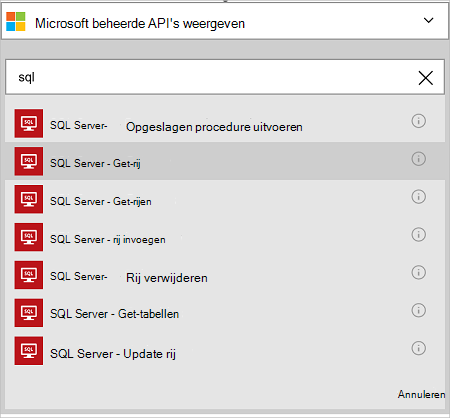
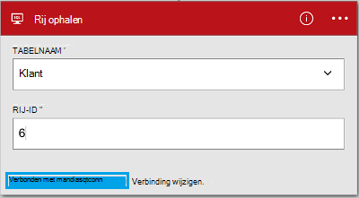

<properties
    pageTitle="De verbindingslijn Azure SQL-Database in uw Apps logica toevoegen | Microsoft Azure"
    description="Overzicht van Azure SQL Database-connector met REST API parameters"
    services=""
    documentationCenter="" 
    authors="MandiOhlinger"
    manager="anneta"
    editor=""
    tags="connectors"/>

<tags
   ms.service="logic-apps"
   ms.devlang="na"
   ms.topic="article"
   ms.tgt_pltfrm="na"
   ms.workload="na" 
   ms.date="10/18/2016"
   ms.author="mandia"/>

# Aan de slag met de verbindingslijn Azure SQL-Database
Met de verbindingslijn Azure SQL-Database, maakt u werkstromen voor uw organisatie die gegevens in tabellen beheren. 

Met SQL-Database, u:

- Uw werkstroom maken door het toevoegen van een nieuwe klant bent met een klanten-database of een order in een orderdatabase bijwerken.
- Acties gebruiken om te krijgen van een rij met gegevens, een nieuwe rij invoegen en zelfs verwijderen. Bijvoorbeeld wanneer een record is gemaakt in Dynamics CRM Online (een trigger), klikt u vervolgens een rij invoegen in een Azure SQL-Database (een actie). 

In dit onderwerp ziet u hoe u SQL-Database connector gebruiken in een app logica en worden ook de acties weergegeven.

>[AZURE.NOTE] Deze versie van het artikel is van toepassing op logica Apps algemene beschikbaarheid (GA). 

Meer informatie over de logica Apps, raadpleegt u [Wat zijn de logica apps](../app-service-logic/app-service-logic-what-are-logic-apps.md) en [een logica-app maakt](../app-service-logic/app-service-logic-create-a-logic-app.md).

## Verbinding maken met Azure SQL-Database

Voordat uw app logica toegang elke service tot, maakt u eerst een *verbinding* met de service. Een verbinding biedt connectiviteit tussen een logica-app en een andere service. Bijvoorbeeld als u verbinding kunt maken met SQL-Database, wilt u eerst een SQL-Database maken *verbinding*. Een verbinding wilt maken, moet u de referenties die u normaal gesproken gebruiken voor toegang tot de service die u verbinding met maakt invoeren. Zo is, in SQL-Database, Voer uw referenties SQL-Database om de verbinding te maken. 

#### De verbinding maken

>[AZURE.INCLUDE [Create the connection to SQL Azure](../../includes/connectors-create-api-sqlazure.md)]

## Gebruik een trigger

Deze verbindingslijn is geen eventuele triggers. Gebruik andere triggers de logica-app, zoals een terugkeerpatroon-trigger, een HTTP Webhook-trigger, triggers beschikbaar voor communicatie met andere verbindingslijnen en meer te starten. [Een app logica maken](../app-service-logic/app-service-logic-create-a-logic-app.md) wordt een voorbeeld.

## Gebruik een actie
    
Een actie is een bewerking uitgevoerd door de werkstroom die is gedefinieerd in een app logica. [Meer informatie over acties](../app-service-logic/app-service-logic-what-are-logic-apps.md#logic-app-concepts).

1. Selecteer het plusteken (+). Ziet u diverse opties selecteren: **een actie toevoegen**, **een voorwaarde toevoegen**of een van de **meer** opties.

    

2. Kies **een actie toevoegen**.

3. Typ in het tekstvak 'sql' voor een overzicht van alle beschikbare acties.

     

4. Kies in ons voorbeeld **SQL Server - rij ophalen**. Als er al een verbinding bestaat, selecteert u de **naam van de tabel** in de vervolgkeuzelijst en voer de **Rij-ID** die u wilt retourneren.

    

    Als u wordt gevraagd om de verbindingsgegevens, voert u de details om de verbinding te maken. [De verbinding maken](connectors-create-api-sqlazure.md#create-the-connection) in dit onderwerp worden deze eigenschappen. 

    > [AZURE.NOTE] In dit voorbeeld we een rij uit een tabel geretourneerd. Als u wilt de gegevens in deze rij wordt weergegeven, kunt u een andere actie die Hiermee maakt u een bestand met de velden uit de tabel toevoegen. Bijvoorbeeld een OneDrive-actie die wordt gebruikt de velden Voornaam en achternaam naar een nieuw bestand maken in de cloud opslag-account toevoegen. 

5. **Sla** uw wijzigingen (linkerbovenhoek van de werkbalk). Uw app logica is opgeslagen en mogelijk automatisch ingeschakeld.

## Technische Details

## SQL-Database acties
Een actie is een bewerking uitgevoerd door de werkstroom die is gedefinieerd in een app logica. De SQL-Database connector bevat de volgende bewerkingen uit. 

|Actie|Beschrijving|
|--- | ---|
|[ExecuteProcedure](connectors-create-api-sqlazure.md#execute-stored-procedure)|Een opgeslagen procedure uitvoert in SQL|
|[GetRow](connectors-create-api-sqlazure.md#get-row)|Eén rij opgehaald uit een SQL-tabel|
|[GetRows](connectors-create-api-sqlazure.md#get-rows)|Rijen opgehaald uit een SQL-tabel|
|[InsertRow](connectors-create-api-sqlazure.md#insert-row)|Een nieuwe rij invoegen in een SQL-tabel|
|[DeleteRow](connectors-create-api-sqlazure.md#delete-row)|Hiermee verwijdert u een rij uit een SQL-tabel|
|[GetTables](connectors-create-api-sqlazure.md#get-tables)|Tabellen opgehaald uit een SQL-database|
|[UpdateRow](connectors-create-api-sqlazure.md#update-row)|Een bestaande rij in een SQL-tabel wordt bijgewerkt|

### Actiedetails

In deze sectie, de specifieke informatie over elke actie, inclusief eventuele verplicht of optioneel eigenschappen voor de invoer en alle bijbehorende uitvoer die is gekoppeld aan de verbindingslijn te bekijken.

#### Opgeslagen procedure uitvoeren
Een opgeslagen procedure uitvoert in SQL.  

| Naam van eigenschap| Weergavenaam |Beschrijving|
| ---|---|---|
|procedure * | De procedurenaam van de | De naam van de opgeslagen procedure die u wilt uitvoeren |
|parameters * | Invoerparameters | De parameters zijn dynamische en op basis van de opgeslagen procedure die u kiest.    Als u de voorbeelddatabase Adventure Works gebruikt, kiest u bijvoorbeeld de procedure *ufnGetCustomerInformation* die zijn opgeslagen. De invoerparameter **Klant-ID** wordt weergegeven. Voer "6" of een van de andere klant id's. |

Een sterretje (*) betekent dat de eigenschap is vereist.

##### Gegevens voor uitvoer
ProcedureResult: Uitvoert van uitvoering van de opgeslagen procedure

| Naam van eigenschap | Gegevenstype | Beschrijving |
|---|---|---|
|OutputParameters|object|Uitvoer parameterwaarden |
|ReturnCode|geheel getal|Geretourneerde code van een procedure |
|Resultaatsets|object| Resultatensets|

#### Rij ophalen 
Haalt één rij uit een SQL-tabel.  

| Naam van eigenschap| Weergavenaam |Beschrijving|
| ---|---|---|
|tabel * | Tabelnaam |Naam van de SQL-tabel|
|ID * | Rij-id |Unieke id van de rij om op te halen|

Een sterretje (*) betekent dat de eigenschap is vereist.

##### Gegevens voor uitvoer
Item

| Naam van eigenschap | Gegevenstype |
|---|---|
|ItemInternalId|tekenreeks|

#### Rijen ophalen 
Rijen opgehaald uit een SQL-tabel.  

|Naam van eigenschap| Weergavenaam|Beschrijving|
| ---|---|---|
|tabel *|Tabelnaam|Naam van de SQL-tabel|
|$skip|Overslaan tellen|Aantal vermeldingen om over te slaan (standaard = 0)|
|$top|Maximale Get tellen|Maximum aantal vermeldingen om op te halen (standaard = 256)|
|$filter|Query filteren|Een query voor het filter van ODATA om het aantal items te beperken|
|$orderby|Sorteren op|Een query ODATA orderBy om aan te geven van de volgorde van items|

Een sterretje (*) betekent dat de eigenschap is vereist.

##### Gegevens voor uitvoer
ItemsList

| Naam van eigenschap | Gegevenstype |
|---|---|
|waarde|matrix|

#### Rij invoegen 
Een nieuwe rij invoegen in een SQL-tabel.  

|Naam van eigenschap| Weergavenaam|Beschrijving|
| ---|---|---|
|tabel *|Tabelnaam|Naam van de SQL-tabel|
|item *|Rij|Rij invoegen in de opgegeven tabel in SQL|

Een sterretje (*) betekent dat de eigenschap is vereist.

##### Gegevens voor uitvoer
Item

| Naam van eigenschap | Gegevenstype |
|---|---|
|ItemInternalId|tekenreeks|

#### Rij verwijderen 
Hiermee verwijdert u een rij uit een SQL-tabel.  

|Naam van eigenschap| Weergavenaam|Beschrijving|
| ---|---|---|
|tabel *|Tabelnaam|Naam van de SQL-tabel|
|ID *|Rij-id|Unieke id van de rij verwijderen|

Een sterretje (*) betekent dat de eigenschap is vereist.

##### Gegevens voor uitvoer
Geen.

#### Tabellen opvragen 
Tabellen opgehaald uit een SQL-database.  

Er zijn geen parameters voor dit gesprek. 

##### Gegevens voor uitvoer 
TablesList

| Naam van eigenschap | Gegevenstype |
|---|---|
|waarde|matrix|

#### Rij bijwerken 
Een bestaande rij in een SQL-tabel worden bijgewerkt.  

|Naam van eigenschap| Weergavenaam|Beschrijving|
| ---|---|---|
|tabel *|Tabelnaam|Naam van de SQL-tabel|
|ID *|Rij-id|Unieke id van de rij bijwerken|
|item *|Rij|Rij met de bijgewerkte waarden|

Een sterretje (*) betekent dat de eigenschap is vereist.

##### Gegevens voor uitvoer  
Item

| Naam van eigenschap | Gegevenstype |
|---|---|
|ItemInternalId|tekenreeks|

### HTTP-antwoorden

Wanneer u oproepen naar de verschillende acties, krijgt u mogelijk bepaalde antwoorden. De volgende tabel bevat een overzicht van de antwoorden en de bijbehorende beschrijvingen:  

|Naam|Beschrijving|
|---|---|
|200|OK|
|202|Geaccepteerd|
|400|Ongeldige aanvraag|
|401|Onbevoegde|
|403|Verboden|
|404|Niet gevonden|
|500|Interne serverfout. Onbekende fout|
|Standaard|Bewerking is mislukt.|

## Volgende stappen

[Een app logica maken](../app-service-logic/app-service-logic-create-a-logic-app.md). Verken de andere beschikbare connectors in logica-Apps op onze [lijst API's](apis-list.md).
