<properties
    pageTitle="Informatie over het gebruik van de verbindingslijn Twitter in logica apps | Microsoft Azure"
    description="Overzicht van Twitter verbindingslijn met REST API parameters"
    services=""
    documentationCenter="" 
    authors="msftman"
    manager="erikre"
    editor=""
    tags="connectors"/>

<tags
   ms.service="multiple"
   ms.devlang="na"
   ms.topic="article"
   ms.tgt_pltfrm="na"
   ms.workload="na" 
   ms.date="07/18/2016"
   ms.author="deonhe"/>

# Aan de slag met de Twitter-connector

Met de Twitter-connector kunt u het volgende doen:

- Zet tweets en tweets ophalen
- Access tijdlijnen, vrienden en Volgers
- Geen van de andere acties en triggers hieronder beschreven uitvoeren  

Als u wilt gebruiken op [een verbindingslijn](./apis-list.md), moet u eerst een logica-app maakt. U kunt aan de slag door nu een logica-app te [maken](../app-service-logic/app-service-logic-create-a-logic-app.md).  

## Verbinding maken met Twitter

Voordat uw app logica toegang elke service tot, moet u eerst een *verbinding* met de service te maken. Een [verbinding](./connectors-overview.md) biedt connectiviteit tussen een logica-app en een andere service.  

### Een verbinding maken met Twitter

>[AZURE.INCLUDE [Steps to create a connection to Twitter](../../includes/connectors-create-api-twitter.md)]

## Gebruik een Twitter-trigger

Een trigger is een gebeurtenis die kan worden gebruikt om de werkstroom die is gedefinieerd in een app logica te starten. [Meer informatie over activering](../app-service-logic/app-service-logic-what-are-logic-apps.md#logic-app-concepts).

In dit voorbeeld ziet ik u hoe u zoeken naar #Seattle en, als #Seattle wordt gevonden, het bijwerken van een bestand in Dropbox met de tekst van de tweet met de trigger **wanneer een nieuwe tweet is geplaatst** . In een voorbeeld enterprise kon u zoeken naar de naam van uw bedrijf en een SQL-database bijwerken met de tekst van de tweet.

1. *Twitter-* invoeren in het zoekvak op de logica apps ontwerpfunctie en selecteert u de trigger **Twitter - wanneer een nieuwe tweet is geplaatst**   
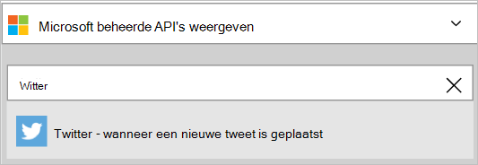  
- *#Seattle* invoeren in het besturingselement voor **Tekst zoeken**  
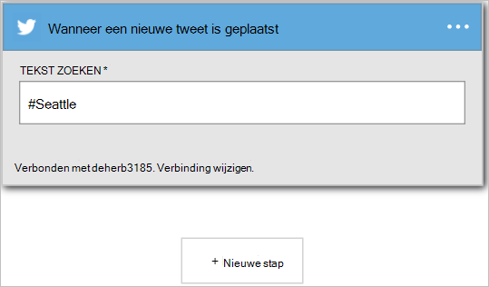 

Nu is uw app logica geconfigureerd met een trigger die een uitvoeren van de andere triggers en acties in de werkstroom wordt gestart. 

>[AZURE.NOTE]Voor een logica-app wilt gebruiken, moet ten minste één trigger en een actie bevatten. Volg de stappen in de volgende sectie voor het toevoegen van een actie.  

## Een voorwaarde toevoegen
Aangezien we alleen geïnteresseerd in tweets van gebruikers met meer dan 50 gebruikers bent, moet een voorwaarde die het aantal Volgers bevestigt eerst worden toegevoegd aan de logica-app.  

1. Selecteer **+ nieuwe stap** de actie die u uitvoeren wilt wanneer aan #Seattle vindt u in een nieuwe tweet toevoegen  
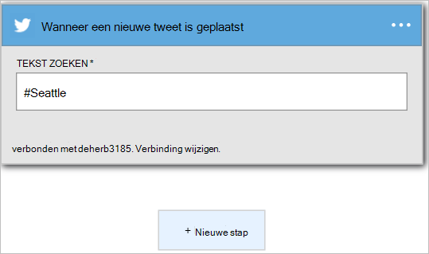  
- Selecteer de koppeling **toevoegen een voorwaarde** .  
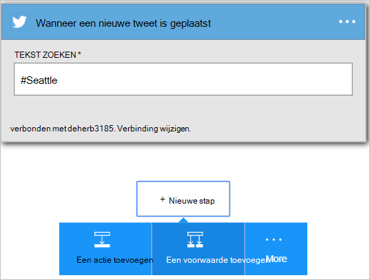   
Hiermee opent u het beheer van de **voorwaarden** waar u de voorwaarden zoals *is gelijk aan*, kan controleren *is minder dan*, *groter is dan*, *bevat*, enzovoort.  
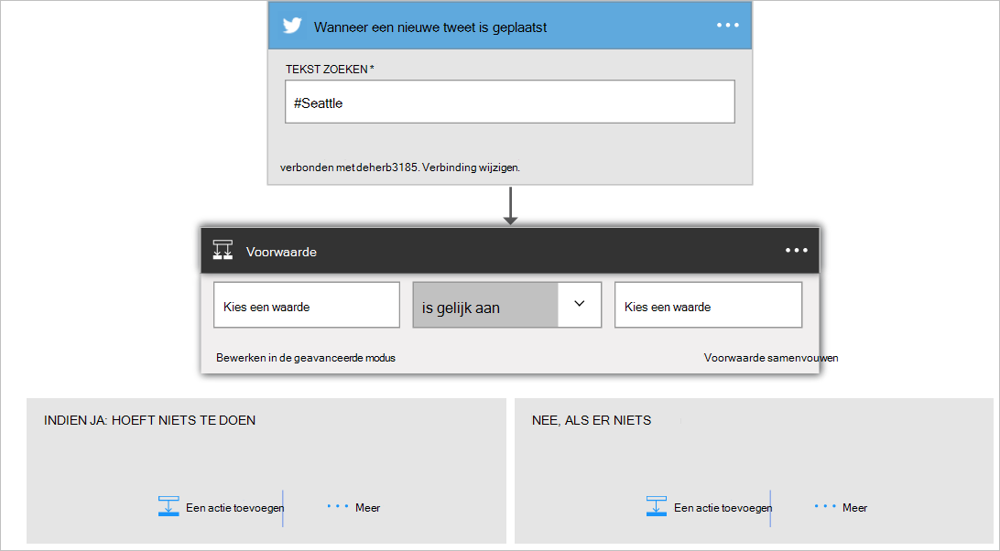   
- Selecteer het besturingselement **een waarde kiezen** .  
In dit besturingselement, kunt u een of meer van de eigenschappen van een eerdere bewerkingen of triggers als de waarde waarvan voorwaarde wordt geëvalueerd waar of ONWAAR.
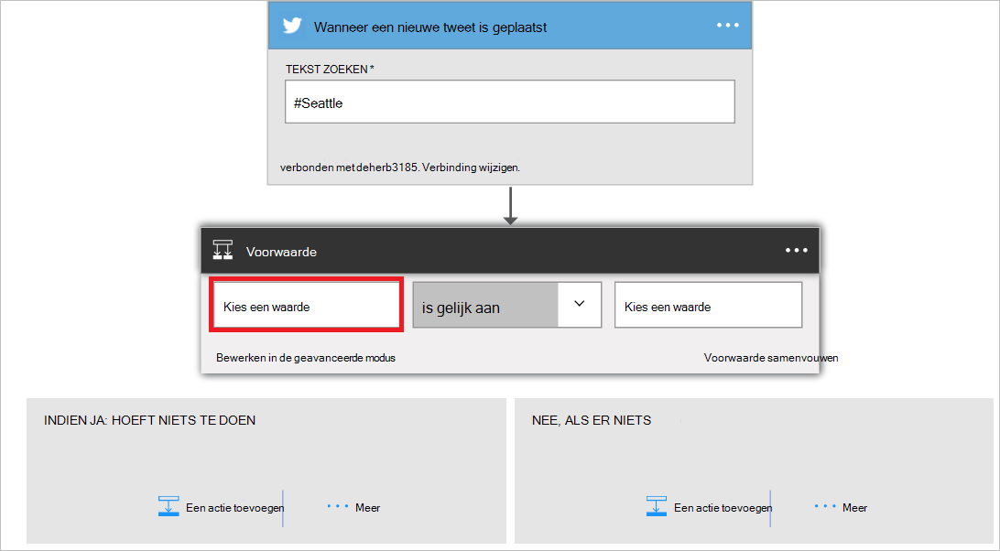   
- Selecteer de **...** om de lijst met eigenschappen uitvouwen zodat u de eigenschappen die beschikbaar zijn kunt zien.        
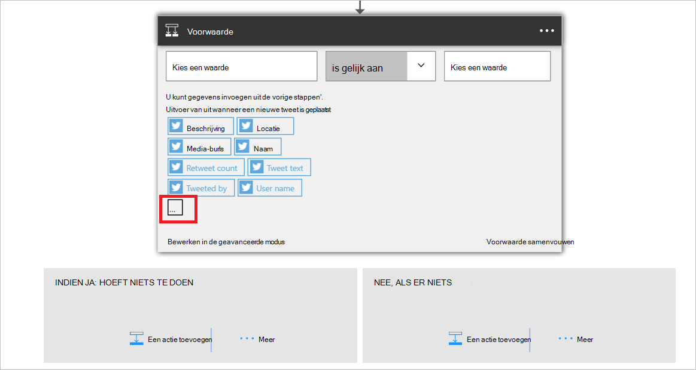   
- Selecteer de eigenschap **Volgers count** .    
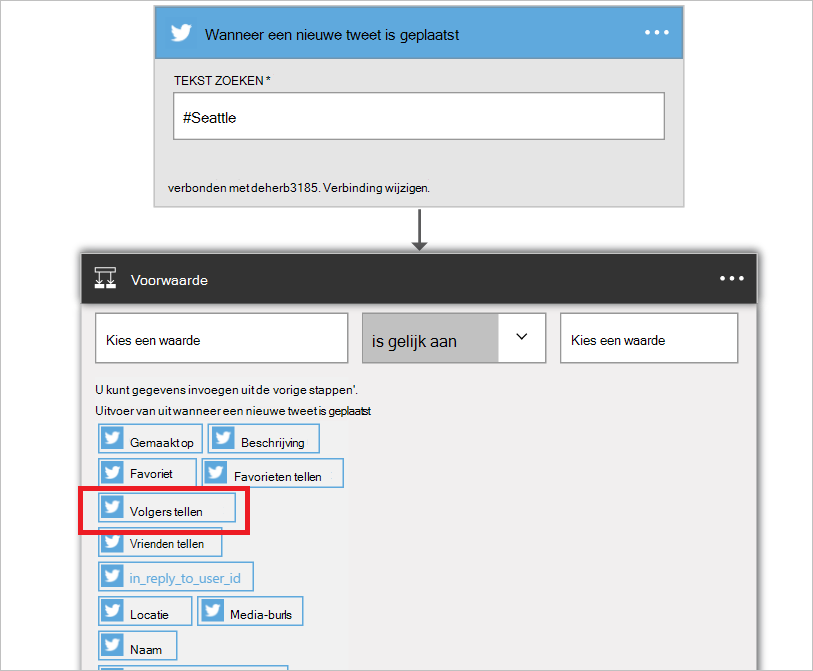   
- Zoals u ziet de eigenschap Volgers count is nu in het besturingselement waarde.    
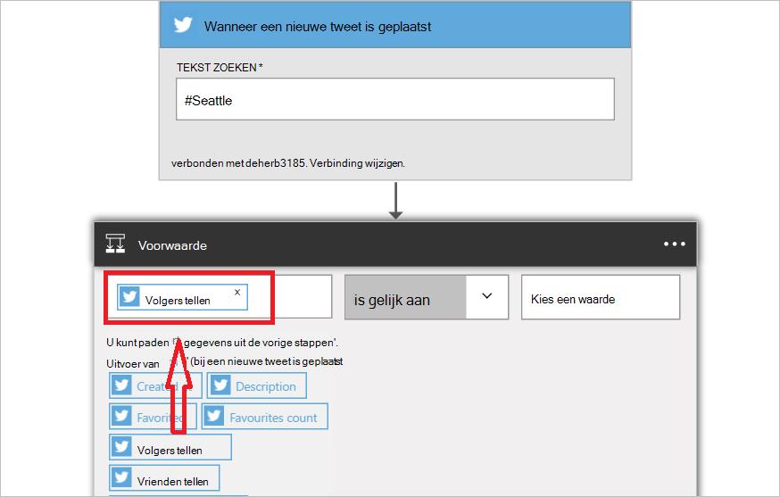   
- Selecteer **groter is dan** in de lijst operators.    
   
- Geef 50 als de operand voor de operator *groter is dan* .  
De voorwaarde is nu toegevoegd. Sla uw werk gebruikt u de koppeling **Opslaan** in de bovenstaande menu.    
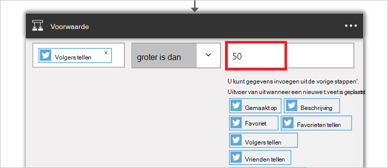   

## Gebruik een Twitter-actie

Een actie is een bewerking uitgevoerd door de werkstroom die is gedefinieerd in een app logica. [Meer informatie over acties](../app-service-logic/app-service-logic-what-are-logic-apps.md#logic-app-concepts).  

Nu dat u een trigger hebt toegevoegd, volgt u deze stappen uit om een actie die wordt een nieuwe tweet met de inhoud van de gevonden door de trigger tweets posten. Voor de toepassing van dit overzicht worden alleen tweets van gebruikers met meer dan 50 Volgers geboekt.  

In de volgende stap voegt u een Twitter-actie die wordt een tweet met enkele van de eigenschappen van elke tweet die door een gebruiker met meer dan 50 Volgers heeft zijn gepubliceerd posten.  

1. Selecteer **een actie toevoegen**. Hiermee opent u het besturingselement voor zoeken waar u naar andere acties en triggers zoeken kunt.  
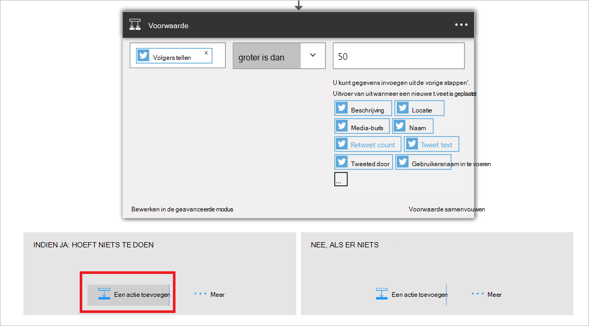   
- *Twitter-* invoeren in het zoekvak en selecteer vervolgens de actie **Twitter - bericht een tweet** . Hiermee opent u het **bericht een tweet** besturingselement waar u alle gegevens worden invoeren voor de tweet wordt geplaatst.      
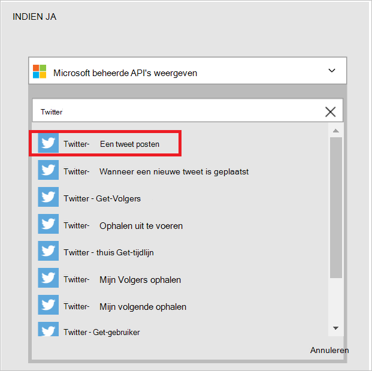   
- Selecteer het besturingselement **Tweet tekst** . Alle uitvoer uit eerdere bewerkingen en triggers in de logica-app zijn nu zichtbaar. U kunt een van deze selecteren en deze gebruiken als onderdeel van de tekst tweet van de nieuwe tweet.     
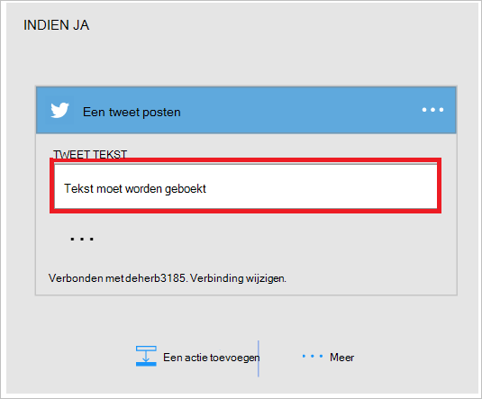   
- Selecteer **de naam van de gebruiker**   
- Voer *zegt:* in het besturingselement voor tweet tekst. Deze stap herhalen direct na de gebruikersnaam in te voeren.  
- Selecteer *Tweet tekst*.       
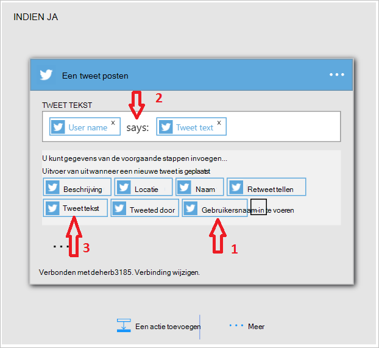   
- Sla uw werk en verzend een tweet met de hashtag #Seattle uw werkstroom activeren.  

## Technische Details

Hier volgen de details van de triggers, acties en -antwoorden die ondersteuning biedt voor deze verbinding:

## Twitter-triggers

De verbindingslijn Twitter heeft de volgende trigger(s):  

|Trigger | Beschrijving|
|--- | ---|
|[Wanneer een nieuwe tweet is geplaatst](connectors-create-api-twitter.md#when-a-new-tweet-is-posted)|Deze bewerking gebeurtenis een stroom wanneer een nieuwe tweet die overeenkomt met een bepaalde zoekopdracht is geplaatst.|

## Twitter-acties

De verbindingslijn Twitter heeft de volgende bewerkingen uit:

|Actie|Beschrijving|
|--- | ---|
|[Gebruiker tijdlijn ophalen](connectors-create-api-twitter.md#get-user-timeline)|Deze bewerking ontvangt een lijst met de meest recente tweets gepost door een bepaalde gebruiker.|
|[U start tijdlijn](connectors-create-api-twitter.md#get-home-timeline)|Deze bewerking krijgt de meest recente tweets en opnieuw tweets gepost door mij en Mijn Volgers.|
|[Tweets zoeken](connectors-create-api-twitter.md#search-tweets)|Deze bewerking ontvangt een lijst met relevante tweets overeenkomen met de zoekquery.|
|[Volgers ophalen](connectors-create-api-twitter.md#get-followers)|Deze bewerking wordt de lijst met gebruikers die een bepaalde gebruiker volgen.|
|[Mijn Volgers ophalen](connectors-create-api-twitter.md#get-my-followers)|Deze bewerking wordt de lijst met gebruikers die mij volgen.|
|[Ophalen uit te voeren](connectors-create-api-twitter.md#get-following)|De bewerking krijgt de lijst met personen die de opgegeven gebruiker wordt gevolgd.|
|[Mijn volgende ophalen](connectors-create-api-twitter.md#get-my-following)|Deze bewerking wordt de lijst met gebruikers die ik volg.|
|[Gebruikers krijgen](connectors-create-api-twitter.md#get-user)|Deze bewerking wordt de profielgegevens voor een bepaalde gebruiker, zoals de gebruikersnaam in te voeren, beschrijving, volgers tellen en meer.|
|[Een tweet posten](connectors-create-api-twitter.md#post-a-tweet)|Deze bewerking in een tweet nieuwe berichten.|
## Actiedetails

Hier vindt u de details in voor de acties en triggers voor deze verbindingslijn, samen met hun antwoorden:

### Gebruiker tijdlijn ophalen
Deze bewerking ontvangt een lijst met de meest recente tweets gepost door een bepaalde gebruiker. 

|Naam van eigenschap| Weergavenaam|Beschrijving|
| ---|---|---|
|Gebruikersnaam *|Gebruikersnaam in te voeren|Twitter greep voor de gebruiker|
|maxResults|Maximum aantal resultaten|Maximum aantal tweets om terug te keren|

Een * geeft aan dat een eigenschap vereist is

#### Gegevens voor uitvoer

TweetModel: Weergave van Tweet Object

| Naam van eigenschap | Gegevenstype | Beschrijving |
|---|---|---|
|TweetText|tekenreeks|Tekstinhoud van de tweet|
|TweetId|tekenreeks|Id van de tweet|
|CreatedAt|tekenreeks|Tijd waarop de tweet is geplaatst|
|RetweetCount|geheel getal|Totaal aantal opnieuw tweets voor de tweet|
|TweetedBy|tekenreeks|Naam van de gebruiker van wie de tweet heeft gepost|
|MediaUrls|matrix|URL van de media geplaatst samen met de tweet|
|TweetLanguageCode|tekenreeks|Taalcode van de tweet|
|TweetInReplyToUserId|tekenreeks|Gebruikers-Id van de auteur van het tweet die de huidige tweet is een antwoord op|
|Favorited|Booleaanse waarde|Hiermee wordt aangegeven of de tweet is gemarkeerd als favorited al dan niet|
|UserMentions|matrix|Lijst met gebruikers die worden genoemd in de tweet|
|OriginalTweet|niet gedefinieerd|Oorspronkelijke tweet waaruit de huidige tweet opnieuw tweeted is|
|UserDetails|niet gedefinieerd|Details van de gebruiker die tweeted|

### U start tijdlijn
Deze bewerking krijgt de meest recente tweets en opnieuw tweets gepost door mij en Mijn Volgers. 

|Naam van eigenschap| Weergavenaam|Beschrijving|
| ---|---|---|
|maxResults|Maximum aantal resultaten|Maximum aantal tweets om terug te keren|

Een * geeft aan dat een eigenschap vereist is

#### Gegevens voor uitvoer

TweetModel: Weergave van Tweet Object

| Naam van eigenschap | Gegevenstype | Beschrijving |
|---|---|---|
|TweetText|tekenreeks|Tekstinhoud van de tweet|
|TweetId|tekenreeks|Id van de tweet|
|CreatedAt|tekenreeks|Tijd waarop de tweet is geplaatst|
|RetweetCount|geheel getal|Totaal aantal opnieuw tweets voor de tweet|
|TweetedBy|tekenreeks|Naam van de gebruiker van wie de tweet heeft gepost|
|MediaUrls|matrix|URL van de media geplaatst samen met de tweet|
|TweetLanguageCode|tekenreeks|Taalcode van de tweet|
|TweetInReplyToUserId|tekenreeks|Gebruikers-Id van de auteur van het tweet die de huidige tweet is een antwoord op|
|Favorited|Booleaanse waarde|Hiermee wordt aangegeven of de tweet is gemarkeerd als favorited al dan niet|
|UserMentions|matrix|Lijst met gebruikers die worden genoemd in de tweet|
|OriginalTweet|niet gedefinieerd|Oorspronkelijke tweet waaruit de huidige tweet opnieuw tweeted is|
|UserDetails|niet gedefinieerd|Details van de gebruiker die tweeted|

### Tweets zoeken
Deze bewerking ontvangt een lijst met relevante tweets overeenkomen met de zoekquery. 

|Naam van eigenschap| Weergavenaam|Beschrijving|
| ---|---|---|
|searchQuery *|Zoektekst|Zoekterm zoals "Gelukkig uur", #haiku, graag mee werkt of hate|
|maxResults|Maximum aantal resultaten|Maximum aantal tweets om terug te keren|

Een * geeft aan dat een eigenschap vereist is

#### Gegevens voor uitvoer

TweetModel: Weergave van Tweet Object

| Naam van eigenschap | Gegevenstype | Beschrijving |
|---|---|---|
|TweetText|tekenreeks|Tekstinhoud van de tweet|
|TweetId|tekenreeks|Id van de tweet|
|CreatedAt|tekenreeks|Tijd waarop de tweet is geplaatst|
|RetweetCount|geheel getal|Totaal aantal opnieuw tweets voor de tweet|
|TweetedBy|tekenreeks|Naam van de gebruiker van wie de tweet heeft gepost|
|MediaUrls|matrix|URL van de media geplaatst samen met de tweet|
|TweetLanguageCode|tekenreeks|Taalcode van de tweet|
|TweetInReplyToUserId|tekenreeks|Gebruikers-Id van de auteur van het tweet die de huidige tweet is een antwoord op|
|Favorited|Booleaanse waarde|Hiermee wordt aangegeven of de tweet is gemarkeerd als favorited al dan niet|
|UserMentions|matrix|Lijst met gebruikers die worden genoemd in de tweet|
|OriginalTweet|niet gedefinieerd|Oorspronkelijke tweet waaruit de huidige tweet opnieuw tweeted is|
|UserDetails|niet gedefinieerd|Details van de gebruiker die tweeted|

### Volgers ophalen
Deze bewerking wordt de lijst met gebruikers die een bepaalde gebruiker volgen. 

|Naam van eigenschap| Weergavenaam|Beschrijving|
| ---|---|---|
|Gebruikersnaam *|Gebruikersnaam in te voeren|Twitter greep voor de gebruiker|
|maxResults|Maximum aantal resultaten|Maximaal aantal gebruikers om terug te keren|

Een * geeft aan dat een eigenschap vereist is

#### Gegevens voor uitvoer

UserDetailsModel: Twitter-Gebruikersdetails

| Naam van eigenschap | Gegevenstype | Beschrijving |
|---|---|---|
|Volledige naam|tekenreeks|Naam van de gebruiker|
|Locatie|tekenreeks|Locatie van de gebruiker|
|ID|geheel getal|Twitter-Id van de gebruiker|
|Gebruikersnaam|tekenreeks|De schermnaam van het van de gebruiker|
|FollowersCount|geheel getal|Aantal volgers|
|Beschrijving|tekenreeks|Beschrijving van de gebruiker|
|StatusesCount|geheel getal|Gebruiker status tellen|
|FriendsCount|geheel getal|Aantal vrienden|
|FavouritesCount|geheel getal|Aantal tweets dat de gebruiker favorited heeft|
|ProfileImageUrl|tekenreeks|URL van de afbeelding profiel|

### Mijn Volgers ophalen
Deze bewerking wordt de lijst met gebruikers die mij volgen. 

|Naam van eigenschap| Weergavenaam|Beschrijving|
| ---|---|---|
|maxResults|Maximum aantal resultaten|Maximum aantal gebruikers te krijgen|

Een * geeft aan dat een eigenschap vereist is

#### Gegevens voor uitvoer

UserDetailsModel: Twitter-Gebruikersdetails

| Naam van eigenschap | Gegevenstype | Beschrijving |
|---|---|---|
|Volledige naam|tekenreeks|Naam van de gebruiker|
|Locatie|tekenreeks|Locatie van de gebruiker|
|ID|geheel getal|Twitter-Id van de gebruiker|
|Gebruikersnaam|tekenreeks|De schermnaam van het van de gebruiker|
|FollowersCount|geheel getal|Aantal volgers|
|Beschrijving|tekenreeks|Beschrijving van de gebruiker|
|StatusesCount|geheel getal|Gebruiker status tellen|
|FriendsCount|geheel getal|Aantal vrienden|
|FavouritesCount|geheel getal|Aantal tweets dat de gebruiker favorited heeft|
|ProfileImageUrl|tekenreeks|URL van de afbeelding profiel|

### Ophalen uit te voeren
De bewerking krijgt de lijst met personen die de opgegeven gebruiker wordt gevolgd. 

|Naam van eigenschap| Weergavenaam|Beschrijving|
| ---|---|---|
|Gebruikersnaam *|Gebruikersnaam in te voeren|Twitter greep voor de gebruiker|
|maxResults|Maximum aantal resultaten|Maximaal aantal gebruikers om terug te keren|

Een * geeft aan dat een eigenschap vereist is

#### Gegevens voor uitvoer

UserDetailsModel: Twitter-Gebruikersdetails

| Naam van eigenschap | Gegevenstype | Beschrijving |
|---|---|---|
|Volledige naam|tekenreeks|Naam van de gebruiker|
|Locatie|tekenreeks|Locatie van de gebruiker|
|ID|geheel getal|Twitter-Id van de gebruiker|
|Gebruikersnaam|tekenreeks|De schermnaam van het van de gebruiker|
|FollowersCount|geheel getal|Aantal volgers|
|Beschrijving|tekenreeks|Beschrijving van de gebruiker|
|StatusesCount|geheel getal|Gebruiker status tellen|
|FriendsCount|geheel getal|Aantal vrienden|
|FavouritesCount|geheel getal|Aantal tweets dat de gebruiker favorited heeft|
|ProfileImageUrl|tekenreeks|URL van de afbeelding profiel|

### Mijn volgende ophalen
Deze bewerking wordt de lijst met gebruikers die ik volg. 

|Naam van eigenschap| Weergavenaam|Beschrijving|
| ---|---|---|
|maxResults|Maximum aantal resultaten|Maximaal aantal gebruikers om terug te keren|

Een * geeft aan dat een eigenschap vereist is

#### Gegevens voor uitvoer

UserDetailsModel: Twitter-Gebruikersdetails

| Naam van eigenschap | Gegevenstype | Beschrijving |
|---|---|---|
|Volledige naam|tekenreeks|Naam van de gebruiker|
|Locatie|tekenreeks|Locatie van de gebruiker|
|ID|geheel getal|Twitter-Id van de gebruiker|
|Gebruikersnaam|tekenreeks|De schermnaam van het van de gebruiker|
|FollowersCount|geheel getal|Aantal volgers|
|Beschrijving|tekenreeks|Beschrijving van de gebruiker|
|StatusesCount|geheel getal|Gebruiker status tellen|
|FriendsCount|geheel getal|Aantal vrienden|
|FavouritesCount|geheel getal|Aantal tweets dat de gebruiker favorited heeft|
|ProfileImageUrl|tekenreeks|URL van de afbeelding profiel|

### Gebruikers krijgen
Deze bewerking wordt de profielgegevens voor een bepaalde gebruiker, zoals de gebruikersnaam in te voeren, beschrijving, volgers tellen en meer. 

|Naam van eigenschap| Weergavenaam|Beschrijving|
| ---|---|---|
|Gebruikersnaam *|Gebruikersnaam in te voeren|Twitter greep voor de gebruiker|

Een * geeft aan dat een eigenschap vereist is

#### Gegevens voor uitvoer

UserDetailsModel: Twitter-Gebruikersdetails

| Naam van eigenschap | Gegevenstype | Beschrijving |
|---|---|---|
|Volledige naam|tekenreeks|Naam van de gebruiker|
|Locatie|tekenreeks|Locatie van de gebruiker|
|ID|geheel getal|Twitter-Id van de gebruiker|
|Gebruikersnaam|tekenreeks|De schermnaam van het van de gebruiker|
|FollowersCount|geheel getal|Aantal volgers|
|Beschrijving|tekenreeks|Beschrijving van de gebruiker|
|StatusesCount|geheel getal|Gebruiker status tellen|
|FriendsCount|geheel getal|Aantal vrienden|
|FavouritesCount|geheel getal|Aantal tweets dat de gebruiker favorited heeft|
|ProfileImageUrl|tekenreeks|URL van de afbeelding profiel|

### Een tweet posten
Deze bewerking in een tweet nieuwe berichten. 

|Naam van eigenschap| Weergavenaam|Beschrijving|
| ---|---|---|
|tweetText|Tweet tekst|Tekst moet worden geboekt|
|hoofdtekst|Media|Media moeten worden geboekt|

Een * geeft aan dat een eigenschap vereist is

#### Gegevens voor uitvoer

TweetResponseModel: Model dat staat voor Tweet die zijn gepubliceerd

| Naam van eigenschap | Gegevenstype | Beschrijving |
|---|---|---|
|TweetId|tekenreeks|ID van de opgehaalde tweet|

### Wanneer een nieuwe tweet is geplaatst
Deze bewerking gebeurtenis een stroom wanneer een nieuwe tweet die overeenkomt met een bepaalde zoekopdracht is geplaatst. 

|Naam van eigenschap| Weergavenaam|Beschrijving|
| ---|---|---|
|searchQuery *|Zoektekst|Zoekterm zoals "Gelukkig uur", #haiku, graag mee werkt of hate|

Een * geeft aan dat een eigenschap vereist is

#### Gegevens voor uitvoer

TriggerBatchResponse [TweetModel]

| Naam van eigenschap | Gegevenstype |
|---|---|
|waarde|matrix|

## HTTP-antwoorden

De acties en triggers bovenstaande kunnen retourneren een of meer van de volgende codes van de HTTP-status: 

|Naam|Beschrijving|
|---|---|
|200|OK|
|202|Geaccepteerd|
|400|Ongeldige aanvraag|
|401|Onbevoegde|
|403|Verboden|
|404|Niet gevonden|
|500|Interne serverfout. Onbekende fout opgetreden.|
|Standaard|Bewerking is mislukt.|

## Volgende stappen
[Een logica-app maken](../app-service-logic/app-service-logic-create-a-logic-app.md)