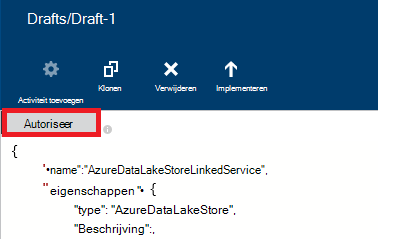

<properties
    pageTitle="Gegevens verplaatsen naar/van Azure Lake gegevensopslag | Azure gegevens Factory"
    description="Informatie over het verplaatsen van gegevens van Azure Lake gegevensopslag Azure gegevens Factory gebruiken"
    services="data-factory"
    documentationCenter=""
    authors="linda33wj"
    manager="jhubbard"
    editor="monicar"/>

<tags
    ms.service="data-factory"
    ms.workload="data-services"
    ms.tgt_pltfrm="na"
    ms.devlang="na"
    ms.topic="article"
    ms.date="09/27/2016"
    ms.author="jingwang"/>

# Gegevens verplaatsen naar en vanuit Azure Lake gegevensopslag Azure gegevens Factory gebruiken
In dit artikel wordt beschreven hoe u de kopie activiteit in een fabriek Azure gegevens kunt gebruiken om gegevens te verplaatsen van/naar Azure Lake gegevensopslag aan/uit een andere gegevensopslag. In dit artikel is gebaseerd op het artikel [gegevens verkeer activiteiten](data-factory-data-movement-activities.md) , waarbij een een algemeen overzicht van de verplaatsing van gegevens met de activiteit kopiëren en de ondersteunde store combinaties wordt weergegeven.

> [AZURE.NOTE]
> Maak een account Azure Lake gegevensopslag voordat u een pijplijn maakt met een activiteit kopiëren om gegevens te verplaatsen in een winkel Lake van Azure-gegevens. Zie meer informatie over Azure Lake gegevensopslag, [aan de slag met Azure Lake gegevensopslag](../data-lake-store/data-lake-store-get-started-portal.md).
>  
> Bekijk het [samenstellen van uw eerste verkooppijplijn zelfstudie](data-factory-build-your-first-pipeline.md) voor gedetailleerde stappen om te maken van een fabriek gegevens, gekoppelde services gegevenssets en een pijplijn. Gebruik de JSON-fragmenten met gegevens Factory-Editor of Visual Studio of Azure PowerShell maken van de gegevens Factory-entiteiten.

## Wizard gegevens kopiëren
De eenvoudigste manier om te maken van een pijplijn die wordt gekopieerd gegevens van Azure Lake gegevensopslag is het gebruik van de wizard van de gegevens kopiëren. Zie [Zelfstudie: een pijplijn met de Wizard kopie maken](data-factory-copy-data-wizard-tutorial.md) voor snelle stapsgewijze instructies over het maken van een pijplijn met de wizard kopiëren. 

De volgende voorbeelden bieden definities van een steekproef JSON waarmee u kunt een pijplijn maken met behulp van [Azure-portal](data-factory-copy-activity-tutorial-using-azure-portal.md) of [Visual Studio](data-factory-copy-activity-tutorial-using-visual-studio.md) of [Azure PowerShell](data-factory-copy-activity-tutorial-using-powershell.md). Gegevens kopiëren naar en vanuit Azure Lake gegevensopslag en Azure-blobopslag worden ze weergegeven. Gegevens kan echter gekopieerde **rechtstreeks** vanaf een van de bronnen aan de sinks vermelde [hier](data-factory-data-movement-activities.md#supported-data-stores) gebruik van de activiteit kopiëren in Azure gegevens Factory zijn.  

## Voorbeeld: Gegevens van Azure Blob kopiëren naar Azure Lake gegevensopslag
Het volgende voorbeeld ziet:

1.  Een gekoppelde service van het type [AzureStorage](#azure-storage-linked-service-properties).
2.  Een gekoppelde service van het type [AzureDataLakeStore](#azure-data-lake-linked-service-properties).
3.  Een invoer [dataset](data-factory-create-datasets.md) van het type [AzureBlob](#azure-blob-dataset-type-properties).
4.  Een uitvoer [dataset](data-factory-create-datasets.md) van het type [AzureDataLakeStore](#azure-data-lake-dataset-type-properties).
4.  Een [verkooppijplijn](data-factory-create-pipelines.md) met een kopie activiteit die wordt gebruikt [BlobSource](#azure-blob-copy-activity-type-properties) en [AzureDataLakeStoreSink](#azure-data-lake-copy-activity-type-properties).

De steekproef opgehaald tijdreeks gegevens uit een Azure-blobopslag naar Azure Lake gegevensopslag per uur. De JSON-eigenschappen in deze voorbeelden gebruikt, worden beschreven in de secties in de voorbeelden te volgen.

**Azure gekoppeld opslagservice:**

    {
      "name": "StorageLinkedService",
      "properties": {
        "type": "AzureStorage",
        "typeProperties": {
          "connectionString": "DefaultEndpointsProtocol=https;AccountName=<accountname>;AccountKey=<accountkey>"
        }
      }
    }

**Azure gegevens Lake gekoppeld service:**

    {
        "name": "AzureDataLakeStoreLinkedService",
        "properties": {
            "type": "AzureDataLakeStore",
            "typeProperties": {
                "dataLakeStoreUri": "https://<accountname>.azuredatalakestore.net/webhdfs/v1",
                "sessionId": "<session ID>",
                "authorization": "<authorization URL>"
            }
        }
    }

### Azure Lake gekoppelde gegevensservice met gegevens Factory-Editor maken
De volgende procedure bevat stappen voor het maken van een service van Azure Lake gegevensopslag gekoppeld met de gegevens Factory-Editor.

1. Klik op **nieuwe gegevens opslaan** op de balk met opdrachten en selecteer **Azure Lake gegevensopslag**.
2. Voer de URI voor de meer gegevens in de JSON-editor voor de eigenschap **dataLakeStoreUri** .
3. Klik op de knop **autoriseren** op de opdrachtbalk. Hier ziet u een pop-upvenster.

    

4. Gebruik uw referenties aan te melden en de eigenschap **autorisatie** in de JSON moet worden toegewezen aan een waarde nu.
5. (optioneel) Geef de waarden voor optionele parameters zoals **accountnaam**, **subscriptionID**en **resourceGroupName** in de JSON (of) deze eigenschappen verwijderen uit de JSON.
6. Klik op **Deploy** op de opdrachtbalk om te implementeren van de gekoppelde service.

> [AZURE.IMPORTANT] De autorisatiecode die u hebt gegenereerd met behulp van de knop **autoriseren** verloopt later opnieuw. **Autoriseren** met de **autoriseren** knop wanneer de **token verloopt** en in dat geval de gekoppelde service. Zie de sectie van de [Gekoppelde Store-Service van de Azure gegevens-Lake](#azure-data-lake-store-linked-service-properties) voor meer informatie. 

**Azure Blob invoer gegevensset:**

Gegevens wordt opgehaald uit een nieuwe blob per uur (frequentie: uur, interval: 1). De map pad en de bestandsnaam voor het blob worden dynamisch geëvalueerd op basis van de begintijd van het segment die wordt verwerkt. Pad naar de map beschikt over jaar, maand en dag deel uit van de begintijd en de bestandsnaam van het wordt gebruikt voor het uur deel van de begintijd. "externe": "true" instelling Data Factory-service wordt gemeld dat de tabel externe gegevens fabriek is en is niet geproduceerd door een activiteit in de fabriek gegevens.

    {
      "name": "AzureBlobInput",
      "properties": {
        "type": "AzureBlob",
        "linkedServiceName": "StorageLinkedService",
        "typeProperties": {
          "folderPath": "mycontainer/myfolder/yearno={Year}/monthno={Month}/dayno={Day}",
          "partitionedBy": [
            {
              "name": "Year",
              "value": {
                "type": "DateTime",
                "date": "SliceStart",
                "format": "yyyy"
              }
            },
            {
              "name": "Month",
              "value": {
                "type": "DateTime",
                "date": "SliceStart",
                "format": "MM"
              }
            },
            {
              "name": "Day",
              "value": {
                "type": "DateTime",
                "date": "SliceStart",
                "format": "dd"
              }
            },
            {
              "name": "Hour",
              "value": {
                "type": "DateTime",
                "date": "SliceStart",
                "format": "HH"
              }
            }
          ]
        },
        "external": true,
        "availability": {
          "frequency": "Hour",
          "interval": 1
        },
        "policy": {
          "externalData": {
            "retryInterval": "00:01:00",
            "retryTimeout": "00:10:00",
            "maximumRetry": 3
          }
        }
      }
    }

**Azure gegevens Lake uitvoer gegevensset:**

De steekproef worden gegevens naar een winkel Azure gegevens Lake gekopieerd. Nieuwe gegevens is kopieën naar gegevens Lake opslaat per uur.

    {
        "name": "AzureDataLakeStoreOutput",
        "properties": {
            "type": "AzureDataLakeStore",
            "linkedServiceName": "AzureDataLakeStoreLinkedService",
            "typeProperties": {
                "folderPath": "datalake/output/"
            },
            "availability": {
                "frequency": "Hour",
                "interval": 1
            }
        }
    }

**Pijplijn met een activiteit kopiëren:**

De pijplijn bevat de activiteit in een kopie die is geconfigureerd voor gebruik van de invoer- en uitvoerbereik gegevenssets en per uur is gepland. In de pijplijn JSON definitie, het type **bron** is ingesteld op **BlobSource** en **sink** type is ingesteld op **AzureDataLakeStoreSink**.

    {  
        "name":"SamplePipeline",
        "properties":
        {  
            "start":"2014-06-01T18:00:00",
            "end":"2014-06-01T19:00:00",
            "description":"pipeline with copy activity",
            "activities":
            [  
                {
                    "name": "AzureBlobtoDataLake",
                    "description": "Copy Activity",
                    "type": "Copy",
                    "inputs": [
                    {
                        "name": "AzureBlobInput"
                    }
                    ],
                    "outputs": [
                    {
                        "name": "AzureDataLakeStoreOutput"
                    }
                    ],
                    "typeProperties": {
                        "source": {
                            "type": "BlobSource",
                            "treatEmptyAsNull": true,
                            "blobColumnSeparators": ","
                        },
                        "sink": {
                            "type": "AzureDataLakeStoreSink"
                        }
                    },
                    "scheduler": {
                        "frequency": "Hour",
                        "interval": 1
                    },
                    "policy": {
                        "concurrency": 1,
                        "executionPriorityOrder": "OldestFirst",
                        "retry": 0,
                        "timeout": "01:00:00"
                    }
                }
            ]
        }
    }

## Voorbeeld: Gegevens van Azure Lake gegevensopslag naar Azure Blob kopiëren
Het volgende voorbeeld ziet:

1.  Een gekoppelde service van het type [AzureDataLakeStore](#azure-data-lake-linked-service-properties).
2.  Een gekoppelde service van het type [AzureStorage](#azure-storage-linked-service-properties).
3.  Een invoer [dataset](data-factory-create-datasets.md) van het type [AzureDataLakeStore](#azure-data-lake-dataset-type-properties).
4.  Een uitvoer [dataset](data-factory-create-datasets.md) van het type [AzureBlob](#azure-blob-dataset-type-properties).
5.  Een [verkooppijplijn](data-factory-create-pipelines.md) met een kopie activiteit die wordt gebruikt [AzureDataLakeStoreSource](#azure-data-lake-copy-activity-type-properties) en [BlobSink](#azure-blob-copy-activity-type-properties)

De steekproef opgehaald tijdreeks gegevens uit een archief Lake van Azure-gegevens naar een Azure blob per uur. De JSON-eigenschappen in deze voorbeelden gebruikt, worden beschreven in de secties in de voorbeelden te volgen.

**Azure Lake gegevensopslag gekoppeld service:**

    {
        "name": "AzureDataLakeStoreLinkedService",
        "properties": {
            "type": "AzureDataLakeStore",
            "typeProperties": {
                "dataLakeStoreUri": "https://<accountname>.azuredatalakestore.net/webhdfs/v1",
                "sessionId": "<session ID>",
                "authorization": "<authorization URL>"
            }
        }
    }

> [AZURE.NOTE] Zie de stappen in het vorige voorbeeld autorisatie URL verkrijgt.  

**Azure gekoppeld opslagservice:**

    {
      "name": "StorageLinkedService",
      "properties": {
        "type": "AzureStorage",
        "typeProperties": {
          "connectionString": "DefaultEndpointsProtocol=https;AccountName=<accountname>;AccountKey=<accountkey>"
        }
      }
    }

**Azure gegevens Lake invoer gegevensset:**

Instelling **"externe": waar** wordt de Data Factory-service wordt gemeld dat de tabel externe gegevens fabriek is en is niet geproduceerd door een activiteit in de fabriek gegevens.

    {
        "name": "AzureDataLakeStoreInput",
        "properties":
        {
            "type": "AzureDataLakeStore",
            "linkedServiceName": "AzureDataLakeStoreLinkedService",
            "typeProperties": {
                "folderPath": "datalake/input/",
                "fileName": "SearchLog.tsv",
                "format": {
                    "type": "TextFormat",
                    "rowDelimiter": "\n",
                    "columnDelimiter": "\t"
                }
            },
            "external": true,
            "availability": {
                "frequency": "Hour",
                "interval": 1
            },
            "policy": {
                "externalData": {
                    "retryInterval": "00:01:00",
                    "retryTimeout": "00:10:00",
                    "maximumRetry": 3
                }
            }
        }
    }

**Azure Blob uitvoer gegevensset:**

Gegevens worden geschreven naar een nieuwe blob per uur (frequentie: uur, interval: 1). Het pad naar de blob geëvalueerd dynamisch op basis van de begintijd van het segment die wordt verwerkt. Pad naar de map wordt gebruikt voor jaar, maand, dag en uur onderdelen van de begintijd.

    {
      "name": "AzureBlobOutput",
      "properties": {
        "type": "AzureBlob",
        "linkedServiceName": "StorageLinkedService",
        "typeProperties": {
          "folderPath": "mycontainer/myfolder/yearno={Year}/monthno={Month}/dayno={Day}/hourno={Hour}",
          "partitionedBy": [
            {
              "name": "Year",
              "value": {
                "type": "DateTime",
                "date": "SliceStart",
                "format": "yyyy"
              }
            },
            {
              "name": "Month",
              "value": {
                "type": "DateTime",
                "date": "SliceStart",
                "format": "MM"
              }
            },
            {
              "name": "Day",
              "value": {
                "type": "DateTime",
                "date": "SliceStart",
                "format": "dd"
              }
            },
            {
              "name": "Hour",
              "value": {
                "type": "DateTime",
                "date": "SliceStart",
                "format": "HH"
              }
            }
          ],
          "format": {
            "type": "TextFormat",
            "columnDelimiter": "\t",
            "rowDelimiter": "\n"
          }
        },
        "availability": {
          "frequency": "Hour",
          "interval": 1
        }
      }
    }

**Pijplijn met de activiteit kopiëren:**

De pijplijn bevat de activiteit in een kopie die is geconfigureerd voor gebruik van de invoer- en uitvoerbereik gegevenssets en per uur is gepland. In de pijplijn JSON definitie, het type **bron** is ingesteld op **AzureDataLakeStoreSource** en **sink** type is ingesteld op **BlobSink**.

    {  
        "name":"SamplePipeline",
        "properties":{  
            "start":"2014-06-01T18:00:00",
            "end":"2014-06-01T19:00:00",
            "description":"pipeline for copy activity",
            "activities":[  
                {
                    "name": "AzureDakeLaketoBlob",
                    "description": "copy activity",
                    "type": "Copy",
                    "inputs": [
                      {
                        "name": "AzureDataLakeStoreInput"
                      }
                    ],
                    "outputs": [
                      {
                        "name": "AzureBlobOutput"
                      }
                    ],
                    "typeProperties": {
                        "source": {
                            "type": "AzureDataLakeStoreSource",
                        },
                        "sink": {
                            "type": "BlobSink"
                        }
                    },
                    "scheduler": {
                        "frequency": "Hour",
                        "interval": 1
                    },
                    "policy": {
                        "concurrency": 1,
                        "executionPriorityOrder": "OldestFirst",
                        "retry": 0,
                        "timeout": "01:00:00"
                    }
                }
             ]
        }
    }

## Azure Lake Store gekoppelde gegevensservice-eigenschappen

U kunt een Azure opslag-account koppelen aan een Azure gegevens factory met een service Azure-opslag die zijn gekoppeld. De volgende tabel bevat een beschrijving voor de JSON-elementen die specifiek zijn voor Azure gekoppeld opslagservice.

| Eigenschap | Beschrijving | Vereist |
| :-------- | :----------- | :-------- |
| type | De eigenschap type moet zijn ingesteld op: **AzureDataLakeStore** | Ja |
| dataLakeStoreUri | Informatie over het account Azure Lake gegevensopslag opgeven. Het is in de volgende indeling: https://<Azure Data Lake account name>.azuredatalakestore.net/webhdfs/v1 | Ja |
| autorisatie | Klik op de knop **autoriseren** in de **Gegevens Factory-Editor** en voer uw referenties die de URL van de automatisch gegenereerde autorisatie aan deze eigenschap wordt toegewezen.  | Ja |
| sessie-id | OAuth sessie-id uit het oauth autorisatie-sessie. Elke sessie-id is uniek en kan slechts eenmaal worden gebruikt. Deze instelling wordt automatisch gegenereerd wanneer u gegevens Factory-Editor gebruiken. | Ja |  
| Accountnaam | Gegevens lake accountnaam | Nee |
| subscriptionId | Azure abonnement Id. | Niet (als u niet opgeeft, abonnement van de fabriek gegevens wordt gebruikt). |
| resourceGroupName |  De naam van de Azure resource-groep | Niet (als u niet opgeeft, resourcegroep van de fabriek gegevens wordt gebruikt). |

## Verlopen van token 
De autorisatiecode die u met de knop **autoriseren** genereren verloopt later opnieuw. Zie de volgende tabel voor de verlooptijd tijden voor verschillende soorten gebruikersaccounts. Ziet u mogelijk de volgende fout bericht wanneer de verificatie **token is verlopen**: ' bewerking fout referenties: invalid_grant - AADSTS70002: fout bij valideren van referenties. AADSTS70008: De meegeleverde toegang verlenen is verlopen of ingetrokken. Trace-ID: d18629e8-af88-43c5-88e3-d8419eb1fca1 correlatie-ID: fac30a0c-6be6-4e02-8d69-a776d2ffefd7 tijdstempel: 2015-12-15 21-09-31Z ".

| Gebruikerstype | Verloopt na |
| :-------- | :----------- | 
| Gebruikersaccounts die niet worden beheerd door Azure Active Directory (@hotmail.com, @live.com, enz.). | 12 uur |
| Gebruikersaccounts die worden beheerd door Azure Active Directory (AAD) | 14 dagen na het laatste segment uitvoeren.   90 dagen, als een segment op basis van de gekoppelde service OAuth gebaseerde ten minste eenmaal per 14 dagen wordt uitgevoerd. |

Als u uw wachtwoord voordat u deze token verlooptijd wijzigen, het token verloopt onmiddellijk en ziet u de fout die in deze sectie worden genoemd. 

Als u wilt deze fout voorkomen/oplossen, met de **autoriseren** autoriseren knop wanneer de **token verloopt** en in dat geval de gekoppelde service. U kunt ook de waarden voor de eigenschappen van **sessie-id** en **autorisatie** programmacode met code in de volgende sectie genereren:

### Via een programma sessie-id en de machtiging om waarden te genereren 

    if (linkedService.Properties.TypeProperties is AzureDataLakeStoreLinkedService ||
        linkedService.Properties.TypeProperties is AzureDataLakeAnalyticsLinkedService)
    {
        AuthorizationSessionGetResponse authorizationSession = this.Client.OAuth.Get(this.ResourceGroupName, this.DataFactoryName, linkedService.Properties.Type);

        WindowsFormsWebAuthenticationDialog authenticationDialog = new WindowsFormsWebAuthenticationDialog(null);
        string authorization = authenticationDialog.AuthenticateAAD(authorizationSession.AuthorizationSession.Endpoint, new Uri("urn:ietf:wg:oauth:2.0:oob"));

        AzureDataLakeStoreLinkedService azureDataLakeStoreProperties = linkedService.Properties.TypeProperties as AzureDataLakeStoreLinkedService;
        if (azureDataLakeStoreProperties != null)
        {
            azureDataLakeStoreProperties.SessionId = authorizationSession.AuthorizationSession.SessionId;
            azureDataLakeStoreProperties.Authorization = authorization;
        }

        AzureDataLakeAnalyticsLinkedService azureDataLakeAnalyticsProperties = linkedService.Properties.TypeProperties as AzureDataLakeAnalyticsLinkedService;
        if (azureDataLakeAnalyticsProperties != null)
        {
            azureDataLakeAnalyticsProperties.SessionId = authorizationSession.AuthorizationSession.SessionId;
            azureDataLakeAnalyticsProperties.Authorization = authorization;
        }
    }

Zie [AzureDataLakeStoreLinkedService Class](https://msdn.microsoft.com/library/microsoft.azure.management.datafactories.models.azuredatalakestorelinkedservice.aspx), [AzureDataLakeAnalyticsLinkedService Class](https://msdn.microsoft.com/library/microsoft.azure.management.datafactories.models.azuredatalakeanalyticslinkedservice.aspx)en [AuthorizationSessionGetResponse klasse](https://msdn.microsoft.com/library/microsoft.azure.management.datafactories.models.authorizationsessiongetresponse.aspx) -onderwerpen voor meer informatie over de gegevens Factory-klassen gebruikt in de code. Voeg een verwijzing naar **2.9.10826.1824** versie van **Microsoft.IdentityModel.Clients.ActiveDirectory.WindowsForms.dll** voor de WindowsFormsWebAuthenticationDialog klasse gebruikt in de code. 
 

## Azure gegevens Lake gegevensset type eigenschappen

Zie het artikel [gegevenssets maken](data-factory-create-datasets.md) voor een volledige lijst van JSON secties & eigenschappen die beschikbaar zijn voor het definiëren van gegevenssets. Secties zoals structuur, beschikbaarheid en beleid van een gegevensset JSON lijken voor alle gegevensset typen (Azure SQL Azure blob, Azure tabel, enz.).

De sectie **typeProperties** verschilt voor elk type gegevensset en vindt u informatie over de locatie, opmaken enzovoort, van de gegevens in de gegevensopslag. De sectie typeProperties voor dataset van het type **AzureDataLakeStore** gegevensset heeft de volgende eigenschappen:

| Eigenschap | Beschrijving | Vereist |
| :-------- | :----------- | :-------- |
| Mappad | Pad naar de container en een map in het meer Azure-gegevens opslaan. | Ja |
| fileName | De naam van het bestand in de winkel Lake van Azure-gegevens. Bestandsnaam is optioneel en hoofdlettergevoelig.   Als u een bestandsnaam opgeeft, wordt de activiteit (inclusief kopiëren) werkt aan het specifieke bestand.  Wanneer fileName niet is opgegeven, wordt in kopie alle bestanden in de mappad voor invoer gegevensset bevat.  Wanneer de bestandsnaam niet wordt opgegeven voor een gegevensset uitvoer, wordt de naam van het gegenereerde bestand zou in de volgende indeling: gegevens. <Guid>.txt (bijvoorbeeld:: Data.0a405f8a-93ff-4c6f-b3be-f69616f1df7a.txt | Nee |
| partitionedBy | partitionedBy is een optionele eigenschap. U kunt deze gebruiken om op te geven van een dynamische mappad en de bestandsnaam voor time reeksgegevens. Bijvoorbeeld uit mappad kunt parameters voor elk uur van gegevens. Zie het gedeelte van het [werken met partitionedBy eigenschap](#using-partitionedby-property) voor informatie en voorbeelden. | Nee |
| indeling | De volgende indelingstypen worden ondersteund: **tekstopmaak**, **AvroFormat**, **JsonFormat**, **OrcFormat**, **ParquetFormat**. Stel de eigenschap **type** onder Opmaak op een van deze waarden. Zie [Tekstopmaak precisie](#specifying-textformat), [AvroFormat precisie](#specifying-avroformat) [Precisie JsonFormat](#specifying-jsonformat), [OrcFormat opgeven](#specifying-orcformat)en [Precisie ParquetFormat](#specifying-parquetformat) secties voor meer informatie. Als u bestanden wilt kopiëren als-is tussen bestand gebaseerde winkels (binaire kopie), kunt u de sectie indeling in de definities van beide invoer- en uitvoerbereik gegevensset overslaan.| Nee
| compressie | Geef het type en compressie van de gegevens. Ondersteunde typen zijn: **GZip**, **Deflate**, en **BZip2** en ondersteunde niveaus zijn: **optimale** en **snelst**. De compressie-instellingen worden momenteel niet ondersteund voor gegevens in **AvroFormat** of **OrcFormat**. Voor meer informatie, Zie de sectie [compressie-ondersteuning](#compression-support) .  | Nee |

### De eigenschap partitionedBy
U kunt een dynamische mappad en de bestandsnaam voor time reeksgegevens opgeven met de sectie **partitionedBy** , Data Factory-macro's en de systeemvariabelen: SliceStart en SliceEnd, die begin- en eindtijden voor een bepaalde gegevens segment aangeven.

Zie [Gegevenssets maken](data-factory-create-datasets.md) en [plannen en uitvoering](data-factory-scheduling-and-execution.md) artikelen voor meer informatie over tijd reeks gegevenssets, planning en segmenten begrijpen.

#### Voorbeeld 1

    "folderPath": "wikidatagateway/wikisampledataout/{Slice}",
    "partitionedBy":
    [
        { "name": "Slice", "value": { "type": "DateTime", "date": "SliceStart", "format": "yyyyMMddHH" } },
    ],

In dit voorbeeld {segment} wordt vervangen door de waarde van gegevens Factory systeemvariabele SliceStart in de indeling (YYYYMMDDHH) opgegeven. De SliceStart verwijst om de begintijd van het segment. De mappad verschilt voor elk segment. Bijvoorbeeld: wikidatagateway/wikisampledataout/2014100103 of wikidatagateway/wikisampledataout/2014100104

#### Voorbeeld 2

    "folderPath": "wikidatagateway/wikisampledataout/{Year}/{Month}/{Day}",
    "fileName": "{Hour}.csv",
    "partitionedBy":
     [
        { "name": "Year", "value": { "type": "DateTime", "date": "SliceStart", "format": "yyyy" } },
        { "name": "Month", "value": { "type": "DateTime", "date": "SliceStart", "format": "MM" } },
        { "name": "Day", "value": { "type": "DateTime", "date": "SliceStart", "format": "dd" } },
        { "name": "Hour", "value": { "type": "DateTime", "date": "SliceStart", "format": "hh" } }
    ],

In dit voorbeeld worden jaar, maand, dag en tijd van SliceStart uitgepakt in afzonderlijke variabelen die worden gebruikt door eigenschappen mappad en de bestandsnaam.

[AZURE.INCLUDE [data-factory-file-format](../../includes/data-factory-file-format.md)]
 

### Compressieondersteuning voor  
Verwerking van grote gegevenssets kan leiden tot i/o- en netwerk knelpunten. Daarom kunt gecomprimeerde gegevens in winkels niet alleen overdracht van gegevens via het netwerk versnellen en Bespaar schijfruimte, maar ook weer aanzienlijke prestatieverbeteringen in grote gegevensverwerking. Op dit moment wordt compressie ondersteund voor gegevens op basis van een bestand winkels zoals Azure Blob of On-premises bestandssysteem.  

Als u wilt opgeven compressie voor een gegevensset, gebruikt u de **compressie** -eigenschap in de gegevensset JSON zoals in het volgende voorbeeld:   

    {  
        "name": "AzureDatalakeStoreDataSet",  
        "properties": {  
            "availability": {  
                "frequency": "Day",  
                "interval": 1  
            },  
            "type": "AzureDatalakeStore",  
            "linkedServiceName": "DataLakeStoreLinkedService",  
            "typeProperties": {  
                "fileName": "pagecounts.csv.gz",  
                "folderPath": "compression/file/",  
                "compression": {  
                    "type": "GZip",  
                    "level": "Optimal"  
                }  
            }  
        }  
    }  
 
De sectie **compressie** heeft twee eigenschappen:  
  
- **Type:** de compressiecodec **GZIP**, **Deflate** of **BZIP2**.  
- **Niveau:** de compressieratio, **optimale** of **snelst**. 
    - **Snelste:** De bewerking compressie overigens zo snel mogelijk, zelfs als het bestand is niet optimaal gecomprimeerd. 
    - **Optimale**: de compressie-bewerking moet worden optimaal gecomprimeerd, zelfs als de bewerking langer duurt om te voltooien. 
    
    Zie [Compressieniveau](https://msdn.microsoft.com/library/system.io.compression.compressionlevel.aspx) onderwerp voor meer informatie. 

Stel dat de gegevensset steekproef wordt gebruikt als de uitvoer van een activiteit kopiëren. De activiteit kopiëren de uitvoergegevens comprimeert met GZIP codec met optimale verhouding en schrijft vervolgens de gecomprimeerde gegevens naar een bestand met de naam pagecounts.csv.gz in de winkel Lake van Azure-gegevens.   

Wanneer u de eigenschap compressie in een invoer dataset JSON opgeeft, leest de pijplijn gecomprimeerde gegevens uit de bron. Wanneer u de eigenschap in een gegevensset uitvoer JSON opgeeft, kan de activiteit kopie gecomprimeerde gegevens naar de bestemming schrijven. Hier volgen een paar steekproef-scenario's: 

- Alleen GZIP gecomprimeerd gegevens uit een Azure Lake gegevensopslag deze, uit en resultaatgegevens schrijven met een Azure SQL-database. U definiëren in dit geval de invoer Azure Lake gegevensopslag gegevensset met de compressie JSON eigenschap. 
- Gegevens uit een tekstbestand vanaf on-premises implementatie bestandssysteem lezen, GZip opmaken met comprimeren en de gecomprimeerde gegevens naar een Azure-gegevensopslag Lake schrijven. U definiëren een gegevensset uitvoer Azure gegevens Lake met de compressie JSON eigenschap in dit geval.  
- Een GZIP gecomprimeerde gegevens uit een Azure-gegevensopslag Lake, decomprimeren, comprimeren met BZIP2, resultaatgegevens lezen en schrijven naar een Azure gegevens Lake Store. U compressie type instellen als GZIP en BZIP2 instellen om invoer en gegevenssets respectievelijk uitvoer.   

## Azure gegevens Lake kopie activiteit type eigenschappen  
Zie het artikel [Pijpleidingen maken](data-factory-create-pipelines.md) voor een volledige lijst met secties en eigenschappen die beschikbaar zijn voor het definiëren van activiteiten. Eigenschappen zoals naam, beschrijving, invoer en uitvoer tabellen en beleid zijn beschikbaar voor alle typen activiteiten.

Eigenschappen die beschikbaar zijn in de sectie typeProperties van de activiteit variëren echter met elk activiteitstype. Voor kopie activiteit afhankelijk van de soorten bronnen en sinks

**AzureDataLakeStoreSource** ondersteunt de volgende eigenschappen **typeProperties** sectie:

| Eigenschap | Beschrijving | Toegestane waarden | Vereist |
| -------- | ----------- | -------------- | -------- |
| recursieve | Geeft aan of de gegevens of wordt gelezen recursief uit de submappen alleen uit de opgegeven map. | False (standaardwaarde), waar | Nee |

**AzureDataLakeStoreSink** ondersteunt de volgende eigenschappen **typeProperties** sectie:

| Eigenschap | Beschrijving | Toegestane waarden | Vereist |
| -------- | ----------- | -------------- | -------- |
| copyBehavior | Hiermee geeft u het gedrag van kopiëren. | **PreserveHierarchy:** gewoon overgenomen in de bestandshiërarchie in de doelmap. Het relatieve pad van het bronbestand naar bronmap is gelijk aan het relatieve pad van het doelbestand naar doelmap.  **FlattenHierarchy:** alle bestanden uit de bronmap zijn gemaakt in het eerste niveau van de doelmap. De doelbestanden worden gemaakt met de naam van de automatisch gegenereerde.  **MergeFiles:** samengevoegd alle bestanden uit de bronmap naar een bestand. Als de naam van het bestand/Blob is opgegeven, zou de samengevoegde bestandsnaam de naam van de opgegeven; anders zou zijn automatisch gegenereerde bestandsnaam. | Nee |

[AZURE.INCLUDE [data-factory-structure-for-rectangualr-datasets](../../includes/data-factory-structure-for-rectangualr-datasets.md)]

[AZURE.INCLUDE [data-factory-type-conversion-sample](../../includes/data-factory-type-conversion-sample.md)]

[AZURE.INCLUDE [data-factory-column-mapping](../../includes/data-factory-column-mapping.md)]

## Prestaties en optimaliseren  
Zie [kopie activiteit prestaties & handleiding optimaliseren](data-factory-copy-activity-performance.md) voor meer informatie over belangrijke factoren die invloed prestaties van gegevens verplaatsen (kopie activiteit) in Factory van Azure-gegevens en verschillende manieren optimaliseren.
