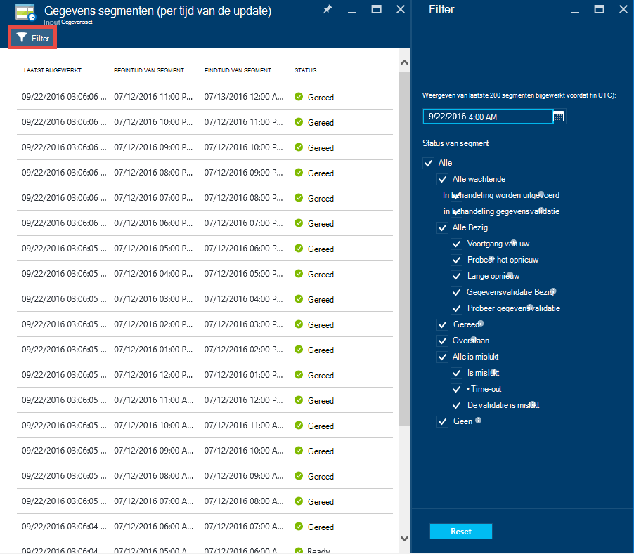

<properties 
    pageTitle="Zelfstudie: Een pijplijn maken met kopie activiteit met behulp van Azure portal | Microsoft Azure" 
    description="In deze zelfstudie maakt u een verkooppijplijn Factory van Azure-gegevens met de activiteit in een kopie met behulp van de gegevens Factory-Editor in de portal van Azure." 
    services="data-factory" 
    documentationCenter="" 
    authors="spelluru" 
    manager="jhubbard" 
    editor="monicar"/>

<tags 
    ms.service="data-factory" 
    ms.workload="data-services" 
    ms.tgt_pltfrm="na" 
    ms.devlang="na" 
    ms.topic="get-started-article" 
    ms.date="09/16/2016" 
    ms.author="spelluru"/>

# Zelfstudie: Een pijplijn maken met kopie activiteit met behulp van Azure portal
> [AZURE.SELECTOR]
- [Overzicht en vereisten](data-factory-copy-data-from-azure-blob-storage-to-sql-database.md)
- [Wizard kopiëren](data-factory-copy-data-wizard-tutorial.md)
- [Azure-portal](data-factory-copy-activity-tutorial-using-azure-portal.md)
- [Visual Studio](data-factory-copy-activity-tutorial-using-visual-studio.md)
- [PowerShell](data-factory-copy-activity-tutorial-using-powershell.md)
- [Azure resourcemanager-sjabloon](data-factory-copy-activity-tutorial-using-azure-resource-manager-template.md)
- [REST API](data-factory-copy-activity-tutorial-using-rest-api.md)
- [.NET-API](data-factory-copy-activity-tutorial-using-dotnet-api.md)

Deze zelfstudie ziet u hoe u maken en controleren van een Azure gegevens factory met behulp van de Azure portal. De pijplijn in de fabriek gegevens gebruikt de activiteit in een kopie gegevens van Azure-blobopslag kopiëren met Azure SQL-Database.

Hier volgen de stappen die u als onderdeel van deze zelfstudie uitvoeren:

Stap | Beschrijving
-----| -----------
[Maken van een fabriek Azure-gegevens](#create-data-factory) | In deze stap maakt u een Azure gegevens factory met de naam **ADFTutorialDataFactory**.  
[Gekoppelde services maken](#create-linked-services) | In deze stap maakt u twee gekoppelde services: **AzureStorageLinkedService** en **AzureSqlLinkedService**.   De AzureStorageLinkedService koppelingen de Azure opslag en AzureSqlLinkedService koppelingen de SQL Azure-database naar de ADFTutorialDataFactory. De ingevoerde gegevens worden voor de verkooppijplijn bevindt zich in een container blob in de Azure blob storage en uitvoer gegevens opgeslagen in een tabel in de SQL Azure-database. Daarom toevoegen u deze twee gegevensopslag als gekoppelde services fabriek gegevens.      
[Maken van de invoer en uitvoer gegevenssets](#create-datasets) | In de vorige stap gemaakt u gekoppelde services die verwijzen naar gegevens winkels die invoer/uitvoer gegevens bevatten. In deze stap definieert u twee gegevenssets-- **InputDataset** en **OutputDataset** --die de gegevens van de invoer/uitvoer die is opgeslagen in de gegevens voor te stellen.   U de container blob met een blob met de brongegevens en voor de OutputDataset opgeeft, u de SQL-tabel waarin de uitvoergegevens opgeven voor de InputDataset. U ook opgeven andere eigenschappen zoals structuur, beschikbaarheid en beleid. 
[Een pijplijn maken](#create-pipeline) | In deze stap maakt u een benoemde **ADFTutorialPipeline** in de ADFTutorialDataFactory pijplijn.   U kunt een **kopie activiteit** toevoegen aan de pijplijn kopieën input gegevens uit de Azure BLOB aan de uitvoer Azure SQL-tabel. De activiteit kopie kunt u de verplaatsing van gegevens uitvoeren in fabriek van Azure-gegevens. Is uitgerust met een globaal beschikbare service die gegevens tussen verschillende opgeslagen in de gegevens op een veilige, betrouwbare en scalable manier kunt kopiëren. Zie [Gegevens verkeer activiteiten](data-factory-data-movement-activities.md) artikel voor meer informatie over de activiteit kopiëren. 
[Monitor verkooppijplijn](#monitor-pipeline) | In deze stap kunt u segmenten van invoer- en uitvoerbereik tabellen controleren met behulp van Azure-portal.

## Vereisten voor 
Voltooid vereisten weergegeven in het artikel [Zelfstudie overzicht](data-factory-copy-data-from-azure-blob-storage-to-sql-database.md) voordat het uitvoeren van deze zelfstudie.

## Gegevens factory maken
In deze stap kunt u de Azure-portal gebruiken om te maken van een Azure gegevens factory met de naam **ADFTutorialDataFactory**.

1.  Na het aanmelden bij de [portal van Azure](https://portal.azure.com/), klikt u op **Nieuw**, selecteert u **bedrijfsinformatie + Analytics**en **Gegevens Factory**op. 

      

6. Klik in het **nieuwe gegevens factory** -blad:
    1. Voer **ADFTutorialDataFactory** voor de **naam**. 
    
        

        De naam van de fabriek Azure gegevens moet **uniek**zijn. Als u de volgende foutmelding ontvangt, wijzig de naam van de gegevens fabriek (bijvoorbeeld yournameADFTutorialDataFactory) en probeert opnieuw te maken. Zie [Gegevens Factory - regels voor naamgeving van](data-factory-naming-rules.md) onderwerp voor naming regels voor gegevens Factory onderdelen.
    
            Data factory name “ADFTutorialDataFactory” is not available  
     
        
    2. Selecteer uw Azure- **abonnement**.
    3. Voer een van de volgende stappen uit voor de groep Resource:
        1. Selecteer **bestaande gebruiken**en selecteer een bestaande resourcegroep in de vervolgkeuzelijst. 
        2. Selecteer **Nieuw**en voer de naam van een resourcegroep.   
    
            Enkele van de stappen in deze zelfstudie wordt ervan uitgegaan dat u de naam: **ADFTutorialResourceGroup** voor de resourcegroep. Meer informatie over resourcegroepen, raadpleegt u [werken met resourcegroepen voor het beheren van uw Azure resources](../azure-resource-manager/resource-group-overview.md).  
    4. Selecteer de **locatie** voor de fabriek gegevens. Alleen regio's die worden ondersteund door de service Factory gegevens worden weergegeven in de vervolgkeuzelijst.
    5. Selecteer **vastmaken aan Startboard**.     
    6. Klik op **maken**.

        > [AZURE.IMPORTANT] Als u wilt maken Data Factory-exemplaren, moet u lid zijn van de rol [Inzender Factory](../active-directory/role-based-access-built-in-roles.md/#data-factory-contributor) op het niveau van de groep abonnement/resource.
        >  
        >  De naam van de gegevens fabriek kan worden geregistreerd als een DNS-naam in de toekomst en dus worden openbaar zichtbaar.              
9.  De melding van de afleveringsstatus/om berichten te zien, klikt u op het-pictogram op de werkbalk. 

     
10. Nadat het is gemaakt, ziet u het blad **Gegevens Factory** zoals wordt weergegeven in de afbeelding.

    

## Gekoppelde services maken
Gekoppelde services opgeslagen gegevens koppelen of services naar een factory Azure gegevens berekenen. Zie [ondersteunde gegevens worden opgeslagen](data-factory-data-movement-activities.md##supported-data-stores-and-formats) voor alle bronnen en sinks worden ondersteund door de activiteit kopiëren. Zie voor de lijst met berekeningscluster services worden ondersteund door gegevens Factory [gekoppelde services berekenen](data-factory-compute-linked-services.md) . In deze zelfstudie u niet elke service berekeningscluster gebruikt. 

In deze stap maakt u twee gekoppelde services: **AzureStorageLinkedService** en **AzureSqlLinkedService**. AzureStorageLinkedService gekoppeld service koppelingen een Azure-Account voor opslagruimte en AzureSqlLinkedService koppelingen een Azure SQL-database naar de **ADFTutorialDataFactory**. U kunt een pijplijn maken verderop in deze zelfstudie die gegevens in een container blob in AzureStorageLinkedService naar een SQL-tabel in AzureSqlLinkedService kopiëren.

### Een gekoppelde service voor de opslag van Azure-account maken
1.  Klik in het blad **Gegevens Factory** op **auteur en implementeren** tegel aan het starten van de **Editor** voor de fabriek gegevens.

     
5. In de **Editor**, klikt u op de knop **nieuwe gegevens opslaan** op de werkbalk en selecteer **Azure opslag** in de vervolgkeuzelijst. Hier ziet u de JSON-sjabloon voor het maken van een Azure gekoppeld opslagservice in het rechterdeelvenster. 

        
6. Vervang `<accountname>` en `<accountkey>` met de naam van het account en belangrijke waarden van de account voor uw account Azure opslag. 

     
6. Klik op **Deploy** op de werkbalk. U ziet nu de geïmplementeerd **AzureStorageLinkedService** in de boomstructuur. 

    

> [AZURE.NOTE]
> Zie de [gegevens van/naar Azure Blob verplaatsen](data-factory-azure-blob-connector.md#azure-storage-linked-service) voor meer informatie over de eigenschappen van JSON.

### Een gekoppelde service voor het Azure SQL-Database maken
1. Klik in de **Gegevens Factory-Editor**, klikt u op de knop **nieuwe gegevens opslaan** op de werkbalk en selecteer **Azure SQL-Database** in de vervolgkeuzelijst. Hier ziet u de JSON-sjabloon voor het maken van de gekoppelde Azure SQL-service in het rechterdeelvenster.
2. Vervang `<servername>`, `<databasename>`, `<username>@<servername>`, en `<password>` met namen van uw Azure SQL server-database, gebruikersaccount en wachtwoord. 
3. Klik op **Deploy** op de werkbalk maken en implementeren van de **AzureSqlLinkedService**.
4. Bevestig dat u **AzureSqlLinkedService** in de structuurweergave zien. 

> [AZURE.NOTE]
> Zie de [gegevens van/naar Azure SQL-Database verplaatsen](data-factory-azure-sql-connector.md#azure-sql-linked-service-properties) voor meer informatie over de eigenschappen van JSON.

## Gegevenssets maken
In de vorige stap, u gekoppelde services **AzureStorageLinkedService** en **AzureSqlLinkedService** een Azure Storage-account en Azure SQL-database aan de fabriek gegevens hebt gemaakt: **ADFTutorialDataFactory**. In deze stap definieert u twee gegevenssets-- **InputDataset** en **OutputDataset** --die de gegevens van de invoer/uitvoer die is opgeslagen in de gegevens waarnaar wordt verwezen door AzureStorageLinkedService en AzureSqlLinkedService respectievelijk vertegenwoordigen. U de container blob met een blob met de brongegevens en voor OutputDataset opgeeft, u de SQL-tabel waarin de uitvoergegevens opgeven voor InputDataset. 

### Invoer gegevensset maken 
In deze stap maakt u een gegevensset met de naam **InputDataset** die naar een container blob in de opslagruimte van Azure dat wordt aangeduid door de service **AzureStorageLinkedService** gekoppeld verwijst.

1. Klik in de **Editor** voor de fabriek gegevens op **... Meer**, klikt u op **nieuwe gegevensset**en **Azure-blobopslag** op uit de vervolgkeuzelijst. 

    
2. JSON in het rechterdeelvenster vervangen door het volgende JSON-fragment: 

        {
          "name": "InputDataset",
          "properties": {
            "structure": [
              {
                "name": "FirstName",
                "type": "String"
              },
              {
                "name": "LastName",
                "type": "String"
              }
            ],
            "type": "AzureBlob",
            "linkedServiceName": "AzureStorageLinkedService",
            "typeProperties": {
              "folderPath": "adftutorial/",
              "fileName": "emp.txt",
              "format": {
                "type": "TextFormat",
                "columnDelimiter": ","
              }
            },
            "external": true,
            "availability": {
              "frequency": "Hour",
              "interval": 1
            }
          }
        }
        
     Houd rekening met de volgende punten: 
    
    - gegevensset **type** is ingesteld op **AzureBlob**.
    - **linkedServiceName** is ingesteld op **AzureStorageLinkedService**. U kunt deze gekoppelde service gemaakt in stap 2.
    - **mappad** is ingesteld op de container **adftutorial** . U kunt ook de naam van een blob in de map met de eigenschap **bestandsnaam** opgeven. Aangezien u niet de naam van de label opgeeft, worden gegevens uit alle BLOB's in de container wordt beschouwd als een invoergegevens.  
    - opmaak **type** is ingesteld op **tekstopmaak**
    - Er zijn twee velden in het tekstbestand – **Voornaam** en **Achternaam** , gescheiden door een kommateken (**columnDelimiter**) 
    - De **beschikbaarheid van** is ingesteld op **elk uur** (**frequentie** is ingesteld op **uur** en **interval** is ingesteld op **1**). Daarom Data Factory Hiermee wordt gezocht naar invoergegevens per uur in de hoofdmap van blob container (**adftutorial**) dat u hebt opgegeven. 
    
    Als u een **bestandsnaam** voor een gegevensset **invoer** niet opgeeft, worden alle bestanden/BLOB's uit de invoer map (**mappad**) worden beschouwd als invoer. Als u een bestandsnaam in de JSON opgeeft, wordt alleen het opgegeven bestand/blob asn invoer.
 
    Als u een **bestandsnaam** voor een **uitvoertabel**niet opgeeft, wordt de gegenereerde bestanden in de **mappad** heten in de volgende indeling: gegevens. &lt;Guid\&BT;. txt (voorbeeld: Data.0a405f8a-93ff-4c6f-b3be-f69616f1df7a.txt.).

    Gebruik de eigenschap **partitionedBy** **mappad** en de **bestandsnaam** dynamisch op basis van de tijd **SliceStart** stelt. In het volgende voorbeeld, mappad gebruikt jaar, maand en dag van de SliceStart (begintijd van het segment wordt verwerkt) en bestandsnaam uur vanaf de SliceStart gebruikt. Als een segment wordt geproduceerd voor 2016 bijvoorbeeld-09-20T08:00:00, de mapnaam is ingesteld op wikidatagateway/wikisampledataout/2016/09/20 en de bestandsnaam is ingesteld op 08.csv. 

            "folderPath": "wikidatagateway/wikisampledataout/{Year}/{Month}/{Day}",
            "fileName": "{Hour}.csv",
            "partitionedBy": 
            [
                { "name": "Year", "value": { "type": "DateTime", "date": "SliceStart", "format": "yyyy" } },
                { "name": "Month", "value": { "type": "DateTime", "date": "SliceStart", "format": "MM" } }, 
                { "name": "Day", "value": { "type": "DateTime", "date": "SliceStart", "format": "dd" } }, 
                { "name": "Hour", "value": { "type": "DateTime", "date": "SliceStart", "format": "hh" } } 
            ],
2. Klik op **Deploy** op de werkbalk maken en implementeren van de gegevensset **InputDataset** . Bevestig dat u ziet dat de **InputDataset** in de boomstructuur.

> [AZURE.NOTE]
> Zie de [gegevens van/naar Azure Blob verplaatsen](data-factory-azure-blob-connector.md#azure-blob-dataset-type-properties) voor meer informatie over de eigenschappen van JSON.

### Uitvoer gegevensset maken
In dit gedeelte van de stap maakt u een uitvoer gegevensset met de naam **OutputDataset**. Deze dataset verwijst naar een SQL-tabel in de voorgesteld door **AzureSqlLinkedService**Azure SQL-database. 

1. Klik in de **Editor** voor de fabriek gegevens op **... Meer**, klikt u op **nieuwe gegevensset**en **Azure SQL** op uit de vervolgkeuzelijst. 
2. JSON in het rechterdeelvenster vervangen door het volgende JSON-fragment:

        {
          "name": "OutputDataset",
          "properties": {
            "structure": [
              {
                "name": "FirstName",
                "type": "String"
              },
              {
                "name": "LastName",
                "type": "String"
              }
            ],
            "type": "AzureSqlTable",
            "linkedServiceName": "AzureSqlLinkedService",
            "typeProperties": {
              "tableName": "emp"
            },
            "availability": {
              "frequency": "Hour",
              "interval": 1
            }
          }
        }
        
     Houd rekening met de volgende punten: 
    
    - gegevensset **type** is ingesteld op **AzureSQLTable**.
    - **linkedServiceName** is ingesteld op **AzureSqlLinkedService** (u hebt deze gekoppelde service gemaakt in stap 2).
    - **tabelnaam** is ingesteld op **emp**.
    - Er zijn drie kolommen – **ID**, **Voornaam**en **Achternaam** – in de tabel emp in de database. ID is een id-kolom, dus u hier opgeeft moet, alleen **Voornaam** en **Achternaam** .
    - De **beschikbaarheid van** is ingesteld op **elk uur** (**interval** instellen op **uur** en **interval** ingesteld op **1**).  De gegevens Factory-service genereert een uitvoer gegevens segment per uur in de tabel **emp** in de SQL Azure-database.

3. Klik op **Deploy** op de werkbalk maken en implementeren van de gegevensset **OutputDataset** . Bevestig dat u ziet dat de **OutputDataset** in de boomstructuur. 

> [AZURE.NOTE]
> Zie de [gegevens van/naar Azure SQL-Database verplaatsen](data-factory-azure-sql-connector.md#azure-sql-linked-service-properties) voor meer informatie over de eigenschappen van JSON.

## Verkooppijplijn maken
In deze stap geeft u een pijplijn maken met een **Kopie activiteit** die **InputDataset** als invoer gebruikt en **OutputDataset** als uitvoer.

1. Klik in de **Editor** voor de fabriek gegevens op **... Meer**, en klik op **nieuwe verkooppijplijn**. U kunt ook met de rechtermuisknop op de **pijpleidingen** in de boomstructuur en klik op **nieuwe verkooppijplijn**.
2. JSON in het rechterdeelvenster vervangen door het volgende JSON-fragment: 
        
        {
          "name": "ADFTutorialPipeline",
          "properties": {
            "description": "Copy data from a blob to Azure SQL table",
            "activities": [
              {
                "name": "CopyFromBlobToSQL",
                "type": "Copy",
                "inputs": [
                  {
                    "name": "InputDataset"
                  }
                ],
                "outputs": [
                  {
                    "name": "OutputDataset"
                  }
                ],
                "typeProperties": {
                  "source": {
                    "type": "BlobSource"
                  },
                  "sink": {
                    "type": "SqlSink",
                    "writeBatchSize": 10000,
                    "writeBatchTimeout": "60:00:00"
                  }
                },
                "Policy": {
                  "concurrency": 1,
                  "executionPriorityOrder": "NewestFirst",
                  "retry": 0,
                  "timeout": "01:00:00"
                }
              }
            ],
            "start": "2016-07-12T00:00:00Z",
            "end": "2016-07-13T00:00:00Z"
          }
        } 

    Houd rekening met de volgende punten:

    - Klik in de sectie activiteiten is er slechts één activiteit waarvan het **type** is ingesteld op **kopiëren**.
    - Invoer voor de activiteit is ingesteld op **InputDataset** en uitvoer voor de activiteit is ingesteld op **OutputDataset**.
    - Klik in de sectie **typeProperties** **BlobSource** is opgegeven als het brontype en **SqlSink** is opgegeven als het type sink.

    Vervang de waarde van de eigenschap **start** met de huidige waarde voor de dag- en **eindtijd** met de volgende dag. U kunt opgeven alleen het deel van de datum en het tijdgedeelte van het datum-tijd overslaan. Bijvoorbeeld: "2016-02-03', die equivalent is aan ' 2016-02-03T00:00:00Z"
    
    Beide begin en einde datum/tijd moet [ISO](http://en.wikipedia.org/wiki/ISO_8601)-indeling. Bijvoorbeeld: 2016-10-14T16:32:41Z. **De eindtijd** is optioneel, maar wordt deze gebruikt in deze zelfstudie. 
    
    Als u geen waarde voor de eigenschap **end** opgeeft, wordt deze worden berekend als "**starten + 48 uur**". Als u wilt de pijplijn voor onbepaalde tijd uitvoert, geeft u **9999-09-09** als de waarde voor de eigenschap **end** .
    
    Klik in het voorgaande voorbeeld zijn er 24 gegevens segmenten elk segment gegevens per uur is geproduceerd.
    
4. Klik op **Deploy** op de werkbalk maken en implementeren van de **ADFTutorialPipeline**. Bevestig dat u ziet dat de pijplijn in de boomstructuur. 
5. Nu, sluit u het blad **Editor** door te klikken op **X**. Klik op **X** opnieuw als u wilt zien van de **Gegevens Factory** -startpagina voor de **ADFTutorialDataFactory**.

**Gefeliciteerd!** Je hebt gemaakt van een fabriek Azure gegevens, gekoppelde services, tabellen en een pijplijn en de pijplijn gepland.   
 
### De fabriek gegevens weergeven in een diagramweergave 
1. Klik in het blad **Gegevens Factory** op **Diagram**.

    
2. Hier ziet u het diagram die vergelijkbaar is met de volgende afbeelding: 

    

    U kunt inzoomen, uitzoomen, in-en uitzoomen op 100%, en uitzoomen passend maken, automatisch plaatsen pijpleidingen en tabellen en informatie over de afkomst weergeven (items worden gemarkeerd boven en lager van geselecteerde items).  Een object (invoer/uitvoer tabel of verkooppijplijn) om eigenschappen voor deze weer te geven, kunt u dubbelklikken. 
3. Met de rechtermuisknop op **ADFTutorialPipeline** in de diagramweergave en klik op **openen verkooppijplijn**. 

    
4. Hier ziet u de activiteiten in de pijplijn samen met invoer- en uitvoerbereik gegevenssets voor de activiteiten. In deze zelfstudie hebt u slechts één activiteit in de pijplijn (kopie activiteit) met InputDataset als invoer gegevensset en OutputDataset als uitvoer gegevensset.   

    
5. Klik op **gegevens factory** in de ' breadcrumb ' in de linkerbovenhoek teruggaan naar de diagramweergave te klikken. De diagramweergave weergegeven alle pijpleidingen. In dit voorbeeld hebt u slechts één verkooppijplijn gemaakt.   
 

## Monitor verkooppijplijn
In deze stap gebruikt u de Azure-portal om de wat er gebeurt in een fabriek Azure gegevens te houden. 

### Monitor verkooppijplijn met de diagramweergave

1. Klik op de **X** om te sluiten van de **diagramweergave** te klikken om te zien van de gegevens Factory-introductiepagina voor de fabriek gegevens. Als u de webbrowser hebt gesloten, volgt u de volgende stappen uit: 
    2. Navigeer naar [Azure-portal](https://portal.azure.com/). 
    2. Dubbelklik op **ADFTutorialDataFactory** op de **Startboard** () of klik op **gegevens factory's** in het linkermenu ADFTutorialDataFactory zoekt. 
3. U ziet het aantal en de namen van tabellen en verkooppijplijn die u op deze blade gemaakt.

    
4. Klik nu op de tegel **gegevenssets** .
5. Klik in het blad **gegevenssets** op **InputDataset**. Deze dataset is de invoer gegevensset voor **ADFTutorialPipeline**.

       
5. Klik op **... (weglatingsteken)** segmenten om alle gegevens weer te geven.

      

    Zoals u ziet dat alle gegevens segmenten snel aan de huidige tijd **klaar** zijn, omdat het bestand **emp.txt** altijd in de container blob bestaat: **adftutorial\input**. Bevestig dat er geen segmenten worden weergegeven in de sectie **onlangs mislukte segmenten** onderaan.

    Zowel **Onlangs bijgewerkt segmenten** en **onlangs is mislukt segmenten** lijsten zijn gesorteerd op de **tijd van laatste UPDATE**. 
    
    Klik op **Filter** op de werkbalk voor het filteren van segmenten.  
    
    
6. Sluit de bladen totdat u het blad **gegevenssets** ziet. Klik op de **OutputDataset**. Deze dataset is de gegevensset uitvoer voor **ADFTutorialPipeline**.

    
6. U ziet het blad **OutputDataset** zoals wordt weergegeven in de volgende afbeelding:

     
7. Zoals u ziet dat de segmenten gegevens snel aan de huidige tijd al gemaakt zijn en ze **klaar**zijn. Geen segmenten weergegeven in de sectie **probleem segmenten** onderaan.
8. Klik op **... (Weglatingsteken)** u wilt zien van alle segmenten.

    
9. Klik op een segment uit de lijst en ziet u het blad **gegevens segment** .

    
  
    Als het segment niet in de status **gereed is** , ziet u het boven segmenten die nog niet gereed en worden geblokkeerd door de huidige segment wordt uitgevoerd in de lijst **boven segmenten die niet gereed zijn** .
11. Klik in het **Segment** blad ziet u dat alle activiteit wordt uitgevoerd in de lijst onder. Klik op een **activiteit uitvoeren** als u wilt zien van het blad **activiteit details uitvoeren** . 

    
12. Klik op de **X** om te sluiten van alle bladen totdat u terug te gaan naar het thuis blad voor de **ADFTutorialDataFactory**.
14. (optioneel) **Pijpleidingen** Klik op de startpagina voor **ADFTutorialDataFactory** **ADFTutorialPipeline** en klik in het blad **pijpleidingen** , detailanalyse invoer tabellen (**verbruikt**) of uitvoertabellen (**geproduceerde**).
15. **SQL Server Management Studio**starten, verbinding maken met de Azure SQL-Database en controleer of de rijen worden ingevoegd de tabel **emp** in de database.

    

### Monitor verkooppijplijn met Monitor & App beheren
U kunt ook beeldscherm gebruiken en beheren van toepassing op uw pijpleidingen controleren. Zie voor gedetailleerde informatie over het gebruik van deze toepassing [beeldscherm en beheren van Azure gegevens Factory pijpleidingen controle en beheer App](data-factory-monitor-manage-app.md).

1. Klik op **controleren en beheren** tegel op de startpagina voor uw gegevens factory.

     
2. Hier ziet u **Monitor & beheren-toepassing**. Wijzig de **Begintijd** en **eindtijd** te starten (2016-07-12) opnemen en eindtijden (2016-07-13) van uw verkooppijplijn en klikt u op **toepassen**. 

     
3. Selecteer een venster van de activiteit in de lijst **Activiteit Windows** informatie over deze wilt weergeven. 
    

## Overzicht 
In deze zelfstudie hebt u een factory Azure-gegevens kopiëren hebt gemaakt gegevens uit een Azure blob met een Azure SQL-database. U gebruikte de Azure-portal voor het maken van de gegevens fabriek, gekoppelde services gegevenssets en een pijplijn. Hier volgen de hoofdstappen beschreven die u in deze zelfstudie hebt uitgevoerd:  

1.  Een Azure **gegevens factory**gemaakt.
2.  **Gekoppelde services**gemaakt:
    1. Een service **Azure Storage** gekoppeld aan uw opslagruimte Azure-account waarin invoergegevens koppelen.    
    2. Een gekoppelde **SQL Azure** -service om te koppelen van de Azure SQL-database waarin de uitvoergegevens. 
3.  **Gegevenssets** waarmee wordt beschreven invoergegevens en uitvoergegevens voor pijpleidingen gemaakt.
4.  Een **verkooppijplijn** gemaakt met een **Kopie activiteit** met **BlobSource** als de bron- en **SqlSink** als sink.  

## Zie ook
| Onderwerp | Beschrijving |
| :---- | :---- |
| [Gegevens verkeer activiteiten](data-factory-data-movement-activities.md) | In dit artikel vindt u gedetailleerde informatie over de kopie activiteit die u in deze zelfstudie hebt gebruikt. |
| [Plannings- en kan worden uitgevoerd](data-factory-scheduling-and-execution.md) | In dit artikel wordt uitgelegd dat de plannings- en execution aspecten van Azure gegevens Factory-toepassingsmodel. |
| [Pijpleidingen](data-factory-create-pipelines.md) | Dit artikel vindt u meer informatie over pijpleidingen en activiteiten in fabriek van Azure-gegevens. |
| [Gegevenssets](data-factory-create-datasets.md) | Dit artikel vindt u meer informatie over gegevenssets in fabriek van Azure-gegevens.
| [Bewaken en pijpleidingen met Monitoring App beheren](data-factory-monitor-manage-app.md) | In dit artikel wordt beschreven hoe bewaken, beheren en fouten opsporen in pijpleidingen met behulp van de controle Management-App. 

