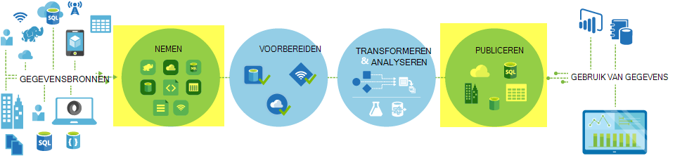

<properties
    pageTitle="Gegevens verplaatsen met behulp van de activiteit kopiëren | Microsoft Azure"
    description="Meer informatie over het verplaatsen van de gegevens Data Factory pijpleidingen: gegevensmigratie tussen cloud winkels, en tussen een on-premises implementatie store en een cloud-winkel. Gebruik kopie activiteit."
    keywords="gegevens, verplaatsing van gegevens, gegevensmigratie doorverbinden gegevens kopiëren"
    services="data-factory"
    documentationCenter=""
    authors="linda33wj"
    manager="jhubbard"
    editor="monicar"/>

<tags
    ms.service="data-factory"
    ms.workload="data-services"
    ms.tgt_pltfrm="na"
    ms.devlang="na"
    ms.topic="article"
    ms.date="09/22/2016"
    ms.author="jingwang"/>

# Gegevens verplaatsen met behulp van de activiteit kopiëren

## Overzicht
In fabriek van Azure-gegevens kunt u gegevens van verschillende vormen kopiëren vanuit verschillende on-premises en cloud gegevensbronnen samenvoegen tot Azure kopie activiteit. Nadat de gegevens zijn gekopieerd, kan deze worden verder getransformeerd en geanalyseerd. U kunt ook kopie activiteit gebruiken om-transformatie en analyseresultaten voor business intelligence (BI) en verbruik van de toepassing te publiceren.

Kopie activiteit is mogelijk gemaakt door een veilige, betrouwbare, scalable, en [globaal beschikbare service](#global). In dit artikel bevat informatie op de verplaatsing van de gegevens in de gegevens fabriek en de activiteit kopiëren.

Eerst, laten we eens kijken hoe gegevensmigratie plaatsvindt tussen twee cloud gegevens winkels, en tussen een gegevensopslag on-premises implementatie en een cloud-gegevensopslag.

> [AZURE.NOTE] Zie voor meer informatie over de activiteiten in het algemeen, [lidmaatschap pijpleidingen en activiteiten](data-factory-create-pipelines.md).

### Kopieer gegevens tussen twee cloud-gegevensopslag
Wanneer de bron- en sink gegevensopslag zijn in de cloud, gaat u kopie activiteit tot en met de volgende stadia gegevens uit de bron kopiëren naar de sink. De service die kopie activiteit bevoegdheden:

1. Leest gegevens van het bron-gegevensopslag.
2. Voert serialisatie/deserialisatie, compressie/decompressie, kolom toewijzen en conversie. Deze bewerkingen op basis van de configuraties van de invoer gegevensset, uitvoer gegevensset en kopie activiteit de optie doet.
3.  Schrijft gegevens naar de bestemming gegevensopslag.

De service kiest automatisch de optimale regio de verplaatsing van gegevens uitvoeren. Dit gebied is meestal het dichtst bevindt bij de gegevensopslag sink een.

### Gegevens kopiëren tussen een gegevensopslag on-premises implementatie en een cloud-gegevensopslag
Veilig als gegevens wilt verplaatsen tussen een gegevensopslag on-premises implementatie en een cloud-gegevensopslag, Data Management Gateway te installeren op uw lokale computer. Data Management Gateway is een agent waarmee hybride gegevens verplaatsen en verwerking. U kunt dit installeren op dezelfde computer als de gegevens opslaan zelf of op een aparte computer die toegang tot de gegevensopslag heeft.

In dit scenario Data Management Gateway wordt uitgevoerd de serialisatie/deserialisatie, compressie/decompressie, kolom toewijzen en conversie. Gegevens doorloopt niet tot en met de Azure gegevens Factory-service. Data Management Gateway schrijft de gegevens in plaats daarvan rechtstreeks naar de bestemming store.

Zie [gegevens verplaatsen tussen de on-premises en cloud gegevensopslag](data-factory-move-data-between-onprem-and-cloud.md) voor een inleiding en stapsgewijze instructies. Zie [Data Management Gateway](data-factory-data-management-gateway.md) voor gedetailleerde informatie over deze agent.

U kunt ook gegevensopslag gegevens van/naar ondersteund die worden gehost op IaaS Azure virtuele machines (VMs) met behulp van Data Management Gateway verplaatsen. U kunt in dit geval Data Management Gateway installeren op de dezelfde VM, zoals de gegevens opslaan zelf of op een aparte VM die toegang tot de gegevensopslag heeft.

## Ondersteunde gegevens worden opgeslagen en indelingen
[AZURE.INCLUDE [data-factory-supported-data-stores](../../includes/data-factory-supported-data-stores.md)]

Als u wilt verplaatsen opslaan gegevens uit een gegevens dat kopie activiteit niet ondersteunen, een **aangepaste activiteit** in Data Factory gebruiken met uw eigen logica voor het kopiëren/verplaatsen van gegevens. Zie voor meer informatie over het maken en gebruiken van een aangepaste activiteit, [aangepaste activiteiten gebruiken in een pijplijn Factory van Azure-gegevens](data-factory-use-custom-activities.md).

### Ondersteunde bestandsindelingen
U kunt kopiëren activiteit bestanden als kopiëren-tussen twee bestand gebaseerde gegevens winkels, zoals Azure Blob, bestandssysteem en HDFS. Hiervoor kunt u de [sectie indeling](data-factory-create-datasets.md) in zowel de definities van de invoer- en uitvoerbereik gegevensset overslaan. De gegevens efficiënt gekopieerd zonder eventuele serialisatie/deserialisatie.

Kopie activiteit ook leest uit en schrijft naar bestanden in de opgegeven indelingen: tekst, Avro ORC, parketvloeren en JSON. De volgende activiteiten kopiëren, kunt u bijvoorbeeld doen:

-   Gegevens in tekstindeling (CSV) van Azure Blob kopiëren en schrijven met Azure SQL-Database.
-   Bestanden kopiëren in tekstindeling (CSV) vanuit bestandssysteem on-premises en Azure Blob schrijven in Avro-indeling.
-   Wanneer u gegevens kopieert in Azure SQL-Database en schrijven naar HDFS on-premises implementatie in ORC-indeling.

## Algemeen beschikbaar gegevens verplaatsen
Azure Factory van gegevens is alleen beschikbaar in de regio's West VS, Oost Amerikaans en Noord Europe. De service die kopie activiteit bevoegdheden is echter beschikbaar globaal in de volgende regio's en locaties. De algemeen beschikbaar topologie zorgt ervoor dat de verplaatsing van de efficiënt gegevens die meestal cross-regio hops vermijdt. Zie [Services per regio](https://azure.microsoft.com/regions/#services) voor beschikbaarheid van gegevens fabriek en de verplaatsing van de gegevens in een gebied.

### Gegevens kopiëren naar andere cloud gegevensopslag
Als bron- en sink gegevensopslag in de cloud, wordt een service-implementatie in Data Factory gebruikt in het gebied dat zich het dichtst bij de sink in de dezelfde Geografie om de gegevens te verplaatsen. Raadpleeg de volgende tabel voor de toewijzing:

Gebied van de bestemming gegevensopslag | Regio gebruikt voor het verplaatsen van gegevens
:----------------------------------- | :----------------------------
Oost-VS | Oost-VS
Oost-Amerikaanse 2 | Oost-Amerikaanse 2
West VS | West VS
West Amerikaans 2 | West VS
Central US | Central US
West Centraal VS | Central US
Centraal Noord-Amerikaanse | Centraal Noord-Amerikaanse
Zuid-Central US | Zuid-Central US
Noord-Europa | Noord-Europa
West Europa | West Europa
Zuidoost-Azië | Zuidoost-Azië
Oost-Azië | Zuidoost-Azië
Japan Oost | Japan Oost
Japan West | Japan Oost
Brazilië Zuid | Brazilië Zuid
Australië Oost | Australië Oost
Australië Zuidoost | Australië Zuidoost
Centraal India | Centraal India
Zuid-India | Centraal India
West India | Centraal India

> [AZURE.NOTE] Als het gebied van de bestemming gegevensopslag niet in de bovenstaande lijst is, mislukt activiteit kopiëren in plaats van via een alternatief regio.

### Gegevens kopiëren tussen een gegevensopslag on-premises implementatie en een cloud-gegevensopslag
Wanneer de gegevens tussen on-premises implementatie (of Azure virtuele machines/IaaS) wordt gekopieerd en cloud winkels, [Data Management Gateway](data-factory-data-management-gateway.md) verplaatsing van gegevens uitvoert op een lokale computer of een virtuele machine. De gegevens doorloopt niet tot en met de service in de cloud, tenzij u de mogelijkheid [gefaseerde kopiëren](data-factory-copy-activity-performance.md#staged-copy) gebruiken. In dit geval doorloopt gegevens via het tijdelijk opslaan Azure-blobopslag voordat deze worden geschreven naar de gegevensopslag sink.

## Een pijplijn maken met de activiteit kopiëren
U kunt een pijplijn maken met kopie activiteit in een aantal manieren oplossen:

### Met behulp van de Wizard kopiëren
De Wizard Factory kopie helpt u bij het maken van een pijplijn met kopie activiteit. Deze verkooppijplijn kunt u gegevens van ondersteunde bronnen kopiëren naar bestemmingen *zonder het schrijven van JSON* definities van gekoppelde services, gegevenssets en pijpleidingen. Zie [Gegevens Factory-Wizard kopiëren](data-factory-copy-wizard.md) voor meer informatie over de wizard.  

### Met behulp van JSON-scripts
U kunt gegevens Factory Editor gebruiken in de portal van Azure, Visual Studio of Azure PowerShell een JSON-definitie voor een pijplijn maken (met behulp van de activiteit kopiëren). Vervolgens kunt u erop om te maken van de pijplijn in gegevens fabriek implementeren. Zie [Zelfstudie: gebruik kopie activiteit in een pijplijn Azure gegevens Factory](data-factory-copy-data-from-azure-blob-storage-to-sql-database.md) voor een zelfstudie met stapsgewijze instructies.    

Eigenschappen van JSON (zoals naam, beschrijving, invoer en uitvoer tabellen en beleidsregels) zijn beschikbaar voor alle typen activiteiten. Eigenschappen die beschikbaar zijn in de `typeProperties` gedeelte van de activiteit variëren met elk activiteitstype.

Voor een activiteit kopiëren de `typeProperties` sectie varieert afhankelijk van de soorten gegevensbronnen en sinks. Klik op een bron/sink in de sectie [bronnen en sinks ondersteund](#supported-data-stores) voor meer informatie over de eigenschappen van het type die ondersteuning biedt voor kopie activiteit voor die gegevensopslag.   

Hier volgt een voorbeeld JSON definitie:

    {
      "name": "ADFTutorialPipeline",
      "properties": {
        "description": "Copy data from Azure blob to Azure SQL table",
        "activities": [
          {
            "name": "CopyFromBlobToSQL",
            "type": "Copy",
            "inputs": [
              {
                "name": "InputBlobTable"
              }
            ],
            "outputs": [
              {
                "name": "OutputSQLTable"
              }
            ],
            "typeProperties": {
              "source": {
                "type": "BlobSource"
              },
              "sink": {
                "type": "SqlSink",
                "writeBatchSize": 10000,
                "writeBatchTimeout": "60:00:00"
              }
            },
            "Policy": {
              "concurrency": 1,
              "executionPriorityOrder": "NewestFirst",
              "retry": 0,
              "timeout": "01:00:00"
            }
          }
        ],
        "start": "2016-07-12T00:00:00Z",
        "end": "2016-07-13T00:00:00Z"
      }
    }

De planning die is gedefinieerd in de gegevensset uitvoer bepaalt wanneer de activiteit wordt uitgevoerd (bijvoorbeeld: **dagelijkse**, frequentie als **dag**en interval als **1**). De activiteit kopieert gegevens uit een invoer dataset (**bron**) naar een gegevensset uitvoer (**sink**).

Meer dan één invoer gegevensset naar kopie activiteit, kunt u opgeven. Ze worden gebruikt om te controleren of de afhankelijkheden voordat de activiteit wordt uitgevoerd. Alleen de gegevens uit de eerste gegevensset is echter gekopieerd naar de bestemming gegevensset. Zie [plannen en uitvoeren](data-factory-scheduling-and-execution.md)voor meer informatie.  

## Prestaties en optimaliseren
Zie de [kopie activiteit prestaties en afstemmen handleiding](data-factory-copy-activity-performance.md), waarin wordt beschreven belangrijke factoren die van invloed zijn op de prestaties van gegevens verplaatsen (kopie activiteit) in fabriek van Azure-gegevens. Deze ook de waargenomen prestaties tijdens het testen van interne lijsten beschreven en worden verschillende manieren om te optimaliseren van de prestaties van de activiteit kopiëren.

## Planning en opeenvolgende kopiëren
Zie [plannen en uitvoeren](data-factory-scheduling-and-execution.md) voor gedetailleerde informatie over het plannen van en tot het uitvoeren van bestanden in Data Factory. Het is mogelijk meerdere kopieerbewerkingen achter elkaar uitvoeren op een wijze opeenvolgende/besteld. Zie het gedeelte [besteld kopiëren](data-factory-scheduling-and-execution.md#ordered-copy) .

## Typeconversies
Verschillende gegevens winkels hebben verschillende systeemeigen type systemen. Kopie activiteit worden automatische typeconversies van de typen gegevensbronnen om op te vangen typen met de volgende twee stappen benadering uitgevoerd:

1. Van systeemeigen gegevensbronnen van het type converteren naar een type .NET.
2. Van een type .NET converteren naar een type systeemeigen sink.

De toewijzing van een typesysteem systeemeigen op het type .NET voor een gegevensopslag is in de desbetreffende gegevens store artikel. (Klik op de specifieke koppeling in de tabel [gegevensopslag ondersteund](#supported-data-stores) ). U kunt deze toewijzingen gebruiken om te bepalen juiste typen tijdens het maken van tabellen, zodat de kopie activiteit kunt u de juiste conversies uitvoeren.

## Volgende stappen
- Zie meer informatie over de activiteit kopiëren, [Kopieer de gegevens van Azure-blobopslag met Azure SQL-Database](data-factory-copy-data-from-azure-blob-storage-to-sql-database.md).
- Zie voor meer informatie over het verplaatsen van gegevens uit een on-premises implementatie gegevensopslag naar een cloud-gegevensopslag, [verplaatsen gegevens uit lokale gegevens naar cloud opgeslagen](data-factory-move-data-between-onprem-and-cloud.md).
