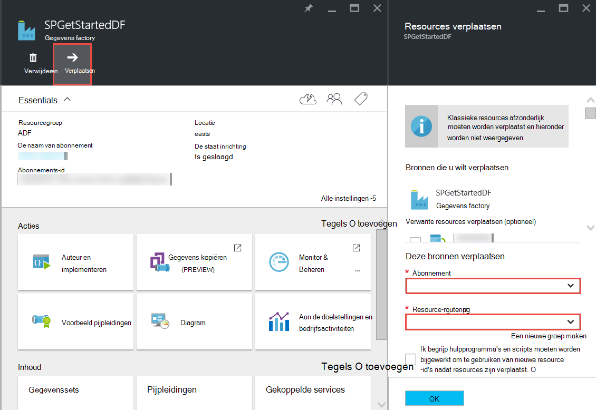

<properties 
    pageTitle="Azure gegevens Factory - Veelgestelde vragen" 
    description="Veelgestelde vragen over Factory van Azure-gegevens." 
    services="data-factory" 
    documentationCenter="" 
    authors="sharonlo101" 
    manager="jhubbard" 
    editor="monicar"/>

<tags 
    ms.service="data-factory" 
    ms.workload="data-services" 
    ms.tgt_pltfrm="na" 
    ms.devlang="na" 
    ms.topic="article" 
    ms.date="09/12/2016" 
    ms.author="shlo"/>

# Azure gegevens Factory - Veelgestelde vragen

## Algemene vragen

### Wat is Factory van Azure-gegevens?

Gegevens Factory is een cloudgebaseerde service-gegevensintegratie van de die **automatiseert de verplaatsing en transformatie van gegevens**. Net als een factory die wordt uitgevoerd als u wilt uitvoeren onbewerkte materialen en ze te zetten in gereed product postvakken van apparatuur, orchestrates Data Factory bestaande services die onbewerkte gegevens verzamelen en transformeren in kant-en-klare informatie. 
 
Gegevens Factory kunt u op gegevens gebaseerde werkstromen als gegevens wilt verplaatsen tussen zowel on-premises implementatie en cloud gegevens winkels als proces/transformeren gegevens met behulp van berekeningscluster services zoals Azure HDInsight en Azure gegevens Lake analyses maken. Nadat u een pijplijn waarmee de actie die u nodig hebt gemaakt, kunt u deze periodiek wordt uitgevoerd (per uur, dagelijks, wekelijks, enz.) plannen.   

Zie [Overzicht & toets concepten](data-factory-introduction.md) voor meer informatie. 

### Waar vind ik details prijzen voor Factory van Azure-gegevens?

Zie [gegevens Factory prijzen detailpagina] [ adf-pricing-details] voor de prijzen informatie voor de fabriek Azure-gegevens.  

### Hoe ga ik aan de slag met Azure gegevens Factory?

- Zie [Inleiding tot Factory van Azure-gegevens](data-factory-introduction.md)voor een overzicht van Azure gegevens Factory.
- Zie voor een zelfstudie over het **kopiëren/verplaatsen gegevens** met behulp van de activiteit kopiëren, [gegevens kopiëren van Azure-blobopslag met Azure SQL-Database](data-factory-copy-data-from-azure-blob-storage-to-sql-database.md).
- Gebruik HDInsight component activiteit voor een zelfstudie over het om gegevens te **Transformeren** . Zie [procesgegevens met een component script op Hadoop cluster](data-factory-build-your-first-pipeline.md) 
  
### Wat is de beschikbaarheid van de regio van de gegevens fabriek?
Gegevens Factory is beschikbaar in de **VS West** en **Noord-Europa**. De opslag en rekenkracht services die worden gebruikt door gegevens factory's kunnen zijn in andere regio's. Zie [ondersteunde regio's](data-factory-introduction.md#supported-regions). 
 
### Wat zijn de beperkingen ten aanzien van het aantal gegevens factory's / pijpleidingen/activiteiten/gegevenssets?
 
Zie **Azure gegevens Factory beperkingen voor** de sectie van het artikel [Azure-abonnement en limieten van de Service, quota, en voorwaarden](../azure-subscription-service-limits.md#data-factory-limits) .

### Wat is de authoring/ontwikkelaars-ervaring met Azure gegevens Factory-service?

U kunt auteur/maken gegevens factory's met een van de volgende opties:

- **Azure-portal**  
   de gegevens Factory-bladen in de portal van Azure bieden uitgebreide gebruikersinterface voor u gegevensservices factory's ad gekoppeld maken. De **Gegevens Factory-Editor**, die ook deel van de portal uitmaakt, kunt u eenvoudig gekoppelde services, tabellen, gegevenssets en pijpleidingen maken door het opgeven van JSON definities voor deze onderdelen. Zie [uw eerste gegevens verkooppijplijn met behulp van Azure portal maken](data-factory-build-your-first-pipeline-using-editor.md) voor een voorbeeld van het gebruik van de portal-editor maken en implementeren van een fabriek gegevens.

- **Visual Studio**  
   kunt u Visual Studio om te maken van een fabriek Azure-gegevens. Zie [uw eerste gegevens verkooppijplijn gebruik van Visual Studio maken](data-factory-build-your-first-pipeline-using-vs.md) voor meer informatie. 

- **Azure PowerShell**  
   Zie [maken en monitor Azure gegevens Factory Azure PowerShell gebruiken](data-factory-build-your-first-pipeline-using-powershell.md) voor zelfstudie/Stapsgewijze instructies voor het maken van een gegevens factory via PowerShell. [Naslag voor Data Factory-Cmdlet] Zie[ adf-powershell-reference] inhoud op MSDN-bibliotheek voor een uitgebreide documentatie van gegevens Factory-cmdlets.
   
- **.NET-klassenbibliotheek**  
   u kunt gegevens factory's via programmacode maken met behulp van Data Factory .NET SDK. Zie [maken, controleren, en beheren van gegevens factory's met .NET SDK](data-factory-create-data-factories-programmatically.md) voor stapsgewijze instructies voor het maken van een gegevens factory met .NET SDK. [Naslag voor Data Factory Class bibliotheek] Zie[ msdn-class-library-reference] voor een uitgebreide documentatie van gegevens Factory .NET SDK.

- **REST API**  
   u kunt ook de REST API die worden aangeboden door de service Azure gegevens Factory maken en implementeren van gegevens factory's gebruiken. [Naslag voor Data Factory REST API] Zie[ msdn-rest-api-reference] voor een uitgebreide documentatie van gegevens Factory REST API.
 
- **Azure resourcemanager sjabloon** 
   Zie [Zelfstudie: uw eerste Azure gegevens factory met Azure resourcemanager-sjabloon maken](data-factory-build-your-first-pipeline-using-arm.md) voor meer informatie. 

### Kan ik de naam van een fabriek gegevens wijzigen?
Nee. Als andere Azure bronnen, worden de naam van een fabriek Azure gegevens niet gewijzigd. 

### Kan ik een factory gegevens uit één Azure abonnement naar de andere verplaatsen? 
Ja. Gebruik de knop **verplaatsen** op uw gegevens factory-blade zoals wordt weergegeven in het volgende diagram. 

### Wat zijn de berekeningscluster omgevingen worden ondersteund door gegevens Factory?
De volgende tabel vindt u een lijst met berekeningscluster omgevingen worden ondersteund door gegevens fabriek en de activiteiten die kunnen worden uitgevoerd op deze. 

| Omgeving berekenen | activiteiten |
| ------------------- | -------- | 
| [Op aanvraag HDInsight cluster](data-factory-compute-linked-services.md#azure-hdinsight-on-demand-linked-service) of [uw eigen cluster HDInsight](data-factory-compute-linked-services.md#azure-hdinsight-linked-service) | [DotNet](data-factory-use-custom-activities.md), [component](data-factory-hive-activity.md), [varken](data-factory-pig-activity.md), [MapReduce](data-factory-map-reduce.md), [Hadoop Streaming](data-factory-hadoop-streaming-activity.md) | 
| [Azure Batch](data-factory-compute-linked-services.md#azure-batch-linked-service) | [DotNet](data-factory-use-custom-activities.md) |  
| [Azure Machine Learning](data-factory-compute-linked-services.md#azure-machine-learning-linked-service) | [Machine Learning activiteiten: Batch Execution en Update Resource](data-factory-azure-ml-batch-execution-activity.md) |
| [Azure gegevens Lake Analytics](data-factory-compute-linked-services.md#azure-data-lake-analytics-linked-service) | [Gegevens Lake Analytics I-SQL](data-factory-usql-activity.md)
| [Azure SQL](data-factory-compute-linked-services.md#azure-sql-linked-service) [Azure SQL datawarehouse](data-factory-compute-linked-services.md#azure-sql-data-warehouse-linked-service), [SQL Server](data-factory-compute-linked-services.md#sql-server-linked-service) | [Opgeslagen Procedure](data-factory-stored-proc-activity.md)

## Activiteiten - Veelgestelde vragen
### Wat zijn de verschillende soorten activiteiten die u in een pijplijn Data Factory gebruiken kunt? 

- [Gegevens verkeer activiteiten](data-factory-data-movement-activities.md) om gegevens te verplaatsen.
- [Gegevens transformatie activiteiten](data-factory-data-transformation-activities.md) voor proces/transformeren gegevens. 

### Wanneer wordt een activiteit uitgevoerd?
De **beschikbaarheid van de** configuratie-instelling in de tabel uitvoer gegevens wordt bepaald wanneer de activiteit wordt uitgevoerd. Als invoer gegevenssets zijn opgegeven, de activiteit wordt gecontroleerd of alle invoergegevens afhankelijkheden is voldaan **(dat wil zeggen gereed)** voordat deze wordt gestart. 

## Kopieer activiteit - Veelgestelde vragen
### Is het beter een pijplijn met meerdere activiteiten of een afzonderlijke pijplijn voor elke activiteit? 
Pijpleidingen moeten gerelateerde activiteiten bundelen. Als de gegevenssets die verbinding maken met deze niet worden gebruikt door andere activiteiten buiten de pijplijn, kunt u de activiteiten in één pijplijn behouden. Op deze manier zou niet moet u ketting verkooppijplijn actieve perioden zodat ze met elkaar worden uitgelijnd. De integriteit van gegevens in de tabellen naar de pijplijn interne is ook beter behouden bij het bijwerken van de pijplijn. Verkooppijplijn update in principe stopt van alle activiteiten binnen de pijplijn, worden deze verwijderd en worden deze opnieuw gemaakt. Vanuit het perspectief authoring, mogelijk beter om de stroom van gegevens binnen de gerelateerde activiteiten in één JSON-bestand voor de pijplijn weer te geven.

### Wat zijn de ondersteunde winkels?
[AZURE.INCLUDE [data-factory-supported-data-stores](../../includes/data-factory-supported-data-stores.md)]

### Wat zijn de ondersteunde bestandsindelingen? 
[AZURE.INCLUDE [data-factory-file-format](../../includes/data-factory-file-format.md)]

### Waar is de kopieerbewerking uitvoeren? 
Zie de sectie [Algemeen beschikbaar gegevens verplaatsen](data-factory-data-movement-activities.md#global) voor meer informatie. Kortom, wanneer een on-premises implementatie gegevensopslag gaat, wordt de kopieerbewerking uitgevoerd door de Data Management Gateway in uw on-premises omgeving. En, als de verplaatsing van gegevens tussen de twee cloud winkels, de kopieerbewerking wordt uitgevoerd in de dichtst bevindt bij de sink locatie in de dezelfde geografische regio. 

## HDInsight activiteit - Veelgestelde vragen

### Welke regio's worden ondersteund door HDInsight?

Zie het gedeelte geografische beschikbaarheid in het volgende artikel: of [HDInsight prijzen Details][hdinsight-supported-regions].

### Welke regio wordt gebruikt door een op aanvraag HDInsight cluster?

Het op aanvraag HDInsight cluster is gemaakt in dezelfde regio waar de opslagruimte die u hebt opgegeven om te worden gebruikt met het cluster bestaat.    

### Hoe accounts extra opslagruimte aan uw cluster HDInsight koppelen?

Als u uw eigen HDInsight Cluster (BYOC - uw eigen Cluster brengen) gebruikt, raadpleegt u de volgende onderwerpen: 

- [Gebruik van een HDInsight Cluster met alternatieve opslag Accounts en Metastores][hdinsight-alternate-storage]
- [Extra opslagruimte Accounts gebruiken met HDInsight-component][hdinsight-alternate-storage-2]

Als u een cluster op aanvraag die is gemaakt door de gegevens Factory-service gebruikt, geeft u extra opslagruimte accounts voor de HDInsight gekoppeld service zodat de gegevens Factory-service namens u registreren kunt. In de JSON-definitie voor de gekoppelde op aanvraag-service, gebruikt u **additionalLinkedServiceNames** eigenschap alternatieve opslag accounts zoals wordt weergegeven in het volgende JSON-fragment opgeven:
 
    {
        "name": "MyHDInsightOnDemandLinkedService",
        "properties":
        {
            "type": "HDInsightOnDemandLinkedService",
            "typeProperties": {
                "clusterSize": 1,
                "timeToLive": "00:01:00",
                "linkedServiceName": "LinkedService-SampleData",
                "additionalLinkedServiceNames": [ "otherLinkedServiceName1", "otherLinkedServiceName2" ] 
            }
        }
    } 

In het bovenstaande voorbeeld vertegenwoordigen otherLinkedServiceName1 en otherLinkedServiceName2 gekoppelde services waarvan definities referenties die het cluster HDInsight nodig heeft bevatten voor toegang tot alternatieve opslag-accounts.

## Segmenten - Veelgestelde vragen

### Waarom zijn mijn invoer segmenten niet in gereed?  
Een algemene fout is niet instelling **externe** eigenschap op **waar** op de invoer gegevensset als de invoergegevens externe gegevens fabriek (niet geproduceerd door de factory gegevens). 

In het volgende voorbeeld moet u alleen **externe** ingesteld op waar op **dataset1**.  

**DataFactory1** Verkooppijplijn 1: dataset1 -> activity1 -> dataset2 -> activity2 -> dataset3 verkooppijplijn 2: dataset3 -> activity3 -> dataset4

Als u een andere gegevens fabriek met een pijplijn waarmee dataset4 (gemaakt met de verkooppijplijn 2 in gegevens fabriek 1) hebt, moet u dataset4 als een externe dataset markeren omdat de gegevensset wordt geproduceerd door een andere gegevens factory (DataFactory1, niet DataFactory2).  

**DataFactory2**    
Verkooppijplijn 1: dataset4 -> activity4 -> dataset5

Als de eigenschap external juist is ingesteld, controleert u of de invoergegevens in de opgegeven locatie in de definitie van de invoer gegevensset bestaat. 

### Het uitvoeren van een segment op een later tijdstip dan middernacht wanneer het segment dagelijks wordt geproduceerd?
De eigenschap **verschuiving** gebruikt om op te geven het tijdstip waarop u het segment te produceren. Zie de sectie [beschikbaarheid van de gegevensset](data-factory-create-datasets.md#Availability) voor meer informatie over deze eigenschap. Hier volgt een snel voorbeeld:

    "availability":
    {
        "frequency": "Day",
        "interval": 1,
        "offset": "06:00:00"
    }

Dagelijkse segmenten starten **6 AM** in plaats van de standaard-middernacht.     

### Hoe kan ik een segment opnieuw uitvoeren?
U kunt een segment opnieuw uitvoeren in een van de volgende manieren: 

- Monitor en App beheren een activiteitvenster of segment opnieuw wilt gebruiken. Zie de [geselecteerde activiteit windows opnieuw uitvoeren](data-factory-monitor-manage-app.md#re-run-selected-activity-windows) voor instructies.   
- Klik op **uitvoeren** in de opdrachtenbalk op het blad **Segment van de gegevens** voor het segment in de portal van Azure.
- Voer de cmdlet **Set-AzureRmDataFactorySliceStatus** met Status is ingesteld op **wachten** voor het segment.   
    
        Set-AzureRmDataFactorySliceStatus -Status Waiting -ResourceGroupName $ResourceGroup -DataFactoryName $df -TableName $table -StartDateTime "02/26/2015 19:00:00" -EndDateTime "02/26/2015 20:00:00" 

Zie [Set-AzureRmDataFactorySliceStatus] [ set-azure-datafactory-slice-status] voor meer informatie over de cmdlet. 

### Hoe lang duurt het verwerken van een segment?
Gebruik activiteit venster Explorer in Monitor & App beheren om te weten hoe lang het heeft geduurd een segment gegevens verwerken. Zie [Activiteit venster Explorer](data-factory-monitor-manage-app.md#activity-window-explorer) voor meer informatie. 

U kunt ook het volgende in de portal van Azure doen:  

1. Klik op de tegel **gegevenssets** op het blad **Gegevens FACTORY** voor uw gegevens factory.
2. Klik op de specifieke gegevensset op het blad **gegevenssets** .
3. Selecteer het segment waarin u geïnteresseerd in de lijst **recente segmenten** op het blad **tabel bent** .
4. Klik op de activiteit uitvoeren in de lijst **Activiteit wordt uitgevoerd** op het blad **Gegevens segment** . 
5. Klik op de tegel **Eigenschappen** op het blad **Activiteit uitvoeren DETAILS** . 
6. Hier ziet u het veld **duur** met een waarde. Deze waarde is het tijd verwerking van het segment.   

### Hoe u een actieve segment stoppen?
Als u stoppen met de pijplijn wilt wordt uitgevoerd, kunt u de cmdlet [Onderbreking-AzureRmDataFactoryPipeline](https://msdn.microsoft.com/library/mt603721.aspx) . Op dit moment stopt de pijplijn geschorst niet het segment executions die uitgevoerd worden. Wanneer u klaar bent met het executions in uitvoering, is geen extra segment opgenomen.

Als u zeker stoppen met alle executions onmiddellijk wilt, zou zijn de enige manier om te verwijderen van de pijplijn en maak deze opnieuw. Als u cookies verwijdert de pijplijn, hoeft u niet om tabellen en gekoppelde services gebruikt door de pijplijn te verwijderen. 

[create-factory-using-dotnet-sdk]: data-factory-create-data-factories-programmatically.md
[msdn-class-library-reference]: https://msdn.microsoft.com/library/dn883654.aspx
[msdn-rest-api-reference]: https://msdn.microsoft.com/library/dn906738.aspx

[adf-powershell-reference]: https://msdn.microsoft.com/library/dn820234.aspx 
[azure-portal]: http://portal.azure.com
[set-azure-datafactory-slice-status]: https://msdn.microsoft.com/library/mt603522.aspx

[adf-pricing-details]: http://go.microsoft.com/fwlink/?LinkId=517777
[hdinsight-supported-regions]: http://azure.microsoft.com/pricing/details/hdinsight/
[hdinsight-alternate-storage]: http://social.technet.microsoft.com/wiki/contents/articles/23256.using-an-hdinsight-cluster-with-alternate-storage-accounts-and-metastores.aspx
[hdinsight-alternate-storage-2]: http://blogs.msdn.com/b/cindygross/archive/2014/05/05/use-additional-storage-accounts-with-hdinsight-hive.aspx
 
