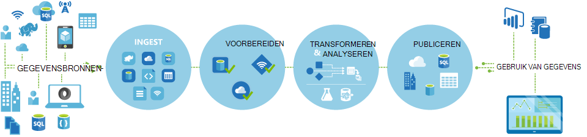
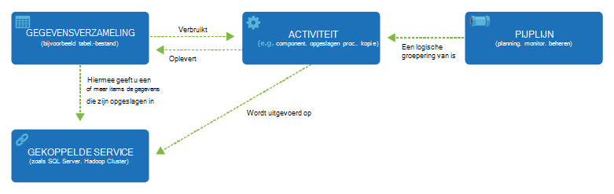

<properties 
    pageTitle="Inleiding tot Data Factory, een service van de integratie van gegevens | Microsoft Azure" 
    description="Leer wat Azure gegevens Factory is: een cloud-integratie gegevensservice die orchestrates en automatiseert verplaatsing en transformatie van gegevens." 
    keywords="integratie van gegevens, cloud de integratie van gegevens, wat azure gegevens factory is"
    services="data-factory" 
    documentationCenter="" 
    authors="sharonlo101" 
    manager="jhubbard" 
    editor="monicar"/>

<tags 
    ms.service="data-factory" 
    ms.workload="data-services" 
    ms.tgt_pltfrm="na" 
    ms.devlang="na" 
    ms.topic="get-started-article" 
    ms.date="09/22/2016" 
    ms.author="shlo"/>

# Inleiding tot Azure-Service voor het Factory van gegevens, een service van de integratie van gegevens in de cloud

## Wat is Factory van Azure-gegevens? 
Gegevens Factory is een cloudgebaseerde integratie gegevensservice die orchestrates en automatiseert de **verplaatsing** en **transformatie** van gegevens. U kunt gegevensoplossingen voor integratie met de gegevens Factory-service die u kunnen gegevens uit verschillende gegevens winkels nemen, transformeren/proces de gegevens en de resultaatgegevens publiceren naar opgeslagen gegevens maken. 

Factory-gegevensservice kunt u gegevens pijpleidingen die verplaatsen en transformeren van gegevens maken en voer vervolgens de pijpleidingen op een bepaald schema (per uur, dagelijks, wekelijks, enz.). Ook vindt u uitgebreide visualisaties als u wilt de over de afkomst en afhankelijkheden tussen uw pijpleidingen gegevens weergeven en controleren van uw gegevens pijpleidingen uit een gecombineerde weergave om op te sporen eenvoudig problemen en waarschuwingen voor controle-instelling.

**Figure1.** Gegevens uit verschillende gegevensbronnen nemen, voorbereiden transformeren, en de gegevens analyseren en vervolgens publiceren kant-en-klare gegevens voor verbruik.

## Pijpleidingen en activiteiten
In een oplossing Data Factory maakt u een of meer gegevens **pijpleidingen**. Een pijplijn is een logische groepering van activiteiten. Ze worden gebruikt voor groepsactiviteiten in een eenheid groeperen die samen een taak uitvoeren. 

**Activiteiten** definiëren de acties uit te voeren op uw gegevens. U kunt bijvoorbeeld een activiteit in een kopie gegevens uit één gegevensopslag kopiëren naar een andere gegevensopslag. U kunt ook een activiteit component, die wordt uitgevoerd van een query component op een cluster Azure HDInsight transformeren of het analyseren van uw gegevens. Gegevens Factory ondersteunt twee soorten activiteiten: gegevens verkeer activiteiten en gegevens-transformatie activiteiten. 
  
## Gegevens verkeer activiteiten 
[AZURE.INCLUDE [data-factory-supported-data-stores](../../includes/data-factory-supported-data-stores.md)]

Zie [Gegevens verkeer activiteiten](data-factory-data-movement-activities.md) artikel voor meer informatie. 

## Gegevens transformatie activiteiten
[AZURE.INCLUDE [data-factory-transformation-activities](../../includes/data-factory-transformation-activities.md)]

Zie [Gegevens transformatie activiteiten](data-factory-data-transformation-activities.md) artikel voor meer informatie.

Als u wilt verplaatsen opslaan gegevens uit een gegevens dat kopie activiteit niet wordt ondersteund, of gegevens met behulp van uw eigen logica transformeren, een **aangepaste .NET activiteit**maken. Zie voor meer informatie over het maken en gebruiken van een aangepaste activiteit, [aangepaste activiteiten gebruiken in een pijplijn Factory van Azure-gegevens](data-factory-use-custom-activities.md).

## Gekoppelde services
Gekoppelde services definiëren de informatie die u nodig hebt voor gegevens Factory verbinding maken met externe bronnen (voorbeelden: Azure-opslag, on-premises implementatie SQL Server Azure HDInsight). Gekoppelde services worden gebruikt om twee redenen in fabriek van gegevens:

- Voor een **gegevens opslaan** een lokale SQL Server, Oracle-database, waaronder, maar niet beperkt tot, het bestand delen of een Azure-blobopslag-account. Zie het gedeelte [gegevens verkeer activiteiten](data-factory-data-movement-activities.md) voor een lijst van ondersteunde gegevensopslag. 
- Om aan te geven aan een **resource berekenen** dat de host van de uitvoering van een activiteit. De activiteit HDInsightHive wordt bijvoorbeeld op een cluster HDInsight Hadoop uitgevoerd. Zie [gegevens transformatie activiteiten](data-factory-data-transformation-activities.md) de sectie voor een lijst van ondersteunde berekeningscluster omgevingen. 

## Gegevenssets 
Gegevensopslag gekoppelde services koppelen aan een factory Azure-gegevens. Gegevenssets vertegenwoordigen gegevensstructuren met in opgeslagen gegevens. Een Azure gekoppeld opslagservice bevat bijvoorbeeld verbindingsinformatie voor gegevens Factory verbinding maken met een opslag van Azure-account. Een gegevensset Azure Blob Hiermee geeft u de container blob en een map in de Azure-blobopslag waaruit de pijplijn de gegevens moet lezen. Daarnaast een gekoppelde Azure SQL-service biedt verbindingsinformatie voor een Azure SQL-database en een gegevensset Azure SQL Hiermee geeft u de tabel die de gegevens bevat.   

## Relatie tussen gegevens Factory entiteiten
Gegevens Factory heeft enkele belangrijke entiteiten die samenwerken definieert invoer en uitvoer van gegevens, verwerking van gebeurtenissen, en de planning en resources die zijn vereist voor het uitvoeren van de gewenste gegevensstroom.

**afbeelding 2.** Relaties tussen de gegevensset, activiteit verkooppijplijn en gekoppelde service

Met de vier eenvoudige principes van gekoppelde services, gegevenssets, activiteiten en pijpleidingen bent u wilt gaan. U kunt [uw eerste verkooppijplijn maken](data-factory-build-your-first-pipeline.md). 

## Ondersteunde regio 's
U kunt op dit moment gegevens factory's maken in de regio's **West VS**, **Oost Amerikaans**en **Noord Europe** . Echter een fabriek gegevens kunt access gegevens worden opgeslagen en services in andere Azure regio's om gegevens te verplaatsen tussen opgeslagen gegevens berekenen of procesgegevens met behulp van services berekenen. 

Azure gegevens Factory zelf worden geen gegevens niet opgeslagen. Dit kunt u gegevens op basis van hoeveelheid werk loopt om verkeer van gegevens tussen [gegevensopslag ondersteund](data-factory-data-movement-activities.md#supported-data-stores) en de verwerking van gegevens met [services berekenen](data-factory-compute-linked-services.md) in andere regio's of een on-premises omgeving goedkeuringen maken. Ook kunt u om te [controleren en beheren van werkstromen](data-factory-monitor-manage-pipelines.md) met beide programma en UI bestaan. 

Hoewel Azure gegevens Factory in alleen **West VS**, **Oost Amerikaans**en **Noord-Europese** regio's beschikbaar is, wordt de service dat de verplaatsing van de gegevens in gegevens fabriek beschikbaar [globaal](data-factory-data-movement-activities.md#global) in verschillende gebieden is. Geval een gegevensopslag bevindt zich achter een firewall klikt u vervolgens een [Data Management Gateway](data-factory-move-data-between-onprem-and-cloud.md) is geïnstalleerd uw on-premises omgeving Hiermee verplaatst u de gegevens in plaats daarvan. 

Voor een voorbeeld laat ons is ervan uitgegaan dat uw berekeningscluster omgevingen zoals Azure HDInsight cluster en Azure Machine Learning West Europe gebied worden uitgevoerd. U kunt maken en gebruiken van een exemplaar van de Azure gegevens Factory in Noord Europa en deze gebruiken om taken op uw omgevingen berekenen in West Europa te plannen. Het duurt een paar milliseconden voor gegevens Factory voor het starten van de taak in uw omgeving berekenen, maar de tijd voor het uitvoeren van de taak op uw computer-omgeving wordt niet gewijzigd.

We proberen te hebben van Azure gegevens Factory in elke Geografie die worden ondersteund door Azure in de toekomst.
  
## Volgende stappen
Informatie over het maken van gegevens factory's met gegevens pijpleidingen, volgt u stapsgewijze instructies in de volgende zelfstudies. 

Zelfstudie | Beschrijving
-------- | -----------
[Maken van een pijplijn gegevens waarmee gegevens met behulp van Hadoop cluster worden verwerkt](data-factory-build-your-first-pipeline.md) | In deze zelfstudie maken u op de eerste fabriek Azure-gegevens met een pijplijn gegevens die **processen gegevens** door Component script uitvoeren op een cluster Azure HDInsight (Hadoop). |
[Een pijplijn gegevens verplaatsen van gegevens tussen twee cloud gegevens winkels maken](data-factory-copy-data-from-azure-blob-storage-to-sql-database.md) | In deze zelfstudie maakt u een factory gegevens met een pijplijn die **wordt verplaatst van gegevens** uit Blob storage met SQL-database.
[Een pijplijn gegevens gegevens verplaatsen tussen een gegevensopslag on-premises implementatie en een cloud-gegevensopslag met Data Management Gateway maken](data-factory-move-data-between-onprem-and-cloud.md) | In deze zelfstudie maken u op een factory gegevens met een pijplijn die **wordt verplaatst van gegevens** uit een **lokale** SQL Server-database naar een Azure blob. Als onderdeel van de procedure die u kunt installeren en configureren van de Data Management Gateway op uw computer. 
