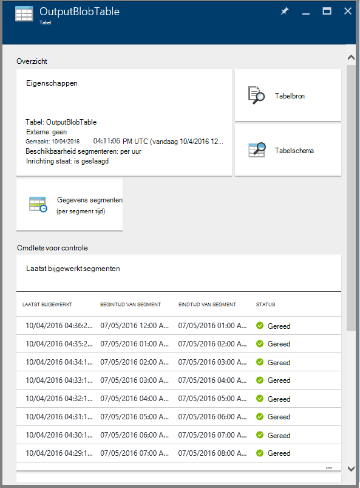

<properties 
    pageTitle="Bewaken en Azure gegevens Factory pijpleidingen beheren" 
    description="Leer hoe u Azure-Portal en Azure PowerShell gebruiken om te controleren en beheren van Azure gegevens factory's en pijpleidingen die u hebt gemaakt." 
    services="data-factory" 
    documentationCenter="" 
    authors="spelluru" 
    manager="jhubbard" 
    editor="monicar"/>

<tags 
    ms.service="data-factory" 
    ms.workload="data-services" 
    ms.tgt_pltfrm="na" 
    ms.devlang="na" 
    ms.topic="article" 
    ms.date="09/06/2016" 
    ms.author="spelluru"/>

# Bewaken en Azure gegevens Factory pijpleidingen beheren
> [AZURE.SELECTOR]
- [Azure-portal/Azure PowerShell gebruiken](data-factory-monitor-manage-pipelines.md)
- [Gebruik van de cmdlets voor controle en beheer-App](data-factory-monitor-manage-app.md)

De gegevens Factory-service biedt betrouwbare en volledige weergave van uw services van de verplaatsingsopties opslag, verwerking en gegevens. De service biedt u een controle dashboard helpt waarmee u kunt de volgende taken uitvoeren: 

- Snel Beoordeel end-to-end gegevens verkooppijplijn status.
- Problemen opsporen en corrigerende maatregelen nemen indien nodig. 
- Bijhouden gegevens over de afkomst. 
- Relaties tussen uw gegevens over een van uw bronnen te houden.
- Weergave volledige historische accounting van uitvoering, systeemstatus en afhankelijkheden.

In dit artikel wordt beschreven hoe bewaken, beheren en fouten opsporen in uw pijpleidingen. Ook vindt u informatie over het maken van waarschuwingen en een melding ontvangen op fouten.

## Meer informatie over pijpleidingen en activiteit Staten
De portal van Azure gebruikt, kunt u het volgende doen:

- Uw gegevens factory weergegeven als een diagram
- Activiteiten weergeven in een pijplijn
- Invoer- en uitvoerbereik gegevenssets weergeven
- en meer. 

Deze sectie bevat ook hoe een segment overgangen van de ene staat naar een andere staat.   

### Ga naar uw gegevens factory
1.  Meld u aan bij de [portal van Azure](https://portal.azure.com).
2.  Klik op **gegevens factory's** in het menu aan de linkerkant. Als u deze niet ziet, klikt u op **meer services >** en klik op **gegevens factory's** onder **INTELLIGENCE + ANALYTICS** -categorie. 

    

    Hier ziet u alle gegevens factory's in het blad **gegevens factory's** . 
4. Selecteer in het blad gegevens factory's, de gegevens fabriek waarin u geïnteresseerd bent.

      
5.  en ziet u de introductiepagina (**Data factory** blade) voor de fabriek gegevens.

    

#### Diagramweergave van uw gegevens factory
De diagramweergave van een fabriek gegevens biedt een door één venster bewaken en de gegevens fabriek en de activa beheren.

Als u wilt zien van de diagramweergave van uw gegevens factory, klikt u op **Diagram** op de startpagina van de gegevens factory.

U kunt inzoomen, uitzoomen, in-en uitzoomen om passend maken, uitzoomen tot 100%, de indeling van het diagram vergrendelen en automatisch plaats pijpleidingen en tabellen. U ziet ook de gegevens over de afkomst (boven en lager items van de geselecteerde items weergeven).
 

### Activiteiten in een pijplijn 
1. Met de rechtermuisknop op de verkooppijplijn en klik op **openen verkooppijplijn** als u wilt zien van alle activiteiten in de pijplijn samen met invoer- en uitvoerbereik gegevenssets voor de activiteiten. Deze functie is handig wanneer uw verkooppijplijn van meer dan één activiteit omvat en u wilt weten over de operationele over de afkomst van een enkel pijplijn.

      
2. In het volgende voorbeeld ziet u twee activiteiten in de pijplijn met hun ingangen en uitvoer. De activiteit getiteld **JoinData** van het type HDInsight component activiteit en **EgressDataAzure** van het type kopie activiteit zijn opgeslagen in dit voorbeeld pijplijn. 
    
     
3. U kunt navigeren terug naar de startpagina van de gegevens Factory door te klikken op gegevens factory-koppeling in de ' breadcrumb ' in de hoek linksboven.

    

### Weergavestatus van elke activiteit in een pijplijn
U kunt de huidige status van een activiteit weergeven door de status van een van de gegevenssets geproduceerd door de activiteit weer te geven. 

Bijvoorbeeld: in het volgende voorbeeld wordt de **BlobPartitionHiveActivity** met succes en een gegevensset met de naam **PartitionedProductsUsageTable**, dat wil in **Gereed zeggen** geproduceerd.

Alle segmenten geproduceerd door verschillende activiteit wordt uitgevoerd in een pijplijn te dubbelklikken op de **PartitionedProductsUsageTable** in de diagramweergave worden gepresenteerd. U kunt zien dat de **BlobPartitionHiveActivity** is uitgevoerd elke maand voor de laatste acht maanden en de segmenten in **Gereed** geproduceerd.

De gegevensset segmenten in gegevens fabriek kunnen een van de volgende statussen hebben:

<table>
<tr>
    <th align="left">De staat</th><th align="left">Subtoestand</th><th align="left">Beschrijving</th>
</tr>
<tr>
    <td rowspan="8">In afwachting van</td><td>ScheduleTime</td><td>De tijd is niet komen voor het segment om uit te voeren.</td>
</tr>
<tr>
<td>DatasetDependencies</td><td>De boven afhankelijkheden bent niet klaar.</td>
</tr>
<tr>
<td>ComputeResources</td><td>De bronnen berekeningscluster zijn niet beschikbaar.</td>
</tr>
<tr>
<td>ConcurrencyLimit</td> <td>Alle exemplaren van de activiteit zijn bezig met het uitvoeren van andere segmenten.</td>
</tr>
<tr>
<td>ActivityResume</td><td>Activiteit is onderbroken en segmenten kan niet worden uitgevoerd totdat deze wordt hervat.</td>
</tr>
<tr>
<td>Probeer het opnieuw</td><td>Uitvoering van de activiteit opnieuw wordt gestart.</td>
</tr>
<tr>
<td>Gegevensvalidatie</td><td>Validatie nog niet is gestart.</td>
</tr>
<tr>
<td>ValidationRetry</td><td>Wachten op de validatie naar een nieuwe poging gedaan.</td>
</tr>
<tr>
<tr
<td rowspan="2">InProgress</td><td>Valideren</td><td>Validatie in voortgang.</td>
</tr>
<td></td>
<td>Het segment wordt verwerkt.</td>
</tr>
<tr>
<td rowspan="4">Is mislukt</td><td>Time-out</td><td>Uitvoering duurt langer dan die is toegestaan door de activiteit.</td>
</tr>
<tr>
<td>Geannuleerd</td><td>Geannuleerd door een gebruiker.</td>
</tr>
<tr>
<td>Gegevensvalidatie</td><td>Validatie is mislukt.</td>
</tr>
<tr>
<td></td><td>Genereren en/of het segment valideren is mislukt.</td>
</tr>
<td>Gereed</td><td></td><td>Het segment is gereed voor gebruik.</td>
</tr>
<tr>
<td>Overgeslagen</td><td></td><td>Het segment wordt niet verwerkt.</td>
</tr>
<tr>
<td>Geen</td><td></td><td>Een segment dat u gebruikt met een andere status voorkomt, maar is ingesteld.</td>
</tr>
</table>

U kunt de details van een segment weergeven door te klikken op een segment vermelding in het blad **Segmenten onlangs bijgewerkt** .

 
Als het segment meerdere keren is uitgevoerd, ziet u meerdere rijen in de lijst **activiteit wordt uitgevoerd** . U kunt meer informatie over een activiteit uitvoeren door te klikken op de uitvoeren vermelding in de lijst **dat activiteit wordt uitgevoerd** weergeven. De lijst bevat alle logboekbestanden samen met een foutbericht wordt weergegeven als minimaal een. Deze functie is handig om te bekijken en fouten opsporen in Logboeken zonder dat u moet uw gegevens fabriek verlaten.

Als het segment niet in de status **gereed is** , ziet u het boven segmenten die nog niet gereed en worden geblokkeerd door de huidige segment wordt uitgevoerd in de lijst **boven segmenten die niet gereed zijn** . Deze functie is handig wanneer uw segment **wachten** staat en u wilt weten over het boven afhankelijkheden waarop het segment wacht.

### Gegevensset toestandsdiagram
Nadat u een factory gegevens implementeren en de pijpleidingen beschikt over een geldig actieve periode, segmenten de gegevensset overgang naar de andere van de ene staat. Momenteel de status segment, voert u het volgende diagram voor de staat:

De stroom gegevensset staat overgang in gegevens fabriek: wachten -> In-voortgang/In uitvoering (Validating) -> gereed/mislukt

Segmenten beginnen in een **wachten** staat voor oude voorwaarden moet worden voldaan voordat wordt uitgevoerd. Vervolgens de activiteit wordt uitgevoerd en het segment vindt u in staat **In uitvoering** . De uitvoering van de activiteit mogelijk slagen of mislukken. Het segment is gemarkeerd als **Gereed**' of **mislukt** op basis van het resultaat van de uitvoering. 

U kunt het segment om terug te gaan van **klaar** of **mislukt** staat om te **wachten** staat herstellen. U kunt ook markeert u het segment staat **overslaan**, waardoor de activiteit wordt uitgevoerd en niet verwerkt door het segment.

## Pijpleidingen beheren
U kunt uw pijpleidingen via Azure PowerShell beheren. U kunt bijvoorbeeld onderbreken en hervatten van pijpleidingen door Azure PowerShell-cmdlets uit te voeren. 

### Onderbreken en hervatten pijpleidingen
U kunt een pauze invoegen/uitstellen pijpleidingen de **Onderbreking AzureRmDataFactoryPipeline** Powershell-cmdlet gebruiken. Deze cmdlet is handig als u niet uitvoeren van uw pijpleidingen wilt totdat een probleem is opgelost.

Bijvoorbeeld: in de volgende schermopname, een probleem met de **PartitionProductsUsagePipeline** in **productrecgamalbox1dev** gegevens fabriek is geïdentificeerd en we wilt onderbreken van de pijplijn.

Als u wilt een pijplijn onderbreken, voer de volgende PowerShell-opdracht:

    Suspend-AzureRmDataFactoryPipeline [-ResourceGroupName] <String> [-DataFactoryName] <String> [-Name] <String>

Bijvoorbeeld:

    Suspend-AzureRmDataFactoryPipeline -ResourceGroupName ADF -DataFactoryName productrecgamalbox1dev -Name PartitionProductsUsagePipeline 

Als het probleem is opgelost met de **PartitionProductsUsagePipeline**, kunt u de geschorst pijplijn hervatten door de volgende PowerShell-opdracht uit te voeren:

    Resume-AzureRmDataFactoryPipeline [-ResourceGroupName] <String> [-DataFactoryName] <String> [-Name] <String>

Bijvoorbeeld:

    Resume-AzureRmDataFactoryPipeline -ResourceGroupName ADF -DataFactoryName productrecgamalbox1dev -Name PartitionProductsUsagePipeline 

## Fouten opsporen in pijpleidingen
Azure gegevens Factory biedt uitgebreide mogelijkheden via Azure-portal en Azure PowerShell fouten opsporen en oplossen pijpleidingen.

### Fouten zoeken in een pijplijn
Als het uitvoeren van de activiteit in een pijplijn mislukt, wordt de gegevensset geproduceerd door de pijplijn in foutstatus door een fout is. U kunt opsporen en oplossen van fouten in Azure gegevens Factory met de volgende regelingen.

#### Azure-portal gebruiken voor een fout foutopsporing:

3.  Klik op het segment probleem met de **STATUS** is ingesteld op **mislukt**in het blad **tabel** .

    
4.  Klik in het blad **Segment van de gegevens** op de activiteit uitvoeren die is mislukt.
    
    
5.  Klik in het blad **Activiteit uitvoeren DETAILS** , kunt u de bestanden die zijn gekoppeld aan de verwerking HDInsight downloaden. Klik op downloaden voor Status/stderr downloaden van het foutenlogboekbestand die details over de fout bevat.

      

#### De PowerShell gebruiken voor foutopsporing een fout
1.  **Azure PowerShell**starten.
3.  De opdracht **Get-AzureRmDataFactorySlice** om te zien van de segmenten en hun status uitvoeren. Ziet u een segment met de status: **mislukt**.       

            Get-AzureRmDataFactorySlice [-ResourceGroupName] <String> [-DataFactoryName] <String> [-TableName] <String> [-StartDateTime] <DateTime> [[-EndDateTime] <DateTime> ] [-Profile <AzureProfile> ] [ <CommonParameters>]
    
    Bijvoorbeeld:
        
            Get-AzureRmDataFactorySlice -ResourceGroupName ADF -DataFactoryName LogProcessingFactory -TableName EnrichedGameEventsTable -StartDateTime 2014-05-04 20:00:00

    **StartDateTime** vervangen door de StartDateTime-waarde die u hebt opgegeven voor de Set-AzureRmDataFactoryPipelineActivePeriod.
4. Nu, voert u de cmdlet **Get-AzureRmDataFactoryRun** voor meer informatie over de activiteit uitvoeren voor het segment.

        Get-AzureRmDataFactoryRun [-ResourceGroupName] <String> [-DataFactoryName] <String> [-TableName] <String> [-StartDateTime] 
        <DateTime> [-Profile <AzureProfile> ] [ <CommonParameters>]
    
    Bijvoorbeeld:

        Get-AzureRmDataFactoryRun -ResourceGroupName ADF -DataFactoryName LogProcessingFactory -TableName EnrichedGameEventsTable -StartDateTime "5/5/2014 12:00:00 AM"

    De waarde van StartDateTime is de starttijd van de fout/probleem segment dat u uit de vorige stap hebt genoteerd. De datum-tijd moet worden tussen dubbele aanhalingstekens is geplaatst.
5.  Hier ziet u de uitvoer met details over de fout (de volgende strekking):

            Id                      : 841b77c9-d56c-48d1-99a3-8c16c3e77d39
            ResourceGroupName       : ADF
            DataFactoryName         : LogProcessingFactory3
            TableName               : EnrichedGameEventsTable
            ProcessingStartTime     : 10/10/2014 3:04:52 AM
            ProcessingEndTime       : 10/10/2014 3:06:49 AM
            PercentComplete         : 0
            DataSliceStart          : 5/5/2014 12:00:00 AM
            DataSliceEnd            : 5/6/2014 12:00:00 AM
            Status                  : FailedExecution
            Timestamp               : 10/10/2014 3:04:52 AM
            RetryAttempt            : 0
            Properties              : {}
            ErrorMessage            : Pig script failed with exit code '5'. See wasb://     adfjobs@spestore.blob.core.windows.net/PigQuery
                                            Jobs/841b77c9-d56c-48d1-99a3-
                        8c16c3e77d39/10_10_2014_03_04_53_277/Status/stderr' for
                        more details.
            ActivityName            : PigEnrichLogs
            PipelineName            : EnrichGameLogsPipeline
            Type                    :
    
    
6.  U kunt **Opslaan-AzureRmDataFactoryLog** cmdlet uitvoeren met id-waarde u in de uitvoer zien en de logboekbestanden met behulp van de **-DownloadLogsoption** voor de cmdlet downloaden.

            Save-AzureRmDataFactoryLog -ResourceGroupName "ADF" -DataFactoryName "LogProcessingFactory" -Id "841b77c9-d56c-48d1-99a3-8c16c3e77d39" -DownloadLogs -Output "C:\Test"

## Fouten opnieuw uitvoeren in een pijplijn

### Met behulp van Azure portal

Als u problemen en fouten in een pijplijn voor foutopsporing, kunt u fouten opnieuw uitvoeren door te navigeren naar het segment fout en te klikken op de knop **uitvoeren** op de opdrachtbalk.

Geval het segment heeft kan niet worden gevalideerd vanwege een fout beleid (voor ex: gegevens niet beschikbaar), kunt u de fout oplossen en opnieuw valideren door te klikken op de knop **valideren** op de opdrachtbalk.

### Via Azure PowerShell

U kunt fouten opnieuw uitvoeren met behulp van de cmdlet Set-AzureRmDataFactorySliceStatus. Zie [Set-AzureRmDataFactorySliceStatus](https://msdn.microsoft.com/library/mt603522.aspx) -onderwerp voor de syntaxis van de en andere details over de cmdlet. 

**Voorbeeld:** Het volgende voorbeeld wordt de status van alle segmenten van de tabel 'DAWikiAggregatedData' om te wachten in de fabriek Azure-gegevens 'WikiADF'.

De UpdateType is ingesteld op UpstreamInPipeline, wat betekent dat statussen van elk segment voor de tabel en de afhankelijke (boven) tabellen zijn ingesteld op "Wachten." Andere mogelijke waarde voor deze parameter is "Iemand."

    Set-AzureRmDataFactorySliceStatus -ResourceGroupName ADF -DataFactoryName WikiADF -TableName DAWikiAggregatedData -Status Waiting -UpdateType UpstreamInPipeline -StartDateTime 2014-05-21T16:00:00 -EndDateTime 2014-05-21T20:00:00

## Waarschuwingen maken
Azure logboeken gebruikersgebeurtenissen wanneer een Azure resource (bijvoorbeeld een data factory genoemd) wordt gemaakt, bijgewerkt of verwijderd. U kunt de waarschuwingen op deze gebeurtenissen maken. Gegevens Factory kunt u diverse cijfers vastleggen en waarschuwingen maken van een maatstelsel. Het is raadzaam om gebeurtenissen te gebruiken voor realtime cmdlets voor controle en aan de doelstellingen voor historische doeleinden. 

### Waarschuwingen over alle gebeurtenissen
Azure gebeurtenissen bieden handige inzichten in wat gebeurt er in uw Azure resources. Azure logboeken gebruikersgebeurtenissen wanneer een Azure resource (bijvoorbeeld een data factory genoemd) wordt gemaakt, bijgewerkt of verwijderd. Wanneer u met de fabriek Azure-gegevens, gebeurtenissen worden gegenereerd wanneer:

- Azure gegevens Factory is gemaakt/bijgewerkt/verwijderd.
- Gegevensverwerking (genoemd als wordt uitgevoerd) is gestart/voltooid.
- Een cluster van de HDInsight op aanvraag is gemaakt en verwijderd.

U kunt waarschuwingen van deze gebruikersgebeurtenissen maken en configureren meldingen per e-mail verzenden naar de beheerder en CO-beheerders van het abonnement. Bovendien kunt u extra e-mailadressen van gebruikers van wie meldingen per e-mail ontvangen moeten wanneer de voorwaarden is voldaan. Deze functie is handig als u wilt een melding ontvangen op fouten en niet wilt continu bewaak uw factory gegevens.

> [AZURE.NOTE] De portal wordt momenteel niet weergegeven voor waarschuwingen over alle gebeurtenissen. Gebruik de [controle- en de App Management](data-factory-monitor-manage-app.md) om alle meldingen weer te geven.

#### De definitie van een waarschuwing te geven:
Als u wilt de definitie van een waarschuwing opgeven, moet u een JSON-bestand met een beschrijving van de bewerkingen die u worden gewaarschuwd wilt op maken. In het volgende voorbeeld wordt verzenden de waarschuwing per e-mail een melding voor de bewerking RunFinished Als u specifieke, een e-mailbericht wordt verzonden wanneer een uitvoeren in de fabriek gegevens is voltooid en de uitvoering is mislukt (Status = FailedExecution).

    {
        "contentVersion": "1.0.0.0",
         "$schema": "http://schema.management.azure.com/schemas/2014-04-01-preview/deploymentTemplate.json#",
        "parameters": {},
        "resources": 
        [
            {
                "name": "ADFAlertsSlice",
                "type": "microsoft.insights/alertrules",
                "apiVersion": "2014-04-01",
                "location": "East US",
                "properties": 
                {
                    "name": "ADFAlertsSlice",
                    "description": "One or more of the data slices for the Azure Data Factory has failed processing.",
                    "isEnabled": true,
                    "condition": 
                    {
                        "odata.type": "Microsoft.Azure.Management.Insights.Models.ManagementEventRuleCondition",
                        "dataSource": 
                        {
                            "odata.type": "Microsoft.Azure.Management.Insights.Models.RuleManagementEventDataSource",
                            "operationName": "RunFinished",
                            "status": "Failed",
                            "subStatus": "FailedExecution"   
                        }
                    },
                    "action": 
                    {
                        "odata.type": "Microsoft.Azure.Management.Insights.Models.RuleEmailAction",
                        "customEmails": [ "<your alias>@contoso.com" ]
                    }
                }
            }
        ]
    }

Uit de definitie JSON kan **subStatus** worden verwijderd als u niet wilt worden gewaarschuwd bij een specifieke fout.

In dit voorbeeld is ingesteld van de melding voor alle gegevens factory's in uw abonnement. Als u wilt dat de melding naar voor een bepaalde gegevens factory ingesteld, kunt u gegevens factory **resourceUri** opgeven in de **gegevensbron**:

    "resourceUri" : "/SUBSCRIPTIONS/<subscriptionId>/RESOURCEGROUPS/<resourceGroupName>/PROVIDERS/MICROSOFT.DATAFACTORY/DATAFACTORIES/<dataFactoryName>"

De volgende tabel vindt de lijst met beschikbare bewerkingen en statussen (en submappen statussen).

De bewerkingsnaam van de | Status | Substatus
-------------- | ------ | ----------
RunStarted | De slag | Starten
RunFinished | Is mislukt / is geslaagd | FailedResourceAllocation  Is geslaagd  FailedExecution  Time-out  < geannuleerd  FailedValidation  Afgebroken
OnDemandClusterCreateStarted | De slag
OnDemandClusterCreateSuccessful | Is geslaagd
OnDemandClusterDeleted | Is geslaagd

Zie [Meldingen regel maken](https://msdn.microsoft.com/library/azure/dn510366.aspx) voor meer informatie over de JSON-elementen gebruikt in het voorbeeld. 

#### De melding implementeren 
Als u wilt implementeren de melding, gebruikt u de Azure PowerShell-cmdlet: **Nieuw-AzureRmResourceGroupDeployment**, zoals wordt weergegeven in het volgende voorbeeld:

    New-AzureRmResourceGroupDeployment -ResourceGroupName adf -TemplateFile .\ADFAlertFailedSlice.json  

Zodra de implementatie van de groep resource is voltooid, kunt u de volgende berichten zien:

    VERBOSE: 7:00:48 PM - Template is valid.
    WARNING: 7:00:48 PM - The StorageAccountName parameter is no longer used and will be removed in a future release.
    Please update scripts to remove this parameter.
    VERBOSE: 7:00:49 PM - Create template deployment 'ADFAlertFailedSlice'.
    VERBOSE: 7:00:57 PM - Resource microsoft.insights/alertrules 'ADFAlertsSlice' provisioning status is succeeded
    
    DeploymentName    : ADFAlertFailedSlice
    ResourceGroupName : adf
    ProvisioningState : Succeeded
    Timestamp         : 10/11/2014 2:01:00 AM
    Mode              : Incremental
    TemplateLink      :
    Parameters        :
    Outputs           :

> [AZURE.NOTE] U kunt de [Melding voor een regel maken](https://msdn.microsoft.com/library/azure/dn510366.aspx) REST API gebruiken om een waarschuwing regel te maken. De JSON-nettolading is vergelijkbaar met het voorbeeld JSON.  

#### De lijst met Azure Resource groep implementaties opgehaald
Als u wilt ophalen van de lijst met geïmplementeerd resourcegroep Azure-implementaties, gebruikt u de cmdlet: **Get-AzureRmResourceGroupDeployment**, zoals wordt weergegeven in het volgende voorbeeld:

    Get-AzureRmResourceGroupDeployment -ResourceGroupName adf
    
    DeploymentName    : ADFAlertFailedSlice
    ResourceGroupName : adf
    ProvisioningState : Succeeded
    Timestamp         : 10/11/2014 2:01:00 AM
    Mode              : Incremental
    TemplateLink      :
    Parameters        :
    Outputs           :

#### Probleemoplossing gebruikersgebeurtenissen

1. Hier ziet u alle gebeurtenissen die zijn gegenereerd na het klikken op de tegel **maatstaven en bewerkingen** .

    

2. Klik op de tegel **gebeurtenissen** als u wilt zien van de gebeurtenissen. 

    
3. In het blad **gebeurtenissen** , kunt u meer informatie over de gebeurtenissen, gebeurtenissen enzovoort filteren. 

    
4. Klik op een **bewerking** in de lijst met bewerkingen die een fout treedt.
    
     
5. Klik op een gebeurtenis **fout** voor meer informatie over de fout.

    
  

Zie [Azure inzicht Cmdlets](https://msdn.microsoft.com/library/mt282452.aspx) artikel voor PowerShell-cmdlets die u meldingen toevoegen/get/verwijderen kunt. Hier volgen enkele voorbeelden van het gebruik van de cmdlet **Get-AlertRule** : 

    PS C:\> get-alertrule -res $resourceGroup -n ADFAlertsSlice -det
        
            Properties :
            Action      : Microsoft.Azure.Management.Insights.Models.RuleEmailAction
            Condition   :
            DataSource :
            EventName             :
            Category              :
            Level                 :
            OperationName         : RunFinished
            ResourceGroupName     :
            ResourceProviderName  :
            ResourceId            :
            Status                : Failed
            SubStatus             : FailedExecution
            Claims                : Microsoft.Azure.Management.Insights.Models.RuleManagementEventClaimsDataSource
            Condition   :
            Description : One or more of the data slices for the Azure Data Factory has failed processing.
            Status      : Enabled
            Name:       : ADFAlertsSlice
            Tags       :
            $type          : Microsoft.WindowsAzure.Management.Common.Storage.CasePreservedDictionary, Microsoft.WindowsAzure.Management.Common.Storage
            Id: /subscriptions/<subscription ID>/resourceGroups/<resource group name>/providers/microsoft.insights/alertrules/ADFAlertsSlice
            Location   : West US
            Name       : ADFAlertsSlice
    
    PS C:\> Get-AlertRule -res $resourceGroup

            Properties : Microsoft.Azure.Management.Insights.Models.Rule
            Tags       : {[$type, Microsoft.WindowsAzure.Management.Common.Storage.CasePreservedDictionary, Microsoft.WindowsAzure.Management.Common.Storage]}
            Id         : /subscriptions/<subscription id>/resourceGroups/<resource group name>/providers/microsoft.insights/alertrules/FailedExecutionRunsWest0
            Location   : West US
            Name       : FailedExecutionRunsWest0
    
            Properties : Microsoft.Azure.Management.Insights.Models.Rule
            Tags       : {[$type, Microsoft.WindowsAzure.Management.Common.Storage.CasePreservedDictionary, Microsoft.WindowsAzure.Management.Common.Storage]}
            Id         : /subscriptions/<subscription id>/resourceGroups/<resource group name>/providers/microsoft.insights/alertrules/FailedExecutionRunsWest3
            Location   : West US
            Name       : FailedExecutionRunsWest3

    PS C:\> Get-AlertRule -res $resourceGroup -Name FailedExecutionRunsWest0
    
            Properties : Microsoft.Azure.Management.Insights.Models.Rule
            Tags       : {[$type, Microsoft.WindowsAzure.Management.Common.Storage.CasePreservedDictionary, Microsoft.WindowsAzure.Management.Common.Storage]}
            Id         : /subscriptions/<subscription id>/resourceGroups/<resource group name>/providers/microsoft.insights/alertrules/FailedExecutionRunsWest0
            Location   : West US
            Name       : FailedExecutionRunsWest0

Voer de volgende get-help-opdrachten om informatie en voorbeelden voor de cmdlet Get-AlertRule weer te geven. 

    get-help Get-AlertRule -detailed 
    get-help Get-AlertRule -examples

- Als u de gebeurtenissen genereren van waarschuwingen op het blad portal ziet, maar u geen e-mailmeldingen ontvangt, controleert u of e-mailadres dat is opgegeven voor het ontvangen van e-mailberichten van externe afzenders is ingesteld. De waarschuwingsberichten is mogelijk geblokkeerd door uw e-mailinstellingen.

### Meldingen van een maatstelsel
Gegevens Factory kunt u diverse cijfers vastleggen en waarschuwingen maken van een maatstelsel. U kunt controleren en waarschuwingen maken van de volgende gegevens voor de segmenten in uw fabriek gegevens.
 
- Mislukte wordt uitgevoerd
- Succesvolle wordt uitgevoerd

Deze gegevens zijn handig en bieden u een overzicht van algemene mislukte en succesvolle wordt uitgevoerd in hun gegevens fabriek. Aan de doelstellingen worden verstrekt telkens wanneer er een segment uitvoeren is. Boven aan het uur, worden deze gegevens samengevoegd en gedrukt bij uw account opslag. Daarom om in te schakelen aan de doelstellingen, een opslagruimte account instellen.

#### Aan de doelstellingen inschakelen:
Als u wilt inschakelen aan de doelstellingen, klikt u op de volgende handelingen uit Data Factory blade:

**Cmdlets voor controle** -> **Metrisch** -> **Diagnostische instellingen** -> **Diagnostische gegevens**

Klik op het blad **Diagnostische** , klikt u **op** en selecteer het account opslag en opslaan.

Zodra u hebt opgeslagen, wordt het duurt maximaal één uur voor de maatstelsel worden zichtbaar is op het blad controleren, omdat de doelstellingen aggregatie per uur gebeurt.

### Bij het instellen van een waarschuwing voor de doelstellingen:

Klik op **gegevens Factory aan de doelstellingen** blade: 

Klik op het blad **Metrisch** op **+ melding toevoegen** op de werkbalk. 

Voer de volgende stappen uit op de pagina **een waarschuwing regel toevoegen** en klik op **OK**.
 
- Voer een naam voor de melding (voorbeeld: is mislukt waarschuwing).
- Voer een beschrijving voor de melding (voorbeeld: een e-mailbericht verzenden wanneer er een fout optreedt).
- Selecteer een meting (mislukte uitgevoerd versus succesvolle wordt uitgevoerd).
- Geef een voorwaarde en een drempelwaarde.   
- Geef de periode. 
- Opgeven of een e-mailbericht naar eigenaren, inzenders en lezers moet worden verzonden.
- en meer. 

Wanneer de waarschuwing regel is toegevoegd, sluit u het blad en u de nieuwe waarschuwing ziet op de pagina **Metrisch** . 

U ziet ook het aantal waarschuwingen op de tegel van **waarschuwingen** . Klik op de tegel **waarschuwingen** .

In het blad **waarschuwingen** ziet u alle bestaande signalen. Als u wilt een waarschuwing toevoegen, klikt u op de **melding toevoegen** op de werkbalk.

### Waarschuwingen:
Zodra de waarschuwing regel overeenkomt met de voorwaarde voldoet, ontvangt u een waarschuwing geactiveerde e-mailbericht. Zodra het probleem opgelost is en de waarschuwing voorwaarde niet overeenkomen met meer, kunt u een waarschuwing opgelost e-mail ophalen.

Dit is anders dan gebeurtenissen waarbij een melding bij elke fout wordt verzonden voor welke Waarschuwing regel in aanmerking komt.

### Waarschuwingen via PowerShell implementeren
Als u voor gebeurtenissen, kunt u de waarschuwingen voor de doelstellingen implementeren op dezelfde manier. 

**De definitie van de waarschuwing:**

    {
        "contentVersion" : "1.0.0.0",
        "$schema" : "http://schema.management.azure.com/schemas/2014-04-01-preview/deploymentTemplate.json#",
        "parameters" : {},
        "resources" : [
        {
                "name" : "FailedRunsGreaterThan5",
                "type" : "microsoft.insights/alertrules",
                "apiVersion" : "2014-04-01",
                "location" : "East US",
                "properties" : {
                    "name" : "FailedRunsGreaterThan5",
                    "description" : "Failed Runs greater than 5",
                    "isEnabled" : true,
                    "condition" : {
                        "$type" : "Microsoft.WindowsAzure.Management.Monitoring.Alerts.Models.ThresholdRuleCondition, Microsoft.WindowsAzure.Management.Mon.Client",
                        "odata.type" : "Microsoft.Azure.Management.Insights.Models.ThresholdRuleCondition",
                        "dataSource" : {
                            "$type" : "Microsoft.WindowsAzure.Management.Monitoring.Alerts.Models.RuleMetricDataSource, Microsoft.WindowsAzure.Management.Mon.Client",
                            "odata.type" : "Microsoft.Azure.Management.Insights.Models.RuleMetricDataSource",
                            "resourceUri" : "/SUBSCRIPTIONS/<subscriptionId>/RESOURCEGROUPS/<resourceGroupName
    >/PROVIDERS/MICROSOFT.DATAFACTORY/DATAFACTORIES/<dataFactoryName>",
                            "metricName" : "FailedRuns"
                        },
                        "threshold" : 5.0,
                        "windowSize" : "PT3H",
                        "timeAggregation" : "Total"
                    },
                    "action" : {
                        "$type" : "Microsoft.WindowsAzure.Management.Monitoring.Alerts.Models.RuleEmailAction, Microsoft.WindowsAzure.Management.Mon.Client",
                        "odata.type" : "Microsoft.Azure.Management.Insights.Models.RuleEmailAction",
                        "customEmails" : ["abhinav.gpt@live.com"]
                    }
                }
            }
        ]
    }
 
Vervang subscriptionId, resourceGroupName en dataFactoryName in de steekproef met de juiste waarden.

*metricName* vanaf nu worden ondersteund in twee waarden:
- FailedRuns
- SuccessfulRuns

**De melding implementeert:**

Als u wilt implementeren de melding, gebruikt u de Azure PowerShell-cmdlet: **Nieuw-AzureRmResourceGroupDeployment**, zoals wordt weergegeven in het volgende voorbeeld:

    New-AzureRmResourceGroupDeployment -ResourceGroupName adf -TemplateFile .\FailedRunsGreaterThan5.json

U ziet bericht volgen na een geslaagde implementatie:

    VERBOSE: 12:52:47 PM - Template is valid.
    VERBOSE: 12:52:48 PM - Create template deployment 'FailedRunsGreaterThan5'.
    VERBOSE: 12:52:55 PM - Resource microsoft.insights/alertrules 'FailedRunsGreaterThan5' provisioning status is succeeded
    
    
    DeploymentName    : FailedRunsGreaterThan5
    ResourceGroupName : adf
    ProvisioningState : Succeeded
    Timestamp         : 7/27/2015 7:52:56 PM
    Mode              : Incremental
    TemplateLink      :
    Parameters        :
    Outputs           

U kunt ook de cmdlet **Toevoegen-AlertRule** gebruiken om te implementeren van een regel voor waarschuwingen. Zie [Toevoegen-AlertRule](https://msdn.microsoft.com/library/mt282468.aspx) onderwerp voor meer informatie en voorbeelden.  

## Gegevens factory verplaatsen naar een abonnement of andere resourcegroep
U kunt een factory gegevens verplaatsen naar een andere resource-groep of een ander abonnement via de opdrachtbalkknop **verplaatsen** op de startpagina van uw gegevens factory. 

U kunt ook een verwante resources (zoals waarschuwingen die is gekoppeld aan de data factory genoemd) samen met de gegevens fabriek verplaatsen.

