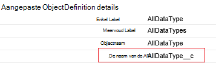
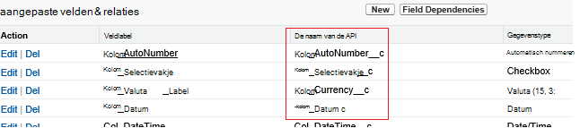

<properties
    pageTitle="Verplaats gegevens van Salesforce met behulp van gegevens Factory | Microsoft Azure"
    description="Meer informatie over het verplaatsen van gegevens van Salesforce met behulp van Azure gegevens Factory."
    services="data-factory"
    documentationCenter=""
    authors="linda33wj"
    manager="jhubbard"
    editor="monicar"/>

<tags
    ms.service="data-factory"
    ms.workload="data-services"
    ms.tgt_pltfrm="na"
    ms.devlang="na"
    ms.topic="article"
    ms.date="10/25/2016"
    ms.author="jingwang"/>

# Verplaats gegevens van Salesforce met behulp van Azure gegevens Factory
In dit artikel wordt beschreven hoe u kunt kopiëren activiteit in een fabriek Azure gegevens gegevens kopiëren van Salesforce naar eventuele gegevensopslag die wordt weergegeven onder de kolom Sink in de tabel [ondersteunde gegevensbronnen en sinks](data-factory-data-movement-activities.md#supported-data-stores) . In dit artikel is gebaseerd op het artikel [gegevens verkeer activiteiten](data-factory-data-movement-activities.md) , waarbij een een algemeen overzicht van de verplaatsing van gegevens met kopie activiteit en ondersteunde store combinaties wordt weergegeven.

Azure gegevens Factory ondersteunt momenteel alleen zwevend gegevens uit Salesforce [ondersteunde sink gegevens stores]((data-factory-data-movement-activities.md#supported-data-stores), maar geen ondersteuning voor het verplaatsen van gegevens uit andere winkels aan Salesforce doet.

## Vereisten voor
- U moet een van de volgende edities van Salesforce gebruiken: Developer Edition, Professional Edition, Enterprise Edition of onbeperkt Edition.
- API gemachtigd moet zijn ingeschakeld. Zie [hoe schakel ik de toegang van de API in Salesforce door machtigingenset?](https://www.data2crm.com/migration/faqs/enable-api-access-salesforce-permission-set/)
- Als gegevens wilt kopiëren uit Salesforce naar on-premises implementatie gegevens winkels, u moet ten minste beschikken Data Management Gateway 2.0 geïnstalleerd in uw on-premises omgeving.

## Limieten voor Salesforce-aanvraag
SalesForce heeft de limieten voor zowel totaal aantal API aanvragen en gelijktijdige API aanvragen. Zie het gedeelte 'API aanvragen limieten' in het artikel [Salesforce ontwikkelaars limieten](http://resources.docs.salesforce.com/200/20/en-us/sfdc/pdf/salesforce_app_limits_cheatsheet.pdf) voor meer informatie. Opmerking Als het aantal gelijktijdige aanvragen de limiet overschrijdt, beperken plaatsvindt en worden er willekeurig mislukken; Als het totale aantal aanvragen de limiet overschrijdt, worden het Salesforce-account voor 24 uur, geblokkeerd Mogelijk ontvangt u ook de fout 'REQUEST_LIMIT_EXCEEDED' in beide gevallen.

## Wizard gegevens kopiëren
De eenvoudigste manier om te maken van een pijplijn die gegevens van Salesforce naar een van de ondersteunde sink gegevensarchieven kopiëren is de wizard gegevens kopiëren gebruiken. Zie [Zelfstudie: een pijplijn met de Wizard kopie maken](data-factory-copy-data-wizard-tutorial.md) voor snelle stapsgewijze instructies over het maken van een pijplijn met behulp van de wizard gegevens kopiëren.

Het volgende voorbeeld bevat de definities van een steekproef JSON waarmee u kunt een pijplijn maken met behulp van de [Azure-portal](data-factory-copy-activity-tutorial-using-azure-portal.md), [Visual Studio](data-factory-copy-activity-tutorial-using-visual-studio.md)of [Azure PowerShell](data-factory-copy-activity-tutorial-using-powershell.md). Het kopiëren van gegevens uit Salesforce naar Azure-blobopslag worden ze weergegeven. Gegevens kunnen echter worden gekopieerd naar een van de sinks vermelde [hier](data-factory-data-movement-activities.md#supported-data-stores) gebruik van de activiteit kopiëren in Factory van Azure-gegevens.   

## Voorbeeld: Gegevens uit Salesforce naar een Azure blob kopiëren
In dit voorbeeld kopieert gegevens uit Salesforce naar een Azure blob per uur. De JSON-eigenschappen die in deze voorbeelden worden gebruikt worden na de voorbeelden in secties beschreven. U kunt gegevens rechtstreeks naar een van de gootstenen die worden weergegeven in het artikel [gegevens verkeer activiteiten](data-factory-data-movement-activities.md#supported-data-stores) met behulp van kopie activiteit in fabriek van Azure-gegevens kopiëren.

Hier vindt u de gegevens Factory-onderdelen die u moet maken om te implementeren het scenario. De secties die de lijst bevatten informatie over deze stappen.

- Een gekoppelde service van het type [Salesforce](#salesforce-linked-service-properties)
- Een gekoppelde service van het type [AzureStorage](data-factory-azure-blob-connector.md#azure-storage-linked-service-properties)
- Een invoer [dataset](data-factory-create-datasets.md) van het type [RelationalTable](#salesforce-dataset-properties)
- Een uitvoer [dataset](data-factory-create-datasets.md) van het type [AzureBlob](data-factory-azure-blob-connector.md#azure-blob-dataset-type-properties)
- Een [verkooppijplijn](data-factory-create-pipelines.md) met kopie activiteit die wordt gebruikt [RelationalSource](#relationalsource-type-properties) en [BlobSink](data-factory-azure-blob-connector.md#azure-blob-copy-activity-type-properties)

**Gekoppeld SalesForce-service**

Dit voorbeeld wordt de service **Salesforce** gekoppeld. Zie de sectie [Salesforce gekoppelde service](#salesforce-linked-service-properties) voor de eigenschappen die worden ondersteund door deze gekoppelde service.  Zie [beveiligingstoken ophalen](https://help.salesforce.com/apex/HTViewHelpDoc?id=user_security_token.htm) voor instructies over het opnieuw instellen/get het beveiligingstoken.

    {
        "name": "SalesforceLinkedService",
        "properties":
        {
            "type": "Salesforce",
            "typeProperties":
            {
                "username": "<user name>",
                "password": "<password>",
                "securityToken": "<security token>"
            }
        }
    }

**Azure gekoppeld opslagservice**

    {
      "name": "AzureStorageLinkedService",
      "properties": {
        "type": "AzureStorage",
        "typeProperties": {
          "connectionString": "DefaultEndpointsProtocol=https;AccountName=<accountname>;AccountKey=<accountkey>"
        }
      }
    }

**SalesForce invoer gegevensset**

    {
        "name": "SalesforceInput",
        "properties": {
            "linkedServiceName": "SalesforceLinkedService",
            "type": "RelationalTable",
            "typeProperties": {
                "tableName": "AllDataType__c"  
            },
            "availability": {
                "frequency": "Hour",
                "interval": 1
            },
            "external": true,
            "policy": {
                "externalData": {
                    "retryInterval": "00:01:00",
                    "retryTimeout": "00:10:00",
                    "maximumRetry": 3
                }
            }
        }
    }

Als u **externe** op **true** , wordt de Data Factory-service geïnformeerd dat de gegevensset de fabriek gegevens buiten en is niet geproduceerd door een activiteit in de fabriek gegevens.

> [AZURE.IMPORTANT] Het gedeelte '__c' van de naam van de API nodig is voor een aangepast object.

**Azure blob uitvoer gegevensset**

Gegevens worden geschreven naar een nieuwe blob per uur (frequentie: uur, interval: 1).

    {
        "name": "AzureBlobOutput",
        "properties":
        {
            "type": "AzureBlob",
            "linkedServiceName": "AzureStorageLinkedService",
            "typeProperties":
            {
                "folderPath": "adfgetstarted/alltypes_c"
            },
            "availability":
            {
                "frequency": "Hour",
                "interval": 1
            }
        }
    }

**Pijplijn met activiteit kopiëren**

De pijplijn bevat kopie activiteit, die is geconfigureerd voor gebruik van de bovenstaande invoer en gegevenssets uitvoer, en per uur is gepland. In de pijplijn JSON definitie, het type **bron** is ingesteld op **RelationalSource**en het type **sink** is ingesteld op **BlobSink**.

Zie [RelationalSource type eigenschappen](#relationalsource-type-properties) voor de lijst met eigenschappen die worden ondersteund door de RelationalSource.

    {  
        "name":"SamplePipeline",
        "properties":{  
            "start":"2016-06-01T18:00:00",
            "end":"2016-06-01T19:00:00",
            "description":"pipeline with copy activity",
            "activities":[  
            {
                "name": "SalesforceToAzureBlob",
                "description": "Copy from Salesforce to an Azure blob",
                "type": "Copy",
                "inputs": [
                {
                    "name": "SalesforceInput"
                }
                ],
                "outputs": [
                {
                    "name": "AzureBlobOutput"
                }
                ],
                "typeProperties": {
                    "source": {
                        "type": "RelationalSource",
                        "query": "SELECT Id, Col_AutoNumber__c, Col_Checkbox__c, Col_Currency__c, Col_Date__c, Col_DateTime__c, Col_Email__c, Col_Number__c, Col_Percent__c, Col_Phone__c, Col_Picklist__c, Col_Picklist_MultiSelect__c, Col_Text__c, Col_Text_Area__c, Col_Text_AreaLong__c, Col_Text_AreaRich__c, Col_URL__c, Col_Text_Encrypt__c, Col_Lookup__c FROM AllDataType__c"             
                    },
                    "sink": {
                        "type": "BlobSink"
                    }
                },
                "scheduler": {
                    "frequency": "Hour",
                    "interval": 1
                },
                "policy": {
                    "concurrency": 1,
                    "executionPriorityOrder": "OldestFirst",
                    "retry": 0,
                    "timeout": "01:00:00"
                }
            }
            ]
        }
    }

> [AZURE.IMPORTANT] Het gedeelte '__c' van de naam van de API nodig is voor een aangepast object.

## Eigenschappen van de service SalesForce die zijn gekoppeld

De volgende tabel vindt u beschrijvingen voor JSON-elementen die specifiek voor de service Salesforce die zijn gekoppeld zijn.

| Eigenschap | Beschrijving | Vereist |
| -------- | ----------- | -------- |
| type | De eigenschap type moet zijn ingesteld op: **Salesforce**. | Ja |
| gebruikersnaam |Geef een naam voor de gebruikersaccount. | Ja |
| wachtwoord | Een wachtwoord voor het gebruikersaccount opgeven.  | Ja |
| securityToken | Geef een beveiligingstoken voor de gebruikersaccount. Zie [beveiligingstoken ophalen](https://help.salesforce.com/apex/HTViewHelpDoc?id=user_security_token.htm) voor instructies over het opnieuw instellen/get een beveiligingstoken. Zie voor meer informatie over beveiligingstokens in het algemeen, [beveiliging en de API](https://developer.salesforce.com/docs/atlas.en-us.api.meta/api/sforce_api_concepts_security.htm).  | Ja |

## Eigenschappen van de gegevensset SalesForce

Zie het artikel [gegevenssets maken](data-factory-create-datasets.md) voor een volledige lijst van secties en eigenschappen die beschikbaar zijn voor de gegevenssets definiëren. Secties zoals structuur, beschikbaarheid en beleid van een gegevensset JSON lijken voor alle typen gegevensset (Azure SQL Azure blob, Azure tabel en dergelijke).

De sectie **typeProperties** verschilt voor elk type gegevensset en vindt u informatie over de locatie van de gegevens in de gegevensopslag. De sectie typeProperties voor een gegevensset van het type **RelationalTable** heeft de volgende eigenschappen:

| Eigenschap | Beschrijving | Vereist |
| -------- | ----------- | -------- |
| Tabelnaam | De naam van de tabel in Salesforce. | Geen (als een **query** met **RelationalSource** is opgegeven) |

> [AZURE.IMPORTANT]  Het gedeelte '__c' van de naam van de API nodig is voor een aangepast object.

## RelationalSource type eigenschappen

Zie het artikel [pijpleidingen maken](data-factory-create-pipelines.md) voor een volledige lijst met secties en eigenschappen die beschikbaar zijn voor het definiëren van activiteiten. Eigenschappen, zoals naam, beschrijving, invoer en uitvoer tabellen en verschillende beleidsregels zijn beschikbaar voor alle typen activiteiten.

De eigenschappen die beschikbaar in de sectie typeProperties van de activiteit zijn, wordt aan de andere kant, afhankelijk van elk activiteitstype. Ze varieert afhankelijk van de soorten bronnen en sinks voor een activiteit kopiëren.

In de kopie activiteit, wanneer de bron van het type **RelationalSource** (waaronder Salesforce), is zijn de volgende eigenschappen beschikbaar in de sectie typeProperties:

| Eigenschap | Beschrijving | Toegestane waarden | Vereist |
| -------- | ----------- | -------------- | -------- |
| query | De aangepaste query gebruiken om gegevens te lezen. | Een SQL-92 query of de query [Salesforce Object Query taal (SOQL)](https://developer.salesforce.com/docs/atlas.en-us.soql_sosl.meta/soql_sosl/sforce_api_calls_soql.htm) . Bijvoorbeeld: `select * from MyTable__c`. | Geen (als de **tabelnaam** van de **gegevensset** is opgegeven) |

> [AZURE.IMPORTANT] Het gedeelte '__c' van de naam van de API nodig is voor een aangepast object.

## Tips voor query

### Ophalen van gegevens met behulp van waar u component op DateTime-kolom
Wanneer de SOQL of SQL-query, rekening gehouden met het verschil DateTime-notatie opgeven. Bijvoorbeeld:

- **Voorbeeld van SOQL**: $$Text.Format (' Selecteer-Id, naam, BillingCity van Account waar LastModifiedDate > = {0:yyyy-MM-ddTHH} en LastModifiedDate < {1:yyyy-MM-ddTHH}', WindowStart, WindowEnd)
- **SQL-voorbeeld**: $$Text.Format (' Selecteer * uit Account waar LastModifiedDate > = {{ts\'{0:yyyy-MM-dd: mm: SS}\'}} en LastModifiedDate < {{ts\'{1:yyyy-MM-dd: mm: SS}\'}}', WindowStart, WindowEnd)'.

### Gegevens ophalen uit Salesforce-rapport
U kunt gegevens ophalen uit Salesforce-rapporten door het opgeven van de query als `{call "<report name>"}`, bijvoorbeeld `"query": "{call \"TestReport\"}"`.

### Ophalen van records zijn verwijderd uit Prullenbak voor het Salesforce
Als u wilt de vloeiende verwijderde records uit de Prullenbak Salesforce query, kunt u opgeven **"IsDeleted = 1"** in uw query. Bijvoorbeeld: 

- Als u wilt alleen de verwijderde records query, Geef "selecteert *in MyTable__c * *waar IsDeleted = 1**"
- Als u wilt uitvoeren alle query de records met inbegrip van de bestaande en het verwijderde, Geef "selecteert *in MyTable__c * *waar IsDeleted = 0 of IsDeleted = 1**"

[AZURE.INCLUDE [data-factory-structure-for-rectangualr-datasets](../../includes/data-factory-structure-for-rectangualr-datasets.md)]

### De toewijzing van het type voor Salesforce
SalesForce-type | . Type NET gebaseerde
--------------- | ---------------
Automatisch nummeren | Tekenreeks
Selectievakje | Booleaanse waarde
Valuta | Dubbeltik
Datum | Datum /
Datum/tijd | Datum /
E-mail | Tekenreeks
ID | Tekenreeks
Opzoeken relatie | Tekenreeks
Keuzelijst met meervoudige selectie | Tekenreeks
Getal | Dubbeltik
Percentage | Dubbeltik
Telefoon | Tekenreeks
Keuzelijst | Tekenreeks
Tekst | Tekenreeks
Tekstgebied | Tekenreeks
Tekstgebied (lang) | Tekenreeks
Tekstgebied (RTF) | Tekenreeks
Tekst (versleuteld) | Tekenreeks
URL | Tekenreeks

[AZURE.INCLUDE [data-factory-column-mapping](../../includes/data-factory-column-mapping.md)]
[AZURE.INCLUDE [data-factory-structure-for-rectangualr-datasets](../../includes/data-factory-structure-for-rectangualr-datasets.md)]

## Prestaties en optimaliseren  
Zie de [kopie activiteit prestaties en afstemmen handleiding](data-factory-copy-activity-performance.md) voor meer informatie over belangrijke factoren die invloed prestaties van gegevens verplaatsen (kopie activiteit) in Factory van Azure-gegevens en verschillende manieren optimaliseren.
