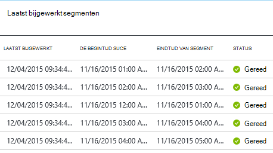

<properties
    pageTitle="Aangepaste activiteiten in een pijplijn Azure gegevens Factory gebruiken"
    description="Leer hoe u aangepaste activiteiten maken en gebruiken in een verkooppijplijn Factory van Azure-gegevens."
    services="data-factory"
    documentationCenter=""
    authors="spelluru"
    manager="jhubbard"
    editor="monicar"/>

<tags
    ms.service="data-factory"
    ms.workload="data-services"
    ms.tgt_pltfrm="na"
    ms.devlang="na"
    ms.topic="article"
    ms.date="10/17/2016"
    ms.author="spelluru"/>

# Aangepaste activiteiten in een pijplijn Azure gegevens Factory gebruiken
> [AZURE.SELECTOR]
[Component](data-factory-hive-activity.md)  
[Varken](data-factory-pig-activity.md)  
[MapReduce](data-factory-map-reduce.md)  
[Hadoop Streaming](data-factory-hadoop-streaming-activity.md)
[Machine Learning](data-factory-azure-ml-batch-execution-activity.md) 
[Opgeslagen Procedure](data-factory-stored-proc-activity.md)
[Gegevens Lake Analytics I-SQL](data-factory-usql-activity.md)
[.NET aangepaste](data-factory-use-custom-activities.md)

Er zijn twee soorten activiteiten die u in een pijplijn Factory van Azure-gegevens gebruiken kunt.
 
- [Gegevens verkeer activiteiten](data-factory-data-movement-activities.md) om gegevens te verplaatsen tussen [gegevensopslag ondersteund](data-factory-data-movement-activities.md#supported-data-stores).
- [Gegevens transformatie activiteiten](data-factory-data-transformation-activities.md) over het gebruik van de gegevens transformeren/proces berekent zoals Azure HDInsight, Azure Batch en Azure Machine Learning. Bijvoorbeeld: HDInsight-component en Machine Learning Batch Execution.  

Als u nodig hebt om gegevens te verplaatsen naar/van een gegevensopslag die niet wordt ondersteund door Factory van Azure-gegevens, kunt u een activiteit in een aangepaste .NET maken met uw eigen gegevens verkeer logica en het gebruik van de activiteit in de pijplijn. 

Op dezelfde manier als u gegevens in een manier die niet wordt ondersteund door gegevens Factory transformeren/proces moet, kunt u een aangepaste activiteit maken met uw eigen logica gegevensverwerking en het gebruik van de activiteit in de pijplijn.

> [AZURE.NOTE] Data Management Gateway ondersteunt momenteel alleen de kopie en opgeslagen procedure activiteit in Data Factory. Het is niet mogelijk is om te gebruiken van de gateway van een aangepaste activiteit voor toegang tot on-premises gegevensbronnen.
 
U kunt de aangepaste .NET-activiteit om uit te voeren met behulp van een service van **Azure Batch** of een cluster **Azure HDInsight** .   

De volgende procedure biedt stapsgewijze instructies voor het maken van een aangepaste .NET-activiteit en het gebruik van de aangepaste activiteit in een pijplijn. De stapsgewijze instructies gebruikt de service **Azure Batch** gekoppeld. Gebruik van de Azure HDInsight gekoppeld service in plaats daarvan, maakt u een gekoppelde service van het type **HDInsight** (als u uw eigen cluster HDInsight gebruikt) of **HDInsightOnDemand** (als u wilt gegevens Factory maken van een HDInsight cluster op aanvraag) en deze gebruiken in de sectie activiteit van de pijplijn JSON (**linkedServiceName**). Zie sectie [Gebruik Azure HDInsight gekoppelde services](#use-azure-hdinsight-linked-services) voor meer informatie over het gebruik van Azure HDInsight om uit te voeren van de aangepaste activiteit.

> [AZURE.IMPORTANT] Set 4.5.2-versie van het kader doel voor uw project voor het aangepaste activiteit van .NET in Visual Studio .NET Framework. Gegevens Factory biedt geen ondersteuning voor aangepaste activiteiten nieuwere versie dan 4.5.2 gecompileerd ten opzichte van .NET Framework-versies.   

## Stapsgewijze instructies 

### Vereisten voor

- Visual Studio 2012-2013/2015
- Download en installeer [Azure.NET SDK][azure-developer-center]

### Azure Batch vereisten
In de stapsgewijze instructies voert u uw aangepaste .NET-activiteiten Azure Batch gebruiken als een berekeningscluster resource. Zie [Grondbeginselen van Azure Batch] [ batch-technical-overview] voor een overzicht van de Batch Azure service en Zie [Aan de slag met de bibliotheek Azure Batch voor .NET] [ batch-get-started] naar snel aan de slag met de Batch Azure-service.

De zelfstudie moet u een Batch Azure-account maken met een groep VMs. Hier volgen de stappen:

1. Maak een **Azure Batch account** met behulp van de [Azure-portal](http://manage.windowsazure.com). Zie [maken en beheren van een account Azure Batch] [ batch-create-account] artikel voor instructies. Opmerking de Batch Azure-account naam en account-toets ingedrukt.

    U kunt ook [Nieuw AzureBatchAccount] [ new-azure-batch-account] cmdlet om een Batch Azure-account te maken. Zie [Azure PowerShell gebruiken voor Azure Batch Account beheren] [ azure-batch-blog] voor uitgebreide instructies over het gebruik van deze cmdlet.
2. Maak een **Azure Batch toepassingen**.
    1. In de [Azure-portal](https://portal.azure.com), klik op **Bladeren** in het linkermenu en **Batch Accounts**op. 
    2. Selecteer uw account Azure Batch openen van het blad **Batch-Account** . 
    3. Klik op de tegel **van toepassingen** .
    4. Klik op de knop toevoegen op de werkbalk om toe te voegen een groep in het blad **van toepassingen** .
        1. Geef een ID voor de groep (**ID van toepassingen**). Houd rekening met de **ID van de groep**; u deze nodig hebt bij het maken van de gegevens Factory-oplossing. 
        2. **Windows Server 2012 R2** opgeven voor de instelling-besturingssystemen.
        3. Selecteer een **knooppunt prijzen laag**. 
        3. Voer **2** als waarde voor de instelling **Specifiek doel** .
        4. Voer **2** als waarde voor de instelling **Max taken per knooppunt** .
    5. Klik op **OK** als u wilt maken van de groep. 
 
    U kunt ook [Nieuw AzureBatchPool](https://msdn.microsoft.com/library/mt628690.aspx) -cmdlet gebruiken om te maken van een Azure Batch-toepassingen.    

### Hoofdstappen 
1.  **Een aangepaste activiteit maken** gebruik van een pijplijn Data Factory. De aangepaste activiteit in dit voorbeeld bevat de logica van de transformatie/verwerking gegevens. 
    1.  Visual Studio, een project .NET-klassenbibliotheek maken, de code te verwerken invoergegevens hebt toegevoegd en compilatie van het project. 
    2.  De binaire bestanden en de PDB (optioneel)-bestand in de uitvoermap zip.  
    3.  Het zipbestand uploaden naar Azure-blobopslag. Gedetailleerde stappen zijn in de maken het gedeelte aangepaste activiteit. 
2. **Een Azure gegevens factory die gebruikmaakt van de aangepaste activiteit maken**:
    1. Maak een factory Azure-gegevens.
    2. Gekoppelde services maken.
        1. AzureStorageLinkedService: Voorraad opslag referenties voor toegang tot BLOB's.
        2. AzureBatchLinkedService: Hiermee geeft u Azure Batch zoals berekenen.
    3. Gegevenssets maken.
        1. InputDataset: Hiermee geeft u opslag container en een map voor de invoer BLOB's.
        1. OuputDataset: Hiermee geeft u opslag container en een map voor de uitvoer BLOB's.
    2. Maak een pijplijn waarin het aangepaste activiteit.
    3. Uitvoeren en testen van de pijplijn.
    4. Fouten opsporen in de pijplijn.

## De aangepaste activiteit maken
Als u wilt maken van een aangepaste activiteit .NET, door een **Klassenbibliotheek .NET** -project te maken met een klasse die die **IDotNetActivity** -interface implementeert. Deze interface heeft slechts één methode: [uitvoeren](https://msdn.microsoft.com/library/azure/mt603945.aspx) en de handtekening is:

    public IDictionary<string, string> Execute(
            IEnumerable<LinkedService> linkedServices, 
            IEnumerable<Dataset> datasets, 
            Activity activity, 
            IActivityLogger logger)
        

De methode nodig vier parameters:

- **linkedServices**. Deze eigenschap wordt een overzicht lijst met gekoppelde services die zijn gekoppeld invoer/uitvoer gegevensbronnen (bijvoorbeeld: Azure-blobopslag) fabriek gegevens. In dit voorbeeld is er slechts één gekoppelde service van het type Azure-opslag gebruikt voor zowel invoer en uitvoer. 
- **gegevenssets**. Deze eigenschap wordt een overzicht lijst van gegevenssets. U kunt deze parameter gebruiken om de locaties en schema's die zijn gedefinieerd door invoer- en uitvoerbereik gegevenssets.
- **activiteit**. Deze eigenschap beschrijft de huidige berekeningscluster entiteit - in dit geval een Azure-Batch.
- **logboek**. Dit object kunt u opmerkingen voor foutopsporing die oppervlak schrijven als de "Gebruiker" zich voor de pijplijn. 

De methode retourneert een woordenlijst die kan worden gebruikt om de keten van aangepaste activiteiten in de toekomst. Deze functie is nog niet geïmplementeerd, dus retourneren een lege woordenlijst van de methode.  

### Procedure 
1.  Maak een **Klassenbibliotheek .NET** -project.
    <ol type="a">
        <li>Start de <b>Visual Studio-2015</b> of <b>Visual Studio 2013</b> of <b>Visual Studio 2012</b>.</li>
        <li>Klik op <b>bestand</b>, wijs <b>Nieuw</b>aan en klik op <b>Project</b>.</li>
        <li>Vouw <b>sjablonen</b>en selecteer <b>Visual C#</b>. In dit scenario maakt u C#, maar u kunt een .NET-taal voor het ontwikkelen van de aangepaste activiteit.</li>
        <li>Selecteer <b>Klassenbibliotheek</b> in de lijst met projecttypen aan de rechterkant.</li>
        <li>Voer <b>MyDotNetActivity</b> voor de <b>naam</b>.</li>
        <li>Selecteer <b>C:\ADFGetStarted</b> voor de <b>locatie</b>.</li>
        <li>Klik op <b>OK</b> om het project te maken.</li>
    </ol>
2.  Klik op **Extra**, wijst u **NuGet Package Manager**en op **Package Manager-Console**.
3.  Voer de volgende opdracht **Microsoft.Azure.Management.DataFactories**importeren in de Console Package Manager.

        Install-Package Microsoft.Azure.Management.DataFactories

4. Het pakket **Azure Storage** NuGet in het project importeren.

        Install-Package Azure.Storage

5. De volgende instructies voor het **gebruik van** toevoegen aan het bronbestand in het project.

        using System.IO;
        using System.Globalization;
        using System.Diagnostics;
        using System.Linq;

        using Microsoft.Azure.Management.DataFactories.Models;
        using Microsoft.Azure.Management.DataFactories.Runtime;

        using Microsoft.WindowsAzure.Storage;
        using Microsoft.WindowsAzure.Storage.Blob;

6. Wijzig de naam van de **naamruimte** in **MyDotNetActivityNS**.

        namespace MyDotNetActivityNS

7. Wijzig de naam van de klasse in **MyDotNetActivity** en deze afgeleid van de **IDotNetActivity** -interface, zoals wordt weergegeven in het volgende codefragment:

        public class MyDotNetActivity : IDotNetActivity

8. Methode (toevoegen) het **uitvoeren** van de interface **IDotNetActivity** aan de klasse **MyDotNetActivity** implementeren en kopieer de volgende code met de methode.

    In het onderstaande voorbeeld telt het aantal exemplaren van de zoekterm ('Microsoft') in elke blob die is gekoppeld aan een segment gegevens. 

        /// 

        /// Execute method is the only method of IDotNetActivity interface you must implement. 
        /// In this sample, the method invokes the Calculate method to perform the core logic.  
        /// 

        public IDictionary<string, string> Execute(
            IEnumerable<LinkedService> linkedServices,
            IEnumerable<Dataset> datasets,
            Activity activity,
            IActivityLogger logger)
        {
            // to get extended properties (for example: SliceStart)
            DotNetActivity dotNetActivity = (DotNetActivity)activity.TypeProperties;
            string sliceStartString = dotNetActivity.ExtendedProperties["SliceStart"];

            // to log all extended properties           
            IDictionary<string, string> extendedProperties = dotNetActivity.ExtendedProperties;
            logger.Write("Logging extended properties if any...");
            foreach (KeyValuePair<string, string> entry in extendedProperties)
            {
                logger.Write("<key:{0}> <value:{1}>", entry.Key, entry.Value);
            }
        
            // declare types for input and output data stores
            AzureStorageLinkedService inputLinkedService;

            // declare dataset types
            CustomDataset inputLocation;
            AzureBlobDataset outputLocation;

            Dataset inputDataset = datasets.Single(dataset => dataset.Name == activity.Inputs.Single().Name);
            inputLocation = inputDataset.Properties.TypeProperties as CustomDataset;

            foreach (LinkedService ls in linkedServices)
                logger.Write("linkedService.Name {0}", ls.Name);

            // using First method instead of Single since we are using the same 
            // Azure Storage linked service for input and output. 
            inputLinkedService = linkedServices.First(
                linkedService =>
                linkedService.Name ==
                inputDataset.Properties.LinkedServiceName).Properties.TypeProperties
                as AzureStorageLinkedService;

            string connectionString = inputLinkedService.ConnectionString; 

            // To create an input storage client.
            string folderPath = GetFolderPath(inputDataset);
            string output = string.Empty; // for use later.

            // create storage client for input. Pass the connection string.
            CloudStorageAccount inputStorageAccount = CloudStorageAccount.Parse(connectionString);
            CloudBlobClient inputClient = inputStorageAccount.CreateCloudBlobClient();

            // initialize the continuation token before using it in the do-while loop.
            BlobContinuationToken continuationToken = null;
            do
            {   // get the list of input blobs from the input storage client object.
                BlobResultSegment blobList = inputClient.ListBlobsSegmented(folderPath,
                                         true,
                                         BlobListingDetails.Metadata,
                                         null,
                                         continuationToken,
                                         null,
                                         null);
                
                // Calculate method returns the number of occurrences of 
                // the search term (“Microsoft”) in each blob associated
                // with the data slice. definition of the method is shown in the next step.
 
                output = Calculate(blobList, logger, folderPath, ref continuationToken, "Microsoft");

            } while (continuationToken != null);

            // get the output dataset using the name of the dataset matched to a name in the Activity output collection.
            Dataset outputDataset = datasets.Single(dataset => dataset.Name == activity.Outputs.Single().Name);
            // convert to blob location object.
            outputLocation = outputDataset.Properties.TypeProperties as AzureBlobDataset;

            folderPath = GetFolderPath(outputDataset);

            logger.Write("Writing blob to the folder: {0}", folderPath);

            // create a storage object for the output blob.
            CloudStorageAccount outputStorageAccount = CloudStorageAccount.Parse(connectionString);
            // write the name of the file. 
            Uri outputBlobUri = new Uri(outputStorageAccount.BlobEndpoint, folderPath + "/" + GetFileName(outputDataset));

            logger.Write("output blob URI: {0}", outputBlobUri.ToString());
            // create a blob and upload the output text.
            CloudBlockBlob outputBlob = new CloudBlockBlob(outputBlobUri, outputStorageAccount.Credentials);
            logger.Write("Writing {0} to the output blob", output);
            outputBlob.UploadText(output);

            // The dictionary can be used to chain custom activities together in the future.
            // This feature is not implemented yet, so just return an empty dictionary.  

            return new Dictionary<string, string>();
        }

9. Voeg de volgende methoden. De methode **Execute** roept deze methoden. De methode **GetConnectionString** haalt de verbindingsreeks Azure Storage en de methode **GetFolderPath** haalt de blob-locatie. De methode **Calculate** geïsoleerd belangrijker is, de code die wordt herhaald tot en met elk blob.

        /// 

        /// Gets the folderPath value from the input/output dataset.
        /// 

        private static string GetFolderPath(Dataset dataArtifact)
        {
            if (dataArtifact == null || dataArtifact.Properties == null)
            {
                return null;
            }

            AzureBlobDataset blobDataset = dataArtifact.Properties.TypeProperties as AzureBlobDataset;
            if (blobDataset == null)
            {
                return null;
            }

            return blobDataset.FolderPath;
        }

        /// 

        /// Gets the fileName value from the input/output dataset.   
        /// 

        private static string GetFileName(Dataset dataArtifact)
        {
            if (dataArtifact == null || dataArtifact.Properties == null)
            {
                return null;
            }

            AzureBlobDataset blobDataset = dataArtifact.Properties.TypeProperties as AzureBlobDataset;
            if (blobDataset == null)
            {
                return null;
            }

            return blobDataset.FileName;
        }

        /// 

        /// Iterates through each blob (file) in the folder, counts the number of instances of search term in the file, 
        /// and prepares the output text that is written to the output blob. 
        /// 

        public static string Calculate(BlobResultSegment Bresult, IActivityLogger logger, string folderPath, ref BlobContinuationToken token, string searchTerm)
        {
            string output = string.Empty;
            logger.Write("number of blobs found: {0}", Bresult.Results.Count<IListBlobItem>());
            foreach (IListBlobItem listBlobItem in Bresult.Results)
            {
                CloudBlockBlob inputBlob = listBlobItem as CloudBlockBlob;
                if ((inputBlob != null) && (inputBlob.Name.IndexOf("$$$.$$$") == -1))
                {
                    string blobText = inputBlob.DownloadText(Encoding.ASCII, null, null, null);
                    logger.Write("input blob text: {0}", blobText);
                    string[] source = blobText.Split(new char[] { '.', '?', '!', ' ', ';', ':', ',' }, StringSplitOptions.RemoveEmptyEntries);
                    var matchQuery = from word in source
                                     where word.ToLowerInvariant() == searchTerm.ToLowerInvariant()
                                     select word;
                    int wordCount = matchQuery.Count();
                    output += string.Format("{0} occurrences(s) of the search term \"{1}\" were found in the file {2}.\r\n", wordCount, searchTerm, inputBlob.Name);
                }
            }
            return output;
        }

    De methode GetFolderPath geeft als resultaat het pad naar de map die de gegevensset naar verwijst en de getfilename, methode geeft als resultaat de naam van de blob of het bestand die de gegevensset naar verwijst. Als u havefolderPath wordt gedefinieerd met behulp van variabelen zoals {jaar}, {maand}, {dag} enzovoort: de methode geeft als resultaat de tekenreeks als deze is zonder deze te vervangen met runtime waarden. Zie de sectie [toegang uitgebreide eigenschappen](#access-extended-properties) voor meer informatie over de toegang tot SliceStart, SliceEnd, enzovoort.    
    
            "name": "InputDataset",
            "properties": {
                "type": "AzureBlob",
                "linkedServiceName": "AzureStorageLinkedService",
                "typeProperties": {
                    "fileName": "file.txt",
                    "folderPath": "adftutorial/inputfolder/",
    
    De methode Calculate berekent het aantal exemplaren van trefwoord Microsoft in de invoer bestanden (BLOB's in de map). De zoekterm ('Microsoft') is vastgelegde in de code.

10. Het project compileren. Op de knop **Opbouwen** in het menu en klik op **Oplossing maken**.

    > [AZURE.IMPORTANT] Set 4.5.2 versie van .NET Framework als het doel-kader voor uw project: met de rechtermuisknop op het project en klik op **Eigenschappen** om het doel-kader. Gegevens Factory biedt geen ondersteuning voor aangepaste activiteiten nieuwere versie dan 4.5.2 gecompileerd ten opzichte van .NET Framework-versies. 
11. Starten van **Windows Verkenner**en Ga naar de map voor **bin\debug** of **bin\release** afhankelijk van het type opbouwen.
12. Maken van een zip-bestand **MyDotNetActivity.zip** met de binaire van alle bestanden in de <project folder>map \bin\Debug. U kunt het bestand wilt meesturen **MyDotNetActivity.pdb** zodat u meer informatie, zoals het regelnummer van de in de broncode die het probleem hebben veroorzaakt als er een fout opgetreden is. Alle bestanden in het zip-bestand voor de aangepaste activiteit moet op het **hoogste niveau** met geen submappen.

    
13. **MyDotNetActivity.zip** uploaden als een blob aan de container blob: **customactivitycontainer** in de Azure-blobopslag dat de **AzureStorageLinkedService** -service in de **ADFTutorialDataFactory** gekoppeld wordt gebruikt.  Maak de blob container **customactivitycontainer** als deze nog niet bestaat.

> [AZURE.NOTE] Als u dit .NET activiteit-project toevoegen aan een oplossing in Visual Studio met een project Data Factory en toevoegen van een verwijzing naar .NET activiteit project uit het project Data Factory-toepassing, hoeft u niet de laatste twee stappen handmatig het zip-bestand maken en uploaden naar de Azure-blobopslag uitvoeren. Wanneer u gegevens Factory entiteiten gebruik van Visual Studio publiceert, wordt deze stappen wordt automatisch uitgevoerd door het publicatieproces. Zie [bouwen van uw eerste verkooppijplijn gebruik van Visual Studio](data-factory-build-your-first-pipeline-using-vs.md) en [Kopieer de gegevens van Azure Blob naar Azure SQL](data-factory-copy-activity-tutorial-using-visual-studio.md) -artikelen voor meer informatie over het maken en publiceren van gegevens Factory entiteiten gebruik van Visual Studio.  

### Methode uitvoeren

Hier vindt u meer informatie over en notities over de code in de methode **Execute** .
 
1. De leden voor de invoer verzameling doorlopen zijn in de naamruimte [Microsoft.WindowsAzure.Storage.Blob](https://msdn.microsoft.com/library/azure/microsoft.windowsazure.storage.blob.aspx) gevonden. De verzameling blob doorlopen, moet met de klasse **BlobContinuationToken** . In wezen, moet u een-terwijl lus met het token als het om de lus afsluiten. Zie voor meer informatie [het gebruik van .NET-blobopslag](../storage/storage-dotnet-how-to-use-blobs.md). Hier ziet u een eenvoudige lus:

        // Initialize the continuation token.
        BlobContinuationToken continuationToken = null;
        do
        {   
            // Get the list of input blobs from the input storage client object.
            BlobResultSegment blobList = inputClient.ListBlobsSegmented(folderPath,
                                      true,
                                      BlobListingDetails.Metadata,
                                      null,
                                      continuationToken,
                                      null,
                                      null);
            // Return a string derived from parsing each blob.
            output = Calculate(blobList, logger, folderPath, ref continuationToken, "Microsoft");
        } while (continuationToken != null);

    Zie de documentatie van de methode [ListBlobsSegmented](https://msdn.microsoft.com/library/jj717596.aspx) voor meer informatie.

2.  Hiermee gaat u de code voor het werken via de set BLOB's logisch binnen de do-terwijl herhalen. In de methode **Execute** , de Doe-terwijl lus de lijst met BLOB's met een methode **berekenen**met de naam geeft. De methode geeft als resultaat een tekenreeks met de naam **uitvoer** die het resultaat is van tot en met alle BLOB's in het segment hebt herhaald. 

    Dit geeft als resultaat het aantal exemplaren van de zoekterm (**Microsoft**) in de blob doorgegeven aan de **Calculate** -methode. 

            output += string.Format("{0} occurrences of the search term \"{1}\" were found in the file {2}.\r\n", wordCount, searchTerm, inputBlob.Name);

3.  Als de methode **Calculate** heeft het werk ingevuld, moet dit worden geschreven naar een nieuwe blob. Zodat voor elke set BLOB's verwerkt, kan een nieuwe blob met de resultaten worden geschreven. Als u wilt schrijven naar een nieuwe blob, moet u eerst de gegevensset uitvoer vinden. 

            // Get the output dataset using the name of the dataset matched to a name in the Activity output collection.
            Dataset outputDataset = datasets.Single(dataset => dataset.Name == activity.Outputs.Single().Name);

            // Convert to blob location object.
            outputLocation = outputDataset.Properties.TypeProperties as AzureBlobDataset;

4.  De code wordt ook een helpmethode: **GetFolderPath** om op te halen, het pad (de opslagruimte containernaam).
 
            folderPath = GetFolderPath(outputDataset);

    De **GetFolderPath** zet het object DataSet naar een AzureBlobDataSet, die een eigenschap met de naam mappad.
            
            AzureBlobDataset blobDataset = dataArtifact.Properties.TypeProperties as AzureBlobDataset;
            
            return blobDataset.FolderPath;

5.  De code oproepen de **getfilename,** methode voor het ophalen van de bestandsnaam (blob naam).  

            AzureBlobDataset blobDataset = dataArtifact.Properties.TypeProperties as AzureBlobDataset;

            return blobDataset.FileName;

6.  De naam van het bestand is geschreven door een object URI te maken. De constructor URI gebruikt de eigenschap **BlobEndpoint** naar de containernaam van de geretourneerd. De map pad en de bestandsnaam worden toegevoegd aan de uitvoer blob URI maken.  

            // Write the name of the file. 
            Uri outputBlobUri = new Uri(outputStorageAccount.BlobEndpoint, folderPath + "/" + GetFileName(outputDataset));

7.  De naam van het bestand is geschreven en nu kunt u de uitvoertekenreeks van de methode Calculate schrijven naar een nieuwe blob:

            // Create a blob and upload the output text.
            CloudBlockBlob outputBlob = new CloudBlockBlob(outputBlobUri, outputStorageAccount.Credentials);
            logger.Write("Writing {0} to the output blob", output);
            outputBlob.UploadText(output);

## De gegevens fabriek met behulp van Azure portal maken

In de sectie **de aangepaste activiteit maken** die u kunt een aangepaste activiteit gemaakt en het zip-bestand met binaire bestanden en het bestand PDB geüpload naar een container Azure blob. In dit gedeelte maakt u een Azure **gegevens factory** met een **verkooppijplijn** waarin de **aangepaste activiteit**.
 
De invoer gegevensset voor de aangepaste activiteit geeft de BLOB's (bestanden) in de invoer map (adftutorial\inputfolder) in-blobopslag. De uitvoer gegevensset voor de activiteit geeft de uitvoer BLOB's in de uitvoermap (adftutorial\outputfolder) in-blobopslag. 

Een bestand met de naam **bestand.txt** met de volgende inhoud maken en uploaden naar **adftutorial\inputfolder** (adftutorial is de naam van de container Azure blob en inputfolder is de naam van de map in dat onderdeel.)

    test custom activity Microsoft test custom activity Microsoft

De invoer map komt overeen met een segment in Azure gegevens fabriek, zelfs als de map twee of meer bestanden heeft. Wanneer elk segment wordt verwerkt door de pijplijn, is de aangepaste activiteit doorlopen van alle BLOB's in de map invoer voor segment. 

U ziet een uitvoerbestand met in de map adftutorial\output met een of meer regels (komt overeen met aantal BLOB's in de map invoer):
 
    2 occurrences(s) of the search term "Microsoft" were found in the file inputfolder/2015-11-16-00/file.txt.

Hier volgen de stappen die u in deze sectie uitvoert:

1. Maak een **gegevens factory**.
2. **Gekoppelde services** voor de groep Azure Batch met VMs op waarin het aangepaste activiteit wordt uitgevoerd en de opslag van Azure waarin de invoer/uitvoer BLOB's. 
2. Invoer- en uitvoerbereik **gegevenssets** die invoer en uitvoer van de aangepaste activiteit vertegenwoordigen. 
3. **Pijplijn** waarin het aangepaste activiteit.
4. **Gegevens factory**. U maakt een wanneer deze entiteiten publiceren naar Azure. 

> [AZURE.NOTE] Maak de **bestand.txt** en uploadt dit naar een container blob als u dat nog niet had gedaan. Zie de bovenstaande instructies.  

### Stap 1: De gegevens fabriek maken

1.  Na het aanmelden bij de Azure-portal, volgt u de volgende stappen uit:
    1.  Klik op **Nieuw** in het linkermenu.
    2.  Klik op **gegevens + Analytics** in het **Nieuw** blad.
    3.  Klik op **Gegevens Factory** op het blad **gegevens analytics** .
2.  Voer in het blad **nieuwe gegevens factory** **CustomActivityFactory** voor de naam. De naam van de fabriek Azure gegevens moet uniek zijn. Als het foutbericht: **gegevens factory naam "CustomActivityFactory" is niet beschikbaar**, wijzig de naam van de gegevens fabriek (bijvoorbeeld **yournameCustomActivityFactory**) en probeert opnieuw te maken.
3.  Klik op **De naam van de RESOURCE-groep**, en selecteer een bestaande resourcegroep of een resourcegroep maken. 
4.  Ga na of u het juiste **abonnement** en de **regio** waar u de gegevens fabriek moet worden gemaakt. 
5.  Klik op **maken** op het **nieuwe gegevens factory** -blad.
6.  Ziet u de gegevens fabriek wordt gemaakt in het **Dashboard** van de Azure-portal.
7.  Nadat de gegevens fabriek is gemaakt, kunt u het blad gegevens Factory, waarin u de inhoud van de fabriek gegevens zien.

### Stap 2: Gekoppelde services maken

Gekoppelde services opgeslagen gegevens koppelen of services naar een factory Azure gegevens berekenen. In deze stap geeft u een uw opslagruimte van Azure-account en Azure Batch account koppeling naar uw gegevens factory.

#### Azure gekoppeld opslagservice maken

1.  Klik op de **auteur en implementeren** tegel op het blad **Gegevens FACTORY** voor **CustomActivityFactory**. Ziet u de gegevens Factory-Editor.
2.  Klik op **nieuwe gegevens opslaan** op de balk met opdrachten en kies **Azure opslag**. Hier ziet u de JSON-script voor het maken van een Azure gekoppeld opslagservice in de editor.
3.  **Accountnaam** vervangen door de naam van uw Azure opslag-account en **accountsleutel** met de access-toets van de Azure opslag-account. Als u wilt leren hoe u uw opslagruimte toegangstoets, raadpleegt u [weergave, kopiëren en opnieuw genereren opslag toegangstoetsen](../storage/storage-create-storage-account.md#view-copy-and-regenerate-storage-access-keys).
4.  Klik op **Deploy** op de opdrachtbalk om te implementeren van de gekoppelde service.

#### Azure Batch gekoppeld service maken

2. In de gegevens Factory-Editor, klik op **Nieuw berekenen** van de balk met opdrachten en **Azure Batch** selecteren in het menu.
3. De volgende wijzigingen aanbrengen in de JSON-script:
    1. Geef de accountnaam Azure Batch voor de eigenschap **accountnaam** . De **URL** van de **Azure Batch account blade** heeft de volgende indeling: http://**accountnaam**. region.batch.azure.com. Voor de eigenschap **batchUri** in de JSON, die u moet **verwijderen "accountnaam."** via de URL en de **accountnaam** wordt gebruikt voor de **accountnaam** JSON-eigenschap.
    2. Geef de Batch Azure-account-toets voor de eigenschap **accessKey** . 
    3. Geef de naam van de toepassingen die u hebt gemaakt als onderdeel van de vereisten voor de eigenschap **groepsnaam** . U kunt ook de ID van de groep in plaats van de naam van de toepassingen opgeven.
    4. Geef Azure Batch URI voor de eigenschap **batchUri** . Zie Opmerkingen hierboven voor **accountnaam** eigenschap. Voorbeeld: https://westus.batch.azure.com.  
    5. Geef de **AzureStorageLinkedService** voor de eigenschap **linkedServiceName** .
        
            {
              "name": "AzureBatchLinkedService",
              "properties": {
                "type": "AzureBatch",
                "typeProperties": {
                  "accountName": "myazurebatchaccount",
                  "batchUri": "https://westus.batch.azure.com",
                  "accessKey": "<yourbatchaccountkey>",
                  "poolName": "myazurebatchpool",
                  "linkedServiceName": "AzureStorageLinkedService"
                }
              }
            }

        U kunt ook de ID van de groep in plaats van de naam van de toepassingen voor de eigenschap **groepsnaam** opgeven.

    > [AZURE.NOTE] De gegevens Factory-service biedt geen ondersteuning van een optie op aanvraag voor Azure Batch als voor HDInsight. U kunt uw eigen groep Azure Batch alleen gebruiken in een fabriek Azure-gegevens.
    
### Stap 3: Gegevenssets maken
In deze stap maakt u gegevenssets om invoer- en uitvoerbereik gegevens voor te stellen.

#### Invoer gegevensset maken
1.  Klik in de **Editor** voor de fabriek gegevens, klikt u op de knop **nieuwe gegevensset** op de werkbalk en **Azure-blobopslag** op uit de vervolgkeuzelijst.
2.  De JSON in het rechterdeelvenster vervangen door het volgende JSON-fragment:

            {
                "name": "InputDataset",
                "properties": {
                    "type": "AzureBlob",
                    "linkedServiceName": "AzureStorageLinkedService",
                    "typeProperties": {
                        "folderPath": "adftutorial/customactivityinput/",
                        "format": {
                            "type": "TextFormat"
                        }
                    },
                    "availability": {
                        "frequency": "Hour",
                        "interval": 1
                    },
                    "external": true,
                    "policy": {}
                }
            }

    U maakt een pijplijn verderop in dit scenario met begintijd: 2015-11-16T00:00:00Z-en eindtijd: 2015-11-16T05:00:00Z. Is gepland tot gegevens per uur, zodat er 5 invoer/uitvoer segmenten (tussen **00**: **05**-00:00 >: 00:00). 

    De **frequentie** en het **interval** voor de invoer gegevensset is ingesteld op **uur** en **1**, wat betekent dat de invoer segment per uur beschikbaar is. In dit voorbeeld is het hetzelfde bestand (bestand.txt) in de intputfolder. 

    Hier volgen de begintijden voor elk segment, die wordt aangeduid met een SliceStart systeemvariabele in het bovenstaande JSON-fragment. 

    
3.  Klik op **Deploy** op de werkbalk maken en implementeren van de **InputDataset**. Bevestig dat u het bericht **Tabel gemaakt met SUCCES** op de titelbalk van de Editor ziet.

#### Een gegevensset uitvoer maken

1. Klik in de **gegevens Factory-editor**op **nieuwe gegevensset**en klik vervolgens op **Azure-blobopslag** uit de opdrachtbalk.
2. De JSON-script in het rechterdeelvenster vervangen door het volgende JSON-script:

        {
            "name": "OutputDataset",
            "properties": {
                "type": "AzureBlob",
                "linkedServiceName": "AzureStorageLinkedService",
                "typeProperties": {
                    "fileName": "{slice}.txt",
                    "folderPath": "adftutorial/customactivityoutput/",
                    "partitionedBy": [
                        {
                            "name": "slice",
                            "value": {
                                "type": "DateTime",
                                "date": "SliceStart",
                                "format": "yyyy-MM-dd-HH"
                            }
                        }
                    ]
                },
                "availability": {
                    "frequency": "Hour",
                    "interval": 1
                }
            }
        }

    Uitvoerlocatie is **adftutorial/customactivityoutput/** en naam van het uitvoerbestand is jjjj-MM-dd-HH.txt waarbij JJJJ-MM-dd-[HH is dat het jaar, de maand, de datum en het uur van het segment worden geproduceerd. Zie [Naslaginformatie voor ontwikkelaars] [ adf-developer-reference] voor meer informatie.

    Een blob/uitvoerbestand wordt gegenereerd voor elke invoer segment. Hier ziet u hoe een uitvoerbestand voor elk segment wordt genoemd. Alle uitvoerbestanden die worden gegenereerd in één uitvoermap: **adftutorial\customactivityoutput**.

  	| Segment | Begintijd | Uitvoerbestand |
  	| :---- | :--------- | :---------- | 
  	| 1 | 2015-11-16T00:00:00 | 2015-11-16-00.txt |
  	| 2 | 2015-11-16T01:00:00 | 2015-11-16-01.txt |
  	| 3 | 2015-11-16T02:00:00 | 2015-11-16-02.txt |
  	| 4 | 2015-11-16T03:00:00 | 2015-11-16-03.txt |
  	| 5 | 2015-11-16T04:00:00 | 2015-11-16-04.txt |

    Houd er rekening mee dat alle bestanden in een map met invoer deel van een segment met de begintijden uitmaken hierboven genoemde. Wanneer dit segment wordt verwerkt, wordt de aangepaste activiteit gescand in alle bestanden en genereert een lijn in het uitvoerbestand met het aantal exemplaren van zoekterm ('Microsoft'). Als er drie bestanden in de inputfolder zijn, zijn er drie regels in het uitvoerbestand voor elk uur segment: 2015-11-16-00.txt, 2015-11-16:01:00:00.txt, enzovoort. 

2. Klik op **Deploy** op de opdrachtbalk de **OutputDataset**implementeren.

### Maken en uitvoeren van een pijplijn waarin het aangepaste activiteit

1. In de gegevens Factory-Editor, klikt u op **nieuwe verkooppijplijn** op de opdrachtbalk. Als u de opdracht niet ziet, klikt u op **... (Weglatingsteken)** om het te geven.
2. Vervang de JSON in het rechterdeelvenster met de volgende JSON-script. 

        {
          "name": "ADFTutorialPipelineCustom",
          "properties": {
            "description": "Use custom activity",
            "activities": [
              {
                "Name": "MyDotNetActivity",
                "Type": "DotNetActivity",
                "Inputs": [
                  {
                    "Name": "InputDataset"
                  }
                ],
                "Outputs": [
                  {
                    "Name": "OutputDataset"
                  }
                ],
                "LinkedServiceName": "AzureBatchLinkedService",
                "typeProperties": {
                  "AssemblyName": "MyDotNetActivity.dll",
                  "EntryPoint": "MyDotNetActivityNS.MyDotNetActivity",
                  "PackageLinkedService": "AzureStorageLinkedService",
                  "PackageFile": "customactivitycontainer/MyDotNetActivity.zip",
                  "extendedProperties": {
                    "SliceStart": "$$Text.Format('{0:yyyyMMddHH-mm}', Time.AddMinutes(SliceStart, 0))"
                  }
                },
                "Policy": {
                  "Concurrency": 2,
                  "ExecutionPriorityOrder": "OldestFirst",
                  "Retry": 3,
                  "Timeout": "00:30:00",
                  "Delay": "00:00:00"
                }
              }
            ],
            "start": "2015-11-16T00:00:00Z",
            "end": "2015-11-16T05:00:00Z",
            "isPaused": false
          }
        }

    Houd rekening met de volgende punten:

    - **Bij gelijktijdigheid** is ingesteld op **2** zodat twee segmenten parallel worden verwerkt door 2 VMs in de groep Azure Batch.
    - Er is een activiteit in de sectie activiteiten en van het type: **DotNetActivity**.
    - **AssemblyName** is ingesteld op de naam van de DLL: **MyDotnetActivity.dll**.
    - **Ingangspunt** is ingesteld op **MyDotNetActivityNS.MyDotNetActivity**.
    - **PackageLinkedService** is ingesteld op **AzureStorageLinkedService** die verwijst naar de blobopslag waarin het aangepaste activiteit zip-bestand. Als u verschillende Azure Storage-accounts voor invoer/uitvoer bestanden en het aangepaste activiteit zip-bestand gebruikt, maakt u een andere Azure gekoppeld opslagservice. In dit artikel wordt ervan uitgegaan dat u hetzelfde opslag van Azure-account gebruikt.
    - **PackageFile** is ingesteld op **customactivitycontainer/MyDotNetActivity.zip**. Het is in de indeling: containerforthezip/nameofthezip.zip.
    - De aangepaste activiteit duurt **InputDataset** als invoer en **OutputDataset** als uitvoer.
    - De eigenschap linkedServiceName van de aangepaste activiteit verwijst naar de **AzureBatchLinkedService**, waarin wordt uitgelegd Azure gegevens Factory dat de aangepaste activiteit moet worden uitgevoerd op Azure Batch VMs.
    - de eigenschap **isPaused** is standaard ingesteld op **Onwaar** . De pijplijn wordt onmiddellijk uitgevoerd in dit voorbeeld omdat de segmenten in het verleden starten. U kunt deze eigenschap ingesteld op waar onderbreken van de pijplijn en deze in te stellen op onwaar om opnieuw te starten. 
    - De **Begintijd** en **eindtijd** zijn **vijf** uur uit elkaar en segmenten per uur, worden geproduceerd zodat vijf segmenten worden geproduceerd door de pijplijn. 

4. Klik op **Deploy** op de opdrachtbalk om te implementeren van de pijplijn.

### De pijplijn controleren
 
8. Klik in het Data Factory-blad in de portal van Azure, op **Diagram**.
    
    
 
9. Klik in de diagramweergave te klikken, op de OutputDataset.
 
    

10. U ziet dat de vijf uitvoer segmenten in de status gereed zijn als ze al zijn verkregen.

    
    
12. Controleer of dat de uitvoerbestanden in de blobopslag in de container **adftutorial** worden gegenereerd.

    ![uitvoer van aangepaste activiteit][image-data-factory-ouput-from-custom-activity]

9. Als u het uitvoerbestand opent, ziet u de uitvoer die vergelijkbaar is met het volgende resultaat:

    2 exemplaren (s) van de zoekterm 'Microsoft' zijn gevonden in de inputfolder/2015-11-16-00/file.txt bestand.

10. Gebruik van de [Azure portal] [ azure-preview-portal] of Azure PowerShell-cmdlets om de uw gegevens factory, pijpleidingen en gegevenssets te houden. Hier ziet u berichten van de **ActivityLogger** in de code voor de aangepaste activiteit in de logboeken (specifiek gebruiker-0.log) die u kunt downloaden via de portal of met de cmdlets.

    ![Logboeken downloaden van aangepaste activiteit][image-data-factory-download-logs-from-custom-activity]

Zie [Monitor en pijpleidingen beheren](data-factory-monitor-manage-pipelines.md) voor gedetailleerde stappen voor het controleren van gegevenssets en pijpleidingen.      

### Integratie van gegevens Factory en Batch
De gegevens Factory-service maakt u een taak binnen Azure Batch met de naam: **adf-poolname:job-lengte**. 

Een taak is gemaakt voor elke activiteit uitvoering van een segment. Als er 10 segmenten klaar om te worden verwerkt, worden in deze taak 10 taken gemaakt. U kunt meer dan één segment parallel wordt uitgevoerd als er meerdere berekeningscluster knooppunten in de groep hebben. U kunt ook meer dan één segment waarop de dezelfde berekeningscluster als het maximum aantal taken per berekeningscluster knooppunt is ingesteld op > 1 hebben. 

In het volgende diagram ziet u de relatie tussen Azure gegevens fabriek en Batch taken. 

## Fouten opsporen in de pijplijn
Enkele eenvoudige technieken bevat voor foutopsporing in:

1.  Als u het volgende foutbericht wordt weergegeven, moet u bevestigen dat de naam van de klas in het bestand CS overeenkomt met de naam die u hebt opgegeven voor de eigenschap **ingangspunt** in de pijplijn JSON. In de bovenstaande procedure, de naam van de klasse is: MyDotNetActivity en de ingangspunt in de JSON is: MyDotNetActivityNS. **MyDotNetActivity**. 

            MyDotNetActivity assembly does not exist or doesn't implement the type Microsoft.DataFactories.Runtime.IDotNetActivity properly

    Als de namen komen overeen met, bevestigen dat de binaire bestanden in de **hoofdmap** van het zip-bestand. Dat wil zeggen, wanneer u het zip-bestand opent, ziet u alle bestanden in de hoofdmap, niet in eventuele submappen.   
2.  Als het segment invoer niet is ingesteld op **Gereed**, schakelt u de structuur van de invoer juist is en **bestand.txt** bestaat in de invoer mappen. 
2.  In de methode **Execute** van uw aangepaste activiteit, gebruikt u het object **IActivityLogger** aan te melden informatie waarmee u problemen oplossen. De geregistreerde berichten worden weergegeven in de logboekbestanden van de gebruiker (een of meer bestanden met de naam: gebruiker-0.log, gebruiker-1.log, gebruiker-2.log, enz.). 

    Klik in het blad **OutputDataset** op het segment om te zien van het blad **Gegevens segment** voor segment. U ziet de **activiteit wordt uitgevoerd** voor segment. Hier ziet u een activiteit uitvoeren voor het segment. Als u op uitvoeren in de opdrachtenbalk, kunt u een andere activiteit uitvoeren voor hetzelfde segment starten. 

    Wanneer u op de activiteit uitvoeren hebt geklikt, ziet u het blad **DETAILS van activiteiten uitvoeren** met een lijst met logboekbestanden. U ziet dat berichten in het bestand user_0.log in logboek. Wanneer een fout optreedt, ziet u drie activiteit wordt uitgevoerd, omdat het aantal nieuwe pogingen is ingesteld op 3 in de verkooppijplijn/activiteit JSON. Wanneer u op de activiteit uitvoeren hebt geklikt, ziet u de logboekbestanden die u bekijken kunt om op te lossen van de fout. 

    In de lijst met logboekbestanden, klikt u op de **gebruiker-0.log**. Zijn de resultaten van het gebruik van de methode **IActivityLogger.Write** in het rechterdeelvenster. Als u alle berichten niet ziet, controleert u of er meer logboekbestanden met de naam: user_1.log, user_2.log enzovoort. Anders kan de code nadat de nieuwste bericht zich aangemeld.

    U moet ook **systeem-0.log** voor elke fout systeemberichten en uitzonderingen controleren.

3.  Neem de **PDB** -bestand in het zip-bestand zodat details van de fout toegangsgegevens voor de **stapel bellen hebt** wanneer een fout optreedt.
4.  Alle bestanden in het zip-bestand voor de aangepaste activiteit moet op het **hoogste niveau** met geen submappen.
5.  Zorg ervoor dat de **assemblyName** (MyDotNetActivity.dll), **ingangspunt**(MyDotNetActivityNS.MyDotNetActivity), **packageFile** (customactivitycontainer/MyDotNetActivity.zip) en **packageLinkedService** (verwijzen naar de Azure-blobopslag waarin het zipbestand) zijn ingesteld op de juiste waarden. 
6.  Als u een fout vaste en willen het segment verwerken, met de rechtermuisknop op het segment in het blad **OutputDataset** en klik op **uitvoeren**. 
7.  De aangepaste activiteit geen gebruikmaakt van het bestand **app.config** uit uw pakket, dus als u uw code leest de verbindingstekenreeksen uit het configuratiebestand, dit niet tijdens runtime werkt. Het wordt aanbevolen bij gebruik van Azure Batch is geen geheimen in een **Azure KeyVault**houdt, met een principal op basis van certificaten-service te beveiligen dan de **keyvault**en het certificaat naar Azure Batch groep distribueren. De aangepaste activiteit .NET kunt geheimen vervolgens openen vanaf de KeyVault gedurende runtime. Deze oplossing is een algemene oplossing en kan worden aangepast aan elk gewenst type geheim, niet alleen de verbindingsreeks.

    Er is een eenvoudiger tijdelijke oplossing (maar niet een goede gewoonte): u kunt maken een **SQL Azure gekoppeld service** met verbinding tekenreeks instellingen, maken van een gegevensset die de gekoppelde service gebruikt, en het koppelen van de gegevensset als een pop invoer gegevensset naar de aangepaste .NET-activiteit. U kunt de verbindingsreeks van de gekoppelde service in de aangepaste activiteitscode bekijken en deze moet werken probleemloos gedurende runtime.  

## De aangepaste activiteiten bijwerken
Als u de code voor de aangepaste activiteit bijwerkt, bouwen en upload het zip-bestand met de nieuwe binaire bestanden met de blobopslag.

## Gegevens kopiëren/verplaatsen 
Activiteit kopieën opslaan van gegevens uit een **bron** -gegevens naar een gegevensopslag **sink** kopiëren. Zie [ondersteunde gegevens winkels](data-factory-data-movement-activities.md#supported-data-stores) voor de lijst met gegevens winkels ondersteund als bronnen en sinks voor de activiteit kopiëren. 

Als u nodig hebt om gegevens te verplaatsen naar/van een gegevensopslag die niet wordt ondersteund door de **Kopie activiteit**, kunt u de **aangepaste activiteit** in gegevens fabriek met uw eigen logica voor het kopiëren/verplaatsen van de gegevens. Zie [HTTP-gegevens Downloader voorbeeld](https://github.com/Azure/Azure-DataFactory/tree/master/Samples/HttpDataDownloaderSample) op GitHub.  

## AppDomain moeten worden geïsoleerd 
Zie [Cross AppDomain steekproef](https://github.com/Azure/Azure-DataFactory/tree/master/Samples/CrossAppDomainDotNetActivitySample) die u hoe ziet u een aangepaste .NET-activiteit van de auteur voor Azure gegevens Factory die niet is beperkt tot constructie-versies die worden gebruikt door het startpictogram van het Factory van Azure-gegevens (bijvoorbeeld WindowsAzure.Storage v4.3.0, Newtonsoft.Json v6.0.x, enzovoort).

## Access uitgebreide eigenschappen
Uitgebreide eigenschappen in de activiteit JSON zoals hieronder wordt weergegeven, kunt u declareren: 

    "typeProperties": {
      "AssemblyName": "MyDotNetActivity.dll",
      "EntryPoint": "MyDotNetActivityNS.MyDotNetActivity",
      "PackageLinkedService": "AzureStorageLinkedService",
      "PackageFile": "customactivitycontainer/MyDotNetActivity.zip",
      "extendedProperties": {
        "SliceStart": "$$Text.Format('{0:yyyyMMddHH-mm}', Time.AddMinutes(SliceStart, 0))",
        "DataFactoryName": "CustomActivityFactory"
      }
    },

In de code, zijn er twee uitgebreide eigenschappen: **SliceStart** en **DataFactoryName**. De waarde voor SliceStart is gebaseerd op de SliceStart systeemvariabele. Zie [Variabelen](data-factory-scheduling-and-execution.md#data-factory-system-variables) voor een lijst met ondersteunde systeemvariabelen. De waarde voor DataFactoryName is ingesteld op "CustomActivityFactory". 

Voor toegang tot deze uitgebreide eigenschappen in de methode **Execute** , gebruikt u de code is vergelijkbaar met de volgende code: 

    // to get extended properties (for example: SliceStart)
    DotNetActivity dotNetActivity = (DotNetActivity)activity.TypeProperties;
    string sliceStartString = dotNetActivity.ExtendedProperties["SliceStart"];

    // to log all extended properties                               
    IDictionary<string, string> extendedProperties = dotNetActivity.ExtendedProperties;
    logger.Write("Logging extended properties if any...");
    foreach (KeyValuePair<string, string> entry in extendedProperties)
    {
        logger.Write("<key:{0}> <value:{1}>", entry.Key, entry.Value);
    }

## Functie van Azure Batch automatisch schalen
U kunt ook een Azure Batch-toepassingen maken met de functie **automatisch schalen** . Bijvoorbeeld kon u een azure batch-toepassingen met 0 speciale VMs en een automatisch schalen-formule op basis van het aantal taken in behandeling maken:

Eén VM per wachtende taken tegelijk (bijvoorbeeld: vijf taken in behandeling -> vijf VMs):

    pendingTaskSampleVector=$PendingTasks.GetSample(600 * TimeInterval_Second);
    $TargetDedicated = max(pendingTaskSampleVector);

Max van één VM tegelijk ongeacht het aantal taken in behandeling:

    pendingTaskSampleVector=$PendingTasks.GetSample(600 * TimeInterval_Second);
    $TargetDedicated = (max(pendingTaskSampleVector)>0)?1:0;

Zie [automatisch de knooppunten in een Azure Batch van toepassingen voor het berekenen van schaal](../batch/batch-automatic-scaling.md) voor meer informatie. 

Als u de groep wordt de standaard- [autoScaleEvaluationInterval](https://msdn.microsoft.com/library/azure/dn820173.aspx)gebruikt, krijgen de Batch-service 15-30 minuten voor het voorbereiden van de VM voordat u de aangepaste activiteit.  Als de groep een andere autoScaleEvaluationInterval gebruikt wordt, kan de Batch-service autoScaleEvaluationInterval + 10 minuten duren.

## Azure HDInsight gekoppeld services gebruiken
In de stapsgewijze instructies gebruikt u Azure Batch berekeningscluster om uit te voeren van de aangepaste activiteit. U kunt ook uw eigen cluster HDInsight of gegevens Factory maken van een op aanvraag HDInsight cluster en de aangepaste activiteit worden uitgevoerd op het cluster HDInsight zijn. Dit zijn de algemene stappen voor het gebruik van een cluster HDInsight.  

1. Maak een service Azure HDInsight gekoppeld.   
2. Gebruik HDInsight-service in plaats van **AzureBatchLinkedService** in de pijplijn JSON gekoppeld. 

U kunt de ** **begin** - en** eindtijden voor de pijplijn wijzigt zodat u het scenario met de service Azure HDInsight kunt testen.

#### Azure HDInsight gekoppeld service maken 
De service Azure gegevens Factory ondersteunt het maken van een cluster op aanvraag en deze gebruiken om te invoer om te leiden tot uitvoergegevens van proces. U kunt ook uw eigen cluster gebruiken om uit te voeren hetzelfde. Wanneer u op aanvraag HDInsight cluster gebruikt, wordt een cluster voor elk segment gemaakt. Dat, als u uw eigen cluster HDInsight gebruikt, het cluster klaar is voor het segment onmiddellijk verwerken. Daarom wanneer u op aanvraag cluster gebruikt, mogelijk niet ziet u de uitvoergegevens zo snel wanneer u uw eigen cluster gebruiken.

> [AZURE.NOTE] Gedurende runtime, een exemplaar van de activiteit in een .NET wordt uitgevoerd alleen op één werknemer knooppunt in het cluster HDInsight. Deze kan niet worden aangepast om uit te voeren op meerdere knooppunten. Meerdere exemplaren van .NET activiteit kunnen parallel uitgevoerd op verschillende knooppunten van het cluster HDInsight.

##### Een cluster van de HDInsight op aanvraag gebruiken

1. Klik in de **portal van Azure**op **auteur en Deploy** in de gegevens Factory-startpagina.
2. In de gegevens Factory-Editor, klik op **Nieuw berekenen** van de balk met opdrachten en **op aanvraag HDInsight cluster** selecteren in het menu.
2. De volgende wijzigingen aanbrengen in de JSON-script:
    1. Geef de grootte van het cluster HDInsight voor de eigenschap **clusterSize** .
    3. Voor de eigenschap **timeToLive** opgeven hoe lang de klant inactief kan zijn voordat deze wordt verwijderd.
    4. Geef de HDInsight-versie die u wilt gebruiken voor de eigenschap **versie** . Als u deze eigenschap weglaat, wordt de meest recente versie gebruikt.  
    5. Geef bij **AzureStorageLinkedService** dat u hebt gemaakt in aan de slag zelfstudie voor de **linkedServiceName**.

            {
                "name": "HDInsightOnDemandLinkedService",
                "properties": {
                    "type": "HDInsightOnDemand",
                    "typeProperties": {
                        "clusterSize": 4,
                        "timeToLive": "00:05:00",
                        "osType": "Windows",
                        "linkedServiceName": "AzureStorageLinkedService",
                    }
                }
            }

2. Klik op **Deploy** op de opdrachtbalk om te implementeren van de gekoppelde service.

##### Uw eigen cluster HDInsight gebruiken:

1. Klik in de **portal van Azure**op **auteur en Deploy** in de gegevens Factory-startpagina.
2. Klik in de **Gegevens Factory-Editor**, klik op **Nieuw berekenen** van de balk met opdrachten en **HDInsight cluster** selecteren in het menu.
2. De volgende wijzigingen aanbrengen in de JSON-script:
    1. Voor de eigenschap **clusterUri** , voert u de URL voor uw HDInsight. Bijvoorbeeld: https://<clustername>.azurehdinsight.net/     
    2. Typ de naam van de gebruiker die toegang tot het cluster HDInsight heeft voor de eigenschap **UserName** .
    3. Voer het wachtwoord voor de gebruiker voor de eigenschap **wachtwoord** .
    4. Voer voor de eigenschap **LinkedServiceName** **AzureStorageLinkedService**. U kunt deze gekoppelde service in de slag te gaan Get-zelfstudie hebt gemaakt.

2. Klik op **Deploy** op de opdrachtbalk om te implementeren van de gekoppelde service.

Zie [berekenen van gekoppelde services](data-factory-compute-linked-services.md) voor meer informatie. 

Gebruik in de **verkooppijplijn JSON**, HDInsight (op aanvraag of uw eigen) service gekoppeld: 

    {
      "name": "ADFTutorialPipelineCustom",
      "properties": {
        "description": "Use custom activity",
        "activities": [
          {
            "Name": "MyDotNetActivity",
            "Type": "DotNetActivity",
            "Inputs": [
              {
                "Name": "InputDataset"
              }
            ],
            "Outputs": [
              {
                "Name": "OutputDataset"
              }
            ],
            "LinkedServiceName": "HDInsightOnDemandLinkedService",
            "typeProperties": {
              "AssemblyName": "MyDotNetActivity.dll",
              "EntryPoint": "MyDotNetActivityNS.MyDotNetActivity",
              "PackageLinkedService": "AzureStorageLinkedService",
              "PackageFile": "customactivitycontainer/MyDotNetActivity.zip",
              "extendedProperties": {
                "SliceStart": "$$Text.Format('{0:yyyyMMddHH-mm}', Time.AddMinutes(SliceStart, 0))"
              }
            },
            "Policy": {
              "Concurrency": 2,
              "ExecutionPriorityOrder": "OldestFirst",
              "Retry": 3,
              "Timeout": "00:30:00",
              "Delay": "00:00:00"
            }
          }
        ],
        "start": "2015-11-16T00:00:00Z",
        "end": "2015-11-16T05:00:00Z",
        "isPaused": false
      }
    }

## Voorbeelden

Voorbeeld | Welke aangepaste activiteit bevat 
------ | ----------- 
[HTTP-gegevens Downloader](https://github.com/Azure/Azure-DataFactory/tree/master/Samples/HttpDataDownloaderSample). | Gegevens uit een HTTP-eindpunt naar Azure-blobopslag met aangepaste C# activiteit in Data Factory gedownload.
[Voorbeeld van Twitter Sentiment analyse](https://github.com/Azure/Azure-DataFactory/tree/master/Samples/TwitterAnalysisSample-CustomC%23Activity) | Hiermee wordt een Azure ML model en doe sentiment analyse, scoren, tekstvoorspelling enzovoort.
[R-Script uitvoeren](https://github.com/Azure/Azure-DataFactory/tree/master/Samples/RunRScriptUsingADFSample). | Hiermee wordt R script door RScript.exe uit te voeren op uw cluster HDInsight die beschikt over R geïnstalleerd op is geïnstalleerd. 
[Cross AppDomain .NET activiteit](https://github.com/Azure/Azure-DataFactory/tree/master/Samples/CrossAppDomainDotNetActivitySample) | Gebruik van verschillende constructie-versies van die die worden gebruikt door de gegevens Factory startprogramma voor apps  
 

## Zie ook

[Azure gegevens Factory Updates: uitvoeren ADF aangepaste .NET-activiteiten met Azure Batch](https://azure.microsoft.com/blog/2015/05/01/azure-data-factory-updates-execute-adf-custom-net-activities-using-azure-batch/).

[batch-net-library]: ../batch/batch-dotnet-get-started.md
[batch-create-account]: ../batch/batch-account-create-portal.md
[batch-technical-overview]: ../batch/batch-technical-overview.md
[batch-get-started]: ../batch/batch-dotnet-get-started.md
[use-custom-activities]: data-factory-use-custom-activities.md
[troubleshoot]: data-factory-troubleshoot.md
[data-factory-introduction]: data-factory-introduction.md
[azure-powershell-install]: https://github.com/Azure/azure-sdk-tools/releases

[developer-reference]: http://go.microsoft.com/fwlink/?LinkId=516908
[cmdlet-reference]: http://go.microsoft.com/fwlink/?LinkId=517456

[new-azure-batch-account]: https://msdn.microsoft.com/library/mt125880.aspx
[new-azure-batch-pool]: https://msdn.microsoft.com/library/mt125936.aspx
[azure-batch-blog]: http://blogs.technet.com/b/windowshpc/archive/2014/10/28/using-azure-powershell-to-manage-azure-batch-account.aspx

[nuget-package]: http://go.microsoft.com/fwlink/?LinkId=517478
[azure-developer-center]: http://azure.microsoft.com/develop/net/
[adf-developer-reference]: http://go.microsoft.com/fwlink/?LinkId=516908
[azure-preview-portal]: https://portal.azure.com/

[adfgetstarted]: data-factory-copy-data-from-azure-blob-storage-to-sql-database.md
[hivewalkthrough]: data-factory-data-transformation-activities.md

[image-data-factory-ouput-from-custom-activity]: ./media/data-factory-use-custom-activities/OutputFilesFromCustomActivity.png

[image-data-factory-download-logs-from-custom-activity]: ./media/data-factory-use-custom-activities/DownloadLogsFromCustomActivity.png
