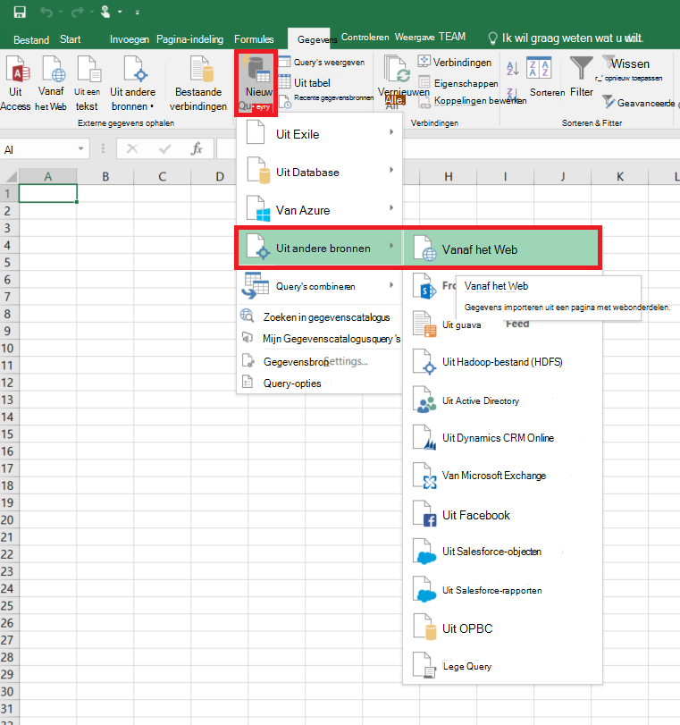
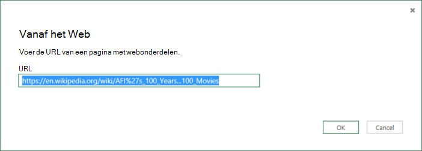
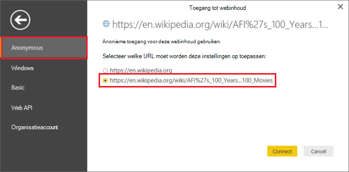
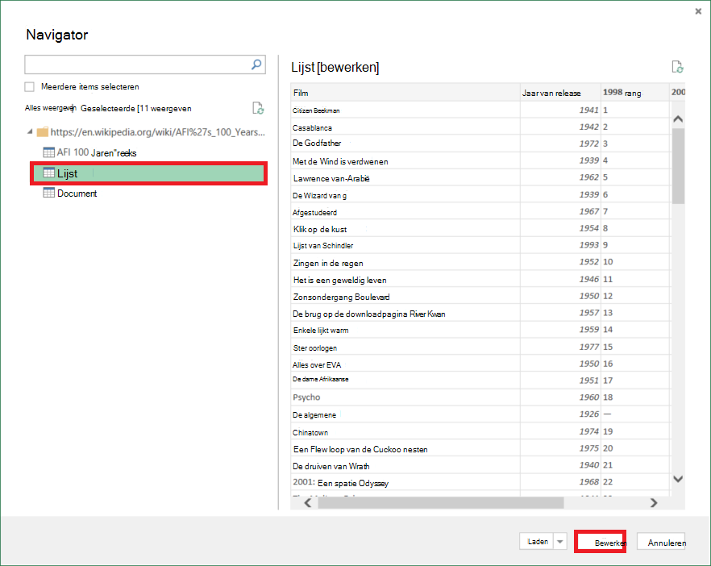
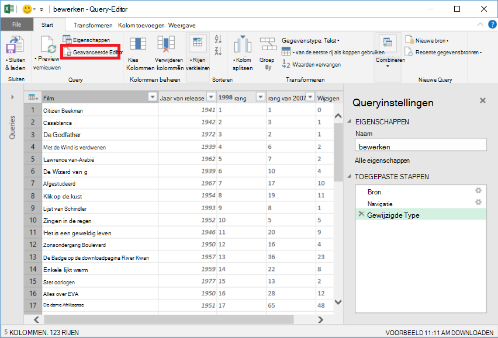
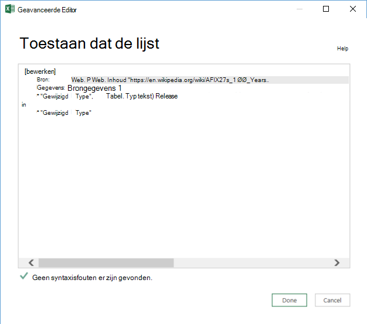

<properties 
    pageTitle="Verplaats gegevens van Webtabel | Azure gegevens Factory" 
    description="Meer informatie over het verplaatsen van gegevens vanuit on-premises een tabel in een webpagina met Azure gegevens Factory." 
    services="data-factory" 
    documentationCenter="" 
    authors="linda33wj" 
    manager="jhubbard" 
    editor="monicar"/>

<tags 
    ms.service="data-factory" 
    ms.workload="data-services" 
    ms.tgt_pltfrm="na" 
    ms.devlang="na" 
    ms.topic="article" 
    ms.date="09/26/2016" 
    ms.author="jingwang"/>

# Verplaats gegevens van een Web tabelbron Azure gegevens Factory gebruiken
In dit artikel wordt beschreven hoe u kunt de activiteit kopiëren in een fabriek Azure gegevens gegevens uit een tabel in een webpagina kopiëren naar een andere gegevensopslag. In dit artikel is gebaseerd op het artikel [gegevens verkeer activiteiten](data-factory-data-movement-activities.md) , waarbij een een algemeen overzicht van de verplaatsing van gegevens met kopie activiteit en ondersteunde store combinaties wordt weergegeven.

Gegevens factory ondersteunt momenteel alleen zwevend gegevens uit een webtabel naar andere winkels gegevens, maar niet verplaatsen van gegevens uit andere winkels aan een Web tabel bestemming.

> [AZURE.NOTE] Deze Web-connector ondersteunt momenteel alleen uitgepakt tabelinhoud van een HTML-pagina.

## Voorbeeld: Gegevens uit Webtabel naar Azure Blob kopiëren

In het onderstaande voorbeeld ziet:

1.  Een gekoppelde service van het type [Web](#web-linked-service-properties).
2.  Een gekoppelde service van het type [AzureStorage](data-factory-azure-blob-connector.md#azure-storage-linked-service-properties).
3.  Een invoer [dataset](data-factory-create-datasets.md) van het type [WebTable](#WebTable-dataset-properties).
4.  Een uitvoer [dataset](data-factory-create-datasets.md) van het type [AzureBlob](data-factory-azure-blob-connector.md#azure-blob-dataset-type-properties).
4.  Een [verkooppijplijn](data-factory-create-pipelines.md) met kopie activiteit die wordt gebruikt [WebSource](#websource-copy-activity-type-properties) en [BlobSink](data-factory-azure-blob-connector.md#azure-blob-copy-activity-type-properties).

De steekproef kopieert gegevens uit een webtabel naar een Azure blob per uur. De JSON-eigenschappen in deze voorbeelden gebruikt, worden beschreven in de secties in de voorbeelden te volgen. 

In het onderstaande voorbeeld ziet hoe u gegevens uit een webtabel naar een Azure blob kopiëren. Gegevens kunnen echter worden gekopieerd rechtstreeks naar een van de gootstenen vermeld in het artikel [Gegevens verkeer activiteiten](data-factory-data-movement-activities.md) met behulp van de activiteit kopiëren in fabriek van Azure-gegevens. 

**Web gekoppeld service** In dit voorbeeld wordt de webservice gekoppeld met anonieme verificatie. Zie sectie [Web gekoppelde service](#web-linked-service-properties) voor verschillende soorten verificatie die u kunt gebruiken. 

    {
        "name": "WebLinkedService",
        "properties":
        {
            "type": "Web",
            "typeProperties":
            {
                "authenticationType": "Anonymous",
                "url" : "https://en.wikipedia.org/wiki/"
            }
        }
    }

**Azure gekoppeld opslagservice**

    {
      "name": "AzureStorageLinkedService",
      "properties": {
        "type": "AzureStorage",
        "typeProperties": {
          "connectionString": "DefaultEndpointsProtocol=https;AccountName=<accountname>;AccountKey=<accountkey>"
        }
      }
    }

**WebTable invoer gegevensset** Als u **externe** op **true** , wordt de Data Factory-service geïnformeerd dat de gegevensset de fabriek gegevens buiten en is niet geproduceerd door een activiteit in de fabriek gegevens.

> [AZURE.NOTE] Zie de [index van een tabel in een HTML-pagina krijgen](#get-index-of-a-table-in-an-html-page) sectie voor stapsgewijze instructies voor het ophalen van index van een tabel in een HTML-pagina.  

    
    {
        "name": "WebTableInput",
        "properties": {
            "type": "WebTable",
            "linkedServiceName": "WebLinkedService",
            "typeProperties": {
                "index": 1,
                "path": "AFI's_100_Years...100_Movies"
            },
            "external": true,
            "availability": {
                "frequency": "Hour",
                "interval":  1
            }
        }
    }

**Azure Blob uitvoer gegevensset**

Gegevens worden geschreven naar een nieuwe blob per uur (frequentie: uur, interval: 1). 

    {
        "name": "AzureBlobOutput",
        "properties":
        {
            "type": "AzureBlob",
            "linkedServiceName": "AzureStorageLinkedService",
            "typeProperties":
            {
                "folderPath": "adfgetstarted/Movies"
            },
            "availability":
            {
                "frequency": "Hour",
                "interval": 1
            }
        }
    }

**Pijplijn met activiteit kopiëren**

De pijplijn bevat de activiteit in een kopie die is geconfigureerd voor gebruik van de bovenstaande invoer en uitvoer gegevenssets en per uur is gepland. In de pijplijn JSON definitie, het type **bron** is ingesteld op **WebSource** en **sink** type is ingesteld op **BlobSink**. 

Zie [WebSource type eigenschappen](#websource-copy-activity-type-properties) voor de lijst met eigenschappen die worden ondersteund door de WebSource. 
    
    {  
        "name":"SamplePipeline",
        "properties":{  
        "start":"2014-06-01T18:00:00",
        "end":"2014-06-01T19:00:00",
        "description":"pipeline with copy activity",
        "activities":[  
          {
            "name": "WebTableToAzureBlob",
            "description": "Copy from a Web table to an Azure blob",
            "type": "Copy",
            "inputs": [
              {
                "name": "WebTableInput"
              }
            ],
            "outputs": [
              {
                "name": "AzureBlobOutput"
              }
            ],
            "typeProperties": {
              "source": {
                "type": "WebSource"
              },
              "sink": {
                "type": "BlobSink"
              }
            },
           "scheduler": {
              "frequency": "Hour",
              "interval": 1
            },
            "policy": {
              "concurrency": 1,
              "executionPriorityOrder": "OldestFirst",
              "retry": 0,
              "timeout": "01:00:00"
            }
          }
          ]
       }
    }

## Eigenschappen van de gekoppelde Service Web

De volgende tabel bevat een beschrijving voor de JSON-elementen die specifiek zijn voor de gekoppelde webservice.

| Eigenschap | Beschrijving | Vereist |
| -------- | ----------- | -------- | 
| type | De eigenschap type moet zijn ingesteld op: **Web** | Ja | 
| URL | URL voor de Web-bron | Ja |
| authenticationType | Anonieme of eenvoudige. | Ja |
| Gebruikersnaam | De gebruikersnaam voor basisverificatie. | Ja (voor basisverificatie)
| wachtwoord | Wachtwoord voor basisverificatie. | Ja (voor basisverificatie)

### Anonieme verificatie gebruikt

    {
        "name": "web",
        "properties":
        {
            "type": "Web",
            "typeProperties":
            {
                "authenticationType": "Anonymous",
                "url" : "https://en.wikipedia.org/wiki/"
            }
        }
    }

### Met behulp van basisverificatie
    
    {
        "name": "web",
        "properties":
        {
            "type": "Web",
            "typeProperties":
            {
                "authenticationType": "basic",
                "url" : "http://myit.mycompany.com/",
                "userName": "Administrator",
                "password": "password"
            }
        }
    }

## Eigenschappen van de gegevensset WebTable

Zie het artikel [gegevenssets maken](data-factory-create-datasets.md) voor een volledige lijst met secties en eigenschappen die beschikbaar zijn voor het definiëren van gegevenssets. Secties zoals structuur, beschikbaarheid en beleid van een gegevensset JSON lijken voor alle gegevensset typen (Azure SQL Azure blob, Azure tabel, enz.).

De sectie **typeProperties** verschilt voor elk type gegevensset en vindt u informatie over de locatie van de gegevens in de gegevensopslag. De sectie typeProperties voor dataset van het type **WebTable** heeft de volgende eigenschappen

Eigenschap | Beschrijving | Vereist
:-------- | :----------- | :--------
type    | type van de gegevensset. moet zijn ingesteld op **WebTable** | Ja
pad | Een relatieve URL naar de bron die de tabel bevat. | Nee. Wanneer het pad niet is opgegeven, wordt alleen de URL die zijn opgegeven in de definitie van de gekoppelde service wordt gebruikt. 
index | De index van de tabel in de resource. Zie de [index van een tabel in een HTML-pagina krijgen](#get-index-of-a-table-in-an-html-page) sectie voor stapsgewijze instructies voor het ophalen van index van een tabel in een HTML-pagina. | Ja

**Voorbeeld:**

    {
        "name": "WebTableInput",
        "properties": {
            "type": "WebTable",
            "linkedServiceName": "WebLinkedService",
            "typeProperties": {
                "index": 1,
                "path": "AFI's_100_Years...100_Movies"
            },
            "external": true,
            "availability": {
                "frequency": "Hour",
                "interval":  1
            }
        }
    }

## WebSource - kopie activiteit type eigenschappen

Zie het artikel [Pijpleidingen maken](data-factory-create-pipelines.md) voor een volledige lijst met secties en eigenschappen die beschikbaar zijn voor het definiëren van activiteiten. Eigenschappen zoals naam, beschrijving, invoer en uitvoer tabellen en beleid zijn beschikbaar voor alle typen activiteiten. 

Eigenschappen die beschikbaar zijn in de sectie typeProperties van de activiteit variëren echter met elk activiteitstype. Ze varieert afhankelijk van de soorten bronnen en sinks voor een activiteit kopiëren.

Geen extra eigenschappen worden momenteel ondersteund wanneer de bron van de activiteit van de kopie van het type **WebSource**. 

## Index van een tabel in een HTML-pagina ophalen

1. Starten van **Excel 2016** en Ga naar het tabblad **gegevens** .  
2. Klik op **Nieuwe Query** op de werkbalk, wijst u **Uit een andere bron** en klik op **Van Internet**.
    
     
3. Voer in het dialoogvenster **Van Internet** **URL** die u in gekoppelde service JSON gebruiken wilt (bijvoorbeeld: https://en.wikipedia.org/wiki/) samen met het pad dat u voor de gegevensset opgeven wilt (bijvoorbeeld: AFI % 27s_100_Years... 100_Movies), en klik op **OK**. 

     

    In dit voorbeeld gebruikt URL: https://en.wikipedia.org/wiki/AFI%27s_100_Years...100_Movies 
4.  Als u het dialoogvenster **Access-Web content** ziet, selecteert u de juiste **URL**, **verificatie**, en klik op **verbinding maken**. 

    
5.  Klik op een item van de **tabel** in de structuurweergave zien van de inhoud van de tabel en klik vervolgens op de knop **bewerken** onder.  

     

5. Klik op de knop **Geavanceerde Editor** op de werkbalk in het venster **Query-Editor** .

    

6. Klik in het dialoogvenster Geavanceerde Editor is het getal naast "Bron" de index.

     

Als u Excel 2013 gebruikt, gebruikt u [Microsoft Power Query voor Excel](https://www.microsoft.com/download/details.aspx?id=39379) om de index. Zie [verbinding maken met een webpagina](https://support.office.com/article/Connect-to-a-web-page-Power-Query-b2725d67-c9e8-43e6-a590-c0a175bd64d8) -artikel voor meer informatie. De stappen lijken als u [Microsoft Power BI voor bureaublad](https://powerbi.microsoft.com/desktop/)gebruikt. 

[AZURE.INCLUDE [data-factory-column-mapping](../../includes/data-factory-column-mapping.md)]

[AZURE.INCLUDE [data-factory-structure-for-rectangualr-datasets](../../includes/data-factory-structure-for-rectangualr-datasets.md)]

## Prestaties en optimaliseren  
Zie [kopie activiteit prestaties & handleiding optimaliseren](data-factory-copy-activity-performance.md) voor meer informatie over belangrijke factoren die invloed prestaties van gegevens verplaatsen (kopie activiteit) in Factory van Azure-gegevens en verschillende manieren optimaliseren.
