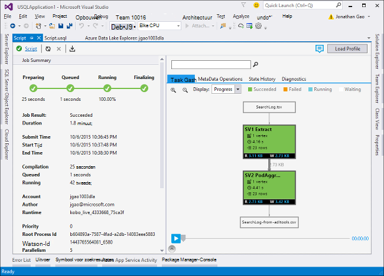

<properties
   pageTitle="I-SQL-scripts met Data Lake Tools voor Visual Studio ontwikkelen | Azure"
   description="Informatie over het installeren van Data Lake Tools voor Visual Studio, het ontwikkelen en U SQL-testscripts. "
   services="data-lake-analytics"
   documentationCenter=""
   authors="edmacauley"
   manager="jhubbard"
   editor="cgronlun"/>

<tags
   ms.service="data-lake-analytics"
   ms.devlang="na"
   ms.topic="get-started-article"
   ms.tgt_pltfrm="na"
   ms.workload="big-data"
   ms.date="05/16/2016"
   ms.author="edmaca"/>

# Zelfstudie: ontwikkelen I-SQL-scripts met Data Lake Tools voor Visual Studio

[AZURE.INCLUDE [get-started-selector](../../includes/data-lake-analytics-selector-get-started.md)]

Leer hoe u Data Lake Tools voor Visual Studio installeren en gebruiken van Data Lake Tools voor Visual Studio om te schrijven en test U-SQL-scripts.

I-SQL is een hyper-scalable, ten zeerste extensible taal voor het voorbereiden, transformeren en analyseren van alle gegevens in het meer gegevens en voorbij. Zie U SQL verwijzing (http://go.microsoft.com/fwlink/p/?LinkId=691348) voor meer informatie.

##Vereisten voor

- **Visual Studio-2015, Visual Studio 2013 bijwerken 4 of Visual Studio 2012. Enterprise (Ultimate/Premium), Professional, Community edities worden ondersteund. Express edition wordt niet ondersteund. Visual Studio "15" wordt momenteel niet ondersteund en we werken aan die.**
- **Microsoft Azure SDK voor .NET versie 2.7.1 of hoger**.  Installeren met behulp van het [installatieprogramma van de Web-platform](http://www.microsoft.com/web/downloads/platform.aspx).
- **[Gegevens Lake Tools voor Visual Studio](http://aka.ms/adltoolsvs)**.

    Wanneer Data Lake Tools voor Visual Studio is geïnstalleerd, ziet u een knooppunt "Gegevens Lake Analytics" in Server Explorer onder het knooppunt "Azure" is (u kunt Server explorer openen door op Ctrl + Alt + S te drukken).

- **Ga via de volgende twee secties aan [aan de slag met Azure gegevens Lake analyses met Azure-portal](data-lake-analytics-get-started-portal.md)**.

    - [Een Azure gegevens Lake Analytics-account maken](data-lake-analytics-get-started-portal.md#create_adl_analytics_account).
    - [SearchLog.tsv uploaden naar het standaardaccount voor gegevensopslag Lake](data-lake-analytics-get-started-portal.md#update-data-to-the-default-adl-storage-account).

    U het uitkomt, een PowerShell-voorbeeldscript voor het maken van een gegevens Lake analytische service en gegevens bronbestand uploaden vindt u in [de steekproef Appx-A PowerShell voor het voorbereiden van de zelfstudie](data-lake-analytics-data-lake-tools-get-started.md#appx-a-powershell-sample-for-preparing-the-tutorial).

    De hulpmiddelen voor gegevens Lake biedt geen ondersteuning maken gegevens Lake Analytics-accounts. U hoeft dus te maken met behulp van de Azure-portal Azure PowerShell, .NET SDK of Azure CLI. Als u wilt een taak gegevens Lake analyses uitvoeren, moet u enkele gegevens. Hoewel de hulpmiddelen voor gegevens Lake uploaden gegevens ondersteunt, kunt u de portal wilt gebruiken voor het uploaden van de voorbeeldgegevens om deze zelfstudie te vereenvoudigen kunt volgen.

## Verbinding maken met Azure

**Verbinding maken met gegevens Lake Analytics**

1. Open Visual Studio.
2. Klik op het menu **Beeld** op **Server Explorer** om te Server Explorer openen. Of druk op **[CTRL] + [ALT] + S**.
3. Met de rechtermuisknop op **Azure**op "Verbinding naar Microsoft Azure abonnement" en volg de instructies.
4. Vouw **Azure**in **Server Explorer**en vouwt u **Gegevens Lake Analytics**. Er wordt een lijst met uw gegevens Lake Analytics-accounts als er een. U kunt gegevens Lake Analytics-accounts maken van Visual Studio. Zie [aan de slag met Azure gegevens Lake analyses met Azure-portal](data-lake-analytics-get-started-portal.md) of [Aan de slag met Azure gegevens Lake Analytics via Azure PowerShell](data-lake-analytics-get-started-powershell.md)een account maken.

## Bronbestanden voor gegevens uploaden

U kunt bepaalde gegevens in de **vereiste** sectie hebt geüpload eerder in deze zelfstudie.  

Als u uw eigen gegevens gebruikt wilt, worden hier de procedures voor het uploaden van gegevens uit de hulpmiddelen voor gegevens Lake.

**Bestanden uploaden naar de afhankelijke Azure gegevens Lake-account**

1. Vanuit **Server Explorer**, **Azure**uitvouwen, **Gegevens Lake Analytics**uitvouwen, vouw van uw gegevens Lake Analytics-account en **Opslag Accounts**uit. Er wordt het standaardaccount Lake gegevensopslag, en de gekoppelde Lake gegevensopslag-accounts en de gekoppelde Azure Storage-accounts. Het standaardaccount voor gegevens Lake heeft een label "Standaardaccount opslag".
2. Met de rechtermuisknop op het standaardaccount voor gegevensopslag Lake en klik vervolgens op **Explorer**.  De hulpmiddelen voor gegevens Lake voor Visual Studio Explorer-venster wordt geopend.  Aan de linkerkant geeft deze een structuurweergave, dat de inhoudsweergave is aan de rechterkant.
3. Blader naar de map waarnaar u wilt uploaden van bestanden,
4. Met de rechtermuisknop op een lege ruimte en klik op **uploaden**.

    

**Bestanden uploaden naar een gekoppelde Azure Blob storage-account**

1. Vanuit **Server Explorer**, **Azure**uitvouwen, **Gegevens Lake Analytics**uitvouwen, vouw van uw gegevens Lake Analytics-account en **Opslag Accounts**uit. Er wordt het standaardaccount Lake gegevensopslag, en de gekoppelde Lake gegevensopslag-accounts en de gekoppelde Azure Storage-accounts.
2. Vouw de opslag van Azure-Account.
3. Met de rechtermuisknop op de container waarnaar u wilt uploaden van bestanden en klik vervolgens op **Explorer**. Als u een container niet hebt, moet u eerst een met de portal van Azure Azure PowerShell of andere hulpprogramma's voor maken.
4. Blader naar de map waar u wilt uploaden van bestanden,
5. Met de rechtermuisknop op een lege ruimte en klik op **uploaden**.

## I-SQL-scripts ontwikkelen

De gegevens Lake Analytics-taken zijn in de I-SQL-taal geschreven. Zie [aan de slag met I-SQL-taal](data-lake-analytics-u-sql-get-started.md) en [I-SQL-Naslaggids](http://go.microsoft.com/fwlink/?LinkId=691348)meer informatie over het I-SQL.

**Maken en indienen van een taak gegevens Lake Analytics**

1. Klik in het menu **bestand** op **Nieuw**en klik vervolgens op **Project**.
2. Selecteer het type **Project I-SQL** .

    

3. Klik op **OK**. Een oplossing maakt in Visual studio met een **Script.usql** -bestand.
4. Voer de volgende script in **Script.usql**:

        @searchlog =
            EXTRACT UserId          int,
                    Start           DateTime,
                    Region          string,
                    Query           string,
                    Duration        int?,
                    Urls            string,
                    ClickedUrls     string
            FROM "/Samples/Data/SearchLog.tsv"
            USING Extractors.Tsv();

        @res =
            SELECT *
            FROM @searchlog;        

        OUTPUT @res   
            TO "/Output/SearchLog-from-Data-Lake.csv"
        USING Outputters.Csv();

    Deze I-SQL-script leest het bronbestand van de gegevens met **Extractors.Tsv()**en maakt vervolgens een CSV-bestand met **Outputters.Csv()**.

    De twee paden niet worden gewijzigd, tenzij u het bronbestand gekopieerd naar een andere locatie.  Gegevens Lake Analytics maakt de uitvoermap als deze niet bestaat.

    Het is eenvoudiger relatieve paden gebruiken voor bestanden die zijn opgeslagen in standaardprogramma gegevens Lake accounts. U kunt ook absolute paden gebruiken.  Bijvoorbeeld

        adl://<Data LakeStorageAccountName>.azuredatalakestore.net:443/Samples/Data/SearchLog.tsv

    U moet absolute paden gebruiken voor toegang tot bestanden in gekoppelde opslag-accounts.  De syntaxis voor bestanden die zijn opgeslagen in de gekoppelde opslag van Azure-account is:

        wasb://<BlobContainerName>@<StorageAccountName>.blob.core.windows.net/Samples/Data/SearchLog.tsv

    >[AZURE.NOTE] Azure Blob container met openbare BLOB's of openbare containers toegangsmachtigingen worden momenteel niet ondersteund.  

    Let op de volgende functies:

    - **IntelliSense**

        Automatische voltooid en de leden worden weergegeven voor rijenset, klassen, Databases, schema's maken en de gebruiker gedefinieerde objecten (UDOs).

        IntelliSense voor catalogus entiteiten (Databases, schema's, tabellen, UDOs enzovoort) is gerelateerd aan uw account berekeningscluster. U kunt controleren van de huidige actieve berekeningscluster-account, de database en het schema in de bovenste werkbalk en schakel deze via de vervolgkeuzelijsten.

    - *Kolommen *uitvouwen***

        Klik op rechts van *, wordt er een blauwe lijn wordt weergegeven onder de *. Plaats de muisaanwijzer op de blauwe onderstreping de muisaanwijzer en klik vervolgens op de pijl-omlaag.
        

        **Kolommen uitvouwen**, klikt u op het hulpmiddel wordt vervangen door de * met de kolomnamen.

    - **Automatisch opmaken**

        Gebruikers kunnen de inspringing wijzigen van het I-SQL-script op basis van de code-structuur onder bewerken > Geavanceerd:

        - Indeling Document (Ctrl + E, D): Het gehele document opmaakt   
        - De selectie opmaken (Ctrl + k drukken, Ctrl + F): Wordt de selectie. Als er geen selectie is gemaakt, indelingen deze sneltoets de lijn die de cursor zich bevindt.  

        Alle opmaak regels worden geconfigureerd onder hulpmiddelen voor -> Opties -> tekst Editor - > SIP -> opmaak.  
    - **Slim inspringing**

        Hulpmiddelen voor gegevens Lake voor Visual Studio kan expressies automatisch laten inspringen terwijl u scripts schrijft. Deze functie is standaard uitgeschakeld, gebruikers moeten deze inschakelen via het controleren van de I-SQL -> Opties en instellingen -> schakelopties -> inschakelen Smart laten inspringen.

    - **Ga naar de definitie en alle verwijzingen zoeken**

        Met de rechtermuisknop op de naam van een enzovoort rijenset/parameter/kolom/UDO en te klikken op Ga naar definitie (F12) kunt u navigeren naar de definitie. Door te klikken op alle verwijzingen zoeken (Shift + F12), ziet alle verwijzingen zijn.

    - **Azure pad invoegen**

        In plaats van Azure bestandspad en type onthouden u deze handmatig bij het schrijven van script, Data Lake Tools voor Visual Studio een eenvoudige manier: klik met de rechtermuisknop in de editor, klikt u op Azure pad invoegen. Ga naar het bestand in het dialoogvenster Azure Blob Browser. Klik op **OK**. het bestandspad wordt ingevoegd aan uw code.

5. Geef de gegevens Lake Analytics-account, Database, en het Schema. U kunt selecteren **(lokaal)** lokaal het script uitvoeren voor het testen doel. Zie [Uitvoeren I-SQL lokaal](#run-u-sql-locally)voor meer informatie.

    

    Zie voor meer informatie, [Gebruik U-SQL-catalogus](data-lake-analytics-use-u-sql-catalog.md).

5. Met de rechtermuisknop op **Script.usql**vanuit **Solution Explorer**, en klik op **Script maken**. Controleer of het resultaat in het deelvenster Uitvoer.
6. Met de rechtermuisknop op **Script.usql**vanuit **Solution Explorer**, en klik op **Script indienen**. (Optioneel) u kunt ook klikken op **verzenden** vanuit Script.usql deelvenster.  Zie de vorige schermafbeelding.  Klik op de pijl-omlaag naast de knop verzenden om in te dienen met de volgende opties:
7. Geef **De naam van de taak**, Controleer of het **Analytics-Account**en klik vervolgens op **verzenden**. Resultaten van indienen en taakkoppeling zijn beschikbaar in de hulpmiddelen voor gegevens Lake voor Visual Studio, resulteert dit venster wanneer de indiening is voltooid.

    

8. U moet deze op de knop Vernieuwen om te zien van de meest recente taakstatus en het scherm vernieuwen. Wanneer de uitkomsten taak deze ziet u de **Taak Graph**, **Gegevensbewerkingen metagegevens**, **Staat geschiedenis**, **diagnostische hulpprogramma's**:

    

    * Taakoverzicht van de. De samenvatting van de gegevens van huidige taak, bijvoorbeeld weergeven: staat, voortgang, tijd, de naam van de Runtime, Inzender enzovoort.   
    * Taakdetails. Gedetailleerde informatie over deze taak is opgegeven, met inbegrip van script, resource, hoekpunt Execution weergave.
    * Grafiek van de taak. Vier grafieken worden verstrekt kunt visualiseren van het project-informatie: voortgang, gegevens lezen, gegevens geschreven, tijd, gemiddelde verwerkingstijd Per knooppunt, invoer doorvoer, uitvoer doorvoer.
    * Metagegevens bewerkingen. Alle bewerkingen in de metagegevens worden weergegeven.
    * Provinciale geschiedenis.
    * Diagnostische gegevens. Hulpmiddelen voor gegevens Lake voor Visual Studio wordt automatisch diagnose stellen bij taak kan worden uitgevoerd. U ontvangt waarschuwingen wanneer er enkele fouten of prestatieproblemen in hun taken zijn. Zie de functie diagnostische gegevens (koppeling TBD) deel voor meer informatie.

**Taakstatus controleren**

1. Van Server Explorer **Azure**uitvouwen, **Gegevens Lake Analytics**uitvouwen, de accountnaam gegevens Lake Analytics uitvouwen
2. Dubbelklik op **taken** u kunt de taken.
2. Klik op een taak als u wilt zien van de status.

**Om de uitvoer van de taak weer te geven**

1. Van **Server Explorer** **Azure**uitvouwen, **Gegevens Lake Analytics**uitvouwen, uitvouwen van uw gegevens Lake Analytics-account, **Opslag Accounts**uitvouwen, met de rechtermuisknop op het standaardaccount voor gegevensopslag Lake, en klik op **Explorer**.
2.  Dubbelklik op **uitvoer** om de map te openen
3.  Dubbelklik op **SearchLog-van-adltools.csv**.

###Taak afspelen

Taak afspelen kunt u bekijken van de uitvoering van de taak en visueel detecteren afwijkingen van de prestaties en knelpunten. Deze functie kan worden gebruikt voordat de taak is voltooid worden uitgevoerd (dat wil zeggen tijdens de tijd die de taak actief wordt uitgevoerd), evenals nadat de uitvoering is voltooid. Afspelen tijdens de taakuitvoering te doen, kan de gebruiker om af te spelen de voortgang snel aan de huidige tijd.

**Uitvoering van de taak weergeven**  

1. Klik op **Profiel laden** in de rechterbovenhoek op. Zie de vorige schermopname.
2. Klik op de knop afspelen in de linkerbenedenhoek te bekijken van de voortgang van taak kan worden uitgevoerd.
3. Tijdens het afspelen, klikt u op **onderbreken** om te stoppen of rechtstreeks naar de voortgangsbalk voor specifieke posities.

###Heatmap

Data Lake Tools voor Visual Studio biedt kleur-overlays gebruiker te selecteren in Project-weergave om aan te geven voortgang, gegevens I/O, tijd, i/o-doorvoer van elke fase. Via deze, kunnen gebruikers duidelijk potentiële problemen- en distributiegroepen van taakeigenschappen rechtstreeks en intuïtief. U kunt een gegevensbron moet worden weergegeven in de vervolgkeuzelijst.  

## I-SQL lokaal uitvoeren

De I-SQL-lokale ervaring worden uitgevoerd in Visual Studio gebruikt, kunt u het volgende doen:

- I-SQL-scripts lokaal, samen met C# stroombaan uitvoeren.
- Fouten opsporen in C# stroombaan lokaal.
- Lokale databases/verwijderen/weergave maken, stroombaan, schema's en tabellen in Server Explorer net zoals u kunnen doen voor Azure gegevens Lake Analytics-service.

Ziet u een *lokale* account in Visual Studio en het installatieprogramma maakt een *DataRoot* map *C:\LocalRunRoot*bevindt. De map DataRoot wordt gebruikt:

- Store-metagegevens inclusief tabellen, DBs, TVFs, enzovoort.
- Voor een bepaalde script: als een relatief pad wordt verwezen in invoer/uitvoer paden, gaan we van de DataRoot (evenals van het script pad als de it bevindt zich input)
- De map DataRoot wordt niet worden verwezen als u probeert te registreren van een constructie en gebruiken van een relatief pad (Zie "stroombaan gebruiken bij het maken van lokale uitvoeren" onderdeel voor meer informatie)

De volgende video ziet u de functie I-SQL lokale uitvoeren:

>[AZURE.VIDEO usql-localrun]

### Bekende problemen en beperkingen

- Geen tabel/DB enzovoort niet maken in Server Explorer voor de lokale account.
- Wanneer een relatief pad wordt verwezen:

    - In script invoer (EXTRAHEREN * FROM "/ pad/abc")-zowel het pad DataRoot als het scriptpad wordt gezocht.
    - In script-uitvoer (uitvoer naar "pad/abc"): het pad DataRoot worden gebruikt als de uitvoermap.
    - In constructie registratie (constructie maken xyz uit "/ pad/abc"): het scriptpad wordt gezocht, maar niet de DataRoot.
    - Geregistreerd TVF/weergave of andere metagegevens entiteiten: het pad DataRoot wordt gezocht, maar niet het scriptpad.

    Op gegevens Lake service uitgevoerd voor scripts, het standaardaccount voor de opslag wordt gebruikt als de hoofdmap en hiervan wordt gezocht.

### Lokaal I-SQL-scripts testen
Zie voor instructies over het ontwikkelen van I-SQL-scripts, [ontwikkelen I-SQL-scripts](#develop-and-test-u-sql-scripts). Maken en uitvoeren van de I-SQL scripts lokaal, selecteer **(lokaal)** in de vervolgkeuzelijst cluster en klik vervolgens op **verzenden**. Controleer of u de juiste gegevens waarnaar wordt verwezen - hetzij verwijzen naar het volledige pad of de gegevens onder de map DataRoot plaatsen.

U kunt ook met de rechtermuisknop op een script en klik vervolgens op **Lokale plannen uitvoeren** in het contextmenu of druk op **CTRL + F5** op trigger lokaal uitvoeren.

### Stroombaan gebruiken in lokale uitvoeren

Er zijn twee manieren om uit te voeren van de aangepaste C#-bestanden:

- Stroombaan schrijven in de code achter bestand en de stroombaan wordt automatisch worden geregistreerd en worden verwijderd wanneer het script klaar is.
- Een project C# constructie maken en de uitvoer dll naar de lokale account via een script zoals hieronder registreren. Houd er rekening mee dat het pad relatief ten opzichte van het script in plaats van de map DataRoot is.

### Fouten opsporen in scripts en C# samenstellen lokaal

U kunt C# stroombaan foutopsporing zonder indienen en deze naar de Azure gegevens Lake Analytics-Service registreren. U kunt onderbrekingspunten instellen in zowel de code achter bestand en in een waarnaar wordt verwezen C#-project.

**Voor foutopsporing lokale code in code achter bestand**
1.  Onderbrekingspunten instellen in de code achter bestand.
2.  Druk op **F5** om op te lossen het script lokaal.

De volgende procedure werkt alleen in Visual Studio-2015. Mogelijk moet u handmatig toevoegen de pdb-bestanden in oudere Visual Studio.

**Voor foutopsporing lokale code in een waarnaar wordt verwezen C#-project**
1.  Een project C# constructie maken en dit om te genereren van de uitvoer-dll.
2.  De dll met een I-SQL-instructie hebt geregistreerd:

        CREATE ASSEMBLY assemblyname FROM @"..\..\path\to\output\.dll";
3.  Onderbrekingspunten instellen in de C#-code.
4.  Druk op **F5** om te verwijzen naar de C#-dll lokaal voor het script foutopsporing.  

##Zie ook

Als u wilt beginnen met gegevens Lake analyses met verschillende hulpmiddelen, raadpleegt u:

- [Aan de slag met gegevens Lake analyses met behulp van Azure portal](data-lake-analytics-get-started-portal.md)
- [Aan de slag met gegevens Lake Analytics via Azure PowerShell](data-lake-analytics-get-started-powershell.md)
- [Aan de slag met gegevens Lake analyses met .NET SDK](data-lake-analytics-get-started-net-sdk.md)
- [Fouten opsporen in C#-code in I-SQL-taken](data-lake-analytics-debug-u-sql-jobs.md)

Bekijk meer ontwikkeling onderwerpen:

- [Gebruik van gegevens Lake Analytics weblogs analyseren](data-lake-analytics-analyze-weblogs.md)
- [I-SQL-scripts met Data Lake Tools voor Visual Studio ontwikkelen](data-lake-analytics-data-lake-tools-get-started.md)
- [Aan de slag met Azure gegevens Lake Analytics U SQL-taal](data-lake-analytics-u-sql-get-started.md)
- [I-SQL door de gebruiker gedefinieerde operatoren voor taken van de gegevens Lake analyses ontwikkelen](data-lake-analytics-u-sql-develop-user-defined-operators.md)

##Voorbeeld van de toepassingX-A PowerShell voor het voorbereiden van de zelfstudie

Het volgende PowerShell-script bereidt een Azure gegevens Lake Analytics-account en de brongegevens voor u, zodat u verder met het [ontwikkelen van I-SQL-scripts](data-lake-analytics-data-lake-tools-get-started.md#develop-u-sql-scripts).

    #region - used for creating Azure service names
    $nameToken = "<Enter an alias>"
    $namePrefix = $nameToken.ToLower() + (Get-Date -Format "MMdd")
    #endregion

    #region - service names
    $resourceGroupName = $namePrefix + "rg"
    $dataLakeStoreName = $namePrefix + "adas"
    $dataLakeAnalyticsName = $namePrefix + "adla"
    $location = "East US 2"
    #endregion

    # Treat all errors as terminating
    $ErrorActionPreference = "Stop"

    #region - Connect to Azure subscription
    Write-Host "`nConnecting to your Azure subscription ..." -ForegroundColor Green
    try{Get-AzureRmContext}
    catch{Login-AzureRmAccount}
    #endregion

    #region - Create an Azure Data Lake Analytics service account
    Write-Host "Create a resource group ..." -ForegroundColor Green
    New-AzureRmResourceGroup `
        -Name  $resourceGroupName `
        -Location $location

    Write-Host "Create a Data Lake account ..."  -ForegroundColor Green
    New-AzureRmDataLakeStoreAccount `
        -ResourceGroupName $resourceGroupName `
        -Name $dataLakeStoreName `
        -Location $location

    Write-Host "Create a Data Lake Analytics account ..."  -ForegroundColor Green
    New-AzureRmDataLakeAnalyticsAccount `
        -Name $dataLakeAnalyticsName `
        -ResourceGroupName $resourceGroupName `
        -Location $location `
        -DefaultDataLake $dataLakeStoreName

    Write-Host "The newly created Data Lake Analytics account ..."  -ForegroundColor Green
    Get-AzureRmDataLakeAnalyticsAccount `
        -ResourceGroupName $resourceGroupName `
        -Name $dataLakeAnalyticsName  
    #endregion

    #region - prepare the source data
    Write-Host "Import the source data ..."  -ForegroundColor Green
    $localFolder = "C:\Tutorials\Downloads\" # A temp location for the file.
    $storageAccount = "adltutorials"  # Don't modify this value.
    $container = "adls-sample-data"  #Don't modify this value.

    # Create the temp location  
    New-Item -Path $localFolder -ItemType Directory -Force

    # Download the sample file from Azure Blob storage
    $context = New-AzureStorageContext -StorageAccountName $storageAccount -Anonymous
    $blobs = Azure\Get-AzureStorageBlob -Container $container -Context $context
    $blobs | Get-AzureStorageBlobContent -Context $context -Destination $localFolder

    # Upload the file to the default Data Lake Store account    
    Import-AzureRmDataLakeStoreItem -AccountName $dataLakeStoreName -Path $localFolder"SearchLog.tsv" -Destination "/Samples/Data/SearchLog.tsv"

    Write-Host "List the source data ..."  -ForegroundColor Green
    Get-AzureRmDataLakeStoreChildItem -Account $dataLakeStoreName -Path  "/Samples/Data/"
    #endregion
