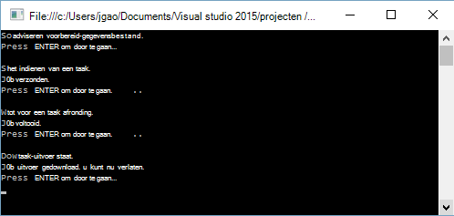

<properties 
   pageTitle="Aan de slag met Azure gegevens Lake analyses met .NET SDK | Azure" 
   description="Informatie over het gebruik van de .NET SDK te Lake gegevensopslag-accounts maken, maakt u gegevens Lake Analytics-taken en taken die zijn geschreven in I-SQL. " 
   services="data-lake-analytics" 
   documentationCenter="" 
   authors="edmacauley" 
   manager="jhubbard" 
   editor="cgronlun"/>
 
<tags
   ms.service="data-lake-analytics"
   ms.devlang="na"
   ms.topic="hero-article"
   ms.tgt_pltfrm="na"
   ms.workload="big-data" 
   ms.date="10/26/2016"
   ms.author="edmaca"/>

# Zelfstudie: aan de slag met Azure gegevens Lake analyses met .NET SDK

[AZURE.INCLUDE [get-started-selector](../../includes/data-lake-analytics-selector-get-started.md)]

Informatie over het gebruik van de Azure .NET SDK taken in [I-SQL](data-lake-analytics-u-sql-get-started.md) naar gegevens Lake Analytics geschreven. Zie [overzicht van de Azure gegevens Lake Analytics](data-lake-analytics-overview.md)voor meer informatie over gegevens Lake Analytics.

In deze zelfstudie wordt u een C#-console-toepassing om in te dienen een I-SQL-taak die een tabblad leest gescheiden waarden ()-bestand en zet deze in een bestand met door komma's gescheiden waarden (CSV) ontwikkelen. Ga via de dezelfde zelfstudie met andere ondersteunde hulpprogramma's, te klikken op de tabbladen boven aan dit artikel.

##Vereisten voor

Voordat u deze zelfstudie begint, hebt u het volgende:

- **Visual Studio-2015, Visual Studio 2013 4, of Visual Studio 2012 met visuele C++ geïnstalleerd bijwerken**.
- **Microsoft Azure SDK voor .NET versie 2.5 of hoger**.  Installeren met behulp van het [installatieprogramma van de Web-platform](http://www.microsoft.com/web/downloads/platform.aspx).
- **Een Azure gegevens Lake Analytics-account**. Zie [Beheren gegevens Lake analyses met behulp van Azure .NET SDK](data-lake-analytics-manage-use-dotnet-sdk.md).

##Consoletoepassing maken

In deze zelfstudie kunt u sommige logboeken zoeken verwerken.  Het logboek zoeken kan worden opgeslagen in gegevens Lake store of Azure-blobopslag. 

Een voorbeeld van zoeken logboek vindt u in een openbare Azure Blob container. Klik in de toepassing u kunt u het bestand downloaden naar uw werkstation, en klikt u vervolgens het bestand uploaden naar het standaardaccount voor gegevensopslag Lake van uw gegevens Lake Analytics-account.

**Een I-SQL-script maken**

Gegevens Lake Analytics taken zijn in de I-SQL-taal geschreven. Zie [aan de slag met I-SQL-taal](data-lake-analytics-u-sql-get-started.md) en [I-SQL-Naslaggids](http://go.microsoft.com/fwlink/?LinkId=691348)meer informatie over het I-SQL.

Maak een **SampleUSQLScript.txt** -bestand met het volgende I-SQL-script en plaats het bestand in de **C:\temp\* * pad.  Het pad is vastgelegde in de .NET-toepassing die u in de volgende procedure maakt.  

    @searchlog =
        EXTRACT UserId          int,
                Start           DateTime,
                Region          string,
                Query           string,
                Duration        int?,
                Urls            string,
                ClickedUrls     string
        FROM "/Samples/Data/SearchLog.tsv"
        USING Extractors.Tsv();
    
    OUTPUT @searchlog   
        TO "/Output/SearchLog-from-Data-Lake.csv"
    USING Outputters.Csv();

Deze I-SQL-script leest het bronbestand van de gegevens met **Extractors.Tsv()**en maakt vervolgens een CSV-bestand met **Outputters.Csv()**. 

In de C#-programma moet u het bestand **/Samples/Data/SearchLog.tsv** en de map **/Output/** voorbereiden.    

Het is eenvoudiger relatieve paden gebruiken voor bestanden die zijn opgeslagen in standaardprogramma gegevens Lake accounts. U kunt ook absolute paden gebruiken.  Bijvoorbeeld 

    adl://<Data LakeStorageAccountName>.azuredatalakestore.net:443/Samples/Data/SearchLog.tsv
    
U moet absolute paden gebruiken voor toegang tot bestanden in gekoppelde opslag-accounts.  De syntaxis voor bestanden die zijn opgeslagen in de gekoppelde opslag van Azure-account is:

    wasb://<BlobContainerName>@<StorageAccountName>.blob.core.windows.net/Samples/Data/SearchLog.tsv

>[AZURE.NOTE] Er is momenteel een bekend probleem bij het Azure-gegevensservice Lake.  Als de voorbeeld-app wordt onderbroken of een fout optreedt, moet u mogelijk de Lake gegevensopslag & gegevens Lake Analytics-accounts die het script wordt gemaakt handmatig verwijderen.  Als u niet bekend met de portal van Azure bent, krijgt de handleiding voor het [beheren van Azure gegevens Lake analyses met behulp van Azure portal](data-lake-analytics-manage-use-portal.md) u te helpen.       

**Een toepassing maken**

1. Open Visual Studio.
2. Maak een C#-console-toepassing.
3. Open de beheerconsole van NuGet-pakket en voer de volgende opdrachten:

        Install-Package Microsoft.Azure.Management.DataLake.Analytics -Pre
        Install-Package Microsoft.Azure.Management.DataLake.Store -Pre
        Install-Package Microsoft.Azure.Management.DataLake.StoreUploader -Pre
        Install-Package Microsoft.Rest.ClientRuntime.Azure.Authentication -Pre
        Install-Package WindowsAzure.Storage

       
5. Program.cs, plak de volgende code:

        using System;
        using System.IO;
        using System.Collections.Generic;
        using System.Threading;
        using Microsoft.Rest;
        using Microsoft.Rest.Azure.Authentication;
        using Microsoft.Azure.Management.DataLake.Store;
        using Microsoft.Azure.Management.DataLake.StoreUploader;
        using Microsoft.Azure.Management.DataLake.Analytics;
        using Microsoft.Azure.Management.DataLake.Analytics.Models;
        using Microsoft.WindowsAzure.Storage.Blob;

        namespace SdkSample
        {
          class Program
          {
            private const string SUBSCRIPTIONID = "<Enter Your Azure Subscription ID>";
            private const string CLIENTID = "1950a258-227b-4e31-a9cf-717495945fc2";
            private const string DOMAINNAME = "common"; // Replace this string with the user's Azure Active Directory tenant ID or domain name, if needed.

            private static string _adlaAccountName = "<Enter an Existing Data Lake Analytics Account Name>";
            private static string _adlsAccountName = "<Enter the default Data Lake Store Account Name>";

            private static DataLakeAnalyticsAccountManagementClient _adlaClient;
            private static DataLakeStoreFileSystemManagementClient _adlsFileSystemClient;
            private static DataLakeAnalyticsJobManagementClient _adlaJobClient;
        
            private static void Main(string[] args)
            {
                string localFolderPath = @"c:\temp\";

                // Connect to Azure
                var creds = AuthenticateAzure(DOMAINNAME, CLIENTID);

                SetupClients(creds, SUBSCRIPTIONID);

                // Transfer the source file from a public Azure Blob container to Data Lake Store.
                CloudBlockBlob blob = new CloudBlockBlob(new Uri("https://adltutorials.blob.core.windows.net/adls-sample-data/SearchLog.tsv"));
                blob.DownloadToFile(localFolderPath + "SearchLog.tsv", FileMode.Create); // from WASB
                UploadFile(localFolderPath + "SearchLog.tsv", "/Samples/Data/SearchLog.tsv"); // to ADLS
                WaitForNewline("Source data file prepared.", "Submitting a job.");

                // Submit the job
                Guid jobId = SubmitJobByPath(localFolderPath + "SampleUSQLScript.txt", "My First ADLA Job");
                WaitForNewline("Job submitted.", "Waiting for job completion.");

                // Wait for job completion
                WaitForJob(jobId);
                WaitForNewline("Job completed.", "Downloading job output.");

                // Download job output
                DownloadFile(@"/Output/SearchLog-from-Data-Lake.csv", localFolderPath + "SearchLog-from-Data-Lake.csv");
        
                WaitForNewline("Job output downloaded. You can now exit.");
            }
        
            public static ServiceClientCredentials AuthenticateAzure(
                string domainName,
                string nativeClientAppCLIENTID)
            {
                // User login via interactive popup
                SynchronizationContext.SetSynchronizationContext(new SynchronizationContext());
                // Use the client ID of an existing AAD "Native Client" application.
                var activeDirectoryClientSettings = ActiveDirectoryClientSettings.UsePromptOnly(nativeClientAppCLIENTID, new Uri("urn:ietf:wg:oauth:2.0:oob"));
                return UserTokenProvider.LoginWithPromptAsync(domainName, activeDirectoryClientSettings).Result;
            }

            public static void SetupClients(ServiceClientCredentials tokenCreds, string subscriptionId)
            {
                _adlaClient = new DataLakeAnalyticsAccountManagementClient(tokenCreds);
                _adlaClient.SubscriptionId = subscriptionId;

                _adlaJobClient = new DataLakeAnalyticsJobManagementClient(tokenCreds);

                _adlsFileSystemClient = new DataLakeStoreFileSystemManagementClient(tokenCreds);
            }

            public static void UploadFile(string srcFilePath, string destFilePath, bool force = true)
            {
                var parameters = new UploadParameters(srcFilePath, destFilePath, _adlsAccountName, isOverwrite: force);
                var frontend = new DataLakeStoreFrontEndAdapter(_adlsAccountName, _adlsFileSystemClient);
                var uploader = new DataLakeStoreUploader(parameters, frontend);
                uploader.Execute();
            }

            public static void DownloadFile(string srcPath, string destPath)
            {
                var stream = _adlsFileSystemClient.FileSystem.Open(_adlsAccountName, srcPath);
                var fileStream = new FileStream(destPath, FileMode.Create);

                stream.CopyTo(fileStream);
                fileStream.Close();
                stream.Close();
            }

            // Helper function to show status and wait for user input
            public static void WaitForNewline(string reason, string nextAction = "")
            {
                Console.WriteLine(reason + "\r\nPress ENTER to continue...");

                Console.ReadLine();

                if (!String.IsNullOrWhiteSpace(nextAction))
                    Console.WriteLine(nextAction);
            }

            // List all Data Lake Analytics accounts within the subscription
            public static List<DataLakeAnalyticsAccount> ListADLAAccounts()
            {
                var response = _adlaClient.Account.List();
                var accounts = new List<DataLakeAnalyticsAccount>(response);

                while (response.NextPageLink != null)
                {
                    response = _adlaClient.Account.ListNext(response.NextPageLink);
                    accounts.AddRange(response);
                }

                Console.WriteLine("You have %i Data Lake Analytics account(s).", accounts.Count);
                for (int i = 0; i < accounts.Count; i++)
                {
                    Console.WriteLine(accounts[i].Name);
                }

                return accounts;
            }
            public static Guid SubmitJobByPath(string scriptPath, string jobName)
            {
                var script = File.ReadAllText(scriptPath);

                var jobId = Guid.NewGuid();
                var properties = new USqlJobProperties(script);
                var parameters = new JobInformation(jobName, JobType.USql, properties, priority: 1, degreeOfParallelism: 1, jobId: jobId);
                var jobInfo = _adlaJobClient.Job.Create(_adlaAccountName, jobId, parameters);

                return jobId;
            }

            public static JobResult WaitForJob(Guid jobId)
            {
                var jobInfo = _adlaJobClient.Job.Get(_adlaAccountName, jobId);
                while (jobInfo.State != JobState.Ended)
                {
                    jobInfo = _adlaJobClient.Job.Get(_adlaAccountName, jobId);
                }
                return jobInfo.Result.Value;
            }
          }
        }

6. Druk op **F5** om de toepassing te starten. De uitvoer is vergelijkbaar met:

    

7. Controleer het uitvoerbestand.  De standaardnaam pad en de bestandsnaam is c:\Temp\SearchLog-from-Data-Lake.csv.

## Zie ook

- Klik op het tabblad-selectors boven aan de pagina overzicht van de dezelfde zelfstudie met een ander hulpprogramma.
- Een complexe query's, raadpleegt u [analyseren Website Logboeken door middel van Azure gegevens Lake analyses](data-lake-analytics-analyze-weblogs.md).
- Zie [ontwikkelen I--SQL-scripts met gegevens Lake Tools for Visual Studio](data-lake-analytics-data-lake-tools-get-started.md)om te beginnen ontwikkelen van toepassingen I-SQL.
- Zie [aan de slag met Azure gegevens Lake Analytics U SQL - taal](data-lake-analytics-u-sql-get-started.md)en [I-SQL-Naslaggids](http://go.microsoft.com/fwlink/?LinkId=691348)voor meer I-SQL.
- Zie [Azure gegevens Lake Analytics beheren met behulp van Azure portal](data-lake-analytics-manage-use-portal.md)voor beheertaken.
- Als u een overzicht van gegevens Lake analyses, Zie [overzicht van de Azure gegevens Lake Analytics](data-lake-analytics-overview.md).
