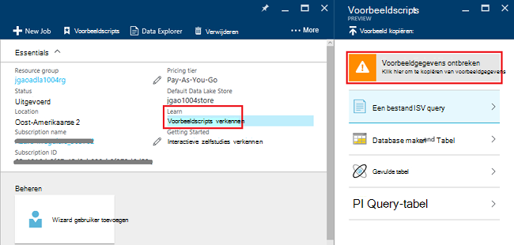
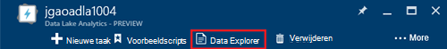
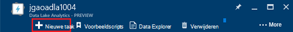
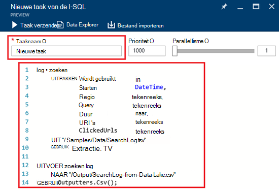
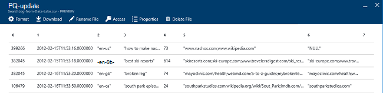

<properties 
   pageTitle="Aan de slag met Azure gegevens Lake analyses met behulp van Azure portal | Azure" 
   description="Informatie over het gebruik van de Azure-portal te maken van een gegevens Lake Analytics-account, maakt u een gegevens Lake Analytics-taak met I-SQL en de taak verstuurt. " 
   services="data-lake-analytics" 
   documentationCenter="" 
   authors="edmacauley" 
   manager="jhubbard" 
   editor="cgronlun"/>
 
<tags
   ms.service="data-lake-analytics"
   ms.devlang="na"
   ms.topic="hero-article"
   ms.tgt_pltfrm="na"
   ms.workload="big-data" 
   ms.date="10/06/2016"
   ms.author="edmaca"/>

# Zelfstudie: aan de slag met Azure gegevens Lake analyses met behulp van Azure portal

[AZURE.INCLUDE [get-started-selector](../../includes/data-lake-analytics-selector-get-started.md)]

Informatie over het gebruik van de Azure-portal op Azure gegevens Lake Analytics-accounts maken en verzenden van taken die moeten worden de gegevens Lake Analytics-service gegevens Lake Analytics taken definiëren in [I-SQL](data-lake-analytics-u-sql-get-started.md). Zie [overzicht van de Azure gegevens Lake Analytics](data-lake-analytics-overview.md)voor meer informatie over gegevens Lake Analytics.

In deze zelfstudie kunt u een taak die leest een tabblad gescheiden waarden ()-bestand en zet deze in een bestand met door komma's gescheiden waarden (CSV) ontwikkelen. Ga via de dezelfde zelfstudie met andere ondersteunde hulpprogramma's, te klikken op de tabbladen boven aan deze sectie. Nadat u uw eerste taak is uitgevoerd, kunt u starten om te schrijven meer complexe gegevenstransformaties met I-SQL.

##Vereisten voor

Voordat u deze zelfstudie begint, moet u de volgende items:

- **Een Azure-abonnement**. Zie [Azure krijgen gratis proefversie](https://azure.microsoft.com/pricing/free-trial/).

##Gegevens Lake Analytics-account maken

Voordat u kunt alle taken uitvoeren, moet u een gegevens Lake Analytics-account hebben.

Elke gegevens Lake Analytics-account heeft een afhankelijkheid [Gegevensopslag voor Lake Azure]() -account.  Dit account wordt verwezen als het standaardaccount voor gegevensopslag Lake.  Vooraf of wanneer u uw gegevens Lake Analytics-account maakt, kunt u het account voor gegevensopslag Lake maken. In deze zelfstudie maakt u het account voor gegevensopslag Lake met de gegevens Lake Analytics-account.

**Een gegevens Lake Analytics-account maken**

1. Aanmelden bij de [portal van Azure](https://portal.azure.com).
2. Klik op **Nieuw** **Intelligence + analytics**op en klik vervolgens op **Gegevens Lake Analytics**.
3. Typ of Selecteer de volgende waarden:

    

    - **Naam**: de gegevens Lake Analytics-account een naam.
    - **Abonnement**: Kies het Azure abonnement dat is gebruikt voor het Analytics-account.
    - **Resourcegroep**. Selecteer een bestaande groep van Azure Resource of een nieuw account te maken. Azure resourcemanager kunt u werken met de resources in uw toepassing als een groep. Zie [Azure resourcemanager overzicht](resource-group-overview.md)voor meer informatie. 
    - **Locatie**. Selecteer een Azure Datacenter voor de gegevens Lake Analytics-account. 
    - **Gegevensopslag Lake**: elke gegevens Lake Analytics-account heeft een afhankelijke Lake gegevensopslag-account. De gegevens Lake Analytics-account en de afhankelijke Lake gegevensopslag-account moeten zich bevinden in het dezelfde Azure Datacenter. Volg de aanwijzingen op het maken van een nieuw account voor gegevensopslag Lake of Selecteer een bestaande eigenschap.

8. Klik op **maken**. Dit gaat u naar het beginscherm van de portal. Een nieuwe tegel wordt toegevoegd aan de StartBoard met het label 'Implementeert Azure gegevens Lake Analytics' weergegeven. Duurt het even naar een gegevens Lake Analytics-account maken. Wanneer het account is gemaakt, wordt het account in een nieuwe blade geopend in de portal.

Nadat een gegevens Lake Analytics-account is gemaakt, kunt u extra Lake gegevensopslag accounts en Azure Storage accounts toevoegen. Zie [gegevensbronnen beheren gegevens lake Analytics-account](data-lake-analytics-manage-use-portal.md#manage-account-data-sources)voor instructies.

##Brongegevens voorbereiden

In deze zelfstudie kunt u sommige logboeken zoeken verwerken.  Het logboek zoeken kan worden opgeslagen in dData Lake store of Azure-blobopslag. 

De portal van Azure biedt een gebruikersinterface voor sommige voorbeeldbestanden gegevens kopiëren naar het Lake gegevensopslag standaardaccount, waaronder een logboekbestand zoeken.

**Voorbeeldgegevens kopiëren**

1. Open uw gegevens Lake Analytics-account vanaf de [portal van Azure](https://portal.azure.com).  Zie [beheren gegevens Lake Analytics-accounts](data-lake-analytics-get-started-portal.md#manage-accounts) maken en openen van het account in de portal.
3. Vouw het deelvenster **Essentials** en klik op **verkennen voorbeeldscripts**. Een andere blade genoemd **Voorbeeldscripts**wordt geopend.

    

4. Klik op **Voorbeeld ontbreken** als u wilt kopiëren van voorbeeldgegevens. Wanneer deze klaar is, ziet u de portal **Voorbeeldgegevens bijgewerkt**.
7. Van het blad gegevens Lake analytics-account, klikt u op **Data Explorer** op de voorgrond. 

    

    Twee bladen wordt geopend. Een **Data Explorer**is en de andere het standaardaccount voor gegevensopslag Lake is.
8. Klik in het blad standaard Lake gegevensopslag account, op **voorbeelden** om uit te vouwen van de map en klik vervolgens op **gegevens** om uit te vouwen van de map. U moet de volgende bestanden en mappen ziet:

    - AmbulanceData /
    - AdsLog.tsv
    - SearchLog.tsv
    - Version.txt
    - WebLog.log
    
    In deze zelfstudie gebruikt u SearchLog.tsv.

In Word Web App, moet u al uw toepassingen om te schrijven gegevens naar een gekoppelde opslag-accounts of upload gegevens programmeren. Voor het uploaden van bestanden, raadpleegt u [gegevens naar Lake gegevensopslag uploaden](data-lake-analytics-manage-use-portal.md#upload-data-to-adls) of [gegevens met Blob storage uploaden](data-lake-analytics-manage-use-portal.md#upload-data-to-wasb).

##Maken en gegevens Lake Analytics taken indienen

Nadat u hebt de brongegevens voorbereid, kunt u beginnen met het ontwikkelen van een script I-SQL.  

**Om in te dienen van een taak**

1. Klik op het gegevens Lake analytics account blad op de portal, op **Nieuwe taak**. 

    

    Als u het blad niet ziet, raadpleegt u [een account gegevens Lake analyses van de portal te openen](data-lake-analytics-manage-use-portal.md#access-adla-account).
2. Voer **De naam van de taak**en het volgende I-SQL-script:

        @searchlog =
            EXTRACT UserId          int,
                    Start           DateTime,
                    Region          string,
                    Query           string,
                    Duration        int?,
                    Urls            string,
                    ClickedUrls     string
            FROM "/Samples/Data/SearchLog.tsv"
            USING Extractors.Tsv();
        
        OUTPUT @searchlog   
            TO "/Output/SearchLog-from-Data-Lake.csv"
        USING Outputters.Csv();

    

    Deze I-SQL-script leest het bronbestand van de gegevens met **Extractors.Tsv()**en maakt vervolgens een CSV-bestand met **Outputters.Csv()**. 
    
    De twee paden niet worden gewijzigd, tenzij u het bronbestand naar een andere locatie kopiëren.  Gegevens Lake Analytics Hiermee maakt u de uitvoermap als deze niet bestaat.  In dit geval zijn we eenvoudige, relatieve paden gebruiken.  
    
    Het is eenvoudiger relatieve paden gebruiken voor bestanden die zijn opgeslagen in de standaard gegevens Lake accounts. U kunt ook absolute paden gebruiken.  Bijvoorbeeld 
    
        adl://<Data LakeStorageAccountName>.azuredatalakestore.net:443/Samples/Data/SearchLog.tsv
      

    Zie [aan de slag met Azure gegevens Lake Analytics U SQL - taal](data-lake-analytics-u-sql-get-started.md) en [I-SQL-Naslaggids](http://go.microsoft.com/fwlink/?LinkId=691348)voor meer informatie over het I-SQL.
     
3. Klik op **Taak verzenden** vanaf de bovenkant.   
4. Wacht totdat de taakstatus is gewijzigd in **is voltooid**. U kunt zien dat de taak hebt gemaakt, ongeveer een minuut om te voltooien.
    
    Als de taak is mislukt, raadpleegt u [controleren en problemen met gegevens Lake Analytics taken](data-lake-analytics-monitor-and-troubleshoot-jobs-tutorial.md).

5. Onderaan op het blad, klik op het tabblad **uitvoer** en klik vervolgens op **SearchLog van gegevens Lake.csv**. U kunt een voorbeeld bekijken, downloaden, naam wijzigen en verwijderen van het uitvoerbestand.

    

##Zie ook

- Een complexe query's, raadpleegt u [analyseren Website Logboeken door middel van Azure gegevens Lake analyses](data-lake-analytics-analyze-weblogs.md).
- Zie [ontwikkelen I--SQL-scripts met gegevens Lake Tools for Visual Studio](data-lake-analytics-data-lake-tools-get-started.md)om te beginnen ontwikkelen van toepassingen I-SQL.
- Zie [aan de slag met Azure gegevens Lake Analytics U SQL - taal](data-lake-analytics-u-sql-get-started.md)voor meer I-SQL.
- Zie [Azure gegevens Lake Analytics beheren met behulp van Azure portal](data-lake-analytics-manage-use-portal.md)voor beheertaken.
- Als u een overzicht van gegevens Lake analyses, Zie [overzicht van de Azure gegevens Lake Analytics](data-lake-analytics-overview.md).
- Klik op het tabblad-selectors boven aan de pagina overzicht van de dezelfde zelfstudie met een ander hulpprogramma.
- U wilt vastleggen van diagnostische informatie, raadpleegt u [toegang tot diagnostische logboeken van Azure gegevens Lake analysegegevens](data-lake-analytics-diagnostic-logs.md)
