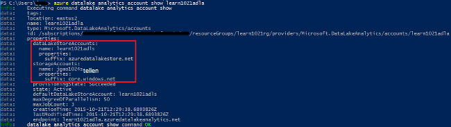
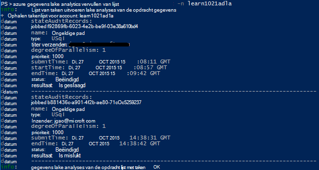

<properties 
   pageTitle="Azure gegevens Lake Analytics Azure-opdrachtregel beheren | Azure" 
   description="Informatie over het beheren van gegevens Lake Analytics-accounts, gegevensbronnen, taken en gebruikers met Azure CLI" 
   services="data-lake-analytics" 
   documentationCenter="" 
   authors="edmacauley" 
   manager="jhubbard" 
   editor="cgronlun"/>
 
<tags
   ms.service="data-lake-analytics"
   ms.devlang="na"
   ms.topic="article"
   ms.tgt_pltfrm="na"
   ms.workload="big-data" 
   ms.date="05/16/2016"
   ms.author="edmaca"/>

# Azure gegevens Lake analytische mogelijkheden op basis van Azure-Interface met opdrachtregel (CLI) beheren

[AZURE.INCLUDE [manage-selector](../../includes/data-lake-analytics-selector-manage.md)]

Informatie over het beheren van Azure gegevens Lake Analytics-accounts, gegevensbronnen, gebruikers en taken met behulp van de Azure. Op het tabblad van bovenstaande selecteren om te zien management onderwerp met een ander hulpprogramma.

**Vereisten voor**

Voordat u deze zelfstudie begint, hebt u het volgende:

- **Een Azure-abonnement**. Zie [Azure krijgen gratis proefversie](https://azure.microsoft.com/pricing/free-trial/).
- **Azure CLI**. Zie [installeren en configureren van Azure CLI](../xplat-cli-install.md).
    - Download en installeer de **voorlopige versie** [Azure CLI hulpprogramma's](https://github.com/MicrosoftBigData/AzureDataLake/releases) om te voltooien van deze demo.
- **Verificatie**via de volgende opdracht uit:

        azure login
    Zie voor meer informatie over verificatie via een account voor werk of school, [verbinding maken met een Azure-abonnement van de Azure CLI](../xplat-cli-connect.md).
- **Overschakelen naar de modus Azure resourcemanager**, met de volgende opdracht:

        azure config mode arm

**Overzicht van de opdrachten Lake gegevensopslag en Lake analyses van gegevens:**

    azure datalake store
    azure datalake analytics

<!-- ################################ -->
<!-- ################################ -->
## Accounts beheren

Voordat u alle gegevens Lake Analytics-taken, moet u een gegevens Lake Analytics-account hebt. In tegenstelling tot Azure HDInsight betaalt niet u voor een Analytics-account wanneer dit een taak niet wordt uitgevoerd.  U betaalt alleen voor de tijd waarop een taak wordt uitgevoerd.  Zie [Overzicht van Azure Data Lake Analytics](data-lake-analytics-overview.md)voor meer informatie.  

###Accounts maken

    azure datalake analytics account create "<Data Lake Analytics Account Name>" "<Azure Location>" "<Resource Group Name>" "<Default Data Lake Account Name>"

###Accounts bijwerken

De volgende opdracht uit de eigenschappen van een bestaande gegevens Lake Analytics-Account wordt bijgewerkt
    
    azure datalake analytics account set "<Data Lake Analytics Account Name>"

###Lijst met accounts

Lijst met gegevens Lake Analytics-accounts 

    azure datalake analytics account list

Lijst met gegevens Lake Analytics-accounts binnen een bepaalde resourcegroep

    azure datalake analytics account list -g "<Azure Resource Group Name>"

Informatie van een specifieke gegevens Lake Analytics-account

    azure datalake analytics account show -g "<Azure Resource Group Name>" -n "<Data Lake Analytics Account Name>"

###Gegevens Lake Analytics-accounts verwijderen

    azure datalake analytics account delete "<Data Lake Analytics Account Name>"

<!-- ################################ -->
<!-- ################################ -->
## Account gegevensbronnen beheren

Gegevens Lake Analytics worden momenteel ondersteund in de volgende gegevensbronnen:

- [Azure Lake gegevensopslag](../data-lake-store/data-lake-store-overview.md)
- [Azure-opslag](../storage/storage-introduction.md)

Wanneer u een Analytics-account hebt gemaakt, wijst u een account Azure Lake gegevensopslag het standaardaccount voor de opslag. Het standaardaccount voor de opslag van ADL wordt gebruikt voor de opslag van taak metagegevens en taak controlelogboeken bijhouden. Nadat u een Analytics-account hebt gemaakt, kunt u extra Lake gegevensopslag accounts en/of de opslag van Azure-account toevoegen. 

### Het standaardaccount voor de opslag van ADL zoeken

    azure datalake analytics account show "<Data Lake Analytics Account Name>"

De waarde wordt weergegeven onder eigenschappen: datalakeStoreAccount:name.

### Extra Azure Blob storage accounts toevoegen

    azure datalake analytics account datasource add -n "<Data Lake Analytics Account Name>" -b "<Azure Blob Storage Account Short Name>" -k "<Azure Storage Account Key>"

>[AZURE.NOTE] Alleen Blob storage korte namen worden ondersteund.  Gebruik geen FQDN-naam, bijvoorbeeld "myblob.blob.core.windows.net".

### Extra Lake gegevensopslag accounts toevoegen

    azure datalake analytics account datasource add -n "<Data Lake Analytics Account Name>" -l "<Data Lake Store Account Name>" [-d]

[-d] is een optionele schakeloptie waarmee wordt aangegeven of de gegevens Lake wordt toegevoegd het standaardaccount voor gegevens Lake. 

### Bijwerken van bestaande gegevensbron

Een bestaand account voor gegevensopslag Lake de standaard is instellen:

    azure datalake analytics account datasource set -n "<Data Lake Analytics Account Name>" -l "<Azure Data Lake Store Account Name>" -d
      
Een bestaande Blob storage accountsleutel bijwerken:

    azure datalake analytics account datasource set -n "<Data Lake Analytics Account Name>" -b "<Blob Storage Account Name>" -k "<New Blob Storage Account Key>"

### Lijst met gegevensbronnen:

    azure datalake analytics account show "<Data Lake Analytics Account Name>"
    

### Gegevensbronnen verwijderen:

Een account voor gegevensopslag Lake verwijderen:

    azure datalake analytics account datasource delete "<Data Lake Analytics Account Name>" "<Azure Data Lake Store Account Name>"

Een Blob storage-account verwijderen:

    azure datalake analytics account datasource delete "<Data Lake Analytics Account Name>" "<Blob Storage Account Name>"

## Taken beheren

Voordat u kunt een taak maken, moet u een gegevens Lake Analytics-account hebben.  Zie [beheren gegevens Lake Analytics-accounts](#manage-accounts)voor meer informatie.

### Lijst taken

    azure datalake analytics job list -n "<Data Lake Analytics Account Name>"

### Informatie van de taak

    azure datalake analytics job show -n "<Data Lake Analytics Account Name>" -j "<Job ID>"
    
### Taken indienen

> [AZURE.NOTE] De standaardprioriteit van een taak is 1000 en de standaard-mate van parallellisme voor een taak is 1.

    azure datalake analytics job create  "<Data Lake Analytics Account Name>" "<Job Name>" "<Script>"

### Taken annuleren

Gebruik de opdracht lijst om de taak-id en gebruik Annuleren om te annuleren de taak.

    azure datalake analytics job list -n "<Data Lake Analytics Account Name>"
    azure datalake analytics job cancel "<Data Lake Analytics Account Name>" "<Job ID>"

## Catalogus beheren

De catalogus met I-SQL wordt gebruikt voor het structureren van gegevens en code, zodat ze kunnen worden gedeeld door U-SQL-scripts. De catalogus kunt de mogelijkheden van gegevens in Azure gegevens Lake beste prestaties. Zie voor meer informatie, [Gebruik U-SQL-catalogus](data-lake-analytics-use-u-sql-catalog.md).
 
###Lijst met catalogusartikelen

    #List databases
    azure datalake analytics catalog list -n "<Data Lake Analytics Account Name>" -t database

    #List tables
    azure datalake analytics catalog list -n "<Data Lake Analytics Account Name>" -t table
    
De typen bestaan database, schema, constructie, externe gegevensbron, tabel, tabelwaardefunctie of tabelstatistieken.

###Geheim catalogus maken

    azure datalake analytics catalog secret create -n "<Data Lake Analytics Account Name>" <databaseName> <hostUri> <secretName>

### Geheim catalogus wijzigen

    azure datalake analytics catalog secret set -n "<Data Lake Analytics Account Name>" <databaseName> <hostUri> <secretName>

###Geheim catalogus verwijderen

    azure datalake analytics catalog secrete delete -n "<Data Lake Analytics Account Name>" <databaseName> <hostUri> <secretName>

<!-- ################################ -->
<!-- ################################ -->
## Op ARM groepen gebruiken

Toepassingen zijn meestal bestaat uit veel onderdelen, bijvoorbeeld een web-app, database, database-server, opslag en 3e partijen services. Azure Resource Manager (ARM) kunt u werken met de resources in uw toepassing als een groep, een resourcegroep Azure genoemd. U kunt implementeren, bijwerken, controleren of alle bronnen voor uw toepassing in één, gecoördineerde bewerking verwijderen. Een sjabloon te gebruiken voor implementatie en die sjabloon voor verschillende omgevingen zoals testen, ontwikkel- en kunt werken. U kunt de facturering voor uw organisatie verduidelijken door de samengevouwen kosten voor de hele groep weer te geven. Zie [Azure resourcemanager overzicht](../azure-resource-manager/resource-group-overview.md)voor meer informatie. 

Een gegevens Lake Analytics-service kan de volgende onderdelen bevatten:

- Azure gegevens Lake Analytics-account
- Vereiste standaardaccount voor Azure Lake gegevensopslag
- Aanvullende Azure gegevens Lake opslag-accounts
- Extra opslagruimte van Azure-accounts

U kunt deze onderdelen onder één ARM groep zodat u ze gemakkelijker kunt beheren.

Een gegevens Lake Analytics-account en de afhankelijke opslag-accounts moeten worden geplaatst in het dezelfde Azure Datacenter.
De groep ARM kan echter zich bevinden in een ander datacenter.  

##Zie ook 

- [Overzicht van Microsoft Azure-gegevens Lake Analytics](data-lake-analytics-overview.md)
- [Aan de slag met gegevens Lake analyses met behulp van Azure-Portal](data-lake-analytics-get-started-portal.md)
- [Azure gegevens Lake analyses met behulp van Azure-Portal beheren](data-lake-analytics-manage-use-portal.md)
- [Controleren en problemen met Azure gegevens Lake Analytics-taken met behulp van Azure-Portal](data-lake-analytics-monitor-and-troubleshoot-jobs-tutorial.md)

