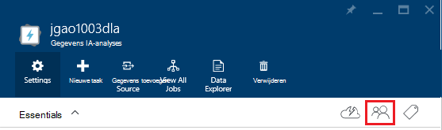
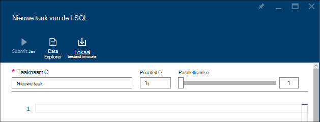
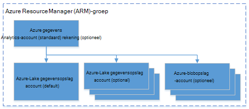

<properties 
   pageTitle="Azure gegevens Lake analyses met behulp van de Azure portal beheren | Azure" 
   description="Informatie over het beheren van gegevens Lake Analytics acounts, gegevensbronnen, gebruikers en taken." 
   services="data-lake-analytics" 
   documentationCenter="" 
   authors="edmacauley" 
   manager="jhubbard" 
   editor="cgronlun"/>
 
<tags
   ms.service="data-lake-analytics"
   ms.devlang="na"
   ms.topic="article"
   ms.tgt_pltfrm="na"
   ms.workload="big-data" 
   ms.date="10/06/2016"
   ms.author="edmaca"/>

# Azure gegevens Lake analyses met behulp van Azure portal beheren

[AZURE.INCLUDE [manage-selector](../../includes/data-lake-analytics-selector-manage.md)]

Informatie over het beheren van Azure gegevens Lake Analytics-accounts, account-gegevensbronnen, gebruikers en taken met behulp van de Azure portal. Als u wilt zien management onderwerpen andere hulpmiddelen gebruiken, klikt u op de tabkiezer boven aan de pagina.

**Vereisten voor**

Voordat u deze zelfstudie begint, moet u de volgende items:

- **Een Azure-abonnement**. Zie [Azure krijgen gratis proefversie](https://azure.microsoft.com/pricing/free-trial/).

<!-- ################################ -->
<!-- ################################ -->
## Accounts beheren

Voordat u alle gegevens Lake Analytics-taken, moet u een gegevens Lake Analytics-account hebt. In tegenstelling tot Azure HDInsight betaalt u alleen voor een gegevens Lake Analytics-account wanneer u een taak uitvoeren.  U betaalt alleen voor de tijd waarop een taak wordt uitgevoerd.  Zie [Overzicht van Azure Data Lake Analytics](data-lake-analytics-overview.md)voor meer informatie.  

**Een gegevens Lake Analytics-account maken**

1. Aanmelden bij de [portal van Azure](https://portal.azure.com).
2. Klik op **Nieuw** **Intelligence + analytics**op en klik vervolgens op **Gegevens Lake Analytics**.
3. Typ of Selecteer de volgende waarden:

    

    - **Naam**: de gegevens Lake Analytics-account een naam.
    - **Abonnement**: Kies het Azure abonnement dat is gebruikt voor het Analytics-account.
    - **Resourcegroep**. Selecteer een bestaande groep van Azure Resource of een nieuw account te maken. Azure resourcemanager kunt u werken met de resources in uw toepassing als een groep. Zie [Azure resourcemanager overzicht](resource-group-overview.md)voor meer informatie. 
    - **Locatie**. Selecteer een Azure Datacenter voor de gegevens Lake Analytics-account. 
    - **Gegevensopslag Lake**: elke gegevens Lake Analytics-account heeft een afhankelijke Lake gegevensopslag-account. De gegevens Lake Analytics-account en de afhankelijke Lake gegevensopslag-account moeten zich bevinden in het dezelfde Azure Datacenter. Volg de aanwijzingen op het maken van een nieuw account voor gegevensopslag Lake of Selecteer een bestaande eigenschap.

8. Klik op **maken**. Dit gaat u naar het beginscherm van de portal. Een nieuwe tegel wordt toegevoegd aan de StartBoard met het label 'Implementeert Azure gegevens Lake Analytics' weergegeven. Duurt het even naar een gegevens Lake Analytics-account maken. Wanneer het account is gemaakt, wordt het account in een nieuwe blade geopend in de portal.

Nadat een gegevens Lake Analytics-account is gemaakt, kunt u extra Lake gegevensopslag accounts en Azure Storage accounts toevoegen. Zie [gegevensbronnen beheren gegevens lake Analytics-account](data-lake-analytics-manage-use-portal.md#manage-account-data-sources)voor instructies.

**Naar een gegevens Lake Analytics-account toegang/openen**

1. Aanmelden bij de [portal van Azure](https://portal.azure.com/).
2. Klik op **Gegevens Lake Analytics** in het linkermenu.  Als u dit niet ziet, klikt u op **meer services**en klik vervolgens op **Gegevens Lake Analytics** onder **Intelligence + Analytics**.
3. Klik op het gegevens Lake Analytics-account dat u wilt openen. Wordt het account hebt geopend in een nieuwe blade.

**Een gegevens Lake Analytics-account verwijderen**

1. Open de gegevens Lake Analytics-account dat u wilt verwijderen. Zie [toegang tot gegevens Lake Analytics-accounts](#access-adla-account)voor instructies.
2. Klik op **verwijderen** in het knopmenu boven aan het blad.
3. Typ de naam van het account en klik vervolgens op **verwijderen**.

Verwijderen van een gegevens Lake Analytics-account, wordt de afhankelijke Lake gegevensopslag accounts niet verwijderd. Instructies voor het verwijderen van Lake gegevensopslag accounts Zie [verwijderen Lake gegevensopslag-account](data-lake-store-get-started-portal.md#delete-azure-data-lake-store-account).

<!-- ################################ -->
<!-- ################################ -->
## Account gegevensbronnen beheren

Gegevens Lake Analytics worden momenteel ondersteund in de volgende gegevensbronnen:

- [Azure Lake gegevensopslag](../data-lake-store/data-lake-store-overview.md)
- [Azure-opslag](../storage/storage-introduction.md)

Wanneer u een gegevens Lake Analytics-account hebt gemaakt, wijst u een account Azure Lake gegevensopslag het standaardaccount voor de opslag. Het standaardaccount voor gegevensopslag Lake wordt gebruikt voor de opslag van taak metagegevens en taak controlelogboeken bijhouden. Nadat u een gegevens Lake Analytics-account hebt gemaakt, kunt u extra Lake gegevensopslag accounts en/of de opslag van Azure-account toevoegen. 

**Het standaardaccount voor de opslag van gegevens Lake zoeken**

- Open de gegevens Lake Analytics-account dat u wilt beheren. Zie [toegang tot gegevens Lake Analytics-accounts](#access-adla-account)voor instructies. De standaard gegevens Lake store wordt weergegeven in **essentiële**:

    

**Aanvullende gegevensbronnen waarmee toevoegen**

1. Open de gegevens Lake Analytics-account dat u wilt beheren. Zie [toegang tot gegevens Lake Analytics-accounts](#access-adla-account)voor instructies.
2. Klik op **Instellingen** en klik vervolgens op **Gegevensbronnen**. Er wordt het standaardaccount voor gegevensopslag Lake er vermeld. 
3. Klik op **een gegevensbron toevoegen**.

    

    Als u wilt een Azure Lake gegevensopslag-account toevoegt, moet u het account naam en toegang tot het account kan deze query.
    Als u wilt een Azure-blobopslag hebt toegevoegd, moet u het opslag-account en de toets account, die u vinden kunt door te schuiven naar het account opslag in de portal.

**Gegevensbronnen verkennen**  

1. Open het Analytics-account dat u wilt beheren. Zie [toegang tot gegevens Lake Analytics-accounts](#access-adla-account)voor instructies.
2. Klik op **Instellingen** en klik vervolgens op **Data Explorer**. 
 
    
    
3. Klik op een account voor gegevensopslag Lake om het account te openen.

    
    
    U kunt voor elk account Lake gegevensopslag
    
    - **Nieuwe map**: nieuwe map toevoegen.
    - **Uploaden**: bestanden uploaden naar de opslag-account vanuit uw werkstation.
    - **Access**: toegang machtigingen.
    - **Mapnaam wijzigen**: als u de naam van een map wijzigen.
    - **Mapeigenschappen**: eigenschappen van bestand of map weergeven, zoals WASB pad, WEBHDFS pad, het laatst is gewijzigd tijd enzovoort.
    - **Map verwijderen**: een map verwijderen.

**Voor het uploaden van bestanden met Lake gegevensopslag-account**

1. In de Portal klikt u op **Bladeren** in het linkermenu en klik vervolgens op **Lake gegevensopslag**.
2. Klik op het account voor gegevensopslag Lake die u wilt uploaden van gegevens. Zie informatie over het standaardaccount voor gegevensopslag Lake [hier](#default-adl-account).
3. Klik op **Data Explorer** in het bovenste menu.
4. Klik op **Nieuwe map** om een nieuwe map maken of klik op de naam van een map naar de map wijzigen.
6. Klik op **uploaden** van het bovenste menu bestand te uploaden.

**Voor het uploaden van bestanden met Azure Blob storage-account**

Zie [gegevens voor Hadoop-projecten in HDInsight uploaden](../hdinsight/hdinsight-upload-data.md).  De informatie is van toepassing op gegevens Lake Analytics.

## Gebruikers beheren

Rolgebaseerd toegangsbeheer gegevens Lake Analytics gebruikt met Azure Active Directory. Wanneer u een gegevens Lake Analytics-account maakt, wordt een rol "Abonnement beheerders" wordt toegevoegd aan het account. U kunt extra gebruikers en beveiligingsgroepen met de volgende rollen toevoegen:

|Rol|Beschrijving|
|----|-----------|
|Eigenaar|Kunt u alles, ook toegang tot bronnen beheren.|
|Inzender|Toegang tot de portal; Formuliergegevens verzenden en controleren van taken. Taken indienen moet, een inzender de machtiging lezen of schrijven naar de gegevensopslag Lake-accounts.|
|DataLakeAnalyticsDeveloper | Formuliergegevens verzenden, bewaken en taken annuleren.  Deze gebruikers kunnen alleen hun eigen taken annuleren. Ze kunnen niet hun eigen account beheren, bijvoorbeeld gebruikers toevoegen, machtigingen wijzigen of verwijderen van het account. Als u wilt kunnen taken uitvoeren, nodig zij hebben lees- of schrijftoegang tot de gegevensopslag Lake-accounts     | 
|Lezer|Kunt u alles te bekijken, maar geen wijzigingen aanbrengen.|  
|DevTest Labs gebruiker|Kunt u alles te bekijken en verbinding kunt maken, start opnieuw starten en afsluiten virtuele machines.|  
|Beheerder van de gebruiker toegang|U kunt de toegang van gebruikers tot Azure bronnen beheren.|  

Zie [Wat Azure Active Directory is](../active-directory/active-directory-whatis.md)voor informatie over het maken van Azure Active Directory-gebruikers en beveiligingsgroepen.

**Gebruikers of beveiligingsgroepen toevoegen aan een gegevens Lake Analytics-account**

1. Open het Analytics-account dat u wilt beheren. Zie [toegang tot gegevens Lake Analytics-accounts](#access-adla-account)voor instructies.
2. Klik op **Instellingen**en klik vervolgens op **gebruikers**. U kunt ook klikken op **Access** op de titelbalk van het **Essentials** zoals wordt weergegeven in de volgende schermafbeelding:

    
3. Klik in het blad **gebruiker** op **toevoegen**.
4. Selecteer een rol en een gebruiker toevoegen en klik vervolgens op **OK**.

**Opmerking: Als deze gebruiker of beveiligingsgroep moet worden taken, moeten ze krijgen ze toestemming op de Lake gegevensopslag ook. Zie [Secure gegevens die zijn opgeslagen in Lake gegevensopslag](../data-lake-store/data-lake-store-secure-data.md)voor meer informatie.**

<!-- ################################ -->
<!-- ################################ -->
## Taken beheren

Voordat u kunt alle I-SQL-taken uitvoeren, moet u een gegevens Lake Analytics-account hebben.  Zie [beheren gegevens Lake Analytics-accounts](#manage-data-lake-analytics-accounts)voor meer informatie.

**Een taak wilt maken**

1. Open het Analytics-account dat u wilt beheren. Zie [toegang tot gegevens Lake Analytics-accounts](#access-adla-account)voor instructies.
2. Klik op **nieuwe taak**.

    

    Er wordt een nieuwe blade vergelijkbaar met:

    

    Voor elke taak, kunt u configureren

  	|Naam|Beschrijving|
  	|----|-----------|
  	|De taaknaam van de|Voer de naam van de taak.|
  	|Prioriteit|Lagere getal heeft een hogere prioriteit. Als er twee taken worden zowel in de wachtrij, met een lagere prioriteit eerst wordt uitgevoerd|
  	|Parallellisme |Maximumaantal berekeningscluster processen die op hetzelfde moment kan optreden. Een hoger aantal, kan de prestaties verbeteren, maar ook kosten kunt vergroten.|
  	|Script|Voer in het I-SQL-script voor de taak.|

    Met dezelfde interface, kunt u ook de koppeling gegevensbronnen verkennen en u aanvullende bestanden toevoegen aan de gekoppelde gegevensbronnen. 
3. Klik op **Taak verzenden** als u wilt verzenden van de taak.

**Om in te dienen van een taak**

Zie [gegevens Lake-analyses maken taken](#create-job).

**Om de taken te houden**

1. Open het Analytics-account dat u wilt beheren. Zie [toegang tot gegevens Lake Analytics-accounts](#access-adla-account)voor instructies. Het deelvenster Taakbeheer ziet u de eenvoudige taakgegevens:

    

3. Klik op **Taakbeheer** zoals wordt weergegeven in de vorige schermafbeelding.

    

4. Klik op een taak in de lijsten. Of klik op **Filter** waarmee u kunt de taken zoeken:

    

    U kunt taken door **Tijdsbereik**, **Taaknaam**en **auteur**filteren.
5. Als u opnieuw aan te bieden de taak wilt maken, klikt u op **opnieuw aan te bieden** .

**Aan een taak opnieuw aan te bieden**

Zie [Monitor gegevens Lake Analytics-taken](#monitor-jobs).

##Gebruik van de account controleren

**Accountgebruik controleren**

1. Open het Analytics-account dat u wilt beheren. Zie [toegang tot gegevens Lake Analytics-accounts](#access-adla-account)voor instructies. Het deelvenster gebruik ziet u de gebruik:

    

2. Dubbelklik op het deelvenster voor meer informatie.

##Weergave I-SQL-catalogus

De [catalogus met I-SQL](data-lake-analytics-use-u-sql-catalog.md) wordt gebruikt voor het structureren van gegevens en code, zodat ze kunnen worden gedeeld door U-SQL-scripts. De catalogus kunt de mogelijkheden van gegevens in Azure gegevens Lake beste prestaties. In de portal Azure zijn u kunnen zien van de catalogus met I-SQL.

**Om te bladeren I-SQL-catalogus**

1. Open het Analytics-account dat u wilt beheren. Zie [toegang tot gegevens Lake Analytics-accounts](#access-adla-account)voor instructies.
2. Klik op **Data Explorer** in het bovenste menu.
3. **Catalogus**uitvouwen, **basispagina**uitvouwen, uitvouwen **tabellen, of **waarden tabelfuncties**, of **stroombaan **. De volgende schermafbeelding ziet u één tabelwaardefunctie.

    

<!-- ################################ -->
<!-- ################################ -->
## Azure resourcemanager groepen gebruiken

Toepassingen zijn meestal bestaat uit veel onderdelen, bijvoorbeeld een web-app, database, database-server, opslag en services van derden. Azure resourcemanager kunt u werken met de resources in uw toepassing als een groep, een resourcegroep Azure genoemd. U kunt implementeren, bijwerken, controleren of verwijderen van alle resources voor uw toepassing een eenmalige, gecoördineerde betrekking heeft. Een sjabloon te gebruiken voor implementatie en die sjabloon voor verschillende omgevingen zoals testen, tijdelijke en productie kunt werken. U kunt de facturering voor uw organisatie verduidelijken door de samengevouwen kosten voor de hele groep weer te geven. Zie [Azure resourcemanager overzicht](../azure-resource-manager/resource-group-overview.md)voor meer informatie. 

Een gegevens Lake Analytics-service kan de volgende onderdelen bevatten:

- Azure gegevens Lake Analytics-account
- Vereiste standaard de gegevensopslag Lake Azure-account
- Aanvullende Azure gegevensopslag Lake accounts
- Extra opslagruimte van Azure-accounts

U kunt deze onderdelen onder één resourcebeheer groep zodat u ze gemakkelijker kunt beheren.

Een gegevens Lake Analytics-account en de afhankelijke opslag-accounts moeten worden geplaatst in het dezelfde Azure Datacenter.
De groep resourcebeheer kan echter zich bevinden in een ander datacenter.  

##Zie ook 

- [Overzicht van Microsoft Azure-gegevens Lake Analytics](data-lake-analytics-overview.md)
- [Aan de slag met gegevens Lake analyses met behulp van Azure portal](data-lake-analytics-get-started-portal.md)
- [Azure gegevens Lake Analytics via Azure PowerShell beheren](data-lake-analytics-manage-use-powershell.md)
- [Controleren en problemen met Azure gegevens Lake Analytics-taken met behulp van Azure portal](data-lake-analytics-monitor-and-troubleshoot-jobs-tutorial.md)

