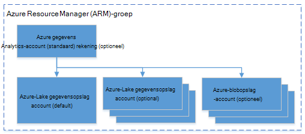

<properties 
   pageTitle="Azure gegevens Lake Analytics via Azure PowerShell beheren | Azure" 
   description="Leer hoe u gegevens Lake Analytics-taken en gegevensbronnen en gebruikers beheren. " 
   services="data-lake-analytics" 
   documentationCenter="" 
   authors="edmacauley" 
   manager="jhubbard" 
   editor="cgronlun"/>
 
<tags
   ms.service="data-lake-analytics"
   ms.devlang="na"
   ms.topic="article"
   ms.tgt_pltfrm="na"
   ms.workload="big-data" 
   ms.date="05/16/2016"
   ms.author="edmaca"/>

# Azure gegevens Lake Analytics via Azure PowerShell beheren

[AZURE.INCLUDE [manage-selector](../../includes/data-lake-analytics-selector-manage.md)]

Informatie over het beheren van Azure gegevens Lake Analytics-accounts, gegevensbronnen, gebruikers en taken met behulp van de Azure PowerShell. Management als onderwerpen wilt bekijken met een ander hulpprogramma, klikt u op het tabblad van bovenstaande selecteren.

**Vereisten voor**

Voordat u deze zelfstudie begint, hebt u het volgende:

- **Een Azure-abonnement**. Zie [Azure krijgen gratis proefversie](https://azure.microsoft.com/pricing/free-trial/).

<!-- ################################ -->
<!-- ################################ -->

##Azure PowerShell 1.0 of groter installeren

Zie de vereiste sectie van [Azure PowerShell gebruiken met Azure Resource Manager](powershell-azure-resource-manager.md#prerequisites).
    
## Accounts beheren

Voordat u alle gegevens Lake Analytics-taken, moet u een gegevens Lake Analytics-account hebt. In tegenstelling tot Azure HDInsight betaalt niet u voor een Analytics-account wanneer dit een taak niet wordt uitgevoerd.  U betaalt alleen voor de tijd waarop een taak wordt uitgevoerd.  Zie [Overzicht van Azure Data Lake Analytics](data-lake-analytics-overview.md)voor meer informatie.  

###Accounts maken

    $resourceGroupName = "<ResourceGroupName>"
    $dataLakeStoreName = "<DataLakeAccountName>"
    $dataLakeAnalyticsAccountName = "<DataLakeAnalyticsAccountName>"
    $location = "<Microsoft Data Center>"
    
    Write-Host "Create a resource group ..." -ForegroundColor Green
    New-AzureRmResourceGroup `
        -Name  $resourceGroupName `
        -Location $location
    
    Write-Host "Create a Data Lake account ..."  -ForegroundColor Green
    New-AzureRmDataLakeStoreAccount `
        -ResourceGroupName $resourceGroupName `
        -Name $dataLakeStoreName `
        -Location $location 
    
    Write-Host "Create a Data Lake Analytics account ..."  -ForegroundColor Green
    New-AzureRmDataLakeAnalyticsAccount `
        -Name $dataLakeAnalyticsAccountName `
        -ResourceGroupName $resourceGroupName `
        -Location $location `
        -DefaultDataLake $dataLakeStoreName
    
    Write-Host "The newly created Data Lake Analytics account ..."  -ForegroundColor Green
    Get-AzureRmDataLakeAnalyticsAccount `
        -ResourceGroupName $resourceGroupName `
        -Name $dataLakeAnalyticsAccountName  

U kunt ook een resourcegroep Azure-sjabloon gebruiken. Een sjabloon voor het maken van een gegevens Lake Analytics-account en de afhankelijke Lake gegevensopslag-account is in [bijlage A](#appendix-a). De sjabloon opslaan in een bestand met .json sjabloon en gebruikt u het volgende PowerShell-script om te bellen deze:

    $AzureSubscriptionID = "<Your Azure Subscription ID>"
    
    $ResourceGroupName = "<New Azure Resource Group Name>"
    $Location = "EAST US 2"
    $DefaultDataLakeStoreAccountName = "<New Data Lake Store Account Name>"
    $DataLakeAnalyticsAccountName = "<New Data Lake Analytics Account Name>"
    
    $DeploymentName = "MyDataLakeAnalyticsDeployment"
    $ARMTemplateFile = "E:\Tutorials\ADL\ARMTemplate\azuredeploy.json"  # update the Json template path 
    
    Login-AzureRmAccount
    
    Select-AzureRmSubscription -SubscriptionId $AzureSubscriptionID
    
    # Create the resource group
    New-AzureRmResourceGroup -Name $ResourceGroupName -Location $Location
    
    # Create the Data Lake Analytics account with the default Data Lake Store account.
    $parameters = @{"adlAnalyticsName"=$DataLakeAnalyticsAccountName; "adlStoreName"=$DefaultDataLakeStoreAccountName}
    New-AzureRmResourceGroupDeployment -Name $DeploymentName -ResourceGroupName $ResourceGroupName -TemplateFile $ARMTemplateFile -TemplateParameterObject $parameters 

 
###Lijst-account

Lijst met gegevens Lake Analytics-accounts binnen het huidige abonnement

    Get-AzureRmDataLakeAnalyticsAccount
    
De uitvoer:

    Id         : /subscriptions/xxxxxxxxxxxxxxxxxxxxxxxxxxxxxxxxxxxx/resourceGroups/learn1021rg/providers/Microsoft.DataLakeAnalytics/accounts/learn1021adla
    Location   : eastus2
    Name       : learn1021adla
    Properties : Microsoft.Azure.Management.DataLake.Analytics.Models.DataLakeAnalyticsAccountProperties
    Tags       : {}
    Type       : Microsoft.DataLakeAnalytics/accounts

Lijst met gegevens Lake Analytics-accounts binnen een bepaalde resourcegroep

    Get-AzureRmDataLakeAnalyticsAccount -ResourceGroupName $resourceGroupName

Informatie van een specifieke gegevens Lake Analytics-account

    Get-AzureRmDataLakeAnalyticsAccount -Name $adlAnalyticsAccountName

Testen of een specifieke gegevens Lake Analytics-account bestaat

    Test-AzureRmDataLakeAnalyticsAccount -Name $adlAnalyticsAccountName

De cmdlet retourneert **True** of **False**.

###Gegevens Lake Analytics-accounts verwijderen

    $resourceGroupName = "<ResourceGroupName>"
    $dataLakeAnalyticsAccountName = "<DataLakeAnalyticsAccountName>"
    
    Remove-AzureRmDataLakeAnalyticsAccount -Name $dataLakeAnalyticsAccountName 

Delete gegevens Lake Analytics-account wordt de afhankelijke Lake gegevensopslag-account niet verwijderen. Het volgende voorbeeld wordt de gegevens Lake Analytics-account en het standaardaccount voor gegevensopslag Lake

    $resourceGroupName = "<ResourceGroupName>"
    $dataLakeAnalyticsAccountName = "<DataLakeAnalyticsAccountName>"
    $dataLakeStoreName = (Get-AzureRmDataLakeAnalyticsAccount -ResourceGroupName $resourceGroupName -Name $dataLakeAnalyticAccountName).Properties.DefaultDataLakeAccount

    Remove-AzureRmDataLakeAnalyticsAccount -ResourceGroupName $resourceGroupName -Name $dataLakeAnalyticAccountName 
    Remove-AzureRmDataLakeStoreAccount -ResourceGroupName $resourceGroupName -Name $dataLakeStoreName

<!-- ################################ -->
<!-- ################################ -->
## Account gegevensbronnen beheren

Gegevens Lake Analytics worden momenteel ondersteund in de volgende gegevensbronnen:

- [Azure Lake gegevensopslag](../data-lake-store/data-lake-store-overview.md)
- [Azure-opslag](storage-introduction.md)

Wanneer u een Analytics-account hebt gemaakt, wijst u een account Azure Lake gegevensopslag het standaardaccount voor de opslag. Het standaardaccount voor gegevensopslag Lake wordt gebruikt voor de opslag van taak metagegevens en taak controlelogboeken bijhouden. Nadat u een Analytics-account hebt gemaakt, kunt u extra Lake gegevensopslag accounts en/of de opslag van Azure-account toevoegen. 

### Het standaardaccount voor gegevensopslag Lake zoeken

    $resourceGroupName = "<ResourceGroupName>"
    $dataLakeAnalyticsAccountName = "<DataLakeAnalyticsAccountName>"
    $dataLakeStoreName = (Get-AzureRmDataLakeAnalyticsAccount -ResourceGroupName $resourceGroupName -Name $dataLakeAnalyticAccountName).Properties.DefaultDataLakeAccount

### Extra Azure Blob storage accounts toevoegen

    $resourceGroupName = "<ResourceGroupName>"
    $dataLakeAnalyticsAccountName = "<DataLakeAnalyticsAccountName>"
    $AzureStorageAccountName = "<AzureStorageAccountName>"
    $AzureStorageAccountKey = "<AzureStorageAccountKey>"
    
    Add-AzureRmDataLakeAnalyticsDataSource -ResourceGroupName $resourceGroupName -Account $dataLakeAnalyticAccountName -AzureBlob $AzureStorageAccountName -AccessKey $AzureStorageAccountKey

### Extra Lake gegevensopslag accounts toevoegen

    $resourceGroupName = "<ResourceGroupName>"
    $dataLakeAnalyticsAccountName = "<DataLakeAnalyticsAccountName>"
    $AzureDataLakeName = "<DataLakeStoreName>"
    
    Add-AzureRmDataLakeAnalyticsDataSource -ResourceGroupName $resourceGroupName -Account $dataLakeAnalyticAccountName -DataLake $AzureDataLakeName 

### Lijst met gegevensbronnen:

    $resourceGroupName = "<ResourceGroupName>"
    $dataLakeAnalyticsAccountName = "<DataLakeAnalyticsAccountName>"

    (Get-AzureRmDataLakeAnalyticsAccount -ResourceGroupName $resourceGroupName -Name $dataLakeAnalyticAccountName).Properties.DataLakeStoreAccounts
    (Get-AzureRmDataLakeAnalyticsAccount -ResourceGroupName $resourceGroupName -Name $dataLakeAnalyticAccountName).Properties.StorageAccounts
    

<!-- ################################ -->
<!-- ################################ -->
## Taken beheren

Voordat u kunt een taak maken, moet u een gegevens Lake Analytics-account hebben.  Zie [beheren gegevens Lake Analytics-accounts](#manage-data-lake-analytics-accounts)voor meer informatie.

### Lijst taken

    $dataLakeAnalyticsAccountName = "<DataLakeAnalyticsAccountName>"
    
    Get-AzureRmDataLakeAnalyticsJob -Account $dataLakeAnalyticAccountName
    
    Get-AzureRmDataLakeAnalyticsJob -Account $dataLakeAnalyticAccountName -State Running, Queued
    #States: Accepted, Compiling, Ended, New, Paused, Queued, Running, Scheduling, Starting
    
    Get-AzureRmDataLakeAnalyticsJob -Account $dataLakeAnalyticAccountName -Result Cancelled
    #Results: Cancelled, Failed, None, Successed 
    
    Get-AzureRmDataLakeAnalyticsJob -Account $dataLakeAnalyticAccountName -Name <Job Name>
    Get-AzureRmDataLakeAnalyticsJob -Account $dataLakeAnalyticAccountName -Submitter <Job submitter>

    # List all jobs submitted on January 1 (local time)
    Get-AzureRmDataLakeAnalyticsJob -Account $dataLakeAnalyticAccountName `
        -SubmittedAfter "2015/01/01"
        -SubmittedBefore "2015/01/02"   

    # List all jobs that succeeded on January 1 after 2 pm (UTC time)
    Get-AzureRmDataLakeAnalyticsJob -Account $dataLakeAnalyticAccountName `
        -State Ended
        -Result Succeeded
        -SubmittedAfter "2015/01/01 2:00 PM -0"
        -SubmittedBefore "2015/01/02 -0"

    # List all jobs submitted in the past hour
    Get-AzureRmDataLakeAnalyticsJob -Account $dataLakeAnalyticAccountName `
        -SubmittedAfter (Get-Date).AddHours(-1)

### Informatie van de taak

    $dataLakeAnalyticsAccountName = "<DataLakeAnalyticsAccountName>"
    Get-AzureRmDataLakeAnalyticsJob -Account $dataLakeAnalyticAccountName -JobID <Job ID>
    
### Taken indienen

    $dataLakeAnalyticsAccountName = "<DataLakeAnalyticsAccountName>"

    #Pass script via path
    Submit-AzureRmDataLakeAnalyticsJob -Account $dataLakeAnalyticAccountName `
        -Name $jobName `
        -ScriptPath $scriptPath

    #Pass script contents
    Submit-AzureRmDataLakeAnalyticsJob -Account $dataLakeAnalyticAccountName `
        -Name $jobName `
        -Script $scriptContents

> [AZURE.NOTE] De standaardprioriteit van een taak is 1000 en de standaard-mate van parallellisme voor een taak is 1.

### Taken annuleren

    Stop-AzureRmDataLakeAnalyticsJob -Account $dataLakeAnalyticAccountName `
        -JobID $jobID

## Catalogusitems beheren

De catalogus met I-SQL wordt gebruikt voor het structureren van gegevens en code, zodat ze kunnen worden gedeeld door U-SQL-scripts. De catalogus kunt de mogelijkheden van gegevens in Azure gegevens Lake beste prestaties. Zie voor meer informatie, [Gebruik U-SQL-catalogus](data-lake-analytics-use-u-sql-catalog.md).

###Lijst met catalogusartikelen

    #List databases
    Get-AzureRmDataLakeAnalyticsCatalogItem `
        -Account $adlAnalyticsAccountName `
        -ItemType Database
    
    
    
    #List tables
    Get-AzureRmDataLakeAnalyticsCatalogItem `
        -Account $adlAnalyticsAccountName `
        -ItemType Table `
        -Path "master.dbo"

###Catalogus item informatie 

    #Get a database
    Get-AzureRmDataLakeAnalyticsCatalogItem `
        -Account $adlAnalyticsAccountName `
        -ItemType Database `
        -Path "master"
    
    #Get a table
    Get-AzureRmDataLakeAnalyticsCatalogItem `
        -Account $adlAnalyticsAccountName `
        -ItemType Table `
        -Path "master.dbo.mytable"

###Bestaan van catalogusitem testen

    Test-AzureRmDataLakeAnalyticsCatalogItem  `
        -Account $adlAnalyticsAccountName `
        -ItemType Database `
        -Path "master"

###Geheim catalogus maken
    New-AzureRmDataLakeAnalyticsCatalogSecret  `
            -Account $adlAnalyticsAccountName `
            -DatabaseName "master" `
            -Secret (Get-Credential -UserName "username" -Message "Enter the password")

### Geheim catalogus wijzigen
    Set-AzureRmDataLakeAnalyticsCatalogSecret  `
            -Account $adlAnalyticsAccountName `
            -DatabaseName "master" `
            -Secret (Get-Credential -UserName "username" -Message "Enter the password")

###Geheim catalogus verwijderen
    Remove-AzureRmDataLakeAnalyticsCatalogSecret  `
            -Account $adlAnalyticsAccountName `
            -DatabaseName "master"

## Azure resourcemanager groepen gebruiken

Toepassingen zijn meestal bestaat uit veel onderdelen, bijvoorbeeld een web-app, database, database-server, opslag en 3e partijen services. Azure Resource Manager (ARM) kunt u werken met de resources in uw toepassing als een groep, een resourcegroep Azure genoemd. U kunt implementeren, bijwerken, controleren of alle bronnen voor uw toepassing in één, gecoördineerde bewerking verwijderen. Een sjabloon te gebruiken voor implementatie en die sjabloon voor verschillende omgevingen zoals testen, ontwikkel- en kunt werken. U kunt de facturering voor uw organisatie verduidelijken door de samengevouwen kosten voor de hele groep weer te geven. Zie [Azure resourcemanager overzicht](../azure-resource-manager/resource-group-overview.md)voor meer informatie. 

Een gegevens Lake Analytics-service kan de volgende onderdelen bevatten:

- Azure gegevens Lake Analytics-account
- Vereiste standaardaccount voor Azure Lake gegevensopslag
- Aanvullende Azure gegevens Lake opslag-accounts
- Extra opslagruimte van Azure-accounts

U kunt deze onderdelen onder één ARM groep zodat u ze gemakkelijker kunt beheren.

Een gegevens Lake Analytics-account en de afhankelijke opslag-accounts moeten worden geplaatst in het dezelfde Azure Datacenter.
De groep ARM kan echter zich bevinden in een ander datacenter.  

##Zie ook 

- [Overzicht van Microsoft Azure-gegevens Lake Analytics](data-lake-analytics-overview.md)
- [Aan de slag met gegevens Lake analyses met behulp van Azure-Portal](data-lake-analytics-get-started-portal.md)
- [Azure gegevens Lake analyses met behulp van Azure-Portal beheren](data-lake-analytics-manage-use-portal.md)
- [Controleren en problemen met Azure gegevens Lake Analytics-taken met behulp van Azure-Portal](data-lake-analytics-monitor-and-troubleshoot-jobs-tutorial.md)

##Bijlage A - gegevens Lake Analytics ARM sjabloon

De volgende ARM sjabloon kan worden gebruikt om te implementeren een gegevens Lake Analytics-account en de afhankelijke Lake gegevensopslag-account.  Opslaan als een bestand json en gebruikt u PowerShell-script om te bellen van de sjabloon. Zie [Deploy een toepassing met Azure resourcemanager sjabloon](../resource-group-template-deploy.md#deploy-with-powershell) en [Azure resourcemanager Authoring sjablonen](../resource-group-authoring-templates.md)voor meer informatie.

    {
      "$schema": "http://schema.management.azure.com/schemas/2015-01-01/deploymentTemplate.json#",
      "contentVersion": "1.0.0.0",
      "parameters": {
        "adlAnalyticsName": {
          "type": "string",
          "metadata": {
            "description": "The name of the Data Lake Analytics account to create."
          }
        },
        "adlStoreName": {
          "type": "string",
          "metadata": {
            "description": "The name of the Data Lake Store account to create."
          }
        }
      },
      "resources": [
        {
          "name": "[parameters('adlStoreName')]",
          "type": "Microsoft.DataLakeStore/accounts",
          "location": "East US 2",
          "apiVersion": "2015-10-01-preview",
          "dependsOn": [ ],
          "tags": { }
        },
        {
          "name": "[parameters('adlAnalyticsName')]",
          "type": "Microsoft.DataLakeAnalytics/accounts",
          "location": "East US 2",
          "apiVersion": "2015-10-01-preview",
          "dependsOn": [ "[concat('Microsoft.DataLakeStore/accounts/',parameters('adlStoreName'))]" ],
          "tags": { },
          "properties": {
            "defaultDataLakeStoreAccount": "[parameters('adlStoreName')]",
            "dataLakeStoreAccounts": [
              { "name": "[parameters('adlStoreName')]" }
            ]
          }
        }
      ],
      "outputs": {
        "adlAnalyticsAccount": {
          "type": "object",
          "value": "[reference(resourceId('Microsoft.DataLakeAnalytics/accounts',parameters('adlAnalyticsName')))]"
        },
        "adlStoreAccount": {
          "type": "object",
          "value": "[reference(resourceId('Microsoft.DataLakeStore/accounts',parameters('adlStoreName')))]"
        }
      }
    }

