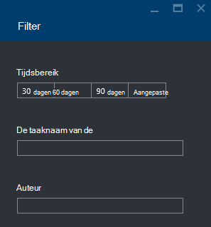

<properties 
   pageTitle="Problemen met Azure gegevens Lake Analytics-taken met behulp van Azure Portal | Azure" 
   description="Informatie over het gebruik van de Azure-Portal om op te lossen gegevens Lake Analytics-taken. " 
   services="data-lake-analytics" 
   documentationCenter="" 
   authors="edmacauley" 
   manager="jhubbard" 
   editor="cgronlun"/>
 
<tags
   ms.service="data-lake-analytics"
   ms.devlang="na"
   ms.topic="article"
   ms.tgt_pltfrm="na"
   ms.workload="big-data" 
   ms.date="05/16/2016"
   ms.author="edmaca"/>

# Problemen met Azure gegevens Lake Analytics-taken met behulp van Azure-Portal

Informatie over het gebruik van de Azure-Portal om op te lossen gegevens Lake Analytics-taken.

In deze zelfstudie wordt u het probleem van een ontbrekende bron bestand instellen en gebruiken van de Azure-Portal naar het probleem op te lossen.

**Vereisten voor**

Voordat u deze zelfstudie begint, hebt u het volgende:

- **Basiskennis van gegevens Lake Analytics vervullen proces**. Zie [aan de slag met Azure gegevens Lake analyses met behulp van Azure-Portal](data-lake-analytics-get-started-portal.md).
- **A gegevens Lake Analytics-account**. Zie [aan de slag met Azure gegevens Lake analyses met behulp van Azure-Portal](data-lake-analytics-get-started-portal.md#create-adl-analytics-account).
- **Kopieer de voorbeeldgegevens naar het standaardaccount voor gegevensopslag Lake**.  Zie [de brongegevens voorbereiden](data-lake-analytics-get-started-portal.md#prepare-source-data)

##Een taak gegevens Lake Analytics verzenden

Nu maakt u een I-SQL-taak met een bestandsnaam ongeldige bron.  

**De taak indienen**

1. In de Portal Azure klikt u op **Microsoft Azure** in de linkerbovenhoek.
2. Klik op de tegel met de naam van uw gegevens Lake Analytics-account.  Dit is hier vastgemaakt wanneer het account is gemaakt.
Als het account niet er vastgemaakt is, raadpleegt u [een account Analytics vanuit-portal openen](data-lake-analytics-manage-use-portal.md#access-adla-account).
3. Klik op **Nieuwe taak** in het bovenste menu.
4. Voer een taaknaam en het volgende I-SQL-script:

        @searchlog =
            EXTRACT UserId          int,
                    Start           DateTime,
                    Region          string,
                    Query           string,
                    Duration        int?,
                    Urls            string,
                    ClickedUrls     string
            FROM "/Samples/Data/SearchLog.tsv1"
            USING Extractors.Tsv();
        
        OUTPUT @searchlog   
            TO "/output/SearchLog-from-adls.csv"
        USING Outputters.Csv();

    Het bronbestand die is gedefinieerd in het script is **/Samples/Data/SearchLog.tsv1**, waar deze bedraagt **/Samples/Data/SearchLog.tsv**.
     
5. Klik op **Taak verzenden** vanaf de bovenkant. Een nieuwe taak detailvenster wordt geopend. Klik op de titelbalk weergegeven om aan ziet deze u de taakstatus. Het duurt een paar minuten om te voltooien. U kunt klikken op **vernieuwen** om de meest recente status.
6. Wacht totdat de taakstatus is gewijzigd in **mislukt**.  Als de taak **geslaagd is**, komt dat doordat u de map /Samples niet verwijderen. Zie de **vereiste** sectie aan het begin van de zelfstudie.

Vraagt u mogelijk worden af - waarom duurt het zo lang voor een kleine project.  Onthoud dat gegevens Lake Analytics is bedoeld voor de verwerking van grote gegevens.  Deze tijdens het verwerken van een grote hoeveelheid gegevens met behulp van de gedistribueerd systeem dat wat.

Laten we wordt ervan uitgegaan dat u de taak heeft ingediend en sluit de portal.  In de volgende sectie leert u hoe u problemen met de taak.

## Problemen met de taak

Klik in de laatste sectie u een taak hebt ingediend en de taak is mislukt.  

**Om alle taken weer te geven**

1. Vanuit de Azure-portal, klikt u op **Microsoft Azure** in de linkerbovenhoek.
2. Klik op de tegel met de naam van uw gegevens Lake Analytics-account.  De taak samenvatting wordt weergegeven op de tegel **Taakbeheer** .

    
    
    De taak Management biedt een overzicht van de taakstatus. U ziet er een mislukte taak.
   
3. Klik op de tegel **Taakbeheer** om te zien van de taken. De taken zijn gecategoriseerd in **uitgevoerd**, **in wachtrij**en **beëindigd**. Er wordt uw mislukte taak in de sectie **beëindigd** . Eerste fase in de lijst moet worden. Wanneer u een groot aantal taken hebt, kunt u klikken op **Filter** waarmee u taken zoeken.

    

4. Klik op de mislukte taak uit de lijst om de taakdetails van de in een nieuwe blade:

    
    
    Zoals u ziet de knop **opnieuw aan te bieden** . Nadat u het probleem opgelost, kunt u de taak opnieuw indienen.

5. Klik op gemarkeerde deel van de vorige schermafbeelding details van de fout te openen.  U dient ongeveer zo zien:

    

    Krijgt u dat de bronmap is niet gevonden.
    
6. Klik op **Script dupliceren**.
7. Het pad **van** een update naar het volgende:

    "/ Samples/Data/SearchLog.tsv"

8. Klik op **taak indienen**.

##Zie ook

- [Azure gegevens Lake Analytics-overzicht](data-lake-analytics-overview.md)
- [Aan de slag met Azure gegevens Lake Analytics via Azure PowerShell](data-lake-analytics-get-started-powershell.md)
- [Aan de slag met Azure gegevens Lake analyses en I-SQL-gebruik van Visual Studio](data-lake-analytics-u-sql-get-started.md)
- [Azure gegevens Lake analyses met behulp van Azure-Portal beheren](data-lake-analytics-manage-use-portal.md)

