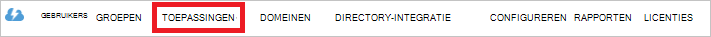

<properties
   pageTitle="Verificatie met Lake gegevensopslag met Active Directory | Microsoft Azure"
   description="Meer informatie over het om te verifiëren met Lake gegevensopslag met Active Directory"
   services="data-lake-store"
   documentationCenter=""
   authors="nitinme"
   manager="jhubbard"
   editor="cgronlun"/>

<tags
   ms.service="data-lake-store"
   ms.devlang="na"
   ms.topic="article"
   ms.tgt_pltfrm="na"
   ms.workload="big-data"
   ms.date="10/17/2016"
   ms.author="nitinme"/>

# Service-naar-serivce verificatie met Lake gegevensopslag met Azure Active Directory

> [AZURE.SELECTOR]
- [Verificatie van de service-naar-service](data-lake-store-authenticate-using-active-directory.md)
- [Eindgebruikers verificatie](data-lake-store-end-user-authenticate-using-active-directory.md)

Azure Lake gegevensopslag Azure Active Directory voor verificatie wordt gebruikt. Voordat u een toepassing die met Azure Lake gegevensopslag of Azure gegevens Lake Analytics werkt (cocreatie), moet u eerst bepalen hoe u wilt verifiëren van uw toepassing met Azure Active Directory (Azure AD). De twee belangrijkste opties die beschikbaar zijn:

* Eindgebruikers verificatie, en 
* Verificatie van de service-naar-service. 

Beide deze opties, resulteert in uw toepassing wordt geleverd met een token OAuth 2.0, die wordt gekoppeld aan elk verzoek om een Azure Lake gegevensopslag of Azure gegevens Lake Analytics aangebracht.

In dit artikel spreekt over hoe u maken een Azure AD-webtoepassing voor verificatie van de service-naar-service. Zie voor instructies voor de configuratie van de Azure AD-toepassing voor eindgebruikers verificatie [eindgebruikers verificatie met Lake gegevensopslag Azure Active Directory](data-lake-store-end-user-authenticate-using-active-directory.md).

## Vereisten voor

* Een Azure-abonnement. Zie [Azure krijgen gratis proefversie](https://azure.microsoft.com/pricing/free-trial/).
* Uw abonnement-ID. U kunt deze ophalen van de Azure-Portal. Bijvoorbeeld: deze beschikbaar is via het blad Lake gegevensopslag-account.

    

* De naam van uw Azure AD-domein. U kunt deze ophalen met de muis in de rechterbovenhoek van de Azure-Portal. In de onderstaande afbeelding ziet de domeinnaam is **contoso.microsoft.com**en de GUID haakjes is de id van de tenant. 

    

## Verificatie van de service-naar-service

Dit is de aanbevolen werkwijze als u wilt dat uw toepassing automatisch verificatie met Azure AD, zonder dat u een eindgebruiker hun referenties op te geven. Uw toepassing is mogelijk om zichzelf te verifiëren voor zolang de referenties zijn geldig, die kan worden aangepast om te worden in de volgorde van jaar.

### Wat moet ik deze methode gebruiken?

* Azure AD-domeinnaam. Hiermee wordt al weergegeven in de vereiste van dit artikel.

* Azure AD- **webtoepassing**.

* Client-ID voor de Azure AD-webtoepassing.

* Geheim client voor de Azure AD-webtoepassing.

* Token eindpunt voor de Azure AD-webtoepassing.

* Toegang voor de webtoepassing Azure AD inschakelen op de de Lake gegevensopslag bestand/tijdelijke map of het gegevens Lake Analytics-account dat u werken wilt met.

Zie voor instructies over het maken van een Azure AD-webtoepassing en configureer deze voor de bovenstaande vereisten, de sectie [een Active Directory-toepassing maken](#create-an-active-directory-application) hieronder aangegeven.

>[AZURE.NOTE] De toepassing Azure AD is al dan niet standaard geconfigureerd voor het gebruik van de client geheim: u uit de Azure AD-toepassing ophalen kunt. Echter als u de toepassing Azure AD gebruik een certificaat in plaats daarvan wilt, moet u de Azure AD-webtoepassing via Azure PowerShell, zoals beschreven op [een service principal met certificaat maken](../resource-group-authenticate-service-principal.md#create-service-principal-with-certificate).

## Een Active Directory-toepassing maken

In deze sectie we meer informatie over het maken en configureren van een Azure AD-webtoepassing voor verificatie van de service-naar-service met Azure Lake gegevensopslag met Azure Active Directory. 

### Stap 1: Een Azure Active Directory-toepassing maken

>[AZURE.NOTE] De volgende stappen uit de Azure-Portal gebruiken. U kunt ook een Azure AD-toepassing via [Azure PowerShell](../resource-group-authenticate-service-principal.md) of [Azure CLI](../resource-group-authenticate-service-principal-cli.md)maken.

1. Meld u aan bij uw Account Azure via de [klassieke portal](https://manage.windowsazure.com/).

2. Selecteer **Active Directory** in het linkerdeelvenster.

     
     
3. Selecteer de Active Directory die u gebruiken wilt voor het maken van de nieuwe toepassing. Als er meer dan één Active Directory, wilt u meestal de toepassing maken in de map waarin uw abonnement staat. U kunt alleen toegang verlenen tot resource in uw abonnement voor toepassingen in dezelfde map als uw abonnement.  

     
    
    
3. Als u wilt de toepassingen weergeven in uw adreslijst, klik op **toepassingen**.

     

4. Als u dit nog niet hebt gemaakt een toepassing in die map voordat u ziet iets vergelijkbaar met de volgende afbeelding. Klik op **een toepassing toevoegen**

     

     Of, klikt u op **toevoegen** in het onderste deelvenster.

     

6. Geef een naam voor de toepassing en selecteer het type van toepassing die u wilt maken. Een **WEB APPLICATION en/of WEB API** maken en klik op de knop volgende voor deze zelfstudie.

     

7. Vul de eigenschappen voor de app. Geef voor **Aanmelding op URL**, de URI naar een website waarop uw toepassing wordt beschreven. De aanwezigheid van de website niet worden gevalideerd. Geef de URI waarmee uw toepassing voor de **APP-ID-URI**.

     

    Klik op het vinkje om te voltooien van de wizard en de toepassing maken.

### Stap 2: Overleg cliënt-id, geheim client en token eindpunt

Wanneer via programmacode aanmelden, moet u de id voor uw toepassing. Als de toepassing wordt uitgevoerd onder een eigen referenties, moet u ook een verificatiesleutel.

1. Klik op het tabblad **configureren** van uw toepassing wachtwoord te configureren.

     

2. Kopieer de **CLIENT-ID**.
  
     

3. Als de toepassing wordt uitgevoerd onder een eigen referenties, schuif omlaag naar de sectie **toetsen** en geef aan hoe lang u wilt uw wachtwoord geldig.

     

4. Selecteer **Opslaan** om uw sleutel te maken.

    

    De opgeslagen sleutel wordt weergegeven en kunt u deze kopiëren. Niet is mogelijk om op te halen de toets later zodat deze nu moet kopiëren.

    

5. Ophalen het token-eindpunt selecteren **weergave eindpunten** onderaan in het scherm en ophalen van de waarde voor **Token 2.0-eindpunt OAuth** -veld, zoals hieronder wordt weergegeven.  

    

### Stap 3: De Azure AD toepassing toewijst aan het accountbestand Azure Lake gegevensopslag of de map (alleen voor verificatie van de service-naar-service)

1. Meld u aan de nieuwe [Azure-Portal](https://portal.azure.com) op en open de gegevensopslag voor Lake Azure-account die u wilt koppelen aan de Azure Active Directory-toepassing die u eerder hebt gemaakt.

1. Klik in uw account Lake gegevensopslag blade, op **Data Explorer**.

    ![Mappen maken in Lake gegevensopslag-account] (./media/data-lake-store-authenticate-using-active-directory/adl.start.data.explorer.png "Mappen maken in gegevens Lake-account")

2. In het blad **Data Explorer** op het bestand of map waarvoor u toegang wilt verlenen met de Azure AD-toepassing en klik vervolgens op **toegang**. Als u wilt configureren toegang tot een bestand, moet u deze **Access** op van het blad **PQ-update** .

    ![ACL's instellen op gegevens Lake bestandssysteem] (./media/data-lake-store-authenticate-using-active-directory/adl.acl.1.png "ACL's instellen op gegevens Lake bestandssysteem")

3. Het **Access** -blad bevat de standaard toegang en aangepaste access al is toegewezen in de hoofdmap. Klik op het pictogram **toevoegen** om toe te voegen ACL's aangepast niveau.

    ![Lijst met standaardkleuren of aangepaste access] (./media/data-lake-store-authenticate-using-active-directory/adl.acl.2.png "Lijst met standaardkleuren of aangepaste access")

4. Klik op het pictogram **toevoegen** om het openen van het blad **Aangepaste Access toevoegen** . In deze blade, klikt u op **gebruiker of groep selecteren**en klik vervolgens in de **gebruiker of groep selecteren** blade, zoekt u de beveiligingsgroep die u eerder in Azure Active Directory gemaakt. Als u een groot aantal groepen om over te zoeken op hebt, gebruikt u het tekstvak aan de bovenkant om te filteren op de naam van de groep. Klik op de groep die u wilt toevoegen en klik vervolgens op **selecteren**.

    ![Een groep toevoegen] (./media/data-lake-store-authenticate-using-active-directory/adl.acl.3.png "Een groep toevoegen")

5. Klik op **Machtigingen selecteren**, selecteert u de machtigingen en of u de machtigingen toewijzen standaard ACL wilt, toegang heeft tot ACL of beide. Klik op **OK**.

    ![Machtigingen toewijzen aan een groep] (./media/data-lake-store-authenticate-using-active-directory/adl.acl.4.png "Machtigingen toewijzen aan een groep")

    Zie voor meer informatie over machtigingen in Lake gegevensopslag en standaard/Access ACL's [Toegangsbeheer in Lake gegevensopslag](data-lake-store-access-control.md).

6. Klik op **OK**in het blad **Aangepaste Access toevoegen** . De toegevoegde groep met de bijbehorende machtigingen worden nu worden vermeld in het **Access** -blad.

    ![Machtigingen toewijzen aan een groep] (./media/data-lake-store-authenticate-using-active-directory/adl.acl.5.png "Machtigingen toewijzen aan een groep") 

## Volgende stappen

In dit artikel u een Azure AD-webtoepassing gemaakt en die worden verzameld door de volgende informatie in uw clienttoepassingen te ontwerpen met .NET SDK, Java SDK, enzovoort. Nu kunt u doorgaan met de volgende artikelen die praat over het gebruik van de Azure AD-webtoepassing eerst worden geverifieerd met Lake gegevensopslag en vervolgens andere bewerkingen uitvoeren op de store.

- [Aan de slag met Azure Lake gegevensopslag met .NET SDK](data-lake-store-get-started-net-sdk.md)
- [Aan de slag met Azure Lake gegevensopslag met Java SDK](data-lake-store-get-started-java-sdk.md)
