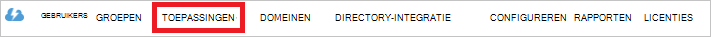

<properties
   pageTitle="Verificatie met Lake gegevensopslag met Active Directory | Microsoft Azure"
   description="Meer informatie over het om te verifiëren met Lake gegevensopslag met Active Directory"
   services="data-lake-store"
   documentationCenter=""
   authors="nitinme"
   manager="jhubbard"
   editor="cgronlun"/>

<tags
   ms.service="data-lake-store"
   ms.devlang="na"
   ms.topic="article"
   ms.tgt_pltfrm="na"
   ms.workload="big-data"
   ms.date="10/17/2016"
   ms.author="nitinme"/>

# Eindgebruikers verificatie met Lake gegevensopslag met Azure Active Directory

> [AZURE.SELECTOR]
- [Verificatie van de service-naar-service](data-lake-store-authenticate-using-active-directory.md)
- [Eindgebruikers verificatie](data-lake-store-end-user-authenticate-using-active-directory.md)

Azure Lake gegevensopslag Azure Active Directory voor verificatie wordt gebruikt. Voordat u een toepassing die met Azure Lake gegevensopslag of Azure gegevens Lake Analytics werkt (cocreatie), moet u eerst bepalen hoe u wilt verifiëren van uw toepassing met Azure Active Directory (Azure AD). De twee belangrijkste opties die beschikbaar zijn:

* Eindgebruikers verificatie, en 
* Verificatie van de service-naar-service. 

Beide deze opties, resulteert in uw toepassing wordt geleverd met een token OAuth 2.0, die wordt gekoppeld aan elk verzoek om een Azure Lake gegevensopslag of Azure gegevens Lake Analytics aangebracht.

In dit artikel spreekt over hoe u maken een Azure AD-webtoepassing voor eindgebruikers verificatie. Zie de [Service-naar-service verificatie met Lake gegevensopslag met behulp van Azure Active Directory](data-lake-store-authenticate-using-active-directory.md)voor instructies voor de configuratie van de Azure AD-toepassingen voor de verificatie van de service-naar-service.

## Vereisten voor

* Een Azure-abonnement. Zie [Azure krijgen gratis proefversie](https://azure.microsoft.com/pricing/free-trial/).
* Uw abonnement-ID. U kunt deze ophalen van de Azure-Portal. Bijvoorbeeld: deze beschikbaar is via het blad Lake gegevensopslag-account.

    

* De naam van uw Azure AD-domein. U kunt deze ophalen met de muis in de rechterbovenhoek van de Azure-Portal. In de onderstaande afbeelding ziet de domeinnaam is **contoso.microsoft.com**en de GUID haakjes is de id van de tenant. 

    

## Eindgebruikers verificatie

Dit is de aanbevolen werkwijze als u wilt dat een eindgebruiker aanmelden bij uw toepassingen via Azure AD. Uw toepassing kunnen Azure informatiebronnen met hetzelfde niveau van access als eindgebruiker die aangemeld. Uw eindgebruikers moeten hun referenties geregeld in volgorde voor uw toepassing te onderhouden van access op te geven.

Het resultaat van de eindgebruiker Meld u aan dat is dat uw toepassing een toegangstoken en een token vernieuwen krijgt. Het toegangstoken wordt toegevoegd aan elk verzoek Lake gegevensopslag of gegevens Lake Analytics en deze geldt voor één uur al dan niet standaard. Het vernieuwen token kan worden gebruikt om een nieuwe toegangstoken verkrijgen en is geldig voor maximaal twee weken standaard als regelmatig gebruikt. U kunt twee verschillende benaderingen voor eindgebruikers log in.

### Gebruik van de pop-up OAuth 2.0

Uw toepassing kan resulteren in een OAuth 2.0 autorisatie voor pop-upvenster waarin de eindgebruiker hun referenties kunt invoeren. In dit pop-upvenster werkt ook met het proces Azure AD tweeledige verificatie (2FA), indien nodig. 

>[AZURE.NOTE] Deze methode wordt nog niet in de Azure AD verificatie bibliotheek (ADAL) voor Python of Java ondersteund.

### Rechtstreeks doorgeven in gebruikersreferenties

Uw toepassing kan rechtstreeks gebruikersreferenties aan Azure AD verstrekt. Deze methode werkt alleen met organisatie-ID-gebruikersaccounts; het is niet compatibel met persoonlijk / gebruikersaccounts "live-ID", waaronder mensen die eindigen op @outlook.com of @live.com. Bovendien is deze methode is niet compatibel met gebruikersaccounts waarvoor Azure AD tweeledige verificatie (2FA).

### Wat moet ik deze methode gebruiken?

* Azure AD-domeinnaam. Hiermee wordt al weergegeven in de vereiste van dit artikel.

* Azure AD- **webtoepassing.**

* Cliënt-ID voor de Azure AD-webtoepassing

* Antwoord URI voor de Azure AD-webtoepassing

* Machtigingen instellen die worden overgedragen

Zie voor instructies over het maken van een Azure AD-webtoepassing en configureer deze voor de bovenstaande vereisten, de sectie [een Active Directory-toepassing maken](#create-an-active-directory-application) hieronder aangegeven. 

## Een Active Directory-toepassing maken

In deze sectie we meer informatie over het maken en configureren van een Azure AD-webtoepassing voor eindgebruikers verificatie met Azure Lake gegevensopslag met Azure Active Directory.

### Stap 1: Een Azure Active Directory-toepassing maken

>[AZURE.NOTE] De volgende stappen uit de Azure-Portal gebruiken. U kunt ook een Azure AD-toepassing via [Azure PowerShell](../resource-group-authenticate-service-principal.md) of [Azure CLI](../resource-group-authenticate-service-principal-cli.md)maken.

1. Meld u aan bij uw Account Azure via de [klassieke portal](https://manage.windowsazure.com/).

2. Selecteer **Active Directory** in het linkerdeelvenster.

     
     
3. Selecteer de Active Directory die u gebruiken wilt voor het maken van de nieuwe toepassing. Als er meer dan één Active Directory, wilt u meestal de toepassing maken in de map waarin uw abonnement staat. U kunt alleen toegang verlenen tot resource in uw abonnement voor toepassingen in dezelfde map als uw abonnement.  

     
    
    
3. Als u wilt de toepassingen weergeven in uw adreslijst, klik op **toepassingen**.

     

4. Als u dit nog niet hebt gemaakt een toepassing in die map voordat u ziet iets vergelijkbaar met de volgende afbeelding. Klik op **een toepassing toevoegen**

     

     Of, klikt u op **toevoegen** in het onderste deelvenster.

     

6. Geef een naam voor de toepassing en selecteer het type van toepassing die u wilt maken. Een **WEB APPLICATION en/of WEB API** maken en klik op de knop volgende voor deze zelfstudie.

     

7. Vul de eigenschappen voor de app. Geef voor **Aanmelding op URL**, de URI naar een website waarop uw toepassing wordt beschreven. De aanwezigheid van de website niet worden gevalideerd. Geef de URI waarmee uw toepassing voor de **APP-ID-URI**.

     

    Klik op het vinkje om te voltooien van de wizard en de toepassing maken.

### Stap 2: Client-id ophalen, URI beantwoorden en gedelegeerde machtigingen instellen

1. Klik op het tabblad **configureren** van uw toepassing wachtwoord te configureren.

     

2. Kopieer de **CLIENT-ID**.
  
     

3. Kopieer de **Antwoord URI**onder de sectie **eenmalige aanmelding** .

    

4. Klik onder **machtigingen voor andere toepassingen**, op **de toepassing toevoegen**

    

5. Klik in de wizard **machtigingen voor andere toepassingen** **Lake van Azure-gegevens** en **Windows** **Azure Service Management API**selecteren en klik op het vinkje.

6. De **Gedelegeerde machtigingen** voor de toegevoegde services is standaard ingesteld op nul. Klik op de **Gedelegeerde machtigingen** vervolgkeuzelijst voor Lake van Azure-gegevens en Windows Azure-beheerservice en schakel de selectievakjes in voor het instellen van de waarden 1 beschikbaar. Het resultaat ziet er als volgt.

     

7. Klik op **Opslaan**.

## Volgende stappen

In dit artikel u een Azure AD-webtoepassing gemaakt en die worden verzameld door de volgende informatie in uw clienttoepassingen te ontwerpen met .NET SDK, Java SDK, enzovoort. Nu kunt u doorgaan met de volgende artikelen die praat over het gebruik van de Azure AD-webtoepassing eerst worden geverifieerd met Lake gegevensopslag en vervolgens andere bewerkingen uitvoeren op de store.

- [Aan de slag met Azure Lake gegevensopslag met .NET SDK](data-lake-store-get-started-net-sdk.md)
- [Aan de slag met Azure Lake gegevensopslag met Java SDK](data-lake-store-get-started-java-sdk.md)
