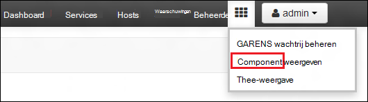
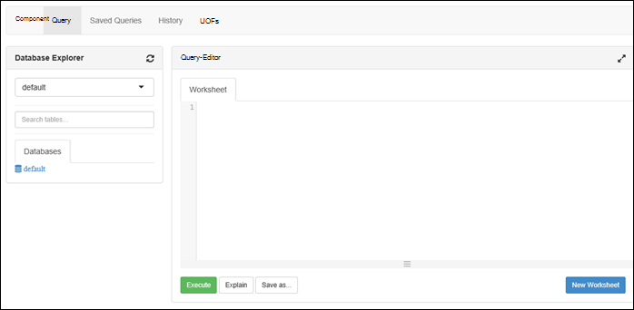

<properties
   pageTitle="HDInsight clusters maken met Azure Lake gegevensopslag met behulp van de portal | Azure"
   description="Azure-Portal maken en gebruiken van HDInsight clusters met Azure Lake gegevensopslag gebruiken"
   services="data-lake-store,hdinsight" 
   documentationCenter=""
   authors="nitinme"
   manager="jhubbard"
   editor="cgronlun"/>

<tags
   ms.service="data-lake-store"
   ms.devlang="na"
   ms.topic="article"
   ms.tgt_pltfrm="na"
   ms.workload="big-data"
   ms.date="10/21/2016"
   ms.author="nitinme"/>

# Maak een HDInsight cluster met Lake gegevensopslag met behulp van Azure-Portal

> [AZURE.SELECTOR]
- [Met behulp van Portal](data-lake-store-hdinsight-hadoop-use-portal.md)
- [Via PowerShell](data-lake-store-hdinsight-hadoop-use-powershell.md)
- [Resourcemanager gebruiken](data-lake-store-hdinsight-hadoop-use-resource-manager-template.md)

Leer hoe u Azure-Portal gebruiken voor het maken van een HDInsight-cluster (Hadoop, HBase, elektrische of Storm) met toegang tot Azure Lake gegevensopslag. Enkele belangrijke overwegingen voor deze release:

* **Voor een clusters (Linux) en Hadoop clusters (Windows en Linux)**, de Lake gegevensopslag kunnen alleen worden gebruikt als een extra opslagruimte-account. Het standaardaccount voor de opslag voor de dergelijke clusters nog steeds Azure opslag BLOB's (WASB).

* **Voor Storm clusters (Windows en Linux)**, de Lake gegevensopslag kan worden gebruikt bij het wegschrijven van gegevens uit een Storm topologie. Gegevensopslag Lake kunnen ook worden gebruikt om op te slaan referentiegegevens vervolgens kan worden gelezen door een Storm topologie. Zie [Gebruiken voor gegevensopslag Lake in een topologie Storm](#use-data-lake-store-in-a-storm-topology)voor meer informatie.

* **Voor HBase clusters (Windows en Linux)**, de Lake gegevensopslag kunnen worden gebruikt als een standaard-opslag, evenals de extra opslagruimte. Zie [Gebruiken voor gegevensopslag Lake met HBase clusters](#use-data-lake-store-with-hbase-clusters)voor meer informatie.

> [AZURE.NOTE] Enkele belangrijke punten met. 
> 
> * Optie voor het maken van HDInsight clusters met toegang tot Lake gegevensopslag is alleen beschikbaar voor HDInsight versie 3,2 en 3.4 (voor Hadoop, HBase en Storm clusters op Windows, evenals Linux). Deze optie is alleen beschikbaar op HDInsight 3.4 clusters voor een kolomgroepen op Linux.
>
> * Bovengenoemde, is Lake gegevensopslag is beschikbaar als de standaard-opslag voor bepaalde clustertypen (HBase) en extra opslagruimte voor andere clustertypen (Hadoop, een, Storm). Gegevensopslag Lake gebruiken als een extra opslagruimte-account heeft geen gevolgen voor prestaties of de mogelijkheid om te lezen/schrijven voor de opslag van het cluster. In een scenario voor waar Lake gegevensopslag wordt gebruikt als extra opslagruimte worden cluster-bestanden (zoals Logboeken, enzovoort) naar de standaard-opslag (Azure BLOB's), geschreven, terwijl de gegevens die u wilt verwerken in een account voor gegevensopslag Lake kan worden opgeslagen.

## Vereisten voor

Voordat u deze zelfstudie begint, hebt u het volgende:

- **Een Azure-abonnement**. Zie [Azure krijgen gratis proefversie](https://azure.microsoft.com/pricing/free-trial/).

- **De gegevensopslag Lake azure-account**. Volg de instructies bij [aan de slag met Azure Lake gegevensopslag met behulp van de Azure-Portal](data-lake-store-get-started-portal.md). 

- **Enkele voorbeeldgegevens bij uw account Azure Lake gegevensopslag uploaden**. Als u het account hebt gemaakt, kunt u de volgende taken als u wilt uploaden enkele voorbeeldgegevens uitvoeren. U moet deze gegevens verderop in deze zelfstudie om uit te voeren taken uit een HDInsight cluster die toegang tot gegevens in de Lake gegevensopslag.

    * [Een map in uw Lake gegevensopslag maken](data-lake-store-get-started-portal.md#createfolder).
    * [Een bestand naar uw Lake gegevensopslag uploaden](data-lake-store-get-started-portal.md#uploaddata). Als u enkele voorbeeldgegevens uploaden zoekt, kunt u de map **Ambulances gegevens** krijgen van de [Azure gegevens Lake cijfer opslagplaats](https://github.com/Azure/usql/tree/master/Examples/Samples/Data/AmbulanceData).

- **Azure Active Directory Service Principal**. Stappen in deze zelfstudie bieden instructies voor het maken van een service principal in Azure AD. U moet wel een Azure AD-beheerder om te kunnen maken van een service principal. Als u een Azure AD-beheerder bent, kunt u deze vereiste overslaan en doorgaan met de zelfstudie.
    
    **Als u niet een Azure AD-beheerder bent**, is het niet mogelijk om uit te voeren de benodigde stappen voor het maken van een service principal. In dat geval moet de beheerder van uw Azure AD eerst een service principal maken voordat u een HDInsight cluster met Lake gegevensopslag kunt maken. Bovendien moet de hoofdsom service worden gemaakt met behulp van een certificaat, zoals beschreven op [een service principal met certificaat maken](../resource-group-authenticate-service-principal.md#create-service-principal-with-certificate).

## Vind u meer sneller met video's?

Bekijk de volgende video's om te begrijpen hoe HDInsight clusters met access naar Lake gegevensopslag inrichten.

* [Maken van een HDInsight cluster met toegang tot Lake gegevensopslag](https://mix.office.com/watch/l93xri2yhtp2)
* Nadat het cluster is ingesteld, [Access-gegevens in Lake gegevensopslag component en varken-scripts gebruiken](https://mix.office.com/watch/1n9g5w0fiqv1q)

## Maken van een HDInsight cluster met toegang tot Azure Lake gegevensopslag

In dit gedeelte maakt u een HDInsight Hadoop-cluster dat de Lake gegevensopslag als een extra opslagruimte gebruikt. In deze release, kan voor een cluster Hadoop Lake gegevensopslag alleen worden gebruikt als een extra opslagruimte voor het cluster. De standaard-opslag nog steeds niet voor de opslag van Azure BLOB's (WASB). Ja, gaan we het opslag-account en Opslagcontainers die zijn vereist voor het cluster eerst maken.

1. Aanmelden bij de nieuwe [Azure-Portal](https://portal.azure.com).

2. Volg de stappen bij [maken Hadoop clusters in HDInsight](../hdinsight/hdinsight-provision-clusters.md#create-using-the-preview-portal) om te beginnen met het inrichten van een cluster HDInsight.

3. Klik op het blad **Optionele configuratie** **Gegevensbron**. Geef de details voor de opslag-account en de container, opslag, **locatie** opgeven als **Oost Amerikaans 2**in het blad **Gegevensbron** en klik op **Cluster AAD identiteit**.

    ![Principal aan HDInsight cluster toevoegen-service] (./media/data-lake-store-hdinsight-hadoop-use-portal/hdi.adl.1.png "Principal aan HDInsight cluster toevoegen-service")

4. Klik op het blad **Cluster AAD identiteit** , kunt u een nieuw account maken of selecteren van een bestaande Service Principal.

    * **Een nieuwe Service Principal maken**

        * In het blad **Cluster AAD identiteit** , klik op **Nieuw** **Service Principal**op en klik vervolgens in het blad **maken van een Service Principal** Verstrek waarden als u wilt maken van een nieuwe service principal. Als onderdeel van die, wordt een certificaat en een Azure Active Directory-toepassing ook gemaakt. Klik op **maken**.

            ![Principal aan HDInsight cluster toevoegen-service] (./media/data-lake-store-hdinsight-hadoop-use-portal/hdi.adl.2.png "Principal aan HDInsight cluster toevoegen-service")

        * Klik op het blad **Cluster AAD identiteit** , klikt u op **Toegang tot het ADLS beheren**. Het deelvenster ziet u de Lake gegevensopslag accounts die zijn gekoppeld aan het abonnement. U kunt echter instellen dat de machtigingen alleen voor het account dat u hebt gemaakt. Selecteer de machtiging lezen/schrijven/uitvoeren voor het account dat u wilt koppelen aan het cluster HDInsight en klik vervolgens op **Machtigingen opslaan**.

            ![Principal aan HDInsight cluster toevoegen-service] (./media/data-lake-store-hdinsight-hadoop-use-portal/hdi.adl.3.png "Principal aan HDInsight cluster toevoegen-service")

        * Klik op het blad **Cluster AAD identiteit** op **Certificaat downloaden** als u wilt downloaden van het certificaat dat is gekoppeld aan de service principal dat u hebt gemaakt. Dit is handig als u de dezelfde service hoofdsom in de toekomst gebruiken wilt tijdens het maken van extra HDInsight clusters. Klik op **selecteren**.

            ![Principal aan HDInsight cluster toevoegen-service] (./media/data-lake-store-hdinsight-hadoop-use-portal/hdi.adl.4.png "Principal aan HDInsight cluster toevoegen-service")

    * **Kies een bestaande Service Principal**

        * In het blad **Cluster AAD identiteit** , klikt u op **bestaande** **Service Principal**op en klik vervolgens in het blad **selecteert u een Service Principal** zoeken naar een bestaande service hoofdsom. Klik op service principal name en klik vervolgens op **selecteren**.

            ![Principal aan HDInsight cluster toevoegen-service] (./media/data-lake-store-hdinsight-hadoop-use-portal/hdi.adl.5.png "Principal aan HDInsight cluster toevoegen-service")

        * Klik op het blad **Cluster AAD identiteit** uploaden van het certificaat (.pfx) dat is gekoppeld aan de service-hoofdsom die u hebt geselecteerd en vervolgens het certificaatwachtwoord opgeven.

5. **Toegang tot het ADLS beheren** op en klik op **bestandsmachtigingen selecteren**. 

    ![Principal aan HDInsight cluster toevoegen-service] (./media/data-lake-store-hdinsight-hadoop-use-portal/hdi.adl.5.existing.save.png "Principal aan HDInsight cluster toevoegen-service")

6. Selecteer in het blad **selecteert u bestandsmachtigingen** in de vervolgkeuzelijst **Account** het account voor gegevensopslag Lake die u wilt dat is gekoppeld aan het cluster HDInsight. Het blad bevat de bestanden en mappen die beschikbaar zijn in het geselecteerde account voor gegevensopslag Lake. 
 
    ![De toegang geven tot Lake gegevensopslag] (./media/data-lake-store-hdinsight-hadoop-use-portal/hdi-adl-permission-1.png "De toegang geven tot Lake gegevensopslag")

    Bepalen daarna de machtigingen om te worden opgegeven voor de geselecteerde bestanden en mappen. Voor mappen, moet u ook opgeven of de machtigingen op de map alleen of naar de map en alle onderliggende items in de map toegepast. U kunt deze selectie maken door de juiste waarde te selecteren in de **Toepassen op** pijl-omlaag. Als u wilt een machtigingsniveau verwijderen, klikt u op het pictogram **verwijderen**

    ![De toegang geven tot Lake gegevensopslag] (./media/data-lake-store-hdinsight-hadoop-use-portal/hdi-adl-permission-2.png "De toegang geven tot Lake gegevensopslag")

    Herhaal deze stappen om de bijbehorende bestanden en mappen uit andere accounts Lake gegevensopslag ook. Wanneer u klaar bent met het wanneer u de machtigingen toewijst, klikt u op **selecteert u** onder aan het blad.

7. Controleer de machtigingen die u hebt opgegeven in het blad **geselecteerde machtigingen toewijzen** en klik op **uitvoeren** als u wilt deze machtigingen verlenen.

    ![De toegang geven tot Lake gegevensopslag] (./media/data-lake-store-hdinsight-hadoop-use-portal/hdi-adl-permission-3.png "De toegang geven tot Lake gegevensopslag")

    De statuskolom geeft de voortgang. Zodra alle machtigingen zijn is toegewezen, klikt u op **Gereed**. 

6. Klik op **selecteren** op de bladen **Cluster AAD-identiteit** en de **Gegevensbron** en gaat u verder met cluster gemaakte, zoals beschreven op [Hadoop maken clusters in HDInsight](../hdinsight/hdinsight-hadoop-create-linux-clusters-portal.md).

7. Nadat de cluster wordt ingericht, kunt u controleren of dat de Service-Principal gekoppeld aan het cluster HDInsight is. Klik op **Cluster AAD identiteit** als u wilt zien van de bijbehorende Service Principal hiertoe, van het blad cluster.

    ![Principal aan HDInsight cluster toevoegen-service] (./media/data-lake-store-hdinsight-hadoop-use-portal/hdi.adl.6.png "Principal aan HDInsight cluster toevoegen-service")

## Testtaken uitvoeren op het cluster HDInsight gebruik van de Azure Lake gegevensopslag

Nadat u een cluster HDInsight hebt geconfigureerd, kunt u testtaken kunt uitvoeren op het cluster om te testen dat het cluster HDInsight toegang hebben tot gegevens in de gegevensopslag Lake Azure. Klik hiervoor wordt we enkele component query's dat doel de Lake gegevensopslag uitvoeren.

### Voor een cluster Linux

1. Open het blad cluster voor het cluster die u zojuist hebt ingericht en klik op **Dashboard**. Hiermee opent u Ambari voor het cluster Linux. Bij het openen van Ambari, wordt u gevraagd om te verifiëren naar de site. De beheerder (standaard-beheerder) Voer de naam en het wachtwoord die u hebt gebruikt bij het maken van het cluster.

    ![Cluster dashboard starten] (./media/data-lake-store-hdinsight-hadoop-use-portal/hdiadlcluster1.png "Cluster dashboard starten")

    U kunt ook rechtstreeks naar Ambari navigeren door te gaan naar https://CLUSTERNAME.azurehdinsight.net in een webbrowser ( **CLUSTERNAAM** is waar de naam van uw cluster HDInsight).

2. Open de component. Selecteer het instellen van de kwadraten in het Paginamenu (naast de koppeling van **beheerder** en de knop aan de rechterkant van de pagina) naar de lijst met beschikbare weergaven. Selecteer de weergave **component** .

    

3. Hier ziet u een pagina ongeveer als volgt uit:

    

4. Plak de volgende HiveQL-instructie in het werkblad in de sectie **Query-Editor** van de pagina:

        CREATE EXTERNAL TABLE vehicles (str string) LOCATION 'adl://mydatalakestore.azuredatalakestore.net:443/mynewfolder'

5. Klik op de knop **uitvoeren** onder aan de **Query-Editor** om de query te starten. Een sectie **Queryresultaten proces** moet worden weergegeven onder de **Query-Editor** en informatie over de taak weergeven.

6. Zodra de query is voltooid, worden de resultaten van de bewerking weergegeven in de sectie **Queryresultaten proces** . Het tabblad **resultaten** moet de volgende gegevens bevatten:

7. Voer de volgende query om te bevestigen dat de tabel is gemaakt.

        SHOW TABLES;

    Het tabblad **resultaten** moet worden weergegeven als:

        hivesampletable
        vehicles

    **voertuigen** is de tabel die u eerder hebt gemaakt. **hivesampletable** is een beschikbaar in alle HDInsight clusters al dan niet standaard voorbeeldtabel.

8. U kunt ook een query om gegevens te halen uit de tabel **voertuigen** uitvoeren.

        SELECT * FROM vehicles LIMIT 5;

### Voor een Windows-cluster

1. Open het blad cluster voor het cluster die u zojuist hebt ingericht en klik op **Dashboard**.

    ![Cluster dashboard starten] (./media/data-lake-store-hdinsight-hadoop-use-portal/hdiadlcluster1.png "Cluster dashboard starten")

    Wanneer u wordt gevraagd, kunt u de beheerdersreferenties invoeren voor het cluster.

2. Hiermee opent u de Query-Console van Microsoft Azure HDInsight. Klik op de **component Editor**.

    ![Open component-editor] (./media/data-lake-store-hdinsight-hadoop-use-portal/hdiadlcluster2.png "Open component-editor")

3. Klik in de Editor component voert u de volgende query en klik op **verzenden**.

        CREATE EXTERNAL TABLE vehicles (str string) LOCATION 'adl://mydatalakestore.azuredatalakestore.net:443/mynewfolder'

    In deze query component we een tabel maken van gegevens die zijn opgeslagen in Lake gegevensopslag bij `adl://mydatalakestore.azuredatalakestore.net:443/mynewfolder`. Deze locatie heeft een voorbeeld van gegevensbestand die u eerder moet hebt geüpload.

    De tabel **Taak sessie** onder ziet u de status van de taak wijzigen van **Bezig met initialiseren**, in **uitgevoerd**, op **voltooid**. U kunt ook klikken op **Details weergeven** voor meer informatie over de voltooide taak.

    ![Tabel maken] (./media/data-lake-store-hdinsight-hadoop-use-portal/hdiadlcluster3.png "Tabel maken")

4. Voer de volgende query om te bevestigen dat de tabel is gemaakt.

        SHOW TABLES;

    Klik op **Details weergeven** overeenkomt met deze query en de uitvoer moet worden weergegeven de volgende handelingen uit:

        hivesampletable
        vehicles

    **voertuigen** is de tabel die u eerder hebt gemaakt. **hivesampletable** is een beschikbaar in alle HDInsight clusters al dan niet standaard voorbeeldtabel.

5. U kunt ook een query om gegevens te halen uit de tabel **voertuigen** uitvoeren.

        SELECT * FROM vehicles LIMIT 5;

## Access Lake gegevensopslag HDFS opdrachten gebruiken

Wanneer u het cluster HDInsight als u wilt gebruiken Lake gegevensopslag hebt geconfigureerd, kunt u de HDFS shell-opdrachten gebruiken voor toegang tot de store.

### Voor een cluster Linux

In dit gedeelte u SSH wordt in het cluster en voer de HDFS-opdrachten. Windows beschikt niet over een ingebouwde SSH-client. We raden u aan **stopverf**, dat kan worden gedownload van [http://www.chiark.greenend.org.uk/~sgtatham/putty/download.html](http://www.chiark.greenend.org.uk/~sgtatham/putty/download.html)gebruiken.

Zie voor meer informatie over het gebruik van stopverf, [Gebruik SSH met Linux gebaseerde Hadoop op HDInsight van Windows](../hdinsight/hdinsight-hadoop-linux-use-ssh-windows.md).

Zodra u verbinding hebt, gebruikt u de volgende opdracht uit HDFS bestandssysteem voor een overzicht van de bestanden in de Lake gegevensopslag.

    hdfs dfs -ls adl://<Data Lake Store account name>.azuredatalakestore.net:443/

Dit moet het bestand dat u eerder hebt geüpload naar de gegevensopslag Lake vermeld.

    15/09/17 21:41:15 INFO web.CaboWebHdfsFileSystem: Replacing original urlConnectionFactory with org.apache.hadoop.hdfs.web.URLConnectionFactory@21a728d6
    Found 1 items
    -rwxrwxrwx   0 NotSupportYet NotSupportYet     671388 2015-09-16 22:16 adl://mydatalakestore.azuredatalakestore.net:443/mynewfolder

U kunt ook de `hdfs dfs -put` aan sommige bestanden uploaden naar de gegevensopslag Lake en gebruikt u de opdracht `hdfs dfs -ls` om te controleren of de bestanden die zijn geüpload.

### Voor een Windows-cluster

1. Aanmelden bij de nieuwe [Azure-Portal](https://portal.azure.com).

2. Klik op **Bladeren**, klikt u op **HDInsight clusters**en klik vervolgens op het HDInsight cluster die u hebt gemaakt.

3. Klik in het blad cluster **Extern bureaublad**op en klik in het blad **Extern bureaublad** op **verbinding maken**.

    ![Externe HDI cluster] (./media/data-lake-store-hdinsight-hadoop-use-portal/ADL.HDI.PS.Remote.Desktop.png "Een resourcegroep Azure maken")

    Wanneer u wordt gevraagd, voert u de referenties die u hebt opgegeven voor de gebruiker van het externe bureaublad.

4. In de externe sessie, start van Windows PowerShell en gebruikt u de HDFS bestandssysteem-opdrachten voor een overzicht van de bestanden in de Azure Lake gegevensopslag.

        hdfs dfs -ls adl://<Data Lake Store account name>.azuredatalakestore.net:443/

    Dit moet het bestand dat u eerder hebt geüpload naar de gegevensopslag Lake vermeld.

        15/09/17 21:41:15 INFO web.CaboWebHdfsFileSystem: Replacing original urlConnectionFactory with org.apache.hadoop.hdfs.web.URLConnectionFactory@21a728d6
        Found 1 items
        -rwxrwxrwx   0 NotSupportYet NotSupportYet     671388 2015-09-16 22:16 adl://mydatalakestore.azuredatalakestore.net:443/mynewfolder

    U kunt ook de `hdfs dfs -put` aan sommige bestanden uploaden naar de gegevensopslag Lake en gebruikt u de opdracht `hdfs dfs -ls` om te controleren of de bestanden die zijn geüpload.

## Gebruik voor gegevensopslag Lake met een cluster

In deze sectie gebruikt u Jupyter notitieblok beschikbaar met HDInsight Spark clusters een taak die gegevens ophaalt uit een gegevensopslag Lake-account dat u die is gekoppeld aan een cluster HDInsight Spark, in plaats van het standaardaccount Azure opslag Blob uit te voeren.

1. Kopieer over enkele voorbeeldgegevens uit het opslag standaardaccount (WASB) die zijn gekoppeld aan het cluster uitgerust met het Azure gegevens Lake store-account dat is gekoppeld aan het cluster. U kunt het [ADLCopy hulpmiddel](http://aka.ms/downloadadlcopy) kunt doen. Download en installeer het hulpmiddel via de koppeling.

2. Open een opdrachtprompt en navigeer naar de map waarin AdlCopy is geïnstalleerd, meestal `%HOMEPATH%\Documents\adlcopy`.

3. Voer de volgende opdracht kopiëren van een specifieke blob van de Broncontainer naar een gegevensopslag Lake:

        AdlCopy /source https://<source_account>.blob.core.windows.net/<source_container>/<blob name> /dest swebhdfs://<dest_adls_account>.azuredatalakestore.net/<dest_folder>/ /sourcekey <storage_account_key_for_storage_container>

    Voor deze zelfstudie, kopieert u de **HVAC.csv** voorbeeld van gegevensbestand bij **/HdiSamples/HdiSamples/SensorSampleData/Aircoschema/** met het account Azure Lake gegevensopslag. Het codefragment ziet er als:

        AdlCopy /Source https://mydatastore.blob.core.windows.net/mysparkcluster/HdiSamples/HdiSamples/SensorSampleData/hvac/HVAC.csv /dest swebhdfs://mydatalakestore.azuredatalakestore.net/hvac/ /sourcekey uJUfvD6cEvhfLoBae2yyQf8t9/BpbWZ4XoYj4kAS5Jf40pZaMNf0q6a8yqTxktwVgRED4vPHeh/50iS9atS5LQ==

    >[AZURE.WARNING] Zorg ervoor dat u die de namen van de bestands- en pad het juiste hoofdlettergebruik zijn.

4. U wordt gevraagd om in te voeren van de referenties voor de Azure abonnement waaronder u uw account voor gegevensopslag Lake hebt. Hier ziet u een uitvoer ongeveer als volgt uit:

        Initializing Copy.
        Copy Started.
        100% data copied.
        Copy Completed. 1 file copied.

    Het gegevensbestand (**HVAC.csv**) worden onder een map **/hvac** in het account voor gegevensopslag Lake gekopieerd.

4. In de [Portal van Azure](https://portal.azure.com/)uit de startboard, klikt u op de tegel voor uw cluster elektrische (als u deze aan de startboard vastgemaakt). U kunt ook naar uw cluster onder **Door alles bladeren**gaan > **HDInsight Clusters**.   

2. Klik op **Snelkoppelingen**uit het blad een cluster, en klik vervolgens op het blad **Cluster Dashboard** op **Jupyter notitieblok**. Als u wordt gevraagd, voert u de beheerdersreferenties voor het cluster.

    > [AZURE.NOTE] U mogelijk ook het notitieblok Jupyter voor uw cluster bereiken door te openen van de volgende URL in uw browser. __CLUSTERNAAM__ vervangen door de naam van uw cluster:
    >
    > `https://CLUSTERNAME.azurehdinsight.net/jupyter`

2. Een nieuw notitieblok maken. Klik op **Nieuw**en klik vervolgens op **PySpark**.

    ![Een nieuw Jupyter-notitieblok maken] (./media/data-lake-store-hdinsight-hadoop-use-portal/hdispark.note.jupyter.createnotebook.png "Een nieuw Jupyter-notitieblok maken")

3. Een nieuw notitieblok is gemaakt en geopend met de naam **Untitled.pynb**. 

4. Omdat u een notitieblok met de kernel PySpark hebt gemaakt, hoeft u niet alle contexten expliciet maken. De contexten elektrische en component wordt automatisch voor u gemaakt wanneer u de eerste cel van de code uitvoert. U kunt starten door te importeren van de typen die is vereist voor dit scenario. Klik hiervoor het volgende codefragment plakken in een cel en druk op **SHIFT + ENTER**.

        from pyspark.sql.types import *
        
    Telkens wanneer u een taak in Jupyter uitvoert, wordt een status **(bezet)** samen met de titel van het notitieblok in uw web browser venstertitel weergegeven. U ziet ook een effen cirkel naast de tekst **PySpark** in de rechterbovenhoek. Nadat de taak is voltooid, wordt deze gewijzigd in een lege cirkel.

     ![Status van een taak Jupyter-notitieblok] (./media/data-lake-store-hdinsight-hadoop-use-portal/hdispark.jupyter.job.status.png "Status van een taak Jupyter-notitieblok")

4. Voorbeeldgegevens in een tijdelijke tabel met behulp van de **HVAC.csv** -bestand dat u hebt gekopieerd naar het account voor gegevensopslag Lake laden. U kunt de gegevens in het gebruik van de volgende URL-patroon Lake gegevensopslag-account kunt openen.

        adl://<data_lake_store_name>.azuredatalakestore.net/<path_to_file>

    In een lege cel het volgende voorbeeld plakken, **MYDATALAKESTORE** vervangen door de naam van uw account voor gegevensopslag Lake en druk op **SHIFT + ENTER**. In dit codevoorbeeld wordt de gegevens naar een tijdelijke tabel **Aircoschema**genoemd.

        # Load the data
        hvacText = sc.textFile("adl://MYDATALAKESTORE.azuredatalakestore.net/hvac/HVAC.csv")
        
        # Create the schema
        hvacSchema = StructType([StructField("date", StringType(), False),StructField("time", StringType(), False),StructField("targettemp", IntegerType(), False),StructField("actualtemp", IntegerType(), False),StructField("buildingID", StringType(), False)])
        
        # Parse the data in hvacText
        hvac = hvacText.map(lambda s: s.split(",")).filter(lambda s: s[0] != "Date").map(lambda s:(str(s[0]), str(s[1]), int(s[2]), int(s[3]), str(s[6]) ))
        
        # Create a data frame
        hvacdf = sqlContext.createDataFrame(hvac,hvacSchema)
        
        # Register the data fram as a table to run queries against
        hvacdf.registerTempTable("hvac")

5. Aangezien u een kernel PySpark gebruikt, kunt u nu rechtstreeks uitvoeren een SQL-query op de tijdelijke tabel **Aircoschema** die u zojuist hebt gemaakt met behulp van de `%%sql` bijzonder. Voor meer informatie over de `%%sql` bijzonder, evenals andere magics beschikbaar voor communicatie met de kernel PySpark, raadpleegt u [Kernels beschikbaar op Jupyter notitieblokken met een HDInsight clusters](hdinsight-apache-spark-jupyter-notebook-kernels.md#why-should-i-use-the-new-kernels).
        
        %%sql
        SELECT buildingID, (targettemp - actualtemp) AS temp_diff, date FROM hvac WHERE date = \"6/1/13\"

5. Nadat de taak is voltooid, wordt het volgende in tabelvorm uitvoer al dan niet standaard weergegeven.

    ![Tabel-uitvoer van de queryresultaten] (./media/data-lake-store-hdinsight-hadoop-use-portal/tabular.output.png "Tabel-uitvoer van de queryresultaten")

    U kunt ook de resultaten bekijken in als u ook andere visualisaties. Een grafiek gebied voor de dezelfde uitvoer er bijvoorbeeld, zoals de volgende.

    ![Gebied grafiek van de queryresultaten] (./media/data-lake-store-hdinsight-hadoop-use-portal/area.output.png "Gebied grafiek van de queryresultaten")

6. Nadat u klaar bent met het uitvoeren van de toepassing, moet u het notitieblok dat u wilt de bronnen vrijgeven afsluiten. Klik hiertoe vanuit het menu **bestand** op het notitieblok, klikt u op **sluiten en stoppen**. Deze uitgeschakeld en het notitieblok sluiten.

## Gebruik voor gegevensopslag Lake in een topologie Storm

U kunt de Lake gegevensopslag gebruiken bij het wegschrijven van gegevens uit een Storm topologie. Zie voor instructies over het bereiken van dit scenario [Gebruik Azure Lake gegevensopslag met Apache Storm met HDInsight](../hdinsight/hdinsight-storm-write-data-lake-store.md).

## Gebruik voor gegevensopslag Lake met HBase clusters

U kunt met HBase kolomgroepen Lake gegevensopslag gebruiken als een standaard-opslag, evenals de extra opslagruimte. Kunt doen:

1.  Selecteer in het blad **Gegevensbron** voor **HBase gegevenslocatie**, **Lake gegevensopslag** .
2.  Selecteer de naam van de Lake gegevensopslag die u wilt gebruiken of maak een nieuwe record.
3.  Ten slotte de **Hoofdmap van HBase** binnen de Lake gegevensopslag opgeven. Als het account voor gegevensopslag Lake geen een hoofdmap, maakt u een nieuwe record.

    ![HBase met Lake gegevensopslag] (./media/data-lake-store-hdinsight-hadoop-use-portal/hbase-data-lake-store.png "Een resourcegroep Azure maken")

### Overwegingen bij het gebruik van Lake gegevensopslag als standaard opslag voor HBase clusters

* Voor meer dan één HBase cluster kunt u hetzelfde Lake gegevensopslag-account. De **Hoofdmap van HBase** die u voor het cluster (stap 4 in de schermopname hierboven opgeeft) moet uniek zijn. U **moet het niet** gebruik de dezelfde hoofdmap over twee verschillende HBase clusters.
* Hoewel u Lake gegevensopslag account als standaard opslag gebruikt, worden de logboekbestanden van HBase cluster in de Azure opslag BLOB's (WASB) die zijn gekoppeld aan het cluster nog steeds opgeslagen. Dit is gemarkeerd in het vak blauw in de schermopname hierboven.

## Zie ook

* [PowerShell: Maak een cluster HDInsight als u wilt gebruiken Lake gegevensopslag](data-lake-store-hdinsight-hadoop-use-powershell.md)

[makecert]: https://msdn.microsoft.com/library/windows/desktop/ff548309(v=vs.85).aspx
[pvk2pfx]: https://msdn.microsoft.com/library/windows/desktop/ff550672(v=vs.85).aspx
