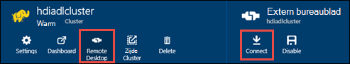

<properties
   pageTitle="HDInsight clusters maken met Azure Lake gegevensopslag resourcemanager sjablonen gebruiken | Microsoft Azure"
   description="Azure resourcemanager sjablonen maken en gebruiken van HDInsight clusters met Azure Lake gegevensopslag gebruiken"
   services="data-lake-store,hdinsight"
   documentationCenter=""
   authors="nitinme"
   manager="jhubbard"
   editor="cgronlun"/>

<tags
   ms.service="data-lake-store"
   ms.devlang="na"
   ms.topic="article"
   ms.tgt_pltfrm="na"
   ms.workload="big-data"
   ms.date="10/21/2016"
   ms.author="nitinme"/>

# <a name="create-an-hdinsight-cluster-with-data-lake-store-using-azure-resource-manager-template"></a>Een HDInsight cluster met Lake gegevensopslag met Azure resourcemanager-sjabloon maken

> [AZURE.SELECTOR] - [Met behulp van Portal](data-lake-store-hdinsight-hadoop-use-portal.md) - [via PowerShell](data-lake-store-hdinsight-hadoop-use-powershell.md) - [Resource Manager gebruiken](data-lake-store-hdinsight-hadoop-use-resource-manager-template.md)

Informatie over het gebruik van een sjabloon Azure resourcemanager voor het configureren van een HDInsight cluster met toegang tot Azure Lake gegevensopslag. Enkele belangrijke overwegingen voor deze release:

-   **Voor een clusters (Linux), en Hadoop/Storm clusters (Windows en Linux)**, de Lake gegevensopslag kunnen alleen worden gebruikt als een extra opslagruimte-account. Het standaardaccount voor de opslag voor de dergelijke clusters nog steeds Azure opslag BLOB's (WASB).

-   **Voor HBase clusters (Windows en Linux)**, de Lake gegevensopslag kunnen worden gebruikt als een standaard-opslag of extra opslagruimte.

> [AZURE.NOTE] Enkele belangrijke punten met.
>
> - Optie voor het maken van HDInsight clusters met toegang tot Lake gegevensopslag is alleen beschikbaar voor HDInsight versie 3,2 en 3.4 (voor Hadoop, HBase en Storm clusters op Windows, evenals Linux). Deze optie is alleen beschikbaar op HDInsight 3.4 clusters voor een kolomgroepen op Linux.
>
> - Bovengenoemde, is Lake gegevensopslag beschikbaar als de standaard-opslag voor bepaalde clustertypen (HBase) en extra opslagruimte voor andere clustertypen (Hadoop, een, Storm). Gegevensopslag Lake gebruiken als een extra opslagruimte-account heeft geen gevolgen voor prestaties of de mogelijkheid om te lezen/schrijven voor de opslag van het cluster. In een scenario voor waar Lake gegevensopslag wordt gebruikt als extra opslagruimte worden cluster-bestanden (zoals Logboeken, enzovoort) naar de standaard-opslag (Azure BLOB's), geschreven, terwijl de gegevens die u wilt verwerken in een account voor gegevensopslag Lake kan worden opgeslagen.
>

In dit artikel inrichten we een Hadoop-cluster met Lake gegevensopslag als extra opslagruimte.

## <a name="prerequisites"></a>Vereisten voor

Voordat u deze zelfstudie begint, hebt u het volgende:

-   **Een Azure-abonnement**. Zie [Azure krijgen gratis proefversie](https://azure.microsoft.com/pricing/free-trial/).

-   **Azure PowerShell 1.0 of groter**. Lees [hoe u installeren en configureren van Azure PowerShell](../powershell-install-configure.md).

- **Azure Active Directory Service Principal**. Stappen in deze zelfstudie bieden instructies voor het maken van een service principal in Azure AD. U moet wel een Azure AD-beheerder om te kunnen maken van een service principal. Als u een Azure AD-beheerder bent, kunt u deze vereiste overslaan en doorgaan met de zelfstudie.
    
    **Als u niet een Azure AD-beheerder bent**, is het niet mogelijk om uit te voeren de benodigde stappen voor het maken van een service principal. In dat geval moet de beheerder van uw Azure AD eerst een service principal maken voordat u een HDInsight cluster met Lake gegevensopslag kunt maken. Bovendien moet de hoofdsom service worden gemaakt met behulp van een certificaat, zoals beschreven op [een service principal met certificaat maken](../resource-group-authenticate-service-principal.md#create-service-principal-with-certificate).

## <a name="create-an-hdinsight-cluster-with-azure-data-lake-store"></a>Maak een HDInsight cluster met Azure Lake gegevensopslag

De sjabloon resourcemanager en de vereisten voor het gebruik van de sjabloon, zijn beschikbaar op GitHub op [Deploy een HDInsight Linux cluster met nieuwe Lake gegevensopslag](https://github.com/Azure/azure-quickstart-templates/tree/master/201-hdinsight-datalake-store-azure-storage). Volg de instructies op deze koppeling om u te maken van een HDInsight cluster met Azure voor gegevensopslag Lake als de extra opslagruimte.

De instructies op de koppeling hierboven genoemde vereisen PowerShell. Controleer voordat u met deze instructies begint, of dat u zich hebt aangemeld bij uw Azure-account. Een nieuw Azure PowerShell-venster openen vanaf uw bureaublad, en voer de volgende fragmenten. Wanneer u wordt gevraagd aan te melden, zorg er dan voor dat u zich hebt aangemeld als een van de admininistrators/eigenaar van het abonnement:

```
# Log in to your Azure account
Login-AzureRmAccount

# List all the subscriptions associated to your account
Get-AzureRmSubscription

# Select a subscription
Set-AzureRmContext -SubscriptionId <subscription ID>
```

## <a name="upload-sample-data-to-the-azure-data-lake-store"></a>Voorbeeldgegevens uploaden naar de Azure Lake gegevensopslag

De sjabloon resourcemanager Hiermee maakt u een nieuw account voor gegevensopslag Lake en koppelt aan het cluster HDInsight. U moet enkele voorbeeldgegevens nu uploaden naar de Lake gegevensopslag. U moet deze gegevens verderop in deze zelfstudie om uit te voeren taken uit een HDInsight cluster die toegang tot gegevens in de Lake gegevensopslag. Zie [een bestand naar uw Lake gegevensopslag uploaden](data-lake-store-get-started-portal.md#uploaddata)voor instructies over het uploaden van gegevens. Als u enkele voorbeeldgegevens uploaden zoekt, kunt u de map **Ambulances gegevens** krijgen van de [Azure gegevens Lake cijfer opslagplaats](https://github.com/Azure/usql/tree/master/Examples/Samples/Data/AmbulanceData).

## <a name="set-relevant-acls-on-the-sample-data"></a>Relevante ACL's instellen voor de voorbeeldgegevens

Om ervoor te zorgen dat de voorbeeldgegevens die u uploaden is toegankelijk zijn vanuit het cluster HDInsight, moet u ervoor zorgen dat de Azure AD-toepassing die wordt gebruikt tot stand brengen van identiteit tussen de HDInsight cluster en Lake gegevensopslag toegang heeft tot het bestand of de map die u probeert te openen. Hiervoor moet u de volgende stappen uitvoeren.

1.  Zoek de naam van de Azure AD-toepassing die is gekoppeld aan HDInsight cluster en de Lake gegevensopslag. Er is een manier om de naam te vinden die het HDInsight cluster blad dat u hebt gemaakt met de sjabloon resourcemanager openen en klikt u op het tabblad **Cluster AAD identiteit** , zoekt u de waarde van **Naam van Service Principal weer te geven**.

2.  Nu, voor toegang tot deze Azure AD-toepassing op het bestand/tijdelijke map die u wilt openen vanaf het cluster HDInsight. Raadpleeg [gegevens beveiligen in Lake gegevensopslag](data-lake-store-secure-data.md#assign-users-or-security-group-as-acls-to-the-azure-data-lake-store-file-system)de juiste ACL's instellen op het bestand/tijdelijke map in Lake gegevensopslag.

## <a name="run-test-jobs-on-the-hdinsight-cluster-to-use-the-data-lake-store"></a>Testtaken uitvoeren op het cluster HDInsight gebruik van de Lake gegevensopslag

Nadat u een cluster HDInsight hebt geconfigureerd, kunt u testtaken kunt uitvoeren op het cluster om te testen of het cluster HDInsight toegang hebt tot Lake gegevensopslag. Klik hiervoor uitgevoerd we een steekproef component taak die een tabel met de voorbeeldgegevens die u eerder hebt geüpload naar uw Lake gegevensopslag maakt.

### <a name="for-a-linux-cluster"></a>Voor een cluster Linux

In deze sectie wordt u SSH in de cluster en uitvoeren de een voorbeeldquery component. Windows beschikt niet over een ingebouwde SSH-client. We raden u aan **stopverf**, dat kan worden gedownload van [http://www.chiark.greenend.org.uk/~sgtatham/putty/download.html](http://www.chiark.greenend.org.uk/~sgtatham/putty/download.html)gebruiken.

Zie voor meer informatie over het gebruik van stopverf, [Gebruik SSH met Linux gebaseerde Hadoop op HDInsight van Windows ](../hdinsight/hdinsight-hadoop-linux-use-ssh-windows.md).

1.  Zodra u verbinding hebt, start u de component CLI met behulp van de volgende opdracht uit:

    ```
    hive
    ```

2.  De CLI gebruikt, voert u de volgende instructies om een nieuwe tabel met de naam **voertuigen** met behulp van de voorbeeldgegevens in de gegevensopslag Lake maken:

    ```
    DROP TABLE vehicles;
    CREATE EXTERNAL TABLE vehicles (str string) LOCATION 'adl://<mydatalakestore>.azuredatalakestore.net:443/';
    SELECT * FROM vehicles LIMIT 10;
    ```

    Hier ziet u een uitvoer ongeveer als volgt uit:

    ```
    1,1,2014-09-14 00:00:03,46.81006,-92.08174,51,S,1
    1,2,2014-09-14 00:00:06,46.81006,-92.08174,13,NE,1
    1,3,2014-09-14 00:00:09,46.81006,-92.08174,48,NE,1
    1,4,2014-09-14 00:00:12,46.81006,-92.08174,30,W,1
    1,5,2014-09-14 00:00:15,46.81006,-92.08174,47,S,1
    1,6,2014-09-14 00:00:18,46.81006,-92.08174,9,S,1
    1,7,2014-09-14 00:00:21,46.81006,-92.08174,53,N,1
    1,8,2014-09-14 00:00:24,46.81006,-92.08174,63,SW,1
    1,9,2014-09-14 00:00:27,46.81006,-92.08174,4,NE,1
    1,10,2014-09-14 00:00:30,46.81006,-92.08174,31,N,1
    ```

### <a name="for-a-windows-cluster"></a>Voor een Windows-cluster

Gebruik de volgende cmdlets uit de component query uit te voeren. In deze query we een tabel maken van de gegevens in de gegevensopslag Lake en voer een selectiequery op de tabel.

```
$queryString = "DROP TABLE vehicles;" + "CREATE EXTERNAL TABLE vehicles (str string) LOCATION 'adl://$dataLakeStoreName.azuredatalakestore.net:443/';" + "SELECT * FROM vehicles LIMIT 10;"

$hiveJobDefinition = New-AzureRmHDInsightHiveJobDefinition -Query $queryString

$hiveJob = Start-AzureRmHDInsightJob -ResourceGroupName $resourceGroupName -ClusterName $clusterName -JobDefinition $hiveJobDefinition -ClusterCredential $httpCredentials

Wait-AzureRmHDInsightJob -ResourceGroupName $resourceGroupName -ClusterName $clusterName -JobId $hiveJob.JobId -ClusterCredential $httpCredentials
```

Dit heeft de volgende uitvoer. **ExitValue** 0 in de uitvoer stappen worden voorgesteld dat de taak is voltooid.

```
Cluster         : hdiadlcluster.
HttpEndpoint    : hdiadlcluster.azurehdinsight.net
State           : SUCCEEDED
JobId           : job_1445386885331_0012
ParentId        :
PercentComplete :
ExitValue       : 0
User            : admin
Callback        :
Completed       : done
```

De uitvoer van de taak ophalen met behulp van de volgende cmdlet:

```
Get-AzureRmHDInsightJobOutput -ClusterName $clusterName -JobId $hiveJob.JobId -DefaultContainer $containerName -DefaultStorageAccountName $storageAccountName -DefaultStorageAccountKey $storageAccountKey -ClusterCredential $httpCredentials
```

De taak-uitvoer lijkt op het volgende:

```
1,1,2014-09-14 00:00:03,46.81006,-92.08174,51,S,1
1,2,2014-09-14 00:00:06,46.81006,-92.08174,13,NE,1
1,3,2014-09-14 00:00:09,46.81006,-92.08174,48,NE,1
1,4,2014-09-14 00:00:12,46.81006,-92.08174,30,W,1
1,5,2014-09-14 00:00:15,46.81006,-92.08174,47,S,1
1,6,2014-09-14 00:00:18,46.81006,-92.08174,9,S,1
1,7,2014-09-14 00:00:21,46.81006,-92.08174,53,N,1
1,8,2014-09-14 00:00:24,46.81006,-92.08174,63,SW,1
1,9,2014-09-14 00:00:27,46.81006,-92.08174,4,NE,1
1,10,2014-09-14 00:00:30,46.81006,-92.08174,31,N,1
```

## <a name="access-data-lake-store-using-hdfs-commands"></a>Access Lake gegevensopslag HDFS opdrachten gebruiken

Wanneer u het cluster HDInsight als u wilt gebruiken Lake gegevensopslag hebt geconfigureerd, kunt u de HDFS shell-opdrachten gebruiken voor toegang tot de store.

### <a name="for-a-linux-cluster"></a>Voor een cluster Linux

In dit gedeelte u SSH wordt in het cluster en voer de HDFS-opdrachten. Windows beschikt niet over een ingebouwde SSH-client. We raden u aan **stopverf**, dat kan worden gedownload van [http://www.chiark.greenend.org.uk/~sgtatham/putty/download.html](http://www.chiark.greenend.org.uk/~sgtatham/putty/download.html)gebruiken.

Zie voor meer informatie over het gebruik van stopverf, [Gebruik SSH met Linux gebaseerde Hadoop op HDInsight van Windows ](../hdinsight/hdinsight-hadoop-linux-use-ssh-windows.md).

Zodra u verbinding hebt, gebruikt u de volgende opdracht uit HDFS bestandssysteem voor een overzicht van de bestanden in de Lake gegevensopslag.

```
hdfs dfs -ls adl://<Data Lake Store account name>.azuredatalakestore.net:443/
```

Dit moet het bestand dat u eerder hebt geüpload naar de gegevensopslag Lake vermeld.

```
15/09/17 21:41:15 INFO web.CaboWebHdfsFileSystem: Replacing original urlConnectionFactory with org.apache.hadoop.hdfs.web.URLConnectionFactory@21a728d6
Found 1 items
-rwxrwxrwx   0 NotSupportYet NotSupportYet     671388 2015-09-16 22:16 adl://mydatalakestore.azuredatalakestore.net:443/mynewfolder
```

U kunt ook de `hdfs dfs -put` aan sommige bestanden uploaden naar de gegevensopslag Lake en gebruikt u de opdracht `hdfs dfs -ls` om te controleren of de bestanden die zijn geüpload.

### <a name="for-a-windows-cluster"></a>Voor een Windows-cluster

1.  Aanmelden bij de nieuwe [Azure-Portal](https://portal.azure.com).

2.  Klik op **Bladeren**, klikt u op **HDInsight clusters**en klik vervolgens op het HDInsight cluster die u hebt gemaakt.

3.  Klik in het blad cluster **Extern bureaublad**op en klik in het blad **Extern bureaublad** op **verbinding maken**.

    

    Wanneer u wordt gevraagd, voert u de referenties die u hebt opgegeven voor de gebruiker van het externe bureaublad.

4.  In de externe sessie, start van Windows PowerShell en gebruikt u de HDFS bestandssysteem-opdrachten voor een overzicht van de bestanden in de Azure Lake gegevensopslag.

    ```
    hdfs dfs -ls adl://<Data Lake Store account name>.azuredatalakestore.net:443/
    ```

    Dit moet het bestand dat u eerder hebt geüpload naar de gegevensopslag Lake vermeld.

    ```
    15/09/17 21:41:15 INFO web.CaboWebHdfsFileSystem: Replacing original urlConnectionFactory with org.apache.hadoop.hdfs.web.URLConnectionFactory@21a728d6
    Found 1 items
    -rwxrwxrwx   0 NotSupportYet NotSupportYet     671388 2015-09-16 22:16 adl://mydatalakestore.azuredatalakestore.net:443/vehicle1_09142014.csv
    ```

    U kunt ook de `hdfs dfs -put` aan sommige bestanden uploaden naar de gegevensopslag Lake en gebruikt u de opdracht `hdfs dfs -ls` om te controleren of de bestanden die zijn geüpload.

## <a name="next-steps"></a>Volgende stappen

-   [Gegevens van Azure opslag BLOB's kopiëren naar Lake gegevensopslag](data-lake-store-copy-data-wasb-distcp.md)
