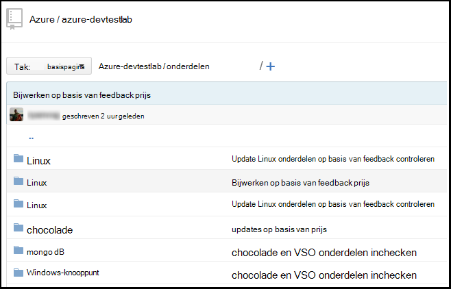
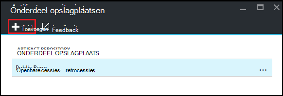
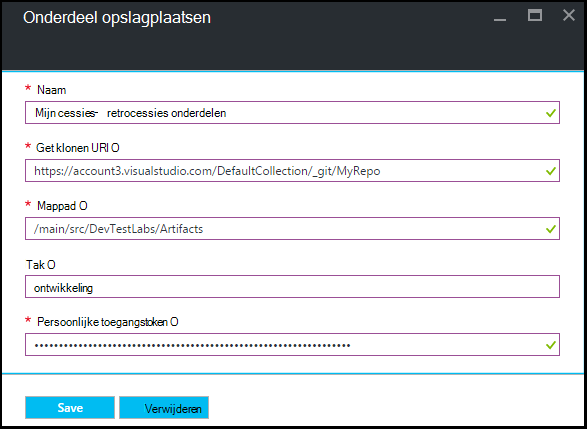

<properties
    pageTitle="De bibliotheek van een cijfer onderdelen toevoegen aan een laboratorium in Azure DevTest Labs | Microsoft Azure"
    description="Een bibliotheek GitHub of Visual Studio Team Services cijfer voor de bron van uw aangepaste onderdelen toevoegen in Azure DevTest Labs"
    services="devtest-lab,virtual-machines,visual-studio-online"
    documentationCenter="na"
    authors="tomarcher"
    manager="douge"
    editor=""/>

<tags
    ms.service="devtest-lab"
    ms.workload="na"
    ms.tgt_pltfrm="na"
    ms.devlang="na"
    ms.topic="article"
    ms.date="09/06/2016"
    ms.author="tarcher"/>

# De bibliotheek van een cijfer onderdeel toevoegen aan een laboratorium in Azure DevTest Labs

> [AZURE.VIDEO how-to-add-your-private-artifacts-repository-in-a-devtest-lab]

In Azure DevTest Labs zijn onderdelen *Acties* - zoals het installeren van de software of actieve scripts en opdrachten - wanneer een VM wordt gemaakt. Standaard bevat een laboratorium onderdelen van de officiële Azure DevTest Labs onderdeel opslagplaats. U kunt een cijfer onderdeel opslagplaats toevoegen aan uw testomgeving om het opnemen van de onderdelen die uw team maakt. De bibliotheek kan worden gehost op [GitHub](https://github.com) of op [Visual Studio Team Services (VSTS)](https://visualstudio.com).

- Zie informatie over het maken van een bibliotheek GitHub, [GitHub Bootcamp](https://help.github.com/categories/bootcamp/).
- Meer informatie over het maken van een Team Services-project met een cijfer opslagplaats, Zie [verbinding maken met Visual Studio Team Services](https://www.visualstudio.com/get-started/setup/connect-to-visual-studio-online).

De volgende schermafbeelding ziet u een voorbeeld van hoe een opslagplaats onderdelen met in GitHub uitzien:  

## De informatie van de bibliotheek en de referenties

Als u wilt de bibliotheek van een onderdeel toevoegen aan uw testomgeving, moet u eerst bepaalde gegevens ophalen uit uw bibliotheek. De volgende secties helpt u bij het ophalen van deze informatie voor onderdeel opslagplaatsen die worden gehost op GitHub en Visual Studio Team Services.

### De GitHub opslagplaats klonen URL en de persoonlijke toegang token ophalen

Als u de GitHub opslagplaats klonen URL en persoonlijke toegangstoken, als volgt te werk:

1. Blader naar de startpagina van de GitHub opslagplaats waarin de definities van het onderdeel.

1. Selecteer **klonen of downloaden**.

1. Selecteer de knop de **HTTPS klonen url** naar het Klembord te kopiëren en sla de URL voor later gebruik.

1. Selecteer de afbeelding profiel in de rechterbovenhoek van GitHub en selecteer **Instellingen**.

1. Selecteer **persoonlijke access tokens**in het menu **persoonlijke instellingen** aan de linkerkant.

1. Selecteer **nieuwe token genereren**.

1. Klik op de pagina **nieuwe persoonlijke toegangstoken** Voer een **Beschrijving van de Token**, accepteer de standaarditems in de **bereiken selecteren**en kies **Token genereren**.

1. Sla de gegenereerde token als u deze later nodig hebt.

1. U kunt nu GitHub sluiten.   

1. Ga verder naar de sectie [verbinding maken met uw testomgeving naar de bibliotheek van het onderdeel](#connect-your-lab-to-the-artifact-repository) .

### De Visual Studio Team Services opslagplaats klonen URL en de persoonlijke toegang token ophalen

Als u de Visual Studio Team Services opslagplaats klonen URL en persoonlijke toegangstoken, als volgt te werk:

1. Open de introductiepagina van de siteverzameling van uw team (bijvoorbeeld `https://contoso-web-team.visualstudio.com`), en selecteer vervolgens het project onderdelen.

1. Selecteer op de introductiepagina van het project, **Code**.

1. Als u wilt de URL klonen, op de pagina van het project- **Code** weergeven, selecteert u **klonen**.

1. Sla de URL als u deze later in deze zelfstudie nodig hebt.

1. Als u wilt een persoonlijke Access Token hebt gemaakt, selecteert u **het profiel van mijn** in het menu gebruiker account vervolgkeuzelijst.

1. Selecteer op de profielpagina gegevens, **beveiliging**.

1. Selecteer **toevoegen**op het tabblad **beveiliging** .

1. Op de pagina **een persoonlijke toegangstoken maken** :

    - Voer een **Beschrijving** voor de token.
    - Selecteer **180 dagen** in de lijst **Verloopt In** .
    - Kies **alle toegankelijke accounts** in de lijst met **Accounts** .
    - Kies de optie **alle bereiken** .
    - Kies **Token maken**.

1. Wanneer u klaar bent, wordt het nieuwe token weergegeven in de lijst **Persoonlijke Access Tokens** . Selecteer **Token kopiëren**en slaat u de waarde voor token voor later gebruik.

1. Ga verder naar de sectie [verbinding maken met uw testomgeving naar de bibliotheek van het onderdeel](#connect-your-lab-to-the-artifact-repository) .

##Verbinding maken met uw testomgeving naar het onderdeel-bibliotheek

1. Meld u aan bij de [portal van Azure](http://go.microsoft.com/fwlink/p/?LinkID=525040).

1. Selecteer **Meer Services**en selecteer vervolgens **DevTest Labs** in de lijst.

1. In de lijst met labs, selecteer de gewenste testomgeving.   

1. Klik op van de testomgeving blade, selecteer **configuratie**.

1. Selecteer **Onderdelen opslagplaatsen**op van de testomgeving **configuratie** blade.

1. Selecteer op het blad **Onderdelen opslagplaatsen** **+ toevoegen**.

    
 
1. Klik op het tweede **Onderdelen opslagplaatsen** blad, geef het volgende:

    - **Naam** - Voer een naam voor de bibliotheek.
    - **Cijfer klonen Url** - voert u de Git HTTPS klonen URL die u eerder hebt gekopieerd uit GitHub of Visual Studio Team Services. 
    - **Mappad** - Voer het mappad ten opzichte van de klonen-URL met uw definities onderdeel.
    - **Tak** - Geef de tak om uw definities onderdelen.
    - **Persoonlijke Access Token** - Voer het persoonlijke toegangstoken die u eerder hebt aangeschaft bij GitHub of Visual Studio Team Services. 
     
    

1. Selecteer **Opslaan**.

[AZURE.INCLUDE [devtest-lab-try-it-out](../../includes/devtest-lab-try-it-out.md)]

## Gerelateerde blogberichten
- [Problemen met verbroken onderdelen in AzureDevTestLabs](http://www.visualstudiogeeks.com/blog/DevOps/How-to-troubleshoot-failing-artifacts-in-AzureDevTestLabs)
- [Deelnemen aan een VM naar bestaande AD-domein ARM sjabloon gebruiken in Azure ontwikkelaar-testomgeving](http://www.visualstudiogeeks.com/blog/DevOps/Join-a-VM-to-existing-AD-domain-using-ARM-template-AzureDevTestLabs)