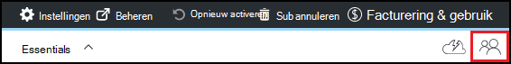

<properties
    pageTitle="Eigenaren en gebruikers toevoegen in Azure DevTest Labs | Microsoft Azure"
    description="Eigenaren en gebruikers toevoegen in Azure DevTest Labs via de portal van Azure- of PowerShell"
    services="devtest-lab,virtual-machines"
    documentationCenter="na"
    authors="tomarcher"
    manager="douge"
    editor=""/>

<tags
    ms.service="devtest-lab"
    ms.workload="na"
    ms.tgt_pltfrm="na"
    ms.devlang="na"
    ms.topic="article"
    ms.date="09/12/2016"
    ms.author="tarcher"/>

# Eigenaren en gebruikers toevoegen in Azure DevTest Labs

> [AZURE.VIDEO how-to-set-security-in-your-devtest-lab]

Toegang in Azure DevTest Labs wordt beheerd door [Azure Role-Based Access besturingselement RBAC ()](../active-directory/role-based-access-control-what-is.md). RBAC gebruikt, kunt u taken in uw team scheiden in *rollen* , waar u alleen het bedrag van access die nodig zijn om gebruikers om hun werk te verlenen. Drie van deze rollen RBAC zijn *eigenaar*, *DevTest Labs gebruiker*en *Inzender*. In dit artikel leert u welke acties kunnen worden uitgevoerd in elk van de drie belangrijkste RBAC rollen. Daar leert u hoe u gebruikers toevoegen aan een laboratorium - via de portal zowel via een PowerShell-script, en hoe u gebruikers kunt toevoegen op het niveau van abonnement.

## Acties die kunnen worden uitgevoerd in elke rol

Er zijn drie belangrijkste rollen dat u aan een gebruiker toewijzen kunt:

- Eigenaar
- DevTest Labs gebruiker
- Inzender

De volgende tabel ziet u de acties die kunnen worden uitgevoerd door gebruikers in elk van deze rollen:

| **Gebruikers van de acties in deze rol kunnen uitvoeren** | **DevTest Labs gebruiker**            | **Eigenaar** | **Inzender** |
|---|---|---|---|
| **Testomgeving taken**                          |                              |       |             |
| Gebruikers toevoegen aan een testomgeving                     | Nee                           | Ja   | Nee          |
| Kosten-instellingen bijwerken                   | Nee                           | Ja   | Ja         |
| **VM basis taken**                      |                              |       |             |
| Toevoegen en verwijderen van aangepaste afbeeldingen           | Nee                           | Ja   | Ja         |
| Toevoegen, bijwerken en verwijderen van formules       | Ja                          | Ja   | Ja         |
| "Witte" lijst Azure Marketplace-afbeeldingen     | Nee                           | Ja   | Ja         |
| **VM taken**                           |                              |       |             |
| VMs maken                             | Ja                          | Ja   | Ja         |
| Starten, stoppen en VMs verwijderen            | Alleen de VMs die zijn gemaakt door de gebruiker | Ja   | Ja         |
| VM beleid bijwerken                     | Nee                           | Ja   | Ja         |
| Gegevensschijven VMs/naar toevoegen/verwijderen      | Alleen de VMs die zijn gemaakt door de gebruiker | Ja   | Ja         |
| **Onderdeel taken**                     |                              |       |             |
| Toevoegen en verwijderen van onderdeel opslagplaatsen   | Nee                           | Ja   | Ja         |
| Onderdelen toepassen                        | Ja                          | Ja   | Ja         |

> [AZURE.NOTE] Wanneer een gebruiker een VM maakt, wordt die gebruiker automatisch toegewezen aan de rol van de **eigenaar** van de gemaakte VM.

## Voeg een eigenaar of de gebruiker op het niveau van de testomgeving

Eigenaren en gebruikers kunnen worden toegevoegd op het niveau van de testomgeving via de portal van Azure. Dit geldt ook voor externe gebruikers met een geldige [Microsoft-account (MSA)](devtest-lab-faq.md#what-is-a-microsoft-account).
De volgende stappen begeleiden u bij het proces van het toevoegen van een eigenaar of de gebruiker aan een laboratorium in Azure DevTest Labs:

1. Meld u aan bij de [portal van Azure](http://go.microsoft.com/fwlink/p/?LinkID=525040).

1. Selecteer **meer services**en selecteer vervolgens **DevTest Labs** in de lijst.

1. In de lijst met labs, selecteer de gewenste testomgeving.

1. Klik op van de testomgeving blade, selecteer **configuratie**. 

1. Selecteer de **gebruikers**op het blad **configuratie** .

1. Selecteer op het blad **gebruikers** **+ toevoegen**.

    

1. Selecteer de gewenste rol op het blad **selecteert u een rol** . De sectie [acties die kunnen worden uitgevoerd in elke rol](#actions-that-can-be-performed-in-each-role) worden de verschillende bewerkingen die door gebruikers in de eigenaar, DevTest gebruikers en rollen Inzender kunnen worden uitgevoerd.

1. Klik op het blad **gebruikers toevoegen** , voer het e-mailadres of de naam van de gebruiker die u wilt toevoegen in de rol die u hebt opgegeven. Als de gebruiker kan niet worden gevonden, wordt het probleem uitgelegd in een foutbericht wordt weergegeven. Als de gebruiker wordt gevonden, is deze gebruiker wordt vermeld en geselecteerd. 

1. Selecteer **selecteren**.

1. Selecteer **OK** om te sluiten van het blad **toevoegen access** .

1. Wanneer u naar het blad **gebruikers teruggaat** , is de gebruiker toegevoegd.  

## Een externe gebruiker toevoegen aan een laboratorium via PowerShell

Naast het toevoegen van gebruikers in de portal van Azure, kunt u een externe gebruiker toevoegen aan uw testomgeving met een PowerShell-script. In het volgende voorbeeld, wijzigt u gewoon de parameterwaarden onder de opmerking **waarden om te wijzigen** .
U kunt ophalen de `subscriptionId`, `labResourceGroup`, en `labName` waarden uit het blad testomgeving in de portal van Azure.

> [AZURE.NOTE]
> Het voorbeeldscript wordt ervan uitgegaan dat de opgegeven gebruiker als gast is toegevoegd aan de Active Directory en, als dit niet het geval is mislukt. Voeg een gebruiker niet in de Active Directory naar een, via de portal van Azure toewijzen aan de gebruiker aan een rol zoals in de sectie [toevoegen een eigenaar of de gebruiker op het niveau van de testomgeving](#add-an-owner-or-user-at-the-lab-level).   

    # Add an external user in DevTest Labs user role to a lab
    # Ensure that guest users can be added to the Azure Active directory:
    # https://azure.microsoft.com/en-us/documentation/articles/active-directory-create-users/#set-guest-user-access-policies

    # Values to change
    $subscriptionId = "<Enter Azure subscription ID here>"
    $labResourceGroup = "<Enter lab's resource name here>"
    $labName = "<Enter lab name here>"
    $userDisplayName = "<Enter user's display name here>"

    # Log into your Azure account
    Login-AzureRmAccount
    
    # Select the Azure subscription that contains the lab. 
    # This step is optional if you have only one subscription.
    Select-AzureRmSubscription -SubscriptionId $subscriptionId
    
    # Retrieve the user object
    $adObject = Get-AzureRmADUser -SearchString $userDisplayName
    
    # Create the role assignment. 
    $labId = ('subscriptions/' + $subscriptionId + '/resourceGroups/' + $labResourceGroup + '/providers/Microsoft.DevTestLab/labs/' + $labName)
    New-AzureRmRoleAssignment -ObjectId $adObject.Id -RoleDefinitionName 'DevTest Labs User' -Scope $labId

## Voeg een eigenaar of de gebruiker op het niveau van abonnement

Azure machtigingen worden doorgegeven door bovenliggende bereik naar een bereik van de onderliggende in Azure wordt aangegeven. Eigenaren van een Azure-abonnement met labs zijn er daarom automatisch eigenaren van deze labs. Ze ook de eigenaar bent van het VMs en andere resources die zijn gemaakt door gebruikers van de testomgeving en de Azure DevTest Labs-service. 

U kunt extra eigenaren toevoegen aan een laboratorium via een van de testomgeving blade in de [portal van Azure](http://go.microsoft.com/fwlink/p/?LinkID=525040). De toegevoegde eigenaar bereik van beheer is echter meer smalle dan het bereik van de eigenaar van het abonnement. Bijvoorbeeld de toegevoegde eigenaren geen volledige toegang tot enkele van de resources die zijn gemaakt in het abonnement door de service DevTest Labs. 

Als u wilt een eigenaar toevoegen aan een Azure-abonnement, de volgende stappen uit:

1. Meld u aan bij de [portal van Azure](http://go.microsoft.com/fwlink/p/?LinkID=525040).

1. Selecteer **Meer Services**en selecteer vervolgens **abonnementen** in de lijst.

1. Selecteer het gewenste abonnement.

1. Selecteer de **Access** -pictogram. 

    

1. Selecteer op het blad **gebruikers** **toevoegen**.

    

1. Selecteer op het blad **selecteert u een rol** **eigenaar**.

1. Klik op het blad **gebruikers toevoegen** , voer het e-mailadres of de naam van de gebruiker die u wilt toevoegen als een eigenaar. Als de gebruiker kan niet worden gevonden, krijgt u een foutbericht weergegeven waarin wordt uitgelegd dat het probleem. Als de gebruiker wordt gevonden, wordt deze gebruiker wordt vermeld onder het tekstvak van de **gebruiker** .

1. Selecteer de gebruikersnaam bevindt.

1. Selecteer **selecteren**.

1. Selecteer **OK** om te sluiten van het blad **toevoegen access** .

1. Wanneer u naar het blad **gebruikers teruggaat** , heeft de gebruiker zijn toegevoegd als een eigenaar. Deze gebruiker is nu een eigenaar van een labs gemaakt onder dit abonnement, en dus mogen eigenaar taken uitvoeren. 

[AZURE.INCLUDE [devtest-lab-try-it-out](../../includes/devtest-lab-try-it-out.md)]
