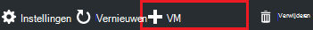
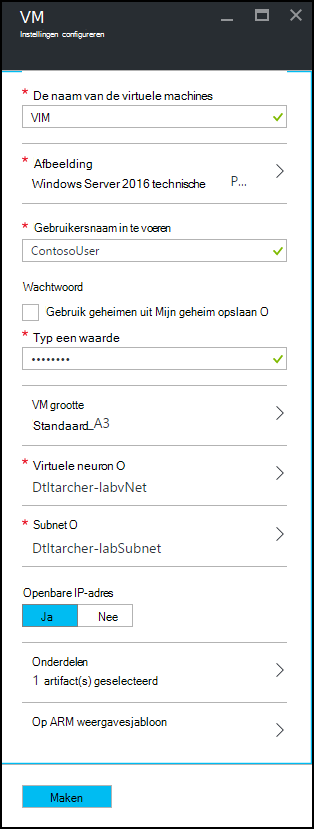
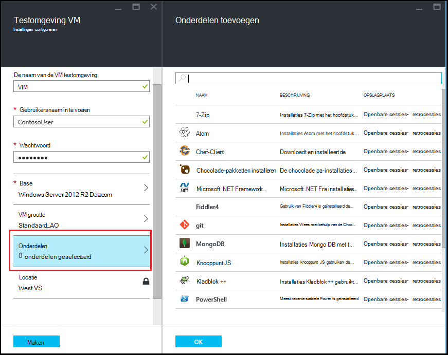
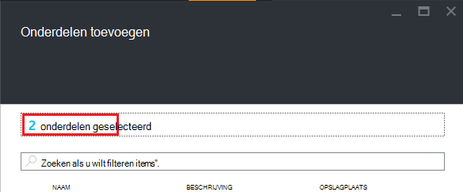

<properties
    pageTitle="Een VM met onderdelen toevoegen aan een laboratorium in Azure DevTest Labs | Microsoft Azure"
    description="Informatie over het toevoegen van een VM met onderdelen in Azure DevTest Labs"
    services="devtest-lab,virtual-machines"
    documentationCenter="na"
    authors="tomarcher"
    manager="douge"
    editor=""/>

<tags
    ms.service="devtest-lab"
    ms.workload="na"
    ms.tgt_pltfrm="na"
    ms.devlang="na"
    ms.topic="article"
    ms.date="08/30/2016"
    ms.author="tarcher"/>

# Een VM met onderdelen toevoegen aan een laboratorium in Azure DevTest Labs

> [AZURE.VIDEO how-to-create-vms-with-artifacts-in-a-devtest-lab]

U kunt een VM maken in een laboratorium uit een *grondtal* die is een [aangepaste afbeelding](./devtest-lab-create-template.md), een [formule](./devtest-lab-manage-formulas.md)of een [afbeelding van de Marketplace](./devtest-lab-configure-marketplace-images.md).

DevTest Labs *onderdelen* kunt u opgeven van de *Acties* die worden uitgevoerd wanneer de VM wordt gemaakt. 

Onderdeel acties kunnen procedures zoals actieve Windows PowerShell-scripts, we vaker doen opdrachten uitvoeren en installatie van de software uitvoeren. 

Onderdeel *parameters* kunt u het onderdeel voor uw specifieke scenario aanpassen.

In dit artikel leest u hoe u een VM maakt in uw testomgeving met onderdelen.

## Een VM met onderdelen toevoegen

1. Meld u aan bij de [portal van Azure](http://go.microsoft.com/fwlink/p/?LinkID=525040).

1. Selecteer **Meer Services**en selecteer vervolgens **DevTest Labs** in de lijst.

1. Selecteer in de lijst met labs, een testomgeving waarin u wilt maken van de VM.  

1. Selecteer **+ VM**op van de testomgeving **Overzicht** blade.  
    

1. Selecteer op het blad **kiezen een basis** een basis voor VM.

1. Voer een naam voor de nieuwe virtuele machine in het tekstvak **de naam van de virtuele machine** op het blad **VM** .

    

1. Voer een **Gebruikersnaam in te voeren** dat beheerdersbevoegdheden op de virtuele machine wordt verleend.  

1. Als u gebruiken van een wachtwoord die zijn opgeslagen in uw *geheime store wilt*, selecteert u **Gebruik geheimen vanuit Mijn geheime store**en de waarde van een sleutel die met uw geheim (wachtwoord overeenkomt) opgeven. Gewoon anders een wachtwoord opgeven in het tekstvak **Voer een waarde in**het label.
 
1. Selecteer **VM grootte** en selecteer een van de vooraf gedefinieerde items die Geef de processorcores, RAM grootte en de grootte van de harde schijf van de VM maken.

1. Selecteer **virtuele netwerk** en selecteer het gewenste virtuele netwerk.

1. Selecteer **Subnet** en selecteer subnet.

1. Als het beleid testomgeving is ingesteld op toestaan openbare IP-adressen voor het geselecteerde subnet, Geef op of u het IP-adres als public door **Ja** of **Nee**te selecteren. Anders is deze optie uitgeschakeld en als **geen**hebt geselecteerd. 

1. Selecteer **onderdelen** en - in de lijst met onderdelen - en configureren van de onderdelen die u wilt toevoegen aan de afbeelding. 
**Notitie:** Als u geen ervaring met DevTest Labs of configureren onderdelen hebt, gaat u verder met de sectie [toevoegen een bestaande onderdeel voor een VM](#add-an-existing-artifact-to-a-vm) en Ga terug hier wanneer u klaar bent.

1. Als u wilt bekijken of de sjabloon Azure resourcemanager kopiëren, gaat u verder met het gedeelte [sjabloon Azure resourcemanager opslaan](#save-arm-template) en hier retourneren wanneer u klaar bent.

1. Selecteer **maken** de opgegeven VM toevoegen aan een testomgeving.

1. Het blad testomgeving geeft de status van van de VM maken; eerst als **maken**, klikt u vervolgens **uitgevoerd** nadat de VM is gestart.

1. Ga naar de sectie van de [Volgende stappen](#next-steps) . 

## Een bestaande onderdeel toevoegen aan een VM

Tijdens het maken van een VM, kunt u bestaande onderdelen toevoegen. Elke testomgeving bevat onderdelen van de openbare DevTest Labs onderdeel opslagplaats, evenals de onderdelen die u hebt gemaakt en toegevoegd aan uw eigen opslagplaats onderdeel.
Als u wilt ontdekken hoe u onderdelen maakt, raadpleegt u het artikel [Leer hoe u uw eigen onderdelen voor gebruik met DevTest Labs auteur](devtest-lab-artifact-author.md).

1. Selecteer op het blad **VM** **onderdelen**. 

1. Selecteer het gewenste onderdeel op het blad **onderdelen toevoegen** .  

    

1. Voer de vereiste parameterwaarden en een optionele parameters die u nodig hebt.  

1. Selecteer **toevoegen** aan het onderdeel toevoegen aan en Ga terug naar het blad **Onderdelen toevoegen** .

1. Doorgaan met het toevoegen van onderdelen zo nodig voor uw VM.

1. Nadat u uw onderdelen hebt toegevoegd, kunt u [de volgorde wijzigen waarin de onderdelen worden uitgevoerd](#change-the-order-in-which-artifacts-are-run). U kunt ook teruggaan naar [weergeven of wijzigen van een onderdeel](#view-or-modify-an-artifact).

## De volgorde wijzigen waarin onderdelen worden uitgevoerd

Standaard de acties van de onderdelen uitgevoerd in de volgorde waarin ze zijn toegevoegd aan de VM. De volgende stappen wordt uitgelegd hoe de volgorde wijzigen waarin de onderdelen worden uitgevoerd.

1. Aan de bovenkant van het blad **Onderdelen toevoegen** , selecteert u de koppeling die het aantal onderdelen die zijn toegevoegd aan de VM aangeeft.

    

1. Als u de volgorde waarin de onderdelen worden uitgevoerd, slepen en neerzetten van de onderdelen in de gewenste volgorde. **Notitie:** Hebt u problemen bij het onderdeel slepen, zorg dat u vanaf de linkerkant van het onderdeel sleept. 

1. Selecteer **OK** wanneer u klaar bent.  

## Weergeven of wijzigen van een onderdeel

De volgende stappen wordt uitgelegd hoe weergeven of wijzigen van de parameters van een onderdeel:

1. Aan de bovenkant van het blad **Onderdelen toevoegen** , selecteert u de koppeling die het aantal onderdelen die zijn toegevoegd aan de VM aangeeft.

    

1. Selecteer het onderdeel dat u wilt bekijken of te bewerken op het blad **Onderdelen geselecteerd** .  

1. Breng de gewenste wijzigingen op het blad **Onderdelen toevoegen** en selecteer **OK** om te sluiten van het blad **Onderdeel toevoegen** .

1. Selecteer **OK** om te sluiten van het blad **Onderdelen geselecteerd** .

## Azure resourcemanager sjabloon opslaan

Een sjabloon Azure resourcemanager biedt een declaratieve manier definiëren van een herhaald implementatie. De volgende stappen wordt uitgelegd hoe om op te slaan de Azure resourcemanager-sjabloon voor VM wordt gemaakt.
Zodra u hebt opgeslagen, kunt u de sjabloon Azure resourcemanager [nieuwe VMs met Azure PowerShell](../azure-resource-manager/resource-group-overview.md#template-deployment)implementeren.

1. Selecteer op het blad **VM** **ARM weergavesjabloon**.

1. Klik op het **weergavesjabloon Azure resourcemanager blade**, selecteert u de sjabloontekst.

1. De geselecteerde tekst naar het Klembord kopiëren.

1. Selecteer **OK** om te sluiten van het **weergavesjabloon Azure resourcemanager blade**.

1. Open een teksteditor.

1. In de sjabloontekst vanaf het Klembord plakken.

1. Sla het bestand voor later gebruik.

[AZURE.INCLUDE [devtest-lab-try-it-out](../../includes/devtest-lab-try-it-out.md)]

## Volgende stappen

- Zodra de VM is gemaakt, kunt u de VM verbinden door te **verbinden** op van de VM blade selecteren.
- Informatie over het [maken van aangepaste onderdelen voor uw DevTest Labs VM](devtest-lab-artifact-author.md).
- De [galerie met sjablonen van DevTest Labs ARM QuickStart](https://github.com/Azure/azure-devtestlab/tree/master/ARMTemplates) verkennen